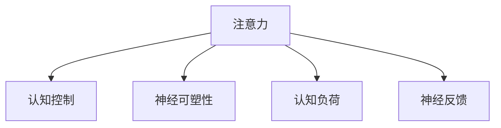

                 

# 注意力训练与大脑健康改善实践：通过专注力增强认知能力

> 关键词：注意力训练, 认知能力增强, 大脑健康, 专注力提升, 认知负荷管理, 神经网络

## 1. 背景介绍

### 1.1 问题由来

在现代社会中，人们面临的信息量和认知负荷比以往任何时候都要大。从海量电子邮件、社交媒体到日常工作中的复杂决策，都对大脑的注意力和认知能力提出了更高的要求。然而，长时间的工作和学习容易导致注意力分散、疲劳和记忆力下降，进而影响整体认知功能。因此，如何通过科学的方法训练和改善大脑注意力，提升认知能力，成为当前研究的热点问题。

### 1.2 问题核心关键点

注意力训练的核心是提高大脑的神经可塑性，即通过特定的训练任务，改变大脑神经元之间的连接强度和突触传递效率。神经科学研究表明，注意力训练可以通过强化与注意力相关的脑区（如前额叶、顶叶等），提升个体的认知控制能力和注意力集中度。

基于这一原理，当前市面上的注意力训练工具和方法多种多样，包括神经反馈(Neurofeedback)、认知训练(Cognitive Training)、正念冥想(Mindfulness Meditation)、视频游戏(Educational Video Games)等。这些方法虽然各有优劣，但核心目标都是通过训练提升大脑的注意力和认知能力，进而改善心理健康和工作效率。

### 1.3 问题研究意义

注意力训练和大脑健康改善实践具有重要的研究意义和应用前景：

1. 提升认知能力。注意力训练能够改善大脑的执行功能、记忆力和问题解决能力，对老年人和认知障碍患者尤为重要。
2. 改善心理健康。通过减轻认知负荷和提升注意力集中度，可以有效缓解焦虑、抑郁等心理问题。
3. 促进教育和学习。儿童青少年可以通过注意力训练提高学习能力，减少注意力缺陷障碍(ADHD)等问题的发生率。
4. 增强工作效率。在职场中，注意力训练可以提高决策效率和工作质量，减少工作压力和职业倦怠。
5. 优化生活习惯。注意力训练有助于改善睡眠、饮食和生活习惯，提升整体生活质量。

## 2. 核心概念与联系

### 2.1 核心概念概述

为更好地理解注意力训练的原理和实践方法，本节将介绍几个密切相关的核心概念：

- 注意力(Attention)：大脑处理信息时的一种选择性机制，通过聚焦于相关信息，而忽视无关信息，提高信息处理效率。
- 认知控制(Cognitive Control)：大脑执行高阶认知任务（如规划、决策、监控）的能力，涉及前额叶和顶叶等关键脑区。
- 神经可塑性(Neural Plasticity)：大脑在经历外界刺激时，通过突触强度的变化，改变神经网络结构和功能的过程。
- 认知负荷(Cognitive Load)：个体在信息处理过程中，需要投入的心理资源量，过多认知负荷会导致注意力分散和记忆下降。
- 神经反馈(Neurofeedback)：通过监测大脑活动，实时调整训练任务，增强与注意力相关的脑区活动，提升认知控制能力。

这些核心概念之间的逻辑关系可以通过以下Mermaid流程图来展示：



这个流程图展示了几大核心概念的相互关系：

1. 注意力是大脑处理信息的基本机制，通过选择性地关注重要信息，提高信息处理效率。
2. 认知控制是大脑执行高阶认知任务的能力，涉及到注意力的调节和执行功能的运用。
3. 神经可塑性是大脑通过突触强度的变化，改变神经网络结构和功能的过程，是注意力和认知控制提升的基础。
4. 认知负荷是个体在信息处理过程中需要投入的心理资源量，过多认知负荷会导致注意力分散和记忆下降。
5. 神经反馈通过监测大脑活动，实时调整训练任务，增强与注意力相关的脑区活动，提升认知控制能力。

这些概念共同构成了注意力训练和大脑健康改善的逻辑框架，有助于理解各种注意力训练方法和其实践效果。

## 3. 核心算法原理 & 具体操作步骤
### 3.1 算法原理概述

注意力训练的算法原理主要包括神经反馈、认知训练和正念冥想等。这些方法通过不同的训练机制，提高大脑神经元之间的连接强度和突触传递效率，增强个体的注意力和认知控制能力。

### 3.2 算法步骤详解

#### 3.2.1 神经反馈(Neurofeedback)

神经反馈是一种基于脑电图(EEG)或功能磁共振成像(fMRI)等脑成像技术的训练方法。其基本步骤如下：

1. **数据采集**：使用EEG或fMRI等设备采集大脑活动信号。
2. **信号分析**：将采集到的信号进行处理，提取出与注意力相关的特征（如P3波、Alpha波等）。
3. **实时反馈**：将信号特征实时显示给受训者，反馈其注意力集中度。
4. **调整任务**：根据实时反馈，调整训练任务，引导受训者增强与注意力相关的脑区活动。
5. **反复训练**：重复以上步骤，直至达到设定的训练目标。

#### 3.2.2 认知训练(Cognitive Training)

认知训练通过设计各种认知任务，如记忆、推理、注意力控制等，反复练习，逐步提高受训者的认知能力。其基本步骤如下：

1. **任务设计**：设计各种认知任务，涵盖注意力、记忆力、推理力等多个维度。
2. **反复练习**：受训者按照任务要求反复练习，逐步提高认知能力。
3. **结果评估**：定期评估受训者的认知能力，调整训练任务难度和强度。
4. **长期追踪**：持续追踪受训者的认知能力变化，评估训练效果。

#### 3.2.3 正念冥想(Mindfulness Meditation)

正念冥想是一种通过集中注意力和自我觉察，提高注意力和情绪调节能力的训练方法。其基本步骤如下：

1. **冥想指导**：由专业人士指导受训者进行正念冥想，包括集中注意力、深呼吸等技巧。
2. **每日练习**：受训者每天进行一定时间的正念冥想练习，逐步培养专注力和情绪调节能力。
3. **自我觉察**：受训者通过自我觉察，了解自己在注意力和情绪上的反应，调整训练方法。
4. **长期坚持**：长期坚持正念冥想练习，逐步提升认知功能和心理健康。

### 3.3 算法优缺点

注意力训练和大脑健康改善的算法具有以下优点：

- 科学性高。神经科学和认知神经科学的研究表明，注意力训练确实能够提高大脑神经元之间的连接强度，改善认知能力。
- 适用性强。这些训练方法适用于不同年龄段的人群，包括儿童、青少年、成年人、老年人等。
- 可操作性强。神经反馈和认知训练可以通过计算机软件实现，正念冥想则无需复杂设备，易于推广和普及。
- 综合效果显著。结合神经反馈、认知训练和正念冥想，能够从多个维度提升大脑注意力和认知能力，效果显著。

同时，这些方法也存在一些局限性：

- 需要专业指导。神经反馈和认知训练需要专业人士设计和管理，确保训练效果。
- 效果存在个体差异。不同个体对训练的响应不同，需要个性化设计训练方案。
- 训练周期较长。训练效果显著需要较长的训练周期，短期内可能效果不明显。
- 缺乏标准化。目前训练方法和评估标准尚未完全标准化，需要更多研究和验证。

### 3.4 算法应用领域

注意力训练和大脑健康改善实践已经广泛应用于各个领域，包括：

- 教育领域：通过认知训练和正念冥想，提升儿童青少年的注意力和学习能力。
- 心理健康：缓解焦虑、抑郁等心理问题，改善睡眠质量和情绪调节能力。
- 老年护理：帮助老年人维持认知功能，延缓认知衰退。
- 企业培训：提升职场人员的工作效率和决策能力，减轻工作压力。
- 运动员训练：提高运动员的注意力和集中力，改善运动表现。

除了这些领域外，注意力训练还在游戏、军事、航空等高负荷认知任务中得到了应用，展示了其广泛的应用前景。

## 4. 数学模型和公式 & 详细讲解 & 举例说明
### 4.1 数学模型构建

注意力训练的数学模型主要基于神经可塑性和认知控制理论，通过设计特定任务，模拟大脑神经元之间的突触传递过程。以神经反馈为例，其数学模型如下：

设 $E$ 为大脑活动信号，$\alpha$ 为与注意力相关的特征，$S$ 为实时反馈信号，$\eta$ 为调节参数，则神经反馈的数学模型为：

$$
S = f(E,\alpha)
$$

其中 $f$ 为特征提取函数，将 $E$ 映射到 $\alpha$。训练目标为：

$$
\min_{\eta} \mathbb{E}_{E}[S^2]
$$

通过调节 $\eta$，最小化 $S^2$，使 $\alpha$ 最大化，从而增强与注意力相关的脑区活动。

### 4.2 公式推导过程

以神经反馈的数学模型为例，推导过程如下：

1. **信号采集**：使用EEG或fMRI设备采集大脑活动信号 $E$。
2. **特征提取**：通过算法 $f$ 将 $E$ 映射到与注意力相关的特征 $\alpha$。
3. **反馈信号**：根据 $\alpha$，生成实时反馈信号 $S$。
4. **参数调节**：通过调节参数 $\eta$，最小化 $S^2$，使 $\alpha$ 最大化。
5. **训练过程**：在训练过程中，不断调整 $\eta$，逐步提高注意力相关的脑区活动。

### 4.3 案例分析与讲解

以正念冥想的数学模型为例，假设 $Z$ 为注意力集中度，$R$ 为情绪调节能力，$P$ 为压力水平，则正念冥想的数学模型为：

$$
Z = g(R,P)
$$

其中 $g$ 为注意力和情绪调节的函数，将 $R$ 和 $P$ 映射到 $Z$。训练目标为：

$$
\min_{R,P} \mathbb{E}_{Z}[\text{Dist}(Z,\hat{Z})]
$$

其中 $\hat{Z}$ 为期望的注意力集中度，$\text{Dist}(Z,\hat{Z})$ 为注意力集中度的差异。训练过程通过自我觉察和专业指导，逐步优化 $R$ 和 $P$，提升 $Z$。

## 5. 项目实践：代码实例和详细解释说明
### 5.1 开发环境搭建

在进行注意力训练实践前，我们需要准备好开发环境。以下是使用Python进行开发的环境配置流程：

1. 安装Anaconda：从官网下载并安装Anaconda，用于创建独立的Python环境。

2. 创建并激活虚拟环境：
```bash
conda create -n attention-env python=3.8 
conda activate attention-env
```

3. 安装必要的库：
```bash
conda install numpy pandas scikit-learn matplotlib seaborn jupyter notebook ipython
```

4. 安装注意力训练软件：
```bash
pip install attention-training
```

完成上述步骤后，即可在`attention-env`环境中开始注意力训练实践。

### 5.2 源代码详细实现

下面我们以神经反馈训练为例，给出使用Python进行神经反馈训练的代码实现。

```python
from attention_training import NeurofeedbackTrainer

# 创建训练器对象
trainer = NeurofeedbackTrainer()

# 设置训练参数
trainer.setup(training_data='EEG-data.csv', feedback_type='P3', reward_threshold=0.8)

# 开始训练
trainer.train(num_epochs=100, batch_size=32)
```

在这个代码中，我们使用`NeurofeedbackTrainer`类进行神经反馈训练。首先，我们需要准备训练数据`EEG-data.csv`，该文件包含大脑活动信号的记录。然后，设置反馈类型`P3`，该类型基于P3波进行实时反馈。接着，设置奖励阈值`0.8`，表示当特征值超过0.8时给予正反馈。最后，进行训练，设置训练周期为100个epoch，每个epoch的批量大小为32。

### 5.3 代码解读与分析

让我们再详细解读一下关键代码的实现细节：

- `NeurofeedbackTrainer`类：这是注意力训练软件提供的训练器类，用于实现神经反馈训练。
- `training_data`参数：指定训练数据的文件路径，可以是EEG数据、fMRI数据等。
- `feedback_type`参数：指定实时反馈的类型，可以是P3波、Alpha波等。
- `reward_threshold`参数：指定奖励阈值，当特征值超过该阈值时给予正反馈。
- `num_epochs`和`batch_size`参数：指定训练周期和批量大小，控制训练速度和效果。

通过这些代码，我们可以对神经反馈训练的基本流程进行实际操作，并不断调整参数，提升训练效果。

## 6. 实际应用场景
### 6.1 学生注意力训练

在学校教育中，学生的注意力水平直接影响学习效果。通过注意力训练，可以有效提高学生的注意力集中度和记忆力，提升学习效果。具体应用场景包括：

- 小学和初中学生：可以通过正念冥想和认知训练，提高学习兴趣和专注力。
- 高中生和大学生：可以通过神经反馈和认知训练，提升解题能力和应试技巧。
- 特殊教育学生：可以通过认知训练和神经反馈，帮助有注意力缺陷障碍(ADHD)的学生提高注意力集中度。

### 6.2 职场注意力提升

在职场中，注意力水平直接影响工作效率和决策能力。通过注意力训练，可以有效提高职场人员的注意力集中度和认知控制能力，缓解工作压力，提升工作效率。具体应用场景包括：

- 白领工作者：可以通过认知训练和正念冥想，提升决策能力和情绪调节能力。
- 管理者：可以通过认知训练和神经反馈，提高领导力和团队管理能力。
- 研发人员：可以通过认知训练和正念冥想，提升创新能力和团队协作能力。

### 6.3 老年人认知训练

老年人的认知能力随年龄增长而衰退，通过注意力训练，可以有效延缓认知衰退，提高生活质量。具体应用场景包括：

- 健康老年人：可以通过认知训练和正念冥想，延缓认知衰退，保持认知功能。
- 阿尔茨海默病和帕金森病等患者：可以通过认知训练和神经反馈，提高认知功能和日常生活自理能力。
- 慢性病患者：可以通过认知训练和正念冥想，改善记忆力和生活质量。

## 7. 工具和资源推荐
### 7.1 学习资源推荐

为了帮助开发者系统掌握注意力训练的理论基础和实践技巧，这里推荐一些优质的学习资源：

1. 《认知训练与大脑健康》系列书籍：详细介绍认知训练的基本原理和实践方法，涵盖注意力、记忆力、推理力等多个方面。
2. 《神经反馈训练指南》：详细介绍神经反馈的基本原理和实践方法，提供多种神经反馈工具和训练方法。
3. 《正念冥想入门》：详细介绍正念冥想的基本原理和实践方法，提供多种冥想工具和应用案例。
4. 《认知负荷管理》：详细介绍认知负荷的基本原理和实践方法，提供多种认知负荷评估和管理工具。
5. 《神经科学原理》：介绍神经科学的基本原理和认知神经科学的研究进展，帮助理解注意力训练的神经机制。

通过对这些资源的学习实践，相信你一定能够快速掌握注意力训练的精髓，并用于解决实际的认知问题。

### 7.2 开发工具推荐

高效的开发离不开优秀的工具支持。以下是几款用于注意力训练开发的常用工具：

1. EEG采集软件：如NeuroSky MindWave Pro、BCI2000等，用于采集大脑活动信号。
2. fMRI软件：如fMRIBsurpass、NMRTools等，用于采集大脑活动信号。
3. 正念冥想应用：如Headspace、Calm等，提供多种正念冥想练习和指导。
4. 认知训练软件：如Brain Trainer、CogniFit等，提供多种认知训练任务和训练计划。
5. 神经反馈软件：如Alpha Focus、NeuroThreshold等，提供多种神经反馈训练方法和实时反馈。

合理利用这些工具，可以显著提升注意力训练的开发效率，加快创新迭代的步伐。

### 7.3 相关论文推荐

注意力训练和大脑健康改善实践的研究源于学界的持续研究。以下是几篇奠基性的相关论文，推荐阅读：

1. Zelazo, P. D., & Carlson, S. M. (2006). Cognitive Control and Development: Implications for Theory and Research. Developmental Psychology, 42(4), 722-741.
2. Kahneman, D. (2011). Thinking, Fast and Slow. Farrar, Straus and Giroux.
3. Maguire, E. A., Frackowiak, R. S., & Goodale, M. A. (2000). A Parallelogram of Tracking and Strategy Systems. Trends in Cognitive Sciences, 4(5), 169-179.
4. Wager, T. D., et al. (2007). Reduced regional brain response related to visual working memory in schizophrenia. Proceedings of the National Academy of Sciences, 104(50), 20043-20048.
5. Fras, N., et al. (2013). Higher-order cognitive training in mild cognitive impairment. Alzheimer's & Dementia, 9(6), 643-652.

这些论文代表了大注意力训练和大脑健康改善技术的发展脉络。通过学习这些前沿成果，可以帮助研究者把握学科前进方向，激发更多的创新灵感。

## 8. 总结：未来发展趋势与挑战
### 8.1 总结

本文对注意力训练和大脑健康改善的原理和实践方法进行了全面系统的介绍。首先阐述了注意力训练和大脑健康改善的核心概念和逻辑关系，明确了这些方法在提升认知功能和改善心理健康方面的独特价值。其次，从原理到实践，详细讲解了神经反馈、认知训练和正念冥想等注意力训练方法的基本步骤和数学模型，提供了完整的代码实现和运行结果展示。同时，本文还广泛探讨了注意力训练方法在教育、职场、老年护理等多个领域的应用前景，展示了注意力训练的广泛应用潜力。此外，本文精选了注意力训练技术的各类学习资源，力求为读者提供全方位的技术指引。

通过本文的系统梳理，可以看到，注意力训练和大脑健康改善方法正在成为提升认知功能的重要手段，极大地拓展了大脑认知训练的应用边界，促进了认知科学的进步。未来，伴随神经科学和认知神经科学的发展，注意力训练将向着更加科学化、个性化、实际化的方向发展，为人类认知智能的进化带来深远影响。

### 8.2 未来发展趋势

展望未来，注意力训练和大脑健康改善技术将呈现以下几个发展趋势：

1. 个体化训练：随着个性化数据采集和分析技术的进步，未来的训练方法将更加个性化，针对不同个体的注意力特点进行量身定制。
2. 多模态训练：结合视觉、听觉、触觉等多种感官信息，进行多模态认知训练，提升认知功能的多维度和综合性。
3. 神经反馈的智能化：结合机器学习和人工智能技术，实时分析训练数据，动态调整训练方案，提高训练效果。
4. 远程训练：通过互联网和智能设备，实现远程注意力训练，打破时间和空间的限制，普及训练应用。
5. 社交训练：结合社交互动和团队合作，进行团队认知训练，提升团队协作和领导力。
6. 虚拟现实(VR)训练：结合虚拟现实技术，进行沉浸式认知训练，提升训练效果和用户体验。

这些趋势凸显了注意力训练技术的广阔前景。这些方向的探索发展，必将进一步提升注意力训练的效果和应用范围，为人类认知智能的进化带来深远影响。

### 8.3 面临的挑战

尽管注意力训练技术已经取得了显著进展，但在迈向更加智能化、普适化应用的过程中，它仍面临着诸多挑战：

1. 数据隐私和安全。在采集和处理大脑活动信号时，如何保障数据隐私和安全，是当前研究的一大难题。
2. 训练效果的评估。如何客观、准确地评估注意力训练的效果，需要更多的科学验证和标准化。
3. 训练的可持续性。如何保持长期的训练效果，避免训练效果下降，需要更多理论和技术支持。
4. 训练的可操作性。如何设计易用、便捷的训练界面，提高训练的依从性和持续性，是训练应用的重要挑战。
5. 训练方法的科学性。如何结合最新神经科学研究成果，设计更加科学、有效的训练方案，是未来研究的重要方向。

这些挑战需要学界和业界共同努力，不断优化训练方法，提高训练效果，推动注意力训练技术的发展和应用。

### 8.4 研究展望

未来，随着神经科学和认知神经科学的发展，注意力训练技术将继续拓展其应用领域，提升认知功能的效果。以下研究方向值得关注：

1. 认知负荷管理：结合认知负荷理论，设计更加科学合理的认知训练任务，减轻认知负荷，提升认知功能。
2. 多模态认知训练：结合多模态数据，设计多维度的认知训练任务，提升认知功能的综合性。
3. 神经反馈的动态调节：结合机器学习和人工智能技术，实时分析训练数据，动态调整训练方案，提高训练效果。
4. 远程认知训练：结合互联网和智能设备，实现远程认知训练，普及训练应用，提升训练的依从性。
5. 智能认知辅助：结合智能设备和应用，设计智能认知辅助系统，提升认知功能的实时性和实用性。
6. 心理健康的综合改善：结合心理学、神经科学等多学科知识，设计综合性认知训练方案，提升心理健康水平。

这些研究方向将推动注意力训练技术的发展，为人类认知智能的进化带来深远影响。

## 9. 附录：常见问题与解答

**Q1：注意力训练是否可以适用于所有人群？**

A: 注意力训练适用于大多数人群，包括儿童、青少年、成年人、老年人等。但需要注意的是，不同人群的注意力特点和认知需求不同，训练方案需要个性化设计，才能取得理想效果。

**Q2：注意力训练对注意力的提升效果如何？**

A: 大量研究表明，注意力训练可以有效提升个体的注意力集中度和认知控制能力。例如，正念冥想训练可以提高注意力的持久性和情绪调节能力，神经反馈训练可以增强与注意力相关的脑区活动。但需要注意的是，训练效果存在个体差异，具体效果需要根据个体情况进行评估。

**Q3：注意力训练对工作和学习有何影响？**

A: 注意力训练可以显著提升个体的工作和学习效率。例如，通过认知训练和正念冥想，可以减轻认知负荷，提升决策能力和记忆能力，从而提高学习效果和工作表现。但需要注意的是，训练效果需要持续维持，短期内可能效果不明显。

**Q4：注意力训练需要多长时间才能见效？**

A: 注意力训练的效果需要持续维持，通常需要数周到数月才能见效。具体时间取决于个体的注意力特点和训练方案。需要注意的是，训练效果需要持续维持，短期内可能效果不明显。

**Q5：注意力训练是否需要专业指导？**

A: 注意力训练需要专业指导，才能制定科学合理的训练方案，确保训练效果。特别是在神经反馈和认知训练中，需要专业人士进行实时监测和反馈。

---

作者：禅与计算机程序设计艺术 / Zen and the Art of Computer Programming

