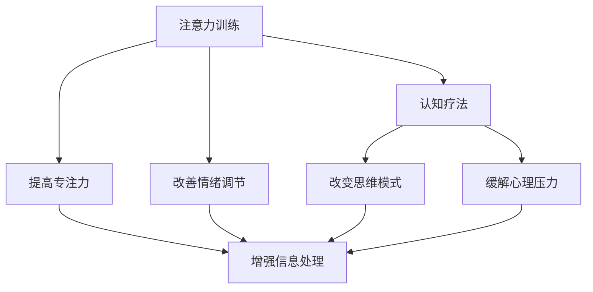

                 

## 1. 背景介绍

### 1.1 问题由来
在现代快节奏的生活中，人们的注意力分散，压力增大，精神健康问题日益凸显。心理学研究表明，注意力和认知功能之间存在密切联系，注意力训练可以显著改善认知和心理健康。同时，随着计算技术和神经科学的发展，注意力训练正成为一种新兴的认知疗法，结合科技手段，以提升人们的注意力水平，改善心理健康。

### 1.2 问题核心关键点
注意力训练的核心关键点在于：
- 通过神经科学实验和心理学研究，验证注意力训练对认知和心理健康的正面作用。
- 结合认知神经科学原理，构建高效的注意力训练模型。
- 开发实用的注意力训练应用，推广到心理健康和教育等领域。

## 2. 核心概念与联系

### 2.1 核心概念概述

注意力训练（Attention Training）和认知疗法（Cognitive Therapy）是改善心理健康的有效手段。注意力训练通过特定任务或游戏，提升个体的注意力和专注力，进而改善认知和情绪状态。认知疗法则通过改变个体的思维模式和行为习惯，缓解压力和焦虑，提升整体的心理健康水平。

这两种方法在理论上有着密切联系，共同作用于心理健康的不同层面：注意力训练增强了认知资源的分配和利用，使得个体能够更有效地处理信息，提升决策和问题解决能力；认知疗法则通过改变负性思维模式，改善情绪调节和自我认知，缓解心理压力。

### 2.2 核心概念原理和架构的 Mermaid 流程图



这个流程图展示了注意力训练和认知疗法的联系与区别。注意力训练通过提高专注力，改善情绪调节，进而增强认知功能。而认知疗法通过改变思维模式，缓解心理压力，同样能够提升认知水平。

## 3. 核心算法原理 & 具体操作步骤

### 3.1 算法原理概述

注意力训练的原理基于认知神经科学的研究成果，认为注意力是一种有限的认知资源，通过训练可以增强这种资源，提升个体的认知和情绪调节能力。认知疗法则基于认知行为理论，认为个体的心理状态受到认知模式的影响，通过改变负性思维，可以改善情绪和行为。

具体的注意力训练算法通常包括以下几个步骤：

1. **任务设计**：选择合适的训练任务，如注意力游戏、记忆任务等，以提升特定领域的注意力能力。
2. **模型构建**：使用神经网络模型，如卷积神经网络（CNN）、递归神经网络（RNN）等，构建注意力训练模型。
3. **参数优化**：通过调整模型参数，如学习率、批量大小等，优化模型性能。
4. **实验评估**：在实验数据上评估模型的训练效果，如通过实验心理学的设计，测量个体注意力和认知功能的提升。

### 3.2 算法步骤详解

#### 3.2.1 任务设计
注意力训练任务需要精心设计，以确保能够有效提升个体的注意力和认知能力。常见的任务包括：

- **记忆任务**：如闪卡记忆、数字记忆等，旨在提升短期记忆和注意力保持能力。
- **注意力游戏**：如俄罗斯方块、拼字游戏等，通过视觉、听觉等刺激，提升个体对多个刺激的注意分配能力。
- **注意力控制**：如任务切换、注意点追踪等，训练个体对注意力的有意控制能力。

#### 3.2.2 模型构建
注意力训练模型通常基于神经网络，通过学习特定任务的数据集，优化模型的注意力机制。常见的注意力机制包括：

- **空间注意力**：在视觉任务中，通过卷积神经网络提取特征，并计算空间注意力权重，选择重要的视觉区域进行特征提取。
- **通道注意力**：在文本任务中，通过循环神经网络提取文本特征，并计算通道注意力权重，选择重要的文本通道进行信息提取。
- **自注意力**：在自然语言处理任务中，通过Transformer等架构，计算自注意力权重，选择重要的词序列进行信息融合。

#### 3.2.3 参数优化
注意力训练模型的参数优化通常使用梯度下降算法，如Adam、SGD等，通过调整学习率、批量大小等超参数，优化模型的训练效果。常见的参数优化策略包括：

- **学习率调整**：根据模型的训练进度，调整学习率，防止过拟合或欠拟合。
- **正则化**：通过L1、L2正则化等技术，防止模型过拟合。
- **批量大小调整**：根据训练数据的规模和计算资源，调整批量大小，平衡训练效率和效果。

#### 3.2.4 实验评估
注意力训练的实验评估通常使用心理学的实验设计，通过测量个体的注意力水平、认知功能等指标，评估模型的训练效果。常见的评估指标包括：

- **注意力保持时间**：测量个体在特定任务上的注意力持续时间，反映注意力的稳定性。
- **任务完成准确率**：测量个体在特定任务上的完成准确率，反映注意力的分配和控制能力。
- **认知任务表现**：通过认知测试任务，如智商测试、记忆测试等，评估训练对认知功能的影响。

### 3.3 算法优缺点

注意力训练算法的优点在于：
- **提升认知能力**：通过训练注意力资源，提高个体对信息的处理能力和决策能力。
- **改善情绪状态**：通过调节注意力，改善情绪调节和压力管理。
- **适用广泛**：适用于多种认知和心理障碍，如注意力缺陷障碍（ADHD）、焦虑症等。

注意力训练算法的缺点在于：
- **训练周期长**：训练效果需要较长时间的积累，难以在短期内显著提升。
- **个体差异大**：不同个体的注意力训练效果差异较大，需要个性化定制。
- **技术复杂**：训练模型和评估方法需要一定的技术基础和实验设计经验。

### 3.4 算法应用领域

注意力训练算法在多个领域得到了广泛应用，包括：

- **教育领域**：通过注意力训练，提升学生的学习效果和注意力水平，缓解学习压力。
- **心理咨询**：结合认知疗法，帮助个体改善负性思维，缓解心理压力和情绪问题。
- **职场管理**：通过注意力训练，提高职场人士的工作效率和专注力，提升工作效率。
- **神经康复**：用于神经损伤患者的康复训练，改善注意力和认知功能。

## 4. 数学模型和公式 & 详细讲解 & 举例说明

### 4.1 数学模型构建

注意力训练的数学模型通常基于神经网络模型，使用注意力机制，如自注意力、空间注意力等，对输入数据进行处理。以Transformer模型为例，其注意力机制可以表示为：

$$
Attention(Q, K, V) = \text{softmax}(\frac{QK^T}{\sqrt{d_k}})V
$$

其中，$Q$、$K$、$V$分别代表查询、键和值，$d_k$为注意力机制的维度。该公式计算注意力权重，选择重要信息进行融合。

### 4.2 公式推导过程

注意力机制的推导过程如下：

- **注意力权重计算**：
  $$
  \text{attention}(Q, K) = \frac{\exp(\text{score}(Q, K))}{\sum_i \exp(\text{score}(Q, K_i))}
  $$
  其中，$\text{score}(Q, K)$为查询和键的相似度计算，$\text{attention}(Q, K)$表示查询对键的注意力权重。

- **注意力信息融合**：
  $$
  \text{attention}(Q, K, V) = \sum_i \text{attention}(Q, K_i)V_i
  $$
  其中，$V_i$表示与查询$i$对应的值信息。

### 4.3 案例分析与讲解

以Transformer模型为例，其自注意力机制可以用于文本处理任务，如语言模型、机器翻译等。假设输入序列为$x = [x_1, x_2, ..., x_n]$，则模型的输出可以表示为：

$$
\text{output} = \text{softmax}(\frac{QK^T}{\sqrt{d_k}})V
$$

其中，$Q$、$K$、$V$分别代表查询、键和值，$d_k$为注意力机制的维度。该公式计算注意力权重，选择重要信息进行融合。

在实际应用中，注意力训练的数学模型通常需要进行参数优化，以确保能够提升个体的注意力和认知能力。通过调整模型参数，如学习率、批量大小等，优化模型的训练效果，最终实现注意力训练的目的。

## 5. 项目实践：代码实例和详细解释说明

### 5.1 开发环境搭建

注意力训练的开发环境通常包括Python、PyTorch等深度学习框架，以及TensorBoard、Weights & Biases等可视化工具。以下是一个典型的开发环境配置流程：

1. 安装Python：
   ```bash
   sudo apt-get install python3 python3-pip
   ```

2. 安装PyTorch：
   ```bash
   pip install torch torchvision torchaudio
   ```

3. 安装TensorBoard：
   ```bash
   pip install tensorboard
   ```

4. 安装TensorFlow：
   ```bash
   pip install tensorflow
   ```

5. 安装Weights & Biases：
   ```bash
   pip install w&b
   ```

### 5.2 源代码详细实现

以下是一个简单的注意力训练模型的Python代码实现，使用PyTorch框架：

```python
import torch
import torch.nn as nn
import torch.nn.functional as F

class AttentionModel(nn.Module):
    def __init__(self, d_model, n_head, dropout=0.1):
        super(AttentionModel, self).__init__()
        self.d_model = d_model
        self.n_head = n_head
        self.depth = n_head * d_model // 2
        self.query_project = nn.Linear(d_model, self.depth)
        self.key_project = nn.Linear(d_model, self.depth)
        self.value_project = nn.Linear(d_model, self.depth)
        self.out_project = nn.Linear(self.depth, d_model)
        self.dropout = nn.Dropout(p=dropout)

    def forward(self, x, mask=None):
        m = self.depth
        batch_size, seq_len, dim = x.size()

        query = self.query_project(x).view(batch_size, seq_len, self.n_head, self.depth).permute(0, 2, 1, 3).contiguous()
        key = self.key_project(x).view(batch_size, seq_len, self.n_head, self.depth).permute(0, 2, 1, 3).contiguous()
        value = self.value_project(x).view(batch_size, seq_len, self.n_head, self.depth).permute(0, 2, 1, 3).contiguous()

        attn = torch.bmm(query, key.transpose(2, 3))
        attn = attn.masked_fill(mask.unsqueeze(2).unsqueeze(2), -1e9)

        attn = F.softmax(attn, dim=-1)
        attn = self.dropout(attn)

        attn = torch.bmm(attn, value)

        attn = self.out_project(attn.permute(0, 2, 1, 3).contiguous()).view(batch_size, seq_len, dim)
        return attn
```

### 5.3 代码解读与分析

上述代码实现了一个简单的注意力模型，用于处理文本序列。该模型包含两个线性投影层，用于计算查询、键和值的信息，以及一个输出线性投影层。通过计算注意力权重，选择重要信息进行融合，最终输出文本序列的注意力表示。

该模型的训练过程需要根据具体的任务和数据进行优化，包括调整学习率、批量大小、正则化等超参数，以确保训练效果。在实际应用中，注意力训练的代码实现需要根据具体任务进行灵活调整，结合可视化工具如TensorBoard等，进行实时监控和优化。

### 5.4 运行结果展示

训练过程中，可以通过可视化工具TensorBoard进行实时监控，如记录损失函数、准确率等指标的变化。以下是一个简单的TensorBoard输出示例：

```
tensorboard --logdir=./logs
```

该命令启动TensorBoard，并加载当前工作目录下的日志文件，输出训练过程的图形界面，供开发者实时监控和调试。

## 6. 实际应用场景

### 6.1 教育领域

在教育领域，注意力训练可以应用于学生注意力提升、学习效果改善等方面。通过注意力训练游戏或任务，提升学生的注意力水平，缓解学习压力，提高学习效率。例如，可以使用记忆游戏、阅读理解任务等，训练学生的注意力和认知功能，改善学习效果。

### 6.2 心理咨询

在心理咨询领域，注意力训练可以结合认知疗法，帮助个体改善负性思维，缓解心理压力。例如，可以通过注意力训练任务，如注意力集中训练、压力管理训练等，帮助个体提升注意力和情绪调节能力，缓解焦虑和抑郁。

### 6.3 职场管理

在职场管理领域，注意力训练可以提升员工的工作效率和专注力，改善工作状态。例如，可以通过注意力训练游戏或任务，提升员工的工作集中度和任务完成质量，提高工作效率。

### 6.4 神经康复

在神经康复领域，注意力训练可以用于神经损伤患者的康复训练，改善注意力和认知功能。例如，可以通过注意力训练任务，如数字记忆、视觉搜索任务等，帮助患者恢复注意力和认知能力，加速康复进程。

## 7. 工具和资源推荐

### 7.1 学习资源推荐

为了帮助开发者系统掌握注意力训练的理论基础和实践技巧，以下是一些优质的学习资源：

1. 《深度学习与认知科学》书籍：详细介绍了深度学习在认知科学中的应用，包括注意力训练等前沿话题。
2. 《认知行为疗法：理论、评估与治疗》书籍：介绍认知行为疗法的理论基础和实践技巧，结合心理学实验进行讲解。
3. 《神经心理学》课程：通过在线课程平台如Coursera、edX等，学习神经心理学和认知神经科学的基础知识。
4. 《注意力训练的神经科学基础》文章：介绍注意力训练的神经科学原理和实验设计方法。
5. 《认知训练技术》文章：介绍各类认知训练技术和工具，包括注意力训练的应用方法。

通过学习这些资源，相信你一定能够快速掌握注意力训练的理论基础和实践技巧，并将其应用于实际场景中。

### 7.2 开发工具推荐

在注意力训练的开发中，常用的工具包括：

1. Python：用于深度学习模型的编写和调试。
2. PyTorch：基于Python的深度学习框架，灵活高效。
3. TensorFlow：基于Python的深度学习框架，支持分布式计算和生产部署。
4. TensorBoard：可视化工具，记录和展示训练过程的各项指标。
5. Weights & Biases：实验跟踪工具，记录和分析训练数据和模型性能。

### 7.3 相关论文推荐

注意力训练技术的发展源于学界的持续研究。以下是几篇奠基性的相关论文，推荐阅读：

1. "Attention is All You Need"：Transformer架构的原论文，首次提出自注意力机制。
2. "Cognitive Behavioral Therapy: Basics and Beyond"：介绍认知行为疗法的经典教材，深入浅出地讲解认知行为疗法的理论和实践。
3. "Training Attention Mechanisms"：介绍注意力训练的神经科学原理和实验设计方法。
4. "Cognitive Training: An Integrative Review"：综述各类认知训练技术的研究进展，包括注意力训练的应用方法。

这些论文代表了大语言模型微调技术的发展脉络。通过学习这些前沿成果，可以帮助研究者把握学科前进方向，激发更多的创新灵感。

## 8. 总结：未来发展趋势与挑战

### 8.1 研究成果总结

注意力训练作为一种认知疗法，在改善心理健康的各个方面都展现出了巨大的潜力。通过神经科学研究和心理学实验，验证了注意力训练对认知和情绪的正面作用，构建了高效的注意力训练模型，开发了实用的注意力训练应用。

### 8.2 未来发展趋势

展望未来，注意力训练技术将呈现以下几个发展趋势：

1. **深度学习与神经科学的结合**：结合深度学习和神经科学的研究成果，构建更高效的注意力训练模型，提升训练效果。
2. **个性化训练**：通过个性化设计训练任务和参数，适应不同个体的注意力需求，提升训练效果和适应性。
3. **多模态训练**：结合视觉、听觉等多模态信息，提升注意力训练的效果和适用性。
4. **持续训练**：通过持续训练和反馈机制，保持个体注意力和认知功能的提升，实现长期效果。
5. **大规模应用**：将注意力训练应用于教育、心理咨询、职场管理等多个领域，提升整体的心理健康水平。

### 8.3 面临的挑战

尽管注意力训练技术已经取得了瞩目成就，但在迈向更加智能化、普适化应用的过程中，它仍面临诸多挑战：

1. **训练复杂性**：训练过程需要精心设计任务和调整参数，对技术要求较高。
2. **个体差异**：不同个体的注意力需求和训练效果差异较大，需要个性化定制。
3. **技术普及**：注意力训练的推广和普及需要更多的教育资源和技术支持。
4. **社会接受度**：部分人群对新科技的接受度较低，需加强宣传和普及教育。
5. **伦理和隐私**：注意力训练涉及数据采集和处理，需注意数据隐私和伦理问题。

### 8.4 研究展望

面对注意力训练技术面临的种种挑战，未来的研究需要在以下几个方面寻求新的突破：

1. **优化训练算法**：结合深度学习和神经科学的研究成果，构建更高效的注意力训练模型，提升训练效果。
2. **推广个性化训练**：通过个性化设计训练任务和参数，适应不同个体的注意力需求，提升训练效果和适应性。
3. **多模态融合**：结合视觉、听觉等多模态信息，提升注意力训练的效果和适用性。
4. **持续训练机制**：通过持续训练和反馈机制，保持个体注意力和认知功能的提升，实现长期效果。
5. **社会普及教育**：加强宣传和普及教育，提升公众对注意力训练技术的接受度。

## 9. 附录：常见问题与解答

**Q1：注意力训练对心理健康有哪些具体作用？**

A: 注意力训练能够显著改善个体的认知和情绪状态，具体作用包括：

1. **提升注意力水平**：通过特定任务和游戏，提高个体的注意力保持和分配能力。
2. **缓解焦虑和抑郁**：通过改善注意力和情绪调节，缓解焦虑和抑郁症状。
3. **增强记忆和决策能力**：通过提升注意力和认知功能，改善记忆和决策能力。
4. **提高工作和学习效率**：通过训练注意力和专注力，提升个体的工作效率和学习效果。

**Q2：注意力训练需要多长时间才能见效？**

A: 注意力训练的见效时间因个体差异而异，通常需要持续数周或数月的训练才能显著提升注意力水平。开始训练时，建议每周进行2-3次，每次持续20-30分钟，逐渐增加训练频率和时间。

**Q3：注意力训练适用于哪些人群？**

A: 注意力训练适用于广泛的人群，包括学生、职场人士、神经损伤患者等。但需要注意的是，儿童、老年人或身体不适的人群需要谨慎进行，建议在有经验的医生或教练指导下进行。

**Q4：注意力训练有哪些注意事项？**

A: 注意力训练需要注意以下事项：

1. **适量训练**：避免过度训练，以免造成疲劳和损伤。
2. **定期休息**：训练过程中需定期休息，避免长时间连续训练。
3. **个性化调整**：根据个体差异进行个性化调整，适应不同的注意力需求。
4. **安全保护**：注意保护个体隐私和安全，避免数据泄露和滥用。

**Q5：注意力训练有哪些推荐应用？**

A: 以下是一些推荐应用：

1. **注意力提升游戏**：如俄罗斯方块、数字记忆游戏等，通过视觉和听觉刺激，提升注意力保持和分配能力。
2. **认知训练APP**：如Headspace、CogniFit等，提供多种认知训练任务和游戏，提升认知和注意力水平。
3. **心理咨询平台**：如Talkspace、BetterHelp等，结合认知疗法和注意力训练，提供综合的心理健康服务。
4. **教育培训机构**：如Khan Academy、Coursera等，提供注意力训练课程和资源，帮助学生提升学习效果。

总之，注意力训练作为一种认知疗法，在改善心理健康、提升认知能力方面具有显著效果。通过精心设计训练任务和模型，结合技术手段，可以更好地推广和应用，为人们的心理健康和认知提升提供有力支持。

