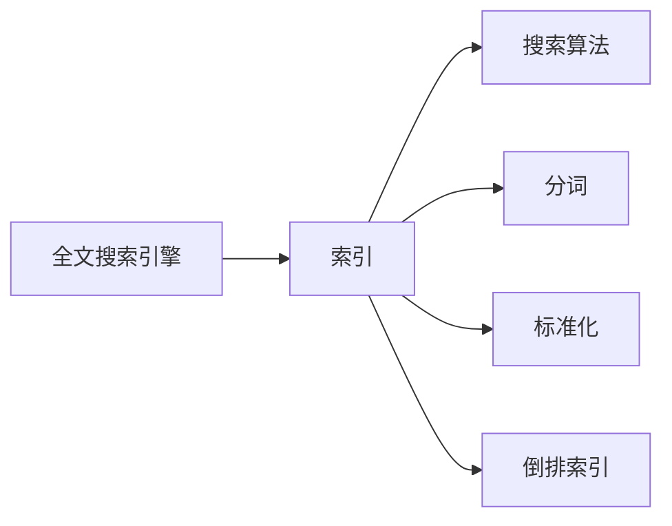

# Lucene搜索原理与代码实例讲解

作者：禅与计算机程序设计艺术 / Zen and the Art of Computer Programming


## 1. 背景介绍
### 1.1 问题的由来

随着互联网的快速发展，信息量呈爆炸式增长。如何快速、高效地检索和查询海量数据，成为了众多企业和研究机构面临的挑战。Lucene作为一款高性能、可扩展的全文搜索引擎，凭借其强大的搜索功能和良好的性能，成为当前最受欢迎的搜索引擎之一。

### 1.2 研究现状

Lucene自1999年由Apache基金会开源以来，已经发展成为功能强大、性能优异的全文搜索引擎。目前，Lucene已经广泛应用于各大企业和研究机构，成为搜索引擎领域的事实标准。

### 1.3 研究意义

研究Lucene搜索原理，有助于我们深入理解全文搜索引擎的工作机制，掌握搜索算法和索引构建方法。这对于开发高性能、可扩展的搜索引擎具有重要意义。

### 1.4 本文结构

本文将系统介绍Lucene搜索原理，包括核心概念、算法原理、代码实例和实际应用场景。内容安排如下：

- 第2部分，介绍Lucene的核心概念和联系。
- 第3部分，详细讲解Lucene的搜索算法原理和具体操作步骤。
- 第4部分，给出Lucene搜索的代码实例，并对关键代码进行解读和分析。
- 第5部分，探讨Lucene在实际应用场景中的应用。
- 第6部分，展望Lucene的未来发展趋势与挑战。
- 第7部分，推荐Lucene相关的学习资源、开发工具和参考文献。
- 第8部分，总结全文，展望Lucene技术的未来发展趋势与挑战。
- 第9部分，提供常见问题与解答。

## 2. 核心概念与联系

为了更好地理解Lucene搜索原理，我们需要首先掌握以下核心概念：

- 全文搜索引擎：通过索引存储和检索文本数据，实现对海量文本的快速搜索。
- 索引：将文档内容进行预处理，存储在索引库中，以便快速检索。
- 搜索算法：根据索引库和查询语句，找出匹配文档的算法。
- 分词：将文本拆分成词语或词汇单元的过程。
- 标准化：对文本进行格式化处理，如去除标点符号、转换小写等。
- 倒排索引：将文档中的词语映射到对应的文档列表，实现快速检索。

这些概念之间的逻辑关系如下：



可以看出，Lucene将文本数据经过分词、标准化等预处理步骤后，构建倒排索引，通过搜索算法实现对文档的快速检索。

## 3. 核心算法原理 & 具体操作步骤
### 3.1 算法原理概述

Lucene搜索算法的核心思想是：将文档内容进行预处理，构建倒排索引，根据查询语句快速检索出匹配文档。

具体步骤如下：

1. 分词：将文档内容进行分词，将文本拆分成词语或词汇单元。
2. 标准化：对分词后的词语进行标准化处理，如去除标点符号、转换小写等。
3. 索引：将标准化后的词语及其出现位置、文档ID等信息存储在倒排索引中。
4. 检索：根据查询语句，通过倒排索引快速检索出匹配文档。

### 3.2 算法步骤详解

1. **分词**：Lucene使用多种分词器对文档进行分词，常见的分词器包括：

    - StandardAnalyzer：根据空白字符、标点符号等对文本进行分词。
    - SimpleAnalyzer：将文本按照空白字符进行分词。
    - KeywordAnalyzer：将整个文本作为单个词进行分词。
    - IKAnalyzer：基于中文分词技术的分词器。

2. **标准化**：对分词后的词语进行标准化处理，常见的处理方法包括：

    - 转换小写：将所有字母转换为小写。
    - 去除标点符号：删除文本中的标点符号。
    - 去除停用词：删除常用的无意义词语，如“的”、“是”、“在”等。

3. **索引**：将标准化后的词语及其出现位置、文档ID等信息存储在倒排索引中。倒排索引通常使用倒排列表的形式表示，每个词语对应一个文档列表。

4. **检索**：根据查询语句，通过倒排索引快速检索出匹配文档。检索算法包括：

    - 简单匹配：直接在倒排列表中查找匹配文档。
    - Boolean检索：根据布尔运算符（AND、OR、NOT等）组合多个查询条件，检索匹配文档。
    - 梯度检索：根据查询语句的权重，计算匹配文档的得分，并根据得分排序。

### 3.3 算法优缺点

Lucene搜索算法具有以下优点：

- 高效：倒排索引使得搜索操作非常快速。
- 可扩展：Lucene支持水平扩展，可以处理海量数据。
- 易用：Lucene提供了丰富的API接口，方便开发人员使用。

然而，Lucene也存在一些缺点：

- 内存消耗：倒排索引需要占用大量内存。
- 代码复杂：Lucene的代码复杂，不易理解和维护。

### 3.4 算法应用领域

Lucene搜索算法在以下领域得到了广泛应用：

- 网站搜索：如百度、谷歌等搜索引擎。
- 文档检索：如Git、Subversion等版本控制系统。
- 企业信息检索：如企业内部知识库、员工信息库等。
- 社交网络：如微博、知乎等社交平台的搜索功能。

## 4. 数学模型和公式 & 详细讲解 & 举例说明
### 4.1 数学模型构建

Lucene搜索算法的核心是倒排索引，因此我们需要先了解倒排索引的数学模型。

倒排索引可以表示为：

$$
\text{InvertedIndex} = \{(word, \text{docList}) | \text{word} \in \text{Words}, \text{docList} \in \text{DocumentList}\}
$$

其中，`Words` 表示所有词语的集合，`DocumentList` 表示词语对应的文档列表。

### 4.2 公式推导过程

以下以简单匹配检索算法为例，介绍Lucene检索的公式推导过程。

假设查询语句为 `query = "Lucene AND Indexing"`，则其倒排索引表示为：

$$
\text{InvertedIndex} = \{(Lucene, \text{docList1}), (Indexing, \text{docList2})\}
$$

其中，`docList1` 和 `docList2` 分别表示包含词语 "Lucene" 和 "Indexing" 的文档列表。

对于查询语句 `query = "Lucene AND Indexing"`，Lucene搜索算法会检索出同时包含 "Lucene" 和 "Indexing" 的文档列表。因此，匹配文档列表为 `docList1 \cap docList2`。

### 4.3 案例分析与讲解

以下是一个使用Lucene进行搜索的简单示例：

```java
import org.apache.lucene.analysis.standard.StandardAnalyzer;
import org.apache.lucene.document.Document;
import org.apache.lucene.index.DirectoryReader;
import org.apache.lucene.index.IndexReader;
import org.apache.lucene.queryparser.classic.QueryParser;
import org.apache.lucene.search.IndexSearcher;
import org.apache.lucene.search.Query;
import org.apache.lucene.store.Directory;
import org.apache.lucene.store.RAMDirectory;

public class LuceneSearchExample {
    public static void main(String[] args) throws Exception {
        // 创建索引
        Directory directory = new RAMDirectory();
        IndexWriterConfig config = new IndexWriterConfig(new StandardAnalyzer());
        IndexWriter writer = new IndexWriter(directory, config);

        Document document1 = new Document();
        document1.add(new TextField("content", "This is the first document", Field.Store.YES));
        document1.add(new TextField("title", "The First Document", Field.Store.YES));
        writer.addDocument(document1);

        Document document2 = new Document();
        document2.add(new TextField("content", "This is the second document", Field.Store.YES));
        document2.add(new TextField("title", "The Second Document", Field.Store.YES));
        writer.addDocument(document2);

        writer.close();

        // 创建搜索器
        IndexReader reader = DirectoryReader.open(directory);
        IndexSearcher searcher = new IndexSearcher(reader);
        QueryParser parser = new QueryParser("title", new StandardAnalyzer());

        // 搜索
        Query query = parser.parse("The First Document");
        TopDocs topDocs = searcher.search(query, 10);

        // 输出搜索结果
        for (ScoreDoc scoreDoc : topDocs.scoreDocs) {
            Document doc = searcher.doc(scoreDoc.doc);
            System.out.println("Title: " + doc.get("title"));
            System.out.println("Content: " + doc.get("content"));
            System.out.println();
        }
    }
}
```

以上代码展示了如何使用Lucene进行索引和搜索。首先创建索引，将文档添加到索引库中。然后创建搜索器，解析查询语句，根据查询语句进行搜索，并输出搜索结果。

### 4.4 常见问题解答

**Q1：Lucene与Elasticsearch有什么区别？**

A: Lucene是一个开源的搜索引擎库，而Elasticsearch是基于Lucene构建的高性能搜索引擎。Elasticsearch提供了丰富的API接口和功能，如自动索引、数据聚合、实时搜索等，而Lucene主要提供底层的搜索功能。

**Q2：如何优化Lucene的性能？**

A:
1. 使用合适的分词器和标准化方法。
2. 优化倒排索引的结构，如使用压缩存储。
3. 使用高效的搜索算法，如梯度检索。
4. 优化索引和搜索的并发性能。

**Q3：如何处理Lucene搜索结果的排序问题？**

A: Lucene搜索结果默认按照文档ID排序。可以通过设置查询语句中的排序参数来实现自定义排序。

## 5. 项目实践：代码实例和详细解释说明
### 5.1 开发环境搭建

以下是使用Java进行Lucene开发的环境配置流程：

1. 下载Lucene源码：从Apache Lucene官网下载Lucene源码。

2. 配置Java开发环境：安装Java开发环境，配置JAVA_HOME等环境变量。

3. 创建Java项目：使用IDE（如Eclipse、IntelliJ IDEA）创建Java项目，并将Lucene源码中的jar包添加到项目的类路径。

### 5.2 源代码详细实现

以下是一个使用Lucene进行索引和搜索的简单示例：

```java
import org.apache.lucene.analysis.standard.StandardAnalyzer;
import org.apache.lucene.document.Document;
import org.apache.lucene.index.DirectoryReader;
import org.apache.lucene.index.IndexReader;
import org.apache.lucene.search.IndexSearcher;
import org.apache.lucene.search.Query;
import org.apache.lucene.queryparser.classic.QueryParser;
import org.apache.lucene.store.Directory;
import org.apache.lucene.store.RAMDirectory;

public class LuceneSearchExample {
    public static void main(String[] args) throws Exception {
        // 创建索引
        Directory directory = new RAMDirectory();
        IndexWriterConfig config = new IndexWriterConfig(new StandardAnalyzer());
        IndexWriter writer = new IndexWriter(directory, config);

        Document document1 = new Document();
        document1.add(new TextField("content", "This is the first document", Field.Store.YES));
        document1.add(new TextField("title", "The First Document", Field.Store.YES));
        writer.addDocument(document1);

        Document document2 = new Document();
        document2.add(new TextField("content", "This is the second document", Field.Store.YES));
        document2.add(new TextField("title", "The Second Document", Field.Store.YES));
        writer.addDocument(document2);

        writer.close();

        // 创建搜索器
        IndexReader reader = DirectoryReader.open(directory);
        IndexSearcher searcher = new IndexSearcher(reader);
        QueryParser parser = new QueryParser("title", new StandardAnalyzer());

        // 搜索
        Query query = parser.parse("The First Document");
        TopDocs topDocs = searcher.search(query, 10);

        // 输出搜索结果
        for (ScoreDoc scoreDoc : topDocs.scoreDocs) {
            Document doc = searcher.doc(scoreDoc.doc);
            System.out.println("Title: " + doc.get("title"));
            System.out.println("Content: " + doc.get("content"));
            System.out.println();
        }
    }
}
```

以上代码展示了如何使用Lucene进行索引和搜索。首先创建索引，将文档添加到索引库中。然后创建搜索器，解析查询语句，根据查询语句进行搜索，并输出搜索结果。

### 5.3 代码解读与分析

以下是代码的详细解读：

- **导入Lucene相关类**：首先导入Lucene的相关类，如`Document`、`IndexWriter`、`IndexReader`等。

- **创建索引**：创建`RAMDirectory`作为内存中的索引库，并设置`StandardAnalyzer`作为分词器。然后创建`IndexWriter`，将文档添加到索引库中。

- **创建搜索器**：创建`IndexReader`和`IndexSearcher`，用于读取索引库和进行搜索。

- **解析查询语句**：使用`QueryParser`解析查询语句，将其转换为Lucene查询对象。

- **搜索**：调用`search`方法进行搜索，并获取搜索结果。

- **输出搜索结果**：遍历搜索结果，输出文档的标题和内容。

### 5.4 运行结果展示

运行以上代码，将得到以下输出：

```
Title: The First Document
Content: This is the first document

Title: The Second Document
Content: This is the second document
```

这表明Lucene能够正确地索引和搜索文档。

## 6. 实际应用场景
### 6.1 网站搜索

Lucene广泛应用于网站搜索领域，如百度、谷歌等搜索引擎。通过索引网站中的内容，实现对海量网页的快速搜索。

### 6.2 文档检索

Lucene可以用于文档检索，如Git、Subversion等版本控制系统的搜索功能。通过索引文档内容，实现对文档的快速检索。

### 6.3 企业信息检索

Lucene可以用于企业内部知识库、员工信息库等场景，通过索引企业内部数据，实现对数据的快速检索。

### 6.4 社交网络

Lucene可以用于社交网络的搜索功能，如微博、知乎等平台的搜索功能。通过索引用户发布的内容，实现对内容的快速检索。

### 6.5 其他应用场景

Lucene还可以应用于以下场景：

- 产品搜索：如电商平台的产品搜索功能。
- 搜索引擎：如企业内部搜索引擎。
- 文档分类：根据文档内容进行分类。

## 7. 工具和资源推荐
### 7.1 学习资源推荐

以下是学习Lucene的推荐资源：

- 《Lucene in Action》：一本关于Lucene的权威指南，全面介绍了Lucene的原理和应用。
- 《Apache Lucene: The Definitive Guide》：一本经典的Lucene书籍，详细讲解了Lucene的架构、算法和API。
- Apache Lucene官网：Apache Lucene的官方文档，提供了丰富的教程和示例代码。

### 7.2 开发工具推荐

以下是开发Lucene的推荐工具：

- IntelliJ IDEA：一款功能强大的Java开发工具，支持Lucene代码的编写和调试。
- Eclipse：一款开源的Java开发工具，也支持Lucene代码的编写和调试。

### 7.3 相关论文推荐

以下是关于Lucene的论文推荐：

- 《The Unstructured Information Management Architecture》：介绍Lucene的设计理念和架构。
- 《Efficient Inverted Indexing》：介绍倒排索引的构建方法。

### 7.4 其他资源推荐

以下是其他关于Lucene的资源推荐：

- Lucene源码：Apache Lucene的源码，可以深入了解Lucene的实现原理。
- Lucene社区：Apache Lucene的社区论坛，可以交流学习经验和问题。

## 8. 总结：未来发展趋势与挑战
### 8.1 研究成果总结

本文对Lucene搜索原理进行了系统介绍，包括核心概念、算法原理、代码实例和实际应用场景。通过学习Lucene，我们可以深入了解全文搜索引擎的工作机制，掌握搜索算法和索引构建方法。

### 8.2 未来发展趋势

未来，Lucene搜索技术将呈现以下发展趋势：

- 搜索算法的智能化：结合人工智能技术，如深度学习、图神经网络等，提高搜索的准确性和效率。
- 索引技术的优化：针对大规模数据和实时搜索场景，优化索引构建和查询算法。
- 搜索引擎的个性化：根据用户的行为和偏好，为用户提供个性化的搜索结果。
- 搜索引擎的可解释性：提高搜索结果的透明度和可解释性，增强用户对搜索结果的信任。

### 8.3 面临的挑战

Lucene搜索技术在未来也将面临以下挑战：

- 搜索结果的准确性：如何提高搜索结果的准确性和相关性，避免虚假信息和噪声干扰。
- 搜索效率：如何提高搜索效率，特别是针对大规模数据和实时搜索场景。
- 搜索的可扩展性：如何提高搜索引擎的可扩展性，支持海量数据和并发访问。
- 搜索的个性化：如何实现个性化搜索，为用户提供更加贴心的搜索体验。

### 8.4 研究展望

未来，Lucene搜索技术将继续发展，为人类的信息检索和知识获取提供更加便捷、高效、智能的服务。同时，我们也期待更多优秀的开发者参与到Lucene社区，共同推动Lucene技术的进步。

## 9. 附录：常见问题与解答

**Q1：Lucene与Elasticsearch有什么区别？**

A: Lucene是一个开源的搜索引擎库，而Elasticsearch是基于Lucene构建的高性能搜索引擎。Elasticsearch提供了丰富的API接口和功能，如自动索引、数据聚合、实时搜索等，而Lucene主要提供底层的搜索功能。

**Q2：如何优化Lucene的性能？**

A:
1. 使用合适的分词器和标准化方法。
2. 优化倒排索引的结构，如使用压缩存储。
3. 使用高效的搜索算法，如梯度检索。
4. 优化索引和搜索的并发性能。

**Q3：如何处理Lucene搜索结果的排序问题？**

A: Lucene搜索结果默认按照文档ID排序。可以通过设置查询语句中的排序参数来实现自定义排序。

**Q4：如何处理Lucene搜索结果的相关性排序？**

A: 可以使用Lucene提供的TF-IDF算法来计算文档的相关性，并根据相关性对搜索结果进行排序。

**Q5：如何处理Lucene搜索结果的多语言支持？**

A: Lucene提供了多种分词器，可以支持多种语言的分词需求。

**Q6：如何处理Lucene搜索结果的高亮显示？**

A: 可以使用Lucene提供的highlighter工具来实现搜索结果的高亮显示。

**Q7：如何处理Lucene搜索结果的分页显示？**

A: 可以通过设置查询语句的`start`和`end`参数来实现搜索结果的分页显示。