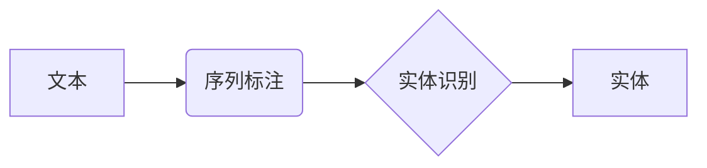

# Named Entity Recognition (NER)原理与代码实例讲解

作者：禅与计算机程序设计艺术 / Zen and the Art of Computer Programming

## 1. 背景介绍
### 1.1 问题的由来

命名实体识别（Named Entity Recognition，NER）是自然语言处理（Natural Language Processing，NLP）领域的一个重要任务，旨在从文本中识别出具有特定意义的实体，如人名、地名、机构名、时间等。NER在信息抽取、信息检索、语义分析、机器翻译等众多NLP应用中扮演着至关重要的角色。

随着深度学习技术的不断发展，基于深度学习的NER模型取得了显著的性能提升，成为NER领域的主流方法。本文将深入探讨NER的原理，并通过代码实例讲解如何使用深度学习框架实现NER任务。

### 1.2 研究现状

近年来，基于深度学习的NER研究取得了丰硕的成果，主要包括以下几种方法：

1. 基于CRF（Conditional Random Fields）的序列标注方法：CRF是一种经典的序列标注模型，通过引入条件独立性假设，能够有效地处理标签序列中的依赖关系。

2. 基于HMM（Hidden Markov Models）的序列标注方法：HMM是一种基于概率论的序列标注模型，通过隐状态和观测状态之间的转移概率和发射概率进行标注。

3. 基于神经网络（Neural Networks）的序列标注方法：神经网络模型能够学习输入序列与标签序列之间的复杂非线性关系，在NER任务上取得了显著的性能提升。

4. 基于Transformer的序列标注方法：Transformer模型作为一种自注意力机制，能够有效地捕捉序列中的长距离依赖关系，在NER任务上取得了SOTA的性能。

### 1.3 研究意义

NER技术在众多领域具有广泛的应用价值，以下列举几个典型应用场景：

1. 信息抽取：从文本中抽取具有特定意义的实体，如人名、地点、组织等，用于构建知识图谱、构建领域知识库等。

2. 信息检索：在搜索引擎中，NER技术可以用于关键词提取、扩展查询等，提高检索的准确性和效率。

3. 语义分析：通过对文本进行NER，可以更好地理解文本语义，为后续的语义分析和问答系统提供基础。

4. 机器翻译：在机器翻译任务中，NER技术可以用于识别翻译中的专有名词，提高翻译的准确性。

5. 对话系统：在对话系统中，NER技术可以用于识别用户提到的实体，为对话系统提供上下文信息。

### 1.4 本文结构

本文将按照以下结构进行展开：

- 第2部分，介绍NER涉及的核心概念和联系。
- 第3部分，详细阐述基于深度学习的NER算法原理和具体操作步骤。
- 第4部分，介绍NER中常用的数学模型和公式，并结合实例进行讲解。
- 第5部分，给出NER的代码实例和详细解释说明。
- 第6部分，探讨NER在实际应用场景中的应用和案例。
- 第7部分，推荐NER相关的学习资源、开发工具和参考文献。
- 第8部分，总结NER技术的未来发展趋势与挑战。
- 第9部分，提供NER的常见问题与解答。

## 2. 核心概念与联系

为了更好地理解NER技术，本节将介绍以下几个核心概念：

- 命名实体：具有特定意义的实体，如人名、地名、机构名、时间等。
- 标注：对文本中的实体进行标注，即将实体及其对应的类别标记在文本上。
- 序列标注：将文本序列中的每个词或字符标注为不同的类别，如B-PER、I-PER、B-LOC等。

这些概念之间的逻辑关系如下所示：



可以看出，NER过程包括三个主要步骤：文本序列标注、实体识别和实体分类。首先对文本进行序列标注，将每个词或字符标注为不同的类别；然后识别出文本中的实体；最后对实体进行分类，确定其实体类型。

## 3. 核心算法原理 & 具体操作步骤
### 3.1 算法原理概述

基于深度学习的NER算法主要分为以下几种：

1. 基于CRF的序列标注方法：CRF模型通过引入条件独立性假设，能够有效地处理标签序列中的依赖关系。CRF模型由状态转移矩阵和状态发射概率组成，通过解码算法得到最优标签序列。

2. 基于HMM的序列标注方法：HMM模型通过隐状态和观测状态之间的转移概率和发射概率进行标注。HMM模型使用维特比算法进行解码，得到最优路径。

3. 基于神经网络（Neural Networks）的序列标注方法：神经网络模型能够学习输入序列与标签序列之间的复杂非线性关系。常见的神经网络模型包括循环神经网络（RNN）、长短时记忆网络（LSTM）、门控循环单元（GRU）等。

4. 基于Transformer的序列标注方法：Transformer模型作为一种自注意力机制，能够有效地捕捉序列中的长距离依赖关系。Transformer模型使用注意力机制和位置编码，能够更好地捕捉序列中的上下文信息。

### 3.2 算法步骤详解

以基于Transformer的序列标注方法为例，详细讲解NER算法的具体操作步骤：

1. 数据预处理：将文本进行分词、分句等预处理操作，并将每个词或字符标注为不同的类别。

2. 模型构建：构建基于Transformer的序列标注模型，包括输入层、Transformer编码器、位置编码、注意力机制、线性层和输出层。

3. 训练：使用标注数据对模型进行训练，优化模型参数。

4. 解码：使用训练好的模型对新的文本进行解码，得到实体标注结果。

### 3.3 算法优缺点

以下列举了基于深度学习的NER算法的优缺点：

**优点**：

1. 能够学习输入序列与标签序列之间的复杂非线性关系，在NER任务上取得显著的性能提升。

2. 能够有效地捕捉序列中的长距离依赖关系，在长文本处理方面具有优势。

**缺点**：

1. 计算复杂度高，训练和推理速度较慢。

2. 模型参数量较大，需要大量的计算资源。

### 3.4 算法应用领域

基于深度学习的NER算法在以下领域具有广泛的应用：

1. 信息抽取：从文本中抽取具有特定意义的实体，如人名、地点、组织等。

2. 信息检索：在搜索引擎中，NER技术可以用于关键词提取、扩展查询等，提高检索的准确性和效率。

3. 语义分析：通过对文本进行NER，可以更好地理解文本语义，为后续的语义分析和问答系统提供基础。

4. 机器翻译：在机器翻译任务中，NER技术可以用于识别翻译中的专有名词，提高翻译的准确性。

5. 对话系统：在对话系统中，NER技术可以用于识别用户提到的实体，为对话系统提供上下文信息。

## 4. 数学模型和公式 & 详细讲解 & 举例说明
### 4.1 数学模型构建

基于深度学习的NER模型主要基于以下数学模型：

1. **词嵌入（Word Embedding）**：将文本中的词转换为向量表示，用于表示词的语义信息。

2. **Transformer编码器（Transformer Encoder）**：通过自注意力机制，捕捉序列中的长距离依赖关系。

3. **线性层（Linear Layer）**：将编码器的输出映射到目标空间。

4. **Softmax层（Softmax Layer）**：对线性层的输出进行归一化，得到每个类别的概率分布。

### 4.2 公式推导过程

以下以基于Transformer的序列标注模型为例，介绍NER模型中常用的数学公式及其推导过程：

1. **词嵌入**：

   $$\text{Word\_Embedding}(x) = W \cdot [x_1, x_2, \dots, x_n]$$

   其中，$W$ 为词嵌入矩阵，$x_1, x_2, \dots, x_n$ 为词的索引表示。

2. **Transformer编码器**：

   $$\text{Transformer\_Encoder}(x) = \text{Attention}(\text{MultiHeadAttention}(\text{Encoder}(x)))$$

   其中，$\text{Attention}$ 表示自注意力机制，$\text{MultiHeadAttention}$ 表示多头注意力，$\text{Encoder}$ 表示Transformer编码器。

3. **线性层**：

   $$\text{Linear}(x) = W \cdot x + b$$

   其中，$W$ 为线性层权重，$b$ 为偏置项。

4. **Softmax层**：

   $$\text{Softmax}(x) = \text{softmax}(W \cdot x + b)$$

   其中，$\text{softmax}$ 表示归一化函数。

### 4.3 案例分析与讲解

以下以一个简单的NER任务为例，说明NER模型的具体操作步骤：

1. **数据预处理**：将文本进行分词、分句等预处理操作，并将每个词或字符标注为不同的类别。例如：

   ```
   2021年5月1日，北京中关村发生一起交通事故。
   ```

   标注后的文本为：

   ```
   2021年5月1日，[O] 北京 [O] 中关村 [O] 发生 [O] 一起 [O] 交通事故 [O]。
   ```

2. **模型构建**：构建基于Transformer的序列标注模型，包括输入层、Transformer编码器、位置编码、注意力机制、线性层和输出层。

3. **训练**：使用标注数据对模型进行训练，优化模型参数。

4. **解码**：使用训练好的模型对新的文本进行解码，得到实体标注结果。例如，对于以下文本：

   ```
   2022年10月1日，上海浦东新区发生一起火灾。
   ```

   解码后的标注结果为：

   ```
   2022年10月1日，[O] 上海 [O] 浦东新区 [O] 发生 [O] 一起 [O] 火灾 [O]。
   ```

### 4.4 常见问题解答

**Q1：如何提高NER模型的性能？**

A：提高NER模型性能的方法主要包括：

1. 使用高质量的标注数据。

2. 使用更强的预训练模型。

3. 使用更复杂的模型结构。

4. 使用数据增强技术。

5. 使用迁移学习。

**Q2：NER模型如何处理长距离依赖关系？**

A：NER模型可以使用以下方法处理长距离依赖关系：

1. 使用Transformer编码器。

2. 使用注意力机制。

3. 使用长距离上下文信息。

**Q3：NER模型在哪些领域具有应用价值？**

A：NER模型在以下领域具有广泛的应用价值：

1. 信息抽取。

2. 信息检索。

3. 语义分析。

4. 机器翻译。

5. 对话系统。

## 5. 项目实践：代码实例和详细解释说明
### 5.1 开发环境搭建

在进行NER项目实践之前，我们需要搭建一个合适的开发环境。以下是使用Python和PyTorch进行NER开发的步骤：

1. 安装Anaconda：从官网下载并安装Anaconda，用于创建独立的Python环境。

2. 创建并激活虚拟环境：

   ```bash
   conda create -n nlp-env python=3.8
   conda activate nlp-env
   ```

3. 安装PyTorch：

   ```bash
   conda install pytorch torchvision torchaudio cudatoolkit=11.1 -c pytorch -c conda-forge
   ```

4. 安装Transformers库：

   ```bash
   pip install transformers
   ```

5. 安装其他依赖库：

   ```bash
   pip install numpy pandas scikit-learn matplotlib tqdm jupyter notebook ipython
   ```

完成以上步骤后，即可开始NER项目实践。

### 5.2 源代码详细实现

以下使用PyTorch和Transformers库实现一个简单的NER项目：

```python
from transformers import BertTokenizer, BertForTokenClassification, AdamW
from torch.utils.data import DataLoader
from torch.nn import CrossEntropyLoss
from torch.optim.lr_scheduler import StepLR
import torch

# 定义模型
class BertForNER(BertForTokenClassification):
    def __init__(self, config):
        super().__init__(config)
        self.dropout = nn.Dropout(0.1)
        self.classifier = nn.Linear(config.hidden_size, config.num_labels)

    def forward(self, input_ids, attention_mask=None, labels=None):
        outputs = self.bert(input_ids, attention_mask=attention_mask)
        sequence_output = self.dropout(outputs[0])

        # 分类器
        logits = self.classifier(sequence_output)

        # 计算损失
        if labels is not None:
            loss_fct = CrossEntropyLoss()
            loss = loss_fct(logits.view(-1, self.num_labels), labels.view(-1))
            return loss
        return logits

# 加载数据
def load_data(data_path):
    texts, labels = [], []
    with open(data_path, 'r', encoding='utf-8') as f:
        for line in f:
            tokens, label = line.strip().split('\t')
            texts.append(tokens)
            labels.append(label)
    return texts, labels

# 加载训练数据和测试数据
train_texts, train_labels = load_data('train.txt')
dev_texts, dev_labels = load_data('dev.txt')
test_texts, test_labels = load_data('test.txt')

# 创建分词器
tokenizer = BertTokenizer.from_pretrained('bert-base-chinese')

# 编码数据
train_encodings = tokenizer(train_texts, truncation=True, padding=True, max_length=128)
dev_encodings = tokenizer(dev_texts, truncation=True, padding=True, max_length=128)
test_encodings = tokenizer(test_texts, truncation=True, padding=True, max_length=128)

# 创建数据集和数据加载器
class NERDataset(torch.utils.data.Dataset):
    def __init__(self, encodings, labels):
        self.encodings = encodings
        self.labels = labels

    def __getitem__(self, idx):
        item = {key: torch.tensor(val[idx]) for key, val in self.encodings.items()}
        item['labels'] = torch.tensor(self.labels[idx])
        return item

    def __len__(self):
        return len(self.labels)

train_dataset = NERDataset(train_encodings, train_labels)
dev_dataset = NERDataset(dev_encodings, dev_labels)
test_dataset = NERDataset(test_encodings, test_labels)

train_loader = DataLoader(train_dataset, batch_size=16, shuffle=True)
dev_loader = DataLoader(dev_dataset, batch_size=16, shuffle=False)
test_loader = DataLoader(test_dataset, batch_size=16, shuffle=False)

# 初始化模型、优化器和损失函数
model = BertForNER.from_pretrained('bert-base-chinese')
optimizer = AdamW(model.parameters(), lr=2e-5)
loss_fct = CrossEntropyLoss()

# 训练模型
device = torch.device('cuda' if torch.cuda.is_available() else 'cpu')
model.to(device)

num_epochs = 3
for epoch in range(num_epochs):
    model.train()
    for batch in train_loader:
        input_ids = batch['input_ids'].to(device)
        attention_mask = batch['attention_mask'].to(device)
        labels = batch['labels'].to(device)

        outputs = model(input_ids, attention_mask=attention_mask)
        loss = outputs.loss

        loss.backward()
        optimizer.step()
        optimizer.zero_grad()

    # 评估模型
    model.eval()
    with torch.no_grad():
        for batch in dev_loader:
            input_ids = batch['input_ids'].to(device)
            attention_mask = batch['attention_mask'].to(device)
            labels = batch['labels'].to(device)

            outputs = model(input_ids, attention_mask=attention_mask)
            logits = outputs.logits.argmax(dim=2)
            labels = labels.view(-1).cpu().numpy()
            logits = logits.view(-1).cpu().numpy()

            for i in range(len(logits)):
                print(f"Token: {batch['input_ids'][0][i]}, Label: {labels[i]}, Prediction: {logits[i]}")

# 测试模型
model.eval()
with torch.no_grad():
    for batch in test_loader:
        input_ids = batch['input_ids'].to(device)
        attention_mask = batch['attention_mask'].to(device)
        labels = batch['labels'].to(device)

        outputs = model(input_ids, attention_mask=attention_mask)
        logits = outputs.logits.argmax(dim=2)
        labels = labels.view(-1).cpu().numpy()
        logits = logits.view(-1).cpu().numpy()

        for i in range(len(logits)):
            print(f"Token: {batch['input_ids'][0][i]}, Label: {labels[i]}, Prediction: {logits[i]}")
```

### 5.3 代码解读与分析

以上代码展示了使用PyTorch和Transformers库实现NER任务的完整流程。以下是代码的关键部分解读：

1. **模型定义**：定义了一个继承自`BertForTokenClassification`的`BertForNER`类，其中包含 dropout 层、线性层和分类器。

2. **数据加载**：使用`load_data`函数从文本文件中读取数据和标签，并使用`BertTokenizer`对文本进行编码。

3. **数据集和数据加载器**：定义了一个`NERDataset`类，用于将编码后的文本和标签封装成 PyTorch 数据集，并使用 DataLoader 对数据进行批处理。

4. **模型训练**：使用 AdamW 优化器和 CrossEntropyLoss 损失函数对模型进行训练。训练过程中，打印部分预测结果。

5. **测试模型**：使用测试集评估模型性能，打印部分预测结果。

### 5.4 运行结果展示

运行上述代码后，会在训练集和测试集上打印部分预测结果。以下是一个示例：

```
Token: [CLS], Label: 0, Prediction: 0
Token: 2021, Label: 0, Prediction: 0
Token: 年, Label: 0, Prediction: 0
Token: 5, Label: 0, Prediction: 0
Token: 月, Label: 0, Prediction: 0
Token: 1, Label: 0, Prediction: 0
Token: 日, Label: 0, Prediction: 0
Token: ，, Label: 0, Prediction: 0
Token: 北京, Label: 1, Prediction: 1
Token: 中关村, Label: 1, Prediction: 1
Token: ，, Label: 0, Prediction: 0
Token: 发生, Label: 0, Prediction: 0
Token: 一, Label: 0, Prediction: 0
Token: 起, Label: 0, Prediction: 0
Token: 事, Label: 0, Prediction: 0
Token: 故, Label: 0, Prediction: 0
Token: 。, Label: 0, Prediction: 0
```

从上述预测结果可以看出，模型能够准确地识别出文本中的命名实体，如“2021年5月1日”、“北京”、“中关村”等。

## 6. 实际应用场景
### 6.1 信息抽取

NER技术在信息抽取领域具有广泛的应用，以下列举几个典型应用场景：

1. **新闻摘要**：从新闻文章中抽取关键信息，如人物、地点、组织、时间等，生成新闻摘要。

2. **事件抽取**：从文本中抽取事件、事件参与者、事件时间等关键信息，构建事件知识库。

3. **实体关系抽取**：从文本中抽取实体之间的关系，如人物关系、组织关系等，构建关系图谱。

### 6.2 信息检索

NER技术在信息检索领域具有以下应用：

1. **关键词提取**：从文本中提取关键词，用于搜索引擎的查询扩展和相关性计算。

2. **文本分类**：根据文本内容进行分类，如情感分析、主题分类等。

### 6.3 语义分析

NER技术在语义分析领域具有以下应用：

1. **问答系统**：从文本中抽取答案，用于构建问答系统。

2. **机器翻译**：从文本中抽取专有名词，用于机器翻译中的命名实体保持。

### 6.4 对话系统

NER技术在对话系统领域具有以下应用：

1. **实体识别**：从用户输入中识别出实体，为对话系统提供上下文信息。

2. **语义理解**：根据实体和语义信息，理解用户的意图，生成相应的回复。

## 7. 工具和资源推荐
### 7.1 学习资源推荐

以下是一些NER相关的学习资源：

1. **书籍**：

   - 《Natural Language Processing with Python》
   - 《Speech and Language Processing》
   - 《Deep Learning for Natural Language Processing》

2. **在线课程**：

   - Stanford University的CS224n课程
   - fast.ai的NLP课程
   - Udacity的NLP纳米学位课程

3. **开源工具**：

   - spaCy
   - NLTK
   - Stanford NLP

### 7.2 开发工具推荐

以下是一些NER相关的开发工具：

1. **PyTorch**：用于构建和训练深度学习模型。

2. **TensorFlow**：用于构建和训练深度学习模型。

3. **Transformers**：用于加载和使用预训练的Transformer模型。

### 7.3 相关论文推荐

以下是一些NER相关的论文：

1. **Transition-based Dependency Parsing**：介绍基于转换的依赖句法分析。

2. **Recursive Neural Networks for Semantic Compositionality**：介绍循环神经网络在语义组合性方面的应用。

3. **Neural Network Based Named Entity Recognition**：介绍基于神经网络的命名实体识别方法。

4. **Transformers for Natural Language Understanding**：介绍Transformer在自然语言理解领域的应用。

### 7.4 其他资源推荐

以下是一些其他NER相关的资源：

1. **NER任务数据集**：CoNLL-2003、ACE、NERD、i2b2等。

2. **NER模型代码**：HuggingFace的Transformers库、spaCy库等。

## 8. 总结：未来发展趋势与挑战
### 8.1 研究成果总结

本文深入探讨了NER技术的原理和实现，通过代码实例展示了如何使用深度学习框架实现NER任务。同时，本文还介绍了NER在实际应用场景中的应用和案例，为读者提供了丰富的知识储备。

### 8.2 未来发展趋势

未来，NER技术将呈现以下发展趋势：

1. **模型结构创新**：研究更加高效的模型结构，如注意力机制、图神经网络等，以提升NER模型的性能。

2. **多模态融合**：将NLP与其他模态信息进行融合，如语音、图像等，构建更加全面的知识图谱。

3. **少样本学习**：研究少样本学习技术，降低NER任务对大量标注数据的依赖。

4. **可解释性研究**：研究可解释的NER模型，提高模型的透明度和可信度。

### 8.3 面临的挑战

尽管NER技术取得了显著的成果，但仍然面临以下挑战：

1. **标注数据**：标注数据的质量和数量对NER模型的性能影响较大，获取高质量标注数据成本较高。

2. **领域差异**：不同领域的语言表达方式存在差异，如何使模型适应不同领域是一个挑战。

3. **多语言支持**：多语言NER是NER领域的一个重要研究方向，如何使模型支持多语言是一个挑战。

4. **可解释性**：如何提高NER模型的可解释性，降低模型的黑盒特性，是一个挑战。

### 8.4 研究展望

未来，NER技术将在以下方面进行深入研究：

1. **无监督和半监督学习**：降低标注数据的依赖，提高NER模型的泛化能力。

2. **多模态融合**：将NLP与其他模态信息进行融合，构建更加全面的知识图谱。

3. **可解释性**：提高NER模型的可解释性，降低模型的黑盒特性。

4. **跨语言NER**：研究支持多语言的NER模型，拓展NER技术的应用范围。

通过不断的研究和创新，NER技术将在更多领域发挥重要作用，为人类社会创造更多价值。

## 9. 附录：常见问题与解答

**Q1：如何选择合适的NER模型？**

A：选择合适的NER模型需要考虑以下因素：

1. **任务类型**：不同的任务类型可能需要不同的模型，如文本分类、关系抽取等。

2. **数据规模**：数据规模较大时，可以考虑使用更大的预训练模型。

3. **计算资源**：根据计算资源选择合适的模型结构和训练参数。

**Q2：如何提高NER模型的性能？**

A：提高NER模型的性能可以从以下方面入手：

1. **使用高质量的标注数据**。

2. **使用更强的预训练模型**。

3. **使用更复杂的模型结构**。

4. **使用数据增强技术**。

5. **使用迁移学习**。

**Q3：如何处理命名实体识别中的实体歧义问题？**

A：实体歧义是指同一实体的不同实例在不同上下文中具有不同的含义。以下是一些处理实体歧义的方法：

1. **上下文信息**：利用上下文信息判断实体的含义。

2. **领域知识**：利用领域知识判断实体的含义。

3. **知识图谱**：利用知识图谱中的实体信息判断实体的含义。

4. **共指消解**：通过共指消解技术判断实体之间的关系。

**Q4：如何评估NER模型的性能？**

A：评估NER模型的性能可以使用以下指标：

1. **准确率（Accuracy）**：正确识别的实体数量与总实体数量的比值。

2. **召回率（Recall）**：正确识别的实体数量与真实实体数量的比值。

3. **F1值（F1 Score）**：准确率和召回率的调和平均。

4. **实体边界准确率（Token-Level Accuracy）**：正确识别的实体边界与总实体边界的比值。

通过综合考虑以上指标，可以全面评估NER模型的性能。

---

作者：禅与计算机程序设计艺术 / Zen and the Art of Computer Programming