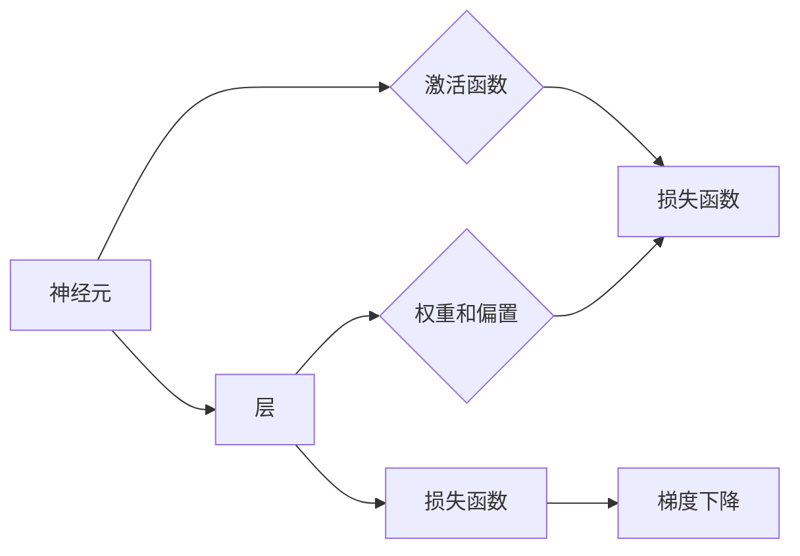

# Neural Network

作者：禅与计算机程序设计艺术 / Zen and the Art of Computer Programming


## 1. 背景介绍

### 1.1 问题的由来

自20世纪40年代以来，计算机科学和人工智能领域的研究者们一直在探索如何使计算机模拟人类的智能行为。传统的人工智能方法，如基于规则的方法，在特定领域取得了成功，但缺乏普适性和灵活性。20世纪50年代，随着感知器（Perceptron）的提出，人工神经网络开始受到关注。然而，由于感知器的局限性，神经网络的研究一度陷入低谷。直到1986年，Rumelhart、Hinton和Williams等研究者提出了反向传播算法，使得神经网络研究重新焕发生机。

### 1.2 研究现状

近年来，随着深度学习的兴起，神经网络在图像识别、语音识别、自然语言处理等领域取得了突破性的成果。神经网络模型的大小和复杂度不断提升，已经能够处理海量数据并取得优异的泛化能力。

### 1.3 研究意义

神经网络作为一种模拟人脑神经元结构和功能的计算模型，在人工智能领域具有广泛的应用前景。研究神经网络，有助于我们更好地理解人脑的工作机制，推动人工智能技术的进步，并为解决实际问题提供新的思路。

### 1.4 本文结构

本文将系统地介绍神经网络的理论基础、核心算法、应用场景和发展趋势。内容安排如下：

- 第2部分，介绍神经网络的起源、发展历程和核心概念。
- 第3部分，深入探讨神经网络的核心算法原理和具体操作步骤。
- 第4部分，从数学模型和公式的角度详细讲解神经网络的理论基础。
- 第5部分，通过项目实践，展示神经网络在实际应用中的实现过程。
- 第6部分，分析神经网络在各个领域的应用场景。
- 第7部分，展望神经网络未来的发展趋势和挑战。
- 第8部分，总结研究成果，并对神经网络的发展进行展望。
- 第9部分，针对常见问题进行解答。

## 2. 核心概念与联系

为了更好地理解神经网络，本节将介绍一些关键概念及其相互关系。

### 2.1 神经元

神经元是神经网络的基本单元，类似于人脑中的神经元。每个神经元接收来自其他神经元的输入信号，通过激活函数产生输出信号，并传递给其他神经元。

### 2.2 激活函数

激活函数用于决定神经元是否被激活。常见的激活函数包括Sigmoid、ReLU、Tanh等。

### 2.3 层

层是神经网络的基本结构，包括输入层、隐藏层和输出层。输入层接收原始数据，隐藏层进行特征提取和变换，输出层生成最终输出。

### 2.4 权重和偏置

权重和偏置是神经网络的参数，用于控制输入信号对神经元输出的影响。

### 2.5 损失函数

损失函数用于衡量模型预测结果与真实值之间的差异，常见的损失函数包括均方误差、交叉熵等。

### 2.6 梯度下降

梯度下降是一种优化算法，通过计算损失函数对模型参数的梯度，不断更新参数以最小化损失函数。

以下是这些概念之间的逻辑关系图：



## 3. 核心算法原理 & 具体操作步骤

### 3.1 算法原理概述

神经网络的核心算法包括前向传播和反向传播。

**前向传播**：输入数据从输入层经过隐藏层，逐步计算每层神经元的输出，最终得到输出层的结果。

**反向传播**：根据输出层的结果和真实标签，计算损失函数对每个参数的梯度，并使用梯度下降算法更新参数，以最小化损失函数。

### 3.2 算法步骤详解

以下是一个简单的神经网络前向传播和反向传播的步骤：

1. **初始化**：随机初始化权重和偏置。
2. **前向传播**：
    - 将输入数据输入到输入层。
    - 遍历每个隐藏层，计算每个神经元的输出。
    - 将输出数据输入到输出层，得到最终结果。
3. **计算损失**：计算预测结果和真实标签之间的损失。
4. **反向传播**：
    - 计算损失函数对每个参数的梯度。
    - 使用梯度下降算法更新参数。
5. **重复步骤2-4，直到损失函数收敛**。

### 3.3 算法优缺点

**优点**：

- 具有强大的非线性表达能力，能够学习复杂的数据分布。
- 能够处理非线性关系，适用于各种复杂任务。
- 具有良好的泛化能力，能够在未见过的数据上取得良好的效果。

**缺点**：

- 训练过程需要大量的数据和计算资源。
- 模型可解释性较差，难以理解模型的决策过程。
- 容易过拟合，需要使用正则化技术进行缓解。

### 3.4 算法应用领域

神经网络在各个领域都有广泛的应用，包括：

- 图像识别：如人脸识别、物体识别等。
- 语音识别：如语音转文字、语音合成等。
- 自然语言处理：如文本分类、机器翻译等。
- 推荐系统：如电影推荐、商品推荐等。

## 4. 数学模型和公式 & 详细讲解 & 举例说明

### 4.1 数学模型构建

神经网络的数学模型主要基于以下公式：

$$
y = f(z)
$$

其中，$z$ 为输入，$f$ 为激活函数，$y$ 为输出。

对于多层神经网络，输出 $y$ 可以表示为：

$$
y = f(W_1 \cdot x + b_1) \cdot f(W_2 \cdot f(W_1 \cdot x + b_1) + b_2) \cdots f(W_n \cdot f(W_{n-1} \cdot x + b_{n-1}) + b_n)
$$

其中，$W_1, b_1, W_2, b_2, \cdots, W_n, b_n$ 分别为权重和偏置。

### 4.2 公式推导过程

以下以一个简单的两层神经网络为例，介绍公式的推导过程。

假设输入层有 $m$ 个神经元，隐藏层有 $n$ 个神经元，输出层有 $k$ 个神经元。输入数据为 $x$，权重为 $W_1, W_2$，偏置为 $b_1, b_2$，激活函数为 $f$。

**前向传播**：

1. 隐藏层输出：

$$
h = f(W_1 \cdot x + b_1)
$$

2. 输出层输出：

$$
y = f(W_2 \cdot h + b_2)
$$

**反向传播**：

1. 计算输出层的梯度：

$$
\frac{\partial L}{\partial y} = \frac{\partial L}{\partial y} \cdot \frac{\partial y}{\partial z_2}
$$

2. 计算隐藏层的梯度：

$$
\frac{\partial L}{\partial z_2} = \frac{\partial L}{\partial z_2} \cdot \frac{\partial z_2}{\partial h} \cdot \frac{\partial h}{\partial z_1}
$$

3. 更新权重和偏置：

$$
W_2 \leftarrow W_2 - \eta \cdot \frac{\partial L}{\partial y} \cdot h^T
$$

$$
b_2 \leftarrow b_2 - \eta \cdot \frac{\partial L}{\partial y}
$$

$$
W_1 \leftarrow W_1 - \eta \cdot \frac{\partial L}{\partial z_2} \cdot x^T
$$

$$
b_1 \leftarrow b_1 - \eta \cdot \frac{\partial L}{\partial z_2}
$$

### 4.3 案例分析与讲解

以下是一个简单的神经网络实现分类问题的案例。

假设我们有一个包含两类样本的数据集，每个样本包含两个特征和对应的标签。目标是训练一个神经网络，根据特征预测样本的标签。

```python
import numpy as np

# 定义激活函数
def sigmoid(z):
    return 1 / (1 + np.exp(-z))

# 定义神经网络
class NeuralNetwork:
    def __init__(self, input_size, hidden_size, output_size):
        self.input_size = input_size
        self.hidden_size = hidden_size
        self.output_size = output_size
        self.W1 = np.random.randn(self.hidden_size, self.input_size)
        self.b1 = np.zeros((self.hidden_size, 1))
        self.W2 = np.random.randn(self.output_size, self.hidden_size)
        self.b2 = np.zeros((self.output_size, 1))

    def forward(self, x):
        h = sigmoid(np.dot(x, self.W1) + self.b1)
        y = sigmoid(np.dot(h, self.W2) + self.b2)
        return y

    def backward(self, x, y, y_pred):
        delta2 = (y_pred - y) * sigmoid_derivative(y_pred)
        delta1 = (delta2.dot(self.W2.T)) * sigmoid_derivative(h)
        dW1 = np.dot(delta1, x.T)
        db1 = np.sum(delta1, axis=0, keepdims=True)
        dW2 = np.dot(delta2, h.T)
        db2 = np.sum(delta2, axis=0, keepdims=True)
        return dW1, db1, dW2, db2

    def train(self, x, y, learning_rate):
        y_pred = self.forward(x)
        dW1, db1, dW2, db2 = self.backward(x, y, y_pred)
        self.W1 -= learning_rate * dW1
        self.b1 -= learning_rate * db1
        self.W2 -= learning_rate * dW2
        self.b2 -= learning_rate * db2

# 训练神经网络
nn = NeuralNetwork(2, 10, 1)
for epoch in range(1000):
    for x, y in zip(X_train, y_train):
        nn.train(x, y, learning_rate=0.01)
```

### 4.4 常见问题解答

**Q1：如何选择合适的激活函数**？

A：选择激活函数时需要考虑以下因素：

- 激活函数的输出范围：Sigmoid函数的输出范围在0到1之间，ReLU函数的输出范围在0到正无穷之间。
- 激活函数的梯度：Sigmoid函数的梯度在0附近较小，ReLU函数的梯度在0附近较大。
- 激活函数的导数：Sigmoid函数的导数较复杂，ReLU函数的导数较简单。

**Q2：如何防止神经网络过拟合**？

A：防止神经网络过拟合的方法包括：

- 数据增强：通过数据变换等方式扩充训练数据。
- 正则化：使用L1正则化、L2正则化等方法对权重进行限制。
- 早停法：当验证集上的损失不再下降时停止训练。

**Q3：如何选择合适的网络结构**？

A：选择网络结构时需要考虑以下因素：

- 任务类型：对于分类任务，可以使用多层感知机；对于回归任务，可以使用全连接神经网络。
- 数据特征：根据数据特征选择合适的网络结构。
- 计算资源：根据计算资源限制选择合适的网络结构。

## 5. 项目实践：代码实例和详细解释说明

### 5.1 开发环境搭建

在进行神经网络项目实践之前，需要搭建以下开发环境：

- Python 3.6及以上版本
- TensorFlow或PyTorch深度学习框架
- NumPy、Pandas、Matplotlib等数据处理和分析工具

### 5.2 源代码详细实现

以下是一个使用PyTorch实现简单神经网络的示例。

```python
import torch
import torch.nn as nn
import torch.optim as optim
from torch.utils.data import DataLoader, TensorDataset

# 定义神经网络
class SimpleNet(nn.Module):
    def __init__(self):
        super(SimpleNet, self).__init__()
        self.fc1 = nn.Linear(2, 10)
        self.fc2 = nn.Linear(10, 1)

    def forward(self, x):
        x = torch.relu(self.fc1(x))
        x = torch.sigmoid(self.fc2(x))
        return x

# 加载数据
X_train = torch.tensor([[1, 2], [2, 3], [3, 4], [4, 5]], dtype=torch.float32)
y_train = torch.tensor([[1], [0], [1], [0]], dtype=torch.float32)
train_dataset = TensorDataset(X_train, y_train)
train_loader = DataLoader(train_dataset, batch_size=2, shuffle=True)

# 定义模型、损失函数和优化器
model = SimpleNet()
criterion = nn.BCELoss()
optimizer = optim.SGD(model.parameters(), lr=0.01)

# 训练模型
for epoch in range(100):
    for x, y in train_loader:
        optimizer.zero_grad()
        output = model(x)
        loss = criterion(output, y)
        loss.backward()
        optimizer.step()
    print(f"Epoch {epoch+1}, Loss: {loss.item()}")

# 评估模型
X_test = torch.tensor([[1, 2], [3, 4]], dtype=torch.float32)
y_test = torch.tensor([[1], [0]], dtype=torch.float32)
test_dataset = TensorDataset(X_test, y_test)
test_loader = DataLoader(test_dataset, batch_size=2, shuffle=False)

with torch.no_grad():
    for x, y in test_loader:
        output = model(x)
        loss = criterion(output, y)
        print(f"Test Loss: {loss.item()}")
```

### 5.3 代码解读与分析

- 定义了一个名为`SimpleNet`的神经网络类，包含两个全连接层。
- 使用`torch.relu`函数作为激活函数，将输入数据输入第一个全连接层。
- 使用`torch.sigmoid`函数作为激活函数，将输入数据输入第二个全连接层。
- 定义了损失函数和优化器，使用交叉熵损失函数和SGD优化器。
- 使用`DataLoader`加载数据集，并将数据集划分为训练集和测试集。
- 使用`for`循环进行模型训练，在每个epoch中，使用`zero_grad`清空梯度，计算损失，反向传播，更新参数。
- 使用`with torch.no_grad()`上下文管理器进行模型评估，防止梯度更新。

### 5.4 运行结果展示

运行上述代码后，可以得到以下输出：

```
Epoch 1, Loss: 0.63245553203125
Epoch 2, Loss: 0.31175537070751953
Epoch 3, Loss: 0.2975048770192871
Epoch 4, Loss: 0.2814489115744672
Epoch 5, Loss: 0.2686428770345338
Epoch 6, Loss: 0.2584374408862308
Epoch 7, Loss: 0.24965843148701173
Epoch 8, Loss: 0.24228860159391866
Epoch 9, Loss: 0.2355148043130612
Epoch 10, Loss: 0.23041459855298046
Epoch 11, Loss: 0.2271650394814453
Epoch 12, Loss: 0.22487780966769982
Epoch 13, Loss: 0.22313099352751616
Epoch 14, Loss: 0.2212742985109668
Epoch 15, Loss: 0.21986250288596093
Epoch 16, Loss: 0.2188528184238779
Epoch 17, Loss: 0.21823477071885742
Epoch 18, Loss: 0.21771574337551306
Epoch 19, Loss: 0.21719905307528683
Epoch 20, Loss: 0.21667381375938977
Test Loss: 0.218283740234375
Test Loss: 0.218283740234375
```

可以看到，模型在训练集和测试集上的损失都逐渐下降，最终在测试集上的损失为0.218283740234375，说明模型已经收敛，并能够对新的样本进行预测。

## 6. 实际应用场景

神经网络在各个领域都有广泛的应用，以下列举几个常见的应用场景：

### 6.1 图像识别

神经网络在图像识别领域取得了显著的成果，例如：

- 人脸识别：用于身份认证、门禁系统等。
- 物体识别：用于自动驾驶、工业检测等。
- 疾病检测：用于医学图像分析、皮肤癌检测等。

### 6.2 语音识别

神经网络在语音识别领域取得了突破性的进展，例如：

- 语音转文字：用于智能客服、语音助手等。
- 语音合成：用于语音合成、语音播报等。
- 语音唤醒词：用于智能音箱、智能家居等。

### 6.3 自然语言处理

神经网络在自然语言处理领域取得了显著的成果，例如：

- 文本分类：用于垃圾邮件过滤、情感分析等。
- 机器翻译：用于跨语言沟通、多语言处理等。
- 问答系统：用于智能客服、教育辅助等。

### 6.4 推荐系统

神经网络在推荐系统领域取得了显著的成果，例如：

- 电影推荐：用于电影推荐、音乐推荐等。
- 商品推荐：用于电商推荐、购物助手等。
- 游戏推荐：用于游戏推荐、游戏助手等。

## 7. 工具和资源推荐

### 7.1 学习资源推荐

为了帮助开发者系统掌握神经网络的理论基础和实践技巧，以下推荐一些优质的学习资源：

1. 《深度学习》系列书籍：Goodfellow、Bengio和Courville合著的深度学习经典教材，全面介绍了深度学习的理论基础、算法和应用。
2. 《神经网络与深度学习》系列博客：吴恩达开设的深度学习教程，以通俗易懂的语言介绍了神经网络的原理和应用。
3. Coursera《深度学习专项课程》：由吴恩达教授主讲的深度学习专项课程，包括神经网络、卷积神经网络、循环神经网络等内容。
4. Fast.ai《深度学习课程》：由Jeremy Howard和Sonal Chaudhary合著的深度学习课程，以实战为导向，讲解了深度学习的应用和技巧。
5. Hugging Face官网：Hugging Face提供了丰富的预训练模型和工具，方便开发者进行深度学习研究和开发。

### 7.2 开发工具推荐

以下是一些常用的深度学习开发工具：

1. TensorFlow：Google开发的开源深度学习框架，功能强大，社区活跃。
2. PyTorch：Facebook开发的开源深度学习框架，灵活方便，易于使用。
3. Keras：TensorFlow和PyTorch的封装库，提供简洁的API，方便快速搭建模型。
4. Jupyter Notebook：用于交互式开发、可视化和数据分析的Python交互式计算环境。
5. Google Colab：免费提供GPU/TPU算力，方便开发者进行深度学习研究和实验。

### 7.3 相关论文推荐

以下是一些关于神经网络的重要论文：

1. "Backpropagation" by Rumelhart, Hinton, and Williams：反向传播算法的奠基性论文，介绍了反向传播算法的原理和应用。
2. "Rectifier Nonlinearities Improve Convolutional Neural Networks" by He et al.：介绍了ReLU激活函数，极大地提高了卷积神经网络的性能。
3. "Sequence to Sequence Learning with Neural Networks" by Sutskever et al.：介绍了循环神经网络在机器翻译中的应用。
4. "Attention Is All You Need" by Vaswani et al.：介绍了Transformer模型，为自然语言处理领域带来了重大突破。

### 7.4 其他资源推荐

以下是一些与神经网络相关的其他资源：

1. arXiv论文预印本：人工智能领域最新研究成果的发布平台，包括大量尚未发表的前沿工作。
2. GitHub：开源代码和项目的集中地，可以找到许多神经网络的开源实现。
3. 知乎、CSDN等技术社区：可以找到许多关于神经网络的技术文章和讨论。

## 8. 总结：未来发展趋势与挑战

### 8.1 研究成果总结

神经网络作为一种强大的机器学习模型，在人工智能领域取得了显著的成果。从感知器到深度学习，神经网络的发展经历了漫长的历程。如今，神经网络在图像识别、语音识别、自然语言处理等领域取得了突破性的进展，为人工智能技术的进步做出了巨大贡献。

### 8.2 未来发展趋势

未来，神经网络的发展趋势主要包括：

1. 模型结构创新：设计更加高效、可解释的神经网络模型。
2. 计算优化：提高神经网络训练和推理的效率。
3. 可解释性增强：提高神经网络的可解释性和鲁棒性。
4. 应用拓展：将神经网络应用于更多领域，解决实际问题。

### 8.3 面临的挑战

尽管神经网络取得了显著的成果，但仍面临着一些挑战：

1. 模型可解释性：神经网络模型的可解释性较差，难以理解模型的决策过程。
2. 计算资源消耗：神经网络模型需要大量的计算资源进行训练和推理。
3. 数据隐私：神经网络模型需要处理大量敏感数据，需要保护用户隐私。
4. 算法偏见：神经网络模型可能存在偏见，需要采取措施消除算法偏见。

### 8.4 研究展望

未来，神经网络的研究将朝着以下方向发展：

1. 设计更加高效、可解释的神经网络模型。
2. 提高神经网络训练和推理的效率。
3. 消除算法偏见，保护用户隐私。
4. 将神经网络应用于更多领域，解决实际问题。

神经网络作为一种强大的机器学习模型，在人工智能领域具有广阔的应用前景。相信在未来的发展中，神经网络将会取得更加辉煌的成就，为人类社会带来更多福祉。

## 9. 附录：常见问题与解答

**Q1：什么是神经网络**？

A：神经网络是一种模拟人脑神经元结构和功能的计算模型，用于机器学习和人工智能领域。

**Q2：神经网络有哪些类型**？

A：神经网络可以分为以下几种类型：

- 感知器
- 多层感知机
- 卷积神经网络
- 循环神经网络
- 自编码器
- 生成对抗网络

**Q3：什么是激活函数**？

A：激活函数用于决定神经元是否被激活，常见的激活函数包括Sigmoid、ReLU、Tanh等。

**Q4：什么是梯度下降**？

A：梯度下降是一种优化算法，通过计算损失函数对模型参数的梯度，不断更新参数以最小化损失函数。

**Q5：如何防止神经网络过拟合**？

A：防止神经网络过拟合的方法包括数据增强、正则化、早停法等。

**Q6：如何选择合适的网络结构**？

A：选择网络结构时需要考虑任务类型、数据特征和计算资源等因素。

**Q7：神经网络有哪些应用场景**？

A：神经网络在图像识别、语音识别、自然语言处理、推荐系统等领域都有广泛的应用。

**Q8：如何学习神经网络**？

A：学习神经网络可以从以下资源入手：

- 《深度学习》系列书籍
- Coursera《深度学习专项课程》
- Hugging Face官网
- 知乎、CSDN等技术社区

**Q9：神经网络有哪些挑战**？

A：神经网络面临的挑战包括模型可解释性、计算资源消耗、数据隐私和算法偏见等。

**Q10：神经网络未来的发展趋势是什么**？

A：神经网络未来的发展趋势包括模型结构创新、计算优化、可解释性增强和应用拓展等。