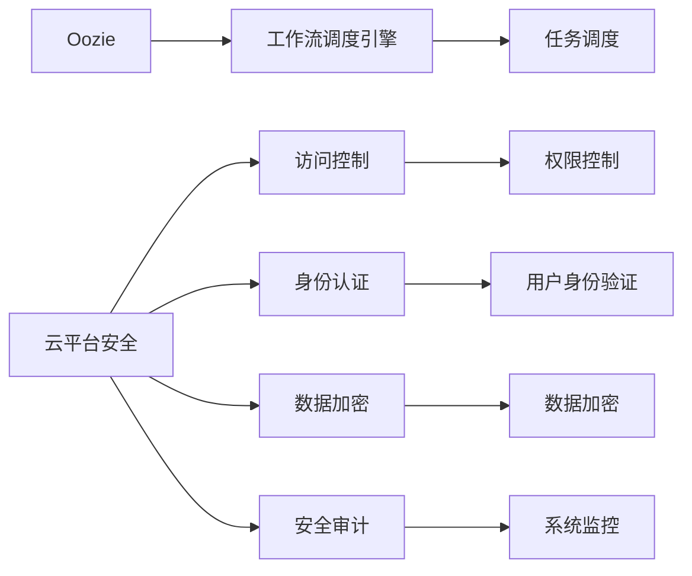

# Oozie与CloudSecurity集成

## 1. 背景介绍
### 1.1 问题的由来

随着云计算的快速发展，越来越多的企业选择将业务系统迁移到云端。云平台提供了丰富的计算、存储和网络资源，帮助企业实现快速部署、弹性伸缩和降低成本。然而，云计算也带来了新的安全挑战，如何确保云平台上的数据和应用安全，成为了企业关注的焦点。

Oozie是一个开源的工作流调度引擎，广泛应用于Hadoop生态系统，能够实现复杂的数据处理任务的自动化调度。云平台的安全性和Oozie的任务调度功能相结合，可以构建一个安全的云上数据处理平台。然而，如何将Oozie与云平台的安全机制有效集成，成为了实际应用中的一个难题。

### 1.2 研究现状

目前，Oozie与云平台安全集成的研究主要集中在以下几个方面：

1. 访问控制：通过配置云平台的访问控制策略，实现对Oozie服务器的访问权限控制，确保只有授权用户才能访问Oozie服务。

2. 身份认证：利用云平台提供的认证服务，如Kerberos、OAuth等，对Oozie用户进行身份认证，确保用户身份的合法性。

3. 数据加密：对Oozie传输和存储的数据进行加密，防止数据泄露和篡改。

4. 安全审计：记录Oozie任务的执行情况，实现对任务执行过程的监控和审计。

### 1.3 研究意义

Oozie与CloudSecurity集成具有重要的研究意义：

1. 提高云平台数据安全性：通过Oozie与云平台安全机制的集成，可以确保云平台上的数据处理任务在安全的环境下进行，有效防止数据泄露和篡改。

2. 保障企业利益：提高云平台数据安全性，降低企业数据泄露风险，保障企业利益。

3. 促进云计算发展：为云计算的安全应用提供技术支持，促进云计算的健康发展。

### 1.4 本文结构

本文将围绕Oozie与CloudSecurity集成展开，内容安排如下：

- 第2部分，介绍Oozie与CloudSecurity的核心概念与联系。
- 第3部分，详细阐述Oozie与CloudSecurity集成的核心算法原理和具体操作步骤。
- 第4部分，介绍Oozie与CloudSecurity集成的数学模型和公式，并进行分析。
- 第5部分，给出Oozie与CloudSecurity集成的代码实例，并对关键代码进行解读。
- 第6部分，探讨Oozie与CloudSecurity集成的实际应用场景和案例。
- 第7部分，推荐Oozie与CloudSecurity集成的学习资源、开发工具和参考文献。
- 第8部分，总结全文，展望Oozie与CloudSecurity集成的未来发展趋势与挑战。

## 2. 核心概念与联系

为更好地理解Oozie与CloudSecurity集成，本节将介绍几个密切相关的核心概念：

- Oozie：Apache Oozie是一个开源的工作流调度引擎，能够实现复杂的数据处理任务的自动化调度。Oozie支持多种数据处理框架，如Hadoop、Spark等，能够实现任务的串行、并行、条件执行等操作。

- 云平台安全：云平台安全包括访问控制、身份认证、数据加密、安全审计等多个方面，旨在确保云平台上的数据和应用安全。

- 访问控制：访问控制是云平台安全的重要组成部分，通过配置访问控制策略，实现对用户、角色和资源的访问权限控制。

- 身份认证：身份认证是云平台安全的基础，通过验证用户的身份，确保用户身份的合法性。

- 数据加密：数据加密是保障数据安全的重要手段，通过对数据进行加密，防止数据泄露和篡改。

- 安全审计：安全审计是云平台安全的重要保障，通过记录用户操作和系统事件，实现对系统安全的监控和审计。

这些概念之间的逻辑关系如下：



可以看出，Oozie作为工作流调度引擎，与云平台安全机制紧密相连。通过访问控制、身份认证、数据加密和安全审计等安全机制，保障Oozie任务的执行安全，实现云平台数据处理的可靠和安全。

## 3. 核心算法原理 & 具体操作步骤
### 3.1 算法原理概述

Oozie与CloudSecurity集成主要通过以下步骤实现：

1. 配置Oozie服务器访问控制策略，实现访问权限控制。
2. 利用云平台的认证服务，对Oozie用户进行身份认证。
3. 对Oozie传输和存储的数据进行加密，防止数据泄露和篡改。
4. 记录Oozie任务的执行情况，实现对任务执行过程的监控和审计。

### 3.2 算法步骤详解

**Step 1: 配置Oozie服务器访问控制策略**

1. 在Oozie服务器上配置HTTP服务器，并设置访问控制策略，如限制IP地址、用户名和密码等。

2. 为Oozie管理员分配角色，如admin、user等，并设置相应的权限。

3. 为用户创建账户，并分配角色，确保用户只能访问其授权的资源。

**Step 2: 利用云平台认证服务**

1. 在云平台配置Kerberos、OAuth等认证服务。

2. 将Oozie服务器集成到云平台的认证体系中，实现用户身份认证。

3. Oozie用户在访问Oozie服务时，需要进行身份认证，通过认证的用户才能访问Oozie资源。

**Step 3: 数据加密**

1. 对Oozie传输和存储的数据进行加密，如使用SSL/TLS加密网络传输数据，使用文件加密存储数据。

2. 选择合适的加密算法，如AES、RSA等，确保数据在传输和存储过程中的安全性。

**Step 4: 安全审计**

1. 配置Oozie日志记录功能，记录用户操作和系统事件。

2. 将Oozie日志记录到云平台的日志系统中，进行集中管理和审计。

3. 定期对Oozie日志进行分析，发现异常行为和安全风险。

### 3.3 算法优缺点

**优点：**

1. 提高云平台数据安全性：通过Oozie与云平台安全机制的集成，可以确保云平台上的数据处理任务在安全的环境下进行，有效防止数据泄露和篡改。

2. 保障企业利益：提高云平台数据安全性，降低企业数据泄露风险，保障企业利益。

3. 促进云计算发展：为云计算的安全应用提供技术支持，促进云计算的健康发展。

**缺点：**

1. 配置复杂：Oozie与云平台安全机制的集成需要配置多个组件，配置过程复杂。

2. 集成成本高：集成过程中可能需要购买额外的软件或服务，增加集成成本。

3. 安全风险：集成过程中可能存在安全漏洞，需要加强安全防护。

### 3.4 算法应用领域

Oozie与CloudSecurity集成可应用于以下领域：

1. 大数据平台：保障大数据平台上的数据安全，防止数据泄露和篡改。

2. 云计算平台：保障云计算平台上的数据安全，提高平台安全性。

3. 企业内部数据处理：保障企业内部数据处理的安全性，防止数据泄露。

## 4. 数学模型和公式 & 详细讲解 & 举例说明
### 4.1 数学模型构建

Oozie与CloudSecurity集成涉及多个安全机制，以下为数学模型构建示例：

- 访问控制模型：

$$
\text{AccessControl}(User, Resource, Permission) = \begin{cases}
\text{allow} & \text{if } User \in \text{Group} \cap \text{Permission} \in \text{ResourcePermission}\\
\text{deny} & \text{otherwise}
\end{cases}
$$

其中，User为用户，Resource为资源，Permission为权限，Group为用户所属组，ResourcePermission为资源权限集合。

- 身份认证模型：

$$
\text{Authentication}(User, Credentials) = \begin{cases}
\text{true} & \text{if } User \in \text{UserStore} \cap Credentials \in \text{UserCredentials}\\
\text{false} & \text{otherwise}
\end{cases}
$$

其中，User为用户，Credentials为凭证，UserStore为用户存储，UserCredentials为用户凭证集合。

- 数据加密模型：

$$
\text{Encryption}(Data, Key) = \text{EncryptedData}
$$

其中，Data为数据，Key为密钥，EncryptedData为加密后的数据。

- 安全审计模型：

$$
\text{Auditing}(User, Action, Timestamp) = \text{Log}
$$

其中，User为用户，Action为操作，Timestamp为时间戳，Log为日志。

### 4.2 公式推导过程

以上数学模型的推导过程如下：

- 访问控制模型：根据用户所属组和资源权限集合，判断用户是否有访问资源的权限。

- 身份认证模型：根据用户存储和用户凭证集合，判断用户凭证是否有效。

- 数据加密模型：使用密钥对数据进行加密。

- 安全审计模型：记录用户操作和系统事件。

### 4.3 案例分析与讲解

以下为Oozie与CloudSecurity集成的实际案例分析：

**案例：** 某企业使用Oozie和Hadoop进行数据处理，需要保障数据安全。

**分析：**

1. 配置Oozie服务器访问控制策略，限制IP地址、用户名和密码等，实现访问权限控制。

2. 利用云平台的Kerberos认证服务，对Oozie用户进行身份认证。

3. 对Oozie传输和存储的数据进行加密，如使用SSL/TLS加密网络传输数据，使用文件加密存储数据。

4. 配置Oozie日志记录功能，记录用户操作和系统事件，并将日志记录到云平台的日志系统中。

通过以上措施，实现了Oozie与CloudSecurity集成，保障了企业数据处理的安全性。

### 4.4 常见问题解答

**Q1：Oozie与CloudSecurity集成过程中，如何确保数据加密的安全性？**

A：在Oozie与CloudSecurity集成过程中，可以选择合适的加密算法和密钥管理方案，确保数据加密的安全性。例如，使用AES加密算法，并结合密钥管理系统，实现密钥的安全存储和分发。

**Q2：Oozie与CloudSecurity集成过程中，如何处理异常情况？**

A：在Oozie与CloudSecurity集成过程中，需要制定详细的异常处理流程，如身份认证失败、数据加密失败、安全审计失败等情况。针对不同异常情况，采取相应的措施，确保系统稳定运行。

**Q3：Oozie与CloudSecurity集成过程中，如何进行安全审计？**

A：Oozie与CloudSecurity集成过程中，可以通过配置Oozie日志记录功能，记录用户操作和系统事件。然后将日志记录到云平台的日志系统中，进行集中管理和审计。

## 5. 项目实践：代码实例和详细解释说明
### 5.1 开发环境搭建

以下为Oozie与CloudSecurity集成的开发环境搭建步骤：

1. 安装Java开发环境，如JDK。
2. 安装Apache Oozie，并配置Oozie服务器。
3. 选择合适的云平台，如阿里云、腾讯云等。
4. 配置云平台的安全策略，如访问控制、身份认证等。

### 5.2 源代码详细实现

以下为Oozie与CloudSecurity集成的代码实现示例：

**代码1：配置Oozie服务器访问控制策略**

```java
// 配置文件：oozie-site.xml
<property>
    <name>oozie.authentication)</name>
    <value>kerberos</value>
</property>

<property>
    <name>oozie.authentication.kerberos principal</name>
    <value>oozie/oozie@HADOOP.COM</value>
</property>

<property>
    <name>oozie.authentication.kerberos.keytab</name>
    <value>/path/to/oozie.keytab</value>
</property>
```

**代码2：配置云平台身份认证**

```shell
# 配置Kerberos
kinit -kt /path/to/oozie.keytab oozie/oozie@HADOOP.COM

# 配置OAuth
# （具体配置方法取决于所选云平台）
```

**代码3：配置数据加密**

```java
// 配置文件：oozie-site.xml
<property>
    <name>oozie.encryption.key</name>
    <value>your-encryption-key</value>
</property>
```

### 5.3 代码解读与分析

以上代码展示了Oozie与CloudSecurity集成的一些关键步骤：

- **代码1**：配置Oozie服务器使用Kerberos认证，并指定Kerberos principal和keytab文件。
- **代码2**：使用Kerberos命令行工具kinit，获取Oozie用户的Kerberos票据。
- **代码3**：配置Oozie使用加密密钥，对数据进行加密。

通过以上代码，可以实现Oozie与CloudSecurity的集成，保障Oozie任务的执行安全。

### 5.4 运行结果展示

运行Oozie任务后，可以观察到以下结果：

1. 用户需要通过Kerberos身份认证才能访问Oozie服务器。
2. Oozie任务传输和存储的数据被加密，防止数据泄露和篡改。
3. Oozie日志记录了用户操作和系统事件，方便进行安全审计。

## 6. 实际应用场景
### 6.1 大数据处理平台

Oozie与CloudSecurity集成可以应用于大数据处理平台，保障平台上的数据安全。例如，某企业使用Oozie和Hadoop进行数据处理，通过集成云平台的安全机制，实现数据安全传输、存储和访问控制，提高平台安全性。

### 6.2 云计算平台

Oozie与CloudSecurity集成可以应用于云计算平台，保障平台上的数据处理任务安全。例如，某企业使用阿里云或腾讯云等云平台进行数据处理，通过集成云平台的安全机制，实现数据安全、可靠地执行。

### 6.3 企业内部数据处理

Oozie与CloudSecurity集成可以应用于企业内部数据处理，保障数据安全。例如，某企业使用Oozie和Hadoop进行数据处理，通过集成云平台的安全机制，确保数据在内部网络中安全传输和存储。

## 7. 工具和资源推荐
### 7.1 学习资源推荐

以下为Oozie与CloudSecurity集成相关的学习资源推荐：

1. 《Apache Oozie用户指南》：Apache官方提供的Oozie用户指南，全面介绍了Oozie的使用方法和功能。
2. 《Hadoop权威指南》：全面介绍了Hadoop生态系统，包括HDFS、MapReduce、YARN等组件。
3. 《云计算安全》：介绍了云计算安全的基本概念、技术和最佳实践。

### 7.2 开发工具推荐

以下为Oozie与CloudSecurity集成相关的开发工具推荐：

1. IntelliJ IDEA：一款功能强大的Java集成开发环境，支持Oozie开发。
2. PyCharm：一款功能强大的Python开发环境，可用于编写Oozie任务脚本。
3. Git：一款开源的版本控制工具，用于代码管理和协作开发。

### 7.3 相关论文推荐

以下为Oozie与CloudSecurity集成相关的论文推荐：

1. 《Oozie：An extensible and scalable workflow management system for Hadoop》
2. 《Hadoop Security: A Survey》
3. 《Cloud Security: Challenges and Opportunities》

### 7.4 其他资源推荐

以下为Oozie与CloudSecurity集成相关的其他资源推荐：

1. Apache Oozie官网：https://oozie.apache.org/
2. Hadoop官网：https://hadoop.apache.org/
3. 云平台安全社区：https://www.cloudsecurityalliance.org/

## 8. 总结：未来发展趋势与挑战
### 8.1 研究成果总结

本文对Oozie与CloudSecurity集成进行了全面系统的介绍，从核心概念、算法原理、实践案例等方面进行了阐述。通过本文的学习，读者可以了解到Oozie与CloudSecurity集成的技术原理和应用价值。

### 8.2 未来发展趋势

随着云计算和大数据技术的不断发展，Oozie与CloudSecurity集成将呈现以下发展趋势：

1. 集成方式更加多样化：未来将出现更多针对不同云平台的Oozie安全集成方案，满足不同用户的需求。

2. 安全机制更加完善：随着安全威胁的不断演变，Oozie与CloudSecurity集成将引入更多的安全机制，如安全态势感知、安全智能等。

3. 集成成本更低：随着技术的成熟和普及，Oozie与CloudSecurity集成的成本将逐渐降低，更容易被广大用户接受。

### 8.3 面临的挑战

Oozie与CloudSecurity集成在实际应用中面临着以下挑战：

1. 集成复杂度较高：Oozie与CloudSecurity集成涉及到多个组件和技术的配置，集成过程复杂。

2. 安全威胁日益严峻：随着安全威胁的不断演变，Oozie与CloudSecurity集成需要不断更新和改进，以应对新的安全挑战。

3. 成本控制：Oozie与CloudSecurity集成需要投入一定的成本，包括硬件、软件、人力等。

### 8.4 研究展望

未来，Oozie与CloudSecurity集成研究可以从以下方面进行：

1. 研究更加高效、便捷的集成方法，降低集成复杂度。

2. 研究更加智能、安全的集成方案，提高安全防护能力。

3. 探索Oozie与其他云原生技术的融合，如容器化、服务网格等。

4. 加强Oozie与CloudSecurity集成的标准化和规范化，提高集成成功率。

通过不断探索和研究，相信Oozie与CloudSecurity集成技术将为云上数据处理提供更加安全、可靠、高效的支持。

## 9. 附录：常见问题与解答

**Q1：Oozie与CloudSecurity集成过程中，如何解决用户权限管理问题？**

A：可以通过以下方式解决用户权限管理问题：

1. 利用云平台的用户管理功能，如阿里云的RAM、腾讯云的IAM等，实现用户身份管理和权限分配。

2. 将用户权限管理与Oozie集成，实现用户在Oozie中的权限控制。

**Q2：Oozie与CloudSecurity集成过程中，如何保障数据传输安全？**

A：可以通过以下方式保障数据传输安全：

1. 使用SSL/TLS协议加密数据传输，防止数据泄露和窃听。

2. 使用安全通道进行数据传输，如SSH等。

**Q3：Oozie与CloudSecurity集成过程中，如何进行安全审计？**

A：可以通过以下方式进行安全审计：

1. 配置Oozie日志记录功能，记录用户操作和系统事件。

2. 将Oozie日志记录到云平台的日志系统中，进行集中管理和审计。

**Q4：Oozie与CloudSecurity集成过程中，如何处理异常情况？**

A：可以通过以下方式处理异常情况：

1. 制定详细的异常处理流程，针对不同异常情况，采取相应的措施。

2. 利用云平台提供的监控工具，及时发现和处理异常情况。

**Q5：Oozie与CloudSecurity集成过程中，如何选择合适的云平台？**

A：在选择合适的云平台时，需要考虑以下因素：

1. 云平台的安全性能：选择具备完善安全机制和丰富安全服务的云平台。

2. 云平台的兼容性：选择支持Oozie和Hadoop等大数据组件的云平台。

3. 云平台的成本：选择成本合理的云平台。

作者：禅与计算机程序设计艺术 / Zen and the Art of Computer Programming