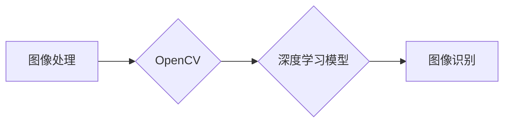

# OpenCV 原理与代码实战案例讲解

作者：禅与计算机程序设计艺术 / Zen and the Art of Computer Programming

## 1. 背景介绍

### 1.1 问题的由来

计算机视觉是人工智能领域的一个重要分支，旨在让计算机能够像人类一样理解视觉信息，例如图像和视频。OpenCV (Open Source Computer Vision Library) 是一个强大的计算机视觉库，它提供了大量的图像处理和计算机视觉算法，被广泛应用于各种领域，如图像识别、视频处理、机器学习等。

OpenCV 的出现，使得计算机视觉技术不再遥不可及，即使是初学者也能快速上手并进行实践。本文将深入探讨 OpenCV 的原理和代码实战案例，帮助读者更好地理解和应用这一强大的计算机视觉工具。

### 1.2 研究现状

随着深度学习技术的快速发展，计算机视觉领域取得了巨大的突破。然而，OpenCV 作为传统计算机视觉库，依然在许多领域发挥着重要作用。它不仅能够处理传统的计算机视觉任务，如边缘检测、形态学操作、特征点匹配等，还能与深度学习模型结合，实现更复杂的视觉任务。

### 1.3 研究意义

学习 OpenCV，可以帮助开发者：

- 理解计算机视觉的基本原理和算法。
- 掌握 OpenCV 库的使用方法，解决实际问题。
- 将 OpenCV 与深度学习等技术结合，构建更强大的计算机视觉系统。

### 1.4 本文结构

本文将分为以下几个部分：

- 核心概念与联系
- 核心算法原理 & 具体操作步骤
- 数学模型和公式 & 详细讲解 & 举例说明
- 项目实践：代码实例和详细解释说明
- 实际应用场景
- 工具和资源推荐
- 总结：未来发展趋势与挑战
- 附录：常见问题与解答

## 2. 核心概念与联系

### 2.1 OpenCV 简介

OpenCV 是一个开源的计算机视觉库，由 Intel 开发，提供了大量的图像处理和计算机视觉算法。它支持多种编程语言，包括 C++、Python、Java 等，使得开发者可以轻松地进行计算机视觉应用开发。

### 2.2 OpenCV 的核心概念

OpenCV 的核心概念包括：

- 图像处理：对图像进行基本的操作，如读取、显示、保存、缩放、旋转等。
- 特征点检测：检测图像中的关键点，如角点、边缘等。
- 目标检测：在图像中定位并识别特定对象。
- 机器学习：使用机器学习算法进行图像分类、目标识别等任务。

### 2.3 OpenCV 与其他计算机视觉库的联系

OpenCV 与其他计算机视觉库，如 TensorFlow、PyTorch 等，可以进行结合使用。OpenCV 可以处理图像数据，将其作为输入传递给深度学习模型，从而实现更复杂的计算机视觉任务。



## 3. 核心算法原理 & 具体操作步骤

### 3.1 算法原理概述

OpenCV 提供了大量的图像处理和计算机视觉算法，以下是几个常见的算法：

- **图像处理**：包括灰度化、滤波、边缘检测、形态学操作等。
- **特征点检测**：包括 SIFT、SURF、ORB 等算法。
- **目标检测**：包括 Haar cascades、R-CNN、YOLO 等。
- **机器学习**：包括 SVM、随机森林、神经网络等。

### 3.2 算法步骤详解

以 Canny 边缘检测算法为例，详细介绍其步骤：

1. **灰度化**：将彩色图像转换为灰度图像。
2. **高斯模糊**：对图像进行高斯模糊处理，平滑图像，减少噪声。
3. **非极大值抑制**：对高斯模糊后的图像进行非极大值抑制，保留局部极值点。
4. **双阈值处理**：将图像分为三个区域，并根据阈值进行二值化处理。
5. **连接边缘**：将断开的边缘连接起来，形成完整的边缘。

### 3.3 算法优缺点

以 Canny 边缘检测算法为例，分析其优缺点：

- **优点**：能够检测出清晰的边缘，对噪声具有一定的鲁棒性。
- **缺点**：对噪声比较敏感，可能会漏检或误检边缘。

### 3.4 算法应用领域

Canny 边缘检测算法可以应用于以下领域：

- **图像分割**：将图像分割成不同的区域。
- **目标检测**：在图像中检测目标边缘。
- **图像识别**：从边缘中提取特征，进行图像识别。

## 4. 数学模型和公式 & 详细讲解 & 举例说明

### 4.1 数学模型构建

以 Canny 边缘检测算法为例，介绍其数学模型：

1. **高斯模糊**：使用高斯核对图像进行卷积，公式如下：

$$
G(x,y) = \frac{1}{2\pi\sigma^2}e^{-\frac{x^2+y^2}{2\sigma^2}}
$$

2. **非极大值抑制**：对每个像素点，比较其梯度值与邻域内其他像素点的梯度值，保留局部极值点。

3. **双阈值处理**：将图像分为三个区域，并根据阈值进行二值化处理。

### 4.2 公式推导过程

以高斯模糊为例，介绍其公式推导过程：

1. **高斯函数**：高斯函数是一个连续函数，其公式如下：

$$
G(x) = \frac{1}{\sqrt{2\pi\sigma^2}}e^{-\frac{x^2}{2\sigma^2}}
$$

2. **高斯核**：将高斯函数离散化，得到高斯核。

3. **卷积**：将高斯核与图像进行卷积，得到高斯模糊后的图像。

### 4.3 案例分析与讲解

以 Canny 边缘检测算法为例，分析其应用案例：

1. **图像分割**：使用 Canny 边缘检测算法检测图像边缘，将图像分割成不同的区域。
2. **目标检测**：在图像中检测目标边缘，用于目标定位和识别。

### 4.4 常见问题解答

**Q1：Canny 边缘检测算法的阈值如何设置？**

A1：Canny 边缘检测算法的阈值设置比较复杂，一般需要根据图像特点和需求进行调整。常用的方法是先使用 Otsu 算法进行二值化，得到两个阈值，然后使用这两个阈值进行双阈值处理。

**Q2：Canny 边缘检测算法对噪声敏感吗？**

A2：Canny 边缘检测算法对噪声有一定的鲁棒性，但仍然会受到噪声的影响。为了提高鲁棒性，可以在进行边缘检测之前对图像进行噪声去除处理。

## 5. 项目实践：代码实例和详细解释说明

### 5.1 开发环境搭建

1. 安装 Python 和 OpenCV 库：

```bash
pip install opencv-python
```

2. 安装 NumPy 库：

```bash
pip install numpy
```

### 5.2 源代码详细实现

以下是一个使用 OpenCV 进行图像边缘检测的代码示例：

```python
import cv2
import numpy as np

# 读取图像
image = cv2.imread('image.jpg', cv2.IMREAD_GRAYSCALE)

# 使用 Canny 算法检测边缘
edges = cv2.Canny(image, 100, 200)

# 显示结果
cv2.imshow('Edges', edges)
cv2.waitKey(0)
cv2.destroyAllWindows()
```

### 5.3 代码解读与分析

1. 导入 OpenCV 和 NumPy 库。
2. 读取图像，将其转换为灰度图像。
3. 使用 Canny 算法检测图像边缘。
4. 显示检测结果。

### 5.4 运行结果展示

运行上述代码，将显示输入图像的边缘检测结果。

## 6. 实际应用场景

### 6.1 图像分割

Canny 边缘检测算法可以用于图像分割，将图像分割成不同的区域。

### 6.2 目标检测

Canny 边缘检测算法可以用于目标检测，在图像中检测目标边缘。

### 6.3 图像识别

Canny 边缘检测算法可以用于图像识别，从边缘中提取特征，进行图像识别。

## 7. 工具和资源推荐

### 7.1 学习资源推荐

1. 《OpenCV计算机视觉基础》
2. 《OpenCV-Python编程实战》

### 7.2 开发工具推荐

1. Python
2. OpenCV

### 7.3 相关论文推荐

1. Canny，J. (1986). A computational approach to edge detection. IEEE Transactions on Pattern Analysis and Machine Intelligence, 8(6), 679-698.
2. Rosten, E., & Schmid, C. (2006). Interest point detection and matching using scale-invariant keypoints. IEEE Transactions on Pattern Analysis and Machine Intelligence, 29(8), 1210-1225.

### 7.4 其他资源推荐

1. OpenCV官网：https://opencv.org/
2. OpenCV教程：https://opencv-python-tutroial.readthedocs.io/en/latest/py_tutorials/py_tutorials.html

## 8. 总结：未来发展趋势与挑战

### 8.1 研究成果总结

OpenCV 是一个强大的计算机视觉库，为开发者提供了丰富的图像处理和计算机视觉算法。本文介绍了 OpenCV 的原理和代码实战案例，帮助读者更好地理解和应用 OpenCV。

### 8.2 未来发展趋势

随着深度学习技术的快速发展，OpenCV 将与深度学习技术结合，实现更复杂的计算机视觉任务。

### 8.3 面临的挑战

OpenCV 面临的挑战包括：

1. 深度学习模型与 OpenCV 库的结合。
2. 开发更简单易用的接口。
3. 提高库的性能和效率。

### 8.4 研究展望

OpenCV 将继续发展，为开发者提供更强大的计算机视觉工具，推动计算机视觉技术的发展。

## 9. 附录：常见问题与解答

**Q1：OpenCV 是什么？**

A1：OpenCV 是一个开源的计算机视觉库，提供了大量的图像处理和计算机视觉算法。

**Q2：如何安装 OpenCV？**

A2：可以使用 pip 工具安装 OpenCV：

```bash
pip install opencv-python
```

**Q3：OpenCV 可以做什么？**

A3：OpenCV 可以用于图像处理、特征点检测、目标检测、机器学习等计算机视觉任务。

**Q4：如何使用 OpenCV 进行图像处理？**

A4：可以使用 OpenCV 的函数进行图像处理，例如：

- `cv2.imread()`：读取图像。
- `cv2.imshow()`：显示图像。
- `cv2.imwrite()`：保存图像。

**Q5：如何使用 OpenCV 进行特征点检测？**

A5：可以使用 OpenCV 的函数进行特征点检测，例如：

- `cv2.SIFT_create()`：创建 SIFT 特征点检测器。
- `sift.detect()`：检测特征点。

**Q6：如何使用 OpenCV 进行目标检测？**

A6：可以使用 OpenCV 的函数进行目标检测，例如：

- `cv2.HaarClassifier_create()`：创建 Haar 分类器。
- `Haar detectMultiScale()`：检测目标。

**Q7：如何使用 OpenCV 进行机器学习？**

A7：可以使用 OpenCV 的函数进行机器学习，例如：

- `cv2.ml.SVM_create()`：创建 SVM 模型。
- `svm.train()`：训练模型。

作者：禅与计算机程序设计艺术 / Zen and the Art of Computer Programming