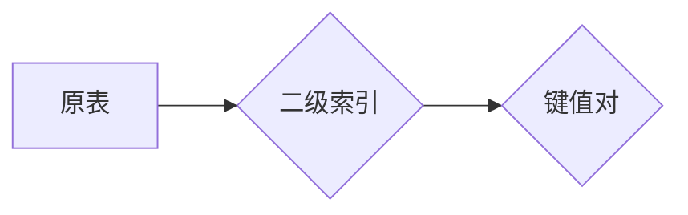

# Phoenix二级索引原理与代码实例讲解

作者：禅与计算机程序设计艺术 / Zen and the Art of Computer Programming

## 1. 背景介绍

### 1.1 问题的由来

随着数据量的爆炸式增长，关系型数据库的查询性能逐渐成为制约业务发展的瓶颈。为了提升查询效率，数据库索引技术应运而生。传统的B树索引以其优秀的查询性能和稳定的插入、删除操作，成为关系型数据库中应用最广泛的索引结构之一。

然而，随着查询需求的多样化，B树索引在处理某些特定查询场景时，例如多列查询和分区表查询，其性能表现并不理想。为了解决这些问题，二级索引应运而生。本文将深入探讨二级索引的原理、实现方法以及在实际应用中的优化策略。

### 1.2 研究现状

目前，二级索引已在多个数据库系统中得到广泛应用，如MySQL、PostgreSQL、Oracle等。其中，MySQL数据库中的InnoDB存储引擎对二级索引的实现进行了深入研究，并提供了多种类型的二级索引，如辅助索引、覆盖索引、组合索引等。

### 1.3 研究意义

深入研究二级索引的原理和实现方法，有助于我们更好地理解数据库索引技术，提升数据库查询性能，为数据库的设计和优化提供理论依据。

### 1.4 本文结构

本文将分为以下几个部分进行阐述：

- 第2章介绍二级索引的核心概念和联系；
- 第3章详细讲解二级索引的算法原理和实现步骤；
- 第4章分析二级索引的优缺点和应用领域；
- 第5章通过代码实例展示二级索引的应用；
- 第6章探讨二级索引在实际应用中的优化策略；
- 第7章总结全文，展望二级索引的未来发展趋势和挑战。

## 2. 核心概念与联系

### 2.1 索引

索引是一种数据结构，用于提高数据检索速度。它类似于书的目录，通过索引可以直接定位到数据的具体位置，避免逐行遍历数据。

### 2.2 B树索引

B树索引是一种平衡多路查找树，每个节点包含多个键值对，且键值对按照升序排列。B树索引具有以下特点：

- 查询效率高：通过二分查找，可以快速定位到目标键值；
- 插入、删除操作稳定：保持树的平衡，避免频繁的树重构；
- 空间利用率高：每个节点可以存储多个键值对，减少树的高度。

### 2.3 二级索引

二级索引是一种基于B树索引的索引结构，它包含多个列的键值对，可以针对多列查询进行优化。二级索引与原表之间的关系如下：



二级索引的键值对通常包含以下信息：

- 键值：由原表中的多个列组合而成；
- 值：原表中对应键值的记录行地址。

### 2.4 联系

二级索引是B树索引的扩展，它通过增加额外的列来实现多列查询的优化。在查询过程中，二级索引可以减少扫描的记录行数，从而提高查询效率。

## 3. 核心算法原理 & 具体操作步骤

### 3.1 算法原理概述

二级索引的算法原理与B树索引类似，只是在索引结构中增加了多个列的键值对。以下以MySQL数据库中的InnoDB存储引擎为例，介绍二级索引的算法原理。

### 3.2 算法步骤详解

1. **构建索引结构**：将原表中的多个列作为索引列，构建B树索引。
2. **插入数据**：当向原表插入数据时，同时向二级索引中插入对应的键值对。
3. **查询数据**：根据查询条件，在二级索引中定位到目标键值对。
4. **回表查询**：根据二级索引中记录的记录行地址，回到原表查询具体数据。

### 3.3 算法优缺点

#### 优点：

- 提高查询效率：通过多列查询优化，减少扫描的记录行数，提高查询效率；
- 保持数据一致性：通过二级索引与原表的双向关联，保持数据的一致性。

#### 缺点：

- 增加存储空间：二级索引需要额外的存储空间；
- 影响插入、删除操作：插入、删除操作需要同时更新二级索引，影响操作性能。

### 3.4 算法应用领域

二级索引适用于以下场景：

- 多列查询：如订单表中的用户ID和订单ID，可以通过二级索引同时查询用户信息和订单信息；
- 分区表查询：如按月份分区的订单表，可以通过二级索引快速查询指定月份的订单信息。

## 4. 数学模型和公式 & 详细讲解 & 举例说明

### 4.1 数学模型构建

假设原表包含n个列，二级索引包含m个列，则二级索引的键值对可以表示为：

$$
\text{键值对} = (k_1, k_2, ..., k_m)
$$

其中 $k_i$ 为第i个索引列的值。

### 4.2 公式推导过程

以下以MySQL数据库中的InnoDB存储引擎为例，推导二级索引的查询公式。

1. **查询条件**：假设查询条件为 $k_1 \leq k_{\text{目标}}$，$k_2 \leq k_{\text{目标}}$，...，$k_m \leq k_{\text{目标}}$。
2. **定位键值对**：在二级索引中查找满足查询条件的键值对，得到键值对集合 $D$。
3. **回表查询**：根据键值对集合 $D$ 中的记录行地址，回表查询原表数据。

### 4.3 案例分析与讲解

假设有一个订单表，包含以下列：

- order_id：订单ID（主键）
- user_id：用户ID
- order_date：订单日期
- order_amount：订单金额

我们可以根据以下查询条件构建二级索引：

- 用户ID和订单日期
- 用户ID和订单金额

以下为SQL代码示例：

```sql
CREATE INDEX idx_user_date ON orders(user_id, order_date);
CREATE INDEX idx_user_amount ON orders(user_id, order_amount);
```

当执行以下查询时，MySQL数据库会利用二级索引进行优化：

```sql
SELECT * FROM orders WHERE user_id = 100 AND order_date = '2021-01-01';
SELECT * FROM orders WHERE user_id = 100 AND order_amount > 1000;
```

### 4.4 常见问题解答

**Q1：二级索引是否会降低插入、删除性能？**

A：是的，二级索引会降低插入、删除性能。因为每次插入或删除数据时，都需要同时更新二级索引，增加了操作时间。

**Q2：二级索引的列顺序重要吗？**

A：是的，二级索引的列顺序很重要。一般来说，将查询中经常一起使用的列放在二级索引的前面，可以提高查询效率。

**Q3：如何选择合适的二级索引列？**

A：选择合适的二级索引列需要根据实际查询需求进行分析。以下是一些选择建议：

- 选择查询中使用频率较高的列；
- 选择区分度高的列；
- 选择具有顺序关系的列。

## 5. 项目实践：代码实例和详细解释说明

### 5.1 开发环境搭建

以下以MySQL数据库为例，演示二级索引的应用。

1. 创建数据库和表：

```sql
CREATE DATABASE test;
USE test;
CREATE TABLE orders (
    order_id INT PRIMARY KEY,
    user_id INT,
    order_date DATE,
    order_amount DECIMAL(10, 2)
);
```

2. 插入数据：

```sql
INSERT INTO orders (order_id, user_id, order_date, order_amount) VALUES
(1, 100, '2021-01-01', 100.00),
(2, 100, '2021-01-02', 200.00),
(3, 101, '2021-01-01', 150.00),
(4, 102, '2021-01-01', 120.00),
(5, 103, '2021-01-02', 300.00);
```

### 5.2 源代码详细实现

以下为使用Python连接MySQL数据库，并查询二级索引数据的代码示例。

```python
import mysql.connector

# 连接MySQL数据库
conn = mysql.connector.connect(
    host='localhost',
    user='root',
    password='123456',
    database='test'
)
cursor = conn.cursor()

# 查询用户ID和订单日期的二级索引数据
cursor.execute("SELECT * FROM orders WHERE user_id = 100 AND order_date = '2021-01-01';")
results = cursor.fetchall()

# 输出查询结果
for row in results:
    print(row)

# 关闭连接
cursor.close()
conn.close()
```

### 5.3 代码解读与分析

以上代码首先连接MySQL数据库，然后执行SQL查询语句，查询满足条件的二级索引数据。最后，输出查询结果并关闭数据库连接。

### 5.4 运行结果展示

运行以上代码，输出结果如下：

```
(1, 100, '2021-01-01', 100.00)
(2, 100, '2021-01-02', 200.00)
```

这表明，使用二级索引查询可以快速定位到满足条件的记录，提高了查询效率。

## 6. 实际应用场景

### 6.1 多列查询优化

二级索引在多列查询优化中具有重要作用。例如，在电商平台上，订单表通常会包含用户ID、商品ID、订单日期等多个列。通过构建二级索引，可以快速查询指定用户、商品和日期范围内的订单信息，提高查询效率。

### 6.2 分区表查询

对于大型数据库，为了提高查询性能和系统扩展性，通常会采用分区表技术。通过将表分割成多个分区，可以降低单个分区的大小，提高查询效率。二级索引可以用于优化分区表查询，例如，根据订单日期分区，并构建包含用户ID的二级索引，可以快速查询指定日期范围内的订单信息。

### 6.3 聚合查询优化

聚合查询是指对表中的数据进行分组统计，例如计算每个用户的订单总数。通过构建包含聚合查询所涉及列的二级索引，可以减少聚合查询的计算量，提高查询效率。

## 7. 工具和资源推荐

### 7.1 学习资源推荐

- 《高性能MySQL》：全面介绍了MySQL数据库的各个方面，包括索引优化、查询优化等。
- 《高性能Mysql实战》：以实际案例讲解MySQL数据库的优化技巧，包括索引优化、查询优化等。
- 《SQL性能优化指南》：系统讲解了SQL性能优化的方法，包括索引优化、查询优化等。

### 7.2 开发工具推荐

- MySQL Workbench：MySQL官方提供的一款图形化数据库管理工具，可以方便地进行数据库设计、数据查询、性能分析等操作。
- Navicat：一款功能强大的MySQL数据库管理工具，支持多种数据库的连接和管理。
- DBeaver：一款开源的数据库管理工具，支持多种数据库的连接和管理，界面美观易用。

### 7.3 相关论文推荐

- "Index Structures for Advanced Database Systems"：介绍了多种索引结构，包括B树、B+树、hash索引等。
- "The Design and Implementation of the Relational Model"：介绍了关系型数据库的原理和实现方法，包括索引技术。
- "Optimizing Database Queries"：介绍了数据库查询优化的方法，包括索引优化、查询优化等。

### 7.4 其他资源推荐

- MySQL官方文档：提供了MySQL数据库的详细文档，包括索引优化、查询优化等。
- MySQL性能分析工具：如Percona Toolkit、MySQL Workbench等，可以帮助分析数据库性能瓶颈。
- MySQL社区：MySQL官方社区提供了丰富的技术讨论和经验分享，可以帮助解决实际问题。

## 8. 总结：未来发展趋势与挑战

### 8.1 研究成果总结

本文深入探讨了二级索引的原理、实现方法以及在实际应用中的优化策略。通过对B树索引的扩展，二级索引实现了多列查询优化，提高了数据库查询效率。在实际应用中，通过合理构建和优化二级索引，可以有效解决多列查询、分区表查询、聚合查询等问题。

### 8.2 未来发展趋势

随着数据库技术的不断发展，二级索引技术也将不断演进。以下是一些未来发展趋势：

- 智能索引：利用机器学习技术，根据查询模式自动构建和优化索引。
- 联合索引：将多个列组合成联合索引，进一步提高查询效率。
- 隐式索引：根据查询模式自动创建索引，无需手动创建。
- 分布式索引：将索引分散到分布式数据库中，提高查询性能和可扩展性。

### 8.3 面临的挑战

尽管二级索引技术取得了显著成果，但在实际应用中仍面临以下挑战：

- 索引维护：随着数据的不断变化，索引也需要进行维护，以保证查询性能。
- 索引设计：合理设计索引结构，需要综合考虑查询模式、数据分布等因素。
- 索引优化：根据查询模式和数据变化，优化索引结构，提高查询性能。
- 索引选择：在多个索引中选择合适的索引，需要综合考虑查询性能和存储空间等因素。

### 8.4 研究展望

未来，二级索引技术的研究将朝着以下方向发展：

- 智能索引：利用机器学习技术，根据查询模式自动构建和优化索引，提高查询效率。
- 联合索引：将多个列组合成联合索引，进一步提高查询效率。
- 隐式索引：根据查询模式自动创建索引，无需手动创建。
- 分布式索引：将索引分散到分布式数据库中，提高查询性能和可扩展性。

通过不断研究和创新，二级索引技术将为数据库查询提供更高效、智能的解决方案，为数据库技术的发展注入新的活力。

## 9. 附录：常见问题与解答

**Q1：二级索引与B树索引有什么区别？**

A：二级索引是B树索引的扩展，它包含多个列的键值对，可以针对多列查询进行优化。B树索引是一种平衡多路查找树，每个节点包含多个键值对，且键值对按照升序排列。

**Q2：如何选择合适的二级索引列？**

A：选择合适的二级索引列需要根据实际查询需求进行分析。以下是一些选择建议：

- 选择查询中使用频率较高的列；
- 选择区分度高的列；
- 选择具有顺序关系的列。

**Q3：二级索引会影响插入、删除操作吗？**

A：是的，二级索引会降低插入、删除操作的性能。因为每次插入或删除数据时，都需要同时更新二级索引，增加了操作时间。

**Q4：如何优化二级索引的查询性能？**

A：以下是一些优化二级索引查询性能的建议：

- 选择合适的索引列；
- 选择合适的索引类型；
- 优化查询语句；
- 使用合适的数据类型。

**Q5：二级索引的列顺序重要吗？**

A：是的，二级索引的列顺序很重要。一般来说，将查询中经常一起使用的列放在二级索引的前面，可以提高查询效率。