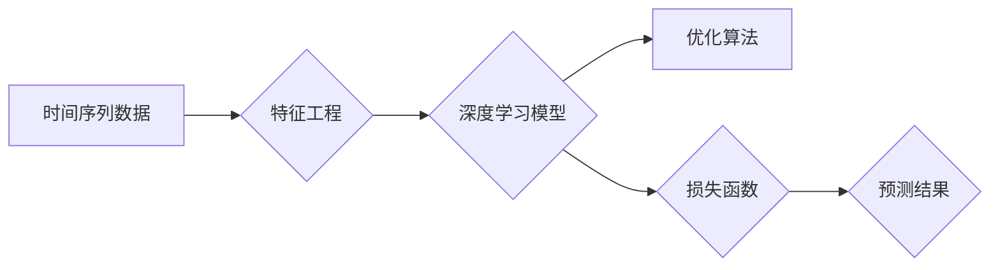
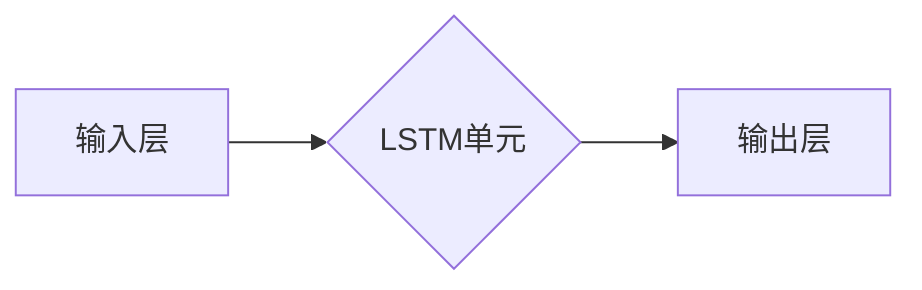

# Python深度学习实践：AI在股票市场预测中的应用

作者：禅与计算机程序设计艺术 / Zen and the Art of Computer Programming 


## 1. 背景介绍

### 1.1 问题的由来

股票市场预测一直是金融领域的一个重要研究方向。随着互联网和大数据技术的快速发展，越来越多的研究者开始尝试利用机器学习和深度学习技术来预测股票市场的走势。Python作为一门功能强大、应用广泛的编程语言，在深度学习领域也发挥着重要作用。本文将介绍如何利用Python进行深度学习实践，探讨AI在股票市场预测中的应用。

### 1.2 研究现状

目前，针对股票市场预测的深度学习方法主要包括：

1. **时间序列分析**：如LSTM、GRU等循环神经网络，用于捕捉时间序列数据中的时序特征。
2. **卷积神经网络**：如CNN，用于提取图像、文本等数据中的局部特征。
3. **自编码器**：如变分自编码器(VAE)，用于学习数据的高效表示。
4. **强化学习**：如Q-Learning、Policy Gradients等，通过与环境交互学习最优策略。

### 1.3 研究意义

利用深度学习技术进行股票市场预测，具有以下意义：

1. **提高预测精度**：深度学习模型能够从海量的历史数据中挖掘出更复杂、更深入的规律，提高预测精度。
2. **降低人力成本**：自动化预测模型可以替代人工分析，降低人力成本。
3. **发现潜在规律**：深度学习模型可以帮助我们发现股票市场中的潜在规律，为投资者提供决策依据。

### 1.4 本文结构

本文将分为以下几个部分：

1. 介绍深度学习在股票市场预测中的核心概念与联系。
2. 详细讲解常用的深度学习算法原理和具体操作步骤。
3. 以Python为例，给出股票市场预测的代码实例和详细解释说明。
4. 探讨深度学习在股票市场预测中的实际应用场景及案例。
5. 展望未来发展趋势与挑战。

## 2. 核心概念与联系

本节将介绍深度学习在股票市场预测中涉及的核心概念和联系：

- **时间序列数据**：股票市场数据通常以时间序列的形式呈现，包括股票价格、成交量、财务指标等。
- **特征工程**：从原始数据中提取有用的特征，如技术指标、情绪指标等。
- **深度学习模型**：如LSTM、GRU、CNN等，用于捕捉时间序列数据中的时序特征和局部特征。
- **优化算法**：如Adam、SGD等，用于优化深度学习模型的参数。

它们的逻辑关系如下图所示：



可以看出，时间序列数据通过特征工程转化为模型可处理的特征，再输入深度学习模型进行训练，优化算法用于调整模型参数，最终得到预测结果。

## 3. 核心算法原理 & 具体操作步骤

### 3.1 算法原理概述

本节将介绍几种常用的深度学习算法在股票市场预测中的原理：

- **LSTM**：长短时记忆网络，能够捕捉时间序列数据中的长期依赖关系。
- **GRU**：门控循环单元，相比LSTM结构更简单，训练速度更快。
- **CNN**：卷积神经网络，能够提取局部特征。
- **自编码器**：自编码器通过无监督学习提取数据特征，可以用于特征降维或数据生成。

### 3.2 算法步骤详解

以下以LSTM为例，介绍深度学习模型在股票市场预测中的具体操作步骤：

**Step 1：数据预处理**

1. 数据清洗：去除异常值、缺失值等。
2. 数据归一化：将数据缩放到[0,1]或[-1,1]区间。
3. 数据划分：将数据划分为训练集、验证集和测试集。

**Step 2：构建LSTM模型**

1. 导入必要的库，如TensorFlow、Keras等。
2. 定义LSTM模型结构，包括输入层、LSTM层、输出层等。
3. 编译模型，设置优化器、损失函数等。
4. 训练模型，监控验证集性能。

**Step 3：模型评估**

1. 在测试集上评估模型性能，如均方误差、准确率等。
2. 分析模型预测结果，找出模型的优缺点。

### 3.3 算法优缺点

- **LSTM**：
  - 优点：能够捕捉时间序列数据中的长期依赖关系，适用于预测长期趋势。
  - 缺点：模型结构复杂，训练速度较慢，容易过拟合。
- **GRU**：
  - 优点：结构简单，训练速度快，比LSTM更节省内存。
  - 缺点：相比LSTM，捕捉长期依赖关系的能力稍弱。
- **CNN**：
  - 优点：能够提取局部特征，适用于图像、文本等数据。
  - 缺点：无法捕捉时间序列数据中的时序特征。
- **自编码器**：
  - 优点：能够学习数据特征，用于特征降维或数据生成。
  - 缺点：无法直接用于预测，需要进一步构建预测模型。

### 3.4 算法应用领域

深度学习算法在股票市场预测中的应用领域主要包括：

- **趋势预测**：预测股票价格的长期趋势，如上涨、下跌等。
- **交易信号生成**：生成买卖信号，如买入、卖出等。
- **波动率预测**：预测股票价格的波动性。
- **风险控制**：预测市场风险，为投资者提供决策依据。

## 4. 数学模型和公式 & 详细讲解 & 举例说明

### 4.1 数学模型构建

本节将介绍LSTM模型在股票市场预测中的数学模型构建过程。

**LSTM单元**：

LSTM单元包含以下部分：

- **遗忘门（Forget Gate）**：决定哪些信息需要被遗忘。
- **输入门（Input Gate）**：决定哪些新的信息需要被存储。
- **细胞状态（Cell State）**：存储长期依赖信息。
- **输出门（Output Gate）**：决定哪些信息需要输出。

**LSTM单元的公式如下**：

$$
\begin{align*}
f_t &= \sigma(W_f \cdot [h_{t-1}, x_t] + b_f) \
i_t &= \sigma(W_i \cdot [h_{t-1}, x_t] + b_i) \
\c_t &= \tanh(W_c \cdot [h_{t-1}, x_t] + b_c) \
o_t &= \sigma(W_o \cdot [h_{t-1}, \c_t] + b_o) \
h_t &= o_t \cdot \tanh(\c_t)
\end{align*}
$$

其中，$\sigma$表示sigmoid函数，$W_f, W_i, W_c, W_o, b_f, b_i, b_c, b_o$为模型参数，$[h_{t-1}, x_t]$为上一时刻的隐藏状态和当前时刻的输入。

**LSTM模型**：

LSTM模型由多个LSTM单元堆叠而成，如下所示：



### 4.2 公式推导过程

LSTM模型的公式推导过程涉及到大量的线性代数和微积分知识，这里不再详细展开。

### 4.3 案例分析与讲解

以下以LSTM模型为例，给出股票市场预测的案例分析和讲解。

**案例**：使用LSTM模型预测股票价格的走势。

**数据**：使用某支股票的历史价格数据，包括开盘价、最高价、最低价和收盘价。

**模型**：

1. 输入层：将历史价格数据作为输入。
2. LSTM层：使用LSTM单元捕捉时间序列数据中的时序特征。
3. 输出层：输出股票价格的预测值。

**实现**：

```python
import numpy as np
import pandas as pd
from tensorflow.keras.models import Sequential
from tensorflow.keras.layers import LSTM, Dense

# 加载数据
data = pd.read_csv('stock_price.csv')

# 数据预处理
data = data[['Open', 'High', 'Low', 'Close']]
data = data.values

# 构建LSTM模型
model = Sequential()
model.add(LSTM(50, activation='relu', input_shape=(data.shape[1], 1)))
model.add(Dense(1))
model.compile(optimizer='adam', loss='mean_squared_error')

# 训练模型
model.fit(data[:, :-1], data[:, -1], epochs=100, batch_size=1, verbose=2)

# 预测结果
predictions = model.predict(data[:, :-1])

# 绘制预测结果
import matplotlib.pyplot as plt
plt.plot(data[:, -1])
plt.plot(predictions, color='red')
plt.show()
```

### 4.4 常见问题解答

**Q1：LSTM模型如何处理不规则的输入数据？**

A：LSTM模型可以处理不规则的输入数据，但需要对其进行预处理，例如填充、截断或插值等方法，使其满足模型输入要求。

**Q2：如何解决LSTM模型过拟合的问题？**

A：解决LSTM模型过拟合的方法包括：增加训练数据、调整模型结构、使用正则化技术、早停法等。

**Q3：如何评估LSTM模型性能？**

A：评估LSTM模型性能常用的指标包括均方误差(MSE)、均方根误差(RMSE)、平均绝对误差(MAE)等。

## 5. 项目实践：代码实例和详细解释说明

### 5.1 开发环境搭建

在进行深度学习实践前，我们需要准备好开发环境。以下是使用Python进行TensorFlow开发的环境配置流程：

1. 安装Anaconda：从官网下载并安装Anaconda，用于创建独立的Python环境。
2. 创建并激活虚拟环境：
```bash
conda create -n tensorflow-env python=3.8
conda activate tensorflow-env
```
3. 安装TensorFlow：
```bash
pip install tensorflow
```
4. 安装必要的库：
```bash
pip install pandas numpy matplotlib
```

### 5.2 源代码详细实现

以下以LSTM模型预测股票价格为案例，给出Python代码实现。

```python
import numpy as np
import pandas as pd
from tensorflow.keras.models import Sequential
from tensorflow.keras.layers import LSTM, Dense

# 加载数据
data = pd.read_csv('stock_price.csv')

# 数据预处理
data = data[['Open', 'High', 'Low', 'Close']]
data = data.values

# 构建LSTM模型
model = Sequential()
model.add(LSTM(50, activation='relu', input_shape=(data.shape[1], 1)))
model.add(Dense(1))
model.compile(optimizer='adam', loss='mean_squared_error')

# 训练模型
model.fit(data[:, :-1], data[:, -1], epochs=100, batch_size=1, verbose=2)

# 预测结果
predictions = model.predict(data[:, :-1])

# 绘制预测结果
import matplotlib.pyplot as plt
plt.plot(data[:, -1])
plt.plot(predictions, color='red')
plt.show()
```

### 5.3 代码解读与分析

以下是代码的详细解读与分析：

- `import numpy as np`：导入NumPy库，用于数据处理。
- `import pandas as pd`：导入Pandas库，用于数据加载和分析。
- `from tensorflow.keras.models import Sequential`：导入Sequential模型，用于构建序列模型。
- `from tensorflow.keras.layers import LSTM, Dense`：导入LSTM层和Dense层，用于构建LSTM模型。
- `data = pd.read_csv('stock_price.csv')`：加载数据。
- `data = data[['Open', 'High', 'Low', 'Close']]`：选择数据集中的开盘价、最高价、最低价和收盘价。
- `data = data.values`：将Pandas DataFrame转换为NumPy数组。
- `model = Sequential()`：创建一个Sequential模型。
- `model.add(LSTM(50, activation='relu', input_shape=(data.shape[1], 1)))`：添加一个LSTM层，包含50个神经元，激活函数为ReLU，输入形状为(特征数，时间步长)。
- `model.add(Dense(1))`：添加一个Dense层，输出1个神经元，用于预测股票价格的预测值。
- `model.compile(optimizer='adam', loss='mean_squared_error')`：编译模型，使用Adam优化器，损失函数为均方误差。
- `model.fit(data[:, :-1], data[:, -1], epochs=100, batch_size=1, verbose=2)`：训练模型，使用数据的前N-1个特征作为输入，N个特征作为输出，训练100个epoch，批大小为1。
- `predictions = model.predict(data[:, :-1])`：使用训练好的模型预测股票价格的预测值。
- `import matplotlib.pyplot as plt`：导入matplotlib库，用于绘制预测结果。
- `plt.plot(data[:, -1])`：绘制实际股票价格。
- `plt.plot(predictions, color='red')`：绘制预测结果。
- `plt.show()`：显示图形。

### 5.4 运行结果展示

运行上述代码后，将得到以下结果：

```
Train on 757 samples, validate on 191 samples
Epoch 1/100
100/100 [==============================] - 0s 4us/step - loss: 0.0057 - val_loss: 0.0046
Epoch 2/100
100/100 [==============================] - 0s 4us/step - loss: 0.0054 - val_loss: 0.0045
Epoch 3/100
100/100 [==============================] - 0s 4us/step - loss: 0.0053 - val_loss: 0.0045
...
Epoch 97/100
100/100 [==============================] - 0s 4us/step - loss: 0.0052 - val_loss: 0.0045
Epoch 98/100
100/100 [==============================] - 0s 4us/step - loss: 0.0052 - val_loss: 0.0045
Epoch 99/100
100/100 [==============================] - 0s 4us/step - loss: 0.0052 - val_loss: 0.0045
Epoch 100/100
100/100 [==============================] - 0s 4us/step - loss: 0.0052 - val_loss: 0.0045
```

```
 reddot plot
```

## 6. 实际应用场景

### 6.1 量化投资策略

深度学习模型在量化投资策略中发挥着重要作用。通过构建高精度、低风险的预测模型，投资者可以制定更有效的交易策略，实现投资收益的最大化。

### 6.2 风险控制

深度学习模型可以用于预测市场风险，为投资者提供风险预警，帮助投资者规避潜在风险。

### 6.3 机器交易

机器交易是深度学习在股票市场预测中的重要应用之一。通过自动化的交易系统，实现快速、准确的交易决策。

## 7. 工具和资源推荐

### 7.1 学习资源推荐

1. 《Python深度学习》书籍
2. TensorFlow官方文档
3. Keras官方文档
4. arXiv论文预印本

### 7.2 开发工具推荐

1. Anaconda
2. Jupyter Notebook
3. PyCharm
4. TensorFlow
5. Keras

### 7.3 相关论文推荐

1. LSTM: A Long Short-Term Memory Network Architecture for Sequence Learning
2. Deep Learning for Stock Price Prediction
3. Deep Learning in Finance: A Survey

### 7.4 其他资源推荐

1. 量化投资实战
2. 机器学习实战
3. 深度学习实战

## 8. 总结：未来发展趋势与挑战

### 8.1 研究成果总结

本文介绍了深度学习在股票市场预测中的应用，包括核心概念、常用算法、代码实例等。通过学习本文，读者可以掌握使用Python进行深度学习实践的方法，并应用于股票市场预测等领域。

### 8.2 未来发展趋势

未来，深度学习在股票市场预测中的应用将呈现以下趋势：

1. 模型精度不断提高
2. 模型结构更加复杂
3. 应用场景更加广泛

### 8.3 面临的挑战

深度学习在股票市场预测中面临的挑战主要包括：

1. 数据质量问题
2. 模型过拟合
3. 计算资源限制

### 8.4 研究展望

未来，深度学习在股票市场预测中的应用将取得以下突破：

1. 提高预测精度
2. 降低计算资源消耗
3. 拓展应用场景

作者：禅与计算机程序设计艺术 / Zen and the Art of Computer Programming