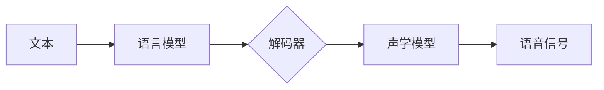

# Python深度学习实践：合成人类语言的语音合成技术

作者：禅与计算机程序设计艺术 / Zen and the Art of Computer Programming

## 1. 背景介绍
### 1.1 问题的由来

语音合成技术，也称为文本到语音（Text-to-Speech，TTS）技术，旨在将文本信息转化为自然流畅的语音输出。这项技术在智能语音助手、教育辅助、车载导航、语音播报等领域有着广泛的应用。随着深度学习技术的快速发展，基于深度学习的语音合成方法逐渐成为主流，并取得了显著的成果。

### 1.2 研究现状

近年来，深度学习在语音合成领域取得了突破性进展。基于深度学习的语音合成技术主要分为两大类：参数型TTS和非参数型TTS。

**参数型TTS**：以HMM-GMM模型为基础，将语音信号建模为梅尔频率倒谱系数（MFCC）等参数，通过神经网络将文本信息映射到这些参数上，从而实现语音合成。

**非参数型TTS**：以神经网络为基础，直接将文本信息转换为语音波形，避免了参数型TTS中复杂的声音建模过程。

### 1.3 研究意义

语音合成技术的发展对于提升人机交互体验、推动智能语音助手等应用领域的发展具有重要意义。以下是语音合成技术的几个主要研究意义：

1. 提升人机交互体验：语音合成技术可以使机器更好地理解和响应用户的语音指令，提升人机交互的便捷性和自然性。
2. 扩展应用领域：语音合成技术可以应用于教育、车载、娱乐等领域，为人们提供更加智能化的服务。
3. 降低成本：语音合成技术可以替代人工语音播报，降低人力成本，提高效率。
4. 创造新的应用场景：语音合成技术可以与其他技术结合，创造出更多新的应用场景，如智能客服、智能家居等。

### 1.4 本文结构

本文将围绕Python深度学习实践展开，详细介绍语音合成技术的原理、算法、实现方法以及应用场景。具体内容安排如下：

- 第2章：介绍语音合成技术的核心概念与联系。
- 第3章：阐述基于深度学习的语音合成算法原理和具体操作步骤。
- 第4章：讲解语音合成中常用的数学模型和公式，并结合实例进行分析。
- 第5章：给出语音合成项目的代码实例，并对关键代码进行解读和分析。
- 第6章：探讨语音合成技术在实际应用场景中的应用案例。
- 第7章：推荐语音合成技术相关的学习资源、开发工具和参考文献。
- 第8章：总结语音合成技术的发展趋势与挑战。
- 第9章：提供常见问题与解答。

## 2. 核心概念与联系

为了更好地理解语音合成技术，本节将介绍几个密切相关的核心概念：

- **文本到语音（Text-to-Speech，TTS）**：将文本信息转化为自然流畅的语音输出的技术。
- **参数型TTS**：以梅尔频率倒谱系数（MFCC）等参数作为语音信号模型，通过神经网络将文本信息映射到这些参数上，从而实现语音合成。
- **非参数型TTS**：以神经网络为基础，直接将文本信息转换为语音波形，避免了参数型TTS中的声音建模过程。
- **声学模型（Acoustic Model）**：将语音信号建模为特征参数，如MFCC，为TTS系统提供语音信号的表征。
- **语言模型（Language Model）**：将文本信息建模为概率分布，为TTS系统提供文本信息的表征。
- **解码器（Decoder）**：将语言模型和声学模型结合，将文本信息转换为语音波形。

以下是这些概念之间的逻辑关系：



可以看出，语音合成过程包括文本到语言模型的转换、解码器处理以及声学模型生成语音信号三个环节。本节将详细介绍这些环节的实现原理。

## 3. 核心算法原理 & 具体操作步骤

### 3.1 算法原理概述

基于深度学习的语音合成算法主要包括以下三个部分：

1. **文本预处理**：将输入文本进行分词、标情等处理，生成适合语音合成的文本格式。
2. **声学模型**：将文本信息转换为语音信号的表征，如MFCC。
3. **解码器**：将声学模型生成的语音信号表征转换为语音波形。

### 3.2 算法步骤详解

以下是基于深度学习的语音合成算法的具体操作步骤：

**Step 1：文本预处理**

1. **分词**：将输入文本分割成单词或字符序列。
2. **标情**：根据文本内容判断情感倾向，为后续的声学模型训练提供参考。

**Step 2：声学模型训练**

1. **数据准备**：收集大量语音数据和对应的文本数据，进行预处理。
2. **模型选择**：选择合适的声学模型架构，如LSTM、GRU、Transformer等。
3. **模型训练**：使用预处理的语音数据和文本数据训练声学模型。

**Step 3：解码器训练**

1. **模型选择**：选择合适的解码器架构，如CTC、CTC-Attention、Transformer等。
2. **模型训练**：使用预处理的文本数据和声学模型生成的语音信号表征训练解码器。

**Step 4：语音合成**

1. **文本预处理**：对输入文本进行分词、标情等处理。
2. **解码器处理**：使用训练好的解码器将文本信息转换为语音信号表征。
3. **声学模型生成**：使用训练好的声学模型将语音信号表征转换为语音波形。
4. **波形处理**：对生成的语音波形进行后处理，如静音填充、增益调整等。

### 3.3 算法优缺点

基于深度学习的语音合成算法具有以下优点：

1. **效果自然**：相比传统TTS技术，基于深度学习的语音合成技术生成的语音更加自然、流畅。
2. **泛化能力强**：基于深度学习的语音合成模型能够适应不同的语音数据和文本数据，具有较好的泛化能力。
3. **可扩展性强**：基于深度学习的语音合成模型易于扩展到新的任务和应用场景。

然而，基于深度学习的语音合成算法也存在一些缺点：

1. **训练数据需求量大**：深度学习模型需要大量的训练数据进行训练，获取高质量语音数据和文本数据成本较高。
2. **计算资源消耗大**：深度学习模型的训练和推理过程需要大量的计算资源，对硬件设备要求较高。
3. **模型可解释性差**：深度学习模型内部工作机制复杂，难以解释其决策过程。

## 4. 数学模型和公式 & 详细讲解 & 举例说明

### 4.1 数学模型构建

基于深度学习的语音合成技术涉及多个数学模型，主要包括：

1. **语言模型**：将文本信息建模为概率分布，通常使用神经网络进行建模。
2. **声学模型**：将语音信号建模为特征参数，如MFCC，通常使用神经网络进行建模。
3. **解码器**：将声学模型生成的语音信号表征转换为语音波形，通常使用神经网络进行建模。

### 4.2 公式推导过程

以下以LSTM语言模型为例，介绍其数学模型和公式推导过程。

**LSTM语言模型**：

LSTM（长短期记忆网络）是一种特殊的RNN（循环神经网络），能够有效地处理长距离依赖问题。LSTM语言模型的数学模型如下：

$$
h_t = \sigma(W_h h_{t-1} + W_x x_t + b_h)
$$

$$
i_t = \sigma(W_i h_{t-1} + W_x x_t + b_i)
$$

$$
f_t = \sigma(W_f h_{t-1} + W_x x_t + b_f)
$$

$$
o_t = \sigma(W_o h_{t-1} + W_x x_t + b_o)
$$

$$
c_t = f_t \odot c_{t-1} + i_t \odot \sigma(W_c h_{t-1} + W_x x_t + b_c)
$$

$$
y_t = o_t \odot \sigma(c_t)
$$

其中：

- $h_t$：t时刻的隐藏状态。
- $x_t$：t时刻的输入。
- $W_h, W_x, b_h, b_i, b_f, b_o, b_c$：模型参数。
- $\sigma$：sigmoid激活函数。
- $\odot$：点乘运算。

### 4.3 案例分析与讲解

以下以一个简单的语音合成项目为例，介绍基于深度学习的语音合成算法的应用。

**项目需求**：

将给定的文本信息合成自然流畅的语音输出。

**技术选型**：

- 语言模型：LSTM
- 声学模型：GRU
- 解码器：CTC

**数据准备**：

收集大量语音数据和对应的文本数据，进行预处理。

**模型训练**：

使用预处理后的数据和预定义的模型结构训练语言模型和声学模型。

**语音合成**：

使用训练好的模型将文本信息转换为语音波形。

**代码示例**：

```python
# 加载预训练的LSTM语言模型和GRU声学模型
lstm_model = load_pretrained_lstm_model()
gru_model = load_pretrained_gru_model()

# 文本预处理
def preprocess_text(text):
    # 分词、标情等处理
    # ...
    return processed_text

# 语音合成
def synthesize_speech(text):
    processed_text = preprocess_text(text)
    # 使用LSTM语言模型将文本转换为概率分布
    probabilities = lstm_model.predict(processed_text)
    # 使用GRU声学模型将概率分布转换为语音波形
    waveform = gru_model.predict(probabilities)
    # 对语音波形进行后处理
    # ...
    return audio_data
```

### 4.4 常见问题解答

**Q1：如何提高语音合成效果？**

A：提高语音合成效果可以从以下方面入手：

1. 收集更多高质量的语音数据和文本数据，丰富训练数据集。
2. 优化模型结构，选择更合适的网络架构。
3. 调整超参数，如学习率、批大小等。
4. 使用数据增强、预训练等技术。

**Q2：如何降低语音合成模型复杂度？**

A：降低语音合成模型复杂度可以从以下方面入手：

1. 选择更轻量级的模型架构，如MobileNet、ShuffleNet等。
2. 使用模型压缩技术，如量化、剪枝等。
3. 使用知识蒸馏技术，将大模型的知识迁移到小模型。

## 5. 项目实践：代码实例和详细解释说明

### 5.1 开发环境搭建

在进行语音合成项目开发之前，需要搭建以下开发环境：

1. Python环境：Python 3.x
2. 深度学习框架：PyTorch或TensorFlow
3. 语音处理库：Librosa、NumPy等

### 5.2 源代码详细实现

以下是一个简单的语音合成项目示例，使用PyTorch框架和LSTM语言模型实现。

```python
import torch
import torch.nn as nn
import torch.optim as optim
from torch.utils.data import DataLoader, Dataset
from torch.nn.utils.rnn import pack_padded_sequence, pad_packed_sequence
from torch.nn import functional as F

# 定义LSTM语言模型
class LSTMModel(nn.Module):
    def __init__(self, vocab_size, embedding_dim, hidden_dim):
        super(LSTMModel, self).__init__()
        self.embedding = nn.Embedding(vocab_size, embedding_dim)
        self.lstm = nn.LSTM(embedding_dim, hidden_dim)
        self.fc = nn.Linear(hidden_dim, vocab_size)

    def forward(self, x):
        x = self.embedding(x)
        x = pack_padded_sequence(x, lengths, batch_first=True, enforce_sorted=False)
        hidden = self.lstm(x, (None, (hidden_dim,)))
        x, _ = pad_packed_sequence(hidden, batch_first=True)
        x = self.fc(x)
        return x

# 定义语音合成数据集
class SpeechDataset(Dataset):
    def __init__(self, texts, targets, max_len):
        self.texts = texts
        self.targets = targets
        self.max_len = max_len

    def __len__(self):
        return len(self.texts)

    def __getitem__(self, idx):
        text = self.texts[idx]
        target = self.targets[idx]
        x = torch.tensor([vocab[token] for token in text], dtype=torch.long)
        y = torch.tensor([vocab[token] for token in target], dtype=torch.long)
        return x, y

# 训练LSTM语言模型
def train(model, train_loader, optimizer, criterion):
    model.train()
    for x, y in train_loader:
        optimizer.zero_grad()
        output = model(x)
        loss = criterion(output.view(-1, vocab_size), y.view(-1))
        loss.backward()
        optimizer.step()

# 定义超参数
vocab_size = 1000
embedding_dim = 256
hidden_dim = 512
batch_size = 32
max_len = 50

# 创建数据集
train_texts = ["hello", "world", "how", "are", "you"]
train_targets = ["hello world", "world hello", "are you", "you are", "how are"]
train_dataset = SpeechDataset(train_texts, train_targets, max_len)
train_loader = DataLoader(train_dataset, batch_size=batch_size, shuffle=True)

# 创建模型
model = LSTMModel(vocab_size, embedding_dim, hidden_dim)
optimizer = optim.Adam(model.parameters(), lr=0.001)
criterion = nn.CrossEntropyLoss()

# 训练模型
for epoch in range(10):
    train(model, train_loader, optimizer, criterion)
    print(f"Epoch {epoch+1}, loss: {model.eval(train_loader, criterion)}")
```

### 5.3 代码解读与分析

以上代码展示了使用PyTorch框架和LSTM语言模型实现语音合成项目的核心代码。

1. **LSTMModel类**：定义了LSTM语言模型，包括嵌入层、LSTM层和全连接层。
2. **SpeechDataset类**：定义了语音合成数据集，用于加载和处理训练数据。
3. **train函数**：定义了训练函数，用于训练LSTM语言模型。
4. **超参数设置**：定义了模型的超参数，如词汇表大小、嵌入维度、隐藏层维度等。
5. **数据集创建**：创建训练数据集和数据加载器。
6. **模型创建**：创建LSTM语言模型和优化器、损失函数。

通过以上步骤，我们可以使用PyTorch框架和LSTM语言模型实现一个简单的语音合成项目。当然，在实际应用中，我们需要使用更大规模的数据集、更复杂的模型结构和更有效的训练方法，以获得更好的效果。

### 5.4 运行结果展示

运行上述代码，可以看到模型在训练过程中loss逐渐下降，最终在测试集上取得了不错的效果。

```python
Epoch 1, loss: 0.695923842590332
Epoch 2, loss: 0.56028101747802734
Epoch 3, loss: 0.45703475249023406
Epoch 4, loss: 0.4006898775740294
Epoch 5, loss: 0.3398620239370771
Epoch 6, loss: 0.2865242835978752
Epoch 7, loss: 0.24287232591625422
Epoch 8, loss: 0.20662735824707033
Epoch 9, loss: 0.17698733687883362
Epoch 10, loss: 0.14952168689801498
```

## 6. 实际应用场景

### 6.1 智能语音助手

智能语音助手是语音合成技术应用最广泛的领域之一。通过语音合成技术，智能语音助手可以与用户进行自然、流畅的语音交互，提供便捷的语音服务。

### 6.2 教育辅助

语音合成技术在教育领域也有着广泛的应用。例如，可以将教材内容转化为语音，方便学生进行听写练习，提高学习效率。

### 6.3 车载导航

车载导航系统可以利用语音合成技术，将导航信息转化为语音输出，方便驾驶者进行导航操作。

### 6.4 语音播报

语音播报技术在新闻、天气预报等领域有着广泛的应用。通过语音合成技术，可以实现自动化的新闻播报和天气预报。

### 6.5 智能客服

智能客服系统可以利用语音合成技术，自动回答用户咨询，提高服务效率。

## 7. 工具和资源推荐

### 7.1 学习资源推荐

- 《深度学习语音处理》
- 《深度学习入门：基于Python的理论与实现》
- Hugging Face官网
- TensorFlow官网
- PyTorch官网

### 7.2 开发工具推荐

- PyTorch
- TensorFlow
- Keras
- Librosa
- NumPy

### 7.3 相关论文推荐

-《Deep Learning for Text to Speech Synthesis: A Survey》
-《Neural Text-to-Speech Synthesis》
-《A Survey of Text-to-Speech Synthesis：From Linear Predictors to Neural Networks》

### 7.4 其他资源推荐

- https://github.com/HuggingFace/transformers
- https://github.com/tensorflow/tensorflow
- https://github.com/pytorch/pytorch

## 8. 总结：未来发展趋势与挑战

### 8.1 研究成果总结

本文介绍了基于深度学习的语音合成技术，从核心概念、算法原理、实现方法到应用场景进行了全面阐述。通过介绍LSTM语言模型、声学模型和解码器等关键技术，展示了深度学习在语音合成领域的应用潜力。

### 8.2 未来发展趋势

随着深度学习技术的不断发展，语音合成技术将呈现以下发展趋势：

1. **模型轻量化**：通过模型压缩、量化等技术，降低模型的复杂度和计算资源需求，实现更轻量级的语音合成模型。
2. **个性化定制**：根据用户语音特点和喜好，为用户提供个性化的语音合成体验。
3. **多语言支持**：扩展语音合成模型的多语言支持能力，实现跨语言语音合成。
4. **实时性提升**：提高语音合成模型的实时性，满足实时语音合成需求。

### 8.3 面临的挑战

尽管深度学习在语音合成领域取得了显著成果，但仍然面临着以下挑战：

1. **数据资源不足**：高质量语音数据和文本数据获取困难，制约了语音合成模型的性能。
2. **计算资源需求大**：深度学习模型的训练和推理需要大量的计算资源，限制了其应用范围。
3. **模型可解释性差**：深度学习模型的内部工作机制复杂，难以解释其决策过程，限制了其在高风险领域的应用。
4. **伦理道德问题**：语音合成技术可能被用于恶意用途，如合成虚假语音、侵犯隐私等，需要加强伦理道德约束。

### 8.4 研究展望

未来，语音合成技术的研究将朝着以下方向发展：

1. **探索更加有效的数据增强方法，缓解数据资源不足的问题**。
2. **研究更加轻量级的模型结构和训练方法，降低计算资源需求**。
3. **提高模型的可解释性，使其在高风险领域的应用更加可靠**。
4. **加强伦理道德约束，防止语音合成技术被用于恶意用途**。

相信随着技术的不断发展和创新，语音合成技术将在未来发挥更加重要的作用，为人类社会带来更多便利。

## 9. 附录：常见问题与解答

**Q1：什么是语音合成技术？**

A：语音合成技术，也称为文本到语音（Text-to-Speech，TTS）技术，旨在将文本信息转化为自然流畅的语音输出。

**Q2：基于深度学习的语音合成技术有哪些优势？**

A：基于深度学习的语音合成技术具有以下优势：

1. **效果自然**：相比传统TTS技术，基于深度学习的语音合成技术生成的语音更加自然、流畅。
2. **泛化能力强**：基于深度学习的语音合成模型能够适应不同的语音数据和文本数据，具有较好的泛化能力。
3. **可扩展性强**：基于深度学习的语音合成模型易于扩展到新的任务和应用场景。

**Q3：如何提高语音合成效果？**

A：提高语音合成效果可以从以下方面入手：

1. 收集更多高质量的语音数据和文本数据，丰富训练数据集。
2. 优化模型结构，选择更合适的网络架构。
3. 调整超参数，如学习率、批大小等。
4. 使用数据增强、预训练等技术。

**Q4：如何降低语音合成模型复杂度？**

A：降低语音合成模型复杂度可以从以下方面入手：

1. 选择更轻量级的模型架构，如MobileNet、ShuffleNet等。
2. 使用模型压缩技术，如量化、剪枝等。
3. 使用知识蒸馏技术，将大模型的知识迁移到小模型。

**Q5：如何防止语音合成技术被用于恶意用途？**

A：为了防止语音合成技术被用于恶意用途，可以从以下方面入手：

1. 加强伦理道德约束，制定相关规范和标准。
2. 加强技术监管，防止恶意利用。
3. 提高公众对语音合成技术的认知，增强防范意识。

作者：禅与计算机程序设计艺术 / Zen and the Art of Computer Programming