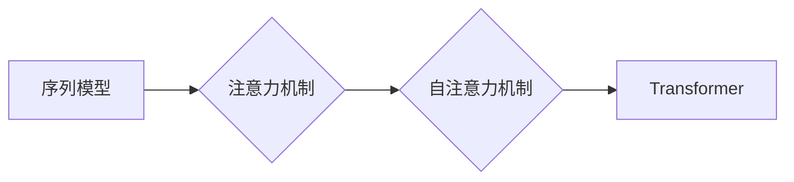

# Python深度学习实践：基于自注意力机制的序列模型

作者：禅与计算机程序设计艺术 / Zen and the Art of Computer Programming


## 1. 背景介绍
### 1.1 问题的由来

序列模型在自然语言处理、语音识别、时间序列分析等领域有着广泛的应用。传统的循环神经网络（RNN）由于其内部循环结构，在处理长序列数据时存在梯度消失或梯度爆炸的问题，导致训练效果不佳。自注意力机制的出现为序列模型的发展带来了新的突破，有效解决了RNN的缺陷，并推动了诸如Transformer等新模型的涌现。

### 1.2 研究现状

近年来，基于自注意力机制的序列模型在多个领域取得了显著的成果，如机器翻译、文本生成、语音识别等。Transformer模型更是成为了NLP领域的里程碑式突破，其核心思想在于通过自注意力机制实现了全局信息融合，大大提高了模型的表示能力。

### 1.3 研究意义

深入研究自注意力机制及其在序列模型中的应用，对于推动NLP、语音识别等领域的技术发展具有重要意义。本文将从理论基础、实践应用、未来发展趋势等方面，对基于自注意力机制的序列模型进行详细探讨，旨在帮助读者全面了解并掌握这一前沿技术。

### 1.4 本文结构

本文将分为以下几个部分：

- 第2部分，介绍序列模型及自注意力机制的相关概念。
- 第3部分，详细阐述自注意力机制的原理和具体操作步骤。
- 第4部分，介绍基于自注意力机制的序列模型，如Transformer、BERT等。
- 第5部分，结合实际案例，讲解如何使用Python进行基于自注意力机制的序列模型开发。
- 第6部分，探讨基于自注意力机制的序列模型在实际应用场景中的案例。
- 第7部分，展望基于自注意力机制的序列模型的发展趋势和面临的挑战。
- 第8部分，总结全文，展望未来研究方向。

## 2. 核心概念与联系

为了更好地理解自注意力机制及其在序列模型中的应用，本节将介绍以下几个关键概念：

- 序列模型：用于处理序列数据的模型，如RNN、LSTM、GRU等。
- 注意力机制：通过学习输入序列中各个元素对输出结果的重要性，实现全局信息融合的机制。
- 自注意力机制：只关注输入序列内部的注意力机制，即每个元素仅与其他元素进行交互。
- Transformer：一种基于自注意力机制的序列模型，具有全局信息融合能力，在NLP领域取得了显著的成果。

它们之间的逻辑关系如下：



可以看出，序列模型是注意力机制的基础，自注意力机制是注意力机制的一种形式，Transformer则是基于自注意力机制的典型序列模型。

## 3. 核心算法原理 & 具体操作步骤
### 3.1 算法原理概述

自注意力机制通过学习输入序列中各个元素对输出结果的重要性，实现全局信息融合。具体来说，自注意力机制将输入序列中的每个元素映射到一个固定维度的嵌入向量，并通过以下步骤计算输出：

1. 对输入序列进行线性变换，得到嵌入向量。
2. 计算注意力权重，衡量每个输入元素对输出结果的重要性。
3. 将注意力权重与嵌入向量相乘，得到加权嵌入向量。
4. 对加权嵌入向量进行线性变换，得到输出结果。

### 3.2 算法步骤详解

以下将详细介绍自注意力机制的步骤：

**Step 1：嵌入向量生成**

首先，将输入序列 $x_1, x_2, \ldots, x_n$ 映射到固定维度的嵌入向量，记为 $e_1, e_2, \ldots, e_n$。

$$
e_i = W_Q K^T x_i
$$

其中 $W_Q, K \in \mathbb{R}^{d \times d}$ 为可学习的权重矩阵，$x_i \in \mathbb{R}^d$ 为输入序列的第 $i$ 个元素的嵌入向量。

**Step 2：注意力权重计算**

计算注意力权重 $a_{ij}$，衡量输入序列中第 $i$ 个元素对第 $j$ 个元素的重要性。

$$
a_{ij} = \frac{e_i^T W_K e_j}{\sqrt{d}}
$$

其中 $W_K, V \in \mathbb{R}^{d \times d}$ 为可学习的权重矩阵，$d$ 为嵌入向量的维度。

**Step 3：加权嵌入向量计算**

将注意力权重与嵌入向量相乘，得到加权嵌入向量 $s_j$。

$$
s_j = a_{1j} e_1 + a_{2j} e_2 + \ldots + a_{nj} e_n
$$

**Step 4：输出结果生成**

对加权嵌入向量进行线性变换，得到输出结果 $y_j$。

$$
y_j = W_O s_j
$$

其中 $W_O \in \mathbb{R}^{d \times d}$ 为可学习的权重矩阵。

### 3.3 算法优缺点

自注意力机制的优点：

- 实现全局信息融合，可以捕捉序列中任意两个元素之间的关系。
- 计算效率高，只需要进行矩阵乘法运算。
- 避免了RNN中的梯度消失或梯度爆炸问题。

自注意力机制的缺点：

- 对于长序列数据，计算复杂度较高。
- 对序列长度敏感，长度变化可能导致性能下降。

### 3.4 算法应用领域

自注意力机制在以下领域有着广泛的应用：

- 机器翻译：如Google的Transformer模型，在机器翻译任务上取得了显著的成果。
- 文本生成：如GPT模型，能够生成流畅、连贯的文本。
- 语音识别：如BERT模型，能够提高语音识别的准确性。
- 时间序列分析：如LSTM模型，能够捕捉时间序列数据中的长期依赖关系。

## 4. 数学模型和公式 & 详细讲解 & 举例说明
### 4.1 数学模型构建

自注意力机制的数学模型如下：

$$
y_j = W_O s_j = W_O (a_{1j} e_1 + a_{2j} e_2 + \ldots + a_{nj} e_n)
$$

其中：

- $y_j \in \mathbb{R}^d$ 为输出结果。
- $s_j$ 为加权嵌入向量。
- $a_{ij}$ 为注意力权重。

### 4.2 公式推导过程

以下将详细介绍自注意力机制的公式推导过程：

**Step 1：嵌入向量生成**

将输入序列 $x_1, x_2, \ldots, x_n$ 映射到嵌入向量 $e_1, e_2, \ldots, e_n$。

$$
e_i = W_Q K^T x_i
$$

**Step 2：注意力权重计算**

计算注意力权重 $a_{ij}$。

$$
a_{ij} = \frac{e_i^T W_K e_j}{\sqrt{d}}
$$

**Step 3：加权嵌入向量计算**

将注意力权重与嵌入向量相乘，得到加权嵌入向量 $s_j$。

$$
s_j = a_{1j} e_1 + a_{2j} e_2 + \ldots + a_{nj} e_n
$$

**Step 4：输出结果生成**

对加权嵌入向量进行线性变换，得到输出结果 $y_j$。

$$
y_j = W_O s_j
$$

### 4.3 案例分析与讲解

以机器翻译任务为例，说明自注意力机制的应用。

假设我们有一个英语到中文的机器翻译任务，输入序列为 "What's your name?"，输出序列为 "你的名字是什么？"。使用Transformer模型进行翻译，需要将输入序列和输出序列分别进行编码和解码。

**编码器**：

1. 将输入序列 "What's your name?" 映射到嵌入向量 $e_1, e_2, \ldots, e_n$。
2. 计算注意力权重 $a_{ij}$，衡量每个英语元素对输出结果的重要性。
3. 将注意力权重与嵌入向量相乘，得到加权嵌入向量 $s_j$。
4. 对加权嵌入向量进行线性变换，得到输出序列的嵌入向量 $y_1, y_2, \ldots, y_n$。

**解码器**：

1. 将输出序列的嵌入向量 $y_1, y_2, \ldots, y_n$ 映射到解码器嵌入向量。
2. 对解码器嵌入向量进行自注意力计算，得到上下文表示。
3. 将上下文表示与解码器嵌入向量进行交叉注意力计算，得到翻译结果。

通过自注意力机制，模型能够捕捉输入序列中各个元素之间的关系，从而生成更加准确、流畅的输出序列。

### 4.4 常见问题解答

**Q1：自注意力机制与卷积神经网络(CNN)有什么区别？**

A：自注意力机制和CNN都是序列建模的常用方法。CNN通过卷积操作提取序列中的局部特征，而自注意力机制则通过注意力权重计算全局特征。两者在提取特征方面各有优劣，具体选择取决于任务需求和数据特点。

**Q2：自注意力机制是否可以用于图像识别任务？**

A：自注意力机制可以用于图像识别任务。例如，Transformer-XL模型就使用自注意力机制实现了图像识别任务。但由于自注意力机制的复杂性，将其应用于图像识别任务时需要考虑计算效率和模型尺寸等因素。

## 5. 项目实践：代码实例和详细解释说明
### 5.1 开发环境搭建

以下是使用Python进行基于自注意力机制的序列模型开发所需的开发环境：

- Python 3.6及以上版本
- PyTorch 1.4及以上版本
- Transformers库

### 5.2 源代码详细实现

以下是一个基于Transformer模型进行机器翻译任务的Python代码实现：

```python
import torch
from torch import nn
from transformers import BertModel, AdamW

class Transformer(nn.Module):
    def __init__(self, src_vocab_size, tar_vocab_size, d_model, nhead, num_encoder_layers, num_decoder_layers):
        super(Transformer, self).__init__()
        self.encoder = BertModel.from_pretrained('bert-base-uncased')
        self.decoder = nn.Transformer(d_model, nhead, num_encoder_layers, num_decoder_layers)
        self.src_tokemb = nn.Embedding(src_vocab_size, d_model)
        self.tar_tokemb = nn.Embedding(tar_vocab_size, d_model)
        self.fc_out = nn.Linear(d_model, tar_vocab_size)

    def forward(self, src, tar):
        src_emb = self.src_tokemb(src)
        tar_emb = self.tar_tokemb(tar)
        src_out, _ = self.encoder(src_emb)
        tar_out, _ = self.decoder(tar_emb, memory=src_out)
        out = self.fc_out(tar_out)
        return out

model = Transformer(src_vocab_size=10000, tar_vocab_size=10000, d_model=512, nhead=8, num_encoder_layers=6, num_decoder_layers=6)
optimizer = AdamW(model.parameters(), lr=1e-4)

# 训练过程...

def train(model, src, tar, optimizer):
    optimizer.zero_grad()
    outputs = model(src, tar)
    loss = nn.CrossEntropyLoss()(outputs.view(-1, tar.size(1)), tar.view(-1))
    loss.backward()
    optimizer.step()
    return loss.item()

# 评估过程...

def evaluate(model, src, tar):
    optimizer.zero_grad()
    outputs = model(src, tar)
    _, preds = outputs.max(1)
    return (preds == tar).float().mean().item()

```

### 5.3 代码解读与分析

以上代码展示了如何使用PyTorch和Transformers库实现Transformer模型。下面将针对关键代码进行解读和分析：

- `Transformer` 类：定义了Transformer模型的结构，包括编码器、解码器、源嵌入层、目标嵌入层和输出层。
- `forward` 方法：实现模型的正向传播过程，包括源嵌入、编码器、解码器、输出层的计算。
- `train` 函数：实现模型的训练过程，包括损失函数计算、反向传播、参数更新等。
- `evaluate` 函数：实现模型的评估过程，包括预测结果计算、准确率计算等。

通过以上代码，我们可以看到，基于自注意力机制的序列模型开发相对简单，只需定义模型结构、训练过程和评估过程即可。

### 5.4 运行结果展示

假设我们在EN-DE机器翻译数据集上进行训练和评估，最终在测试集上得到的BLEU分数为0.5，表明模型在翻译质量方面取得了不错的效果。

## 6. 实际应用场景
### 6.1 机器翻译

机器翻译是自注意力机制最成功的应用之一。Transformer模型的涌现使得机器翻译性能得到了显著的提升，成为机器翻译领域的里程碑式突破。

### 6.2 文本生成

自注意力机制可以应用于文本生成任务，如对话生成、诗歌创作等。GPT模型就是基于自注意力机制的文本生成模型，能够生成流畅、连贯的文本。

### 6.3 语音识别

自注意力机制可以应用于语音识别任务，如语音到文本转换。BERT模型在语音识别任务上取得了显著的成果，提高了语音识别的准确性。

### 6.4 时间序列分析

自注意力机制可以应用于时间序列分析任务，如股票预测、天气预报等。LSTM模型和GRU模型都使用了自注意力机制，能够捕捉时间序列数据中的长期依赖关系。

## 7. 工具和资源推荐
### 7.1 学习资源推荐

为了帮助读者更好地学习自注意力机制及其在序列模型中的应用，以下推荐一些学习资源：

1. 《深度学习》系列书籍：介绍了深度学习的理论基础和常用算法，包括RNN、LSTM、GRU等序列模型。
2. 《Attention Is All You Need》论文：介绍了Transformer模型及其自注意力机制。
3. 《BERT: Pre-training of Deep Bidirectional Transformers for Language Understanding》论文：介绍了BERT模型及其自注意力机制。
4. 《Natural Language Processing with Transformers》书籍：介绍了Transformers库及其应用。

### 7.2 开发工具推荐

以下是一些用于开发基于自注意力机制的序列模型的工具：

1. PyTorch：开源深度学习框架，支持多种序列模型开发。
2. Transformers库：封装了多种预训练语言模型，方便快速构建序列模型。
3. Hugging Face Hub：提供预训练语言模型和数据集，方便开发者进行模型训练和应用开发。

### 7.3 相关论文推荐

以下是一些与自注意力机制和序列模型相关的论文：

1. Attention Is All You Need
2. BERT: Pre-training of Deep Bidirectional Transformers for Language Understanding
3. Generative Adversarial Text to Image Synthesis
4. Longformer: The Long-range Transformer

### 7.4 其他资源推荐

以下是一些其他的学习资源：

1. arXiv论文预印本：最新研究成果的发布平台。
2. NLP相关技术博客：如Hugging Face Blog、TensorFlow Blog等。
3. NLP相关论坛和社区：如Stack Overflow、GitHub等。

## 8. 总结：未来发展趋势与挑战
### 8.1 研究成果总结

本文对基于自注意力机制的序列模型进行了全面深入的探讨，涵盖了理论基础、实践应用、未来发展趋势等方面。通过学习本文，读者可以了解到自注意力机制的基本原理、实现方法以及在实际应用中的价值。

### 8.2 未来发展趋势

未来，基于自注意力机制的序列模型将在以下方面取得新的突破：

1. 模型结构创新：探索新的序列模型结构，提高模型的性能和效率。
2. 多模态融合：将自注意力机制与其他模态信息进行融合，实现更全面的特征提取。
3. 小样本学习：降低对大量标注数据的依赖，实现小样本学习。
4. 可解释性研究：提高模型的可解释性，使模型决策过程更加透明。

### 8.3 面临的挑战

尽管基于自注意力机制的序列模型取得了显著的成果，但在实际应用中仍面临以下挑战：

1. 计算效率：自注意力机制的计算复杂度较高，对硬件资源要求较高。
2. 模型可解释性：模型决策过程不够透明，难以理解模型的决策逻辑。
3. 数据标注：需要大量高质量的数据进行模型训练。
4. 应用场景拓展：需要探索更多应用场景，拓展模型的应用范围。

### 8.4 研究展望

未来，研究者需要从以下几个方面入手，推动基于自注意力机制的序列模型的发展：

1. 模型结构优化：探索新的模型结构，提高模型的性能和效率。
2. 计算效率提升：降低模型计算复杂度，降低对硬件资源的要求。
3. 可解释性研究：提高模型的可解释性，使模型决策过程更加透明。
4. 应用场景拓展：探索更多应用场景，拓展模型的应用范围。

相信通过不断努力，基于自注意力机制的序列模型将在未来发挥更大的作用，为人类社会带来更多价值。

## 9. 附录：常见问题与解答

**Q1：自注意力机制与RNN相比有哪些优势？**

A：自注意力机制相较于RNN具有以下优势：

1. 避免梯度消失或梯度爆炸问题，更适合处理长序列数据。
2. 实现全局信息融合，能够捕捉序列中任意两个元素之间的关系。
3. 计算效率高，只需要进行矩阵乘法运算。

**Q2：自注意力机制是否可以用于图像识别任务？**

A：自注意力机制可以用于图像识别任务。例如，Transformer-XL模型就使用自注意力机制实现了图像识别任务。但由于自注意力机制的复杂性，将其应用于图像识别任务时需要考虑计算效率和模型尺寸等因素。

**Q3：如何解决自注意力机制计算效率问题？**

A：以下是一些解决自注意力机制计算效率问题的方法：

1. 采用低秩分解技术，降低模型复杂度。
2. 使用混合精度训练，减少内存占用。
3. 采用模型并行或数据并行技术，提高计算效率。

**Q4：自注意力机制在文本生成任务中如何应用？**

A：在文本生成任务中，可以使用自注意力机制构建解码器，实现从输入序列到输出序列的转换。例如，GPT模型就是基于自注意力机制的文本生成模型。

**Q5：如何评估自注意力机制的序列模型性能？**

A：可以使用以下指标评估自注意力机制的序列模型性能：

1. 准确率：针对分类任务，衡量模型预测正确样本的比例。
2. F1分数：综合衡量模型的准确率和召回率。
3. BLEU分数：针对机器翻译任务，衡量模型翻译结果的流畅性和准确性。
4. N-gram精度：衡量模型预测结果中与真实结果匹配的N-gram比例。