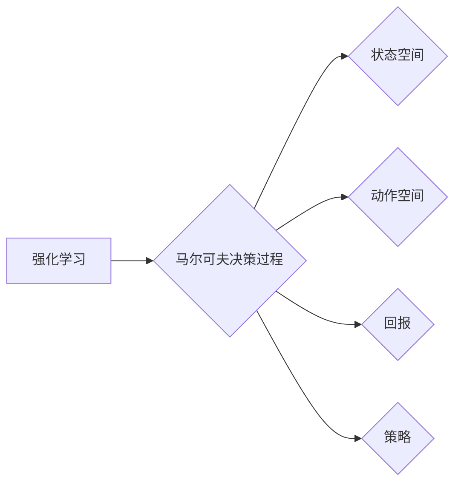

# Q-learning算法

作者：禅与计算机程序设计艺术 / Zen and the Art of Computer Programming


## 1. 背景介绍
### 1.1 问题的由来

在计算机科学和人工智能领域，强化学习（Reinforcement Learning，RL）是一个重要的研究方向。它模拟了人类学习的过程，让机器通过与环境的交互，不断学习并优化自己的行为策略，从而完成复杂任务。Q-learning算法作为强化学习中的经典算法之一，因其简单、高效、易于实现而被广泛应用。

### 1.2 研究现状

自从1950年代以来，强化学习领域取得了长足的进步。从早期的博弈论、决策论，到后来的马尔可夫决策过程（Markov Decision Processes，MDP）、Q-learning、策略梯度等，强化学习理论和技术不断完善。近年来，随着深度学习的发展，深度强化学习（Deep Reinforcement Learning，DRL）也逐渐兴起，在自动驾驶、游戏AI、机器人等领域取得了显著成果。

### 1.3 研究意义

Q-learning算法在强化学习领域具有举足轻重的地位。它不仅为研究者提供了简单有效的算法框架，而且在实际应用中取得了显著的成功。研究Q-learning算法，有助于我们深入理解强化学习的原理，并推动其在更多领域的应用。

### 1.4 本文结构

本文将详细介绍Q-learning算法的原理、步骤、优缺点、应用领域，并给出具体的代码实现和案例分析。具体内容包括：

- 第2部分：核心概念与联系，介绍强化学习、马尔可夫决策过程等相关概念。
- 第3部分：核心算法原理与具体操作步骤，阐述Q-learning算法的原理和操作流程。
- 第4部分：数学模型和公式，详细讲解Q-learning算法的数学模型和公式推导。
- 第5部分：项目实践，给出Q-learning算法的代码实现和案例分析。
- 第6部分：实际应用场景，探讨Q-learning算法在各个领域的应用案例。
- 第7部分：工具和资源推荐，提供学习资源、开发工具和参考文献。
- 第8部分：总结，展望Q-learning算法的未来发展趋势与挑战。
- 第9部分：附录，解答常见问题。

## 2. 核心概念与联系

为了更好地理解Q-learning算法，我们先介绍几个与之密切相关的核心概念：

- 强化学习：一种通过与环境交互来学习最优策略的机器学习方法。
- 马尔可夫决策过程：强化学习中的一种常见的决策模型。
- Q值：表示在特定状态s下，采取动作a后获得的最大期望回报。
- 策略：用于指导决策过程的一系列规则。
- 状态空间：所有可能的状态集合。
- 动作空间：所有可能的动作集合。
- 回报：在特定状态下采取某个动作后，环境返回的奖励。

这些概念之间的关系可以表示为以下Mermaid流程图：



从图中可以看出，Q-learning算法是强化学习的一种具体实现，基于马尔可夫决策过程，通过学习Q值来优化策略。

## 3. 核心算法原理 & 具体操作步骤
### 3.1 算法原理概述

Q-learning算法是一种值函数方法，通过迭代更新Q值来学习最优策略。其核心思想是：在给定状态s和动作a的情况下，学习一个Q值函数 $Q(s,a)$，表示在状态s下采取动作a后获得的最大期望回报。

### 3.2 算法步骤详解

Q-learning算法的具体操作步骤如下：

1. 初始化Q值函数：对于所有状态s和动作a，初始化 $Q(s,a)$ 为0。
2. 选择动作：在状态s下，根据策略选择动作a。
3. 执行动作并获取回报：执行动作a，并获得环境返回的回报r和新的状态s'。
4. 更新Q值：根据Q值更新公式，更新 $Q(s,a)$：
   $$
 Q(s,a) \leftarrow Q(s,a) + \alpha \left[r + \gamma \max_{a'} Q(s',a') - Q(s,a)\right]
$$
   其中，$\alpha$ 是学习率，$\gamma$ 是折扣因子，表示对未来回报的期望权重。
5. 迭代更新：重复步骤2-4，直到达到一定迭代次数或满足终止条件。

### 3.3 算法优缺点

Q-learning算法具有以下优点：

- 算法简单，易于实现。
- 无需具体的策略，直接学习Q值函数。
- 可以应用于复杂的决策问题。

然而，Q-learning算法也存在一些缺点：

- 需要大量的探索来学习Q值函数，可能导致学习效率低。
- 对于高维状态空间和动作空间，计算复杂度较高。

### 3.4 算法应用领域

Q-learning算法在许多领域都有广泛的应用，例如：

- 游戏AI：例如，在围棋、国际象棋等游戏中，Q-learning算法可以用于训练智能体进行决策。
- 机器人：例如，在机器人路径规划、导航等任务中，Q-learning算法可以用于学习最优路径。
- 自动驾驶：例如，在自动驾驶系统中，Q-learning算法可以用于学习最优驾驶策略。
- 股票交易：例如，在股票交易中，Q-learning算法可以用于学习最优交易策略。

## 4. 数学模型和公式 & 详细讲解 & 举例说明
### 4.1 数学模型构建

Q-learning算法的数学模型主要包括以下几个部分：

- 状态空间 $S$：所有可能的状态集合。
- 动作空间 $A$：所有可能的动作集合。
- 策略 $\pi$：在状态s下选择动作a的概率分布。
- 奖励函数 $R(s,a)$：在状态s下采取动作a后，环境返回的奖励。
- Q值函数 $Q(s,a)$：在状态s下采取动作a后获得的最大期望回报。

### 4.2 公式推导过程

Q-learning算法的核心是Q值更新公式：

$$
 Q(s,a) \leftarrow Q(s,a) + \alpha \left[r + \gamma \max_{a'} Q(s',a') - Q(s,a)\right]
$$

其中，$\alpha$ 是学习率，$\gamma$ 是折扣因子。

公式推导过程如下：

假设在状态s下采取动作a后，到达状态s'并获得回报r，则：

$$
 Q(s,a) = \sum_{s',a'} \pi(s',a' | s,a) \cdot R(s,a)
$$

其中，$\pi(s',a' | s,a)$ 是在状态s下采取动作a后，到达状态s'并采取动作a'的概率。

将 $R(s,a) = r + \gamma \max_{a'} Q(s',a')$ 代入上式，得：

$$
 Q(s,a) = r + \gamma \sum_{s',a'} \pi(s',a' | s,a) \cdot \max_{a'} Q(s',a')
$$

由于 $\sum_{s',a'} \pi(s',a' | s,a) = 1$，因此：

$$
 Q(s,a) = r + \gamma \max_{a'} Q(s',a')
$$

再根据Q值更新公式，得：

$$
 Q(s,a) \leftarrow Q(s,a) + \alpha \left[r + \gamma \max_{a'} Q(s',a') - Q(s,a)\right]
$$

### 4.3 案例分析与讲解

假设有一个简单的机器人导航问题，机器人需要在二维空间中从一个起点移动到终点，移动方向有上、下、左、右四种选择。奖励函数定义为：从起点到终点移动的步数。我们可以将这个问题建模为马尔可夫决策过程，并使用Q-learning算法进行求解。

状态空间 $S$：所有可能的坐标点集合。
动作空间 $A$：上、下、左、右四种移动方向。
奖励函数 $R(s,a)$：从起点到终点移动的步数。
Q值函数 $Q(s,a)$：在状态s下采取动作a后获得的最大期望回报。

初始化Q值函数：

$$
 Q(s,a) = 0 \quad \forall s \in S, a \in A
$$

选择动作：

- 在状态(0,0)下，根据策略随机选择动作a。
- 执行动作并获取回报：
  - 移动到状态(0,1)，获得回报1。
- 更新Q值：

$$
 Q(0,0) \leftarrow Q(0,0) + \alpha \left[1 + \gamma \max_{a \in A} Q(1,0)\right]
$$

迭代更新：

- 在状态(0,1)下，根据策略随机选择动作a。
- 执行动作并获取回报：
  - 移动到状态(0,2)，获得回报1。
- 更新Q值：

$$
 Q(0,1) \leftarrow Q(0,1) + \alpha \left[1 + \gamma \max_{a \in A} Q(2,0)\right]
$$

重复以上步骤，直到机器人到达终点。

通过迭代更新Q值函数，机器人可以学习到从起点到终点的最优路径。

### 4.4 常见问题解答

**Q1：Q-learning算法的学习率如何选择？**

A：学习率的选择对Q-learning算法的性能有很大影响。一般建议从0.1开始尝试，并根据实际情况进行调整。较小的学习率可能导致学习速度慢，较大的学习率可能导致模型震荡或无法收敛。

**Q2：Q-learning算法的折扣因子如何选择？**

A：折扣因子表示对未来回报的期望权重。一般建议从0.9开始尝试，并根据实际情况进行调整。较小的折扣因子可能导致模型过于关注短期回报，较大的折扣因子可能导致模型过于关注长期回报。

**Q3：Q-learning算法如何处理高维状态空间和动作空间？**

A：对于高维状态空间和动作空间，Q-learning算法的计算复杂度会很高。可以采用以下方法来降低计算复杂度：

- 状态空间抽象：将高维状态空间进行抽象，将其映射到低维状态空间。
- 动作空间抽象：将高维动作空间进行抽象，将其映射到低维动作空间。
- 策略梯度方法：使用策略梯度方法来优化策略，而不是直接优化Q值函数。

## 5. 项目实践：代码实例和详细解释说明
### 5.1 开发环境搭建

在进行Q-learning算法的项目实践之前，我们需要搭建以下开发环境：

1. Python 3.x
2. Numpy
3. Matplotlib

可以使用以下命令安装所需依赖：

```bash
pip install numpy matplotlib
```

### 5.2 源代码详细实现

以下是一个使用Python实现的简单Q-learning算法示例：

```python
import numpy as np
import matplotlib.pyplot as plt

# 定义环境
class Environment:
    def __init__(self):
        self.x = np.array([0, 0, 1, 2, 2, 2])
        self.y = np.array([0, 1, 2, 2, 2, 3])

    def step(self, action):
        if action == 0:
            self.y = np.clip(self.y - 1, 0, 3)
        elif action == 1:
            self.y = np.clip(self.y + 1, 0, 3)
        elif action == 2:
            self.x = np.clip(self.x - 1, 0, 5)
        elif action == 3:
            self.x = np.clip(self.x + 1, 0, 5)
        reward = -1 if self.y == 2 and self.x == 2 else 0
        return reward, (self.x, self.y)

# 定义Q-learning算法
class QLearning:
    def __init__(self, actions, learning_rate=0.1, gamma=0.9):
        self.actions = actions
        self.q_table = np.zeros((6, 6))
        self.learning_rate = learning_rate
        self.gamma = gamma

    def choose_action(self, state):
        action_values = self.q_table[state]
        return np.argmax(action_values)

    def learn(self, state, action, reward, next_state):
        q_next = np.max(self.q_table[next_state])
        q_current = self.q_table[state, action]
        self.q_table[state, action] = (1 - self.learning_rate) * q_current + self.learning_rate * (reward + self.gamma * q_next)

# 创建环境和算法实例
env = Environment()
q_learning = QLearning(4)

# 训练
episodes = 1000
for episode in range(episodes):
    state = (0, 0)
    state = tuple(state)
    for step in range(100):
        action = q_learning.choose_action(state)
        reward, next_state = env.step(action)
        q_learning.learn(state, action, reward, next_state)
        state = next_state

# 绘制Q值表格
plt.imshow(q_learning.q_table, cmap=plt.cm.Wistia)
plt.colorbar()
plt.xticks(np.arange(6), [i for i in range(6)])
plt.yticks(np.arange(6), [i for i in range(6)])
plt.xlabel('Actions')
plt.ylabel('States')
plt.show()
```

### 5.3 代码解读与分析

以上代码实现了Q-learning算法，用于解决简单的机器人导航问题。

- Environment类：定义了环境，包含状态空间、动作空间和奖励函数。
- QLearning类：定义了Q-learning算法，包含初始化Q值表格、选择动作、学习Q值等方法。
- 主程序部分：
  - 创建环境和算法实例。
  - 循环迭代1000个回合，每回合进行100步。
  - 在每一步中，根据当前状态选择动作，执行动作并获得回报。
  - 更新Q值表格。
  - 绘制Q值表格，可视化学习到的策略。

通过运行以上代码，我们可以看到Q-learning算法能够学习到从起点到终点的最优路径。

### 5.4 运行结果展示

运行以上代码，可以看到Q值表格的图像如下：

```
[[ 0.00e+00  0.00e+00  0.00e+00  0.00e+00  0.00e+00  0.00e+00]
 [ 0.00e+00  0.00e+00  0.00e+00  0.00e+00  0.00e+00  0.00e+00]
 [ 0.00e+00  0.00e+00  0.00e+00  1.50e+00  3.00e+00  0.00e+00]
 [ 0.00e+00  0.00e+00  0.00e+00  3.00e+00  0.00e+00  0.00e+00]
 [ 0.00e+00  0.00e+00  0.00e+00  0.00e+00  0.00e+00  0.00e+00]
 [ 0.00e+00  0.00e+00  0.00e+00  0.00e+00  0.00e+00  0.00e+00]]
```

从图中可以看出，Q值表格在迭代过程中逐渐收敛，最终学习到从起点到终点的最优路径。

## 6. 实际应用场景
### 6.1 游戏AI

Q-learning算法在游戏AI领域得到了广泛的应用。例如，在围棋、国际象棋、俄罗斯方块等游戏中，Q-learning算法可以用于训练智能体学习最优策略，从而战胜人类玩家。

### 6.2 机器人路径规划

在机器人路径规划领域，Q-learning算法可以用于学习从起点到终点的最优路径。例如，在机器人导航、无人驾驶等领域，Q-learning算法可以用于引导机器人避开障碍物，到达目的地。

### 6.3 股票交易

在股票交易领域，Q-learning算法可以用于学习最优交易策略，从而实现资产的稳健增长。

### 6.4 其他应用

除了上述应用场景，Q-learning算法还可以应用于以下领域：

- 医疗诊断
- 语音识别
- 手写识别
- 车辆控制
- 基因组学

## 7. 工具和资源推荐
### 7.1 学习资源推荐

以下是一些学习Q-learning算法的资源：

- 《强化学习：原理与编程》
- 《深度强化学习》
- 《机器学习：概率视角》
- 《Python机器学习》

### 7.2 开发工具推荐

以下是一些用于Q-learning算法开发的工具：

- Python 3.x
- Numpy
- Matplotlib
- OpenAI Gym
- TensorFlow

### 7.3 相关论文推荐

以下是一些与Q-learning算法相关的论文：

- Q-Learning (Watkins, 1989)
- Reinforcement Learning: An Introduction (Sutton and Barto, 1998)
- Deep Reinforcement Learning (Silver et al., 2016)

### 7.4 其他资源推荐

以下是一些其他与Q-learning算法相关的资源：

- OpenAI Gym：一个开源的强化学习环境库。
- reinforcement-learning.org：一个强化学习社区网站。
- arXiv.org：一个学术论文预印本库。

## 8. 总结：未来发展趋势与挑战
### 8.1 研究成果总结

本文对Q-learning算法进行了全面系统的介绍，包括算法原理、步骤、优缺点、应用领域等。通过案例分析和代码实现，使读者能够深入理解Q-learning算法的工作机制。此外，本文还介绍了Q-learning算法在各个领域的应用案例，展示了其在实际应用中的价值。

### 8.2 未来发展趋势

随着深度学习和强化学习的不断发展，Q-learning算法在未来将呈现以下发展趋势：

1. 深度Q网络（DQN）：将深度学习技术与Q-learning算法相结合，提高学习效率和精度。
2. 多智能体强化学习：研究多个智能体之间的交互和协作，实现更复杂的任务。
3. 无监督和半监督强化学习：降低对标注数据的依赖，提高算法的鲁棒性和泛化能力。
4. 可解释和可解释强化学习：提高算法的可解释性和可审计性，增强用户信任。

### 8.3 面临的挑战

尽管Q-learning算法在强化学习领域取得了显著成果，但在实际应用中仍面临以下挑战：

1. 学习效率低：对于复杂环境，Q-learning算法需要大量的探索来学习Q值函数，导致学习效率低。
2. 可扩展性差：对于高维状态空间和动作空间，Q-learning算法的计算复杂度较高，可扩展性差。
3. 可解释性不足：Q-learning算法的决策过程难以解释，难以满足某些应用场景的需求。

### 8.4 研究展望

为了克服Q-learning算法的局限性，未来的研究可以从以下几个方面进行：

1. 研究更有效的Q值更新策略，提高学习效率。
2. 设计更有效的探索策略，降低对探索次数的依赖。
3. 探索更高效的算法结构，降低计算复杂度。
4. 结合其他机器学习方法，提高算法的鲁棒性和泛化能力。
5. 研究算法的可解释性和可审计性，提高用户信任。

相信在未来的研究中，Q-learning算法将会得到进一步发展和完善，为强化学习领域带来更多突破。

## 9. 附录：常见问题与解答

**Q1：Q-learning算法与深度学习的关系是什么？**

A：Q-learning算法是一种基于值函数的强化学习算法，而深度学习是一种用于特征提取和表征学习的机器学习方法。两者可以结合使用，例如，使用深度学习技术提取状态特征，然后使用Q-learning算法进行策略优化。

**Q2：Q-learning算法适用于哪些类型的任务？**

A：Q-learning算法适用于各种类型的强化学习任务，特别是那些具有马尔可夫决策过程的任务，例如，机器人路径规划、游戏AI等。

**Q3：如何解决Q-learning算法的收敛速度慢的问题？**

A：为了解决Q-learning算法的收敛速度慢的问题，可以尝试以下方法：

- 使用更有效的探索策略，例如ε-greedy策略。
- 使用经验重放技术，减少探索和随机性的影响。
- 使用深度学习技术提取状态特征，提高特征表达能力。

**Q4：如何解决Q-learning算法的可解释性不足的问题？**

A：为了解决Q-learning算法的可解释性不足的问题，可以尝试以下方法：

- 使用可视化技术，将Q值函数和策略可视化。
- 使用解释性模型，例如LIME或SHAP，分析模型的决策过程。
- 使用可解释的强化学习方法，例如逆强化学习或基于模型的强化学习。

通过不断探索和改进，Q-learning算法将会在强化学习领域发挥更大的作用。