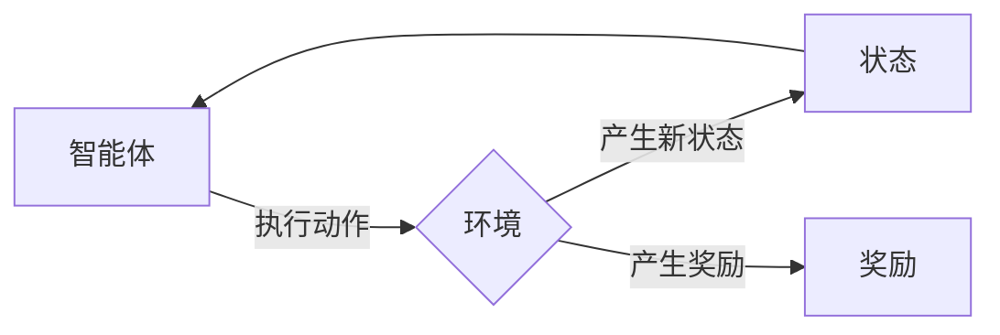

# Reinforcement Learning 原理与代码实战案例讲解

## 1. 背景介绍

### 1.1 问题的由来

强化学习（Reinforcement Learning，RL）是人工智能领域的一个重要分支，旨在使智能体在与环境交互的过程中学习到最优策略，以最大化累积奖励。这种学习方式模拟了人类学习的过程，广泛应用于游戏、机器人控制、自动驾驶、推荐系统等领域。

随着深度学习技术的快速发展，深度强化学习（Deep Reinforcement Learning，DRL）应运而生，将深度学习与强化学习相结合，取得了许多突破性成果。本篇文章将深入浅出地介绍强化学习的原理与代码实战案例，帮助读者掌握这一前沿技术。

### 1.2 研究现状

近年来，强化学习在学术界和工业界都取得了显著的进展。以下是一些重要的里程碑：

- Q-learning、Sarsa等经典的强化学习算法被提出，为后续研究奠定了基础。
- DQN（Deep Q-Network）等基于深度学习的强化学习算法在多个游戏任务中取得了超越人类的表现。
- PPO（Proximal Policy Optimization）等高效算法的出现，使得强化学习应用更加可行。
- AlphaGo、AlphaFold等深度强化学习模型在围棋和蛋白质折叠等领域取得了突破性成果。

### 1.3 研究意义

强化学习具有以下重要意义：

- 解决实际问题：强化学习可以应用于各种实际场景，如自动驾驶、机器人控制、推荐系统等，为解决复杂问题提供有效途径。
- 模拟人类学习：强化学习模拟人类学习过程，有助于理解人类学习机制。
- 创新研究：强化学习为人工智能领域带来了新的研究方向和算法设计思路。

### 1.4 本文结构

本文将分为以下几个部分：

- 核心概念与联系：介绍强化学习的核心概念和相关技术。
- 核心算法原理 & 具体操作步骤：讲解强化学习的基本算法原理和操作步骤。
- 数学模型和公式 & 详细讲解 & 举例说明：介绍强化学习中的数学模型和公式，并结合实例进行讲解。
- 项目实践：通过代码实例展示强化学习的应用。
- 实际应用场景：探讨强化学习在不同领域的应用。
- 工具和资源推荐：推荐学习资源和开发工具。
- 总结：总结研究成果，展望未来发展趋势与挑战。

## 2. 核心概念与联系

本节将介绍强化学习中的核心概念和相关技术。

- 强化学习系统：由智能体、环境、状态、动作、奖励和策略等组成。
- 智能体：根据策略与环境交互，并学习到最优策略。
- 环境：智能体所处的环境，能够根据智能体的动作产生新的状态和奖励。
- 状态：智能体在环境中的当前状态，通常用向量表示。
- 动作：智能体可以执行的动作，通常用向量表示。
- 奖励：智能体执行动作后获得的奖励，用于指导智能体的学习。
- 策略：智能体在给定状态下执行动作的规则，分为确定性策略和随机策略。

### Mermaid 流程图



## 3. 核心算法原理 & 具体操作步骤

### 3.1 算法原理概述

强化学习算法分为值函数方法、策略方法、模型方法等。其中，值函数方法通过学习状态值函数和策略值函数来指导智能体的学习。

- 状态值函数：衡量智能体在给定状态下采取最优策略所能获得的累积奖励。
- 策略值函数：衡量智能体在给定状态下采取当前策略所能获得的累积奖励。

### 3.2 算法步骤详解

以下是强化学习算法的基本步骤：

1. 初始化智能体、环境、状态值函数、策略值函数等。
2. 智能体在初始状态下执行动作，与环境进行交互。
3. 环境根据智能体的动作产生新的状态和奖励。
4. 更新状态值函数和策略值函数。
5. 迭代步骤2-4，直到满足终止条件。

### 3.3 算法优缺点

强化学习算法的优点：

- 能够处理复杂环境，解决实际问题。
- 模拟人类学习过程，有助于理解人类学习机制。

强化学习算法的缺点：

- 学习过程可能非常缓慢，需要大量数据进行训练。
- 对于连续动作空间，状态空间可能无限大，难以表示。

### 3.4 算法应用领域

强化学习在以下领域得到了广泛应用：

- 游戏人工智能：例如AlphaGo、DeepMind Lab等。
- 机器人控制：例如无人机、自动驾驶汽车等。
- 推荐系统：例如推荐算法、广告投放等。
- 金融领域：例如股票交易、风险管理等。

## 4. 数学模型和公式 & 详细讲解 & 举例说明

### 4.1 数学模型构建

强化学习中的数学模型主要包括：

- 状态转移概率：描述智能体在给定状态下执行动作后，转移到新的状态的概率。
- 奖励函数：描述智能体执行动作后获得的奖励。
- 策略：描述智能体在给定状态下执行动作的规则。

### 4.2 公式推导过程

以下是一些强化学习中的常用公式：

- 状态值函数递推公式：
$$
V(s) = \sum_{a \in A} \gamma \max_{a'} Q(s, a, a')
$$
- 策略值函数递推公式：
$$
Q(s, a) = \sum_{s' \in S} \pi(a | s) R(s, a, s') + \gamma \max_{a'} Q(s', a')
$$

### 4.3 案例分析与讲解

以下以经典的Q-learning算法为例，讲解强化学习算法的实现过程。

- 初始化Q-table，将所有状态-动作对的Q值初始化为0。
- 选择初始状态s。
- 在状态s下，选择动作a。
- 执行动作a，与环境交互，获得新状态s'和奖励r。
- 更新Q-table中(s, a)的Q值：
$$
Q(s, a) = Q(s, a) + \alpha [r + \gamma \max_{a'} Q(s', a') - Q(s, a)]
$$
- 返回步骤3。

### 4.4 常见问题解答

**Q1：什么是策略梯度？**

A：策略梯度是指根据梯度下降原理，通过策略函数的梯度来更新策略参数，从而优化策略函数的方法。

**Q2：什么是深度Q网络（DQN）？**

A：深度Q网络（Deep Q-Network，DQN）是一种结合了深度学习和Q-learning的强化学习算法。DQN使用深度神经网络来近似Q函数，并通过经验回放和目标网络等技术来解决样本波动和过拟合问题。

**Q3：什么是强化学习中的探索与利用？**

A：在强化学习中，探索（Exploration）是指智能体在执行动作时尝试未知动作，以获取更多样化的信息。利用（Exploitation）是指智能体在执行动作时选择已知最优动作，以最大化累积奖励。探索与利用的平衡是强化学习中的一个重要问题。

## 5. 项目实践：代码实例和详细解释说明

### 5.1 开发环境搭建

以下使用Python和TensorFlow实现DQN算法。

```bash
pip install tensorflow
```

### 5.2 源代码详细实现

```python
import tensorflow as tf

# 定义DQN网络
class DQN(tf.keras.Model):
    def __init__(self, state_dim, action_dim):
        super(DQN, self).__init__()
        self.fc = tf.keras.layers.Dense(action_dim, input_dim=state_dim)

    def call(self, x):
        return self.fc(x)

# 定义训练器
class DQNAgent:
    def __init__(self, state_dim, action_dim, learning_rate):
        self.state_dim = state_dim
        self.action_dim = action_dim
        self.learning_rate = learning_rate
        self.model = DQN(state_dim, action_dim)
        self.optimizer = tf.keras.optimizers.Adam(learning_rate=learning_rate)
        self.memory = []

    def remember(self, state, action, reward, next_state, done):
        self.memory.append([state, action, reward, next_state, done])

    def act(self, state):
        state = tf.convert_to_tensor(state, dtype=tf.float32)
        act_values = self.model(state)
        act_values = tf.nn.softmax(act_values).numpy()
        return np.random.choice(self.action_dim, p=act_values)

    def replay(self, batch_size):
        minibatch = random.sample(self.memory, batch_size)
        for state, action, reward, next_state, done in minibatch:
            next_state_value = self.model(next_state).numpy()
            td_target = reward if done else reward + self.gamma * np.max(next_state_value)
            td_error = td_target - self.model(state).numpy()[action]
            self.model.optimizer.minimize(lambda: tf.keras.losses.sparse_categorical_crossentropy(y_true=np.array([td_target]), y_pred=self.model(state)), self.model.trainable_variables)
```

### 5.3 代码解读与分析

- DQN类：定义DQN网络结构，包括输入层和全连接层。
- DQNAgent类：定义强化学习智能体，包括记忆、选择动作、更新模型等函数。
- remember函数：将经验存储到经验池中。
- act函数：根据策略函数选择动作。
- replay函数：使用经验池中的经验进行学习。

### 5.4 运行结果展示

以下展示在CartPole环境上训练DQN算法的示例：

```python
import gym

# 初始化环境
env = gym.make('CartPole-v1')

# 初始化智能体
agent = DQNAgent(state_dim=4, action_dim=2, learning_rate=0.01)
gamma = 0.99

# 训练过程
for episode in range(1000):
    state = env.reset()
    while True:
        action = agent.act(state)
        next_state, reward, done, _ = env.step(action)
        agent.remember(state, action, reward, next_state, done)
        state = next_state
        if done:
            break
    if episode % 50 == 0:
        print(f"Episode: {episode}, score: {env.step}")
```

运行以上代码，可以看到智能体在CartPole环境中取得了一定的成绩。

## 6. 实际应用场景

### 6.1 游戏人工智能

强化学习在游戏人工智能领域取得了许多突破性成果，如AlphaGo、DeepMind Lab等。

### 6.2 机器人控制

强化学习可以应用于机器人控制，使机器人能够自主完成各种任务，如行走、避障、抓取等。

### 6.3 自动驾驶

强化学习可以应用于自动驾驶，使汽车能够自主行驶，提高安全性。

### 6.4 推荐系统

强化学习可以应用于推荐系统，如电影推荐、商品推荐等。

### 6.5 金融领域

强化学习可以应用于金融领域，如股票交易、风险管理等。

## 7. 工具和资源推荐

### 7.1 学习资源推荐

- 《Reinforcement Learning: An Introduction》
- 《Reinforcement Learning with TensorFlow》
- 《Deep Reinforcement Learning》

### 7.2 开发工具推荐

- TensorFlow
- PyTorch
- OpenAI Gym

### 7.3 相关论文推荐

- Q-learning
- Deep Q-Network (DQN)
- Proximal Policy Optimization (PPO)

### 7.4 其他资源推荐

- arXiv
- GitHub
- 知乎

## 8. 总结：未来发展趋势与挑战

### 8.1 研究成果总结

本文介绍了强化学习的原理与代码实战案例，帮助读者掌握这一前沿技术。通过本文的学习，读者可以了解到强化学习的基本概念、核心算法、应用领域和开发工具等。

### 8.2 未来发展趋势

未来，强化学习将在以下方面取得新的突破：

- 深度强化学习：将深度学习与强化学习进一步结合，解决更加复杂的问题。
- 多智能体强化学习：研究多个智能体之间的交互和合作。
- 强化学习与知识表示结合：将知识表示技术应用于强化学习，提高智能体的推理能力。
- 强化学习与强化学习结合：研究强化学习与其他学习方法的结合，如迁移学习、多智能体强化学习等。

### 8.3 面临的挑战

强化学习在发展过程中也面临着一些挑战：

- 样本效率：如何减少训练所需的数据量。
- 可解释性：如何解释强化学习模型的决策过程。
- 可扩展性：如何将强化学习应用于更大规模的环境。

### 8.4 研究展望

随着研究的不断深入，强化学习将在未来取得更加显著的成果，为人工智能领域的发展做出更大的贡献。

## 9. 附录：常见问题与解答

**Q1：什么是Q-learning？**

A：Q-learning是一种基于值函数的强化学习算法，通过学习状态-动作值函数来指导智能体的学习。

**Q2：什么是DQN？**

A：DQN是一种基于深度学习的强化学习算法，使用深度神经网络来近似Q函数。

**Q3：什么是PPO？**

A：PPO（Proximal Policy Optimization）是一种高效的强化学习算法，通过优化策略函数的梯度来更新策略参数。

**Q4：强化学习有哪些应用场景？**

A：强化学习在游戏人工智能、机器人控制、自动驾驶、推荐系统、金融领域等领域都有广泛应用。

**Q5：如何选择合适的强化学习算法？**

A：选择合适的强化学习算法需要考虑以下因素：

- 环境特点：如离散动作空间、连续动作空间、环境交互复杂性等。
- 学习效率：如收敛速度、样本效率等。
- 可解释性：如模型的可解释程度等。

---

作者：禅与计算机程序设计艺术 / Zen and the Art of Computer Programming