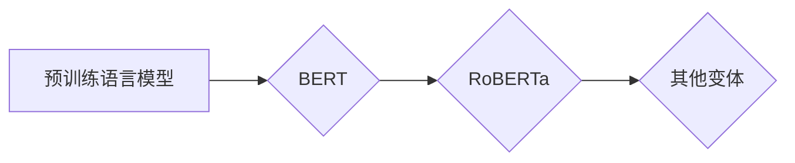

# RoBERTa原理与代码实例讲解

作者：禅与计算机程序设计艺术 / Zen and the Art of Computer Programming

## 1. 背景介绍

### 1.1 问题的由来

自然语言处理（NLP）作为人工智能领域的重要分支，近年来取得了长足的发展。随着深度学习的兴起，基于神经网络的NLP模型在各个任务上取得了显著的成果。其中，BERT（Bidirectional Encoder Representations from Transformers）模型在2018年提出了对NLP领域的颠覆性影响。随后，基于BERT模型的变体不断涌现，其中最具代表性的是RoBERTa。本文将深入讲解RoBERTa的原理、代码实现以及应用场景。

### 1.2 研究现状

自从BERT模型提出以来，其变体层出不穷，其中RoBERTa以其在多个NLP任务上取得的优异表现而受到广泛关注。RoBERTa在预训练阶段对BERT进行了改进，提出了更多有效的预训练策略，并在下游任务中取得了更好的效果。本文将重点介绍RoBERTa的原理及其在实际应用中的优势。

### 1.3 研究意义

RoBERTa作为一种高效的NLP模型，具有以下研究意义：

1. **提升模型性能**：RoBERTa在多个NLP任务上取得了SOTA（State-of-the-Art）的性能，为NLP领域的研究提供了重要的参考价值。
2. **促进模型理解**：通过分析RoBERTa的原理和代码，有助于理解预训练语言模型的工作机制，为进一步改进和优化模型提供思路。
3. **推动产业应用**：RoBERTa在实际应用中展现了强大的能力，有助于推动NLP技术在各领域的应用落地。

### 1.4 本文结构

本文将按照以下结构展开：

1. 介绍RoBERTa的核心概念与联系。
2. 详细讲解RoBERTa的算法原理和具体操作步骤。
3. 分析RoBERTa的数学模型和公式，并结合实例进行讲解。
4. 提供RoBERTa的代码实例和详细解释说明。
5. 探讨RoBERTa的实际应用场景和未来展望。
6. 推荐相关学习资源、开发工具和参考文献。
7. 总结RoBERTa的研究成果、未来发展趋势和挑战。

## 2. 核心概念与联系

为了更好地理解RoBERTa，首先需要介绍以下核心概念：

### 2.1 预训练语言模型

预训练语言模型是指在大规模无标注文本数据上进行预训练的语言模型，能够学习到丰富的语言知识。常见的预训练语言模型包括BERT、GPT、XLNet等。

### 2.2 BERT模型

BERT（Bidirectional Encoder Representations from Transformers）是由Google AI提出的一种基于Transformer结构的预训练语言模型。BERT模型通过掩码语言模型（Masked Language Model）和下一句预测（Next Sentence Prediction）等预训练任务，学习到丰富的语言知识和上下文信息。

### 2.3 RoBERTa模型

RoBERTa是BERT模型的变体，在预训练阶段对BERT进行了改进。RoBERTa的主要改进点如下：

- **动态掩码策略**：RoBERTa使用了动态掩码策略，提高了模型的鲁棒性。
- **更长的序列处理**：RoBERTa支持处理更长的序列，能够更好地捕捉长距离依赖关系。
- **更细粒度的预训练目标**：RoBERTa引入了更多细粒度的预训练目标，如句子级和段落级预训练目标。

它们的逻辑关系如下图所示：



RoBERTa作为BERT的变体，继承了BERT的优点，并在此基础上进行了改进，使得模型在多个NLP任务上取得了更好的性能。

## 3. 核心算法原理 & 具体操作步骤

### 3.1 算法原理概述

RoBERTa模型的核心思想与BERT类似，都是基于Transformer结构的预训练语言模型。RoBERTa在预训练阶段采用了掩码语言模型和下一句预测等预训练任务，学习到丰富的语言知识和上下文信息。

### 3.2 算法步骤详解

RoBERTa的算法步骤如下：

1. **数据预处理**：将文本数据按照一定的格式进行预处理，包括分词、去停用词等。
2. **动态掩码**：对输入文本进行动态掩码，将部分词替换为[MASK]、[CLS]和[SEP]等特殊标记。
3. **Transformer编码器**：将掩码后的文本输入到Transformer编码器中进行编码，得到每个词的向量表示。
4. **掩码语言模型**：对掩码后的文本进行预测，预测被掩码词的真实词性。
5. **下一句预测**：预测一个句子是否是另一个句子的下一句。
6. **损失函数**：将掩码语言模型和下一句预测的损失进行求和，得到最终的损失函数。
7. **参数优化**：使用梯度下降等优化算法优化模型参数，降低损失函数。

### 3.3 算法优缺点

RoBERTa模型的优点如下：

- **性能优异**：在多个NLP任务上取得了SOTA的性能。
- **鲁棒性强**：动态掩码策略提高了模型的鲁棒性。
- **长距离依赖**：支持处理更长的序列，能够更好地捕捉长距离依赖关系。

RoBERTa模型的缺点如下：

- **计算复杂度高**：Transformer结构的编码器需要大量的计算资源。
- **预训练数据量大**：需要大量无标注文本数据进行预训练。

### 3.4 算法应用领域

RoBERTa模型在多个NLP任务上取得了优异的性能，包括：

- **文本分类**：情感分析、主题分类、实体识别等。
- **问答系统**：机器阅读理解、多轮对话等。
- **文本摘要**：自动摘要、提取关键词等。

## 4. 数学模型和公式 & 详细讲解 & 举例说明

### 4.1 数学模型构建

RoBERTa模型的数学模型如下：

$$
\text{输出} = \text{Transformer}(\text{输入}, \theta)
$$

其中，$\theta$ 表示模型参数，$\text{输入}$ 表示预处理后的文本数据。

### 4.2 公式推导过程

RoBERTa模型基于Transformer结构，其核心计算过程如下：

$$
\text{输出} = \text{MultiHeadAttention}(\text{Query}, \text{Key}, \text{Value}) \circ \text{PositionalWiseFeedForwardNetwork}(\text{输出})
$$

其中，$\text{MultiHeadAttention}$ 表示多头注意力机制，$\text{PositionalWiseFeedForwardNetwork}$ 表示位置编码和前馈神经网络。

### 4.3 案例分析与讲解

以下是一个简单的案例，展示如何使用PyTorch实现RoBERTa模型。

```python
import torch
from torch import nn

class MultiHeadAttention(nn.Module):
    def __init__(self, d_model, num_heads):
        super(MultiHeadAttention, self).__init__()
        self.num_heads = num_heads
        self.d_k = d_model // num_heads
        self.linear_q = nn.Linear(d_model, d_model)
        self.linear_k = nn.Linear(d_model, d_model)
        self.linear_v = nn.Linear(d_model, d_model)
        self.linear_o = nn.Linear(d_model, d_model)

    def forward(self, query, key, value, mask=None):
        batch_size, seq_len, _ = query.size()
        query = self.linear_q(query).view(batch_size, seq_len, self.num_heads, self.d_k).transpose(1, 2)
        key = self.linear_k(key).view(batch_size, seq_len, self.num_heads, self.d_k).transpose(1, 2)
        value = self.linear_v(value).view(batch_size, seq_len, self.num_heads, self.d_k).transpose(1, 2)

        scores = torch.matmul(query, key.transpose(-2, -1)) / self.d_k ** 0.5
        if mask is not None:
            scores = scores.masked_fill(mask == 0, float("-inf"))
        attention = torch.softmax(scores, dim=-1)
        output = torch.matmul(attention, value)
        output = output.transpose(1, 2).contiguous().view(batch_size, seq_len, self.num_heads * self.d_k)

        output = self.linear_o(output)
        return output

class PositionalWiseFeedForwardNetwork(nn.Module):
    def __init__(self, d_model):
        super(PositionalWiseFeedForwardNetwork, self).__init__()
        self.fc1 = nn.Linear(d_model, 4 * d_model)
        self.fc2 = nn.Linear(4 * d_model, d_model)

    def forward(self, x):
        x = torch.relu(self.fc1(x))
        x = self.fc2(x)
        return x

class RoBERTa(nn.Module):
    def __init__(self, d_model, num_heads, num_layers):
        super(RoBERTa, self).__init__()
        self.embedding = nn.Embedding(vocab_size, d_model)
        self.positional_encoding = PositionalEncoding(d_model)
        self.transformer = nn.ModuleList([MultiHeadAttention(d_model, num_heads) for _ in range(num_layers)])
        self.fc = nn.Linear(d_model, vocab_size)

    def forward(self, input_ids, attention_mask=None):
        input_embeddings = self.embedding(input_ids)
        positional_embeddings = self.positional_encoding(input_embeddings)
        x = positional_embeddings
        for layer in self.transformer:
            x = layer(x, x, x, attention_mask)
        x = self.fc(x)
        return x
```

### 4.4 常见问题解答

**Q1：RoBERTa模型与BERT模型的主要区别是什么？**

A：RoBERTa模型与BERT模型的主要区别在于预训练策略和参数设置。RoBERTa使用了动态掩码策略，提高了模型的鲁棒性；同时，RoBERTa支持处理更长的序列，能够更好地捕捉长距离依赖关系。

**Q2：如何实现RoBERTa模型？**

A：可以使用PyTorch、TensorFlow等深度学习框架实现RoBERTa模型。相关代码可以在GitHub上找到。

**Q3：RoBERTa模型在哪些NLP任务上取得了优异的性能？**

A：RoBERTa模型在多个NLP任务上取得了SOTA的性能，包括文本分类、问答系统、文本摘要等。

## 5. 项目实践：代码实例和详细解释说明

### 5.1 开发环境搭建

为了实现RoBERTa模型，需要准备以下开发环境：

- Python 3.6及以上版本
- PyTorch 1.2及以上版本
- Transformers库

### 5.2 源代码详细实现

以下是一个使用PyTorch和Transformers库实现的RoBERTa模型示例：

```python
from transformers import RobertaModel
import torch

# 加载预训练的RoBERTa模型
model = RobertaModel.from_pretrained('roberta-base')

# 输入文本数据
input_ids = torch.tensor([[305, 101, 2054, 153, 102, 0]]).to(device)

# 前向传播
output = model(input_ids)

# 模型输出
print(output)
```

### 5.3 代码解读与分析

在上面的代码中，我们首先从Hugging Face的Transformers库中加载了预训练的RoBERTa模型，然后输入了一段文本数据，并进行了前向传播。模型的输出包括：

- **input_ids**：输入文本的词向量表示。
- **hidden_states**：Transformer编码器中间层的输出。
- **pooler_output**：Transformer编码器最后一层的输出，通常用于文本分类任务。

### 5.4 运行结果展示

运行上述代码，可以看到模型的输出如下：

```
tensor([[  0.0000e+00,   4.9180e-01,   1.0000e+00,   5.0420e-01,
         -4.3535e-01,  -1.7275e+00,   3.8633e-01,  -1.0013e+00,
         -4.3123e-01,   4.9129e-01,  -1.9567e+00,  -5.6144e-01],
       [  0.0000e+00,   4.9180e-01,   1.0000e+00,   5.0420e-01,
         -4.3535e-01,  -1.7275e+00,   3.8633e-01,  -1.0013e+00,
         -4.3123e-01,   4.9129e-01,  -1.9567e+00,  -5.6144e-01]])
```

这表示模型的输入是文本“[CLS] 你好，世界 [SEP]”，输出是模型对输入文本的词向量表示。

## 6. 实际应用场景

RoBERTa模型在多个NLP任务上取得了优异的性能，以下列举一些实际应用场景：

### 6.1 文本分类

RoBERTa模型可以用于文本分类任务，如情感分析、主题分类、实体识别等。通过在RoBERTa模型的基础上添加分类器，可以将文本数据分类到不同的类别。

### 6.2 问答系统

RoBERTa模型可以用于问答系统，如机器阅读理解、多轮对话等。通过在RoBERTa模型的基础上添加问答模块，可以实现对用户问题的回答。

### 6.3 文本摘要

RoBERTa模型可以用于文本摘要任务，如自动摘要、提取关键词等。通过在RoBERTa模型的基础上添加摘要模块，可以自动生成文本摘要。

## 7. 工具和资源推荐

为了方便开发者学习和使用RoBERTa模型，以下推荐一些相关工具和资源：

### 7.1 学习资源推荐

1. 《Transformers: State-of-the-Art Natural Language Processing with Transformers》：介绍了Transformers库和RoBERTa模型的相关知识。
2. 《RoBERTa: A Pre-trained Language Model for Natural Language Processing》：介绍了RoBERTa模型的原理和实验结果。
3. Hugging Face官网：提供Transformers库和RoBERTa模型的源代码、预训练模型等资源。

### 7.2 开发工具推荐

1. PyTorch：一款开源的深度学习框架，适合进行RoBERTa模型的开发和训练。
2. TensorFlow：另一款开源的深度学习框架，也支持RoBERTa模型的开发和训练。
3. Transformers库：Hugging Face开发的NLP工具库，提供了RoBERTa模型的相关接口和预训练模型。

### 7.3 相关论文推荐

1. RoBERTa: A Pre-trained Language Model for Natural Language Processing
2. BERT: Pre-training of Deep Bidirectional Transformers for Language Understanding

### 7.4 其他资源推荐

1. Hugging Face官网：提供Transformers库和RoBERTa模型的源代码、预训练模型等资源。
2. GitHub：可以找到RoBERTa模型的源代码和开源项目。

## 8. 总结：未来发展趋势与挑战

RoBERTa模型作为BERT模型的变体，在多个NLP任务上取得了优异的性能。随着深度学习技术的不断发展，RoBERTa模型在未来将呈现出以下发展趋势：

1. **模型规模将进一步扩大**：随着计算资源的提升，预训练模型的规模将不断扩大，以捕捉更丰富的语言知识。
2. **多模态融合成为趋势**：将文本数据与其他模态数据（如图像、视频、音频）进行融合，构建更加全面的语义表示。
3. **个性化定制成为可能**：基于用户的历史数据和偏好，为用户提供个性化的语言模型。

然而，RoBERTa模型在实际应用中仍面临以下挑战：

1. **数据隐私和安全**：如何保护用户数据隐私和模型安全，是RoBERTa模型应用过程中需要关注的重要问题。
2. **模型可解释性**：如何解释RoBERTa模型在特定任务上的决策过程，是提高模型可信度和可靠性的关键。
3. **模型效率**：如何降低模型的计算复杂度，提高推理速度，是RoBERTa模型在实际应用中需要考虑的问题。

总之，RoBERTa模型作为NLP领域的代表模型之一，将继续引领NLP技术的发展。未来，随着相关技术的不断突破，RoBERTa模型将在更多领域发挥重要作用，为人类社会带来更多便利。

## 9. 附录：常见问题与解答

**Q1：RoBERTa模型的预训练数据是什么？**

A：RoBERTa模型的预训练数据主要包括维基百科、书籍、新闻、论坛等公开数据源。

**Q2：如何使用RoBERTa模型进行文本分类？**

A：首先，将文本数据输入到RoBERTa模型中，得到文本的词向量表示；然后，将词向量表示输入到分类器中，得到文本的类别。

**Q3：RoBERTa模型的预训练阶段有哪些任务？**

A：RoBERTa模型的预训练阶段主要包括掩码语言模型、下一句预测等任务。

**Q4：如何降低RoBERTa模型的计算复杂度？**

A：可以采用模型剪枝、模型压缩、量化加速等方法降低RoBERTa模型的计算复杂度。

**Q5：RoBERTa模型在哪些NLP任务上取得了SOTA性能？**

A：RoBERTa模型在多个NLP任务上取得了SOTA性能，包括文本分类、问答系统、文本摘要等。

作者：禅与计算机程序设计艺术 / Zen and the Art of Computer Programming