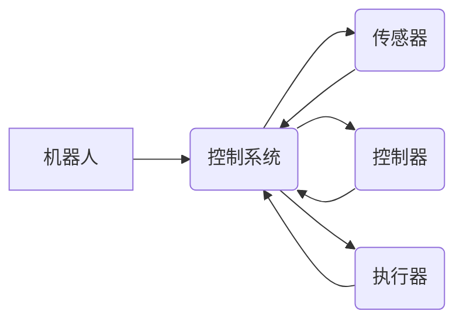

# Robotics and Control Systems 原理与代码实战案例讲解

作者：禅与计算机程序设计艺术 / Zen and the Art of Computer Programming


## 1. 背景介绍

### 1.1 问题的由来

机器人技术和控制理论是现代自动化和智能制造领域的重要支柱。机器人能够执行重复性、危险或精确度要求高的任务，而控制理论则提供了保证机器人稳定性和精确性的理论基础。随着人工智能技术的快速发展，机器人与控制系统的结合变得越来越紧密，形成了一个跨学科的研究领域。

### 1.2 研究现状

近年来，机器人与控制系统的结合取得了显著的进展。一方面，人工智能技术，尤其是深度学习，为机器人提供了更强大的感知和决策能力；另一方面，控制理论的发展为机器人提供了更加先进的控制方法。目前，机器人与控制系统的研究主要集中在以下几个方面：

- 机器人感知与定位：利用传感器获取环境信息，实现机器人的定位和导航。
- 机器人运动规划：规划机器人的运动轨迹，使其能够高效、安全地完成任务。
- 机器人控制策略：设计有效的控制策略，保证机器人的稳定性和精确性。
- 机器人与环境的交互：研究机器人与人类、其他机器人以及环境的交互方式。

### 1.3 研究意义

机器人与控制系统的研究具有以下重要意义：

- 推动自动化和智能制造的发展：机器人与控制系统的结合，可以提高生产效率，降低生产成本，推动传统产业的转型升级。
- 改善人类生活质量：机器人可以替代人类完成危险、繁重或重复性工作，提高人类的生活质量。
- 促进人工智能技术的研究与应用：机器人与控制系统的研究，可以为人工智能技术提供新的应用场景和挑战。

### 1.4 本文结构

本文将系统地介绍机器人与控制系统的原理与代码实战案例。内容安排如下：

- 第2部分，介绍机器人与控制系统的核心概念与联系。
- 第3部分，阐述机器人与控制系统的核心算法原理和具体操作步骤。
- 第4部分，讲解机器人与控制系统中的数学模型和公式。
- 第5部分，通过代码实例展示机器人与控制系统的实战应用。
- 第6部分，探讨机器人与控制系统的实际应用场景及未来发展趋势。
- 第7部分，推荐相关学习资源、开发工具和参考文献。
- 第8部分，总结全文，展望机器人与控制系统的发展趋势与挑战。
- 第9部分，提供常见问题与解答。

## 2. 核心概念与联系

机器人与控制系统涉及多个学科，包括机械工程、电子工程、计算机科学和控制理论等。以下是一些核心概念：

- 机器人：一种能够自主或远程控制的机械装置，用于执行各种任务。
- 控制系统：一种用于控制机器人的系统，包括传感器、控制器和执行器。
- 传感器：用于感知环境信息的装置，如视觉传感器、力传感器等。
- 控制器：用于处理传感器数据，并生成控制信号的装置，如PID控制器、模糊控制器等。
- 执行器：用于执行控制信号的装置，如电机、伺服系统等。
- 运动规划：规划机器人的运动轨迹，使其能够高效、安全地完成任务。
- 感知与定位：利用传感器获取环境信息，实现机器人的定位和导航。

这些概念之间的逻辑关系如下：



可以看出，机器人、控制系统、传感器、控制器和执行器是相互关联的，共同构成了一个完整的机器人与控制系统。

## 3. 核心算法原理 & 具体操作步骤

### 3.1 算法原理概述

机器人与控制系统的核心算法主要包括以下几个方面：

- 传感器数据预处理：对传感器数据进行滤波、特征提取等预处理，提高数据质量。
- 感知与定位算法：利用传感器数据，实现机器人的定位和导航。
- 运动规划算法：规划机器人的运动轨迹，使其能够高效、安全地完成任务。
- 控制策略算法：设计有效的控制策略，保证机器人的稳定性和精确性。

### 3.2 算法步骤详解

以下将分别介绍上述算法的具体操作步骤：

#### 3.2.1 传感器数据预处理

1. 滤波：对传感器数据进行滤波，去除噪声和干扰。
2. 特征提取：从传感器数据中提取有用的特征，如边缘、颜色、纹理等。
3. 数据降维：降低数据维度，减少计算量。

#### 3.2.2 感知与定位算法

1. 目标检测：检测环境中的目标物体。
2. 距离测量：测量目标物体与机器人之间的距离。
3. 定位：根据传感器数据，确定机器人的位置和姿态。

#### 3.2.3 运动规划算法

1. 路径规划：规划机器人的运动轨迹。
2. 速度规划：规划机器人的速度，保证运动轨迹的平滑性。
3. 动作规划：规划机器人的动作，如行走、转弯、抓取等。

#### 3.2.4 控制策略算法

1. PID控制：根据误差信号，计算控制信号。
2. 模糊控制：根据模糊逻辑规则，生成控制信号。
3. 强化学习：通过试错学习，找到最优控制策略。

### 3.3 算法优缺点

以下是上述算法的优缺点：

| 算法 | 优点 | 缺点 |
| --- | --- | --- |
| 滤波 | 去除噪声和干扰 | 可能丢失信息 |
| 特征提取 | 提取有用特征 | 特征选择困难 |
| 目标检测 | 检测目标物体 | 可能漏检或误检 |
| 距离测量 | 测量目标距离 | 测量精度受环境影响 |
| 定位 | 确定位置和姿态 | 可能存在累积误差 |
| 路径规划 | 规划运动轨迹 | 计算复杂度高 |
| 速度规划 | 保证运动轨迹平滑 | 可能受硬件限制 |
| 动作规划 | 规划机器人动作 | 需要根据场景进行调整 |
| PID控制 | 简单易用 | 稳态误差较大 |
| 模糊控制 | 抗干扰能力强 | 难以数学描述 |
| 强化学习 | 自适应能力强 | 训练过程复杂 |

### 3.4 算法应用领域

上述算法广泛应用于以下领域：

- 工业机器人：如焊接、组装、搬运等。
- 服务机器人：如清洁、送餐、护理等。
- 无人驾驶：如自动驾驶汽车、无人船、无人机等。
- 机器人足球：如机器足球比赛、机器人舞蹈等。

## 4. 数学模型和公式 & 详细讲解 & 举例说明

### 4.1 数学模型构建

机器人与控制系统的数学模型主要包括以下几种：

- 运动学模型：描述机器人的运动规律，如欧拉运动学模型、笛卡尔运动学模型等。
- 动力学模型：描述机器人的动力学特性，如牛顿力学模型、拉格朗日力学模型等。
- 控制系统模型：描述控制系统的结构和特性，如线性系统、非线性系统等。

### 4.2 公式推导过程

以下以欧拉运动学模型为例，介绍公式推导过程：

欧拉运动学模型描述了机器人在三维空间中的运动，其公式如下：

$$
\begin{align*}
x(t) &= x_0 + v_xt + \frac{1}{2}a_x t^2 \\
y(t) &= y_0 + v_yt + \frac{1}{2}a_y t^2 \\
z(t) &= z_0 + v_zt + \frac{1}{2}a_z t^2 \\
\theta_x(t) &= \theta_{0x} + \omega_x t \\
\theta_y(t) &= \theta_{0y} + \omega_y t \\
\theta_z(t) &= \theta_{0z} + \omega_z t
\end{align*}
$$

其中，$(x,y,z)$为机器人质心位置，$\theta_x,\theta_y,\theta_z$为机器人绕$x,y,z$轴的旋转角度，$v_x,v_y,v_z$为机器人质心速度，$a_x,a_y,a_z$为机器人质心加速度，$\omega_x,\omega_y,\omega_z$为机器人绕$x,y,z$轴的旋转角速度。

### 4.3 案例分析与讲解

以下以无人驾驶汽车为例，分析运动学模型在实际应用中的计算过程：

1. 假设无人驾驶汽车初始位置为$(x_0,y_0,z_0)$，速度为$(v_x,v_y,v_z)$，加速度为$(a_x,a_y,a_z)$，初始旋转角度为$(\theta_{0x},\theta_{0y},\theta_{0z})$。
2. 设定目标位置为$(x_t,y_t,z_t)$，速度为$(v_{xt},v_{yt},v_{zt})$，加速度为$(a_{xt},a_{yt},a_{zt})$。
3. 根据运动学模型，计算无人驾驶汽车从初始位置到达目标位置所需时间$t$：
   - 解方程组：
     $$
     \begin{align*}
     x_t &= x_0 + v_xt t + \frac{1}{2}a_xt^2 \\
     y_t &= y_0 + v_yt t + \frac{1}{2}a_yt^2 \\
     z_t &= z_0 + v_zt t + \frac{1}{2}a_zt^2
     \end{align*}
     $$
   - 可得$t = \frac{2(v_xt + \frac{1}{2}a_xt^2 - x_0)}{a_xt}$。
4. 根据运动学模型，计算无人驾驶汽车从初始旋转角度到达目标旋转角度所需时间$t$：
   - 解方程组：
     $$
     \begin{align*}
     \theta_x(t) &= \theta_{0x} + \omega_x t \\
     \theta_y(t) &= \theta_{0y} + \omega_y t \\
     \theta_z(t) &= \theta_{0z} + \omega_z t
     \end{align*}
     $$
   - 可得$t = \frac{\theta_x - \theta_{0x}}{\omega_x}$。
5. 根据计算出的时间$t$，控制无人驾驶汽车的加速和转向，使其按照预期轨迹行驶。

### 4.4 常见问题解答

**Q1：运动学模型适用于哪些类型的机器人？**

A：运动学模型适用于所有具有运动自由度的机器人，如关节机器人、轮式机器人、多足机器人等。

**Q2：运动学模型是否可以用于机器人动力学控制？**

A：运动学模型主要用于描述机器人的运动规律，不适用于直接进行机器人动力学控制。

**Q3：如何根据运动学模型进行机器人路径规划？**

A：根据运动学模型，可以计算出机器人从初始位置到达目标位置所需时间，进而规划机器人的运动轨迹。

## 5. 项目实践：代码实例和详细解释说明

### 5.1 开发环境搭建

以下是使用Python和ROS（机器人操作系统）进行机器人与控制系统开发的开发环境搭建步骤：

1. 安装Python：从官网下载并安装Python 3.8以上版本。
2. 安装ROS：根据操作系统和架构，下载对应的ROS安装包并进行安装。
3. 安装依赖库：使用pip安装以下库：
   - `numpy`
   - `matplotlib`
   - `rospy`
   - `tf`
   - `cv2`

### 5.2 源代码详细实现

以下是一个使用ROS和Python实现的简单机器人移动控制案例：

```python
#!/usr/bin/env python3
import rospy
from geometry_msgs.msg import Twist
from math import pi

def callback(data):
    left_velocity = data.linear.x
    right_velocity = data.linear.y

    # 控制左轮和右轮的速度
    velocity_msg = Twist()
    velocity_msg.linear.x = left_velocity
    velocity_msg.angular.z = right_velocity
    pub.publish(velocity_msg)

if __name__ == '__main__':
    rospy.init_node('robot_control_node')
    pub = rospy.Publisher('/cmd_vel', Twist, queue_size=10)
    rospy.Subscriber('/cmd_vel_set', Twist, callback)
    rospy.spin()
```

### 5.3 代码解读与分析

1. 首先，导入必要的库和消息类型。
2. 定义回调函数`callback`，用于处理接收到的速度控制命令。
3. 在`callback`函数中，从输入消息中获取左右轮的速度。
4. 创建速度控制消息`velocity_msg`，设置左右轮的速度。
5. 发布速度控制消息到`/cmd_vel`话题。
6. 在`if __name__ == '__main__':`块中，初始化ROS节点、创建速度控制发布者和订阅者，并调用`rospy.spin()`保持节点运行。

### 5.4 运行结果展示

1. 启动ROS运行环境：`source ~/catkin_ws/devel/setup.bash`
2. 运行速度控制节点：`rosrun robot_control robot_control.py`
3. 在另一个终端中，运行以下命令发送速度控制命令：
```bash
rosrun teleop_twist_keyboard teleop_twist_keyboard.py
```
此时，机器人将根据输入的速度控制命令进行移动。

## 6. 实际应用场景

### 6.1 工业机器人

工业机器人是机器人与控制系统应用最广泛的领域之一。以下是一些常见应用：

- 自动化装配线：如汽车、手机等产品的装配。
- 搬运机器人：如自动搬运货物、零件等。
- 焊接机器人：如自动化焊接、切割等。
- 检测机器人：如自动化检测产品质量、缺陷等。

### 6.2 服务机器人

服务机器人是指为人类提供服务的机器人。以下是一些常见应用：

- 清洁机器人：如自动扫地机器人、擦窗机器人等。
- 送餐机器人：如送餐机器人、快递机器人等。
- 护理机器人：如助老机器人、康复机器人等。
- 教育机器人：如编程机器人、科普机器人等。

### 6.3 无人驾驶

无人驾驶技术是机器人与控制系统在智能交通领域的应用。以下是一些常见应用：

- 自动驾驶汽车：如无人出租车、自动驾驶公交车等。
- 无人船：如无人运输船、无人巡逻船等。
- 无人机：如无人配送无人机、无人航拍无人机等。

### 6.4 未来应用展望

随着人工智能、传感器技术、控制理论等领域的不断发展，机器人与控制系统的应用将越来越广泛。以下是一些未来应用展望：

- 家庭机器人：如家庭助手、家务机器人等。
- 医疗机器人：如手术机器人、康复机器人等。
- 建筑机器人：如建筑机器人、拆除机器人等。
- 军事机器人：如侦察机器人、作战机器人等。

## 7. 工具和资源推荐

### 7.1 学习资源推荐

以下是一些学习机器人与控制系统的资源：

- 《机器人学基础》：介绍机器人学的基础知识和相关技术。
- 《机器人操作系统编程》：介绍ROS的基本原理和编程方法。
- 《机器人控制理论》：介绍机器人控制理论的基本概念和方法。
- 《深度学习与机器人》：介绍深度学习在机器人领域的应用。
- 《机器人编程实战》：提供机器人编程的实战案例和技巧。

### 7.2 开发工具推荐

以下是一些用于机器人与控制系统开发的工具：

- ROS（机器人操作系统）：用于机器人编程和控制的平台。
- Gazebo：用于机器人仿真和测试的仿真软件。
- MATLAB/Simulink：用于机器人建模、仿真和控制的软件。
- OpenCV：用于计算机视觉的库。
- TensorFlow/PyTorch：用于深度学习的框架。

### 7.3 相关论文推荐

以下是一些与机器人与控制系统相关的研究论文：

- “Introduction to Robotics: Mechanics and Control” by John J. Craig
- “Robot Operating System: A Practical Platform for Research, Development, and Deployment of Mobile Robots” by Wolfram Burgard, Dieter Fox, Sebastian Thrun
- “A Tutorial on Robot Motion Planning” by Wolfram Burgard
- “Deep Learning for Robotics: A Survey” by Chien-Chung Huang, George Konidaris, Pieter Abbeel
- “Robotics: Modelling, Planning and Control” by Bruno Siciliano, Lorenzo Sciavicco, Luigi Villani, Giuseppe Oriolo

### 7.4 其他资源推荐

以下是一些与机器人与控制系统相关的其他资源：

- 机器人与自动化技术论坛：提供机器人与自动化技术相关的讨论和交流平台。
- 机器人与自动化技术博客：提供机器人与自动化技术相关的最新资讯和文章。
- 机器人与自动化技术公司：提供机器人与自动化技术的产品和服务。

## 8. 总结：未来发展趋势与挑战

### 8.1 研究成果总结

本文系统地介绍了机器人与控制系统的原理与代码实战案例。从核心概念、算法原理、数学模型到项目实践，全面阐述了机器人与控制系统的知识体系。通过丰富的案例分析和代码实现，使读者能够更加深入地理解机器人与控制系统的应用。

### 8.2 未来发展趋势

未来，机器人与控制系统将呈现出以下发展趋势：

1. 人工智能与机器人技术的深度融合：人工智能技术将为机器人提供更强大的感知、决策和执行能力。
2. 机器人与控制系统的智能化：机器人将具备更高的智能化水平，能够自主适应环境和完成复杂任务。
3. 机器人与控制系统的自主化：机器人将具备更强的自主能力，能够在没有人类干预的情况下自主完成任务。
4. 机器人与控制系统的泛在化：机器人将更加普及，广泛应用于各个领域。

### 8.3 面临的挑战

机器人与控制系统的发展也面临着以下挑战：

1. 技术挑战：机器人与控制系统需要更加高效、准确、可靠的技术支撑。
2. 安全挑战：机器人与控制系统的安全问题亟待解决，以确保人类的安全。
3. 法律和伦理挑战：机器人与控制系统的应用涉及到法律和伦理问题，需要制定相应的规范和标准。
4. 经济挑战：机器人与控制系统的应用需要大量的资金投入，需要探索可持续发展的商业模式。

### 8.4 研究展望

针对上述挑战，未来研究应重点关注以下方向：

1. 人工智能与机器人技术的深度融合：研究如何将人工智能技术更好地应用于机器人领域。
2. 机器人与控制系统的安全性和可靠性：研究如何提高机器人与控制系统的安全性和可靠性。
3. 机器人与控制系统的法律和伦理问题：研究如何解决机器人与控制系统的法律和伦理问题。
4. 机器人与控制系统的商业模式：研究如何探索可持续发展的商业模式，推动机器人与控制系统的产业化进程。

总之，机器人与控制系统是一个充满机遇和挑战的领域。通过不断的技术创新和探索，机器人与控制系统将为人类社会带来更多福祉。

## 9. 附录：常见问题与解答

**Q1：什么是机器人与控制系统？**

A：机器人与控制系统是指一种用于控制机器人运动的系统，包括传感器、控制器和执行器等组件。

**Q2：机器人与控制系统有哪些应用？**

A：机器人与控制系统广泛应用于工业、服务、军事、科研等领域，如工业机器人、服务机器人、无人驾驶、机器人足球等。

**Q3：如何学习机器人与控制系统？**

A：学习机器人与控制系统需要具备一定的数学、物理、计算机科学和控制理论等方面的知识。可以参考相关教材、教程和在线资源进行学习。

**Q4：机器人与控制系统有哪些发展趋势？**

A：机器人与控制系统的发展趋势包括人工智能与机器人技术的深度融合、机器人与控制系统的智能化、自主化和泛在化等。

**Q5：机器人与控制系统有哪些挑战？**

A：机器人与控制系统的发展面临着技术、安全、法律和伦理等方面的挑战。

**Q6：如何应对机器人与控制系统的发展挑战？**

A：应对机器人与控制系统的发展挑战需要加强技术创新、制定相关标准和规范、推动产业协同发展等。