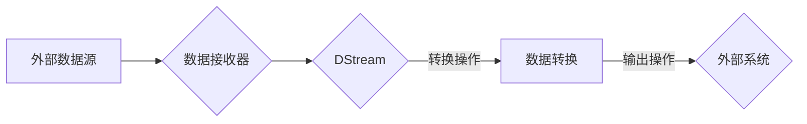

# Spark Streaming 原理与代码实例讲解

作者：禅与计算机程序设计艺术 / Zen and the Art of Computer Programming

## 1. 背景介绍

### 1.1 问题的由来

随着互联网技术的飞速发展，数据量呈现爆炸式增长。传统的批处理系统已无法满足实时数据处理的需求。为了处理实时数据流，Spark Streaming应运而生。

### 1.2 研究现状

Spark Streaming 是 Spark 生态系统中用于实时大数据处理的开源流处理框架。自 2013 年首次发布以来，Spark Streaming 不断发展，已成为实时数据处理领域的事实标准之一。

### 1.3 研究意义

Spark Streaming 的出现，为开发者提供了一种高效、易用的实时数据处理解决方案。它具有以下研究意义：

- 降低实时数据处理门槛，使开发者能够轻松构建实时应用。
- 提高数据处理的实时性和准确性，满足日益增长的数据处理需求。
- 与 Spark 生态系统无缝集成，实现实时数据与批处理数据的高效融合。

### 1.4 本文结构

本文将系统介绍 Spark Streaming 的原理与代码实例，内容安排如下：

- 第 2 部分：介绍 Spark Streaming 的核心概念与联系。
- 第 3 部分：详细讲解 Spark Streaming 的核心算法原理和具体操作步骤。
- 第 4 部分：探讨 Spark Streaming 的数学模型和公式，并结合实例进行讲解。
- 第 5 部分：给出 Spark Streaming 的代码实例和详细解释说明。
- 第 6 部分：分析 Spark Streaming 的实际应用场景。
- 第 7 部分：推荐 Spark Streaming 相关的学习资源、开发工具和参考文献。
- 第 8 部分：总结 Spark Streaming 的未来发展趋势与挑战。
- 第 9 部分：附录，常见问题与解答。

## 2. 核心概念与联系

Spark Streaming 中的核心概念包括：

- **DStream (Discretized Stream)**：离散化流，是 Spark Streaming 中的基本数据结构，用于表示实时数据流。
- **Receiver**：数据接收器，用于从外部数据源（如 Kafka、Flume、Kinesis 等）接收实时数据。
- **Transformation**：转换操作，用于对 DStream 进行处理，如 map、filter、reduceByKey 等。
- **Output Operations**：输出操作，用于将处理后的数据写入外部系统，如 Kafka、HDFS、JDBC 等。
- **Accumulators**：累加器，用于在分布式环境中进行数据累加。

它们之间的逻辑关系如下：



## 3. 核心算法原理 & 具体操作步骤

### 3.1 算法原理概述

Spark Streaming 通过将实时数据流划分为一个个小的批次，对每个批次进行批处理，实现实时数据处理。其核心算法原理如下：

1. **数据接收**：从外部数据源接收实时数据流。
2. **批次划分**：将接收到的数据流划分为一个个小的批次。
3. **批处理**：对每个批次的数据进行批处理操作，如 map、filter、reduceByKey 等。
4. **输出**：将处理后的数据写入外部系统。

### 3.2 算法步骤详解

以下是 Spark Streaming 进行实时数据处理的具体步骤：

1. **初始化 Spark Session**：创建一个 Spark Session，用于初始化 Spark Streaming 上下文环境。
2. **创建 DStream**：根据数据源创建 DStream 对象。
3. **数据转换**：对 DStream 进行转换操作，如 map、filter、reduceByKey 等，实现对数据的处理。
4. **输出结果**：将处理后的数据写入外部系统，如 Kafka、HDFS、JDBC 等。
5. **触发批处理**：通过调用 `start()` 方法启动 Spark Streaming 应用，并设置批处理间隔时间。
6. **等待应用关闭**：在 Spark Streaming 应用中等待用户手动关闭应用或达到预定的运行时间。

### 3.3 算法优缺点

Spark Streaming 具有以下优点：

- **高吞吐量**：Spark Streaming 具有高吞吐量，能够处理大量实时数据。
- **低延迟**：Spark Streaming 具有低延迟，能够实时处理数据。
- **易于扩展**：Spark Streaming 可以无缝地与 Spark 生态系统中的其他组件集成，如 Spark SQL、MLlib 等。
- **容错性**：Spark Streaming 具有容错性，在分布式环境中能够自动恢复故障。

Spark Streaming 也存在一些缺点：

- **资源消耗**：Spark Streaming 需要较多的资源，如 CPU、内存等。
- **开发难度**：Spark Streaming 开发难度相对较高，需要掌握 Spark 和 Scala 语言。
- **性能瓶颈**：在处理高并发、高吞吐量的实时数据时，Spark Streaming 可能出现性能瓶颈。

### 3.4 算法应用领域

Spark Streaming 可应用于以下领域：

- **实时日志分析**：对服务器日志、应用程序日志等进行实时分析，监控系统运行状态。
- **实时监控**：实时监控网络流量、系统性能、用户行为等，发现异常情况并及时处理。
- **实时推荐**：根据用户行为实时推荐商品、新闻、文章等。
- **实时广告**：根据用户行为实时展示广告，提高广告点击率。
- **金融风控**：实时监控金融交易数据，识别异常交易行为，防范金融风险。

## 4. 数学模型和公式 & 详细讲解 & 举例说明

### 4.1 数学模型构建

Spark Streaming 的数学模型主要包括以下部分：

- **数据流模型**：描述实时数据流的特性，如数据量、数据速度等。
- **批处理模型**：描述批处理过程中对数据进行的转换操作，如 map、filter、reduceByKey 等。
- **输出模型**：描述将处理后的数据写入外部系统的过程。

### 4.2 公式推导过程

以下是 Spark Streaming 中一些常见的公式推导过程：

- **数据流模型**：

  设实时数据流每秒产生 $N$ 条数据，数据长度为 $L$，则每秒数据量为 $N \times L$。

- **批处理模型**：

  设批处理间隔时间为 $T$，每个批次处理数据量为 $M$，则每秒处理数据量为 $\frac{M}{T}$。

- **输出模型**：

  设将数据写入外部系统的速度为 $V$，则每秒写入数据量为 $V \times M$。

### 4.3 案例分析与讲解

假设我们需要实时统计每秒访问网站的用户数量，可以使用以下 Spark Streaming 代码实现：

```scala
import org.apache.spark.streaming._
import org.apache.spark.streaming.dstream._

val sparkConf = new SparkConf().setAppName("Website User Count").setMaster("local[*]")
val ssc = new StreamingContext(sparkConf, Seconds(1))

val lines = ssc.socketTextStream("localhost", 9999)
val wordCounts = lines.flatMap(_.split(" ")) \
  .map((_, 1)) \
  .reduceByKey(_ + _)

wordCounts.print()

ssc.start()
ssc.awaitTermination()
```

以上代码从本地的 9999 端口接收实时文本数据，将每行数据按空格分割成单词，统计每个单词出现的次数，并打印每秒的统计结果。这里使用了 `socketTextStream` 方法创建数据源，`flatMap`、`map` 和 `reduceByKey` 方法进行数据转换，`print` 方法将结果打印到控制台。

### 4.4 常见问题解答

**Q1：Spark Streaming 与 Apache Kafka 有何区别？**

A1：Apache Kafka 是一个分布式流处理平台，主要用于构建高吞吐量、可扩展的实时数据流系统。Spark Streaming 是一个实时大数据处理框架，可以与 Kafka 等外部数据源集成，进行实时数据处理。简而言之，Kafka 是数据源，Spark Streaming 是数据处理框架。

**Q2：Spark Streaming 的批处理间隔时间可以修改吗？**

A2：是的，Spark Streaming 的批处理间隔时间可以通过 `setBatchInterval` 方法进行修改。默认批处理间隔时间为 200ms。

**Q3：Spark Streaming 的容错机制是什么？**

A3：Spark Streaming 的容错机制主要基于 Spark 的容错机制。当发生故障时，Spark 会自动从最近的成功批次恢复数据，保证数据的完整性和一致性。

## 5. 项目实践：代码实例和详细解释说明

### 5.1 开发环境搭建

以下是使用 Scala 语言进行 Spark Streaming 开发的环境搭建步骤：

1. 安装 Scala 语言和 sbt 构建工具。
2. 安装 Spark 和 Spark Streaming 安装包。
3. 创建 Scala 项目并添加 Spark 和 Spark Streaming 依赖。

### 5.2 源代码详细实现

以下是一个简单的 Spark Streaming 示例代码，用于从 Kafka 主题读取实时数据，并计算每秒单词出现的次数：

```scala
import org.apache.spark.SparkConf
import org.apache.spark.streaming._
import org.apache.spark.streaming.kafka010._
import org.apache.kafka.common.serialization.StringDeserializer

object SparkStreamingExample {
  def main(args: Array[String]): Unit = {
    val conf = new SparkConf().setAppName("Kafka Spark Streaming Example").setMaster("local[*]")
    val ssc = new StreamingContext(conf, Seconds(1))

    // 创建 Kafka 配置
    val kafkaParams = Map[String, Object](
      "bootstrap.servers" -> "localhost:9092",
      "key.deserializer" -> classOf[StringDeserializer],
      "value.deserializer" -> classOf[StringDeserializer],
      "group.id" -> "spark_streaming_group",
      "auto.offset.reset" -> "latest",
      "enable.auto.commit" -> (false: java.lang.Boolean)
    )

    // 创建 Kafka 数据源
    val messages = KafkaUtils.createDirectStream[String, String](ssc,
      LocationStrategies.PreferConsistent,
      ConsumerStrategies.Subscribe[String, String](Array("topic_name"), kafkaParams))

    // 处理 Kafka 数据
    val wordCounts = messages.map(_.value())
      .flatMap(_.split(" "))
      .map((_, 1))
      .reduceByKey(_ + _)

    // 打印结果
    wordCounts.print()

    // 启动 Spark Streaming 应用
    ssc.start()
    ssc.awaitTermination()
  }
}
```

### 5.3 代码解读与分析

以上代码中，首先创建 Spark 和 Spark Streaming 上下文，然后配置 Kafka 参数并创建 Kafka 数据源。接下来，对 Kafka 数据进行 map、flatMap 和 reduceByKey 等转换操作，计算每秒单词出现的次数，并打印结果。最后，启动 Spark Streaming 应用。

### 5.4 运行结果展示

在 Kafka 中创建名为 "topic_name" 的主题，并生成一些数据。运行以上代码后，可以看到每秒单词出现的次数统计结果。

## 6. 实际应用场景

Spark Streaming 可应用于以下实际应用场景：

- **实时日志分析**：对服务器日志、应用程序日志等进行实时分析，监控系统运行状态，如系统负载、错误率等。
- **实时监控**：实时监控网络流量、系统性能、用户行为等，发现异常情况并及时处理。
- **实时推荐**：根据用户行为实时推荐商品、新闻、文章等。
- **实时广告**：根据用户行为实时展示广告，提高广告点击率。
- **金融风控**：实时监控金融交易数据，识别异常交易行为，防范金融风险。

## 7. 工具和资源推荐

### 7.1 学习资源推荐

- 《Spark Streaming: Real-time Big Data Analytics》书籍：介绍了 Spark Streaming 的基本概念、原理和使用方法。
- 《Spark Streaming Programming Guide》官方文档：提供了 Spark Streaming 的详细文档，包括安装、配置、API 等内容。
- Spark Streaming 用户邮件列表：关注 Spark Streaming 用户邮件列表，获取最新技术动态和解决方案。

### 7.2 开发工具推荐

- IntelliJ IDEA：支持 Scala 和 Spark 开发的集成开发环境。
- sbt：Scala 项目的构建工具，可用于编译、运行 Spark Streaming 应用。
- Maven：Java 项目的构建工具，可用于编译、运行 Spark Streaming 应用。

### 7.3 相关论文推荐

- **Spark Streaming: High-Throughput, Fault-Tolerant Streaming Processing at Scale**：Spark Streaming 的官方论文，介绍了 Spark Streaming 的设计思路和实现细节。
- **A Practical Guide to Large-Scale Real-Time Data Processing with Apache Spark**：介绍了 Spark Streaming 在实时数据处理中的应用案例。

### 7.4 其他资源推荐

- Spark 官方网站：提供 Spark 相关的文档、教程、案例等资源。
- Databricks 官方网站：提供 Spark 和其他大数据技术的在线学习和社区交流平台。

## 8. 总结：未来发展趋势与挑战

### 8.1 研究成果总结

本文对 Spark Streaming 的原理与代码实例进行了详细讲解，涵盖了 Spark Streaming 的核心概念、算法原理、实际应用场景等内容。通过本文的学习，读者可以掌握 Spark Streaming 的基本原理和开发方法，并将其应用于实际项目中。

### 8.2 未来发展趋势

未来，Spark Streaming 将呈现以下发展趋势：

- **与更多数据源集成**：Spark Streaming 将与更多数据源集成，如 Redis、MongoDB、Cassandra 等。
- **支持更丰富的处理操作**：Spark Streaming 将支持更多处理操作，如窗口操作、机器学习等。
- **更低的延迟**：Spark Streaming 将进一步降低延迟，满足更严格的实时性要求。
- **更好的容错性**：Spark Streaming 将增强容错性，提高系统稳定性。

### 8.3 面临的挑战

Spark Streaming 在未来发展中仍面临以下挑战：

- **资源消耗**：Spark Streaming 的资源消耗较大，如何降低资源消耗，提高资源利用率，将是重要的研究课题。
- **开发难度**：Spark Streaming 开发难度较高，如何降低开发难度，提高开发效率，也是需要解决的问题。
- **性能瓶颈**：Spark Streaming 在处理高并发、高吞吐量的实时数据时，可能存在性能瓶颈，如何优化性能，提高处理能力，需要进一步研究。

### 8.4 研究展望

未来，Spark Streaming 的发展需要关注以下方向：

- **轻量级 Spark Streaming**：开发轻量级 Spark Streaming，降低资源消耗，提高资源利用率。
- **易用性改进**：提高 Spark Streaming 的易用性，降低开发难度，提高开发效率。
- **性能优化**：优化 Spark Streaming 的性能，提高处理能力，满足更高性能要求。

相信通过不断的努力，Spark Streaming 将在实时数据处理领域发挥更大的作用，为大数据技术发展贡献力量。

## 9. 附录：常见问题与解答

**Q1：Spark Streaming 与 Apache Flink 有何区别？**

A1：Apache Flink 是另一个开源的流处理框架，与 Spark Streaming 类似，也支持实时数据处理。Flink 在性能、容错性等方面有所优势，但在易用性和社区活跃度方面不如 Spark Streaming。

**Q2：Spark Streaming 与 Spark SQL 有何区别？**

A2：Spark SQL 是 Spark 生态系统中用于处理结构化数据的组件，支持 SQL 语法和丰富的数据处理操作。Spark Streaming 是用于处理实时数据的组件，两者在应用场景和数据处理方式上有所不同。

**Q3：Spark Streaming 是否支持多数据源？**

A3：是的，Spark Streaming 支持多种数据源，如 Kafka、Flume、Kinesis 等，可以方便地与多种实时数据源集成。

**Q4：Spark Streaming 是否支持事务处理？**

A4：Spark Streaming 不直接支持事务处理，但可以通过与其他组件（如 Apache Kafka）结合实现事务处理功能。

**Q5：Spark Streaming 是否支持机器学习？**

A5：是的，Spark Streaming 可以与 Spark MLlib 集成，支持实时机器学习应用。

希望以上解答能够帮助读者更好地理解 Spark Streaming。如有其他疑问，请随时提问。

---

作者：禅与计算机程序设计艺术 / Zen and the Art of Computer Programming