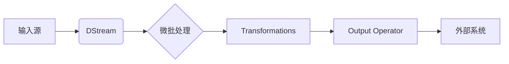

# Spark Streaming实时流处理原理与代码实例讲解

作者：禅与计算机程序设计艺术 / Zen and the Art of Computer Programming

## 1. 背景介绍
### 1.1 问题的由来

随着互联网的快速发展，实时数据处理变得越来越重要。在许多场景中，如社交网络、电子商务、金融交易等，都需要对实时数据进行分析和挖掘，以便快速响应市场变化、优化业务决策。传统的批处理系统在处理实时数据时存在响应速度慢、效率低等问题。因此，实时流处理技术应运而生。

### 1.2 研究现状

目前，实时流处理技术已经得到了广泛关注和研究。Apache Spark Streaming是其中最具代表性的开源框架之一，它基于Apache Spark核心的弹性分布式数据集（RDD）模型，提供了高效、可扩展的实时数据处理能力。

### 1.3 研究意义

实时流处理技术在多个领域具有广泛的应用前景，如：

- **互联网广告**：实时分析用户行为，实现精准广告投放。
- **金融风控**：实时监控交易数据，及时发现异常交易行为。
- **智能家居**：实时处理传感器数据，实现智能设备协同控制。
- **智能交通**：实时分析交通数据，优化交通信号灯控制。

### 1.4 本文结构

本文将围绕Spark Streaming实时流处理技术展开，主要包括以下内容：

- 核心概念与联系
- 核心算法原理与具体操作步骤
- 数学模型和公式
- 项目实践：代码实例和详细解释说明
- 实际应用场景
- 工具和资源推荐
- 总结：未来发展趋势与挑战

## 2. 核心概念与联系

### 2.1 Spark Streaming核心概念

- **弹性分布式数据集（RDD）**：Spark Streaming的核心数据结构，用于表示分布式数据集。
- **DStream**：Spark Streaming中的数据流，由RDD序列组成。
- **微批处理**：Spark Streaming采用微批处理的方式处理流数据，将实时数据划分为小批量进行计算。
- **Watermark**：用于处理乱序数据，确保数据处理的准确性。
- **Transformation**：Spark Streaming提供的操作，用于对数据进行转换和处理。
- **Output Operator**：用于将处理结果输出到外部系统，如HDFS、Kafka等。

### 2.2 关联关系

Spark Streaming的核心概念之间的关系如下：



## 3. 核心算法原理与具体操作步骤

### 3.1 算法原理概述

Spark Streaming采用微批处理的方式处理流数据。具体流程如下：

1. 从数据源（如Kafka、Flume等）获取数据，将其划分为小批量（batch）。
2. 对每个批次进行转换操作，如过滤、映射、转换等。
3. 将转换后的数据输出到外部系统，如存储系统、数据库、其他流处理框架等。

### 3.2 算法步骤详解

Spark Streaming处理流数据的步骤如下：

1. **初始化Spark Streaming**：创建SparkContext和StreamingContext对象。
2. **指定数据源**：使用DStreamContext的`parallelize`方法将数据源（如RDD）转换为DStream。
3. **定义转换操作**：对DStream进行一系列转换操作，如map、filter、union等。
4. **定义输出操作**：将DStream连接到输出操作，如输出到控制台、写入文件、写入数据库等。
5. **启动流处理**：调用`start`方法启动流处理过程。
6. **停止流处理**：在需要停止流处理时，调用`stop`方法停止流处理。

### 3.3 算法优缺点

**优点**：

- **高效**：基于Spark核心的RDD模型，提供了高效的实时数据处理能力。
- **可扩展**：支持在多个节点上分布式部署，可扩展性强。
- **易于编程**：采用Spark API进行开发，易于学习和使用。
- **可与其他Spark组件集成**：可以与其他Spark组件（如Spark SQL、MLlib等）无缝集成。

**缺点**：

- **资源开销**：相较于传统的批处理系统，Spark Streaming需要更多的资源开销。
- **学习成本**：相较于简单的数据处理工具，Spark Streaming的学习成本较高。

### 3.4 算法应用领域

Spark Streaming在以下领域具有广泛的应用：

- **网络日志分析**：实时分析网络日志，监控网站运行状态。
- **实时监控**：实时监控系统性能指标，及时发现异常情况。
- **实时推荐**：实时分析用户行为，实现个性化推荐。
- **实时搜索**：实时分析搜索请求，优化搜索结果。

## 4. 数学模型和公式 & 详细讲解 & 举例说明

### 4.1 数学模型构建

Spark Streaming的数学模型可以表示为：

$$
\text{Spark Streaming} = \text{RDD} + \text{DStream} + \text{Transformation} + \text{Output Operator}
$$

其中：

- RDD：弹性分布式数据集，用于表示分布式数据。
- DStream：实时数据流，由RDD序列组成。
- Transformation：Spark Streaming提供的操作，用于对数据进行转换和处理。
- Output Operator：用于将处理结果输出到外部系统。

### 4.2 公式推导过程

由于Spark Streaming的数学模型主要基于Spark的RDD模型，因此其公式推导过程可以参考Spark的相关资料。

### 4.3 案例分析与讲解

以下是一个简单的Spark Streaming案例，实现实时统计词频。

```python
from pyspark.streaming import StreamingContext
from pyspark.streaming import Duration
from pyspark.streaming.kafka import KafkaUtils

# 初始化StreamingContext
ssc = StreamingContext(sc, Duration("1s"))

# 创建Kafka输入源
kafkaStream = KafkaUtils.createStream(ssc, "kafka-broker:2181", "spark-streaming", {"topic": "words"})

# 对接收到的数据进行转换处理
words = kafkaStream.flatMap(lambda line: line.split(" ")) \
                 .map(lambda word: (word, 1)) \
                 .reduceByKey(lambda a, b: a + b)

# 输出到控制台
words.pprint()

# 启动流处理
ssc.start()

# 等待流处理结束
ssc.awaitTermination()
```

### 4.4 常见问题解答

**Q1：Spark Streaming如何处理乱序数据？**

A：Spark Streaming使用Watermark机制处理乱序数据。Watermark是一种时间戳，表示该时间戳之前的数据都已到达。通过Watermark，Spark Streaming可以确保数据处理结果的准确性。

**Q2：Spark Streaming如何进行窗口操作？**

A：Spark Streaming提供多种窗口操作，如滑动窗口、固定窗口等。窗口操作可以将数据划分为不同的时间段，以便进行统计和分析。

## 5. 项目实践：代码实例和详细解释说明
### 5.1 开发环境搭建

在进行Spark Streaming项目实践前，需要准备以下开发环境：

- 安装Java开发环境
- 安装Scala开发环境
- 安装Spark开发环境
- 安装Kafka
- 安装ScalaTest测试框架

### 5.2 源代码详细实现

以下是一个简单的Spark Streaming项目，实现实时统计词频。

```scala
import org.apache.spark.SparkConf
import org.apache.spark.streaming.{Seconds, StreamingContext}
import org.apache.spark.streaming.kafka010._
import org.apache.kafka.common.serialization.StringDeserializer

object WordCount {
  def main(args: Array[String]): Unit = {
    val conf = new SparkConf().setAppName("WordCount")
    val ssc = new StreamingContext(conf, Seconds(1))

    // 创建Kafka输入源
    val kafkaParams = Map[String, Object](
      "bootstrap.servers" -> "kafka-broker:9092",
      "key.deserializer" -> classOf[StringDeserializer],
      "value.deserializer" -> classOf[StringDeserializer],
      "group.id" -> "wordCountGroup",
      "auto.offset.reset" -> "latest",
      "enable.auto.commit" -> (false: java.lang.Boolean)
    )

    val messages = KafkaUtils.createDirectStream[String, String](
      ssc,
      LocationStrategies.PreferConsistent,
      ConsumerStrategies.Subscribe[String, String](Array("words"), kafkaParams)
    )

    // 对接收到的数据进行转换处理
    val wordCounts = messages.flatMap(_.split(" "))
      .map((_, 1))
      .reduceByKey(_ + _)

    // 输出到控制台
    wordCounts.print()

    // 启动流处理
    ssc.start()
    ssc.awaitTermination()
  }
}
```

### 5.3 代码解读与分析

上述代码实现了以下功能：

- 创建SparkConf对象，设置Spark应用名称和配置。
- 创建StreamingContext对象，设置流处理时间间隔。
- 创建Kafka输入源，从指定的Kafka主题中获取数据。
- 对接收到的数据进行转换处理，统计词频。
- 输出到控制台。
- 启动流处理。
- 等待流处理结束。

### 5.4 运行结果展示

在Kafka中创建一个名为`words`的主题，并产生一些词频数据，然后运行上述代码，可以看到控制台实时输出统计结果。

## 6. 实际应用场景
### 6.1 实时监控系统

Spark Streaming可以用于实时监控系统性能指标，如CPU、内存、磁盘等。通过对接系统监控工具，如Prometheus、Grafana等，可以将监控数据实时传输到Spark Streaming进行计算和分析，及时发现异常情况。

### 6.2 实时日志分析

Spark Streaming可以用于实时分析日志数据，如访问日志、错误日志等。通过对接日志收集工具，如Flume、Logstash等，可以将日志数据实时传输到Spark Streaming进行计算和分析，提取有价值的用户行为数据。

### 6.3 实时推荐系统

Spark Streaming可以用于实时分析用户行为，如点击、浏览、购买等，根据用户行为动态生成个性化推荐。

### 6.4 未来应用展望

随着大数据和人工智能技术的不断发展，Spark Streaming将在更多领域得到应用，如：

- **智能交通**：实时分析交通数据，优化交通信号灯控制，缓解交通拥堵。
- **智能制造**：实时分析设备运行数据，实现设备预测性维护。
- **智慧医疗**：实时分析医疗数据，辅助医生进行诊断和治疗。

## 7. 工具和资源推荐
### 7.1 学习资源推荐

- 《Spark Streaming官方文档》：Spark Streaming的官方文档，提供了详细的API文档和示例代码。
- 《Spark: The Definitive Guide》书籍：Spark的权威指南，全面介绍了Spark的核心概念、API和案例。
- 《Spark Streaming with Java》书籍：针对Java开发者，介绍了Spark Streaming的Java API。
- 《Spark Streaming实战》书籍：Spark Streaming实战案例，介绍了Spark Streaming在各个领域的应用。

### 7.2 开发工具推荐

- IntelliJ IDEA：支持Scala和Java开发的集成开发环境。
- PyCharm：支持Python、Scala、Java等语言的集成开发环境。
- ScalaTest：Scala测试框架，用于测试Scala代码。

### 7.3 相关论文推荐

- 《Spark: Spark: A Distributed Data-Flow Engine for Large-Scale Cluster Computing》：Spark的论文，介绍了Spark的设计和实现。
- 《A Large-scale Incremental Learning System》：介绍了增量学习系统，Spark Streaming的微批处理机制与该论文提出的概念类似。

### 7.4 其他资源推荐

- Apache Spark官网：Spark的官方网站，提供了最新的官方文档、社区论坛和资源。
- Apache Spark社区：Spark的社区论坛，可以交流Spark相关技术和经验。
- Spark Summit：Spark年度大会，可以了解Spark的最新技术和趋势。

## 8. 总结：未来发展趋势与挑战
### 8.1 研究成果总结

本文对Spark Streaming实时流处理技术进行了全面系统的介绍，包括其核心概念、算法原理、应用场景、项目实践等。通过本文的学习，读者可以了解Spark Streaming的原理和用法，并能够将其应用于实际的开发项目中。

### 8.2 未来发展趋势

随着大数据和人工智能技术的不断发展，Spark Streaming将在以下方面得到进一步发展：

- **更快的性能**：通过优化算法、硬件加速等方式提高Spark Streaming的吞吐量和延迟。
- **更好的可扩展性**：支持更复杂的流处理任务，如图处理、机器学习等。
- **更高的易用性**：简化Spark Streaming的API和配置，降低学习门槛。
- **更多的集成**：与其他大数据和人工智能技术进行更深入的集成，如TensorFlow、PyTorch等。

### 8.3 面临的挑战

尽管Spark Streaming在实时流处理领域取得了显著成果，但仍面临着以下挑战：

- **资源消耗**：Spark Streaming需要大量的计算资源，如何优化资源消耗是一个重要问题。
- **延迟控制**：实时流处理需要保证较低的延迟，如何降低延迟是一个挑战。
- **容错性**：如何保证Spark Streaming在分布式环境下的容错性是一个难题。
- **安全性**：如何保证Spark Streaming在处理敏感数据时的安全性是一个挑战。

### 8.4 研究展望

为了应对上述挑战，未来的研究可以从以下几个方面进行：

- **资源优化**：通过优化算法、硬件加速等方式降低Spark Streaming的资源消耗。
- **延迟控制**：通过改进微批处理机制、引入流缓存等技术降低延迟。
- **容错性**：通过改进故障检测和恢复机制提高Spark Streaming的容错性。
- **安全性**：通过数据加密、访问控制等技术保证Spark Streaming的安全性。

相信随着技术的不断发展，Spark Streaming将在实时流处理领域发挥越来越重要的作用，为构建智能化、高效化的数据处理系统提供有力支持。

## 9. 附录：常见问题与解答

**Q1：Spark Streaming与Storm、Flink相比有什么区别？**

A：Spark Streaming、Storm和Flink都是常用的实时流处理框架，它们在架构、性能、易用性等方面存在一些区别：

- **架构**：Spark Streaming基于Spark的弹性分布式数据集（RDD）模型，具有较好的容错性和可扩展性；Storm采用基于tuple的流处理模型，延迟较低；Flink采用基于事件的时间驱动流处理模型，性能较高。
- **性能**：Flink在性能方面具有优势，其次是Spark Streaming，Storm性能相对较低。
- **易用性**：Spark Streaming和Flink的易用性较好，Storm的易用性相对较差。

**Q2：Spark Streaming如何处理乱序数据？**

A：Spark Streaming使用Watermark机制处理乱序数据。Watermark是一种时间戳，表示该时间戳之前的数据都已到达。通过Watermark，Spark Streaming可以确保数据处理结果的准确性。

**Q3：Spark Streaming如何进行窗口操作？**

A：Spark Streaming提供多种窗口操作，如滑动窗口、固定窗口等。窗口操作可以将数据划分为不同的时间段，以便进行统计和分析。

**Q4：Spark Streaming如何与其他大数据技术集成？**

A：Spark Streaming可以与其他大数据技术进行集成，如Hadoop、HDFS、Hive、Kafka等。通过集成，可以实现更复杂的流处理任务。

**Q5：Spark Streaming如何保证容错性？**

A：Spark Streaming通过RDD的容错机制保证容错性。当发生故障时，Spark Streaming会重新计算丢失的RDD，确保数据处理结果的准确性。

**Q6：Spark Streaming如何保证安全性？**

A：Spark Streaming可以通过以下方式保证安全性：

- 数据加密：对敏感数据进行加密，防止数据泄露。
- 访问控制：限制用户对数据的访问权限，防止未授权访问。
- 审计日志：记录用户操作日志，便于追踪和审计。

希望以上解答能够帮助读者更好地了解Spark Streaming实时流处理技术。