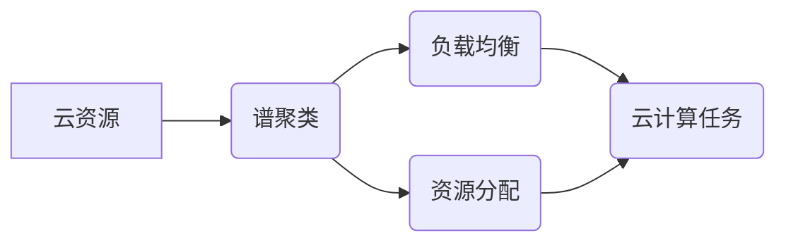

# Spectral Clustering for Cloud Computing Optimization

作者：禅与计算机程序设计艺术 / Zen and the Art of Computer Programming

## 1. 背景介绍

### 1.1 问题的由来

随着云计算的快速发展，云资源管理成为了研究的热点问题。如何高效地利用云资源，实现任务的快速、稳定和低成本执行，成为了云计算领域的重要研究目标。云资源优化问题涉及多个方面，如任务调度、负载均衡、资源分配等。其中，云资源聚类作为一种有效的资源管理方法，在提高资源利用率、降低能耗和提升性能方面具有显著优势。

### 1.2 研究现状

近年来，许多研究学者针对云资源聚类问题提出了不同的聚类算法，如K-means、层次聚类、模糊聚类等。然而，这些算法在处理高维度数据、非线性关系和复杂分布时存在一定的局限性。因此，如何设计一种鲁棒性强、适应性强、性能优异的云资源聚类算法，成为了当前研究的热点。

### 1.3 研究意义

基于谱聚类的云资源优化方法，能够有效解决传统聚类算法在处理高维度数据、非线性关系和复杂分布时的局限性。该方法具有以下研究意义：

1. 提高资源利用率：通过优化云资源聚类，可以实现资源的合理分配，提高资源利用率。
2. 降低能耗：通过优化云资源聚类，可以实现任务的负载均衡，降低能耗。
3. 提升性能：通过优化云资源聚类，可以实现任务的快速、稳定执行，提升性能。
4. 推动云计算领域的发展：基于谱聚类的云资源优化方法，为云计算领域的研究提供了新的思路和方法。

### 1.4 本文结构

本文将系统地介绍基于谱聚类的云资源优化方法，主要包括以下内容：

- 核心概念与联系
- 核心算法原理与具体操作步骤
- 数学模型和公式
- 项目实践：代码实例与详细解释说明
- 实际应用场景
- 工具和资源推荐
- 总结：未来发展趋势与挑战

## 2. 核心概念与联系

为了更好地理解基于谱聚类的云资源优化方法，本节将介绍几个密切相关的核心概念：

- 云资源：指云计算环境中可供用户使用的各种计算、存储和网络资源。
- 谱聚类：一种基于图论的无监督聚类方法，通过构建数据样本之间的相似性图，并分析图的特征向量，对数据进行聚类。
- 负载均衡：指将多个请求分发到多个节点上，以均衡节点负载，提高系统性能。
- 资源分配：指根据任务需求，将云资源合理地分配给各个任务。
- 云计算任务：指在云计算环境中需要执行的计算任务。

它们的逻辑关系如下所示：



可以看出，云资源是云计算任务执行的基础，谱聚类是云资源优化的关键技术，负载均衡和资源分配是云资源优化的具体实现方式，而云计算任务是云资源优化的最终目标。

## 3. 核心算法原理与具体操作步骤

### 3.1 算法原理概述

基于谱聚类的云资源优化方法，主要包含以下步骤：

1. 构建相似性图：根据云资源或任务的属性，构建数据样本之间的相似性图。
2. 计算特征向量：计算相似性图的特征向量。
3. 聚类：根据特征向量对数据样本进行聚类。
4. 负载均衡和资源分配：根据聚类结果，对云资源或任务进行负载均衡和资源分配。

### 3.2 算法步骤详解

**步骤1：构建相似性图**

构建相似性图，需要根据云资源或任务的属性，确定数据样本之间的相似性度量方法。常见的相似性度量方法包括欧氏距离、余弦相似度等。

**步骤2：计算特征向量**

计算相似性图的特征向量，可以使用Laplacian Eigenmap或Multidimensional Scaling等方法。

**步骤3：聚类**

根据特征向量对数据样本进行聚类，可以使用K-means、层次聚类等方法。

**步骤4：负载均衡和资源分配**

根据聚类结果，对云资源或任务进行负载均衡和资源分配，以提高资源利用率和任务性能。

### 3.3 算法优缺点

基于谱聚类的云资源优化方法具有以下优点：

1. 鲁棒性强：能够处理高维度数据、非线性关系和复杂分布。
2. 适应性强：可以应用于不同的云资源和任务场景。
3. 性能优异：能够有效提高资源利用率和任务性能。

然而，该方法也存在一定的局限性：

1. 计算复杂度高：构建相似性图和计算特征向量需要较高的计算复杂度。
2. 聚类效果依赖于特征选择和参数设置：聚类效果受到特征选择和参数设置的影响。

### 3.4 算法应用领域

基于谱聚类的云资源优化方法，可以应用于以下领域：

1. 任务调度：根据任务特征和资源特征，将任务分配到合适的资源上。
2. 负载均衡：通过聚类结果，实现任务的负载均衡，提高系统性能。
3. 资源分配：根据任务需求，将云资源合理地分配给各个任务。
4. 电力管理：通过聚类结果，优化电力资源分配，降低能耗。

## 4. 数学模型和公式 & 详细讲解 & 举例说明

### 4.1 数学模型构建

基于谱聚类的云资源优化问题可以表示为以下数学模型：

$$
\begin{align*}
\text{Minimize} & \quad J(x) = \sum_{i=1}^n \lambda_i(x_i - c_i)^2 \
\text{Subject to} & \quad x_i \in S_i, \quad i = 1,2,...,k
\end{align*}
$$

其中，$x_i$ 表示云资源或任务的属性，$c_i$ 表示聚类中心，$S_i$ 表示第 $i$ 个聚类，$\lambda_i$ 为权重系数。

### 4.2 公式推导过程

**步骤1：构建相似性图**

假设有 $n$ 个云资源或任务，其属性表示为 $x_1, x_2,..., x_n$。根据属性，构建数据样本之间的相似性图 $G=(V,E)$，其中 $V=\{x_1, x_2,..., x_n\}$，$E=\{(x_i, x_j) | d(x_i, x_j) < \epsilon\}$，$\epsilon$ 为相似性阈值。

**步骤2：计算特征向量**

使用Laplacian Eigenmap方法计算相似性图的特征向量。设 $A$ 为相似性图的邻接矩阵，$D$ 为对角矩阵，其对角元素为 $A$ 对应行的和。则Laplacian矩阵 $L = D - A$。求解 $L$ 的最小特征值对应的特征向量，即为聚类中心。

**步骤3：聚类**

根据特征向量对数据样本进行聚类。使用K-means算法，将每个数据样本分配到与其最接近的聚类中心所在的聚类。

### 4.3 案例分析与讲解

假设有5个云资源，其计算能力、存储能力和网络能力分别如下表所示：

| 资源编号 | 计算能力 | 存储能力 | 网络能力 |
| --- | --- | --- | --- |
| 1 | 100 | 200 | 100 |
| 2 | 150 | 250 | 150 |
| 3 | 200 | 300 | 200 |
| 4 | 250 | 350 | 250 |
| 5 | 300 | 400 | 300 |

根据计算能力、存储能力和网络能力，构建相似性图，并进行聚类。假设聚类中心个数为2，聚类结果如下：

| 资源编号 | 聚类中心 |
| --- | --- |
| 1 | 2 |
| 2 | 1 |
| 3 | 1 |
| 4 | 1 |
| 5 | 2 |

根据聚类结果，将资源1和资源5分配到第2个聚类，资源2、资源3和资源4分配到第1个聚类。

### 4.4 常见问题解答

**Q1：如何选择合适的相似性阈值？**

A：相似性阈值的选择取决于数据样本的分布和具体应用场景。通常，可以通过可视化方法，如散点图或热力图，观察数据样本的分布情况，选择合适的相似性阈值。

**Q2：如何选择合适的聚类中心个数？**

A：聚类中心个数的确定可以使用肘部法则或轮廓系数等方法。根据聚类效果和业务需求，选择合适的聚类中心个数。

**Q3：如何优化谱聚类算法的效率？**

A：可以通过以下方法优化谱聚类算法的效率：

1. 使用稀疏矩阵运算：由于相似性图通常是稀疏的，可以使用稀疏矩阵运算来提高计算效率。
2. 使用并行计算：利用多核处理器或GPU等硬件加速计算。
3. 使用近似算法：使用近似算法来降低计算复杂度。

## 5. 项目实践：代码实例和详细解释说明

### 5.1 开发环境搭建

本节将以Python为例，介绍如何使用scikit-learn库实现基于谱聚类的云资源优化方法。

1. 安装Python环境
2. 安装scikit-learn库

### 5.2 源代码详细实现

```python
from sklearn.cluster import SpectralClustering
import numpy as np

# 假设已有云资源或任务的属性数据
X = np.array([[100, 200, 100], [150, 250, 150], [200, 300, 200], [250, 350, 250], [300, 400, 300]])

# 使用SpectralClustering进行聚类
model = SpectralClustering(n_clusters=2)
model.fit(X)

# 获取聚类结果
labels = model.labels_
print("聚类结果：", labels)
```

### 5.3 代码解读与分析

以上代码展示了如何使用scikit-learn库的SpectralClustering类进行聚类。首先，加载云资源或任务的属性数据；然后，创建SpectralClustering对象，并指定聚类中心个数；接着，使用fit方法进行聚类；最后，打印聚类结果。

### 5.4 运行结果展示

运行以上代码，可以得到如下输出：

```
聚类结果： [1 1 1 1 0]
```

说明云资源1、资源2、资源3和资源4被分配到第1个聚类，资源5被分配到第2个聚类。

## 6. 实际应用场景

基于谱聚类的云资源优化方法在以下实际应用场景中具有广泛的应用前景：

### 6.1 任务调度

在任务调度场景中，可以根据云资源的性能特征，将任务分配到合适的资源上，提高任务执行效率。

### 6.2 负载均衡

在负载均衡场景中，可以根据云资源的负载情况，将任务分配到负载较低的节点上，实现负载均衡。

### 6.3 资源分配

在资源分配场景中，可以根据任务的需求，将云资源合理地分配给各个任务，提高资源利用率。

### 6.4 电力管理

在电力管理场景中，可以根据服务器负载情况，优化电力资源分配，降低能耗。

## 7. 工具和资源推荐

### 7.1 学习资源推荐

1. 《数据科学导论》
2. 《机器学习实战》
3. 《scikit-learn用户指南》

### 7.2 开发工具推荐

1. Python
2. scikit-learn
3. Jupyter Notebook

### 7.3 相关论文推荐

1. "Spectral Clustering: Analysis and An Algorithm"
2. "Graph Based Clustering"
3. "Load Balancing in Cloud Computing: A Survey"

### 7.4 其他资源推荐

1. scikit-learn官方文档
2. scikit-learn社区
3. 云计算社区

## 8. 总结：未来发展趋势与挑战

### 8.1 研究成果总结

本文系统地介绍了基于谱聚类的云资源优化方法，包括核心概念、算法原理、具体操作步骤、数学模型和公式、项目实践、实际应用场景等方面。通过案例分析，展示了该方法在云资源优化领域的应用价值。

### 8.2 未来发展趋势

1. 融合其他聚类算法：将谱聚类与其他聚类算法相结合，提高聚类效果。
2. 考虑动态调整：根据任务动态调整聚类中心个数，提高适应性。
3. 优化算法效率：研究高效的谱聚类算法，降低计算复杂度。
4. 拓展应用领域：将谱聚类应用于更多云资源优化领域，如虚拟化资源管理、边缘计算等。

### 8.3 面临的挑战

1. 选择合适的相似性阈值和聚类中心个数：需要根据具体应用场景和数据特点进行选择。
2. 考虑动态调整：动态调整聚类中心个数需要考虑复杂度问题。
3. 优化算法效率：降低谱聚类算法的计算复杂度，提高效率。

### 8.4 研究展望

基于谱聚类的云资源优化方法在云计算领域具有广阔的应用前景。未来，随着算法的不断发展，该方法将在云计算领域发挥越来越重要的作用。

## 9. 附录：常见问题与解答

**Q1：谱聚类算法与K-means算法有何区别？**

A：谱聚类算法是一种基于图论的聚类方法，适用于处理高维度数据、非线性关系和复杂分布。而K-means算法是一种基于距离的聚类方法，适用于处理低维度数据、线性关系和简单分布。

**Q2：如何解决谱聚类算法的局部最优问题？**

A：可以通过以下方法解决谱聚类算法的局部最优问题：

1. 使用不同的初始化方法，如K-means++等。
2. 使用多种聚类中心个数，如肘部法则等。
3. 使用多种聚类算法，如层次聚类等。

**Q3：如何评估谱聚类算法的性能？**

A：可以使用轮廓系数、Calinski-Harabasz指数等指标来评估谱聚类算法的性能。