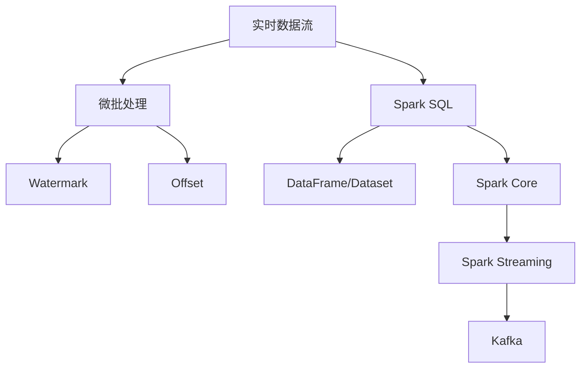
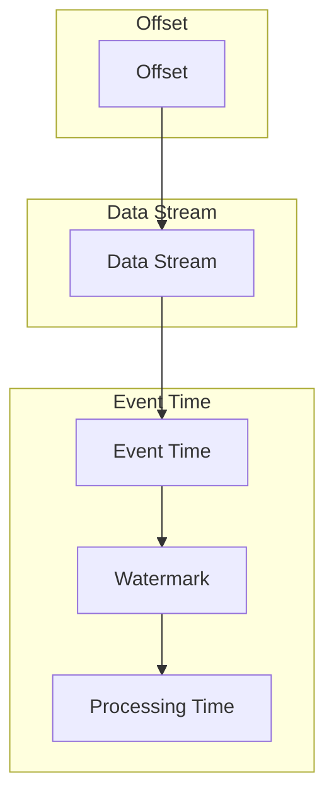

# Structured Streaming原理与代码实例讲解

作者：禅与计算机程序设计艺术 / Zen and the Art of Computer Programming

## 1. 背景介绍
### 1.1 问题的由来

随着大数据时代的到来，实时数据处理需求日益增长。传统的批处理计算模型在面对海量、实时数据时，往往面临着性能瓶颈和延迟问题。为了满足实时数据处理的需求，Apache Spark社区提出了Structured Streaming这一流处理框架，旨在提供一种高效、易用的流数据处理方式。

### 1.2 研究现状

Structured Streaming作为Spark生态系统的重要组成部分，已经成为了实时数据处理领域的热门技术之一。它具备以下特点：

- 易用性：使用Spark SQL语法即可实现流数据处理，无需学习新的编程模型。
- 高效性：基于Spark引擎，充分利用集群资源，实现毫秒级响应。
- 可扩展性：支持水平扩展，可处理海量实时数据。
- 可靠性：支持数据回滚、容错等机制，保证数据不丢失。
- 兼容性：支持多种数据源，如Kafka、Flume等。

### 1.3 研究意义

Structured Streaming在实时数据处理领域具有重要的研究意义，主要体现在以下几个方面：

- 提高数据处理效率：实时处理海量数据，满足实时业务需求。
- 降低开发成本：使用Spark SQL语法，简化开发流程。
- 提升系统可靠性：支持数据回滚、容错等机制，保证数据处理正确性。
- 促进实时数据处理技术的发展：推动实时数据处理技术的研究和应用。

### 1.4 本文结构

本文将详细介绍Structured Streaming的原理、算法、应用案例和代码实践，内容安排如下：

- 第2部分，介绍Structured Streaming的核心概念和相关技术。
- 第3部分，阐述Structured Streaming的算法原理和具体操作步骤。
- 第4部分，分析Structured Streaming的数学模型、公式和常见问题。
- 第5部分，给出Structured Streaming的代码实例和详细解释。
- 第6部分，探讨Structured Streaming在实际应用场景中的应用。
- 第7部分，推荐Structured Streaming的相关学习资源、开发工具和论文。
- 第8部分，总结Structured Streaming的未来发展趋势和面临的挑战。
- 第9部分，提供Structured Streaming的常见问题解答。

## 2. 核心概念与联系

本节将介绍Structured Streaming涉及的核心概念和相关技术，以便读者更好地理解后续内容。

### 2.1 核心概念

- **实时数据流**：指以固定频率产生、不断更新的数据序列。
- **微批处理**：指将实时数据流切分成多个小批次进行处理，每个批次的时间间隔称为微批处理间隔（Micro-batch Interval）。
- **Watermark**：用于识别数据流中事件时间戳的有效性，防止数据丢失和重复。
- **Offset**：用于唯一标识一个数据流的批次。
- **State**：指结构化流处理过程中存储的数据和计算状态。
- **DAG**：指Spark中的数据流图，用于描述数据处理的步骤和依赖关系。

### 2.2 相关技术

- **Spark SQL**：用于处理结构化数据的查询语言，支持SQL、DataFrame和Dataset三种API。
- **DataFrame/Dataset**：用于表示结构化数据的抽象数据结构，支持丰富的操作和优化。
- **Spark Core**：Spark的核心组件，负责资源调度、任务分发和容错等功能。
- **Spark Streaming**：Spark的流处理组件，用于处理实时数据流。
- **Kafka**：分布式流处理平台，支持高吞吐量、低延迟的消息队列。

### 2.3 关系

Structured Streaming涉及到多个核心概念和技术，它们之间的关系如下：



可以看出，实时数据流通过微批处理和Watermark技术，在Spark SQL、DataFrame/Dataset等抽象数据结构上进行处理，最终由Spark Core和Spark Streaming负责资源调度、任务分发和容错等操作。

## 3. 核心算法原理 & 具体操作步骤
### 3.1 算法原理概述

Structured Streaming的算法原理可以概括为以下几个关键步骤：

1. **数据输入**：从数据源（如Kafka）读取实时数据流。
2. **数据切分**：将数据流切分成多个微批次，每个批次包含一定数量的数据记录。
3. **Watermark处理**：计算每个微批次中数据记录的Watermark，确保数据流的正确性。
4. **数据处理**：对每个微批次的数据进行转换、过滤等操作，并计算中间结果。
5. **状态维护**：维护处理过程中的状态，如窗口操作、聚合函数等。
6. **结果输出**：将处理结果输出到目标存储（如HDFS、Hive等）或触发后续操作。

### 3.2 算法步骤详解

以下是Structured Streaming的算法步骤的详细解释：

1. **数据输入**：Structured Streaming支持多种数据源，如Kafka、Flume、JMS等。开发者可以使用`spark.readStream()`方法读取数据源，并指定对应的参数。

2. **数据切分**：Structured Streaming默认使用微批处理技术，将数据流切分成多个微批次。微批次的时间间隔称为微批处理间隔，可以通过`microBatchInterval`参数设置。

3. **Watermark处理**：Watermark是Structured Streaming的核心概念之一，用于识别数据流中事件时间戳的有效性。开发者需要根据数据源的特性，合理设置Watermark，以确保数据的正确性。

4. **数据处理**：Structured Streaming支持多种数据处理操作，如转换、过滤、连接、窗口等。开发者可以使用Spark SQL的语法，对数据进行处理。

5. **状态维护**：Structured Streaming支持多种状态操作，如窗口操作、聚合函数等。开发者可以使用`withWatermark`、`groupBy`、`window`等函数，维护处理过程中的状态。

6. **结果输出**：Structured Streaming支持多种结果输出方式，如将结果写入存储（如HDFS、Hive等）、触发后续操作（如MLlib模型训练）等。开发者可以使用`writeStream`方法，将处理结果输出到目标存储或触发后续操作。

### 3.3 算法优缺点

Structured Streaming作为一种实时流处理框架，具有以下优点：

- **易用性**：使用Spark SQL语法，简化开发流程。
- **高效性**：基于Spark引擎，充分利用集群资源，实现毫秒级响应。
- **可扩展性**：支持水平扩展，可处理海量实时数据。
- **可靠性**：支持数据回滚、容错等机制，保证数据不丢失。

同时，Structured Streaming也存在以下缺点：

- **复杂性**：对于复杂的实时数据处理场景，Structured Streaming的开发和调试较为复杂。
- **性能瓶颈**：在处理高吞吐量数据时，Structured Streaming可能面临性能瓶颈。

### 3.4 算法应用领域

Structured Streaming在以下领域具有广泛的应用：

- **实时数据监控**：对实时数据进行分析和监控，如网站流量、服务器性能等。
- **实时报表**：生成实时报表，如电商交易数据、金融交易数据等。
- **实时推荐**：根据实时数据，进行个性化推荐，如电影推荐、新闻推荐等。
- **实时决策**：根据实时数据，进行实时决策，如风险控制、欺诈检测等。

## 4. 数学模型和公式 & 详细讲解 & 举例说明
### 4.1 数学模型构建

Structured Streaming的数学模型可以概括为以下几个关键概念：

- **事件时间**：指数据记录中记录的时间戳。
- **处理时间**：指数据记录被处理的时间戳。
- **Watermark**：用于识别事件时间的有效性的时间戳。
- **Offset**：用于唯一标识一个数据流的批次。

以下是Structured Streaming的数学模型：



### 4.2 公式推导过程

以下是Structured Streaming中几个关键公式的推导过程：

1. **Watermark计算**：

$$
Watermark = \max_{t \in [0, T]} \{t - \alpha\}
$$

其中，$T$ 为数据记录的起始时间戳，$\alpha$ 为一个正实数，表示Watermark的最大延迟。

2. **Offset计算**：

$$
Offset = t
$$

其中，$t$ 为数据记录的处理时间戳。

### 4.3 案例分析与讲解

以下是一个Structured Streaming的案例，演示如何使用Spark SQL处理实时数据流：

```sql
-- 创建SparkSession
val spark = SparkSession.builder.appName("Structured Streaming Example").getOrCreate()

-- 读取Kafka数据源
val stream = spark.readStream()
  .format("kafka")
  .option("kafka.bootstrap.servers", "localhost:9092")
  .option("subscribe", "test-topic")
  .load()

-- 定义微批处理间隔为1秒
val microBatchInterval = Duration.seconds(1)

-- 转换数据格式，并计算Watermark
val processedStream = stream.selectExpr("CAST(value AS STRING) AS value")
  .withWatermark("timestamp", "1 hour")

-- 对数据流进行转换和过滤
val filteredStream = processedStream.filter("value LIKE '%error%'")

-- 转换为DataFrame，并输出到控制台
val outputStream = filteredStream.toDataFrame

-- 开始执行流处理作业
outputStream.writeStream
  .outputMode("append")
  .format("console")
  .start()
  .awaitTermination()
```

该案例首先从Kafka数据源读取实时数据流，然后定义微批处理间隔为1秒，并计算Watermark。接着对数据流进行转换和过滤，将包含“error”的记录输出到控制台。最后，启动流处理作业，实时监控数据流。

### 4.4 常见问题解答

**Q1：Structured Streaming的Watermark有什么作用？**

A：Watermark用于识别数据流中事件时间的有效性，防止数据丢失和重复。通过计算Watermark，可以确保所有事件时间晚于Watermark的数据都被处理，从而保证数据的正确性。

**Q2：如何设置Structured Streaming的微批处理间隔？**

A：微批处理间隔可以通过`microBatchInterval`参数设置，单位为毫秒。例如，设置微批处理间隔为1秒，可以使用以下代码：

```sql
val microBatchInterval = Duration.seconds(1)
```

**Q3：Structured Streaming支持哪些数据源？**

A：Structured Streaming支持多种数据源，如Kafka、Flume、JMS等。开发者可以使用`spark.readStream()`方法读取数据源，并指定对应的参数。

## 5. 项目实践：代码实例和详细解释说明
### 5.1 开发环境搭建

在进行Structured Streaming项目实践前，我们需要准备好开发环境。以下是使用Scala进行Spark开发的环境配置流程：

1. 安装Scala：从官网下载并安装Scala，版本建议为2.11或2.12。
2. 安装Spark：从官网下载Spark安装包，解压到指定目录。
3. 配置环境变量：将Spark的bin目录添加到系统环境变量PATH中。
4. 编写代码：使用Scala语言编写Structured Streaming代码。
5. 执行代码：使用Spark-submit命令执行Scala代码。

### 5.2 源代码详细实现

以下是一个Structured Streaming的代码实例，演示如何使用Spark SQL处理实时数据流：

```scala
import org.apache.spark.sql.SparkSession
import org.apache.spark.sql.streaming.StreamingQuery

object StructuredStreamingExample {

  def main(args: Array[String]): Unit = {
    // 创建SparkSession
    val spark = SparkSession.builder.appName("Structured Streaming Example").getOrCreate()

    // 读取Kafka数据源
    val stream = spark.readStream()
      .format("kafka")
      .option("kafka.bootstrap.servers", "localhost:9092")
      .option("subscribe", "test-topic")
      .load()

    // 定义微批处理间隔为1秒
    val microBatchInterval = 1000 milliseconds

    // 转换数据格式，并计算Watermark
    val processedStream = stream.selectExpr("CAST(value AS STRING) AS value")
      .withWatermark("timestamp", "1 hour")

    // 对数据流进行转换和过滤
    val filteredStream = processedStream.filter("value LIKE '%error%'")

    // 转换为DataFrame，并输出到控制台
    val outputStream = filteredStream.toDataFrame

    // 开始执行流处理作业
    val query: StreamingQuery = outputStream.writeStream
      .outputMode("append")
      .format("console")
      .start()

    // 等待流处理作业完成
    query.awaitTermination()
  }
}
```

该案例首先创建SparkSession，然后从Kafka数据源读取实时数据流，定义微批处理间隔为1秒，并计算Watermark。接着对数据流进行转换和过滤，将包含“error”的记录输出到控制台。最后，启动流处理作业，实时监控数据流。

### 5.3 代码解读与分析

让我们再详细解读一下关键代码的实现细节：

- `SparkSession`：创建SparkSession实例，用于初始化Spark环境。
- `spark.readStream()`：读取Kafka数据源，`format("kafka")`指定数据源类型，`option`指定数据源连接参数。
- `withWatermark`：计算Watermark，确保数据的正确性。
- `filter`：对数据流进行过滤，保留包含“error”的记录。
- `toDataFrame`：将数据流转换为DataFrame。
- `writeStream`：将DataFrame写入输出源，`outputMode("append")`指定输出模式为追加模式，`format("console")`指定输出格式为控制台输出。
- `start()`：启动流处理作业。
- `awaitTermination()`：等待流处理作业完成。

以上代码展示了使用Scala和Spark SQL进行Structured Streaming的完整流程。通过几个简单的步骤，我们可以轻松实现实时数据流的处理。

### 5.4 运行结果展示

假设Kafka数据源中包含以下消息：

```
test-message-1
error-message-1
test-message-2
error-message-2
test-message-3
```

运行上述代码后，将输出以下结果：

```
+--------------------+
|             value |
+--------------------+
| error-message-1   |
| error-message-2   |
+--------------------+
```

可以看到，Structured Streaming成功地将包含“error”的消息输出到了控制台。

## 6. 实际应用场景
### 6.1 实时数据监控

Structured Streaming可以应用于实时数据监控，如网站流量、服务器性能等。通过读取实时数据流，对数据进行分析和统计，及时发现异常情况，并采取相应的措施。

### 6.2 实时报表

Structured Streaming可以用于生成实时报表，如电商交易数据、金融交易数据等。通过实时处理数据，可以生成实时报表，为业务决策提供数据支持。

### 6.3 实时推荐

Structured Streaming可以应用于实时推荐，如电影推荐、新闻推荐等。通过实时处理用户行为数据，可以为用户提供个性化的推荐内容。

### 6.4 未来应用展望

随着Structured Streaming技术的不断发展，未来将在以下领域得到更广泛的应用：

- **工业物联网**：实时处理工业设备的运行数据，进行故障预测、性能优化等。
- **智慧城市**：实时处理城市交通、环境、安全等数据，实现城市管理的智能化。
- **金融风控**：实时处理金融交易数据，进行风险控制、欺诈检测等。
- **医疗健康**：实时处理医疗数据，进行疾病预测、健康管理等。

## 7. 工具和资源推荐
### 7.1 学习资源推荐

为了帮助开发者系统掌握Structured Streaming的理论基础和实践技巧，这里推荐一些优质的学习资源：

1. Spark官方文档：Spark官方文档提供了丰富的技术文档、教程和案例，是学习Spark的必备资料。
2. 《Spark Programming Guide》：Spark官方编写的学习指南，全面介绍了Spark的核心概念、API和最佳实践。
3. 《Structured Streaming in Spark》：Apache Spark官方团队撰写的关于Structured Streaming的详细教程。
4. 《Streaming Systems》：详细介绍了流处理系统的设计、实现和应用，对理解Structured Streaming有重要参考价值。

### 7.2 开发工具推荐

以下是几款用于Structured Streaming开发的常用工具：

1. **Spark Studio**：基于Web的交互式开发环境，支持Spark SQL、DataFrame/Dataset等API，方便开发者进行实验和调试。
2. **Zeppelin**：一个交互式多语言编程平台，支持Spark、Python、Scala等语言，可以方便地与Structured Streaming结合使用。
3. **Databricks**：基于Apache Spark的企业级平台，提供丰富的数据科学和机器学习功能，支持Structured Streaming的部署和运行。
4. **Cloudera Data Science Workbench**：Cloudera提供的数据科学平台，集成了Spark和Structured Streaming，支持端到端的数据科学流程。

### 7.3 相关论文推荐

以下是几篇关于Structured Streaming和相关技术的论文，推荐阅读：

1. **Structured Streaming: A High-Throughput and Low-Latency Streaming System**：Structured Streaming的原论文，介绍了Structured Streaming的设计目标和实现原理。
2. **Spark Streaming: Stream Processing at Scale**：Spark Streaming的原论文，介绍了Spark Streaming的整体架构和核心特性。
3. **Delta Lake: A Unified Data Platform for Machine Learning**：Delta Lake的原论文，介绍了Delta Lake的设计和实现，Delta Lake是Structured Streaming的数据存储格式。

### 7.4 其他资源推荐

以下是其他一些有价值的资源：

1. **Apache Spark社区论坛**：Apache Spark社区论坛是学习Spark和Structured Streaming的重要平台，可以在这里找到各种技术问题和解决方案。
2. **Stack Overflow**：Stack Overflow上有大量关于Spark和Structured Streaming的问答，可以帮助开发者解决编程问题。
3. **GitHub**：GitHub上有许多开源的Spark和Structured Streaming项目，可以学习他人的代码实现和经验。

## 8. 总结：未来发展趋势与挑战
### 8.1 研究成果总结

本文对Structured Streaming的原理、算法、应用案例和代码实践进行了详细介绍。通过学习本文，读者可以全面了解Structured Streaming的技术特点和应用场景，并能够使用Structured Streaming解决实际的实时数据处理问题。

### 8.2 未来发展趋势

Structured Streaming在实时数据处理领域具有广阔的发展前景，以下是一些可能的发展趋势：

1. **更强大的实时数据处理能力**：随着硬件和软件技术的不断发展，Structured Streaming将具备更强大的实时数据处理能力，能够处理更高的数据量和更复杂的数据类型。
2. **更丰富的应用场景**：Structured Streaming将在更多领域得到应用，如工业物联网、智慧城市、金融风控、医疗健康等。
3. **更易用的编程模型**：Structured Streaming将提供更易用的编程模型，降低开发门槛，让更多开发者能够使用Structured Streaming进行实时数据处理。

### 8.3 面临的挑战

Structured Streaming在实时数据处理领域仍面临以下挑战：

1. **性能优化**：在处理高吞吐量数据时，Structured Streaming可能面临性能瓶颈。
2. **可扩展性**：如何实现更高效的水平扩展，以满足更大规模的数据处理需求。
3. **容错性**：如何提高系统的容错性，保证数据的正确性和可靠性。

### 8.4 研究展望

Structured Streaming的未来研究可以从以下几个方面展开：

1. **性能优化**：通过改进算法、优化资源分配等方式，提高Structured Streaming的性能。
2. **可扩展性**：研究分布式架构和并行处理技术，提高Structured Streaming的可扩展性。
3. **容错性**：研究数据一致性和容错机制，保证Structured Streaming的数据正确性和可靠性。
4. **易用性**：简化编程模型，降低开发门槛，让更多开发者能够使用Structured Streaming。

相信在未来的发展中，Structured Streaming将不断优化和完善，为实时数据处理领域带来更多创新和突破。

## 9. 附录：常见问题与解答

**Q1：Structured Streaming与Spark Streaming有什么区别？**

A：Structured Streaming是Spark Streaming的升级版，在Spark Streaming的基础上引入了流数据处理的新概念，如微批处理、Watermark等。相比Spark Streaming，Structured Streaming具有更高的易用性、性能和可靠性。

**Q2：Structured Streaming支持哪些数据源？**

A：Structured Streaming支持多种数据源，如Kafka、Flume、JMS、Twitter等。

**Q3：如何处理Structured Streaming中的乱序数据？**

A：通过设置Watermark，可以处理Structured Streaming中的乱序数据。Watermark表示数据流的最新时间戳，用于识别数据流中事件时间的有效性。

**Q4：Structured Streaming如何保证数据不丢失？**

A：Structured Streaming支持数据回滚和重试机制，保证数据不丢失。在发生故障时，可以通过回滚到最近的正常状态，重新处理数据。

**Q5：如何优化Structured Streaming的性能？**

A：可以通过以下方式优化Structured Streaming的性能：
- 选择合适的微批处理间隔。
- 优化数据处理逻辑。
- 使用更高效的资源调度策略。
- 使用更有效的内存管理技术。

通过不断学习和实践，相信读者可以更好地掌握Structured Streaming技术，并将其应用于实际的实时数据处理场景。