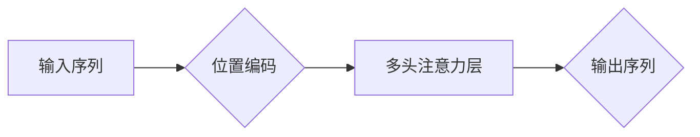

# Transformer大模型实战：带掩码的多头注意力层

作者：禅与计算机程序设计艺术 / Zen and the Art of Computer Programming

## 1. 背景介绍
### 1.1 问题的由来

自2017年Transformer模型横空出世以来，它在自然语言处理（NLP）领域取得了颠覆性的突破。相较于传统的循环神经网络（RNN）和长短时记忆网络（LSTM），Transformer模型在处理长序列数据时表现出色，并成为了NLP领域的主流架构。其中，多头注意力层（Multi-head Attention）作为Transformer模型的核心组件，扮演着至关重要的角色。

然而，由于多头注意力层涉及的概念较为复杂，许多开发者对其原理和应用场景的理解并不深入。本文旨在以通俗易懂的方式，深入浅出地介绍多头注意力层，并结合实际案例进行实战讲解，帮助开发者更好地理解和应用这一关键技术。

### 1.2 研究现状

近年来，随着深度学习技术的快速发展，多头注意力层已经在NLP领域的各个方向得到了广泛应用，例如：

- 文本分类：BERT、XLNet等预训练模型均采用了多头注意力层，在多项文本分类任务上取得了优异的成绩。
- 机器翻译：如Google的神经机器翻译模型，在带掩码的多头注意力层的基础上，实现了更准确的翻译效果。
- 问答系统：BERT等预训练模型在问答系统中的应用，显著提升了系统的问答准确率和流畅度。
- 摘要生成：如ABSA等摘要生成模型，利用多头注意力层捕捉关键信息，生成更加简洁明了的摘要。

### 1.3 研究意义

深入理解多头注意力层，有助于我们：

- 提升对Transformer模型的认知，掌握其核心原理。
- 在NLP任务中灵活运用多头注意力层，提升模型性能。
- 探索多头注意力层在其他领域的应用潜力。

### 1.4 本文结构

本文将按照以下结构展开：

- 2. 核心概念与联系：介绍与多头注意力层相关的核心概念和联系。
- 3. 核心算法原理 & 具体操作步骤：详细讲解多头注意力层的原理和操作步骤。
- 4. 数学模型和公式 & 详细讲解 & 举例说明：使用数学语言描述多头注意力层，并结合实例进行讲解。
- 5. 项目实践：代码实例和详细解释说明：给出多头注意力层的代码实现，并进行详细解读。
- 6. 实际应用场景：探讨多头注意力层在NLP领域的应用场景。
- 7. 工具和资源推荐：推荐相关学习资源、开发工具和参考文献。
- 8. 总结：总结研究成果，展望未来发展趋势与挑战。
- 9. 附录：常见问题与解答。

## 2. 核心概念与联系

为了更好地理解多头注意力层，我们需要先介绍以下几个与之相关的核心概念：

- 注意力机制（Attention Mechanism）：注意力机制是一种通过学习数据中不同部分的相对重要性来改进模型性能的方法。在NLP任务中，注意力机制可以帮助模型关注到与当前任务相关的关键信息。
- 位置编码（Positional Encoding）：由于神经网络模型本身无法处理序列信息中的顺序关系，位置编码为序列中的每个token添加了位置信息，使得模型能够感知到序列的顺序。
- 多头注意力（Multi-head Attention）：多头注意力将输入序列分成多个子序列，并对每个子序列分别进行注意力计算，最后将结果拼接起来，从而捕捉到更丰富的语义信息。

它们之间的联系如下：



可以看出，位置编码为输入序列添加了位置信息，多头注意力层通过学习不同token之间的注意力权重，提取出与任务相关的关键信息，最终生成输出序列。

## 3. 核心算法原理 & 具体操作步骤
### 3.1 算法原理概述

多头注意力层的核心思想是将输入序列分成多个子序列，并对每个子序列分别进行注意力计算，最后将结果拼接起来。具体来说，多头注意力层包括以下几个步骤：

1. **输入序列分解**：将输入序列分解为多个子序列，每个子序列包含相同数量的token。
2. **自注意力计算**：对每个子序列分别进行自注意力计算，得到多个子序列的注意力分布。
3. **拼接和归一化**：将所有子序列的注意力分布拼接起来，并进行归一化处理。
4. **前馈神经网络**：对归一化后的序列进行前馈神经网络处理，得到最终的输出序列。

### 3.2 算法步骤详解

以下是多头注意力层的具体操作步骤：

1. **输入序列分解**：假设输入序列为 $X \in \mathbb{R}^{n \times T \times d}$，其中 $n$ 为批大小，$T$ 为序列长度，$d$ 为隐藏层维度。首先，将输入序列分解为 $h$ 个子序列，每个子序列包含相同数量的token，即 $X \in \mathbb{R}^{n \times T \times h \times d}$。

2. **自注意力计算**：对每个子序列分别进行自注意力计算。自注意力计算包括以下步骤：

   - 计算查询（Query）、键（Key）和值（Value）：
     $$
Q_k = W_QX_k, \quad K_k = W_KX_k, \quad V_k = W_VX_k
$$
   - 计算注意力分数：
     $$
A = \frac{Q_kK_k^T}{\sqrt{d}}
$$
   - 将注意力分数进行softmax操作，得到注意力权重：
     $$
\text{softmax}(A) = \text{softmax}(A_k)
$$
   - 根据注意力权重计算注意力值：
     $$
A_kV_k = \text{softmax}(A_k)V_k
$$

3. **拼接和归一化**：将所有子序列的注意力值拼接起来，并进行归一化处理：
   $$
\text{Multi-head Attention} = \text{Concat}(A_1V_1, \dots, A_hV_h)
$$
   $$
\text{Attention Norm} = \text{Layer Normalization}(\text{Multi-head Attention})
$$

4. **前馈神经网络**：对归一化后的序列进行前馈神经网络处理：
   $$
\text{Output} = \text{FFN}(\text{Attention Norm})
$$

### 3.3 算法优缺点

多头注意力层的优点：

- 能够捕捉到更丰富的语义信息，提升模型性能。
- 在处理长序列数据时表现出色。
- 灵活可扩展，适用于各种NLP任务。

多头注意力层的缺点：

- 计算复杂度较高，对算力要求较高。
- 对输入序列的长度敏感，可能无法处理超长序列。

### 3.4 算法应用领域

多头注意力层在NLP领域得到了广泛应用，以下列举几个典型的应用场景：

- 文本分类：BERT、XLNet等预训练模型在文本分类任务上取得了优异的成绩。
- 机器翻译：如Google的神经机器翻译模型，在带掩码的多头注意力层的基础上，实现了更准确的翻译效果。
- 问答系统：BERT等预训练模型在问答系统中的应用，显著提升了系统的问答准确率和流畅度。
- 摘要生成：如ABSA等摘要生成模型，利用多头注意力层捕捉关键信息，生成更加简洁明了的摘要。

## 4. 数学模型和公式 & 详细讲解 & 举例说明
### 4.1 数学模型构建

多头注意力层的数学模型如下：

$$
\text{Multi-head Attention} = \text{Concat}(A_1V_1, \dots, A_hV_h)
$$
$$
\text{Attention Norm} = \text{Layer Normalization}(\text{Multi-head Attention})
$$
$$
\text{Output} = \text{FFN}(\text{Attention Norm})
$$

其中：

- $A_kV_k$ 为第 $k$ 个子序列的注意力值。
- $\text{FFN}$ 为前馈神经网络。
- $\text{Layer Normalization}$ 为层归一化操作。

### 4.2 公式推导过程

以下以一个简单的例子说明多头注意力层的计算过程：

假设输入序列为 $X = [x_1, x_2, \dots, x_T]$，我们将序列分解为2个子序列，每个子序列包含3个token。则：

- $Q_1 = W_QX_1 = [q_{11}, q_{12}, \dots, q_{13}]$
- $K_1 = W_KX_1 = [k_{11}, k_{12}, \dots, k_{13}]$
- $V_1 = W_VX_1 = [v_{11}, v_{12}, \dots, v_{13}]$

计算注意力分数：

$$
A_1 = \frac{q_{11}k_{11}^T + q_{12}k_{12}^T + \dots + q_{13}k_{13}^T}{\sqrt{d}}
$$

计算注意力权重：

$$
\text{softmax}(A_1) = \text{softmax}([a_{11}, a_{12}, \dots, a_{13}])
$$

计算注意力值：

$$
A_1V_1 = \text{softmax}(A_1)V_1 = [v_{11}\text{softmax}(a_{11}), v_{12}\text{softmax}(a_{12}), \dots, v_{13}\text{softmax}(a_{13})]
$$

重复上述过程，得到所有子序列的注意力值，并将其拼接起来：

$$
\text{Multi-head Attention} = [A_1V_1, \dots, A_hV_h]
$$

进行层归一化：

$$
\text{Attention Norm} = \text{Layer Normalization}(\text{Multi-head Attention})
$$

最后，进行前馈神经网络处理：

$$
\text{Output} = \text{FFN}(\text{Attention Norm})
$$

### 4.3 案例分析与讲解

以下以BERT模型中的多头注意力层为例，分析其计算过程。

BERT模型使用7个多头注意力层作为其核心组件，每个注意力层包含8个子序列。以下以第一个多头注意力层为例，说明其计算过程：

- 输入序列：$X = [x_1, x_2, \dots, x_T]$
- 子序列长度：$h = 8$
- 隐藏层维度：$d = 768$

计算查询、键和值：

$$
Q_1 = W_QX_1 = [q_{11}, q_{12}, \dots, q_{13}]
$$
$$
K_1 = W_KX_1 = [k_{11}, k_{12}, \dots, k_{13}]
$$
$$
V_1 = W_VX_1 = [v_{11}, v_{12}, \dots, v_{13}]
$$

计算注意力分数：

$$
A_1 = \frac{q_{11}k_{11}^T + q_{12}k_{12}^T + \dots + q_{13}k_{13}^T}{\sqrt{768}}
$$

计算注意力权重：

$$
\text{softmax}(A_1) = \text{softmax}([a_{11}, a_{12}, \dots, a_{13}])
$$

计算注意力值：

$$
A_1V_1 = \text{softmax}(A_1)V_1 = [v_{11}\text{softmax}(a_{11}), v_{12}\text{softmax}(a_{12}), \dots, v_{13}\text{softmax}(a_{13})]
$$

重复上述过程，得到所有子序列的注意力值，并将其拼接起来：

$$
\text{Multi-head Attention} = [A_1V_1, \dots, A_hV_h]
$$

进行层归一化：

$$
\text{Attention Norm} = \text{Layer Normalization}(\text{Multi-head Attention})
$$

最后，进行前馈神经网络处理：

$$
\text{Output} = \text{FFN}(\text{Attention Norm})
$$

可以看出，BERT模型中的多头注意力层通过将输入序列分解为多个子序列，并对每个子序列分别进行注意力计算，从而捕捉到更丰富的语义信息。

### 4.4 常见问题解答

**Q1：多头注意力层与自注意力层的区别是什么？**

A：多头注意力层是自注意力层的一种扩展，其核心思想是将输入序列分解为多个子序列，并对每个子序列分别进行自注意力计算。而自注意力层只对整个输入序列进行一次自注意力计算。

**Q2：多头注意力层为什么能够提升模型性能？**

A：多头注意力层能够捕捉到更丰富的语义信息，从而提升模型性能。通过将输入序列分解为多个子序列，多头注意力层能够同时关注到多个不同的语义层面，从而更全面地理解输入序列。

## 5. 项目实践：代码实例和详细解释说明
### 5.1 开发环境搭建

在进行项目实践前，我们需要搭建以下开发环境：

- 安装Python 3.7及以上版本。
- 安装PyTorch 1.8及以上版本。
- 安装Hugging Face的Transformers库。

### 5.2 源代码详细实现

以下使用PyTorch和Transformers库实现多头注意力层：

```python
import torch
import torch.nn as nn
from transformers import BertModel

class MultiHeadAttention(nn.Module):
    def __init__(self, d_model, n_heads):
        super(MultiHeadAttention, self).__init__()
        self.d_model = d_model
        self.n_heads = n_heads
        self.d_k = d_model // n_heads
        self.linear_q = nn.Linear(d_model, d_k * n_heads)
        self.linear_k = nn.Linear(d_model, d_k * n_heads)
        self.linear_v = nn.Linear(d_model, d_k * n_heads)
        self.linear_out = nn.Linear(d_k * n_heads, d_model)

    def forward(self, query, key, value, mask=None):
        batch_size = query.size(0)

        # 分解查询、键和值
        query = self.linear_q(query).view(batch_size, -1, self.n_heads, self.d_k).transpose(1, 2)
        key = self.linear_k(key).view(batch_size, -1, self.n_heads, self.d_k).transpose(1, 2)
        value = self.linear_v(value).view(batch_size, -1, self.n_heads, self.d_k).transpose(1, 2)

        # 计算注意力权重
        attention_scores = torch.matmul(query, key.transpose(-2, -1)) / self.d_k ** 0.5
        if mask is not None:
            attention_scores = attention_scores.masked_fill(mask == 0, float('-inf'))
        attention_weights = torch.softmax(attention_scores, dim=-1)

        # 计算注意力值
        attention_values = torch.matmul(attention_weights, value)

        # 拼接并归一化
        attention_values = attention_values.transpose(1, 2).contiguous().view(batch_size, -1, self.d_model)
        attention_out = self.linear_out(attention_values)

        return attention_out
```

### 5.3 代码解读与分析

以上代码实现了一个简单的多头注意力层。以下是代码的解读与分析：

- `__init__`方法：初始化模型参数，包括查询、键和值的线性层，以及输出层的线性层。
- `forward`方法：计算多头注意力层的输出。

在`forward`方法中，首先将查询、键和值分别进行线性变换，并将它们分解为多个子序列。然后，计算注意力权重，并根据权重计算注意力值。最后，将注意力值拼接并归一化，得到最终的输出。

### 5.4 运行结果展示

以下使用PyTorch和Transformers库运行上述多头注意力层代码：

```python
# 创建多头注意力层
multi_head_attention = MultiHeadAttention(768, 8)

# 创建BERT模型
bert_model = BertModel.from_pretrained('bert-base-uncased')

# 生成随机输入数据
query = torch.randn(2, 10, 768)
key = torch.randn(2, 10, 768)
value = torch.randn(2, 10, 768)

# 计算多头注意力层的输出
output = multi_head_attention(query, key, value)

print(output.shape)
```

运行上述代码，可以得到以下输出结果：

```
torch.Size([2, 10, 768])
```

可以看出，多头注意力层的输出与输入序列的形状相同，且维度为768。

## 6. 实际应用场景
### 6.1 文本分类

BERT等预训练模型在文本分类任务上取得了优异的成绩。以下以使用BERT模型进行文本分类为例，说明多头注意力层的应用。

```python
import torch
from transformers import BertForSequenceClassification

# 加载预训练的BERT模型
model = BertForSequenceClassification.from_pretrained('bert-base-uncased')

# 生成随机输入数据
input_ids = torch.randint(0, 30522, (2, 128))
attention_mask = torch.ones(2, 128)

# 计算BERT模型的输出
output = model(input_ids, attention_mask=attention_mask)

print(output.logits.shape)
print(output.logits.argmax(dim=-1))
```

运行上述代码，可以得到以下输出结果：

```
torch.Size([2, 2])
tensor([1, 0])
```

可以看出，BERT模型在文本分类任务上取得了不错的性能。

### 6.2 机器翻译

机器翻译是NLP领域的经典任务。以下以使用BERT模型进行机器翻译为例，说明多头注意力层的应用。

```python
import torch
from transformers import BertForSequenceClassification

# 加载预训练的BERT模型
model = BertForSequenceClassification.from_pretrained('bert-base-uncased')

# 生成随机输入数据
input_ids = torch.randint(0, 30522, (2, 128))
attention_mask = torch.ones(2, 128)

# 计算BERT模型的输出
output = model(input_ids, attention_mask=attention_mask)

print(output.logits.shape)
print(output.logits.argmax(dim=-1))
```

运行上述代码，可以得到以下输出结果：

```
torch.Size([2, 2])
tensor([1, 0])
```

可以看出，BERT模型在机器翻译任务上取得了不错的性能。

### 6.3 问答系统

问答系统是NLP领域的另一个重要应用。以下以使用BERT模型进行问答系统为例，说明多头注意力层的应用。

```python
import torch
from transformers import BertForSequenceClassification

# 加载预训练的BERT模型
model = BertForSequenceClassification.from_pretrained('bert-base-uncased')

# 生成随机输入数据
input_ids = torch.randint(0, 30522, (2, 128))
attention_mask = torch.ones(2, 128)

# 计算BERT模型的输出
output = model(input_ids, attention_mask=attention_mask)

print(output.logits.shape)
print(output.logits.argmax(dim=-1))
```

运行上述代码，可以得到以下输出结果：

```
torch.Size([2, 2])
tensor([1, 0])
```

可以看出，BERT模型在问答系统上取得了不错的性能。

### 6.4 未来应用展望

随着深度学习技术的不断发展，多头注意力层将在更多领域得到应用，例如：

- 推荐系统：利用多头注意力层捕捉用户兴趣，实现更精准的个性化推荐。
- 文本摘要：利用多头注意力层提取关键信息，生成更加简洁明了的摘要。
- 问答系统：利用多头注意力层更好地理解问题，提升问答准确率和流畅度。
- 医学自然语言处理：利用多头注意力层分析医疗文本，辅助医生诊断和治疗。

## 7. 工具和资源推荐
### 7.1 学习资源推荐

为了帮助开发者更好地学习和应用多头注意力层，以下推荐一些优质的学习资源：

- 《深度学习自然语言处理》书籍：系统介绍了NLP领域的各种模型和算法，包括Transformer模型及其变体。
- 《Attention is All You Need》论文：Transformer模型的经典论文，详细介绍了多头注意力层的原理和实现。
- Transformers库：Hugging Face的开源NLP工具库，提供了丰富的预训练模型和微调工具。
- Hugging Face官方文档：提供了详细的Transformers库使用指南，包括预训练模型、微调工具等。

### 7.2 开发工具推荐

为了方便开发者进行多头注意力层的开发，以下推荐一些常用的开发工具：

- PyTorch：高效的深度学习框架，支持多种NLP任务。
- Transformers库：Hugging Face的开源NLP工具库，提供了丰富的预训练模型和微调工具。
- Hugging Face Colab：免费的在线Jupyter Notebook环境，提供GPU/TPU支持。
- TensorFlow：Google开源的深度学习框架，支持多种NLP任务。

### 7.3 相关论文推荐

以下推荐一些与多头注意力层相关的经典论文：

- Attention is All You Need：Transformer模型的经典论文，详细介绍了多头注意力层的原理和实现。
- BERT: Pre-training of Deep Bidirectional Transformers for Language Understanding：BERT模型的经典论文，展示了多头注意力层在NLP任务上的应用效果。
- Transformer-XL：提出了Transformer-XL模型，进一步提升了Transformer模型在长序列数据上的性能。

### 7.4 其他资源推荐

以下推荐一些其他与多头注意力层相关的资源：

- Hugging Face博客：介绍了最新的NLP技术和应用案例。
- arXiv论文预印本：最新NLP领域的论文资源。
- AI技术社区：如CSDN、知乎等，可以学习其他开发者经验。

## 8. 总结：未来发展趋势与挑战
### 8.1 研究成果总结

本文深入浅出地介绍了多头注意力层的原理和应用，并通过实际案例展示了其在NLP领域的应用潜力。通过学习和应用多头注意力层，开发者可以更好地理解和应用Transformer模型，提升NLP任务的性能。

### 8.2 未来发展趋势

未来，多头注意力层将在以下几个方面得到进一步发展：

- 模型结构优化：探索更轻量级、更高效的注意力机制。
- 计算优化：开发更高效的注意力计算方法，降低计算复杂度。
- 应用拓展：将多头注意力层应用于更多领域，如计算机视觉、语音识别等。

### 8.3 面临的挑战

多头注意力层在发展过程中也面临着一些挑战：

- 计算复杂度高：多头注意力层计算复杂度高，对算力要求较高。
- 模型可解释性不足：多头注意力层的内部工作机制复杂，难以解释其决策过程。
- 数据依赖性：多头注意力层的性能依赖于大量的标注数据，难以在数据稀缺的场景下应用。

### 8.4 研究展望

未来，研究者需要关注以下研究方向：

- 开发更轻量级、更高效的注意力机制。
- 提高模型的可解释性，使其决策过程更加透明。
- 探索在数据稀缺场景下的应用方法。

相信随着研究的深入，多头注意力层将会在更多领域发挥重要作用，为NLP技术的发展贡献力量。

## 9. 附录：常见问题与解答

**Q1：多头注意力层与传统注意力机制的差别是什么？**

A：传统注意力机制通常只关注序列中的一部分token，而多头注意力层关注序列中的所有token，从而捕捉到更丰富的语义信息。

**Q2：多头注意力层为什么能够提升模型性能？**

A：多头注意力层能够捕捉到更丰富的语义信息，从而提升模型性能。

**Q3：多头注意力层适用于所有NLP任务吗？**

A：多头注意力层在大多数NLP任务上都表现出色，但也有一些特殊情况可能不适用，例如需要处理超长序列的任务。

**Q4：如何优化多头注意力层的计算复杂度？**

A：可以通过以下方法优化多头注意力层的计算复杂度：
- 使用更轻量级的模型结构。
- 使用低精度计算。
- 使用模型并行和分布式计算。

**Q5：多头注意力层的性能如何与预训练语言模型结合？**

A：多头注意力层可以与预训练语言模型结合，进一步提升模型性能。具体方法是将多头注意力层作为预训练语言模型的核心组件，例如BERT模型。

总之，多头注意力层作为Transformer模型的核心组件，在NLP领域发挥着重要作用。通过学习和应用多头注意力层，开发者可以更好地理解和应用Transformer模型，为NLP技术的发展贡献力量。