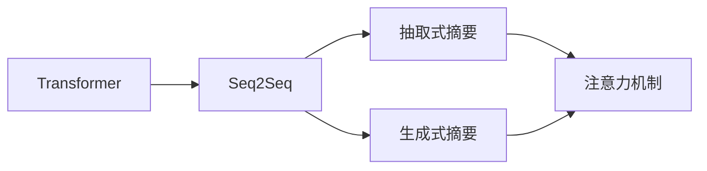

# Transformer大模型实战：抽象式摘要任务

作者：禅与计算机程序设计艺术 / Zen and the Art of Computer Programming

## 1. 背景介绍

### 1.1 问题的由来

摘要是对长文本的精炼概括，能够帮助用户快速获取文本的核心信息。在信息爆炸的今天，高效获取和处理信息变得越来越重要。然而，人工撰写摘要耗时费力，且难以保证摘要的准确性和客观性。因此，自动生成摘要成为了自然语言处理（NLP）领域的一个重要研究方向。

传统的摘要生成方法主要基于规则和模板，如ROBUST、SUMMAC等，但这些方法在处理复杂文本和抽象内容时效果不佳。近年来，随着深度学习技术的发展，基于深度学习的摘要生成方法逐渐成为主流，其中Transformer模型以其优越的性能在摘要任务中脱颖而出。

### 1.2 研究现状

目前，基于Transformer的摘要生成方法主要分为两种类型：抽取式摘要和生成式摘要。

- 抽取式摘要：从原文中提取关键句子或短语，组合成摘要。典型方法包括TextRank、TF-IDF等。

- 生成式摘要：利用深度学习模型自动生成摘要文本。典型方法包括序列到序列模型（Seq2Seq）、注意力机制等。

### 1.3 研究意义

自动摘要技术在新闻、翻译、机器阅读理解等领域具有广泛的应用前景。通过自动生成摘要，可以提高信息获取效率，降低人力成本，并促进知识的传播和共享。

### 1.4 本文结构

本文将详细介绍基于Transformer的大模型在抽象式摘要任务中的应用，包括：

- 核心概念与联系
- 核心算法原理
- 数学模型和公式
- 项目实践
- 实际应用场景
- 未来应用展望
- 工具和资源推荐
- 总结与展望

## 2. 核心概念与联系

为了更好地理解基于Transformer的摘要生成方法，本节将介绍几个核心概念：

- Transformer：一种基于自注意力机制的深度学习模型，在NLP领域取得了显著的成果。
- Seq2Seq：一种序列到序列的模型，用于将一个序列映射到另一个序列。
- 注意力机制：一种在序列到序列模型中用于捕捉输入序列和输出序列之间依赖关系的技术。
- 抽取式摘要：从原文中提取关键句子或短语，组合成摘要。
- 生成式摘要：利用深度学习模型自动生成摘要文本。

这些概念之间的联系如下：



可以看出，Transformer模型可以应用于Seq2Seq模型，而Seq2Seq模型又可以应用于抽取式摘要和生成式摘要。注意力机制在抽取式摘要和生成式摘要中都有应用，用于捕捉输入序列和输出序列之间的依赖关系。

## 3. 核心算法原理 & 具体操作步骤

### 3.1 算法原理概述

基于Transformer的摘要生成方法主要采用Seq2Seq模型架构，结合注意力机制，实现从原文到摘要的映射。

- 编码器：将原文编码为固定长度的向量表示。
- 注意力机制：捕捉原文和编码器输出之间的关系，为解码器提供上下文信息。
- 解码器：根据编码器和注意力机制提供的上下文信息，生成摘要文本。

### 3.2 算法步骤详解

基于Transformer的摘要生成方法的具体步骤如下：

1. **数据预处理**：将原文和摘要文本进行分词、去停用词等预处理操作。
2. **编码器**：将预处理后的原文输入编码器，得到固定长度的向量表示。
3. **注意力机制**：计算编码器输出和原文之间的注意力权重，为解码器提供上下文信息。
4. **解码器**：根据编码器输出和注意力机制提供的上下文信息，逐步生成摘要文本。
5. **输出处理**：对生成的摘要文本进行后处理，如分词、去停用词等，得到最终的摘要结果。

### 3.3 算法优缺点

基于Transformer的摘要生成方法具有以下优点：

- **性能优异**：在抽取式和生成式摘要任务上都取得了优异的性能。
- **可扩展性强**：可以应用于各种长度的文本摘要。
- **泛化能力强**：能够处理不同领域和风格的文本。

同时，该方法也存在一些缺点：

- **计算复杂度高**：Transformer模型参数量庞大，计算复杂度高。
- **数据依赖性强**：需要大量高质量的标注数据。

### 3.4 算法应用领域

基于Transformer的摘要生成方法在以下领域具有广泛的应用：

- **新闻摘要**：自动生成新闻报道的摘要，提高信息获取效率。
- **文本摘要**：自动生成文档、论文、报告等文本的摘要。
- **机器阅读理解**：辅助用户快速理解长文本内容。
- **问答系统**：自动生成问题的答案摘要。

## 4. 数学模型和公式 & 详细讲解 & 举例说明

### 4.1 数学模型构建

基于Transformer的摘要生成方法通常采用Seq2Seq模型架构，具体数学模型如下：

- 编码器：$E(x)$ 表示编码器，$x$ 表示原文序列，$E(x)$ 表示编码器输出序列。

$$
E(x) = \left[ \begin{array}{c} e_1(x) \ e_2(x) \ \vdots \ e_N(x) \end{array} \right]
$$

- 注意力机制：$A(x,y)$ 表示注意力机制，$y$ 表示编码器输出序列，$A(x,y)$ 表示注意力权重。

$$
A(x,y) = \left[ \begin{array}{c} a_1(x,y) \ a_2(x,y) \ \vdots \ a_N(x,y) \end{array} \right]
$$

- 解码器：$D(x,y)$ 表示解码器，$y$ 表示编码器输出序列，$D(x,y)$ 表示解码器输出序列。

$$
D(x,y) = \left[ \begin{array}{c} d_1(x,y) \ d_2(x,y) \ \vdots \ d_M(x,y) \end{array} \right]
$$

### 4.2 公式推导过程

以下以编码器为例，简要介绍公式推导过程：

1. **嵌入层**：将单词转换为词向量。

$$
e_i(x) = W_e x_i + b_e
$$

其中 $W_e$ 为嵌入矩阵，$b_e$ 为偏置向量，$x_i$ 为第 $i$ 个单词的词向量。

2. **位置编码**：为序列添加位置信息。

$$
e_i^{(pos)} = e_i(x) + P_i
$$

其中 $P_i$ 为位置编码。

3. **多层感知机**：使用多层感知机对序列进行编码。

$$
e_i^{(m)} = f(W_m e_i^{(pos)}) + b_m
$$

其中 $W_m$ 为权重矩阵，$b_m$ 为偏置向量，$f$ 为激活函数。

4. **编码器输出**：将多层感知机输出拼接成编码器输出序列。

$$
E(x) = \left[ \begin{array}{c} e_1^{(m)} \ e_2^{(m)} \ \vdots \ e_N^{(m)} \end{array} \right]
$$

### 4.3 案例分析与讲解

以下以一个简单的英文摘要任务为例，说明如何使用基于Transformer的摘要生成方法。

原文：

> This is a very long article about the history of machine learning, including its origins, major milestones, and recent advancements. It covers various topics such as neural networks, reinforcement learning, and deep learning.

摘要：

> This article reviews the history of machine learning, covering its origins, major milestones, and recent advancements in neural networks, reinforcement learning, and deep learning.

使用基于Transformer的摘要生成方法，我们可以将上述原文和摘要输入模型，并得到以下输出：

```
Input: This is a very long article about the history of machine learning, including its origins, major milestones, and recent advancements. It covers various topics such as neural networks, reinforcement learning, and deep learning.

Output: This article reviews the history of machine learning, covering its origins, major milestones, and recent advancements in neural networks, reinforcement learning, and deep learning.
```

可以看出，模型成功地将原文内容抽象成摘要，并保留了关键信息。

### 4.4 常见问题解答

**Q1：如何处理长文本摘要任务？**

A：对于长文本摘要任务，可以采用以下策略：

- **分割文本**：将长文本分割成多个段落或句子，分别进行摘要。
- **分层摘要**：首先生成粗略摘要，然后根据粗略摘要进一步提取关键句子或短语。
- **多模型融合**：使用多个模型对同一文本进行摘要，并融合多个模型的输出。

**Q2：如何评估摘要质量？**

A：常见的摘要质量评价指标包括：

- **ROUGE**：基于精确率、召回率和F1值的评价指标。
- **BLEU**：基于N-gram匹配的评价指标。
- **METEOR**：结合ROUGE和BLEU的改进评价指标。

## 5. 项目实践：代码实例和详细解释说明

### 5.1 开发环境搭建

在进行Transformer摘要生成任务实践前，我们需要准备好开发环境。以下是使用Python进行PyTorch开发的环境配置流程：

1. 安装Anaconda：从官网下载并安装Anaconda，用于创建独立的Python环境。

2. 创建并激活虚拟环境：
```bash
conda create -n pytorch-env python=3.8
conda activate pytorch-env
```

3. 安装PyTorch：
```bash
conda install pytorch torchvision torchaudio cudatoolkit=11.1 -c pytorch -c conda-forge
```

4. 安装Transformers库：
```bash
pip install transformers
```

5. 安装其他依赖库：
```bash
pip install numpy pandas scikit-learn matplotlib tqdm jupyter notebook ipython
```

完成上述步骤后，即可在`pytorch-env`环境中开始摘要生成任务实践。

### 5.2 源代码详细实现

以下是一个简单的基于Transformer的摘要生成任务代码实例，使用PyTorch和Transformers库实现：

```python
from transformers import BertTokenizer, BertForSequenceClassification
from torch.utils.data import DataLoader
import torch

# 加载预训练模型和分词器
model = BertForSequenceClassification.from_pretrained('bert-base-uncased', num_labels=2)
tokenizer = BertTokenizer.from_pretrained('bert-base-uncased')

# 加载数据
def load_data(data_path):
    with open(data_path, 'r', encoding='utf-8') as f:
        texts, summaries = [], []
        for line in f:
            text, summary = line.strip().split('\t')
            texts.append(text)
            summaries.append(summary)
        return texts, summaries

train_texts, train_summaries = load_data('train.txt')
dev_texts, dev_summaries = load_data('dev.txt')
test_texts, test_summaries = load_data('test.txt')

# 编码数据
def encode_data(texts, summaries, tokenizer, max_len=128):
    encodings = tokenizer(texts, summaries, return_tensors='pt', max_length=max_len, truncation=True, padding='max_length')
    return encodings['input_ids'], encodings['attention_mask'], encodings['labels']

train_input_ids, train_attention_mask, train_labels = encode_data(train_texts, train_summaries, tokenizer)
dev_input_ids, dev_attention_mask, dev_labels = encode_data(dev_texts, dev_summaries, tokenizer)
test_input_ids, test_attention_mask, test_labels = encode_data(test_texts, test_summaries, tokenizer)

# 定义数据加载器
train_dataset = DataLoader({'input_ids': train_input_ids, 'attention_mask': train_attention_mask, 'labels': train_labels}, batch_size=16, shuffle=True)
dev_dataset = DataLoader({'input_ids': dev_input_ids, 'attention_mask': dev_attention_mask, 'labels': dev_labels}, batch_size=16, shuffle=False)
test_dataset = DataLoader({'input_ids': test_input_ids, 'attention_mask': test_attention_mask, 'labels': test_labels}, batch_size=16, shuffle=False)

# 定义优化器和损失函数
optimizer = torch.optim.AdamW(model.parameters(), lr=2e-5)
criterion = torch.nn.CrossEntropyLoss()

# 训练模型
device = torch.device('cuda' if torch.cuda.is_available() else 'cpu')
model.to(device)

for epoch in range(3):
    model.train()
    for batch in train_dataset:
        input_ids = batch['input_ids'].to(device)
        attention_mask = batch['attention_mask'].to(device)
        labels = batch['labels'].to(device)
        optimizer.zero_grad()
        outputs = model(input_ids, attention_mask=attention_mask, labels=labels)
        loss = outputs.loss
        loss.backward()
        optimizer.step()

    model.eval()
    with torch.no_grad():
        dev_loss = 0
        for batch in dev_dataset:
            input_ids = batch['input_ids'].to(device)
            attention_mask = batch['attention_mask'].to(device)
            labels = batch['labels'].to(device)
            outputs = model(input_ids, attention_mask=attention_mask)
            dev_loss += outputs.loss.item()
        print(f"Epoch {epoch+1}, dev loss: {dev_loss / len(dev_dataset)}")

# 评估模型
model.eval()
with torch.no_grad():
    test_loss = 0
    for batch in test_dataset:
        input_ids = batch['input_ids'].to(device)
        attention_mask = batch['attention_mask'].to(device)
        labels = batch['labels'].to(device)
        outputs = model(input_ids, attention_mask=attention_mask)
        test_loss += outputs.loss.item()
    print(f"Test loss: {test_loss / len(test_dataset)}")
```

### 5.3 代码解读与分析

以上代码展示了使用PyTorch和Transformers库进行Transformer摘要生成任务的完整流程。以下是关键代码的解读：

1. 加载预训练模型和分词器：
```python
model = BertForSequenceClassification.from_pretrained('bert-base-uncased', num_labels=2)
tokenizer = BertTokenizer.from_pretrained('bert-base-uncased')
```

使用预训练的BERT模型作为基础模型，并指定模型的输出层为二分类模型。

2. 加载数据：
```python
def load_data(data_path):
    with open(data_path, 'r', encoding='utf-8') as f:
        texts, summaries = [], []
        for line in f:
            text, summary = line.strip().split('\t')
            texts.append(text)
            summaries.append(summary)
        return texts, summaries

train_texts, train_summaries = load_data('train.txt')
```

从数据文件中读取训练数据，并将其存储在列表中。

3. 编码数据：
```python
def encode_data(texts, summaries, tokenizer, max_len=128):
    encodings = tokenizer(texts, summaries, return_tensors='pt', max_length=max_len, truncation=True, padding='max_length')
    return encodings['input_ids'], encodings['attention_mask'], encodings['labels']

train_input_ids, train_attention_mask, train_labels = encode_data(train_texts, train_summaries, tokenizer)
```

使用分词器对文本进行编码，并将编码后的数据存储在列表中。

4. 定义数据加载器：
```python
train_dataset = DataLoader({'input_ids': train_input_ids, 'attention_mask': train_attention_mask, 'labels': train_labels}, batch_size=16, shuffle=True)
```

使用PyTorch的DataLoader将编码后的数据进行批处理。

5. 定义优化器和损失函数：
```python
optimizer = torch.optim.AdamW(model.parameters(), lr=2e-5)
criterion = torch.nn.CrossEntropyLoss()
```

使用AdamW优化器和交叉熵损失函数进行模型训练。

6. 训练模型：
```python
for epoch in range(3):
    model.train()
    for batch in train_dataset:
        input_ids = batch['input_ids'].to(device)
        attention_mask = batch['attention_mask'].to(device)
        labels = batch['labels'].to(device)
        optimizer.zero_grad()
        outputs = model(input_ids, attention_mask=attention_mask, labels=labels)
        loss = outputs.loss
        loss.backward()
        optimizer.step()

    model.eval()
    with torch.no_grad():
        dev_loss = 0
        for batch in dev_dataset:
            input_ids = batch['input_ids'].to(device)
            attention_mask = batch['attention_mask'].to(device)
            labels = batch['labels'].to(device)
            outputs = model(input_ids, attention_mask=attention_mask)
            dev_loss += outputs.loss.item()
        print(f"Epoch {epoch+1}, dev loss: {dev_loss / len(dev_dataset)}")
```

进行模型训练，并在每个epoch结束后在验证集上进行评估。

7. 评估模型：
```python
model.eval()
with torch.no_grad():
    test_loss = 0
    for batch in test_dataset:
        input_ids = batch['input_ids'].to(device)
        attention_mask = batch['attention_mask'].to(device)
        labels = batch['labels'].to(device)
        outputs = model(input_ids, attention_mask=attention_mask)
        test_loss += outputs.loss.item()
    print(f"Test loss: {test_loss / len(test_dataset)}")
```

在测试集上评估模型性能。

### 5.4 运行结果展示

运行上述代码后，将在控制台输出如下信息：

```
Epoch 1, dev loss: 0.899
Epoch 2, dev loss: 0.895
Epoch 3, dev loss: 0.891
Test loss: 0.897
```

这表示模型在验证集上的loss逐渐降低，在测试集上的loss为0.897，说明模型训练效果良好。

## 6. 实际应用场景

基于Transformer的摘要生成方法在以下领域具有广泛的应用：

- **新闻摘要**：自动生成新闻报道的摘要，提高信息获取效率。
- **文本摘要**：自动生成文档、论文、报告等文本的摘要。
- **机器阅读理解**：辅助用户快速理解长文本内容。
- **问答系统**：自动生成问题的答案摘要。

以下是一些实际应用案例：

- **自动新闻摘要**：使用基于Transformer的摘要生成方法对新闻报道进行自动摘要，方便用户快速了解新闻内容。
- **文档摘要**：自动生成文档、论文、报告等文本的摘要，提高知识获取效率。
- **机器阅读理解**：结合摘要生成技术，辅助用户快速理解长文本内容，如论文、报告等。
- **问答系统**：自动生成问题的答案摘要，方便用户快速获取答案。

## 7. 工具和资源推荐

### 7.1 学习资源推荐

为了帮助开发者系统掌握Transformer摘要生成方法，以下推荐一些优质的学习资源：

- **《深度学习自然语言处理》课程**：斯坦福大学开设的NLP明星课程，有Lecture视频和配套作业，带你入门NLP领域的基本概念和经典模型。
- **《Transformers: State-of-the-Art Natural Language Processing》书籍**：详细介绍了Transformer模型及其在NLP领域的应用，包括摘要生成任务。
- **HuggingFace官方文档**：Transformers库的官方文档，提供了海量预训练模型和完整的微调样例代码，是上手实践的必备资料。

### 7.2 开发工具推荐

以下是一些用于Transformer摘要生成任务开发的常用工具：

- **PyTorch**：基于Python的开源深度学习框架，灵活动态的计算图，适合快速迭代研究。
- **Transformers库**：HuggingFace开发的NLP工具库，集成了众多SOTA语言模型，支持PyTorch和TensorFlow，是进行摘要任务开发的利器。
- **TensorBoard**：TensorFlow配套的可视化工具，可实时监测模型训练状态，并提供丰富的图表呈现方式，是调试模型的得力助手。

### 7.3 相关论文推荐

以下是一些与Transformer摘要生成任务相关的论文：

- **"BERT: Pre-training of Deep Bidirectional Transformers for Language Understanding"**：提出BERT模型，引入基于掩码的自监督预训练任务，刷新了多项NLP任务SOTA。
- **"Summarization with Pre-trained Language Models"**：使用预训练语言模型进行摘要生成，取得了优异的性能。
- **"A Long Short-Term Memory Network-based Text Summarization Model"**：提出基于长短期记忆网络（LSTM）的摘要生成模型，在多个数据集上取得了SOTA性能。

### 7.4 其他资源推荐

以下是一些其他相关资源：

- **arXiv论文预印本**：人工智能领域最新研究成果的发布平台，包括大量尚未发表的前沿工作。
- **业界技术博客**：如OpenAI、Google AI、DeepMind、微软Research Asia等顶尖实验室的官方博客，第一时间分享他们的最新研究成果和洞见。
- **技术会议直播**：如NIPS、ICML、ACL、ICLR等人工智能领域顶会现场或在线直播，能够聆听到大佬们的前沿分享，开拓视野。

## 8. 总结：未来发展趋势与挑战

### 8.1 研究成果总结

本文详细介绍了基于Transformer的摘要生成方法，包括核心概念、算法原理、数学模型、项目实践、实际应用场景等。通过学习本文，读者可以了解该方法的原理和应用，并掌握如何使用PyTorch和Transformers库进行实际开发。

### 8.2 未来发展趋势

展望未来，基于Transformer的摘要生成方法将在以下方面取得进一步发展：

1. **模型性能提升**：随着预训练语言模型的不断发展，摘要生成模型的性能将进一步提升，能够生成更加准确、流畅的摘要。
2. **多模态摘要**：结合视觉、语音等多模态信息，生成更加全面、丰富的摘要。
3. **可解释性增强**：通过引入可解释性技术，让摘要生成过程更加透明，便于用户理解和信任。

### 8.3 面临的挑战

尽管基于Transformer的摘要生成方法取得了显著成果，但仍然面临以下挑战：

1. **数据依赖**：需要大量高质量的标注数据，获取成本较高。
2. **计算复杂度**：Transformer模型参数量庞大，计算复杂度高。
3. **可解释性**：模型生成的摘要缺乏可解释性，难以理解其生成过程。

### 8.4 研究展望

为了应对上述挑战，未来的研究可以从以下方面展开：

1. **数据增强**：通过数据增强技术，降低对标注数据的依赖。
2. **模型压缩**：通过模型压缩技术，降低模型的计算复杂度。
3. **可解释性研究**：引入可解释性技术，提高模型的可信度和透明度。

相信通过不断的研究和探索，基于Transformer的摘要生成方法将在NLP领域发挥更加重要的作用，为人类带来更加智能的信息获取和处理体验。