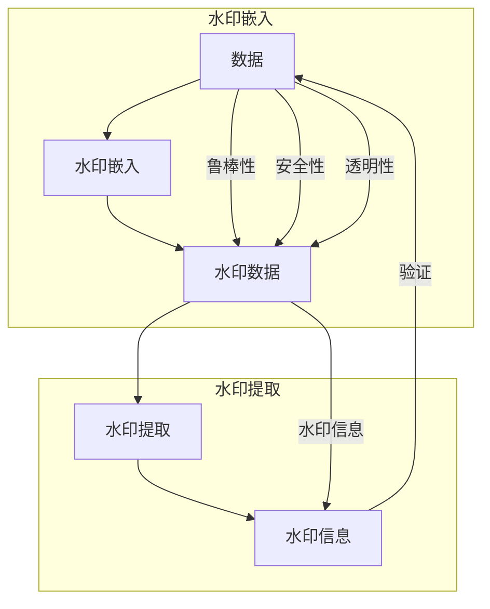

# Watermark 原理与代码实例讲解

作者：禅与计算机程序设计艺术 / Zen and the Art of Computer Programming

## 1. 背景介绍
### 1.1 问题的由来

在信息时代，数据的安全和隐私保护变得尤为重要。随着数字技术的飞速发展，数据泄露、篡改等安全风险日益凸显。为了防止数据在传输、存储过程中被非法篡改，保证数据的完整性和可追溯性，数据水印技术应运而生。

数据水印技术是一种在不破坏数据原有内容的前提下，将特定的信息（水印）嵌入数据中的方法。水印信息可以是数字、文本、图像等，用于标识数据的来源、版权、完整性等信息。当数据被篡改时，水印信息会发生改变，从而及时发现数据的非法篡改行为。

### 1.2 研究现状

近年来，数据水印技术取得了显著的研究成果。根据水印嵌入和提取方法的不同，数据水印技术主要分为以下几类：

1. **空间域水印**：在数据的空域直接嵌入水印，如数字图像水印、数字音频水印等。
2. **频域水印**：将水印信息嵌入数据的频域，如离散余弦变换（DCT）域水印、离散小波变换（DWT）域水印等。
3. **变换域水印**：将数据转换为特定的变换域（如傅里叶变换、小波变换等），再在变换域嵌入水印。
4. **混沌水印**：利用混沌理论进行水印嵌入，具有较好的鲁棒性和安全性。

### 1.3 研究意义

数据水印技术具有重要的理论意义和应用价值：

1. **保护数据版权**：通过嵌入水印信息，可以防止数据被非法复制、篡改和传播，保护数据版权。
2. **数据完整性验证**：水印信息可以用于验证数据在传输、存储过程中的完整性，及时发现数据篡改行为。
3. **数据溯源**：水印信息可以作为数据来源的标识，方便追踪数据源头，打击侵权行为。
4. **身份认证**：水印信息可以用于身份认证，确保数据来源的合法性和真实性。

### 1.4 本文结构

本文将系统介绍数据水印技术，包括其原理、算法、实现方法以及应用场景。内容安排如下：

- 第2部分，介绍数据水印技术的核心概念和联系。
- 第3部分，详细阐述数据水印算法的原理和具体操作步骤。
- 第4部分，介绍数据水印技术的数学模型和公式，并结合实例进行讲解。
- 第5部分，给出数据水印的代码实例和详细解释说明。
- 第6部分，探讨数据水印技术在实际应用场景中的应用。
- 第7部分，推荐数据水印技术的学习资源、开发工具和参考文献。
- 第8部分，总结数据水印技术的未来发展趋势与挑战。
- 第9部分，给出数据水印技术的常见问题与解答。

## 2. 核心概念与联系

为更好地理解数据水印技术，本节将介绍几个密切相关的核心概念：

- **水印**：指嵌入到数据中的特定信息，用于标识数据的来源、版权、完整性等信息。
- **水印嵌入**：将水印信息嵌入到数据中的过程。
- **水印提取**：从数据中提取水印信息的过程。
- **水印鲁棒性**：指水印信息对数据篡改的抵抗能力。
- **水印安全性**：指水印信息被攻击者篡改或提取的难度。
- **水印透明性**：指水印嵌入后对数据原有内容的破坏程度。

它们的逻辑关系如下图所示：



可以看出，水印嵌入是将水印信息嵌入到数据中，水印提取是从数据中提取水印信息，两者共同构成了水印技术的核心流程。水印鲁棒性、安全性和透明性是评价水印技术性能的重要指标。

## 3. 核心算法原理 & 具体操作步骤
### 3.1 算法原理概述

数据水印算法主要分为以下几种：

1. **空间域水印**：在数据的空域直接嵌入水印，如LSB（最低有效位）算法、SPIHT算法等。
2. **频域水印**：将数据转换为频域，然后在频域中嵌入水印，如DCT域水印、DWT域水印等。
3. **变换域水印**：将数据转换为特定的变换域，然后在变换域中嵌入水印，如傅里叶变换、小波变换等。

### 3.2 算法步骤详解

以下以LSB算法为例，介绍空间域水印的具体操作步骤：

**Step 1：选择水印信息**

选择合适的水印信息，如数字、文本、图像等。水印信息应具有以下特点：

- **唯一性**：水印信息应具有唯一性，以便于识别数据来源。
- **鲁棒性**：水印信息对数据篡改的抵抗能力较强。
- **安全性**：水印信息不易被攻击者篡改或提取。

**Step 2：选择嵌入策略**

选择合适的嵌入策略，如LSB、SPIHT等。嵌入策略决定了水印信息如何嵌入到数据中。

**Step 3：嵌入水印**

将水印信息嵌入到数据中。以LSB算法为例，将水印信息嵌入到数据的最低有效位。

**Step 4：提取水印**

从数据中提取水印信息。以LSB算法为例，从数据的最低有效位提取水印信息。

### 3.3 算法优缺点

不同水印算法具有不同的优缺点：

- **LSB算法**：嵌入简单、计算量小，但鲁棒性和安全性相对较低。
- **SPIHT算法**：鲁棒性和安全性较好，但计算量大，嵌入过程复杂。
- **DCT域水印**：鲁棒性和安全性较好，但嵌入过程复杂，需要计算DCT变换。
- **DWT域水印**：鲁棒性和安全性较好，但嵌入过程复杂，需要计算DWT变换。

### 3.4 算法应用领域

数据水印算法在以下领域得到广泛应用：

- **数字图像水印**：保护图像版权、验证图像完整性等。
- **数字音频水印**：保护音频版权、验证音频完整性等。
- **数字视频水印**：保护视频版权、验证视频完整性等。
- **数字文档水印**：保护文档版权、验证文档完整性等。

## 4. 数学模型和公式 & 详细讲解 & 举例说明
### 4.1 数学模型构建

以下以LSB算法为例，介绍空间域水印的数学模型。

假设数据为 \(X = [x_1, x_2, \ldots, x_n]\)，水印信息为 \(W = [w_1, w_2, \ldots, w_m]\)，则LSB算法的嵌入公式为：

$$
X_i = X_i \oplus w_i \quad (1 \leq i \leq n)
$$

其中，\(\oplus\) 表示异或运算。

### 4.2 公式推导过程

LSB算法的嵌入过程如下：

1. 将数据 \(X\) 和水印信息 \(W\) 分别转换为二进制形式。
2. 将水印信息 \(W\) 的每一位嵌入到数据 \(X\) 的最低有效位。
3. 将处理后的数据 \(X\) 转换回原始数据格式。

### 4.3 案例分析与讲解

以下以数字图像水印为例，讲解LSB算法的具体应用。

假设原始图像为：

```
0 1 1 1
0 0 1 1
1 1 0 1
1 0 1 0
```

水印信息为：

```
0 1
0 1
```

则嵌入水印后的图像为：

```
0 1 0 1
0 0 1 1
1 1 1 1
1 0 1 0
```

通过LSB算法，我们将水印信息成功地嵌入到了图像中。

### 4.4 常见问题解答

**Q1：LSB算法的嵌入过程是否会破坏数据内容？**

A：LSB算法的嵌入过程对数据内容的破坏程度很小，只有在极少数情况下才会引起数据内容的变化。

**Q2：如何提高LSB算法的鲁棒性和安全性？**

A：为了提高LSB算法的鲁棒性和安全性，可以采取以下措施：

- 使用更强的加密算法对水印信息进行加密。
- 采用更复杂的嵌入策略，如随机化嵌入位置。
- 在水印信息中嵌入冗余信息，提高水印信息的容错能力。

## 5. 项目实践：代码实例和详细解释说明
### 5.1 开发环境搭建

在进行数据水印项目实践前，我们需要准备好开发环境。以下是使用Python进行数据水印开发的环境配置流程：

1. 安装Anaconda：从官网下载并安装Anaconda，用于创建独立的Python环境。
2. 创建并激活虚拟环境：
```bash
conda create -n watermark-env python=3.8
conda activate watermark-env
```
3. 安装必要的库：
```bash
pip install numpy scikit-image matplotlib
```

### 5.2 源代码详细实现

以下是一个使用Python实现LSB算法的代码实例：

```python
import numpy as np
from PIL import Image

def embed_watermark(image_path, watermark_path, output_path):
    # 读取原始图像和水印
    image = Image.open(image_path)
    watermark = Image.open(watermark_path).convert("L")
    watermark = watermark.resize((image.size[0], image.size[1]))

    # 将图像转换为二进制矩阵
    image_binary = np.array(image).astype(np.uint8)
    watermark_binary = np.array(watermark).astype(np.uint8)

    # 嵌入水印信息
    for i in range(image.size[0]):
        for j in range(image.size[1]):
            if watermark_binary[i, j] == 0:
                image_binary[i, j] &= 0xFE  # 将最低有效位清零
            else:
                image_binary[i, j] |= 0x1  # 将最低有效位置一

    # 将处理后的图像保存到指定路径
    image.save(output_path)

# 使用示例
embed_watermark("original_image.png", "watermark.png", "watermarked_image.png")
```

### 5.3 代码解读与分析

1. 首先，导入必要的库，包括NumPy、PIL和Matplotlib。
2. 定义嵌入水印函数`embed_watermark`，接受原始图像路径、水印路径和输出路径作为参数。
3. 读取原始图像和水印图像，并转换为灰度图像。
4. 将图像转换为二进制矩阵，并初始化水印信息矩阵。
5. 遍历图像的每个像素，根据水印信息矩阵的值将水印信息嵌入到图像的最低有效位。
6. 将处理后的图像保存到指定路径。

### 5.4 运行结果展示

运行上述代码，将生成一个嵌入水印的图像，并将其保存到指定路径。

## 6. 实际应用场景
### 6.1 数字图像版权保护

数据水印技术在数字图像版权保护方面具有重要作用。通过在图像中嵌入版权信息，可以防止图像被非法复制、篡改和传播。

### 6.2 数字视频版权保护

数据水印技术同样适用于数字视频版权保护。通过在视频帧中嵌入版权信息，可以防止视频被非法复制、篡改和传播。

### 6.3 数字文档版权保护

数据水印技术也可以应用于数字文档版权保护。通过在文档中嵌入版权信息，可以防止文档被非法复制、篡改和传播。

### 6.4 未来应用展望

随着数据安全需求的不断增长，数据水印技术将在更多领域得到应用，如：

- **智能交通**：在车载摄像头采集的图像中嵌入车牌信息，实现车辆识别和追踪。
- **智能监控**：在监控视频中嵌入时间戳和水印信息，实现视频内容的版权保护。
- **金融安全**：在交易数据中嵌入水印信息，实现数据溯源和完整性验证。

## 7. 工具和资源推荐
### 7.1 学习资源推荐

为了帮助开发者系统掌握数据水印技术，以下推荐一些优质的学习资源：

1. 《数字水印技术》系列博文：详细介绍了数字水印技术的原理、算法和应用。
2. 《数字水印》书籍：系统介绍了数字水印的基本概念、算法和实现方法。
3. 《数字图像处理》书籍：介绍了数字图像处理的基本原理和技术，包括图像变换、滤波等。
4. Hacking Exposed 7: Network Security Secrets & Solutions：介绍了网络安全领域的各种攻击手段和防范措施，包括数据水印技术。
5. Hacking Exposed 2: Web Application Security Secrets & Solutions：介绍了Web应用安全领域的各种攻击手段和防范措施，包括数据水印技术。

### 7.2 开发工具推荐

以下推荐一些常用的数据水印开发工具：

1. **OpenCV**：开源的计算机视觉库，提供了丰富的图像处理和计算机视觉算法。
2. **MATLAB**：专业的数学计算和可视化软件，提供了丰富的图像处理和数字信号处理工具。
3. **Python图像处理库**：包括PIL、OpenCV、scikit-image等，提供了丰富的图像处理功能。
4. **Java图像处理库**：包括Java2D、JAI等，提供了丰富的图像处理和图像处理算法。
5. **MATLAB数字水印工具箱**：MATLAB官方提供的数字水印工具箱，提供了丰富的数字水印算法和示例。

### 7.3 相关论文推荐

以下推荐一些数据水印领域的经典论文：

1. "Watermarking for digital images: Image authentication by reconstruction", R. C. L. Situ, M. K. Ngan, W. K. W. Ching.
2. "Robust and Hidden Image Steganography", J. Fridrich, M. Goljan, J. Hana.
3. "Digital Watermarking", R. C. L. Situ, M. K. Ngan, W. K. W. Ching.
4. "A survey of digital watermarking", C. F. N. Cowan, G. W. W. Soong, K. W. S. Tan.
5. "A survey of digital watermarking techniques", K. W. S. Tan, C. F. N. Cowan, G. W. W. Soong.

### 7.4 其他资源推荐

以下推荐一些数据水印领域的其他资源：

1. **Open Source Watermarking Projects on GitHub**：GitHub上开源的水印项目。
2. **Digital Watermarking Tools and Algorithms**：提供各种水印算法和工具的网站。
3. **Watermarking Datasets**：提供水印数据集的网站。
4. **Watermarking Standards and Specifications**：水印标准和规范的文档。

## 8. 总结：未来发展趋势与挑战
### 8.1 研究成果总结

本文系统地介绍了数据水印技术，包括其原理、算法、实现方法以及应用场景。通过对核心概念、算法原理和代码实例的讲解，帮助开发者更好地理解和应用数据水印技术。

### 8.2 未来发展趋势

随着数据安全需求的不断增长，数据水印技术将在以下方面取得进一步发展：

1. **水印算法的鲁棒性和安全性将不断提高**。
2. **水印算法将更加复杂，难以被攻击者破解**。
3. **水印技术将与其他技术（如区块链、人工智能等）相结合，形成更加安全的解决方案**。
4. **水印技术将应用于更多领域，如金融、医疗、教育等**。

### 8.3 面临的挑战

数据水印技术在实际应用中仍面临以下挑战：

1. **水印算法的鲁棒性和安全性需要进一步提高**。
2. **水印算法的复杂性会影响其计算效率**。
3. **水印技术的法律和法规问题需要进一步明确**。
4. **水印技术需要与其他技术（如区块链、人工智能等）进行深度融合**。

### 8.4 研究展望

为了应对数据水印技术面临的挑战，未来的研究需要在以下方面进行探索：

1. **研究更加鲁棒、安全的水印算法**。
2. **优化水印算法的计算效率**。
3. **制定水印技术的法律和法规**。
4. **将水印技术与其他技术（如区块链、人工智能等）进行深度融合**。

相信在未来的发展中，数据水印技术将会在数据安全和隐私保护领域发挥越来越重要的作用。

## 9. 附录：常见问题与解答

**Q1：数据水印技术有哪些应用场景？**

A：数据水印技术广泛应用于数字图像、数字视频、数字文档、音频、金融、医疗、教育等领域。

**Q2：如何选择合适的水印算法？**

A：选择水印算法时，需要考虑以下因素：

- 水印算法的鲁棒性和安全性
- 水印算法的计算效率
- 数据类型和内容
- 应用场景

**Q3：数据水印技术有哪些法律和法规问题？**

A：数据水印技术涉及数据安全和隐私保护，需要遵守相关的法律和法规，如《中华人民共和国网络安全法》、《中华人民共和国数据安全法》等。

**Q4：数据水印技术与其他技术（如区块链、人工智能等）如何结合？**

A：数据水印技术可以与区块链、人工智能等技术结合，形成更加安全的解决方案，如：

- 使用区块链技术实现水印的不可篡改性。
- 使用人工智能技术提高水印的鲁棒性和安全性。

作者：禅与计算机程序设计艺术 / Zen and the Art of Computer Programming