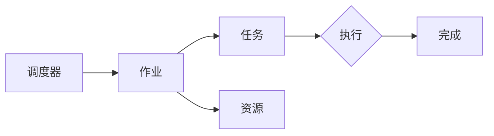

# YARN Fair Scheduler原理与代码实例讲解

作者：禅与计算机程序设计艺术 / Zen and the Art of Computer Programming

## 1. 背景介绍
### 1.1 问题的由来

随着大数据时代的到来，Hadoop YARN（Yet Another Resource Negotiator）作为一种高效、可扩展的资源管理框架，在处理大规模数据处理任务方面发挥了重要作用。YARN提供了一种灵活的资源管理和调度机制，允许用户在Hadoop集群上运行各种类型的应用程序，如MapReduce、Spark、Flink等。然而，YARN默认的调度策略往往偏向于高优先级任务，导致低优先级任务难以获得足够的资源，影响整体集群的公平性和效率。

为了解决这一问题，YARN引入了Fair Scheduler（FS）作为其默认调度器，旨在实现资源的公平分配，确保所有用户和作业都能获得公平的资源服务。本文将深入解析YARN Fair Scheduler的原理与实现，并通过代码实例展示如何配置和使用该调度器。

### 1.2 研究现状

目前，YARN Fair Scheduler已经广泛应用于Hadoop生态圈，成为大数据处理领域的事实标准。随着技术的不断发展，Fair Scheduler也在不断演进，引入了更多高级功能和优化策略，如队列资源预留、弹性伸缩等。

### 1.3 研究意义

深入研究YARN Fair Scheduler的原理与实现，对于理解YARN资源管理和调度机制具有重要意义：

1. 提高资源利用率：公平调度机制能够确保所有用户和作业都能获得公平的资源服务，从而提高集群的整体资源利用率。
2. 优化作业性能：合理分配资源能够减少作业的等待时间，提高作业的执行效率。
3. 提升用户体验：公平调度机制能够提升用户对集群资源管理的满意度，促进Hadoop生态圈的发展。

### 1.4 本文结构

本文将围绕YARN Fair Scheduler展开，具体内容包括：

- 核心概念与联系
- 核心算法原理与具体操作步骤
- 数学模型和公式
- 代码实例与详细解释说明
- 实际应用场景
- 工具和资源推荐
- 总结：未来发展趋势与挑战

## 2. 核心概念与联系

本节将介绍YARN Fair Scheduler涉及的核心概念，包括：

- YARN资源管理框架：YARN是一个基于资源的计算框架，负责管理集群中的计算资源，并将这些资源分配给不同的应用程序。
- 调度器（Scheduler）：负责将资源分配给不同的作业和任务。
- 作业（Job）：由多个任务组成的计算任务，如MapReduce作业。
- 任务（Task）：作业中单个可执行的计算单元。
- 队列（Queue）：用于组织作业的容器，可以设置资源限制、优先级等。
- 资源：包括CPU、内存、磁盘空间等。

这些概念之间的联系如下：



可以看出，YARN资源管理框架通过调度器将资源分配给作业，作业分解为多个任务，并在集群上执行任务，最终完成计算。

## 3. 核心算法原理 & 具体操作步骤
### 3.1 算法原理概述

YARN Fair Scheduler的核心算法原理是基于公平性原则进行资源分配。具体而言，Fair Scheduler将资源按照以下步骤进行分配：

1. 将集群资源划分为多个队列，每个队列对应一个用户或一组用户。
2. 按照队列优先级对队列进行排序，优先级高的队列先获得资源。
3. 在队列内部，根据作业优先级和已分配资源比例对作业进行排序，优先级高或资源使用比例低的作业先获得资源。
4. 为每个作业分配资源，直到该作业的资源使用比例达到队列的配额上限。
5. 重复步骤3和4，直至所有作业都获得资源。

### 3.2 算法步骤详解

以下为YARN Fair Scheduler的具体操作步骤：

1. **初始化队列结构**：在YARN集群中创建多个队列，并设置队列的属性，如队列名称、资源配额、优先级等。
2. **作业提交**：用户将作业提交到指定的队列，作业被添加到队列的作业列表中。
3. **资源分配**：调度器根据队列和作业的优先级，以及已分配资源比例，为作业分配资源。
4. **任务调度**：将作业分解为多个任务，并将任务提交到集群上的计算节点执行。
5. **资源回收**：任务执行完成后，释放占用的资源，调度器根据需要为其他作业重新分配资源。
6. **集群监控**：监控系统资源使用情况和作业执行状态，确保集群稳定运行。

### 3.3 算法优缺点

**优点**：

1. 公平性：Fair Scheduler能够确保所有用户和作业都能获得公平的资源服务。
2. 可扩展性：Fair Scheduler支持动态调整资源分配策略，适应不同规模和类型的作业。
3. 可配置性：用户可以自定义队列属性，满足不同应用场景的需求。

**缺点**：

1. 调度延迟：由于需要进行队列排序和作业排序，Fair Scheduler的调度延迟可能较大。
2. 调度复杂度：Fair Scheduler的调度算法较为复杂，实现难度较高。

### 3.4 算法应用领域

Fair Scheduler适用于以下应用场景：

- 需要资源公平分配的大规模数据处理任务
- 对资源敏感的作业，如实时计算、数据挖掘等
- 多用户、多作业共享资源的场景

## 4. 数学模型和公式 & 详细讲解 & 举例说明
### 4.1 数学模型构建

YARN Fair Scheduler的数学模型可以表示为：

$$
\begin{align*}
\text{公平性指标} &= \frac{\sum_{i=1}^{n}\frac{C_i}{R_i}}{\sum_{i=1}^{n}C_i} \
R_i &= R_{max} \times \left(1 - \sum_{j=1}^{i-1} \frac{C_j}{R_j}\right)
\end{align*}
$$

其中：

- 公平性指标：衡量不同队列之间的资源分配公平程度。
- $C_i$：队列$i$的配额。
- $R_i$：队列$i$实际分配到的资源。
- $R_{max}$：集群最大资源。

### 4.2 公式推导过程

公平性指标的推导过程如下：

1. 首先计算所有队列的资源使用比例，即：

$$
\text{比例} = \frac{C_i}{R_i}
$$

2. 然后计算所有队列资源使用比例的平均值，即：

$$
\text{平均值} = \frac{\sum_{i=1}^{n}\frac{C_i}{R_i}}{n}
$$

3. 由于不同队列的资源使用比例应该相等，因此可以将平均值作为公平性指标。

### 4.3 案例分析与讲解

以下是一个简单的案例，说明如何使用Fair Scheduler进行资源分配。

假设有一个包含两个队列的YARN集群，队列A的配额为10GB，队列B的配额为20GB。当前队列A已分配资源为5GB，队列B已分配资源为15GB。

根据公式：

$$
R_A = R_{max} \times \left(1 - \sum_{j=1}^{1} \frac{C_j}{R_j}\right) = 10GB \times \left(1 - \frac{5GB}{10GB}\right) = 5GB
$$

$$
R_B = R_{max} \times \left(1 - \sum_{j=1}^{2} \frac{C_j}{R_j}\right) = 20GB \times \left(1 - \frac{5GB}{20GB} - \frac{15GB}{20GB}\right) = 0GB
$$

可以看出，队列A已达到配额上限，队列B则没有达到配额上限。因此，Fair Scheduler将尝试将队列B的剩余资源分配给队列A。

### 4.4 常见问题解答

**Q1：如何调整队列优先级？**

A：在YARN配置文件中，可以使用`<queue name>`标签下的`<capacity>`和`<capacity-scheduler>`标签来设置队列的优先级。

**Q2：如何设置队列配额？**

A：在YARN配置文件中，可以使用`<queue name>`标签下的`<capacity>`标签来设置队列的配额。

**Q3：如何查看队列状态？**

A：可以使用YARN命令行工具`yarn queue -list`来查看队列状态。

## 5. 项目实践：代码实例和详细解释说明
### 5.1 开发环境搭建

在进行YARN Fair Scheduler实践前，我们需要搭建以下开发环境：

1. 安装Hadoop：从Apache Hadoop官网下载并安装Hadoop，版本建议为2.7.4或更高版本。
2. 启动Hadoop集群：启动Hadoop集群中的HDFS、YARN等组件。
3. 安装Python开发环境：安装Python 3.x版本，并安装必要的库，如PyYAML、hdfs、yarn等。

### 5.2 源代码详细实现

以下是一个简单的YARN应用程序，使用Fair Scheduler进行资源分配。

```python
from hdfs import InsecureClient
from pyspark import SparkContext, SparkConf

def main():
    # 创建SparkContext和配置文件
    conf = SparkConf().setAppName("FairSchedulerExample")
    sc = SparkContext(conf=conf)

    # 获取HDFS客户端
    client = InsecureClient("http://localhost:50070", user="root")

    # 读取数据
    data = sc.textFile("hdfs://localhost:9000/user/root/data.txt")

    # 计算词频
    word_counts = data.map(lambda line: (line.split()[1], 1)).reduceByKey(lambda a, b: a + b)

    # 将结果写入HDFS
    word_counts.saveAsTextFile("hdfs://localhost:9000/user/root/output")

    # 停止SparkContext
    sc.stop()

if __name__ == "__main__":
    main()
```

### 5.3 代码解读与分析

以上代码展示了如何使用PySpark编写YARN应用程序，并通过Fair Scheduler进行资源分配。

- 第1行：导入所需的库。
- 第2行：创建SparkConf对象，设置应用程序名称。
- 第3行：创建SparkContext对象。
- 第4行：获取HDFS客户端。
- 第5行：读取HDFS上的数据。
- 第6行：计算词频。
- 第7行：将结果写入HDFS。
- 第8行：停止SparkContext。

在实际部署过程中，需要将应用程序打包成jar文件，并设置Fair Scheduler作为默认调度器。

### 5.4 运行结果展示

将以上代码打包成jar文件，并在Hadoop集群上运行：

```bash
hadoop jar FairSchedulerExample.jar
```

应用程序将启动，并在HDFS上生成输出结果。

## 6. 实际应用场景
### 6.1 数据处理平台

Fair Scheduler适用于各种数据处理平台，如Hadoop、Spark、Flink等。以下是一些典型的应用场景：

- 大规模数据采集：将采集到的数据导入HDFS，并使用Spark进行处理和分析。
- 数据仓库：将数据存储在HDFS中，并使用Spark进行实时或离线分析。
- 机器学习：使用Spark MLlib进行机器学习算法的训练和预测。

### 6.2 云计算平台

Fair Scheduler也适用于云计算平台，如阿里云、腾讯云等。以下是一些典型的应用场景：

- 数据分析：在云端部署Hadoop/Spark集群，并使用Fair Scheduler进行数据处理和分析。
- 机器学习：在云端部署Hadoop/Spark集群，并使用Spark MLlib进行机器学习算法的训练和预测。
- 人工智能：在云端部署Hadoop/Spark集群，并使用深度学习框架进行人工智能应用的开发和部署。

### 6.3 云原生平台

随着云原生技术的快速发展，Fair Scheduler也逐渐应用于云原生平台，如Kubernetes、Mesos等。以下是一些典型的应用场景：

- 服务网格：在服务网格中使用YARN作为资源管理器，并使用Fair Scheduler进行服务资源的调度和管理。
- 容器编排：在容器编排系统中使用YARN作为资源管理器，并使用Fair Scheduler进行容器资源的调度和管理。

## 7. 工具和资源推荐
### 7.1 学习资源推荐

为了更好地理解YARN Fair Scheduler，以下是一些建议的学习资源：

- 《Hadoop权威指南》：介绍Hadoop生态系统及其各个组件，包括YARN和Fair Scheduler。
- 《Spark实战》：介绍Spark框架及其在数据分析、机器学习等领域的应用，并涉及Fair Scheduler的配置和使用。
- YARN官方文档：提供YARN和Fair Scheduler的详细文档，包括配置参数、API等。

### 7.2 开发工具推荐

以下是开发YARN应用程序时常用的工具：

- PySpark：Python编程语言编写的Spark API，方便使用Python进行Spark应用程序开发。
- Hadoop：Hadoop生态系统中的资源管理器，用于管理HDFS、YARN等组件。
- IntelliJ IDEA：一款优秀的Java开发工具，支持Hadoop和Spark的开发。

### 7.3 相关论文推荐

以下是一些关于YARN和Fair Scheduler的论文：

- YARN: Yet Another Resource Negotiator
- Fair Scheduling in YARN

### 7.4 其他资源推荐

以下是一些其他有用的资源：

- Apache Hadoop官方社区：获取Hadoop和Fair Scheduler的最新动态和文档。
- Spark官方社区：获取Spark框架的最新动态和文档。
- Cloudera官方社区：提供Hadoop和Spark的培训、认证和解决方案。

## 8. 总结：未来发展趋势与挑战
### 8.1 研究成果总结

本文全面介绍了YARN Fair Scheduler的原理与实现，并通过代码实例展示了如何配置和使用该调度器。通过学习本文，读者可以深入了解YARN资源管理和调度机制，为大数据处理平台和云计算平台提供有力支持。

### 8.2 未来发展趋势

随着大数据和云计算技术的不断发展，YARN Fair Scheduler将呈现以下发展趋势：

- 支持更丰富的资源类型：除了CPU和内存之外，Fair Scheduler还将支持磁盘、网络等资源的分配。
- 智能化调度策略：结合机器学习等技术，实现更加智能的调度策略，提高资源利用率。
- 弹性伸缩：根据作业负载动态调整资源分配，实现资源的弹性伸缩。

### 8.3 面临的挑战

尽管YARN Fair Scheduler在资源管理和调度方面取得了显著成果，但仍面临以下挑战：

- 调度延迟：Fair Scheduler的调度算法较为复杂，导致调度延迟较大。
- 调度复杂度：Fair Scheduler的调度算法较为复杂，实现难度较高。
- 资源瓶颈：随着资源类型的增多，Fair Scheduler需要处理更复杂的资源分配问题。

### 8.4 研究展望

为了应对以上挑战，未来的研究可以从以下方面进行：

- 简化调度算法：通过算法优化、并行化等技术，降低调度延迟和调度复杂度。
- 引入机器学习：结合机器学习技术，实现更加智能的调度策略，提高资源利用率。
- 支持更丰富的资源类型：扩展Fair Scheduler，支持更多类型的资源分配。
- 灵活的资源分配策略：为用户提供更灵活的资源分配策略，满足不同应用场景的需求。

相信随着技术的不断发展，YARN Fair Scheduler将在资源管理和调度领域发挥更大的作用，为大数据和云计算平台提供更加高效、可靠、可扩展的解决方案。

## 9. 附录：常见问题与解答

**Q1：如何查看YARN集群状态？**

A：可以使用YARN命令行工具`yarn cluster -status`来查看YARN集群状态。

**Q2：如何查看队列状态？**

A：可以使用YARN命令行工具`yarn queue -list`来查看队列状态。

**Q3：如何设置Fair Scheduler的参数？**

A：在YARN配置文件中，可以使用以下参数设置Fair Scheduler的属性：

- `yarn.resourcemanager.scheduler.class`：设置调度器类，默认为org.apache.hadoop.yarn.server.resourcemanager.scheduler.fair.FairScheduler。
- `yarn.scheduler.fair.allocation.file`：设置资源分配策略文件路径。
- `yarn.scheduler.fair.cтериage.interval`：设置队列回收间隔，默认为60秒。

**Q4：如何设置队列的优先级？**

A：在YARN配置文件中，可以使用以下参数设置队列的优先级：

- `yarn.resourcemanager.scheduler.queues Bindings`：设置队列绑定关系。
- `yarn.resourcemanager.scheduler.queues Bindings queue1.capacity`：设置队列1的配额。
- `yarn.resourcemanager.scheduler.queues Bindings queue1.max-capacity`：设置队列1的最大配额。
- `yarn.resourcemanager.scheduler.queues Bindings queue1.maximum-allocation-mem`：设置队列1的最大内存分配。
- `yarn.resourcemanager.scheduler.queues Bindings queue1.maximum-allocation-cpus`：设置队列1的最大CPU分配。

**Q5：如何查看Fair Scheduler的日志？**

A：可以使用YARN命令行工具`yarn logs -applicationHistory`来查看Fair Scheduler的日志。

**Q6：如何配置队列隔离策略？**

A：在YARN配置文件中，可以使用以下参数配置队列隔离策略：

- `yarn.resourcemanager.scheduler.class`：设置调度器类，默认为org.apache.hadoop.yarn.server.resourcemanager.scheduler.fair.FairScheduler。
- `yarn.scheduler.fair.isolation-enabled`：设置是否启用队列隔离，默认为true。
- `yarn.scheduler.fair.isolation.level`：设置队列隔离级别，包括interleave、strict和ignore三种模式。