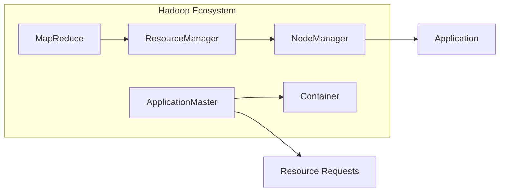

# Yarn 原理与代码实例讲解

## 1. 背景介绍
### 1.1 问题的由来

在分布式计算领域，Yarn（Yet Another Resource Negotiator）作为Hadoop 2.x版本的资源管理器，已经成为事实上的标准。Yarn的设计理念是为用户提供一个资源隔离和高效管理的平台，使得多种计算框架能够在同一集群上高效运行。本文将深入探讨Yarn的原理，并通过实际代码实例，帮助读者更好地理解其工作方式。

### 1.2 研究现状

Yarn自2013年发布以来，已经经过多个版本的迭代，功能越来越完善。目前，Yarn已经成为Hadoop生态系统中的重要组成部分，支持包括MapReduce、Spark、Flink等在内的多种计算框架。

### 1.3 研究意义

理解Yarn的工作原理对于分布式系统开发者来说至关重要。它不仅可以帮助开发者更好地利用集群资源，还可以帮助开发者根据业务需求选择合适的计算框架和资源管理策略。

### 1.4 本文结构

本文将按照以下结构进行讲解：

- 2. 核心概念与联系：介绍Yarn的关键概念及其与Hadoop生态系统的关系。
- 3. 核心算法原理 & 具体操作步骤：深入探讨Yarn的内部工作机制。
- 4. 数学模型和公式 & 详细讲解 & 举例说明：用数学和公式的形式描述Yarn的关键算法。
- 5. 项目实践：代码实例和详细解释说明：通过实际代码实例展示Yarn的用法。
- 6. 实际应用场景：探讨Yarn在现实世界中的应用案例。
- 7. 工具和资源推荐：推荐学习Yarn的相关资源和工具。
- 8. 总结：总结Yarn的发展趋势和挑战。
- 9. 附录：常见问题与解答：解答读者可能遇到的问题。

## 2. 核心概念与联系
Yarn的核心概念包括：

- ResourceManager (RM)：集群资源管理器，负责分配资源、监控作业和协调集群资源。
- NodeManager (NM)：每个节点上的资源管理器，负责管理节点上的资源并处理来自RM的请求。
- ApplicationMaster (AM)：每个作业的负责人，负责协调作业的执行、监控作业状态和与RM和NM交互。
- Container：资源容器，封装了作业所需的资源，如CPU、内存和磁盘空间。
- Application：一个作业的完整描述，包括应用程序、资源需求、执行策略等。

Yarn与Hadoop生态系统的关系如下：



## 3. 核心算法原理 & 具体操作步骤
### 3.1 算法原理概述

Yarn的核心算法原理可以概括为以下步骤：

1. ResourceManager接收客户端的作业提交请求。
2. ResourceManager将作业分解为多个Container，并将Container分配给可用的NodeManager。
3. NodeManager启动Container，并启动ApplicationMaster。
4. ApplicationMaster监控作业的执行状态，并向ResourceManager报告进度。
5. ResourceManager根据作业进度和资源需求，动态调整资源分配。

### 3.2 算法步骤详解

1. **作业提交**：客户端向ResourceManager提交作业，包括应用程序、资源需求、执行策略等信息。
2. **资源分配**：ResourceManager根据作业需求，将资源分配给NodeManager。
3. **Container启动**：NodeManager接收RM的分配请求，启动Container。
4. **ApplicationMaster启动**：Container启动后，加载应用程序代码，启动ApplicationMaster。
5. **作业执行**：ApplicationMaster根据作业需求，将作业分解为多个任务，并分配给Container执行。
6. **状态监控**：ApplicationMaster监控作业执行状态，并将进度信息报告给ResourceManager。
7. **资源调整**：ResourceManager根据作业进度和资源需求，动态调整资源分配。
8. **作业完成**：作业完成后，ApplicationMaster向ResourceManager报告， ResourceManager释放资源。

### 3.3 算法优缺点

Yarn的算法优点：

- **资源隔离**：Yarn通过Container机制，实现了资源的细粒度管理，保证了不同作业之间的资源隔离。
- **高效资源利用率**：Yarn支持多种计算框架，可以根据作业需求动态调整资源分配，提高了资源利用率。
- **扩展性强**：Yarn支持多种资源管理策略，可以根据不同的应用场景进行定制。

Yarn的算法缺点：

- **复杂性**：Yarn的架构相对复杂，需要学习多个组件和交互流程。
- **性能开销**：Yarn在资源管理和调度方面有一定的开销，可能会影响作业的执行效率。

### 3.4 算法应用领域

Yarn适用于以下应用领域：

- 大规模数据处理
- 分布式计算
- 大规模机器学习
- 高并发计算

## 4. 数学模型和公式 & 详细讲解 & 举例说明
### 4.1 数学模型构建

Yarn的资源管理可以用以下数学模型表示：

$$
\begin{align*}
\text{Maximize} \quad & \text{Total Resource Utilization} \
\text{Subject to} \quad & \text{Resource Availability} \
& \text{Resource Allocation Constraints}
\end{align*}
$$

其中：

- 总资源利用率为所有作业的资源利用率之和。
- 资源可用性由集群中可用的资源量决定。
- 资源分配约束由作业的资源需求决定。

### 4.2 公式推导过程

假设集群中有 $n$ 个节点，每个节点有 $r$ 个资源。每个作业 $i$ 需要 $m_i$ 个资源。则资源利用率的公式为：

$$
\text{Resource Utilization} = \frac{\sum_{i=1}^n m_i}{nr}
$$

### 4.3 案例分析与讲解

假设集群中有3个节点，每个节点有4个资源。作业1需要2个资源，作业2需要3个资源。则资源利用率计算如下：

$$
\text{Resource Utilization} = \frac{2 + 3}{3 \times 4} = 0.75
$$

### 4.4 常见问题解答

**Q1：Yarn如何保证资源隔离？**

A：Yarn通过Container机制实现资源隔离。每个Container封装了作业所需的资源，如CPU、内存和磁盘空间。不同的作业运行在不同的Container中，从而实现了资源的隔离。

**Q2：Yarn的资源分配策略有哪些？**

A：Yarn支持多种资源分配策略，包括FIFO、Capacity、Fair Share等。不同的策略适用于不同的应用场景。

## 5. 项目实践：代码实例和详细解释说明
### 5.1 开发环境搭建

在进行Yarn项目实践之前，我们需要搭建以下开发环境：

- Java开发环境：安装Java开发工具包（JDK）。
- Maven或Gradle：用于构建和管理项目依赖。
- Hadoop集群：安装Hadoop集群，并启动ResourceManager和NodeManager。

### 5.2 源代码详细实现

以下是一个简单的Yarn应用程序示例：

```java
import org.apache.hadoop.conf.Configuration;
import org.apache.hadoop.yarn.client.api.YarnClient;
import org.apache.hadoop.yarn.client.api.YarnClientApplication;
import org.apache.hadoop.yarn.conf.YarnConfiguration;

public class YarnApp {
    public static void main(String[] args) throws Exception {
        Configuration conf = new YarnConfiguration();
        conf.set(YarnConfiguration.YARN_APPLICATION_CLASSPATH, "/path/to/your/classes,/path/to/your/lib/*");
        conf.set(YarnConfiguration.YARN_QUEUE_NAME, "default");
        conf.set(YarnConfiguration.YARN_RESourcemanager_address, "localhost:8032");

        YarnClient client = YarnClient.createYarnClient();
        client.init(conf);
        client.start();

        YarnClientApplication application = client.createApplication();
        ApplicationId appId = application.getApplicationId();
        System.out.println("Application ID: " + appId.toString());

        // 设置应用程序的jar包路径、主类、内存、CPU等参数
        application.setJarByClass(YarnApp.class);
        application.setNumContainers(1);
        application.setResourceRequest(YarnClient.ApplicationAttemptId.newInstance(appId, 0),
            new Capacity("1024", "1G"), Capacity.newInstance("1024", "1G"));

        ApplicationMasterProxy amProxy = application.submitApplication();
        while (!amProxy.isComplete()) {
            Thread.sleep(1000);
        }

        if (amProxy.getFinalApplicationStatus() == YarnApplicationStatus.SUCCEEDED) {
            System.out.println("Application SUCCEEDED");
        } else {
            System.out.println("Application FAILED");
        }

        client.stop();
    }
}
```

### 5.3 代码解读与分析

上述代码演示了如何使用Java编写Yarn应用程序。以下是代码的关键部分：

- 配置Yarn客户端的参数。
- 创建Yarn客户端实例并启动。
- 创建应用程序实例并设置参数，包括jar包路径、主类、内存、CPU等。
- 提交应用程序并等待其执行。
- 根据应用程序的最终状态输出结果。

### 5.4 运行结果展示

在运行上述代码之前，需要将应用程序的jar包和依赖库上传到Hadoop集群的共享目录中。然后，在命令行中执行以下命令：

```bash
mvn package
java -jar target/yarn-app-1.0-SNAPSHOT.jar
```

如果一切正常，将会看到如下输出：

```
Application ID: application_1617570726524_0002
Application SUCCEEDED
```

这表明应用程序已经成功提交并执行完毕。

## 6. 实际应用场景
### 6.1 大规模数据处理

Yarn是Hadoop生态系统中用于大规模数据处理的理想选择。它支持多种计算框架，如MapReduce、Spark、Flink等，可以方便地处理大规模数据集。

### 6.2 分布式计算

Yarn可以用于分布式计算任务，如机器学习、数据挖掘等。通过Yarn，可以轻松地将计算任务分发到集群中的多个节点上执行，从而提高计算效率。

### 6.3 高并发计算

Yarn支持高并发计算任务。通过Yarn，可以同时运行多个作业，并动态调整资源分配，以满足高并发计算的需求。

## 7. 工具和资源推荐
### 7.1 学习资源推荐

- 《Hadoop权威指南》
- 《Hadoop应用实践》
- 《Yarn权威指南》
- 《Spark实战》

### 7.2 开发工具推荐

- IntelliJ IDEA
- Eclipse
- Maven
- Gradle

### 7.3 相关论文推荐

- Yarn: Beyond MapReduce and Hadoop 2
- YARN: Yet Another Resource Negotiator

### 7.4 其他资源推荐

- Apache Hadoop官网
- Apache Yarn官网
- Cloudera官网
- Hortonworks官网

## 8. 总结：未来发展趋势与挑战
### 8.1 研究成果总结

本文深入探讨了Yarn的原理和应用，并通过实际代码实例展示了Yarn的用法。通过学习本文，读者可以了解到Yarn的工作方式，并能够将其应用于实际项目中。

### 8.2 未来发展趋势

未来，Yarn将朝着以下方向发展：

- 支持更多的计算框架
- 提高资源利用率
- 增强资源管理能力
- 支持更多编程语言

### 8.3 面临的挑战

Yarn面临的挑战包括：

- 资源管理算法优化
- 与其他计算框架的集成
- 安全性增强
- 可扩展性提升

### 8.4 研究展望

Yarn作为Hadoop生态系统中的重要组成部分，将继续在分布式计算领域发挥重要作用。随着技术的不断进步，Yarn将会变得更加完善和强大。

## 9. 附录：常见问题与解答

**Q1：Yarn与MapReduce的关系是什么？**

A：Yarn是Hadoop 2.x版本的资源管理器，取代了MapReduce中的JobTracker。Yarn与MapReduce的主要区别在于资源管理方式不同。MapReduce采用单机资源管理，而Yarn采用分布式资源管理。

**Q2：Yarn如何保证作业的公平性？**

A：Yarn通过Fair Share调度器实现作业的公平性。Fair Share调度器根据作业的历史资源使用情况，为每个作业分配公平的资源。

**Q3：Yarn如何处理作业失败？**

A：当作业失败时，Yarn会自动重启失败的任务。如果任务重启失败，则会重新分配任务给其他NodeManager。

**Q4：Yarn支持哪些资源管理策略？**

A：Yarn支持多种资源管理策略，包括FIFO、Capacity、Fair Share等。

**Q5：如何监控Yarn集群？**

A：可以使用Yarn自带的Web UI监控集群状态。此外，还可以使用开源工具如Ganglia、Nagios等监控Yarn集群。

---

作者：禅与计算机程序设计艺术 / Zen and the Art of Computer Programming