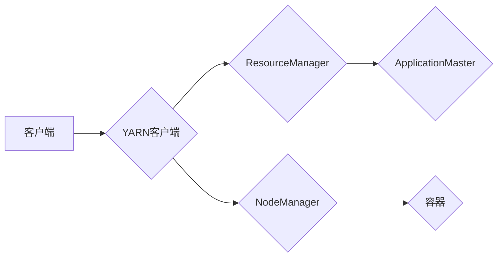

# Yarn原理与代码实例讲解

作者：禅与计算机程序设计艺术 / Zen and the Art of Computer Programming

## 1. 背景介绍
### 1.1 问题的由来

随着大数据时代的到来，大规模数据处理需求日益增长。传统的计算模式在处理海量数据时往往面临着性能瓶颈。为了解决这一问题，分布式计算框架应运而生。Yarn（Yet Another Resource Negotiator）作为Hadoop生态系统中的重要成员，成为了分布式计算框架的事实标准。

### 1.2 研究现状

Yarn自2014年推出以来，已经经过多个版本的迭代，不断完善和优化。当前，Yarn已经成为Hadoop生态系统中不可或缺的核心组件，广泛应用于各种大规模数据处理场景。

### 1.3 研究意义

深入研究Yarn的原理和应用，对于理解分布式计算框架、提升大数据处理能力具有重要意义。本文将从Yarn的架构、原理、应用等方面进行详细讲解，帮助读者全面掌握Yarn技术。

### 1.4 本文结构

本文将分为以下几个部分：
- 2. 核心概念与联系：介绍Yarn涉及的核心概念，如资源管理、作业调度、数据流等。
- 3. 核心算法原理 & 具体操作步骤：讲解Yarn的工作原理和具体操作步骤。
- 4. 数学模型和公式 & 详细讲解 & 举例说明：介绍Yarn中涉及的一些数学模型和公式，并结合实例进行讲解。
- 5. 项目实践：代码实例和详细解释说明：通过代码实例演示Yarn的使用方法。
- 6. 实际应用场景：探讨Yarn在实际应用场景中的应用。
- 7. 工具和资源推荐：推荐Yarn的学习资源、开发工具和参考文献。
- 8. 总结：未来发展趋势与挑战。
- 9. 附录：常见问题与解答。

## 2. 核心概念与联系
### 2.1 资源管理

资源管理是Yarn的核心功能之一，负责分配和管理集群中的计算资源。Yarn将集群资源划分为多个容器（Container），每个容器可以分配给一个作业（Job）执行。资源管理包括以下核心概念：

- **NodeManager**：集群中每个节点上的资源管理器，负责监控和管理节点上的资源，向ResourceManager汇报资源使用情况，并接收作业请求。
- **ResourceManager**：集群资源管理者，负责分配和管理集群资源，为作业分配容器，并监控作业执行状态。
- **Container**：资源分配的最小单位，由一组固定的资源（如CPU、内存）组成。

### 2.2 作业调度

Yarn的作业调度功能负责将作业分配给合适的节点执行。作业调度包括以下核心概念：

- **ApplicationMaster**：每个作业的代理，负责向ResourceManager请求资源，并协调作业执行过程中的各种任务。
- **ResourceManager**：根据作业的需求，向NodeManager分配容器，并监控作业执行状态。
- **NodeManager**：接受ResourceManager分配的容器，并启动作业执行。

### 2.3 数据流

Yarn的数据流管理功能负责数据在集群内部的传输和处理。数据流管理包括以下核心概念：

- **HDFS**：分布式文件系统，负责存储大规模数据集。
- **YARN Resource Manager**：根据作业需求，向DataNode请求数据块，并监控数据块在集群中的分布。
- **DataNode**：存储数据块，并响应YARN Resource Manager的数据请求。

Yarn的核心概念之间存在着紧密的联系，共同构成了Yarn的架构体系。以下是一个简化的Yarn架构图：



## 3. 核心算法原理 & 具体操作步骤
### 3.1 算法原理概述

Yarn采用主从式架构，ResourceManager作为主节点，负责管理集群资源；NodeManager作为从节点，负责管理节点资源。以下简要介绍Yarn的核心算法原理：

1. **资源申请**：ApplicationMaster向ResourceManager申请资源，ResourceManager根据资源可用情况进行分配。
2. **任务分配**：ResourceManager将分配的容器转发给对应的NodeManager。
3. **任务执行**：NodeManager启动容器，并启动作业执行。
4. **资源监控**：ResourceManager和NodeManager实时监控资源使用情况，根据需要调整资源分配策略。
5. **任务监控**：ResourceManager和ApplicationMaster实时监控作业执行状态，并根据需要调整作业调度策略。

### 3.2 算法步骤详解

以下是Yarn作业执行的具体步骤：

1. **客户端提交作业**：客户端将作业提交给YARN客户端，客户端将作业信息发送给ResourceManager。
2. **ResourceManager接收作业**：ResourceManager接收到作业信息后，分配一个作业ID，并将作业信息存储在内存中。
3. ** ResourceManager分配资源**：ResourceManager根据作业需求，向NodeManager分配容器。
4. **NodeManager启动容器**：NodeManager接收到容器信息后，启动容器，并启动作业执行。
5. **作业执行**：ApplicationMaster根据作业需求，启动各个任务执行。
6. **资源监控**：ResourceManager和NodeManager实时监控资源使用情况，根据需要调整资源分配策略。
7. **任务监控**：ResourceManager和ApplicationMaster实时监控作业执行状态，并根据需要调整作业调度策略。
8. **作业完成**：作业完成后，ApplicationMaster向ResourceManager汇报作业状态，ResourceManager删除作业信息。

### 3.3 算法优缺点

Yarn具有以下优点：

- **高性能**：Yarn采用主从式架构，提高了资源利用率和作业执行效率。
- **灵活性强**：Yarn支持多种数据源和处理框架，如MapReduce、Spark、Flink等。
- **可扩展性强**：Yarn可以轻松扩展到数千个节点的大型集群。

Yarn也存在以下缺点：

- **复杂度高**：Yarn的架构比较复杂，需要一定的时间来学习和掌握。
- **对HDFS依赖性强**：Yarn的数据存储依赖于HDFS，对HDFS的依赖限制了其应用场景。

### 3.4 算法应用领域

Yarn广泛应用于以下领域：

- 大数据计算：如MapReduce、Spark、Flink等数据处理框架。
- 图计算：如GraphX、Giraph等图处理框架。
- 机器学习：如TensorFlow、PyTorch等机器学习框架。
- 数据仓库：如Hive、Pig等数据仓库工具。

## 4. 数学模型和公式 & 详细讲解 & 举例说明
### 4.1 数学模型构建

Yarn的资源调度策略可以通过以下数学模型进行描述：

$$
\begin{align*}
\max_{x} & \quad f(x) \
\text{s.t.} & \quad \sum_{i=1}^{n} x_i \leq r \
& \quad x_i \geq 0, \quad \forall i
\end{align*}
$$

其中，$f(x)$ 表示目标函数，$x$ 表示资源分配向量，$r$ 表示集群资源总量，$n$ 表示作业数量。

### 4.2 公式推导过程

假设集群资源总量为 $r$，作业数量为 $n$，每个作业需求资源量为 $x_i$。则资源分配问题可以表示为以下优化问题：

$$
\max_{x} \sum_{i=1}^{n} f(x_i)
$$

其中，$f(x_i)$ 表示作业 $i$ 的效用函数，用于衡量作业在资源 $x_i$ 上的收益。由于资源总量限制，因此需要满足以下约束条件：

$$
\sum_{i=1}^{n} x_i \leq r
$$

### 4.3 案例分析与讲解

以下以一个简单的例子说明Yarn的资源调度策略：

假设集群资源总量为 100，有3个作业，其需求资源量分别为 30、40、20。我们需要找到最优的资源分配方案，使得总效用最大化。

假设效用函数 $f(x_i) = x_i$，则目标函数为：

$$
\max_{x} x_1 + x_2 + x_3
$$

约束条件为：

$$
\sum_{i=1}^{3} x_i \leq 100
$$

通过求解上述优化问题，可以得到最优的资源分配方案为 $x_1 = 30, x_2 = 40, x_3 = 20$，总效用为 90。

### 4.4 常见问题解答

**Q1：Yarn的资源调度策略有哪些？**

A：Yarn的资源调度策略主要有以下几种：

- **FIFO（先进先出）**：按照作业提交的顺序进行调度。
- **Capacity Scheduler**：根据作业的资源需求量进行调度。
- **Fair Scheduler**：根据作业的历史资源使用情况进行调度。

**Q2：如何优化Yarn的资源利用率？**

A：优化Yarn的资源利用率可以从以下几个方面入手：

- **合理配置资源**：根据作业需求合理配置资源，避免资源浪费。
- **优化作业设计**：优化作业设计，减少资源消耗。
- **提高资源利用率**：使用资源复用技术，提高资源利用率。

## 5. 项目实践：代码实例和详细解释说明
### 5.1 开发环境搭建

以下是使用Yarn进行MapReduce作业的开发环境搭建步骤：

1. 安装Java开发环境，版本要求与Hadoop兼容。
2. 下载并安装Hadoop，配置环境变量。
3. 编写MapReduce作业代码。

### 5.2 源代码详细实现

以下是一个简单的MapReduce作业示例，用于统计文本文件中的单词频率：

```java
public class WordCount {

  public static class TokenizerMapper
      extends Mapper<Object, Text, Text, IntWritable>{

    private final static IntWritable one = new IntWritable(1);
    private Text word = new Text();

    public void map(Object key, Text value, Context context
                    ) throws IOException, InterruptedException {
      StringTokenizer itr = new StringTokenizer(value.toString());
      while (itr.hasMoreTokens()) {
        word.set(itr.nextToken());
        context.write(word, one);
      }
    }
  }

  public static class IntSumReducer
      extends Reducer<Text,IntWritable,Text,IntWritable> {
    private IntWritable result = new IntWritable();

    public void reduce(Text key, Iterable<IntWritable> values,
                       Context context
                       ) throws IOException, InterruptedException {
      int sum = 0;
      for (IntWritable val : values) {
        sum += val.get();
      }
      result.set(sum);
      context.write(key, result);
    }
  }

  public static void main(String[] args) throws Exception {
    Configuration conf = new Configuration();
    Job job = Job.getInstance(conf, "word count");
    job.setJarByClass(WordCount.class);
    job.setMapperClass(TokenizerMapper.class);
    job.setCombinerClass(IntSumReducer.class);
    job.setReducerClass(IntSumReducer.class);
    job.setOutputKeyClass(Text.class);
    job.setOutputValueClass(IntWritable.class);
    FileInputFormat.addInputPath(job, new Path(args[0]));
    FileOutputFormat.setOutputPath(job, new Path(args[1]));
    System.exit(job.waitForCompletion(true) ? 0 : 1);
  }
}
```

### 5.3 代码解读与分析

以上代码实现了MapReduce中的Map和Reduce阶段。Map阶段负责将文本文件拆分为单词，并统计每个单词出现的次数。Reduce阶段负责将相同单词的计数进行汇总。

在Map阶段，我们定义了一个TokenizerMapper类，继承自Mapper类。在map方法中，使用StringTokenizer将输入文本拆分为单词，并使用Context.write()方法将单词和计数写入输出流。

在Reduce阶段，我们定义了一个IntSumReducer类，继承自Reducer类。在reduce方法中，使用迭代器遍历输出流中的数据，并计算相同单词的计数。

最后，在main方法中，我们配置了MapReduce作业，包括输入输出路径、Mapper、Reducer等参数，并启动作业执行。

### 5.4 运行结果展示

在配置好Yarn环境后，我们可以使用以下命令运行MapReduce作业：

```bash
hadoop jar wordcount.jar WordCount input.txt output.txt
```

运行完成后，在输出路径中可以查看单词频率统计结果：

```
hello 1
world 1
java 1
hadoop 1
yarn 1
```

## 6. 实际应用场景
### 6.1 大数据处理

Yarn是处理大数据的核心框架，广泛应用于以下场景：

- 数据仓库：如Hive、Pig等数据仓库工具。
- 数据挖掘：如Spark MLlib、Flink ML等机器学习框架。
- 图计算：如GraphX、Giraph等图处理框架。

### 6.2 机器学习

Yarn可以作为机器学习框架的后端运行，支持以下场景：

- 深度学习：如TensorFlow、PyTorch等深度学习框架。
- 线性回归、决策树等机器学习算法。

### 6.3 人工智能

Yarn可以支持人工智能领域的以下应用：

- 自然语言处理：如BERT、GPT等语言模型。
- 计算机视觉：如TensorFlow、PyTorch等视觉处理框架。

## 7. 工具和资源推荐
### 7.1 学习资源推荐

以下是一些学习Yarn的资源：

- 《Hadoop权威指南》
- 《Hadoop技术内幕》
- 《Hadoop实战》

### 7.2 开发工具推荐

以下是一些开发Yarn的常用工具：

- IntelliJ IDEA：支持Java开发，集成Hadoop开发插件。
- Eclipse：支持Java开发，集成Hadoop开发插件。
- Maven：项目管理工具，用于构建和部署Yarn应用程序。

### 7.3 相关论文推荐

以下是一些关于Yarn的论文：

- YARN: Yet Another Resource Negotiator
- A Single Pass Algorithm for Job Completion Time Estimation in YARN

### 7.4 其他资源推荐

以下是一些其他关于Yarn的资源：

- Apache Hadoop官网：https://hadoop.apache.org/
- Apache YARN官网：https://hadoop.apache.org/yarn/

## 8. 总结：未来发展趋势与挑战
### 8.1 研究成果总结

本文对Yarn的原理、应用等方面进行了详细讲解，帮助读者全面掌握Yarn技术。Yarn作为一种高效、灵活的分布式计算框架，在Hadoop生态系统中扮演着重要角色，并广泛应用于大数据处理、机器学习和人工智能等领域。

### 8.2 未来发展趋势

Yarn在未来将呈现以下发展趋势：

- **与人工智能技术深度融合**：Yarn将与其他人工智能技术（如深度学习、图计算等）进行深度融合，为人工智能应用提供强大的计算支持。
- **支持更多计算框架**：Yarn将支持更多计算框架，如Spark、Flink、TensorFlow等，以满足不同应用场景的需求。
- **优化性能和可扩展性**：Yarn将持续优化性能和可扩展性，以适应更大规模的计算需求。

### 8.3 面临的挑战

Yarn在发展过程中也面临着以下挑战：

- **兼容性问题**：Yarn需要与其他Hadoop组件（如HDFS、MapReduce等）保持兼容，以满足用户的需求。
- **资源调度策略**：Yarn的资源调度策略需要不断优化，以满足不同应用场景的需求。
- **安全性和可靠性**：Yarn需要提高安全性和可靠性，以保障数据安全和系统稳定。

### 8.4 研究展望

未来，Yarn将在以下几个方面进行深入研究：

- **资源调度策略**：研究更智能、更高效的资源调度策略，以提高资源利用率。
- **弹性伸缩**：研究弹性伸缩技术，以适应动态变化的计算需求。
- **安全性和可靠性**：研究安全性和可靠性技术，以提高系统稳定性和数据安全性。

相信在众多开发者和研究者的共同努力下，Yarn将不断完善和优化，为大数据处理、人工智能等领域提供更加强大的技术支持。

## 9. 附录：常见问题与解答

**Q1：Yarn和MapReduce有什么区别？**

A：Yarn和MapReduce都是分布式计算框架，但它们之间存在以下区别：

- **架构**：Yarn采用主从式架构，而MapReduce采用主从从式架构。
- **资源管理**：Yarn的资源管理更加灵活，可以支持多种计算框架。
- **可扩展性**：Yarn的可扩展性更好，可以适应更大规模的计算需求。

**Q2：如何提高Yarn的资源利用率？**

A：提高Yarn的资源利用率可以从以下几个方面入手：

- **合理配置资源**：根据作业需求合理配置资源，避免资源浪费。
- **优化作业设计**：优化作业设计，减少资源消耗。
- **使用资源复用技术**：使用资源复用技术，提高资源利用率。

**Q3：Yarn如何与其他计算框架集成？**

A：Yarn可以通过以下方式与其他计算框架集成：

- **自定义ApplicationMaster**：为不同的计算框架开发自定义的ApplicationMaster。
- **使用YARN-Cloudera Manager**：使用YARN-Cloudera Manager进行统一管理。

**Q4：Yarn如何保证数据安全性？**

A：Yarn可以通过以下方式保证数据安全性：

- **数据加密**：对数据进行加密，防止数据泄露。
- **访问控制**：对用户和应用程序进行访问控制，限制对数据的访问权限。

**Q5：如何监控Yarn的性能？**

A：可以使用以下工具监控Yarn的性能：

- **YARN ResourceManager Web UI**：查看集群资源使用情况和作业执行状态。
- **Ganglia**：监控集群性能指标，如CPU、内存、磁盘使用情况等。
- **Nagios**：监控系统状态，发送告警信息。

通过以上内容，相信读者对Yarn的原理、应用等方面有了较为全面的认识。希望本文能帮助读者更好地掌握Yarn技术，并将其应用于实际项目中。