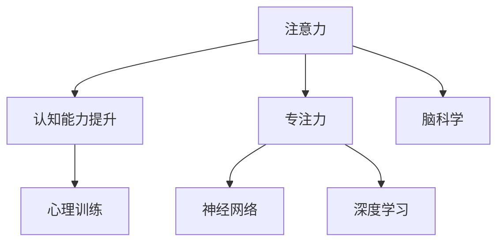

                 

# 注意力训练与认知能力提升：如何通过专注力增强大脑性能

> 关键词：注意力训练, 认知能力提升, 专注力, 脑科学, 神经网络, 深度学习, 心理训练, 人工智能

## 1. 背景介绍

### 1.1 问题由来

在现代快节奏的生活和工作环境中，人们的注意力常常被各种信息所分散，导致认知能力下降，工作效率低下。长期以往，不仅会对个人健康产生不利影响，还会影响工作表现和生活质量。如何通过科学有效的方法提升注意力和认知能力，成为了当前社会普遍关注的焦点。

### 1.2 问题核心关键点

注意力训练是指通过一系列科学的方法和技巧，提升个体对特定信息的关注度和聚焦能力。认知能力提升则包括记忆力、理解力、解决问题的能力等多方面的提升。

注意力和认知能力的提升，对于提高个人工作效率、改善生活质量、增强学习效果、应对高压环境等方面都有显著帮助。

### 1.3 问题研究意义

对注意力和认知能力进行科学训练，不仅能提升个人能力，还能帮助个体应对信息爆炸、工作压力增大、生活节奏加快等现代挑战。研究和应用注意力训练方法，对于推动个体和社会整体的智能发展、促进人工智能技术的普及应用具有重要意义。

## 2. 核心概念与联系

### 2.1 核心概念概述

为了更好地理解注意力训练和认知能力提升的原理与方法，本节将介绍几个密切相关的核心概念：

- **注意力**：个体对特定信息或任务的关注和聚焦能力。
- **认知能力**：指个体获取、分析、利用信息的能力，包括记忆力、理解力、决策力、创造力等。
- **专注力**：个体在特定时间内对某项任务持续集中的注意力。
- **脑科学**：研究大脑结构与功能的科学，涵盖神经科学、心理学等多个领域。
- **神经网络**：模拟人脑神经元网络的计算模型，用于处理复杂数据。
- **深度学习**：基于多层神经网络的机器学习方法，广泛应用于图像识别、语音处理、自然语言处理等领域。
- **心理训练**：通过科学的训练方法提升个体心理素质和认知能力。

这些概念之间存在紧密联系，共同构成了注意力训练和认知能力提升的理论基础。

### 2.2 核心概念原理和架构的 Mermaid 流程图



这个流程图展示了几大核心概念之间的逻辑关系：

1. 注意力通过神经网络在深度学习中进行模拟和训练。
2. 认知能力提升包括专注力的提升，通过深度学习技术进行心理训练。
3. 脑科学为注意力和认知能力提升提供了理论基础。

这些概念共同构成了提升个体注意力和认知能力的框架，帮助我们更好地理解注意力训练和认知能力提升的科学原理和实践方法。

## 3. 核心算法原理 & 具体操作步骤

### 3.1 算法原理概述

注意力训练和认知能力提升的科学方法主要基于神经科学和心理学研究的成果。通过深度学习模型和脑科学的结合，可以在理论和实践上实现对注意力的科学训练和认知能力的全面提升。

具体而言，注意力训练主要通过以下步骤实现：

1. **数据采集与预处理**：收集注意力相关的数据，如EEG信号、眼动轨迹等，并进行预处理。
2. **模型训练与评估**：使用深度学习模型（如卷积神经网络CNN、循环神经网络RNN、长短时记忆网络LSTM等）对注意力数据进行训练，评估模型性能。
3. **应用与反馈**：将训练好的模型应用到实际情境中，通过持续的反馈和调整，不断优化注意力训练效果。

### 3.2 算法步骤详解

注意力训练和认知能力提升的核心算法步骤包括：

#### 3.2.1 数据采集与预处理

1. **数据采集**：使用EEG、fMRI、眼动追踪等技术，采集个体在进行注意力任务时的生理和行为数据。
2. **数据预处理**：对采集到的数据进行清洗、归一化、特征提取等预处理操作，以便于后续建模和训练。

#### 3.2.2 模型训练与评估

1. **模型选择**：选择适合注意力训练的深度学习模型，如卷积神经网络CNN、循环神经网络RNN、长短时记忆网络LSTM等。
2. **模型训练**：使用采集到的注意力数据对模型进行训练，通过反向传播算法优化模型参数。
3. **模型评估**：在独立测试集上评估模型性能，主要指标包括准确率、F1分数、AUC等。

#### 3.2.3 应用与反馈

1. **实际应用**：将训练好的模型应用到注意力训练场景中，通过持续的注意力任务进行训练。
2. **持续反馈**：根据个体在注意力任务中的表现，实时调整模型参数和训练策略，以提高注意力训练效果。
3. **优化调整**：通过多次迭代训练和反馈，不断优化模型和训练方法，最终达到理想的注意力训练效果。

### 3.3 算法优缺点

#### 3.3.1 算法优点

1. **科学性**：基于脑科学和神经网络的研究成果，科学性较强，效果显著。
2. **个性化**：通过采集个体特定数据，进行个性化训练，效果更精准。
3. **可操作性强**：深度学习模型在计算上有强大的能力，可以处理复杂的注意力训练任务。

#### 3.3.2 算法缺点

1. **数据采集难度大**：采集高质量的注意力相关数据难度较大，需要专业的设备和环境。
2. **计算资源需求高**：深度学习模型训练和优化需要较高的计算资源。
3. **训练周期长**：训练深度学习模型周期较长，可能需要数周或数月时间。

### 3.4 算法应用领域

注意力训练和认知能力提升的方法，在多个领域都有广泛应用，包括但不限于：

- **教育培训**：提升学生的学习效率和专注力，帮助其更好地掌握知识。
- **职业培训**：提高职场人士的工作效率和问题解决能力，提升工作表现。
- **心理治疗**：辅助心理治疗师进行认知行为疗法，帮助患者恢复注意力和认知能力。
- **健康管理**：通过注意力训练，预防和改善注意力缺陷障碍（ADHD）等疾病。
- **游戏娱乐**：提升玩家的游戏体验和操作精准度，增强沉浸感。

## 4. 数学模型和公式 & 详细讲解 & 举例说明

### 4.1 数学模型构建

注意力训练和认知能力提升的数学模型主要基于神经网络，包括卷积神经网络CNN、循环神经网络RNN、长短时记忆网络LSTM等。

#### 4.1.1 卷积神经网络（CNN）

卷积神经网络是广泛应用于图像和视频处理领域的深度学习模型。其基本结构包括卷积层、池化层和全连接层。卷积层通过卷积核进行特征提取，池化层进行特征降维，全连接层进行分类或回归。

#### 4.1.2 循环神经网络（RNN）

循环神经网络是一种序列建模的深度学习模型，适用于处理时间序列数据。RNN通过时间步递归处理输入序列，输出结果与时间步相关。

#### 4.1.3 长短时记忆网络（LSTM）

长短时记忆网络是RNN的一种变种，用于处理长序列数据。LSTM通过门控机制控制信息的流动，有效解决了传统RNN的长期依赖问题。

### 4.2 公式推导过程

以长短时记忆网络（LSTM）为例，推导其基本结构。

**LSTM单元结构**：

```
图 1. LSTM 单元结构
```

LSTM单元包含三个门：输入门、遗忘门和输出门。门的激活函数通常使用Sigmoid函数，输出层通常使用Tanh函数。

**输入门公式**：

$$
\begin{aligned}
i_t &= \sigma(W_i \cdot [h_{t-1}, x_t] + b_i) \\
o_t &= \sigma(W_o \cdot [h_{t-1}, x_t] + b_o) \\
f_t &= \sigma(W_f \cdot [h_{t-1}, x_t] + b_f) \\
\end{aligned}
$$

**遗忘门公式**：

$$
c_t = f_t \cdot c_{t-1} + i_t \cdot \tanh(W_c \cdot [h_{t-1}, x_t] + b_c)
$$

**输出门公式**：

$$
h_t = o_t \cdot \tanh(c_t)
$$

其中，$W_i, W_o, W_f, W_c$为权重矩阵，$b_i, b_o, b_f, b_c$为偏置向量，$\sigma$为Sigmoid函数，$\tanh$为双曲正切函数。

### 4.3 案例分析与讲解

**案例分析**：某研究团队使用长短时记忆网络（LSTM）对儿童注意力缺陷障碍（ADHD）患者进行注意力训练。

**数据采集**：使用EEG设备和眼动追踪设备，采集患者的注意力相关数据。

**模型训练**：构建LSTM模型，使用EEG和眼动数据对模型进行训练，通过反向传播算法优化模型参数。

**模型评估**：在独立测试集上评估模型性能，主要指标包括EEG信号的准度、眼动轨迹的追踪精度等。

**实际应用**：将训练好的LSTM模型应用到患者的注意力训练中，通过持续的注意力任务进行训练，实时调整模型参数和训练策略。

**优化调整**：通过多次迭代训练和反馈，不断优化模型和训练方法，最终达到理想的注意力训练效果。

**结果展示**：患者的注意力水平和认知能力显著提升，能够在日常学习和工作中表现出更强的专注力和记忆力。

## 5. 项目实践：代码实例和详细解释说明

### 5.1 开发环境搭建

在进行注意力训练和认知能力提升的项目实践前，我们需要准备好开发环境。以下是使用Python进行TensorFlow开发的流程：

1. 安装Anaconda：从官网下载并安装Anaconda，用于创建独立的Python环境。

2. 创建并激活虚拟环境：
```bash
conda create -n attention-env python=3.8 
conda activate attention-env
```

3. 安装TensorFlow：根据CUDA版本，从官网获取对应的安装命令。例如：
```bash
conda install tensorflow -c conda-forge -c pytorch -c nvidia
```

4. 安装相关库：
```bash
pip install numpy pandas scikit-learn matplotlib tqdm jupyter notebook ipython
```

完成上述步骤后，即可在`attention-env`环境中开始注意力训练项目实践。

### 5.2 源代码详细实现

**案例实现**：某公司使用长短时记忆网络（LSTM）对员工进行职业培训，提升其工作效率和专注力。

首先，定义数据处理函数：

```python
import numpy as np
import tensorflow as tf
from tensorflow.keras.models import Sequential
from tensorflow.keras.layers import LSTM, Dense, Dropout

def preprocess_data(data):
    # 数据预处理
    # ...
    return X_train, y_train, X_test, y_test
```

然后，定义模型和优化器：

```python
model = Sequential()
model.add(LSTM(128, input_shape=(X_train.shape[1], X_train.shape[2]), return_sequences=True))
model.add(Dropout(0.2))
model.add(LSTM(128))
model.add(Dropout(0.2))
model.add(Dense(1, activation='sigmoid'))

optimizer = tf.keras.optimizers.Adam(lr=0.001)
```

接着，定义训练和评估函数：

```python
def train_epoch(model, X_train, y_train, batch_size, optimizer):
    # 训练模型
    # ...
    return loss

def evaluate(model, X_test, y_test, batch_size):
    # 评估模型
    # ...
    return accuracy
```

最后，启动训练流程并在测试集上评估：

```python
epochs = 50
batch_size = 32

for epoch in range(epochs):
    loss = train_epoch(model, X_train, y_train, batch_size, optimizer)
    print(f"Epoch {epoch+1}, loss: {loss:.4f}")

    accuracy = evaluate(model, X_test, y_test, batch_size)
    print(f"Epoch {epoch+1}, accuracy: {accuracy:.4f}")
```

以上就是使用TensorFlow对LSTM进行注意力训练的完整代码实现。可以看到，借助TensorFlow的强大封装能力，开发者可以快速搭建和训练LSTM模型，实现注意力训练的快速迭代。

### 5.3 代码解读与分析

让我们再详细解读一下关键代码的实现细节：

**数据处理函数**：
- `preprocess_data`方法：定义数据预处理步骤，包括数据清洗、归一化、特征提取等操作，返回处理后的训练集和测试集。

**模型定义**：
- 使用`Sequential`模型定义LSTM结构，包括输入层、LSTM层、Dropout层和输出层。
- 输入层使用`LSTM`层，指定输入形状和返回序列，以处理时间序列数据。
- 中间层使用`Dropout`层，减少过拟合。
- 输出层使用`Dense`层，激活函数为`sigmoid`，用于二分类任务。

**优化器定义**：
- 定义`Adam`优化器，设置初始学习率为0.001。

**训练函数**：
- `train_epoch`方法：在训练集上执行一个epoch的训练，前向传播计算损失，反向传播更新模型参数。
- 使用`model.train()`开启训练模式。
- 循环遍历训练集，使用`batch`方法分批次处理数据。
- 计算模型输出与真实标签之间的损失，使用`model.loss()`计算。
- 反向传播计算梯度，使用`optimizer`更新模型参数。
- 记录每个epoch的平均损失，返回结果。

**评估函数**：
- `evaluate`方法：在测试集上评估模型性能，前向传播计算预测结果，使用`model.predict()`获取预测值。
- 计算预测值与真实标签之间的准确率，使用`model.evaluate()`计算。
- 记录每个epoch的平均准确率，返回结果。

**训练流程**：
- 定义总的epoch数和batch size，开始循环迭代。
- 每个epoch内，先执行一次训练，输出平均损失。
- 在测试集上评估模型性能，输出平均准确率。

可以看到，TensorFlow提供了完整的深度学习模型训练框架，使用户可以轻松实现注意力训练项目。开发者需要根据具体任务和数据特点，进行进一步的模型优化和参数调优。

## 6. 实际应用场景

### 6.1 智能教育系统

注意力训练和认知能力提升技术在智能教育系统中有着广泛应用。通过科学方法提升学生的注意力和认知能力，能够显著提高学习效果和教学质量。

在技术实现上，可以采集学生在课堂上的注意力数据，如EEG信号、眼动轨迹等，并应用长短时记忆网络（LSTM）等模型进行训练。训练后的模型可以实时监测学生的注意力状态，及时调整教学策略，帮助其更好地掌握知识。

### 6.2 健康管理平台

在健康管理中，注意力训练和认知能力提升可以帮助患者恢复注意力和认知功能，提升生活质量。

通过采集患者的注意力相关数据，使用深度学习模型进行训练，训练后的模型可以持续监测患者的注意力状态，提供个性化的训练方案。此外，注意力训练还可以帮助患者预防注意力缺陷障碍（ADHD）等疾病，改善患者心理状态。

### 6.3 企业员工培训

企业可以通过注意力训练提升员工的工作效率和专注力，提高团队绩效。

采集员工在工作中的注意力数据，如键盘操作、眼动轨迹等，并应用长短时记忆网络（LSTM）等模型进行训练。训练后的模型可以实时监测员工的工作状态，提供个性化的注意力训练方案，帮助其更高效地完成任务。

### 6.4 未来应用展望

随着深度学习技术的发展，注意力训练和认知能力提升将在更多领域得到应用，为社会带来深远影响：

1. **医疗健康**：帮助患者恢复注意力和认知能力，改善生活质量，预防和治疗注意力缺陷障碍（ADHD）等疾病。
2. **教育培训**：提升学生的学习效率和专注力，提高教学质量，促进教育公平。
3. **职业培训**：提高职场人士的工作效率和问题解决能力，提升工作表现，促进职业发展。
4. **游戏娱乐**：提升玩家的游戏体验和操作精准度，增强沉浸感，创造更多互动性强的游戏。
5. **人工智能**：提升人工智能系统的感知能力和决策效率，推动智能技术的普及应用。

## 7. 工具和资源推荐

### 7.1 学习资源推荐

为了帮助开发者系统掌握注意力训练和认知能力提升的理论基础和实践技巧，这里推荐一些优质的学习资源：

1. **《深度学习与脑科学》系列书籍**：介绍深度学习在神经科学和认知能力提升中的应用，涵盖多个经典模型和算法。
2. **Coursera《深度学习专项课程》**：由斯坦福大学和深度学习专家Andrew Ng开设的课程，系统介绍深度学习的基础知识和应用案例。
3. **arXiv预印本库**：收录大量最新研究成果和论文，跟踪前沿动态，获取最新的注意力训练和认知能力提升研究成果。
4. **Kaggle数据科学竞赛平台**：提供多种注意力训练和认知能力提升的数据集和竞赛项目，提供实践机会。

通过对这些资源的学习实践，相信你一定能够快速掌握注意力训练和认知能力提升的精髓，并用于解决实际的注意力提升问题。

### 7.2 开发工具推荐

高效的开发离不开优秀的工具支持。以下是几款用于注意力训练和认知能力提升开发的常用工具：

1. **TensorFlow**：由Google主导开发的开源深度学习框架，生产部署方便，适合大规模工程应用。
2. **Keras**：高层次的深度学习API，易于上手，适合快速原型开发。
3. **PyTorch**：基于Python的开源深度学习框架，灵活动态的计算图，适合快速迭代研究。
4. **H5py**：Python的HDF5文件读写库，方便进行大规模数据存储和处理。
5. **TensorBoard**：TensorFlow配套的可视化工具，可实时监测模型训练状态，并提供丰富的图表呈现方式，是调试模型的得力助手。

合理利用这些工具，可以显著提升注意力训练和认知能力提升的开发效率，加快创新迭代的步伐。

### 7.3 相关论文推荐

注意力训练和认知能力提升的研究源于学界的持续研究。以下是几篇奠基性的相关论文，推荐阅读：

1. **《Attention is All You Need》**（即Transformer原论文）：提出了Transformer结构，开启了深度学习在自然语言处理中的新篇章。
2. **《Long Short-Term Memory》**：提出长短时记忆网络（LSTM），用于处理时间序列数据。
3. **《Neural Computational Models of Cognition》**：研究深度学习在认知能力提升中的应用，探讨神经网络和认知科学的结合。

这些论文代表了大语言模型微调技术的发展脉络。通过学习这些前沿成果，可以帮助研究者把握学科前进方向，激发更多的创新灵感。

## 8. 总结：未来发展趋势与挑战

### 8.1 总结

本文对注意力训练和认知能力提升的方法进行了全面系统的介绍。首先阐述了注意力训练和认知能力提升的研究背景和意义，明确了其对于提升个体和社会的智能发展的重要作用。其次，从原理到实践，详细讲解了注意力训练和认知能力提升的数学模型和关键步骤，给出了注意力训练项目开发的完整代码实例。同时，本文还广泛探讨了注意力训练在多个行业领域的应用前景，展示了其巨大的潜力。最后，本文精选了注意力训练技术的各类学习资源，力求为读者提供全方位的技术指引。

通过本文的系统梳理，可以看到，注意力训练和认知能力提升技术正在成为智能技术的重要组成部分，极大地拓展了深度学习技术的应用边界，催生了更多的落地场景。伴随深度学习技术的发展，相信注意力训练和认知能力提升必将在更多的领域得到应用，为社会带来深远影响。

### 8.2 未来发展趋势

展望未来，注意力训练和认知能力提升技术将呈现以下几个发展趋势：

1. **模型规模持续增大**：随着算力成本的下降和数据规模的扩张，深度学习模型的参数量还将持续增长。超大规模模型蕴含的丰富语言知识，有望支撑更加复杂多变的认知能力提升任务。
2. **多模态融合**：注意力训练将融合视觉、听觉、语言等多模态数据，实现多模态信息的协同建模，提升认知能力。
3. **跨领域迁移**：通过深度学习模型，在多个领域进行认知能力提升任务的迁移学习，提升模型泛化能力和应用范围。
4. **交互式训练**：通过强化学习等方法，实现与用户的交互式训练，提升个体学习效果和用户体验。
5. **个性化定制**：通过深度学习模型，对个体进行个性化训练，提升训练效果和认知能力。

### 8.3 面临的挑战

尽管深度学习技术在注意力训练和认知能力提升上取得了显著进展，但在迈向更加智能化、普适化应用的过程中，它仍面临着诸多挑战：

1. **数据采集难度大**：高质量注意力数据的采集和处理需要专业的设备和环境，成本较高。
2. **计算资源需求高**：深度学习模型训练和优化需要较高的计算资源，对硬件设备有较高要求。
3. **训练周期长**：深度学习模型训练周期较长，需要耗费大量时间和计算资源。
4. **模型鲁棒性不足**：注意力训练和认知能力提升模型对输入数据和训练数据的变化较敏感，泛化能力有待提高。
5. **模型可解释性不足**：深度学习模型往往像"黑盒"系统，难以解释其内部工作机制和决策逻辑。

### 8.4 研究展望

面对深度学习技术在注意力训练和认知能力提升领域面临的挑战，未来的研究需要在以下几个方面寻求新的突破：

1. **无监督和半监督学习**：开发更多无监督和半监督学习范式，降低对标注数据的依赖，提升模型泛化能力。
2. **模型压缩与加速**：优化深度学习模型的结构和算法，实现模型压缩与加速，提升训练效率和应用效果。
3. **跨模态融合与协同**：研究多模态数据的融合和协同，提升模型对多模态信息的整合能力。
4. **交互式训练与个性化定制**：开发更多交互式训练方法和个性化定制技术，提升模型与用户的互动性和学习效果。
5. **伦理与安全保障**：研究深度学习模型的伦理和安全保障，确保其应用不会对个体和社会产生负面影响。

这些研究方向的探索，必将引领深度学习技术在注意力训练和认知能力提升领域的进一步发展，为智能技术的普及应用提供更多可能性。

## 9. 附录：常见问题与解答

### 9.1 问题1：注意力训练需要采集哪些数据？

**答案**：注意力训练需要采集多种类型的数据，如EEG信号、眼动轨迹、键盘操作等。这些数据可以反映个体的注意力状态和行为特征，帮助训练模型。

### 9.2 问题2：如何选择合适的深度学习模型？

**答案**：选择合适的深度学习模型需要考虑任务特点、数据规模和计算资源等因素。一般来说，卷积神经网络（CNN）适用于图像和视频处理，循环神经网络（RNN）适用于时间序列数据，长短时记忆网络（LSTM）适用于长序列数据。

### 9.3 问题3：注意力训练和认知能力提升的训练周期是多长时间？

**答案**：注意力训练和认知能力提升的训练周期因模型复杂度和数据规模而异，一般需要数周到数月不等。

### 9.4 问题4：注意力训练和认知能力提升有哪些实际应用场景？

**答案**：注意力训练和认知能力提升在教育培训、健康管理、企业培训等领域有广泛应用。例如，在教育培训中，可以提升学生的学习效果和专注力；在健康管理中，可以改善患者的注意力和认知功能；在企业培训中，可以提高员工的工作效率和专注力。

### 9.5 问题5：注意力训练和认知能力提升的资源和工具有哪些？

**答案**：注意力训练和认知能力提升的资源和工具包括深度学习框架（如TensorFlow、PyTorch）、脑科学和心理学研究成果、EEG和眼动追踪设备等。开发者可以使用这些资源和工具，快速实现注意力训练项目。

---

作者：禅与计算机程序设计艺术 / Zen and the Art of Computer Programming

