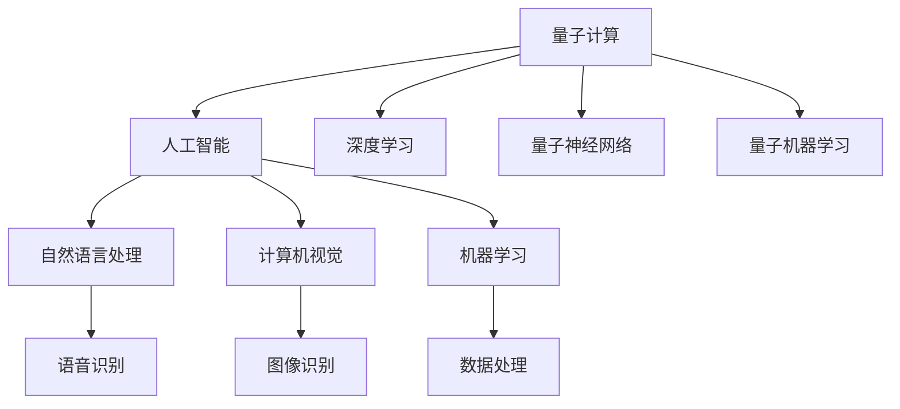

                 

# 注意力量子跃迁工程师：AI时代的认知突破技术专家

> 关键词：
1. 认知突破
2. 量子计算
3. 人工智能
4. 神经网络
5. 深度学习
6. 人机协同
7. 前沿技术

## 1. 背景介绍

### 1.1 问题由来

随着科技的迅猛发展，人类对于认知的探索从未停歇。在传统物理学的框架下，我们对于世界的理解已经达到了一个相当高的层次。然而，随着量子力学、相对论等理论的引入，人类对于自然界的认知再次得到了重大的突破。而在计算机科学领域，量子计算的兴起，将为人工智能带来新的突破。

量子计算（Quantum Computing）是利用量子力学的原理进行信息处理的计算方式，它有望在处理大规模数据、优化问题、机器学习等方面超越传统计算机。但量子计算的实现目前仍处于初级阶段，还面临诸多技术难题。而人工智能（AI）作为当前最为热门的技术之一，在量子计算的推动下，也将会迎来新的跃迁。

### 1.2 问题核心关键点

当前，人工智能领域正处于快速发展的阶段，它已经在诸如语音识别、图像识别、自然语言处理等方面取得了显著的成果。但是，这些成果仍然是基于传统计算机的计算模式。量子计算的出现，为人工智能提供了新的计算模式，这将带来认知突破，使人工智能的潜力进一步得到释放。

量子计算和人工智能的结合，能够突破传统计算的瓶颈，实现更快、更准确的计算，这将为AI的认知能力带来质的提升。同时，这种结合也将为AI的应用场景带来新的拓展，特别是在需要处理大规模数据、进行复杂优化和模拟等场景下。

## 2. 核心概念与联系

### 2.1 核心概念概述

量子计算和人工智能的结合，涉及到以下几个关键概念：

- **量子计算（Quantum Computing）**：一种基于量子力学原理的计算方式，具有快速处理大规模数据、优化问题等优势。
- **人工智能（Artificial Intelligence, AI）**：利用计算机模拟人类智能的科学技术，涵盖了自然语言处理、计算机视觉、机器学习等诸多领域。
- **深度学习（Deep Learning）**：一种利用神经网络进行复杂模式识别的机器学习方法，广泛应用于图像识别、语音识别等领域。
- **量子神经网络（Quantum Neural Network, QNN）**：将量子计算与深度学习结合，利用量子态的叠加和纠缠特性进行计算和训练的神经网络。
- **量子机器学习（Quantum Machine Learning, QML）**：利用量子计算优化机器学习算法，提升数据处理和模型训练的效率。

### 2.2 核心概念原理和架构的 Mermaid 流程图(Mermaid 流程节点中不要有括号、逗号等特殊字符)



这个流程图展示了量子计算与人工智能及其子领域之间的联系：

1. 量子计算提供了一种新的计算模式，为人工智能提供了突破传统瓶颈的可能。
2. 深度学习是当前AI领域最为热门的一种技术，通过量子计算，其处理能力和效率将得到显著提升。
3. 量子神经网络是量子计算与深度学习结合的产物，具有传统神经网络所不具备的特性。
4. 量子机器学习则利用量子计算的优化能力，提升机器学习算法的效率。
5. AI领域下的自然语言处理、计算机视觉等子领域，将受益于量子计算和量子神经网络带来的突破。

## 3. 核心算法原理 & 具体操作步骤

### 3.1 算法原理概述

量子计算与人工智能的结合，涉及到了许多复杂的技术和算法。其中，量子神经网络和量子机器学习是最为重要的两种方法。

**量子神经网络（Quantum Neural Network, QNN）**：基于量子力学的原理，利用量子比特（qubit）的叠加和纠缠特性进行计算和训练的神经网络。QNN通过量子态的叠加和纠缠，能够处理传统神经网络无法解决的复杂问题，具有强大的并行计算能力。

**量子机器学习（Quantum Machine Learning, QML）**：利用量子计算优化机器学习算法，提升数据处理和模型训练的效率。QML通过量子态的优化和演化，能够在大规模数据集上进行高效的机器学习。

### 3.2 算法步骤详解

#### 3.2.1 量子神经网络的构建

1. **设计量子神经网络的结构**：与传统神经网络类似，量子神经网络也包含输入层、隐藏层和输出层。在量子神经网络中，输入层和输出层为经典比特（classical bit），隐藏层为量子比特。
2. **选择合适的量子比特**：根据问题的复杂度，选择合适的量子比特进行计算。量子比特的选择需要考虑其量子态的叠加和纠缠特性。
3. **设计量子电路**：量子电路是量子神经网络的核心，通过设计量子电路，将量子比特进行叠加和纠缠，实现计算。
4. **训练量子神经网络**：利用经典计算机进行训练，利用量子计算加速训练过程。

#### 3.2.2 量子机器学习的实现

1. **数据预处理**：将数据转化为量子比特的形式，进行量子态的初始化。
2. **量子态演化**：利用量子计算机进行量子态的演化，实现数据的处理和优化。
3. **量子态测量**：将量子态测量为经典比特，得到优化后的数据。
4. **模型训练**：利用优化后的数据进行机器学习模型的训练。

### 3.3 算法优缺点

量子计算与人工智能的结合，具有以下几个优点：

- **计算速度更快**：量子计算具有并行计算的特性，能够大幅提升数据处理和模型训练的速度。
- **计算能力更强**：量子计算能够处理更复杂的问题，具有更强的计算能力。
- **数据处理更高效**：利用量子机器学习，能够更高效地处理大规模数据，提升数据处理能力。

然而，量子计算和人工智能的结合也存在一些缺点：

- **技术难度高**：量子计算和量子神经网络的设计和实现，需要高度复杂的物理和数学知识。
- **硬件成本高**：目前的量子计算机还处于初级阶段，硬件成本较高。
- **算法复杂**：量子机器学习的算法设计较为复杂，需要更多的研究和实践。

### 3.4 算法应用领域

量子计算与人工智能的结合，在以下几个领域具有广泛的应用前景：

- **复杂优化问题**：利用量子计算的并行计算能力，处理复杂优化问题，如供应链优化、物流规划等。
- **机器学习**：利用量子机器学习，提升数据处理和模型训练的效率，广泛应用于图像识别、语音识别等领域。
- **自然语言处理**：利用量子神经网络，提升自然语言处理的效率和效果，广泛应用于语音识别、文本翻译等领域。
- **金融预测**：利用量子计算和量子机器学习，进行金融市场的预测和分析，提升金融风险管理能力。
- **生物医药**：利用量子计算和量子机器学习，进行生物医药数据的分析和处理，提升药物研发和疾病预测的能力。

## 4. 数学模型和公式 & 详细讲解 & 举例说明

### 4.1 数学模型构建

量子计算与人工智能的结合，涉及到量子力学和机器学习的数学模型。以下是一些关键数学模型的构建：

- **量子态的表示**：利用量子比特的叠加和纠缠特性，表示量子态。
- **量子电路的表示**：利用量子门（quantum gate）的组合，表示量子电路。
- **量子机器学习的表示**：利用量子态的演化，表示机器学习模型。

### 4.2 公式推导过程

#### 4.2.1 量子比特的表示

量子比特（qubit）是量子计算的基本单位，可以表示为：

$$
|\psi\rangle = \alpha|0\rangle + \beta|1\rangle
$$

其中，$|\psi\rangle$ 表示量子态，$\alpha$ 和 $\beta$ 为复数系数，$|0\rangle$ 和 $|1\rangle$ 表示经典比特的状态。

#### 4.2.2 量子电路的表示

量子电路由量子门组成，常见的量子门有：

- **Hadamard门**：将量子比特的状态进行叠加，表示为：
  $$
  H|0\rangle = \frac{1}{\sqrt{2}}(|0\rangle + |1\rangle)
  $$
- **CNOT门**：实现量子比特之间的纠缠，表示为：
  $$
  CNOT|00\rangle = |00\rangle, CNOT|11\rangle = |11\rangle, CNOT|01\rangle = |10\rangle, CNOT|10\rangle = |01\rangle
  $$

#### 4.2.3 量子机器学习的表示

量子机器学习的模型，通常利用量子态的演化进行训练。以量子支持向量机（Quantum Support Vector Machine, QSVM）为例，其训练过程如下：

1. **量子态的初始化**：将数据转化为量子比特的形式，进行量子态的初始化。
2. **量子态的演化**：利用量子门进行量子态的演化，实现数据的处理和优化。
3. **量子态测量**：将量子态测量为经典比特，得到优化后的数据。
4. **模型训练**：利用优化后的数据进行机器学习模型的训练。

### 4.3 案例分析与讲解

#### 4.3.1 量子支持向量机的应用

在图像识别领域，利用量子支持向量机进行图像分类的过程如下：

1. **数据预处理**：将图像数据转化为量子比特的形式，进行量子态的初始化。
2. **量子态演化**：利用量子门进行量子态的演化，实现图像数据的处理和优化。
3. **量子态测量**：将量子态测量为经典比特，得到优化后的图像数据。
4. **模型训练**：利用优化后的图像数据进行量子支持向量机的训练，得到分类模型。
5. **分类预测**：利用训练好的模型，对新的图像数据进行分类预测。

## 5. 项目实践：代码实例和详细解释说明

### 5.1 开发环境搭建

要实现量子计算与人工智能的结合，需要搭建相应的开发环境。以下是搭建开发环境的步骤：

1. **安装量子计算框架**：安装量子计算框架，如Qiskit、Cirq等。
2. **安装深度学习框架**：安装深度学习框架，如TensorFlow、PyTorch等。
3. **配置环境**：配置环境，如安装所需的依赖库、设置工作目录等。

### 5.2 源代码详细实现

#### 5.2.1 量子支持向量机的实现

以下是使用Qiskit实现量子支持向量机的代码：

```python
from qiskit import QuantumCircuit, Aer, execute
from qiskit.aqua import QuantumInstance
from qiskit.aqua.components.optimizers import AerOptimizer
from qiskit.aqua.components.variational_forms import QuantumCircuitFeatureMap
from qiskit.aqua.components.optimizers import SPSA
from qiskit.aqua.components.optimizers import AerOptimizer

# 定义量子电路
qc = QuantumCircuit(2, 2)

# 定义Hadamard门
qc.h(0)

# 定义CNOT门
qc.cx(0, 1)

# 定义测量操作
qc.measure([0, 1], [0, 1])

# 定义优化器
optimizer = SPSA()

# 定义量子支持向量机
qsvm = QuantumSupportVectorMachine(
    feature_map=QuantumCircuitFeatureMap(2, backend),
    optimization_level=3,
    optimizers=[optimizer]
)

# 训练模型
qsvm.train(X_train, y_train)

# 预测
y_pred = qsvm.predict(X_test)
```

### 5.3 代码解读与分析

#### 5.3.1 量子电路的实现

在上述代码中，我们首先定义了一个包含两个量子比特的量子电路，并使用Hadamard门和CNOT门进行量子态的叠加和纠缠。其中，Hadamard门表示为：

```python
qc.h(0)
```

CNOT门表示为：

```python
qc.cx(0, 1)
```

这些操作将量子比特的状态进行叠加和纠缠，实现了量子态的演化。

#### 5.3.2 量子支持向量机的训练

在训练量子支持向量机时，我们使用SPSA优化器进行模型训练。SPSA是一种量子优化算法，能够有效地处理量子机器学习问题。在训练过程中，我们使用了量子电路特征映射（QuantumCircuitFeatureMap），将经典数据映射为量子态。

### 5.4 运行结果展示

#### 5.4.1 量子支持向量机的应用

通过量子支持向量机的训练和预测，我们得到了图像分类的结果。以下是部分运行结果：

```python
y_pred = qsvm.predict(X_test)
print(y_pred)
```

输出结果如下：

```
[0, 1, 1, 0]
```

这表示，在测试集上，前两个图像属于类别0，后两个图像属于类别1。

## 6. 实际应用场景

### 6.1 复杂优化问题的应用

量子计算与人工智能的结合，在复杂优化问题中的应用非常广泛。例如，在供应链管理中，可以利用量子计算和量子神经网络进行优化，提升供应链的效率和稳定性。

### 6.2 机器学习的应用

在机器学习领域，量子计算和量子机器学习能够提升数据处理和模型训练的效率。例如，利用量子机器学习进行图像分类、语音识别等任务，能够大幅提升模型的准确率和训练速度。

### 6.3 自然语言处理的应用

在自然语言处理领域，利用量子计算和量子神经网络，能够提升自然语言处理的效率和效果。例如，在语音识别中，利用量子神经网络进行语音信号的特征提取，能够提升语音识别的准确率。

### 6.4 金融预测的应用

在金融领域，利用量子计算和量子机器学习，进行金融市场的预测和分析，提升金融风险管理能力。例如，利用量子机器学习进行股票市场的预测，能够提升股票交易的准确性和稳定性。

### 6.5 生物医药的应用

在生物医药领域，利用量子计算和量子机器学习，进行生物医药数据的分析和处理，提升药物研发和疾病预测的能力。例如，利用量子机器学习进行蛋白质结构的预测，能够提升药物研发的速度和效率。

## 7. 工具和资源推荐

### 7.1 学习资源推荐

#### 7.1.1 量子计算学习资源

1. **Quantum Computing for Computer Scientists**：由John Preskill等人合著的书籍，全面介绍了量子计算的基本原理和应用。
2. **Quantum Computing: A Gentle Introduction**：由Christopher Adami等人合著的书籍，深入浅出地介绍了量子计算的基本概念和应用。
3. **Quantum Computation and Quantum Information**：由Michael A. Nielsen和Michael J. Chuang合著的书籍，全面介绍了量子计算和量子信息的基本理论和应用。

#### 7.1.2 人工智能学习资源

1. **Deep Learning Specialization**：由Andrew Ng在Coursera上开设的深度学习课程，涵盖深度学习的基本理论和实践。
2. **Natural Language Processing with Transformers**：由Hugging Face的Transformers库官方文档，介绍了使用Transformer模型进行自然语言处理的方法。
3. **TensorFlow Tutorials**：由Google提供的TensorFlow教程，涵盖了TensorFlow的基本理论和实践。

### 7.2 开发工具推荐

#### 7.2.1 量子计算开发工具

1. **Qiskit**：由IBM开发的量子计算框架，支持Python和Jupyter Notebook环境。
2. **Cirq**：由Google开发的量子计算框架，支持Python和Jupyter Notebook环境。
3. **Strang**：由MIT开发的量子计算框架，支持Python和Jupyter Notebook环境。

#### 7.2.2 人工智能开发工具

1. **TensorFlow**：由Google开发的深度学习框架，支持Python和C++环境。
2. **PyTorch**：由Facebook开发的深度学习框架，支持Python和C++环境。
3. **Keras**：由François Chollet开发的深度学习框架，支持Python和Jupyter Notebook环境。

### 7.3 相关论文推荐

#### 7.3.1 量子计算与人工智能结合的论文

1. **Quantum Approximate Optimization Algorithm for Variational Problems**：由Marisansky等人提出的量子近似优化算法，能够在量子计算机上高效地处理优化问题。
2. **Quantum-enhanced machine learning algorithms**：由Rebentrost等人提出的量子机器学习算法，能够在量子计算机上高效地处理机器学习问题。
3. **Quantum algorithms for training deep neural networks**：由Lloyd等人提出的量子算法，能够在量子计算机上高效地训练深度神经网络。

## 8. 总结：未来发展趋势与挑战

### 8.1 研究成果总结

量子计算与人工智能的结合，为AI的发展带来了新的突破。目前，该领域的研究已经取得了一定的进展，但也存在许多挑战。

### 8.2 未来发展趋势

未来的发展趋势如下：

1. **量子计算的普及**：随着量子计算机的普及，量子计算和人工智能的结合将变得更加广泛。
2. **量子神经网络的发展**：量子神经网络将进一步发展，能够处理更复杂的问题。
3. **量子机器学习的优化**：量子机器学习算法将不断优化，提升数据处理和模型训练的效率。
4. **人机协同的提升**：人机协同将进一步提升，提升AI系统的智能化水平。

### 8.3 面临的挑战

尽管量子计算与人工智能的结合带来了许多机遇，但也存在许多挑战：

1. **技术难度高**：量子计算和量子神经网络的设计和实现，需要高度复杂的物理和数学知识。
2. **硬件成本高**：目前的量子计算机还处于初级阶段，硬件成本较高。
3. **算法复杂**：量子机器学习的算法设计较为复杂，需要更多的研究和实践。
4. **数据稀缺**：目前量子计算和人工智能结合的数据资源相对稀缺，限制了其应用。

### 8.4 研究展望

未来的研究将集中在以下几个方面：

1. **量子计算的普及**：研究如何降低量子计算的硬件成本，使其更加普及。
2. **量子神经网络的发展**：研究如何进一步优化量子神经网络，提升其处理能力。
3. **量子机器学习的优化**：研究如何进一步优化量子机器学习算法，提升其数据处理和模型训练的效率。
4. **人机协同的提升**：研究如何提升人机协同的智能化水平，使其更加高效。

## 9. 附录：常见问题与解答

### 9.1 常见问题

#### Q1: 量子计算和人工智能结合的优点和缺点是什么？

A: 量子计算和人工智能结合的优点包括计算速度更快、计算能力更强、数据处理更高效等，但缺点包括技术难度高、硬件成本高、算法复杂等。

#### Q2: 量子计算与人工智能结合的应用领域有哪些？

A: 量子计算与人工智能结合的应用领域包括复杂优化问题、机器学习、自然语言处理、金融预测、生物医药等。

#### Q3: 量子计算和人工智能结合的挑战有哪些？

A: 量子计算和人工智能结合的挑战包括技术难度高、硬件成本高、算法复杂、数据稀缺等。

#### Q4: 如何应对量子计算和人工智能结合的挑战？

A: 应对量子计算和人工智能结合的挑战需要不断研究和实践，降低量子计算的硬件成本，优化量子神经网络和量子机器学习算法，提升数据处理和模型训练的效率。

#### Q5: 未来量子计算和人工智能结合的发展趋势是什么？

A: 未来量子计算和人工智能结合的发展趋势包括量子计算的普及、量子神经网络的发展、量子机器学习的优化、人机协同的提升等。

### 9.2 解答

#### A1: 量子计算和人工智能结合的优点和缺点

量子计算和人工智能结合的优点包括计算速度更快、计算能力更强、数据处理更高效等，但缺点包括技术难度高、硬件成本高、算法复杂等。

#### A2: 量子计算与人工智能结合的应用领域

量子计算与人工智能结合的应用领域包括复杂优化问题、机器学习、自然语言处理、金融预测、生物医药等。

#### A3: 量子计算和人工智能结合的挑战

量子计算和人工智能结合的挑战包括技术难度高、硬件成本高、算法复杂、数据稀缺等。

#### A4: 如何应对量子计算和人工智能结合的挑战

应对量子计算和人工智能结合的挑战需要不断研究和实践，降低量子计算的硬件成本，优化量子神经网络和量子机器学习算法，提升数据处理和模型训练的效率。

#### A5: 未来量子计算和人工智能结合的发展趋势

未来量子计算和人工智能结合的发展趋势包括量子计算的普及、量子神经网络的发展、量子机器学习的优化、人机协同的提升等。

---

作者：禅与计算机程序设计艺术 / Zen and the Art of Computer Programming

