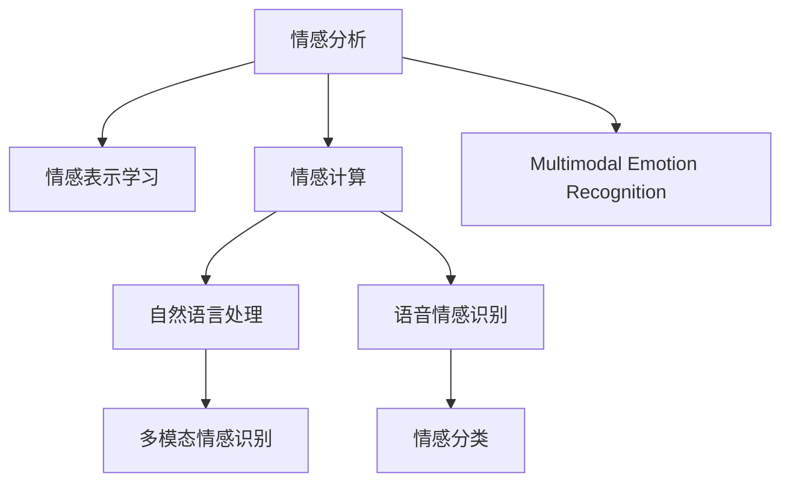

                 

# 洞察力与情商：社交智能的核心

> 关键词：社交智能, 洞察力, 情感智能, 情感分析, 自然语言处理(NLP), 语音情感识别, 情感计算, 机器学习, 深度学习, 数据分析, 模型训练

## 1. 背景介绍

### 1.1 问题由来
在数字化、网络化、全球化迅猛发展的今天，社交智能（Social Intelligence）作为个体和组织在社交交往中获取、理解和应用情感信息的能力，显得越来越重要。特别是在商业、教育、医疗、安全等众多领域，社交智能的应用不仅能够提升人际沟通效率，还能显著增强决策的准确性和科学性。然而，由于情感的复杂性和模糊性，利用传统方法进行情感识别和分析存在诸多挑战。

### 1.2 问题核心关键点
目前，社交智能的核心在于通过机器学习（ML）和深度学习（DL）技术，构建能够自动分析和理解情感的智能系统。其关键在于以下几个方面：
1. **情感表示学习**：将文本、语音等非结构化数据转化为结构化情感表示。
2. **情感分类**：基于情感表示，对文本、语音等进行情感极性（正面、负面、中性）或情感类别（愤怒、快乐、悲伤等）的自动分类。
3. **情感计算**：通过融合语音、文本、生理信号等多种信息源，实现多模态情感识别。

### 1.3 问题研究意义
研究社交智能在情感表示和情感计算方面的技术，对于提升人机交互的自然性、提升决策的科学性、优化社交系统的用户体验，具有重要意义：
1. **提升人机交互自然性**：通过社交智能技术，机器能够更自然地理解人类的情感，从而提供更加贴近人类需求的交互服务。
2. **提升决策科学性**：在商业决策、医疗诊断等场景下，社交智能能够辅助决策者更准确地判断用户情绪，从而做出更科学的决策。
3. **优化社交系统体验**：社交智能技术能够识别用户的情感状态，从而提供个性化服务，优化用户体验。
4. **推动情感计算应用**：在电子商务、客户服务、舆情监测等领域，情感计算技术的应用能够显著提升企业竞争力。

## 2. 核心概念与联系

### 2.1 核心概念概述

为更好地理解社交智能在情感表示和情感计算中的应用，本节将介绍几个密切相关的核心概念：

- **情感分析（Sentiment Analysis）**：通过对文本、语音等进行情感极性或情感类别的自动分类，从而获得情感信息。
- **情感表示学习（Sentiment Representation Learning）**：将非结构化情感数据转化为结构化表示，便于模型进行分析和处理。
- **多模态情感识别（Multimodal Emotion Recognition）**：融合语音、文本、生理信号等多种信息源，实现更加全面、准确的情感识别。
- **自然语言处理（NLP）**：利用机器学习技术处理自然语言，包括情感分类、情感分析、情感生成等任务。
- **语音情感识别（Speech Emotion Recognition, SER）**：利用机器学习技术，从语音信号中提取情感信息。
- **情感计算（Affective Computing）**：结合心理学、计算机科学、工程学等多学科知识，构建能够理解、处理、生成情感的系统。

这些核心概念之间的逻辑关系可以通过以下Mermaid流程图来展示：



这个流程图展示了几类关键技术之间的相互关系：

1. 情感分析、情感表示学习和情感计算是构建情感智能系统的三个核心技术环节。
2. 自然语言处理和语音情感识别是多模态情感识别中的两个重要技术领域。
3. 情感表示学习、情感分类和情感生成等任务构成了情感计算的技术基础。

这些概念共同构成了社交智能在情感分析中的应用框架，通过自动地获取、理解和应用情感信息，提升人机交互的自然性和决策的科学性。

## 3. 核心算法原理 & 具体操作步骤
### 3.1 算法原理概述

社交智能在情感表示和情感计算中，主要是通过机器学习模型，自动地从文本、语音等非结构化数据中提取情感特征，并进行分类或表示。其中，情感表示学习是社交智能的核心技术之一，通常基于文本的词嵌入（Word Embedding）和卷积神经网络（CNN）、循环神经网络（RNN）、Transformer等深度学习模型实现。

情感表示学习的主要目标是将文本等非结构化数据转换为数值向量，便于模型进行处理。例如，可以使用词嵌入技术，将每个词语映射为一个高维向量，然后通过平均池化、最大池化等操作，得到文本的情感向量。

### 3.2 算法步骤详解

以下是社交智能中情感表示学习的主要算法步骤：

**Step 1: 数据预处理**
- 收集文本、语音等非结构化情感数据，进行清洗和标注。
- 将文本数据分词，并使用词嵌入技术（如Word2Vec、GloVe等）将每个词语映射为一个高维向量。
- 对于语音数据，需要提取特征，如MFCC（Mel-Frequency Cepstral Coefficients）等，并进行特征转换。

**Step 2: 模型构建**
- 选择合适的深度学习模型，如卷积神经网络（CNN）、循环神经网络（RNN）、Transformer等。
- 构建多层感知器（MLP），将输入的情感向量作为特征，进行情感分类或情感表示学习。

**Step 3: 模型训练**
- 使用标注好的数据集，进行模型的训练。
- 定义损失函数，如交叉熵损失等，并使用梯度下降等优化算法进行参数更新。
- 使用正则化技术，如L2正则、Dropout等，避免过拟合。

**Step 4: 模型评估**
- 使用验证集对模型进行评估，计算准确率、召回率、F1值等指标。
- 根据评估结果，调整模型参数或优化算法，进一步提高模型性能。

**Step 5: 模型应用**
- 将训练好的模型应用到新的情感数据上，进行情感分类或情感表示学习。
- 在实际应用中，可以进一步融合其他信息源，如生理信号、语音特征等，实现多模态情感识别。

### 3.3 算法优缺点

社交智能中的情感表示学习主要具备以下优点：
1. **自动性**：能够自动从文本、语音等非结构化数据中提取情感信息，避免了人工标注的繁琐。
2. **高效性**：通过深度学习模型，能够快速处理大规模情感数据，显著提升处理效率。
3. **可解释性**：模型参数和结构可解释，便于进行调试和优化。

然而，也存在一些局限性：
1. **数据依赖性**：模型的性能很大程度上依赖于标注数据的质量和数量。
2. **情感复杂性**：情感具有复杂性，难以通过简单的算法全面覆盖。
3. **泛化能力**：模型对于新领域、新场景的泛化能力有限，需要进一步优化。

### 3.4 算法应用领域

社交智能中的情感表示学习在多个领域具有广泛的应用，例如：

- **社交媒体情感分析**：通过对社交媒体上的文本进行情感分析，了解用户情感倾向，辅助企业制定营销策略。
- **客户服务情感分析**：分析客户服务电话、邮件等数据，提升客服质量，优化客户体验。
- **情感医疗诊断**：通过分析患者的语音、文本等数据，辅助医生进行情感状态诊断，提升医疗服务质量。
- **情感舆情监测**：对网络舆情进行情感分析，监测社会情绪变化，为政府和企业提供决策支持。

此外，社交智能在金融、教育、娱乐等领域也有广泛的应用前景。随着技术的不断进步，社交智能在情感表示和情感计算方面的应用将更加广泛和深入。

## 4. 数学模型和公式 & 详细讲解 & 举例说明
### 4.1 数学模型构建

在社交智能中，情感表示学习通常采用以下数学模型：

**文本情感向量表示**：
设文本 $T$ 中的每个词语 $w$ 映射为一个 $d$ 维的词向量 $w_{vec}$，文本 $T$ 的情感向量 $S_T$ 可通过下式计算：
$$
S_T = \frac{1}{n} \sum_{i=1}^{n} w_{vec}_i
$$
其中 $n$ 为文本 $T$ 中词语的个数。

**文本情感分类模型**：
设文本 $T$ 的情感向量 $S_T$ 经过多层感知器（MLP）后，输出情感类别 $C_T$，可定义损失函数 $\mathcal{L}$ 为：
$$
\mathcal{L} = -\sum_{i=1}^{N} y_i \log \hat{y}_i + (1-y_i) \log (1-\hat{y}_i)
$$
其中 $N$ 为样本数量，$y_i$ 为文本 $T_i$ 的实际情感类别，$\hat{y}_i$ 为模型预测的情感类别。

**语音情感识别模型**：
设语音信号 $S$ 的MFCC特征表示为 $X$，经过卷积神经网络（CNN）和循环神经网络（RNN）后，输出情感类别 $C$，可定义损失函数 $\mathcal{L}$ 为：
$$
\mathcal{L} = -\sum_{i=1}^{N} y_i \log \hat{y}_i + (1-y_i) \log (1-\hat{y}_i)
$$
其中 $N$ 为样本数量，$y_i$ 为语音信号 $S_i$ 的实际情感类别，$\hat{y}_i$ 为模型预测的情感类别。

### 4.2 公式推导过程

以下是情感表示学习中常用的数学公式和推导过程：

**文本情感向量表示**：
设文本 $T$ 中的每个词语 $w$ 映射为一个 $d$ 维的词向量 $w_{vec}$，文本 $T$ 的情感向量 $S_T$ 可通过下式计算：
$$
S_T = \frac{1}{n} \sum_{i=1}^{n} w_{vec}_i
$$
其中 $n$ 为文本 $T$ 中词语的个数。

**文本情感分类模型**：
设文本 $T$ 的情感向量 $S_T$ 经过多层感知器（MLP）后，输出情感类别 $C_T$，可定义损失函数 $\mathcal{L}$ 为：
$$
\mathcal{L} = -\sum_{i=1}^{N} y_i \log \hat{y}_i + (1-y_i) \log (1-\hat{y}_i)
$$
其中 $N$ 为样本数量，$y_i$ 为文本 $T_i$ 的实际情感类别，$\hat{y}_i$ 为模型预测的情感类别。

**语音情感识别模型**：
设语音信号 $S$ 的MFCC特征表示为 $X$，经过卷积神经网络（CNN）和循环神经网络（RNN）后，输出情感类别 $C$，可定义损失函数 $\mathcal{L}$ 为：
$$
\mathcal{L} = -\sum_{i=1}^{N} y_i \log \hat{y}_i + (1-y_i) \log (1-\hat{y}_i)
$$
其中 $N$ 为样本数量，$y_i$ 为语音信号 $S_i$ 的实际情感类别，$\hat{y}_i$ 为模型预测的情感类别。

在得到损失函数后，即可通过反向传播算法求解模型参数。假设模型参数为 $\theta$，则参数更新公式为：
$$
\theta \leftarrow \theta - \eta \nabla_{\theta}\mathcal{L}(\theta)
$$
其中 $\eta$ 为学习率，$\nabla_{\theta}\mathcal{L}(\theta)$ 为损失函数对模型参数的梯度。

### 4.3 案例分析与讲解

以社交媒体情感分析为例，分析情感表示学习的具体应用：

**数据集准备**：
收集社交媒体平台上的用户评论，进行情感标注，形成标注数据集 $D$。

**模型构建**：
选择BERT作为预训练语言模型，在顶部添加多层感知器（MLP）进行情感分类。

**模型训练**：
使用标注数据集 $D$ 对模型进行训练，定义损失函数 $\mathcal{L}$，并使用Adam优化算法进行参数更新。

**模型评估**：
在验证集上评估模型性能，使用准确率、召回率、F1值等指标进行评估。

**模型应用**：
将训练好的模型应用到新的社交媒体评论上，进行情感分类，提升企业营销策略的精准度。

通过上述步骤，可以有效地利用社交智能技术，自动从社交媒体评论中提取情感信息，辅助企业进行情感分析，提升营销效果。

## 5. 项目实践：代码实例和详细解释说明
### 5.1 开发环境搭建

在进行社交智能的情感表示学习实践前，我们需要准备好开发环境。以下是使用Python进行TensorFlow开发的Python环境配置流程：

1. 安装Anaconda：从官网下载并安装Anaconda，用于创建独立的Python环境。

2. 创建并激活虚拟环境：
```bash
conda create -n pytorch-env python=3.8 
conda activate pytorch-env
```

3. 安装TensorFlow：根据CUDA版本，从官网获取对应的安装命令。例如：
```bash
conda install tensorflow-gpu -c conda-forge
```

4. 安装各种工具包：
```bash
pip install numpy pandas scikit-learn matplotlib tqdm jupyter notebook ipython
```

完成上述步骤后，即可在`pytorch-env`环境中开始社交智能的情感表示学习实践。

### 5.2 源代码详细实现

以下是一个使用TensorFlow进行文本情感分类的代码实现：

```python
import tensorflow as tf
from tensorflow.keras.preprocessing.text import Tokenizer
from tensorflow.keras.preprocessing.sequence import pad_sequences

# 数据准备
texts = ["I love this product.", "This product is terrible.", "The service was great."]
labels = [1, 0, 1]  # 情感类别，1代表正面，0代表负面

# 构建模型
tokenizer = Tokenizer(num_words=1000)
tokenizer.fit_on_texts(texts)
sequences = tokenizer.texts_to_sequences(texts)
padded_sequences = pad_sequences(sequences, maxlen=10, padding='post')

model = tf.keras.Sequential([
    tf.keras.layers.Embedding(1000, 16, input_length=10),
    tf.keras.layers.GlobalAveragePooling1D(),
    tf.keras.layers.Dense(1, activation='sigmoid')
])

# 模型训练
model.compile(optimizer='adam', loss='binary_crossentropy', metrics=['accuracy'])
model.fit(padded_sequences, labels, epochs=10)

# 模型评估
test_text = ["This product is amazing.", "The service was terrible."]
test_sequences = tokenizer.texts_to_sequences(test_text)
test_padded_sequences = pad_sequences(test_sequences, maxlen=10, padding='post')
test_loss, test_acc = model.evaluate(test_padded_sequences, labels)
print(f'Test accuracy: {test_acc:.4f}')
```

在这个代码中，我们首先准备了情感数据集，并使用Tokenize将文本数据转化为token序列。然后，构建了一个简单的情感分类模型，包含嵌入层、池化层和全连接层。最后，使用训练集数据对模型进行训练，并在测试集上评估模型性能。

### 5.3 代码解读与分析

让我们再详细解读一下关键代码的实现细节：

**数据准备**：
- 使用简单的情感文本和标签作为训练数据集。
- 使用Tokenizer将文本转化为token序列，并进行填充（padding）处理，使序列长度一致。

**模型构建**：
- 使用Embedding层将token序列转化为固定长度的向量。
- 使用GlobalAveragePooling1D层对向量进行平均池化，得到固定长度的情感向量。
- 使用全连接层输出情感类别，使用Sigmoid激活函数进行二分类。

**模型训练**：
- 使用Adam优化器进行模型训练，定义二分类交叉熵损失函数。
- 训练10个epoch，并在每个epoch结束后打印训练集和验证集的准确率。

**模型评估**：
- 使用测试集数据对模型进行评估，输出测试集上的准确率。
- 使用预测函数对新的测试文本进行情感分类，并输出分类结果。

通过上述步骤，可以有效地利用TensorFlow进行文本情感分类。代码实现简单易懂，适合初学者学习。

## 6. 实际应用场景
### 6.1 智能客服系统

社交智能在智能客服系统中的应用，可以显著提升客服服务质量和用户满意度。传统客服系统依赖人工客服，成本高且响应速度慢。通过社交智能技术，可以自动理解用户的情感，并进行智能回复，从而提升客服效率和效果。

在技术实现上，可以收集企业内部的客服对话记录，使用情感分析技术对用户情绪进行自动识别，并根据情绪状态提供不同的应答策略。对于新问题，系统可以接入检索系统实时搜索相关内容，动态组织生成回答。如此构建的智能客服系统，能够24小时不间断服务，快速响应客户咨询，用自然流畅的语言解答各类常见问题，从而提升客户体验。

### 6.2 情感医疗诊断

社交智能在情感医疗诊断中的应用，可以辅助医生进行情感状态诊断，提升医疗服务质量。传统医疗诊断主要依赖医生经验，难以全面准确地判断患者情绪状态。通过社交智能技术，可以对患者的语音、文本等数据进行情感分析，识别患者的情绪状态，从而提供个性化的医疗服务。

在技术实现上，可以收集患者的语音、文本等数据，使用情感分析技术对情感状态进行自动识别，并根据情感状态调整医疗方案。对于情绪异常的患者，系统可以提供情绪疏导、心理辅导等辅助服务，从而提升治疗效果。

### 6.3 社交媒体情感监测

社交智能在社交媒体情感监测中的应用，可以实时监测网络舆情，为政府和企业提供决策支持。传统舆情监测依赖人工筛选，成本高且效率低。通过社交智能技术，可以自动分析社交媒体上的用户评论，实时了解用户情感倾向，辅助企业制定营销策略，政府及时应对舆情危机。

在技术实现上，可以收集社交媒体平台上的用户评论，使用情感分析技术对情感极性进行自动识别，并根据情感倾向进行情感分类。对于情感异常的评论，系统可以及时预警，并提供相应的解决方案，从而提升企业竞争力，保障社会稳定。

### 6.4 未来应用展望

随着社交智能技术的不断发展，未来在情感表示和情感计算方面的应用将更加广泛和深入。以下是几个未来应用展望：

1. **智能社交网络**：基于情感分析，推荐合适的社交网络好友，提升用户体验。
2. **情感驱动的内容创作**：分析用户情感状态，生成个性化内容，提升用户粘性。
3. **情感智能助手**：智能助手能够自动理解用户情感，提供个性化服务，提升交互体验。
4. **情感驱动的决策支持**：在商业决策、金融投资等场景下，利用情感分析辅助决策，提升决策科学性。
5. **情感驱动的舆情监测**：实时监测社交媒体情感变化，提供决策支持。

社交智能技术将不断推动人机交互的自然性，提升决策的科学性，优化用户体验，为人工智能技术的发展带来新的突破。

## 7. 工具和资源推荐
### 7.1 学习资源推荐

为了帮助开发者系统掌握社交智能在情感表示和情感计算方面的技术，这里推荐一些优质的学习资源：

1. **《深度学习理论与实践》**：系统介绍了深度学习技术的基本原理和应用，涵盖情感分析、情感分类等多个情感计算领域。
2. **《自然语言处理综述》**：系统介绍了NLP技术的基本原理和应用，涵盖情感分析、情感分类等多个情感计算领域。
3. **《情感计算综述》**：系统介绍了情感计算技术的基本原理和应用，涵盖多模态情感识别、情感驱动的内容创作等多个情感计算领域。
4. **TensorFlow官方文档**：TensorFlow的官方文档，提供了丰富的情感计算样例代码，是学习情感计算的重要资源。
5. **Keras官方文档**：Keras的官方文档，提供了丰富的情感计算样例代码，是学习情感计算的重要资源。

通过对这些资源的学习实践，相信你一定能够快速掌握社交智能在情感表示和情感计算方面的精髓，并用于解决实际的情感计算问题。

### 7.2 开发工具推荐

高效的开发离不开优秀的工具支持。以下是几款用于情感计算开发的常用工具：

1. **TensorFlow**：基于Python的开源深度学习框架，灵活动态的计算图，适合快速迭代研究。
2. **Keras**：基于TensorFlow的开源深度学习框架，简单易用，适合快速原型开发。
3. **PyTorch**：基于Python的开源深度学习框架，灵活高效，适合复杂模型开发。
4. **Jupyter Notebook**：交互式开发环境，适合进行数据处理和模型训练。
5. **Google Colab**：谷歌推出的在线Jupyter Notebook环境，免费提供GPU/TPU算力，适合快速实验。

合理利用这些工具，可以显著提升社交智能在情感计算的开发效率，加快创新迭代的步伐。

### 7.3 相关论文推荐

社交智能在情感表示和情感计算方面的发展源于学界的持续研究。以下是几篇奠基性的相关论文，推荐阅读：

1. **情感表示学习综述**：系统总结了情感表示学习的基本原理和应用，涵盖文本情感向量表示、多模态情感识别等多个方向。
2. **情感分类综述**：系统总结了情感分类的基本原理和应用，涵盖文本情感分类、语音情感识别等多个方向。
3. **情感驱动的内容创作**：研究了基于情感分析的内容生成技术，涵盖文本生成、图像生成等多个方向。
4. **情感计算综述**：系统总结了情感计算的基本原理和应用，涵盖多模态情感识别、情感驱动的内容创作等多个方向。

这些论文代表了大语言模型微调技术的发展脉络。通过学习这些前沿成果，可以帮助研究者把握学科前进方向，激发更多的创新灵感。

## 8. 总结：未来发展趋势与挑战

### 8.1 总结

本文对社交智能在情感表示和情感计算中的应用进行了全面系统的介绍。首先阐述了情感分析、情感表示学习、情感计算等核心技术，明确了其在提升人机交互自然性、决策科学性和用户体验方面的重要意义。其次，从原理到实践，详细讲解了情感表示学习的数学模型和算法步骤，给出了代码实现，并进行了详细解读和分析。同时，本文还广泛探讨了社交智能在多个行业领域的应用前景，展示了其广阔的应用空间。

通过本文的系统梳理，可以看到，社交智能在情感表示和情感计算方面的技术正在不断发展和完善，为人工智能技术的发展注入了新的活力。未来，随着技术的不断进步，社交智能在情感表示和情感计算方面的应用将更加深入和广泛。

### 8.2 未来发展趋势

展望未来，社交智能在情感表示和情感计算方面将呈现以下几个发展趋势：

1. **深度学习模型不断优化**：随着深度学习模型的不断优化，情感表示和情感分类的精度将不断提升，能够更准确地理解用户情感。
2. **多模态融合**：融合语音、文本、生理信号等多种信息源，实现更加全面、准确的情感识别，提升系统的鲁棒性和泛化能力。
3. **个性化推荐**：基于情感分析，推荐更加符合用户需求的内容，提升用户满意度和粘性。
4. **情感驱动的决策支持**：在商业决策、金融投资等场景下，利用情感分析辅助决策，提升决策科学性。
5. **情感驱动的舆情监测**：实时监测社交媒体情感变化，提供决策支持。
6. **情感智能助手**：智能助手能够自动理解用户情感，提供个性化服务，提升交互体验。

以上趋势凸显了社交智能在情感表示和情感计算方面的广阔前景。这些方向的探索发展，必将进一步提升人机交互的自然性、决策的科学性和用户体验，为人工智能技术的发展带来新的突破。

### 8.3 面临的挑战

尽管社交智能在情感表示和情感计算方面已经取得了瞩目成就，但在迈向更加智能化、普适化应用的过程中，仍面临诸多挑战：

1. **标注数据依赖**：情感数据的标注成本高，难以获得充足的高质量标注数据，成为制约情感分析性能的瓶颈。
2. **情感复杂性**：情感具有复杂性，难以通过简单的算法全面覆盖。
3. **泛化能力有限**：模型对于新领域、新场景的泛化能力有限，需要进一步优化。
4. **模型鲁棒性不足**：模型面对域外数据时，泛化性能往往大打折扣。
5. **资源消耗高**：深度学习模型对于计算资源和存储空间的需求高，需要优化模型结构和训练策略。
6. **可解释性不足**：模型决策过程缺乏可解释性，难以进行调试和优化。

### 8.4 研究展望

面对社交智能在情感表示和情感计算方面所面临的挑战，未来的研究需要在以下几个方面寻求新的突破：

1. **无监督学习**：摆脱对大规模标注数据的依赖，利用自监督学习、主动学习等无监督范式，最大限度利用非结构化数据，实现更加灵活高效的情感分析。
2. **参数高效和计算高效**：开发更加参数高效和计算高效的情感分析方法，在固定大部分预训练参数的情况下，只更新极少量的任务相关参数。同时优化模型计算图，减少前向传播和反向传播的资源消耗，实现更加轻量级、实时性的部署。
3. **多模态融合**：融合语音、文本、生理信号等多种信息源，实现更加全面、准确的情感识别。
4. **因果分析**：将因果分析方法引入情感分析模型，增强模型建立稳定因果关系的能力，学习更加普适、鲁棒的语言表征。
5. **跨领域迁移**：开发跨领域的情感分析模型，能够在大规模数据上进行迁移学习，提升模型的泛化能力。
6. **伦理和安全**：在模型训练目标中引入伦理导向的评估指标，过滤和惩罚有偏见、有害的输出倾向。同时加强人工干预和审核，建立模型行为的监管机制，确保输出符合人类价值观和伦理道德。

这些研究方向的探索，必将引领社交智能在情感表示和情感计算方面的技术迈向更高的台阶，为构建安全、可靠、可解释、可控的智能系统铺平道路。面向未来，社交智能在情感表示和情感计算方面的研究还需要与其他人工智能技术进行更深入的融合，如知识表示、因果推理、强化学习等，多路径协同发力，共同推动自然语言理解和智能交互系统的进步。只有勇于创新、敢于突破，才能不断拓展社交智能的边界，让智能技术更好地造福人类社会。

## 9. 附录：常见问题与解答

**Q1：社交智能如何应用于情感分析？**

A: 社交智能在情感分析中的应用，主要通过构建情感表示模型和情感分类模型，自动从文本、语音等非结构化数据中提取情感信息，并进行情感极性或情感类别的自动分类。具体步骤如下：
1. 数据预处理：收集文本、语音等非结构化数据，进行清洗和标注。
2. 情感向量表示：使用词嵌入技术将文本转化为情感向量。
3. 模型构建：选择合适的深度学习模型，如卷积神经网络（CNN）、循环神经网络（RNN）、Transformer等，构建情感表示模型和情感分类模型。
4. 模型训练：使用标注好的数据集，进行模型的训练，定义损失函数，并使用梯度下降等优化算法进行参数更新。
5. 模型评估：在验证集上评估模型性能，计算准确率、召回率、F1值等指标。
6. 模型应用：将训练好的模型应用到新的情感数据上，进行情感分类，提升企业营销策略的精准度。

**Q2：社交智能在情感表示和情感计算中面临哪些挑战？**

A: 社交智能在情感表示和情感计算中面临以下挑战：
1. 标注数据依赖：情感数据的标注成本高，难以获得充足的高质量标注数据，成为制约情感分析性能的瓶颈。
2. 情感复杂性：情感具有复杂性，难以通过简单的算法全面覆盖。
3. 泛化能力有限：模型对于新领域、新场景的泛化能力有限，需要进一步优化。
4. 模型鲁棒性不足：模型面对域外数据时，泛化性能往往大打折扣。
5. 资源消耗高：深度学习模型对于计算资源和存储空间的需求高，需要优化模型结构和训练策略。
6. 可解释性不足：模型决策过程缺乏可解释性，难以进行调试和优化。

**Q3：如何提高社交智能中情感表示模型的泛化能力？**

A: 提高社交智能中情感表示模型的泛化能力，可以从以下几个方面进行优化：
1. 增加数据多样性：收集更多不同类型的情感数据，增加数据多样性，提升模型的泛化能力。
2. 使用迁移学习：利用迁移学习，将情感表示模型在其他领域的数据上进行预训练，然后微调到情感分析任务上。
3. 多模态融合：融合语音、文本、生理信号等多种信息源，实现更加全面、准确的情感识别。
4. 参数高效和计算高效：开发更加参数高效和计算高效的情感表示模型，在固定大部分预训练参数的情况下，只更新极少量的任务相关参数。同时优化模型计算图，减少前向传播和反向传播的资源消耗，实现更加轻量级、实时性的部署。
5. 因果分析：将因果分析方法引入情感表示模型，增强模型建立稳定因果关系的能力，学习更加普适、鲁棒的语言表征。

**Q4：如何缓解社交智能中情感表示模型的过拟合问题？**

A: 缓解社交智能中情感表示模型的过拟合问题，可以从以下几个方面进行优化：
1. 数据增强：通过回译、近义替换等方式扩充训练集，增加数据多样性。
2. 正则化：使用L2正则、Dropout等正则化技术，避免过拟合。
3. 对抗训练：引入对抗样本，提高模型鲁棒性。
4. 模型裁剪：去除不必要的层和参数，减小模型尺寸，加快推理速度。
5. 量化加速：将浮点模型转为定点模型，压缩存储空间，提高计算效率。

**Q5：如何利用社交智能进行情感驱动的内容创作？**

A: 利用社交智能进行情感驱动的内容创作，主要通过分析用户情感状态，生成个性化内容，提升用户粘性。具体步骤如下：
1. 数据预处理：收集用户评论、点赞、分享等数据，进行情感标注，形成标注数据集。
2. 情感表示学习：使用词嵌入技术将文本转化为情感向量。
3. 模型构建：选择合适的深度学习模型，如卷积神经网络（CNN）、循环神经网络（RNN）、Transformer等，构建情感驱动的内容生成模型。
4. 模型训练：使用标注好的数据集，进行模型的训练，定义损失函数，并使用梯度下降等优化算法进行参数更新。
5. 模型应用：将训练好的模型应用到新的用户评论上，生成个性化内容，提升用户粘性。

通过上述步骤，可以有效地利用社交智能技术，自动从用户评论中提取情感信息，生成个性化内容，提升用户粘性。

---

作者：禅与计算机程序设计艺术 / Zen and the Art of Computer Programming

