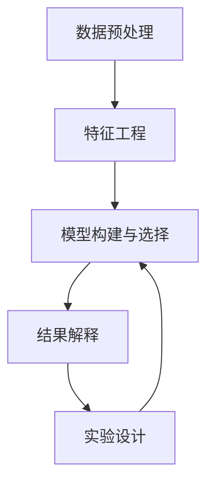

                 

# 洞察力与预测：数据分析的艺术与科学

数据分析是一门涉及多个领域的综合性学科，其核心目的是从海量数据中提取有价值的洞察力，为决策提供科学依据。本文将深入探讨数据分析的艺术与科学，涵盖从数据预处理、模型构建到结果解释的各个环节。我们将通过逻辑清晰、结构紧凑的专业语言，揭示数据分析背后的原理与方法。

## 1. 背景介绍

数据分析在现代社会中的应用日益广泛，几乎涉及各个行业和领域。例如，金融行业的风险控制、市场营销中的消费者行为分析、医疗健康中的疾病预测与诊断等，都离不开数据分析的支持。然而，数据分析不仅仅是简单的数据处理和可视化，更是一项高度综合的艺术和科学。

在技术层面，数据分析依赖于先进的统计学、机器学习、数据挖掘等方法，而从艺术角度看，如何提出有意义的假设、设计合理的实验、以及如何将复杂的结果用简明的方式呈现给决策者，都是数据分析师需要考虑的重要因素。

## 2. 核心概念与联系

### 2.1 核心概念概述

为更好地理解数据分析的全过程，本节将介绍几个关键概念及其相互关系：

- 数据预处理：指从原始数据中清洗、整理、转换，使之符合后续分析要求的过程。包括缺失值处理、异常值检测、数据归一化等步骤。

- 特征工程：通过对原始数据进行特征提取、选择、变换等操作，提升模型的表现。特征工程是数据分析中不可或缺的一环，其质量直接影响模型预测的准确性。

- 模型构建与选择：根据问题类型选择合适的统计模型或机器学习模型，并进行训练和调参，优化模型性能。常见的模型包括线性回归、决策树、随机森林、神经网络等。

- 结果解释：将模型预测结果转化为易于理解的业务洞察，帮助决策者做出明智的决策。这需要对模型的预测机制有深刻理解，并能将结果与实际业务场景相结合。

- 实验设计：通过合理的实验设计，确保结果的可重复性和可靠性。实验设计包括确定实验目的、选择实验方法、控制变量等步骤。

这些概念之间的逻辑关系可以通过以下Mermaid流程图来展示：



这个流程图展示了大数据分析的主要流程：

1. 数据预处理：确保数据质量，为后续分析奠定基础。
2. 特征工程：通过特征提取提升模型性能。
3. 模型构建与选择：选择合适的模型并进行训练调参。
4. 结果解释：将模型预测结果转化为业务洞察。
5. 实验设计：确保实验结果的可靠性和可重复性。

通过理解这些核心概念，我们可以更好地把握数据分析的全过程和关键点。

## 3. 核心算法原理 & 具体操作步骤

### 3.1 算法原理概述

数据分析的核心算法原理主要基于统计学和机器学习理论。其目标是构建模型以从数据中发现模式、识别规律，并预测未来趋势。以线性回归模型为例，其基本原理是通过最小化预测值与实际值之间的差异，即均方误差，来拟合出一条最佳拟合线。

### 3.2 算法步骤详解

数据分析的过程通常包括以下几个关键步骤：

**Step 1: 数据预处理**

- 清洗数据：删除或填补缺失值，处理异常值，对数据进行归一化或标准化。
- 数据分割：将数据集分为训练集、验证集和测试集。

**Step 2: 特征工程**

- 特征提取：从原始数据中提取对模型有帮助的特征，如文本中的TF-IDF特征、时间序列中的季节性特征等。
- 特征选择：选择对模型贡献最大的特征，减少过拟合。
- 特征变换：对特征进行变换，如对数变换、PCA降维等，提升模型表现。

**Step 3: 模型构建与选择**

- 选择模型：根据问题类型和数据特点选择合适的模型，如线性回归、决策树、神经网络等。
- 训练模型：使用训练集数据，通过最小化损失函数优化模型参数。
- 模型评估：在验证集上评估模型性能，选择最优模型。

**Step 4: 结果解释**

- 模型解读：理解模型的预测机制，分析模型输出的结果。
- 结果可视化：使用图表、报告等形式，将结果呈现给决策者。

**Step 5: 实验设计**

- 确定实验目的：明确要解决的问题。
- 设计实验方案：选择合适的实验方法，控制变量。
- 实验结果验证：在测试集上验证实验结果。

以上步骤构成了数据分析的主要流程，每一步都需要精心设计和操作，才能得出可靠的结果。

### 3.3 算法优缺点

数据分析方法具有以下优点：

- 客观性：基于数据而非主观判断，结果具有客观性和可靠性。
- 可解释性：数据分析的模型和结果可以追溯，具有较强的可解释性。
- 可操作性：数据分析方法在实际应用中容易实现，适合在各行各业推广。

同时，数据分析也存在一些局限性：

- 数据依赖：分析结果的准确性高度依赖于数据的质量和量。
- 模型假设：大多数模型都有一定的假设条件，可能不适用于某些特定场景。
- 计算成本：复杂模型的训练和优化需要大量的计算资源。
- 结果不确定性：数据分析结果具有一定的不确定性，需要结合实际经验进行判断。

数据分析方法需要在实际应用中，根据具体问题选择合适的工具和技术，并不断优化和改进。

### 3.4 算法应用领域

数据分析方法广泛应用于以下领域：

- 金融分析：通过对历史数据进行统计分析，预测市场趋势，控制风险。
- 市场营销：分析消费者行为，优化广告投放策略，提升销售效果。
- 医疗健康：通过数据分析，辅助诊断疾病，制定个性化治疗方案。
- 自然灾害预测：利用气象数据，预测自然灾害的发生，降低损失。
- 供应链管理：分析供应链数据，优化库存管理，提高物流效率。

这些领域的数据分析都具有独特的挑战和要求，需要结合具体问题进行设计和实施。

## 4. 数学模型和公式 & 详细讲解

### 4.1 数学模型构建

数据分析的数学模型通常基于概率论和统计学理论，以描述数据分布和变量之间的关系。以下以线性回归模型为例，构建其数学模型：

假设数据集 $D = \{(x_i, y_i)\}_{i=1}^N$，其中 $x_i$ 为自变量，$y_i$ 为因变量，我们希望构建一个线性回归模型 $y = \theta_0 + \theta_1 x_1 + \cdots + \theta_k x_k$ 来拟合数据。模型的最小化损失函数为：

$$
\mathcal{L}(\theta) = \frac{1}{2N} \sum_{i=1}^N (y_i - \theta_0 - \theta_1 x_{i1} - \cdots - \theta_k x_{ik})^2
$$

求解上述最小化问题，得到最优参数 $\theta$。

### 4.2 公式推导过程

线性回归模型的推导过程如下：

1. 定义目标函数：$\mathcal{L}(\theta) = \frac{1}{2N} \sum_{i=1}^N (y_i - \theta_0 - \theta_1 x_{i1} - \cdots - \theta_k x_{ik})^2$

2. 对 $\theta_0, \theta_1, \cdots, \theta_k$ 分别求偏导数：

$$
\frac{\partial \mathcal{L}(\theta)}{\partial \theta_0} = \frac{1}{N} \sum_{i=1}^N (y_i - \hat{y}_i)
$$

$$
\frac{\partial \mathcal{L}(\theta)}{\partial \theta_j} = \frac{1}{N} \sum_{i=1}^N (y_i - \hat{y}_i)x_{ij}
$$

其中 $\hat{y}_i = \theta_0 + \theta_1 x_{i1} + \cdots + \theta_k x_{ik}$。

3. 令偏导数等于0，解方程组：

$$
\begin{cases}
\frac{1}{N} \sum_{i=1}^N (y_i - \hat{y}_i) = 0 \\
\frac{1}{N} \sum_{i=1}^N (y_i - \hat{y}_i)x_{ij} = 0, j = 1, \cdots, k
\end{cases}
$$

4. 求解上述方程组，得到最优参数 $\theta$。

### 4.3 案例分析与讲解

以股票市场价格预测为例，假设我们收集了历史股价数据 $(x_i, y_i)$，其中 $x_i$ 为时间序列，$y_i$ 为当天的收盘价。通过线性回归模型，我们希望预测未来的股价走势。

首先，对数据进行预处理，清洗缺失值、处理异常值，并将数据分为训练集和测试集。然后，对特征进行提取和选择，选取时间序列作为自变量。接下来，构建线性回归模型，并使用训练集数据进行拟合和调参。最后，在测试集上评估模型性能，验证模型的预测效果。

## 5. 项目实践：代码实例和详细解释说明

### 5.1 开发环境搭建

在进行数据分析项目实践前，我们需要准备好开发环境。以下是使用Python进行数据分析的常用环境配置流程：

1. 安装Anaconda：从官网下载并安装Anaconda，用于创建独立的Python环境。

2. 创建并激活虚拟环境：
```bash
conda create -n analytics-env python=3.8 
conda activate analytics-env
```

3. 安装必要的Python库：
```bash
conda install pandas numpy matplotlib scikit-learn statsmodels jupyter notebook ipython
```

4. 配置Jupyter Notebook环境：
```bash
jupyter notebook --allow-root
```

完成上述步骤后，即可在`analytics-env`环境中开始数据分析实践。

### 5.2 源代码详细实现

以下是一个使用Pandas和Scikit-learn库进行线性回归数据分析的代码实现：

```python
import pandas as pd
from sklearn.linear_model import LinearRegression
from sklearn.metrics import mean_squared_error
import matplotlib.pyplot as plt

# 加载数据集
data = pd.read_csv('data.csv')

# 数据预处理
data = data.dropna()
data['date'] = pd.to_datetime(data['date'])

# 特征工程
X = data[['open', 'high', 'low', 'volume']]
y = data['close']

# 模型构建与选择
model = LinearRegression()
model.fit(X, y)

# 模型评估
y_pred = model.predict(X)
mse = mean_squared_error(y, y_pred)
print('MSE:', mse)

# 结果可视化
plt.scatter(y, y_pred)
plt.xlabel('Actual')
plt.ylabel('Predicted')
plt.show()
```

代码中，我们使用Pandas库读取和预处理数据集，使用Scikit-learn库构建和训练线性回归模型，并使用Matplotlib库进行结果可视化。

### 5.3 代码解读与分析

让我们再详细解读一下关键代码的实现细节：

**数据预处理**

- `data = pd.read_csv('data.csv')`：使用Pandas库读取CSV格式的数据集。
- `data = data.dropna()`：删除数据集中缺失值。
- `data['date'] = pd.to_datetime(data['date'])`：将日期字符串转换为Pandas的日期格式。

**特征工程**

- `X = data[['open', 'high', 'low', 'volume']]`：选择股票数据中的四个特征作为自变量。
- `y = data['close']`：选择收盘价作为因变量。

**模型构建与选择**

- `model = LinearRegression()`：实例化线性回归模型。
- `model.fit(X, y)`：使用训练集数据拟合模型。

**模型评估**

- `y_pred = model.predict(X)`：使用模型进行预测。
- `mse = mean_squared_error(y, y_pred)`：计算预测值与真实值之间的均方误差。

**结果可视化**

- `plt.scatter(y, y_pred)`：绘制实际值与预测值之间的散点图。
- `plt.xlabel('Actual')`：设置X轴标签为'Actual'。
- `plt.ylabel('Predicted')`：设置Y轴标签为'Predicted'。
- `plt.show()`：显示图表。

可以看到，通过Pandas、Scikit-learn和Matplotlib等库，数据分析任务变得简单易行。开发者可以将更多精力放在数据处理和模型设计上，而不必过多关注底层的实现细节。

## 6. 实际应用场景

### 6.1 金融市场分析

金融市场分析是数据分析的重要应用领域之一。通过数据分析，投资者可以预测市场趋势，制定投资策略，规避风险。

在实践中，可以收集历史股价数据、交易量、宏观经济指标等数据，通过构建多元线性回归模型，分析不同因素对股价的影响。例如，可以利用时间序列数据进行股票价格预测，利用回归模型进行财务指标与股价的关系分析，以及利用机器学习算法进行市场情绪分析。

### 6.2 市场营销策略优化

市场营销策略优化是数据分析的另一个重要应用领域。通过数据分析，企业可以了解消费者行为，优化广告投放策略，提升销售效果。

在实践中，可以收集消费者的购买记录、浏览行为、评价反馈等数据，通过构建聚类分析模型，识别不同消费群体的特征和需求，并利用回归模型进行需求预测。例如，可以利用回归模型分析不同广告投放渠道的效果，利用聚类分析模型识别不同消费群体的购买行为特征，以及利用机器学习算法进行个性化推荐。

### 6.3 医疗健康诊断

医疗健康诊断是数据分析的另一个重要应用领域。通过数据分析，医生可以辅助诊断疾病，制定个性化治疗方案。

在实践中，可以收集患者的病历记录、基因数据、影像数据等数据，通过构建多元回归模型，分析不同因素对疾病的影响。例如，可以利用回归模型分析基因数据对疾病风险的影响，利用聚类分析模型识别不同疾病的特征，以及利用机器学习算法进行疾病预测和分类。

## 7. 工具和资源推荐

### 7.1 学习资源推荐

为了帮助开发者系统掌握数据分析的理论基础和实践技巧，这里推荐一些优质的学习资源：

1. 《Python数据科学手册》：详细介绍了使用Python进行数据分析的各个环节，包括数据处理、统计分析、可视化等。

2. 《统计学习方法》：由李航所著，全面介绍了统计学习的理论基础和常用算法，适合数据分析初学者入门。

3. 《深度学习》：由Ian Goodfellow、Yoshua Bengio和Aaron Courville合著，详细介绍了深度学习理论和实践，适合有基础的数据分析师进阶学习。

4. 《数据科学实战》：由Joel Grus所著，通过实例讲解了如何使用Python进行数据科学实践，适合初学者入门。

5. Kaggle：数据科学竞赛平台，提供大量开源数据集和竞赛题目，是练习数据分析技巧的绝佳场所。

通过对这些资源的学习实践，相信你一定能够快速掌握数据分析的精髓，并用于解决实际的业务问题。

### 7.2 开发工具推荐

高效的数据分析离不开优秀的工具支持。以下是几款用于数据分析开发的常用工具：

1. Python：数据科学的首选语言，具有丰富的第三方库和生态系统，适合进行复杂数据分析任务。

2. R语言：专注于统计分析和数据可视化，适合进行复杂的统计建模和数据分析。

3. SQL：关系型数据库的语言，适合进行数据查询和处理。

4. Jupyter Notebook：支持多种编程语言，适合进行交互式数据分析和模型构建。

5. Tableau：数据可视化工具，适合进行数据探索和结果呈现。

6. Power BI：微软的商业智能工具，适合进行数据报告和可视化。

合理利用这些工具，可以显著提升数据分析的效率和质量，加速业务创新迭代。

### 7.3 相关论文推荐

数据分析方法的演进离不开学界的持续研究。以下是几篇奠基性的相关论文，推荐阅读：

1. "An Introduction to Statistical Learning"：由Gareth James、Daniela Witten、Trevor Hastie和Robert Tibshirani合著，全面介绍了统计学习理论和常用算法，是数据分析的入门必读。

2. "Pattern Recognition and Machine Learning"：由Christopher Bishop所著，详细介绍了机器学习的理论和实践，适合有基础的数据分析师进阶学习。

3. "Data Science for Business"：由Jill Groffman、Forrest M. Nayar和Kevan Viswanathan合著，从商业角度讲解了数据科学的应用，适合数据分析师实践应用。

4. "The Elements of Statistical Learning"：由Tibshirani、Hastie和Frank合著，详细介绍了统计学习理论和算法，适合数据分析师进阶学习。

这些论文代表了大数据分析技术的发展脉络。通过学习这些前沿成果，可以帮助研究者把握学科前进方向，激发更多的创新灵感。

## 8. 总结：未来发展趋势与挑战

### 8.1 总结

本文对数据分析的艺术与科学进行了全面系统的介绍。首先阐述了数据分析的重要性，明确了数据分析在各行各业的应用前景。其次，从原理到实践，详细讲解了数据分析的全过程，包括数据预处理、特征工程、模型构建与选择、结果解释等各个环节。最后，探讨了数据分析在金融市场分析、市场营销策略优化、医疗健康诊断等具体领域的应用，展示了数据分析技术的巨大潜力。

通过本文的系统梳理，可以看到，数据分析技术在现代社会中的应用日益广泛，数据分析方法也逐步从简单的统计分析向复杂的多模态数据分析、深度学习等方向发展。数据分析正成为各行各业的重要工具，助力企业决策，提升业务效率。

### 8.2 未来发展趋势

展望未来，数据分析技术将呈现以下几个发展趋势：

1. 数据量激增：随着物联网、大数据等技术的普及，数据量呈指数级增长，数据分析的应用场景将更加广泛。

2. 多模态数据融合：除了传统的数值型数据，更多非结构化数据（如文本、图像、语音）将被纳入分析范畴，多模态数据融合成为热点。

3. 深度学习应用：深度学习技术在数据分析中的应用将更加广泛，神经网络、卷积神经网络等技术将被更多地用于数据分析任务。

4. 实时数据分析：实时数据分析技术的应用将更加普及，企业可以实时监测业务数据，快速响应市场变化。

5. 自动化和智能化：自动化数据分析工具和智能数据分析系统的普及，将极大地提升数据分析效率，降低人工成本。

6. 数据隐私保护：数据隐私保护成为数据安全的重要课题，如何在保护隐私的前提下进行数据分析，将是未来研究的热点。

以上趋势凸显了数据分析技术的广阔前景，数据分析技术将不断演进，为各行各业带来新的变革和机遇。

### 8.3 面临的挑战

尽管数据分析技术的发展迅速，但仍然面临许多挑战：

1. 数据质量问题：数据缺失、异常、噪声等问题常常影响数据分析结果的准确性，需要更多的数据清洗和处理技术。

2. 数据孤岛现象：不同数据源之间缺乏整合，导致数据难以共享和分析，需要推动数据标准化和集成。

3. 数据安全问题：数据隐私和安全成为数据分析的重要瓶颈，如何保护数据隐私，防止数据泄露，是未来研究的重要课题。

4. 模型可解释性：复杂模型的预测结果难以解释，需要更多的可解释性工具和算法，增强模型的透明度。

5. 计算资源限制：大数据和深度学习模型需要大量的计算资源，如何提高计算效率，优化算法，是未来研究的重要方向。

6. 业务理解：数据分析结果需要结合业务背景进行解读，需要更多的跨领域知识，提升数据科学家的业务理解能力。

这些挑战需要学术界和产业界共同努力，才能促进数据分析技术的进一步发展。

### 8.4 研究展望

面对数据分析面临的挑战，未来的研究需要在以下几个方面寻求新的突破：

1. 数据治理和标准化：推动数据治理和标准化，解决数据孤岛问题，提升数据质量和可分析性。

2. 自动化数据清洗和处理：开发自动化的数据清洗和处理工具，提升数据清洗效率和质量。

3. 数据隐私保护技术：开发高效的数据隐私保护技术，确保数据安全，保护用户隐私。

4. 可解释性模型开发：开发更多可解释性强的模型，增强模型的透明性和可理解性。

5. 分布式计算和云计算：开发分布式计算和云计算技术，提升大数据和深度学习模型的计算效率。

6. 跨领域知识融合：推动数据科学家与业务专家的跨领域合作，提升数据分析的业务理解和应用价值。

这些研究方向的探索，必将引领数据分析技术迈向更高的台阶，为各行各业带来新的突破和创新。

## 9. 附录：常见问题与解答

**Q1：数据分析中的数据预处理和特征工程有什么作用？**

A: 数据预处理和特征工程是数据分析中非常重要的两个步骤，它们的作用如下：

- 数据预处理：通过清洗、整理、转换数据，确保数据质量，为后续分析奠定基础。
- 特征工程：通过对原始数据进行特征提取、选择、变换等操作，提升模型的表现。特征工程可以帮助模型更好地理解和刻画数据特征，从而提升预测准确性。

**Q2：如何选择适合的数据分析模型？**

A: 选择适合的数据分析模型需要考虑以下几个因素：

- 问题类型：根据问题的类型（如分类、回归、聚类等）选择合适的模型。
- 数据特点：根据数据的分布和特性选择合适的模型。
- 模型复杂度：选择复杂度适中的模型，避免过拟合或欠拟合。
- 计算资源：考虑计算资源的限制，选择适合计算环境的模型。

**Q3：数据分析结果的解释和可视化有什么作用？**

A: 数据分析结果的解释和可视化可以帮助决策者更好地理解数据分析结果，将复杂的数据分析结果转化为简明易懂的业务洞察。结果解释和可视化可以提升数据科学家的工作效率，增强数据决策的透明度和可信度。

**Q4：数据分析中的误差和偏差有哪些类型？**

A: 数据分析中的误差和偏差主要有以下几种类型：

- 测量误差：数据采集和记录过程中的误差。
- 抽样误差：样本选择不当导致的误差。
- 模型偏差：模型选择不当或参数估计不准确导致的误差。
- 数据偏差：数据本身存在偏差，导致模型预测结果偏差。

这些误差和偏差需要在使用数据分析结果时加以识别和纠正，以确保数据分析结果的可靠性。

**Q5：数据分析中的自动化和智能化工具有哪些？**

A: 数据分析中的自动化和智能化工具主要有以下几种：

- 自动化数据清洗工具：如OpenRefine、Trifacta等，可以自动清洗和转换数据。
- 自动化数据分析工具：如RapidMiner、TIBCO Spotfire等，可以自动化进行数据分析和建模。
- 智能化数据分析工具：如DataRobot、DeepLearning.AI等，可以进行自动化模型选择和调参。

这些自动化和智能化工具可以大幅提升数据分析的效率和准确性。

---

作者：禅与计算机程序设计艺术 / Zen and the Art of Computer Programming

