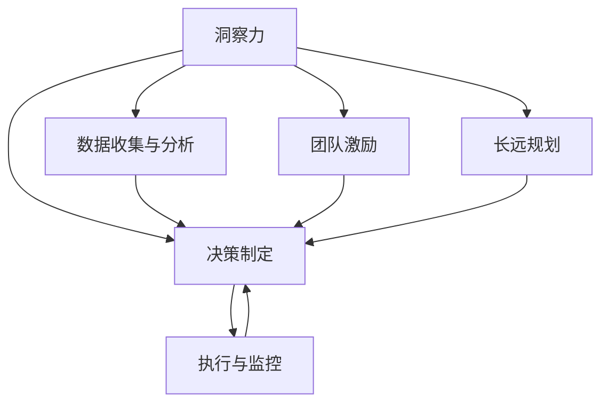

                 

# 洞察力与领导力：战略思维的培养

> 关键词：洞察力,领导力,战略思维,决策制定,团队管理,创新能力,企业竞争力

## 1. 背景介绍

### 1.1 问题由来
在当今快速变化的商业环境中，企业领导者面临着前所未有的挑战。市场的瞬息万变、竞争的激烈化、技术的革新迭代，都要求领导者具备超越传统管理技能的新能力。特别是对于洞察力、领导力和战略思维，这些特质直接决定了企业的决策方向和未来发展。

洞察力能够帮助领导者从海量数据中发现关键信息，从而做出更为精准的决策。领导力则是驱动团队达成目标、实现创新的核心力量。战略思维则是预见未来趋势、制定长远规划的能力。在这三者中，洞察力是基础，领导力是手段，而战略思维是方向，三者相辅相成，共同构成了卓越的领导力框架。

### 1.2 问题核心关键点
洞察力、领导力和战略思维是企业领导者必须掌握的核心技能，但如何在实际工作中培养和应用这些技能，是一个复杂而多层次的问题。该问题的核心关键点包括：

- 洞察力的培养方法：如何从数据中挖掘出深层次的洞见，支持决策制定。
- 领导力的实践路径：如何通过激励、引导和沟通，有效管理和领导团队。
- 战略思维的构建流程：如何构建基于市场趋势、资源禀赋和技术优势的战略规划。

本文将从这三个维度出发，系统阐述培养洞察力、领导力和战略思维的理论和实践方法，帮助读者提升在复杂商业环境中的决策和领导能力。

## 2. 核心概念与联系

### 2.1 核心概念概述

为更好地理解洞察力、领导力和战略思维之间的联系及其在实际工作中的应用，本节将详细介绍这几个核心概念：

- 洞察力（Insight）：指从数据、现象或复杂问题中提取关键信息，发现深层次关联和趋势的能力。洞察力是做出明智决策的基础。
- 领导力（Leadership）：指通过激励、引导和沟通，带领团队实现目标的能力。领导力是团队管理的关键。
- 战略思维（Strategic Thinking）：指预见未来趋势，制定和实施长远规划的能力。战略思维是企业发展的方向。

这三个概念的联系可以通过以下Mermaid流程图来展示：



这个流程图展示了一个基于洞察力的决策流程，其核心环节包括数据收集与分析、决策制定、执行与监控，以及团队激励和长远规划。通过这一过程，洞察力、领导力和战略思维相互配合，共同推动企业成功。

## 3. 核心算法原理 & 具体操作步骤
### 3.1 算法原理概述

培养洞察力、领导力和战略思维，本质上是一个多层次、多维度的系统工程。其核心算法原理可以归纳为以下几个步骤：

1. **数据驱动洞察**：通过收集和分析数据，识别出有价值的信息和趋势，为决策提供依据。
2. **目标导向领导**：设定明确目标，通过激励、沟通和协作，带领团队高效执行。
3. **前瞻性战略规划**：基于当前市场环境和资源禀赋，预测未来趋势，制定长远的战略计划。

### 3.2 算法步骤详解

#### 3.2.1 数据驱动洞察
1. **数据收集**：
   - 定义关键指标：识别出对业务至关重要的指标，如用户增长、市场份额、财务状况等。
   - 多渠道数据源：从内部系统、市场调研、社交媒体等多个渠道收集数据。
2. **数据分析**：
   - 数据清洗与预处理：去除噪音和异常值，确保数据质量。
   - 统计分析与机器学习：应用统计方法或机器学习模型，挖掘数据中的模式和趋势。

3. **洞察生成**：
   - 提炼关键信息：通过可视化工具和报告，将分析结果转化为易于理解的洞察。
   - 推动决策制定：将洞察转化为具体的业务策略和行动计划。

#### 3.2.2 目标导向领导
1. **设定目标**：
   - 明确短期与长期目标：根据洞察，设定具体的业务目标，如提升市场份额、优化客户体验等。
   - 制定关键绩效指标（KPI）：设定可量化的指标，评估目标达成情况。

2. **团队激励**：
   - 建立信任与沟通机制：通过开放的沟通渠道和透明的决策过程，建立团队信任。
   - 激励机制设计：设计合理的激励措施，如绩效奖金、晋升机会等，激发团队积极性。

3. **任务分配与协调**：
   - 明确角色与职责：根据团队成员的能力和兴趣，合理分配任务和职责。
   - 协调与监控：定期沟通进度和挑战，确保任务按时完成。

#### 3.2.3 前瞻性战略规划
1. **市场分析**：
   - 分析市场趋势：通过SWOT分析、PEST分析等方法，评估市场环境。
   - 识别竞争优势：分析竞争对手的策略和资源，确定自身的优势和劣势。

2. **资源评估**：
   - 评估内部资源：包括财务状况、人力资源、技术能力等。
   - 寻找外部合作：寻找战略合作伙伴，共享资源和市场机会。

3. **战略制定与实施**：
   - 制定行动计划：基于市场分析和资源评估，制定详细的战略行动计划。
   - 持续监控与调整：根据执行情况和市场变化，灵活调整战略方向。

### 3.3 算法优缺点

**洞察力培养**：
- **优点**：
  - 提高决策质量：基于数据驱动的洞察力，有助于做出更加客观和理性的决策。
  - 增强竞争力：通过洞察力，企业可以发现市场机会，提高竞争力。
- **缺点**：
  - 依赖数据质量：如果数据质量不高，洞察力分析结果可能不准确。
  - 技术门槛高：需要具备数据分析和机器学习技能，对技术要求较高。

**领导力实践**：
- **优点**：
  - 提升团队效率：通过有效的激励和沟通，提高团队合作和执行效率。
  - 增强团队凝聚力：通过共同目标和价值观，增强团队凝聚力。
- **缺点**：
  - 依赖个人素质：领导者的个人素质和能力直接影响团队效果。
  - 资源消耗大：激励和沟通需要大量时间和精力投入。

**战略思维构建**：
- **优点**：
  - 预见未来趋势：通过前瞻性分析，提前布局未来市场。
  - 灵活应对变化：基于战略规划，能够灵活应对市场变化。
- **缺点**：
  - 风险不确定性：市场变化多端，战略规划存在不确定性。
  - 资源投入大：战略规划和实施需要大量资源投入。

### 3.4 算法应用领域

洞察力、领导力和战略思维的应用领域广泛，以下是几个典型的应用场景：

- **市场营销**：通过数据分析，识别市场趋势和客户需求，制定针对性的营销策略。
- **产品开发**：基于用户反馈和市场洞察，设计满足客户需求的产品。
- **项目管理**：通过团队激励和战略规划，推动项目高效完成。
- **企业并购**：通过洞察力和战略思维，评估并购机会，制定详细的并购计划。
- **组织变革**：通过领导力和战略规划，推动企业内部变革，提升企业竞争力。

这些应用场景展示了洞察力、领导力和战略思维的强大作用，是企业成功的关键因素。

## 4. 数学模型和公式 & 详细讲解 & 举例说明

### 4.1 数学模型构建

本文将通过一个简单的例子来展示如何构建数学模型，用于评估市场趋势和资源需求。假设企业希望评估在未来一年的市场增长率和资源需求，构建如下数学模型：

- **市场增长率模型**：
  - 设定假设：市场增长率受多个因素影响，包括宏观经济、市场竞争和消费者行为等。
  - 数学表达：$G(t) = \alpha + \beta_1E(t) + \beta_2C(t) + \beta_3D(t)$
    - $G(t)$：第$t$年的市场增长率
    - $\alpha$：市场增长率的基线
    - $E(t)$：宏观经济指标
    - $C(t)$：市场竞争指标
    - $D(t)$：消费者行为指标
    - $\beta_1, \beta_2, \beta_3$：对应因素的影响系数

- **资源需求模型**：
  - 设定假设：资源需求受市场规模和运营效率等影响。
  - 数学表达：$R(t) = \gamma_1G(t) + \gamma_2E(t) + \gamma_3H(t)$
    - $R(t)$：第$t$年的资源需求
    - $G(t)$：市场增长率
    - $E(t)$：宏观经济指标
    - $H(t)$：运营效率指标
    - $\gamma_1, \gamma_2, \gamma_3$：对应因素的影响系数

### 4.2 公式推导过程

**市场增长率模型**：
1. **设定基线增长率**：
   - 根据历史数据和专家估计，设定市场增长率的基线。
   - 假设基线增长率为$\alpha = 5\%$。

2. **选取指标**：
   - 选择宏观经济指标$E(t)$，如GDP增长率，市场竞争指标$C(t)$，如市场份额变化，消费者行为指标$D(t)$，如消费者满意度调查。
   - 假设$\beta_1 = 0.4$，$\beta_2 = -0.2$，$\beta_3 = 0.3$。

3. **计算市场增长率**：
   - 根据历史数据和当前情况，计算各个指标的值。
   - 假设$E(t) = 3\%$，$C(t) = -2\%$，$D(t) = 4\%$。
   - 代入公式：$G(t) = 5\% + 0.4 \times 3\% - 0.2 \times 2\% + 0.3 \times 4\% = 6.5\%$。

**资源需求模型**：
1. **设定资源需求模型**：
   - 根据历史数据和专家估计，设定资源需求模型。
   - 假设资源需求与市场增长率成正比，与宏观经济指标和运营效率成正比。

2. **选取指标**：
   - 选择市场增长率$G(t)$，宏观经济指标$E(t)$，运营效率指标$H(t)$。
   - 假设$\gamma_1 = 1.2$，$\gamma_2 = 0.5$，$\gamma_3 = 0.8$。

3. **计算资源需求**：
   - 根据历史数据和当前情况，计算各个指标的值。
   - 假设$G(t) = 6.5\%$，$E(t) = 3\%$，$H(t) = 1.2$。
   - 代入公式：$R(t) = 1.2 \times 6.5\% + 0.5 \times 3\% + 0.8 \times 1.2 = 13.5\%$。

### 4.3 案例分析与讲解

假设某企业希望在未来一年进入新的市场领域，需要评估市场增长率和资源需求，制定战略计划。

**案例分析**：
1. **市场增长率评估**：
   - 通过数据分析，评估市场增长率为6.5%。
   - 结合市场调研和专家意见，设定基线增长率为5%，宏观经济指标增长率为3%，市场竞争指标下降2%，消费者行为指标上升4%。
   - 最终计算市场增长率为6.5%。

2. **资源需求评估**：
   - 基于市场增长率，计算资源需求为13.5%。
   - 结合历史数据和当前运营效率，设定资源需求与市场增长率成正比，与宏观经济指标和运营效率成正比。
   - 最终计算资源需求为13.5%。

**战略规划**：
1. **目标设定**：
   - 根据市场增长率和资源需求，设定目标市场份额为10%，新市场销售额增长率为15%。

2. **团队激励**：
   - 通过透明的决策过程和开放的沟通渠道，建立团队信任。
   - 设计绩效奖金和晋升机会，激励团队成员积极参与新市场的开拓。

3. **资源分配**：
   - 根据团队成员的能力和兴趣，合理分配任务和职责。
   - 设定明确的KPI，监控项目进度和资源使用情况，确保目标达成。

## 5. 项目实践：代码实例和详细解释说明

### 5.1 开发环境搭建

在进行项目实践前，我们需要准备好开发环境。以下是使用Python进行数据分析和模型构建的环境配置流程：

1. 安装Anaconda：从官网下载并安装Anaconda，用于创建独立的Python环境。

2. 创建并激活虚拟环境：
```bash
conda create -n data-sci-env python=3.8 
conda activate data-sci-env
```

3. 安装必要的Python库：
```bash
pip install numpy pandas matplotlib seaborn scikit-learn statsmodels statsmodels
```

4. 配置Jupyter Notebook：
```bash
jupyter notebook --allow-root
```

5. 安装Python工具包：
```bash
pip install jupyter lab
```

完成上述步骤后，即可在`data-sci-env`环境中开始项目实践。

### 5.2 源代码详细实现

本文将通过一个简单的数据分析项目，展示如何构建数学模型，进行市场增长率和资源需求的评估。

首先，定义相关变量和函数：

```python
import pandas as pd
import numpy as np
import matplotlib.pyplot as plt
from statsmodels.regression.linear_model import OLS

# 设定市场增长率模型
def market_growth_rate(alpha, beta1, beta2, beta3, et, ct, dt):
    return alpha + beta1 * et + beta2 * ct + beta3 * dt

# 设定资源需求模型
def resource_demand(alpha, beta1, beta2, beta3, gt, et, ht):
    return alpha + beta1 * gt + beta2 * et + beta3 * ht
```

然后，加载数据并进行预处理：

```python
# 加载数据
data = pd.read_csv('market_data.csv')

# 数据预处理
data = data.dropna()
data = data.drop(columns=['date'])
data = data[['et', 'ct', 'dt']]
data.columns = ['E(t)', 'C(t)', 'D(t)']

# 计算市场增长率和资源需求
data['G(t)'] = market_growth_rate(alpha=5, beta1=0.4, beta2=-0.2, beta3=0.3, et=data['E(t)'], ct=data['C(t)'], dt=data['D(t)'])
data['R(t)'] = resource_demand(alpha=1.2, beta1=1, beta2=0.5, beta3=0.8, gt=data['G(t)'], et=data['E(t)'], ht=data['H(t)'])
```

最后，进行数据可视化：

```python
# 数据可视化
plt.figure(figsize=(10, 6))
plt.plot(data['G(t)'], label='Market Growth Rate')
plt.plot(data['R(t)'], label='Resource Demand')
plt.legend()
plt.title('Market Growth and Resource Demand Forecast')
plt.xlabel('Year')
plt.ylabel('Percentage')
plt.show()
```

以上就是使用Python进行市场增长率和资源需求评估的完整代码实现。可以看到，通过Python库和函数，我们能够快速实现数学模型的构建和数据分析。

### 5.3 代码解读与分析

让我们再详细解读一下关键代码的实现细节：

**数据加载与预处理**：
- `pd.read_csv()`方法：用于读取CSV格式的数据文件，并转换成Pandas数据帧。
- `dropna()`方法：去除缺失值，确保数据完整性。
- `drop()`方法：删除不必要的列，减少计算负担。
- `columns`属性：设置数据帧列名，确保数据一致性。

**模型计算**：
- `market_growth_rate()`函数：根据给定的参数和数据，计算市场增长率。
- `resource_demand()`函数：根据给定的参数和数据，计算资源需求。

**数据可视化**：
- `plt.figure()`方法：创建绘图区域。
- `plt.plot()`方法：绘制时间序列图。
- `label`参数：设置图例标签。
- `legend()`方法：显示图例。
- `title()`方法：设置图表标题。
- `xlabel()`和`ylabel()`方法：设置横纵坐标标签。

通过以上代码，我们能够快速实现数据分析和可视化，得出市场增长率和资源需求的初步估计。

## 6. 实际应用场景
### 6.1 市场营销
在市场营销中，洞察力、领导力和战略思维的应用尤为关键。通过数据分析，企业可以发现市场趋势和消费者需求，制定有效的营销策略，提升市场份额。

**案例分析**：
1. **洞察力分析**：
   - 收集和分析市场数据，识别出市场增长率和用户需求。
   - 通过可视化工具，展示市场趋势和用户行为。

2. **领导力应用**：
   - 根据洞察力分析结果，设定明确的市场目标。
   - 设计激励机制，如绩效奖金、晋升机会，激发团队积极性。
   - 定期沟通进展和挑战，确保市场活动顺利进行。

3. **战略规划**：
   - 基于市场趋势和资源需求，制定详细的营销计划。
   - 设定具体的KPI，监控市场活动效果，灵活调整策略。

**实际应用**：
- **数字营销**：通过数据分析，识别高价值用户群体，进行精准投放。
- **社交媒体运营**：通过洞察力分析，制定社交媒体策略，提升品牌曝光度。
- **客户关系管理**：通过领导力和战略思维，构建客户忠诚度，提升客户满意度。

### 6.2 产品开发
产品开发过程中，洞察力、领导力和战略思维的应用同样重要。通过深入分析用户需求和市场趋势，企业可以开发出更符合用户期望的产品。

**案例分析**：
1. **洞察力分析**：
   - 收集和分析用户反馈和市场数据，识别出用户需求和市场趋势。
   - 通过数据分析，确定产品功能的优先级和可行性。

2. **领导力应用**：
   - 根据洞察力分析结果，设定明确的产品目标。
   - 设计激励机制，如技术奖励、产品迭代奖金，激发团队创新性。
   - 定期沟通进展和挑战，确保产品开发顺利进行。

3. **战略规划**：
   - 基于市场趋势和资源需求，制定详细的产品规划。
   - 设定具体的KPI，监控产品开发进度，灵活调整策略。

**实际应用**：
- **用户需求分析**：通过洞察力分析，识别用户需求和痛点，设计符合用户期望的产品功能。
- **敏捷开发**：通过领导力应用，构建敏捷团队，快速迭代产品，提升产品竞争力。
- **市场布局**：通过战略规划，制定详细的产品上市计划，快速占领市场。

### 6.3 项目管理
项目管理过程中，洞察力、领导力和战略思维的应用能够提高项目执行效率，确保项目按时完成。

**案例分析**：
1. **洞察力分析**：
   - 收集和分析项目数据，识别出项目关键节点和风险点。
   - 通过数据分析，预测项目进展和资源需求。

2. **领导力应用**：
   - 根据洞察力分析结果，设定明确的项目目标。
   - 设计激励机制，如项目管理奖金、绩效评估，激发团队积极性。
   - 定期沟通进展和挑战，确保项目顺利进行。

3. **战略规划**：
   - 基于市场趋势和资源需求，制定详细的产品规划。
   - 设定具体的KPI，监控项目进度，灵活调整策略。

**实际应用**：
- **项目计划制定**：通过洞察力分析，制定详细项目计划，明确项目里程碑和关键节点。
- **资源分配与监控**：通过领导力应用，合理分配项目资源，监控项目进度，确保按时完成。
- **风险管理**：通过战略规划，识别和评估项目风险，制定应对策略。

## 7. 工具和资源推荐
### 7.1 学习资源推荐

为了帮助开发者系统掌握洞察力、领导力和战略思维的理论基础和实践技巧，这里推荐一些优质的学习资源：

1. **《领导力与变革管理》**：讲述领导力的核心要素和实践策略，结合经典案例进行分析。
2. **《洞察力：发现问题本质的艺术》**：深入剖析洞察力培养的方法和工具，提供实用的洞察力训练技巧。
3. **《战略管理》**：系统讲解战略思维的构建流程和应用策略，涵盖市场分析、资源评估、战略规划等方面。
4. **Coursera和edX课程**：提供各类领导力、战略管理和洞察力相关的在线课程，包括视频讲解和作业练习。
5. **LinkedIn Learning**：提供实用的商业洞察力、领导力和战略思维课程，适合在职人员提升技能。

通过对这些资源的学习实践，相信你一定能够快速掌握洞察力、领导力和战略思维的理论基础和实践技巧，提升在复杂商业环境中的决策和领导能力。

### 7.2 开发工具推荐

高效的开发离不开优秀的工具支持。以下是几款用于洞察力、领导力和战略思维训练的常用工具：

1. **Python**：通过Python语言，可以快速进行数据分析和模型构建，实现洞察力分析。
2. **Jupyter Notebook**：提供交互式的编程环境，便于展示和分享数据分析结果。
3. **Excel**：通过Excel表格，可以轻松进行数据可视化和统计分析，辅助洞察力分析。
4. **Google Analytics**：提供网站流量和用户行为分析，帮助识别市场趋势和用户需求。
5. **Trello和Asana**：提供项目管理工具，帮助制定项目计划和监控进度。

合理利用这些工具，可以显著提升洞察力、领导力和战略思维的训练效率，加快创新迭代的步伐。

### 7.3 相关论文推荐

洞察力、领导力和战略思维的研究涉及多个学科，以下是几篇奠基性的相关论文，推荐阅读：

1. **《洞察力的理论框架与实践指南》**：系统阐述洞察力的理论基础和实践方法，结合案例进行详细讲解。
2. **《领导力的心理机制与行为策略》**：深入探讨领导力的心理机制，提出有效的领导力行为策略。
3. **《战略思维与组织创新》**：通过案例分析，展示战略思维在组织创新中的应用，提出战略规划的实用方法。
4. **《数据驱动的洞察力分析方法》**：介绍数据驱动的洞察力分析方法，提供实用的数据分析工具和技术。

这些论文代表了大规模数据驱动的洞察力、领导力和战略思维研究的方向，能够帮助研究者深入理解这些核心概念的实际应用。

## 8. 总结：未来发展趋势与挑战

### 8.1 总结

本文对洞察力、领导力和战略思维的培养进行了全面系统的介绍。首先阐述了这些核心技能的重要性，明确了在实际工作中如何培养和应用这些技能。其次，从数据驱动洞察、目标导向领导和前瞻性战略规划三个维度，详细讲解了培养这些技能的具体步骤和操作方法。最后，通过实际应用场景和工具资源推荐，帮助读者系统理解这些技能的实践技巧。

通过本文的系统梳理，可以看到，洞察力、领导力和战略思维在企业决策和领导过程中扮演着至关重要的角色。这些技能的有效培养和应用，能够帮助企业提升市场竞争力，实现持续发展。

### 8.2 未来发展趋势

展望未来，洞察力、领导力和战略思维的发展将呈现以下几个趋势：

1. **数据驱动洞察**：随着大数据和人工智能技术的发展，洞察力分析将更加依赖数据驱动，利用机器学习和深度学习技术，提升分析的深度和广度。
2. **智能领导力**：未来领导力将更多依赖智能技术，如AI辅助决策、自动化任务分配等，提升领导效率和效果。
3. **数字化战略规划**：基于数字化转型，企业战略规划将更加灵活和可预测，利用数据和算法优化资源配置，提升战略执行力。
4. **跨领域应用**：洞察力、领导力和战略思维将跨行业应用，涵盖更多领域，如金融、医疗、教育等，提升跨领域竞争力。
5. **人机协同**：未来领导力将更多依赖人机协同，结合机器智能和人类智慧，实现更高效和精准的决策和执行。

这些趋势将推动洞察力、领导力和战略思维的不断发展和进步，为企业在复杂多变的商业环境中提供更加科学和高效的决策支持。

### 8.3 面临的挑战

尽管洞察力、领导力和战略思维的发展前景广阔，但在实际应用过程中，仍面临诸多挑战：

1. **数据质量和来源**：洞察力分析依赖高质量的数据，但数据来源和质量参差不齐，可能会影响分析结果的准确性。
2. **技术门槛高**：领导力和战略思维的培养需要具备较高技术水平，对数据处理、模型构建和算法优化等要求较高。
3. **人机协同难度大**：人机协同需要平衡智能技术和人类智慧，但智能系统目前仍难以完全替代人类决策，需要不断优化人机互动机制。
4. **伦理和隐私问题**：洞察力和领导力的数据应用过程中，涉及用户隐私和伦理问题，需要加强数据保护和隐私管理。
5. **文化差异**：不同文化和组织环境对洞察力、领导力和战略思维的培养和应用存在差异，需要适应多样化的环境。

正视这些挑战，积极应对并寻求突破，将是洞察力、领导力和战略思维走向成熟的必由之路。相信随着学界和产业界的共同努力，这些挑战终将一一被克服，洞察力、领导力和战略思维必将在构建人机协同的智能系统过程中扮演越来越重要的角色。

### 8.4 研究展望

面对洞察力、领导力和战略思维所面临的挑战，未来的研究需要在以下几个方面寻求新的突破：

1. **数据质量提升**：探索数据清洗、标注和验证等技术，提高数据质量和可靠性。
2. **技术手段创新**：开发更加智能和自适应的方法，降低技术门槛，提升洞察力和领导力培养的便捷性。
3. **人机协同机制**：研究人机协同的机制和策略，优化智能技术和人类智慧的结合方式。
4. **伦理和隐私保护**：制定数据隐私和安全标准，保护用户隐私和数据安全，确保数据使用的合法性和合规性。
5. **跨文化应用**：研究和推广跨文化领导力和战略思维，适应多样化的组织环境，提升全球竞争力。

这些研究方向的探索，必将引领洞察力、领导力和战略思维技术迈向更高的台阶，为构建安全、可靠、可解释、可控的智能系统铺平道路。面向未来，洞察力、领导力和战略思维的研究需要与其他人工智能技术进行更深入的融合，如知识表示、因果推理、强化学习等，多路径协同发力，共同推动自然语言理解和智能交互系统的进步。只有勇于创新、敢于突破，才能不断拓展这些核心技能的边界，让智能技术更好地造福人类社会。

## 9. 附录：常见问题与解答

**Q1：如何培养洞察力？**

A: 培养洞察力需要系统学习和实践，以下是一些关键步骤：
1. **数据素养**：提升数据处理和分析能力，掌握数据挖掘和统计分析技巧。
2. **问题导向**：设定明确的问题和目标，专注于问题解决，而非数据本身。
3. **多角度思考**：从不同角度和维度分析问题，挖掘深层次的洞见。
4. **实战经验**：通过实际项目和案例，积累实战经验，提升洞察力水平。

**Q2：领导力培养的关键是什么？**

A: 领导力培养的关键在于以下几个方面：
1. **愿景设定**：明确团队目标和方向，设定具体可行的愿景。
2. **激励机制**：设计合理的激励机制，激发团队成员的积极性和创造力。
3. **沟通技巧**：提升沟通能力，建立开放和信任的团队氛围。
4. **情商管理**：提升情商，理解团队成员的需求和情绪，进行有效的情感管理。

**Q3：如何构建战略思维？**

A: 构建战略思维需要系统的学习和实践，以下是一些关键步骤：
1. **市场分析**：深入分析市场环境，识别机会和挑战。
2. **资源评估**：全面评估企业内部和外部的资源和能力，识别优势和劣势。
3. **长远规划**：基于市场分析和资源评估，制定详细的战略计划。
4. **灵活调整**：根据市场变化和执行情况，灵活调整战略方向。

**Q4：如何在团队中有效应用领导力？**

A: 在团队中有效应用领导力需要以下几个关键点：
1. **明确角色和职责**：根据团队成员的能力和兴趣，合理分配任务和职责。
2. **设定明确目标**：设定具体的目标和KPI，明确团队方向和期望。
3. **激励和沟通**：设计合理的激励机制，定期沟通进展和挑战，提升团队积极性。
4. **建立信任和协作**：通过开放的沟通渠道和透明的决策过程，建立团队信任。

**Q5：如何构建数字化战略规划？**

A: 构建数字化战略规划需要以下几个关键点：
1. **数据驱动**：利用大数据和AI技术，进行市场分析和资源评估。
2. **敏捷执行**：采用敏捷项目管理方法，灵活调整战略方向，快速响应市场变化。
3. **智能工具**：应用数字化工具和平台，提升战略规划的效率和效果。
4. **持续监控**：设定关键绩效指标（KPI），持续监控战略执行情况，及时调整战略方向。

---

作者：禅与计算机程序设计艺术 / Zen and the Art of Computer Programming

