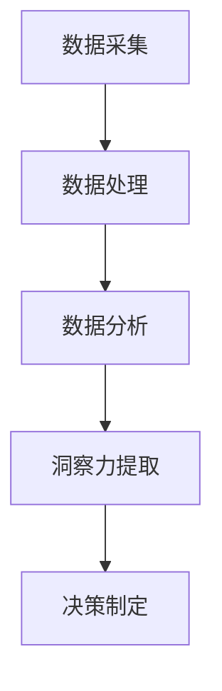

                 

# 洞察力培养：从观察到创新

## 1. 背景介绍

### 1.1 问题由来

在信息爆炸的时代，我们每天都在面对海量的数据和信息。如何在海量信息中寻找隐藏的洞察力，成为当代数据科学家和工程师面临的主要挑战。从商业决策到科技创新，洞察力在驱动决策制定和创新发展中扮演着至关重要的角色。

然而，如何培养和运用洞察力，从观察到创新，并不是一件容易的事情。传统的定量分析方法虽然有效，但往往需要大量的时间和精力。近年来，随着数据科学和机器学习技术的迅速发展，越来越多的工具和方法被开发出来，帮助人们从数据中提取洞察力。

### 1.2 问题核心关键点

培养和运用洞察力的关键在于以下几个方面：

- **数据采集与处理**：收集和处理高质量的数据，是洞察力培养的基础。
- **分析方法与技术**：选择合适的分析方法和工具，是洞察力提取的核心。
- **综合理解与推理**：将数据转化为可理解的洞察力，进行综合推理，是洞察力应用的难点。
- **创新驱动与决策**：将洞察力转化为实际的商业或科技创新决策，是洞察力培养的最终目标。

这些关键点构成了从观察到创新的整个过程，涵盖了数据采集、分析、应用和决策的各个环节。

## 2. 核心概念与联系

### 2.1 核心概念概述

为更好地理解洞察力培养的全过程，本节将介绍几个密切相关的核心概念：

- **数据采集**：从各种渠道（如网络、传感器、调查问卷等）收集数据，是洞察力培养的基础。
- **数据处理**：对收集到的数据进行清洗、转换、归一化等处理，以提高数据的可用性和质量。
- **数据分析**：运用统计学、机器学习等方法，对数据进行深入分析，提取有价值的信息。
- **洞察力提取**：通过分析结果，结合领域知识，提炼出对决策有指导意义的洞察力。
- **决策制定**：将洞察力转化为实际的商业或科技创新决策，驱动业务发展。

这些核心概念之间的逻辑关系可以通过以下Mermaid流程图来展示：



这个流程图展示了大数据洞察力培养的核心流程：

1. 从各种渠道采集数据。
2. 对数据进行清洗和处理，提高数据质量。
3. 运用分析方法深入挖掘数据，提取洞察力。
4. 将洞察力转化为实际的决策，驱动业务创新。

## 3. 核心算法原理 & 具体操作步骤

### 3.1 算法原理概述

洞察力培养的过程，本质上是一个数据驱动的决策过程。其核心思想是：通过收集和分析大量数据，从中提取有价值的洞察力，以此为基础，做出更有可能取得成功的决策。

形式化地，假设我们有一组数据集 $D=\{(x_i, y_i)\}_{i=1}^N$，其中 $x_i$ 为输入特征，$y_i$ 为标签或目标变量。目标是找到一组函数 $f(x)$，使得 $f(x)$ 能够最小化预测误差 $E(f(x), y_i)$。

通过机器学习算法，如线性回归、逻辑回归、决策树等，我们可以训练出一个预测模型 $M(x)$，使得 $M(x)$ 在训练集上能够较好地拟合数据，即满足 $E(M(x), y_i) \approx 0$。这个预测模型 $M(x)$ 就是从数据中提取出的洞察力。

### 3.2 算法步骤详解

洞察力培养的算法步骤一般包括以下几个关键步骤：

**Step 1: 数据采集与处理**
- 设计数据采集方案，确定数据源和采集方式。
- 清洗和处理采集到的数据，去除噪声和异常值，进行数据转换和归一化等。

**Step 2: 特征工程**
- 选择合适的特征，构建特征集合。
- 对特征进行编码，包括独热编码、数值化等。
- 设计特征选择和特征降维方法，提取最相关的特征。

**Step 3: 模型选择与训练**
- 选择合适的机器学习算法，如线性回归、决策树、随机森林、神经网络等。
- 设计训练集和验证集，设定模型参数。
- 使用训练集训练模型，最小化预测误差。

**Step 4: 模型评估与优化**
- 在验证集上评估模型性能，使用评估指标如均方误差、准确率、召回率等。
- 根据评估结果，调整模型参数，进行模型优化。

**Step 5: 洞察力提取与决策制定**
- 将训练好的模型应用于新数据，提取洞察力。
- 结合领域知识和专家经验，综合分析洞察力，制定决策。

以上是洞察力培养的一般流程。在实际应用中，还需要针对具体问题的特点，对每个环节进行优化设计，如改进数据采集方案、引入新的特征、尝试更先进的算法等，以进一步提升模型性能。

### 3.3 算法优缺点

洞察力培养的算法具有以下优点：

- **客观性**：通过数据驱动的方式提取洞察力，避免人为偏差。
- **高效性**：自动化分析过程，可以快速发现隐藏在数据中的模式和关系。
- **可重复性**：算法模型和过程可以重复应用，提高决策的稳定性和可靠性。

但同时也存在一些局限性：

- **数据质量要求高**：洞察力提取的结果依赖于数据的质量，噪声和异常值会影响结果。
- **模型复杂度**：一些复杂的模型需要大量的计算资源和时间，难以处理大规模数据。
- **可解释性不足**：算法模型往往是“黑盒”，难以解释其内部的工作机制和推理过程。
- **依赖专家经验**：洞察力提取和决策制定需要结合领域知识，对专家经验依赖较大。

尽管存在这些局限性，但就目前而言，洞察力培养的算法方法仍然是数据分析和决策制定中的主流范式。未来相关研究的重点在于如何进一步降低算法对数据的依赖，提高模型的可解释性和鲁棒性，同时兼顾专家经验与自动化分析的结合。

### 3.4 算法应用领域

洞察力培养的算法在各个领域都有广泛的应用，例如：

- 商业决策：利用用户行为数据，分析客户偏好和市场趋势，优化产品和营销策略。
- 金融风险管理：分析交易数据和市场指标，预测金融风险，制定风险控制措施。
- 医疗诊断：利用患者数据，分析疾病特征和诊断结果，提高诊疗水平。
- 智能推荐：分析用户行为数据，推荐个性化的商品和服务，提升用户体验。
- 资源优化：分析生产数据和供应链数据，优化资源配置，提高运营效率。

除了上述这些经典应用外，洞察力培养的方法也被创新性地应用到更多场景中，如智能城市、智慧农业、城市规划等，为各行各业带来新的数据驱动决策的突破。

## 4. 数学模型和公式 & 详细讲解 & 举例说明

### 4.1 数学模型构建

本节将使用数学语言对洞察力培养的过程进行更加严格的刻画。

假设我们有一组数据集 $D=\{(x_i, y_i)\}_{i=1}^N$，其中 $x_i$ 为输入特征，$y_i$ 为标签或目标变量。我们希望找到一组函数 $f(x)$，使得 $f(x)$ 能够最小化预测误差 $E(f(x), y_i)$。

定义模型 $M(x)$ 在输入 $x$ 上的损失函数为 $\ell(M(x),y_i)$，则在数据集 $D$ 上的经验风险为：

$$
\mathcal{L}(M) = \frac{1}{N} \sum_{i=1}^N \ell(M(x_i),y_i)
$$

通过梯度下降等优化算法，模型 $M(x)$ 不断更新参数 $\theta$，最小化损失函数 $\mathcal{L}(M)$，使得模型输出逼近真实标签。

### 4.2 公式推导过程

以下我们以线性回归为例，推导预测误差的最小化公式。

假设模型 $M(x)$ 在输入 $x$ 上的输出为 $y=M(x)=w^Tx+b$，其中 $w$ 为权重向量，$b$ 为偏置项。则预测误差为：

$$
\ell(y_i, \hat{y_i}) = (y_i - \hat{y_i})^2
$$

根据梯度下降算法，模型 $M(x)$ 更新参数 $\theta=(w, b)$ 的公式为：

$$
\theta \leftarrow \theta - \eta \nabla_{\theta}\mathcal{L}(\theta)
$$

其中 $\nabla_{\theta}\mathcal{L}(\theta)$ 为损失函数对参数 $\theta$ 的梯度，可通过反向传播算法高效计算。

在得到损失函数的梯度后，即可带入参数更新公式，完成模型的迭代优化。重复上述过程直至收敛，最终得到适应数据的线性回归模型参数 $\theta^*$。

### 4.3 案例分析与讲解

**案例：金融风险管理**

在金融风险管理中，洞察力培养的流程如下：

**Step 1: 数据采集与处理**
- 采集历史交易数据、市场指标等数据，清洗和处理数据，去除噪声和异常值。

**Step 2: 特征工程**
- 选择合适的特征，如交易金额、交易时间、市场波动等。
- 对特征进行编码，如独热编码。
- 设计特征选择和特征降维方法，提取最相关的特征。

**Step 3: 模型选择与训练**
- 选择合适的机器学习算法，如随机森林、梯度提升树等。
- 设计训练集和验证集，设定模型参数。
- 使用训练集训练模型，最小化预测误差。

**Step 4: 模型评估与优化**
- 在验证集上评估模型性能，使用评估指标如准确率、召回率等。
- 根据评估结果，调整模型参数，进行模型优化。

**Step 5: 洞察力提取与决策制定**
- 将训练好的模型应用于新数据，预测交易风险。
- 结合领域知识和专家经验，综合分析风险预测结果，制定风险控制措施。

通过以上流程，金融公司可以实时监测交易风险，及时采取措施，降低潜在的财务损失。

## 5. 项目实践：代码实例和详细解释说明

### 5.1 开发环境搭建

在进行洞察力培养的实践前，我们需要准备好开发环境。以下是使用Python进行Scikit-learn开发的环境配置流程：

1. 安装Anaconda：从官网下载并安装Anaconda，用于创建独立的Python环境。

2. 创建并激活虚拟环境：
```bash
conda create -n insight_env python=3.8 
conda activate insight_env
```

3. 安装Scikit-learn：
```bash
conda install scikit-learn
```

4. 安装各类工具包：
```bash
pip install numpy pandas scikit-learn matplotlib tqdm jupyter notebook ipython
```

完成上述步骤后，即可在`insight_env`环境中开始洞察力培养的实践。

### 5.2 源代码详细实现

这里我们以线性回归为例，给出使用Scikit-learn进行金融风险管理任务洞察力培养的Python代码实现。

首先，定义数据处理函数：

```python
import pandas as pd
from sklearn.model_selection import train_test_split
from sklearn.linear_model import LinearRegression
from sklearn.metrics import mean_squared_error

def load_data():
    # 加载数据集
    data = pd.read_csv('financial_data.csv')
    return data

def preprocess_data(data):
    # 数据预处理
    data['feature_1'] = data['feature_1'].fillna(data['feature_1'].mean())
    data['feature_2'] = data['feature_2'].fillna(data['feature_2'].mean())
    data = data.dropna()
    return data

def split_data(data):
    # 数据集划分
    X = data.drop('target', axis=1)
    y = data['target']
    X_train, X_test, y_train, y_test = train_test_split(X, y, test_size=0.2, random_state=42)
    return X_train, X_test, y_train, y_test

# 加载数据集
data = load_data()

# 数据预处理
processed_data = preprocess_data(data)

# 数据划分
X_train, X_test, y_train, y_test = split_data(processed_data)

# 模型训练
model = LinearRegression()
model.fit(X_train, y_train)

# 模型评估
y_pred = model.predict(X_test)
mse = mean_squared_error(y_test, y_pred)
print(f"均方误差：{mse:.2f}")
```

然后，定义模型评估函数：

```python
def evaluate_model(model, X_test, y_test):
    # 模型评估
    y_pred = model.predict(X_test)
    mse = mean_squared_error(y_test, y_pred)
    print(f"均方误差：{mse:.2f}")
    return mse
```

最后，启动训练流程并在测试集上评估：

```python
from sklearn.linear_model import LinearRegression

# 加载数据集
data = load_data()

# 数据预处理
processed_data = preprocess_data(data)

# 数据划分
X_train, X_test, y_train, y_test = split_data(processed_data)

# 模型训练
model = LinearRegression()
model.fit(X_train, y_train)

# 模型评估
mse = evaluate_model(model, X_test, y_test)
print(f"均方误差：{mse:.2f}")
```

以上就是使用Scikit-learn进行金融风险管理任务洞察力培养的完整代码实现。可以看到，Scikit-learn提供了强大的机器学习算法和工具，使得洞察力培养的实践变得简洁高效。

### 5.3 代码解读与分析

让我们再详细解读一下关键代码的实现细节：

**load_data函数**：
- 加载金融数据集，包含历史交易数据、市场指标等。

**preprocess_data函数**：
- 对数据进行清洗和处理，去除噪声和异常值，进行数据归一化等。

**split_data函数**：
- 对数据集进行划分，将数据集划分为训练集和测试集，并指定测试集比例。

**LinearRegression模型训练和评估**：
- 创建线性回归模型，使用训练集数据进行模型训练，计算测试集上的均方误差。

**evaluate_model函数**：
- 对模型在测试集上的表现进行评估，输出均方误差。

以上代码展示了洞察力培养的完整流程：数据采集与处理、特征工程、模型训练与评估。通过这一系列步骤，我们能够从金融数据中提取洞察力，实时监测交易风险，制定风险控制措施。

## 6. 实际应用场景

### 6.1 金融风险管理

在金融风险管理中，洞察力培养的流程如下：

**Step 1: 数据采集与处理**
- 采集历史交易数据、市场指标等数据，清洗和处理数据，去除噪声和异常值。

**Step 2: 特征工程**
- 选择合适的特征，如交易金额、交易时间、市场波动等。
- 对特征进行编码，如独热编码。
- 设计特征选择和特征降维方法，提取最相关的特征。

**Step 3: 模型选择与训练**
- 选择合适的机器学习算法，如随机森林、梯度提升树等。
- 设计训练集和验证集，设定模型参数。
- 使用训练集训练模型，最小化预测误差。

**Step 4: 模型评估与优化**
- 在验证集上评估模型性能，使用评估指标如准确率、召回率等。
- 根据评估结果，调整模型参数，进行模型优化。

**Step 5: 洞察力提取与决策制定**
- 将训练好的模型应用于新数据，预测交易风险。
- 结合领域知识和专家经验，综合分析风险预测结果，制定风险控制措施。

通过以上流程，金融公司可以实时监测交易风险，及时采取措施，降低潜在的财务损失。

### 6.2 商业决策

在商业决策中，洞察力培养的流程如下：

**Step 1: 数据采集与处理**
- 采集用户行为数据、市场数据等数据，清洗和处理数据，去除噪声和异常值。

**Step 2: 特征工程**
- 选择合适的特征，如用户购买记录、浏览记录等。
- 对特征进行编码，如独热编码。
- 设计特征选择和特征降维方法，提取最相关的特征。

**Step 3: 模型选择与训练**
- 选择合适的机器学习算法，如随机森林、梯度提升树等。
- 设计训练集和验证集，设定模型参数。
- 使用训练集训练模型，最小化预测误差。

**Step 4: 模型评估与优化**
- 在验证集上评估模型性能，使用评估指标如准确率、召回率等。
- 根据评估结果，调整模型参数，进行模型优化。

**Step 5: 洞察力提取与决策制定**
- 将训练好的模型应用于新数据，预测用户行为。
- 结合领域知识和专家经验，综合分析用户行为预测结果，制定商业决策。

通过以上流程，企业可以实时分析用户行为，优化产品和服务，提升用户满意度和市场竞争力。

### 6.3 医疗诊断

在医疗诊断中，洞察力培养的流程如下：

**Step 1: 数据采集与处理**
- 采集患者病历、医疗影像等数据，清洗和处理数据，去除噪声和异常值。

**Step 2: 特征工程**
- 选择合适的特征，如病历记录、影像特征等。
- 对特征进行编码，如独热编码。
- 设计特征选择和特征降维方法，提取最相关的特征。

**Step 3: 模型选择与训练**
- 选择合适的机器学习算法，如随机森林、神经网络等。
- 设计训练集和验证集，设定模型参数。
- 使用训练集训练模型，最小化预测误差。

**Step 4: 模型评估与优化**
- 在验证集上评估模型性能，使用评估指标如准确率、召回率等。
- 根据评估结果，调整模型参数，进行模型优化。

**Step 5: 洞察力提取与决策制定**
- 将训练好的模型应用于新数据，预测疾病诊断结果。
- 结合领域知识和专家经验，综合分析疾病诊断结果，制定治疗方案。

通过以上流程，医疗机构可以实时分析患者数据，提高诊断水平，制定个性化治疗方案。

## 7. 工具和资源推荐

### 7.1 学习资源推荐

为了帮助开发者系统掌握洞察力培养的理论基础和实践技巧，这里推荐一些优质的学习资源：

1. 《Python数据科学手册》（《Python Data Science Handbook》）：由Jake VanderPlas撰写，全面介绍了Python在数据分析和机器学习中的应用，是数据分析入门的经典之作。

2. 《统计学习方法》（《Statistical Learning Methods》）：由李航撰写，介绍了各种统计学习方法和算法，是机器学习理论学习的经典教材。

3. Coursera《数据科学基础》课程：由约翰霍普金斯大学提供，涵盖数据分析和机器学习的基本概念和应用，适合入门学习。

4. Kaggle：全球最大的数据科学竞赛平台，提供大量开源数据集和竞赛题目，适合实践锻炼。

5. TensorFlow官方文档：由Google提供，详细介绍了TensorFlow的使用和API，是TensorFlow学习的必备资源。

通过对这些资源的学习实践，相信你一定能够快速掌握洞察力培养的精髓，并用于解决实际的商业问题。

### 7.2 开发工具推荐

高效的开发离不开优秀的工具支持。以下是几款用于洞察力培养开发的常用工具：

1. Jupyter Notebook：Python的交互式开发环境，支持代码块的实时执行和可视化，是数据分析和机器学习的常用工具。

2. Pandas：Python的数据处理库，提供了高效的数据结构和数据处理工具，适合大规模数据处理。

3. Scikit-learn：Python的机器学习库，提供了各种经典的机器学习算法和工具，适合快速原型开发。

4. TensorFlow：由Google主导的深度学习框架，支持大规模分布式训练，适合复杂模型的开发。

5. Weights & Biases：模型训练的实验跟踪工具，可以记录和可视化模型训练过程中的各项指标，方便对比和调优。

6. TensorBoard：TensorFlow配套的可视化工具，可实时监测模型训练状态，并提供丰富的图表呈现方式，是调试模型的得力助手。

合理利用这些工具，可以显著提升洞察力培养任务的开发效率，加快创新迭代的步伐。

### 7.3 相关论文推荐

洞察力培养的研究源于学界的持续研究。以下是几篇奠基性的相关论文，推荐阅读：

1. "Learning from data"：由Pearson撰写，介绍了机器学习的基本概念和方法，是机器学习理论学习的经典教材。

2. "Pattern Recognition and Machine Learning"：由Christopher Bishop撰写，介绍了各种机器学习算法和模型，是深度学习理论学习的经典教材。

3. "Statistical Learning"：由Tibshirani撰写，介绍了统计学习的基本概念和方法，是统计学习理论学习的经典教材。

这些论文代表了大数据洞察力培养的发展脉络。通过学习这些前沿成果，可以帮助研究者把握学科前进方向，激发更多的创新灵感。

## 8. 总结：未来发展趋势与挑战

### 8.1 总结

本文对洞察力培养的过程进行了全面系统的介绍。首先阐述了从观察到创新的背景和意义，明确了洞察力培养在数据驱动决策中的独特价值。其次，从原理到实践，详细讲解了洞察力培养的数学原理和关键步骤，给出了洞察力培养任务开发的完整代码实例。同时，本文还广泛探讨了洞察力培养在商业决策、金融风险管理、医疗诊断等多个领域的应用前景，展示了洞察力培养的巨大潜力。此外，本文精选了洞察力培养的技术和资源，力求为读者提供全方位的技术指引。

通过本文的系统梳理，可以看到，洞察力培养的过程是一个数据驱动的决策过程，涉及到数据采集、处理、分析、应用和决策的各个环节。通过对大量数据的分析，从中提取有价值的洞察力，结合领域知识和专家经验，制定更加合理的决策，是洞察力培养的核心思想。

### 8.2 未来发展趋势

展望未来，洞察力培养技术将呈现以下几个发展趋势：

1. 自动化程度提升。随着深度学习和大数据技术的发展，越来越多的洞察力提取任务将被自动化，减少人为干预。

2. 跨领域知识融合。洞察力培养将更加注重跨领域知识的融合，结合符号化的领域知识，提高模型的泛化能力和实用性。

3. 数据驱动决策的普及。洞察力培养将广泛应用于更多领域，如商业决策、金融风险管理、医疗诊断等，助力各行业的智能化转型。

4. 模型可解释性增强。未来的洞察力培养模型将更加注重可解释性，帮助用户理解和信任模型决策过程。

5. 多模态数据融合。洞察力培养将结合多模态数据（如文本、图像、语音等），实现更加全面和准确的信息整合。

以上趋势凸显了洞察力培养技术的广阔前景。这些方向的探索发展，必将进一步提升数据驱动决策的效率和准确性，为各行各业带来新的数据驱动决策的突破。

### 8.3 面临的挑战

尽管洞察力培养技术已经取得了瞩目成就，但在迈向更加智能化、普适化应用的过程中，它仍面临着诸多挑战：

1. 数据质量问题。洞察力培养的结果依赖于数据的质量，噪声和异常值会影响结果。

2. 模型复杂性。一些复杂的模型需要大量的计算资源和时间，难以处理大规模数据。

3. 可解释性不足。算法模型往往是“黑盒”，难以解释其内部的工作机制和推理过程。

4. 跨领域知识融合难度大。洞察力培养需要结合领域知识，对专家经验依赖较大，难度较高。

尽管存在这些挑战，但通过不断地技术进步和经验积累，这些挑战终将一一被克服。相信随着学界和产业界的共同努力，洞察力培养技术将不断进步，为各行各业带来新的数据驱动决策的突破。

### 8.4 研究展望

未来的研究需要在以下几个方面寻求新的突破：

1. 探索无监督和半监督洞察力培养方法。摆脱对大规模标注数据的依赖，利用自监督学习、主动学习等无监督和半监督范式，最大限度利用非结构化数据，实现更加灵活高效的洞察力提取。

2. 研究参数高效和计算高效的洞察力培养范式。开发更加参数高效的模型，在固定大部分模型参数的情况下，只更新极少量的任务相关参数。同时优化模型计算图，减少前向传播和反向传播的资源消耗，实现更加轻量级、实时性的部署。

3. 引入更多先验知识。将符号化的先验知识，如知识图谱、逻辑规则等，与神经网络模型进行巧妙融合，引导洞察力提取过程学习更准确、合理的语言模型。同时加强不同模态数据的整合，实现视觉、语音等多模态信息与文本信息的协同建模。

4. 结合因果分析和博弈论工具。将因果分析方法引入洞察力培养模型，识别出模型决策的关键特征，增强输出解释的因果性和逻辑性。借助博弈论工具刻画人机交互过程，主动探索并规避模型的脆弱点，提高系统稳定性。

5. 纳入伦理道德约束。在模型训练目标中引入伦理导向的评估指标，过滤和惩罚有偏见、有害的输出倾向。同时加强人工干预和审核，建立模型行为的监管机制，确保输出符合人类价值观和伦理道德。

这些研究方向的探索，必将引领洞察力培养技术迈向更高的台阶，为构建安全、可靠、可解释、可控的智能系统铺平道路。面向未来，洞察力培养技术还需要与其他人工智能技术进行更深入的融合，如知识表示、因果推理、强化学习等，多路径协同发力，共同推动数据驱动决策的进步。只有勇于创新、敢于突破，才能不断拓展洞察力培养的边界，让智能技术更好地造福人类社会。

## 9. 附录：常见问题与解答

**Q1：如何选择合适的洞察力培养算法？**

A: 选择合适的洞察力培养算法需要考虑以下几个因素：
1. 数据类型和特征：不同的数据类型和特征需要不同的算法。如文本数据适合使用NLP算法，图像数据适合使用计算机视觉算法。
2. 问题类型：不同的问题类型需要不同的算法。如分类问题适合使用分类算法，回归问题适合使用回归算法。
3. 模型复杂度：模型的复杂度需要与数据量和计算资源相匹配。如小规模数据适合使用简单模型，大规模数据适合使用复杂模型。

**Q2：洞察力培养过程中如何选择合适的特征？**

A: 选择合适的特征是洞察力培养中的关键步骤，需要考虑以下几个因素：
1. 领域知识：特征的选择需要结合领域知识，选择对问题有指导意义的特征。
2. 特征相关性：特征需要与目标变量相关，避免选择无关的特征。
3. 特征稀疏性：特征需要尽量稀疏，避免特征之间高度相关。
4. 特征可解释性：特征需要易于解释，方便模型的解释和调优。

**Q3：洞察力培养过程中如何避免过拟合？**

A: 避免过拟合是洞察力培养中的重要环节，需要考虑以下几个因素：
1. 数据集划分：将数据集划分为训练集和验证集，避免模型在训练集上过拟合。
2. 正则化技术：使用L2正则、Dropout等正则化技术，防止模型过拟合。
3. 模型复杂度：选择简单的模型或优化模型结构，避免模型过于复杂。
4. 数据增强：通过数据增强技术，增加训练集的多样性，防止模型过拟合。

这些方法可以帮助洞察力培养模型避免过拟合，提高模型的泛化能力和稳定性。

**Q4：洞察力培养过程中如何提高模型的可解释性？**

A: 提高模型的可解释性是洞察力培养中的重要目标，需要考虑以下几个因素：
1. 选择可解释的模型：选择可解释性高的模型，如线性回归、决策树等。
2. 特征重要性分析：分析特征的重要性，理解模型内部工作机制。
3. 局部解释方法：使用局部解释方法，如LIME、SHAP等，解释模型的预测结果。
4. 可视化技术：使用可视化技术，如t-SNE、PCA等，可视化模型内部特征分布和关系。

这些方法可以帮助提高模型的可解释性，增强用户对模型决策过程的理解和信任。

**Q5：洞察力培养过程中如何处理缺失数据？**

A: 处理缺失数据是洞察力培养中的重要步骤，需要考虑以下几个因素：
1. 数据类型：不同的数据类型需要不同的处理方法。如数值型数据可以使用均值填补，文本型数据可以使用独热编码填补。
2. 数据缺失程度：根据数据缺失程度，选择合适的处理方法。如完全缺失可以使用均值填补，部分缺失可以使用插值方法填补。
3. 特征重要性：根据特征的重要性，选择合适的处理方法。如重要特征缺失可以使用均值填补，不重要特征缺失可以使用随机填补。

这些方法可以帮助洞察力培养模型处理缺失数据，提高模型的准确性和稳定性。

通过以上问题的解答，相信你对洞察力培养的过程有了更深入的了解。理解从观察到创新的过程，是培养和运用洞察力的关键。只有不断探索和实践，才能从海量数据中提取有价值的洞察力，实现数据驱动的创新决策。

