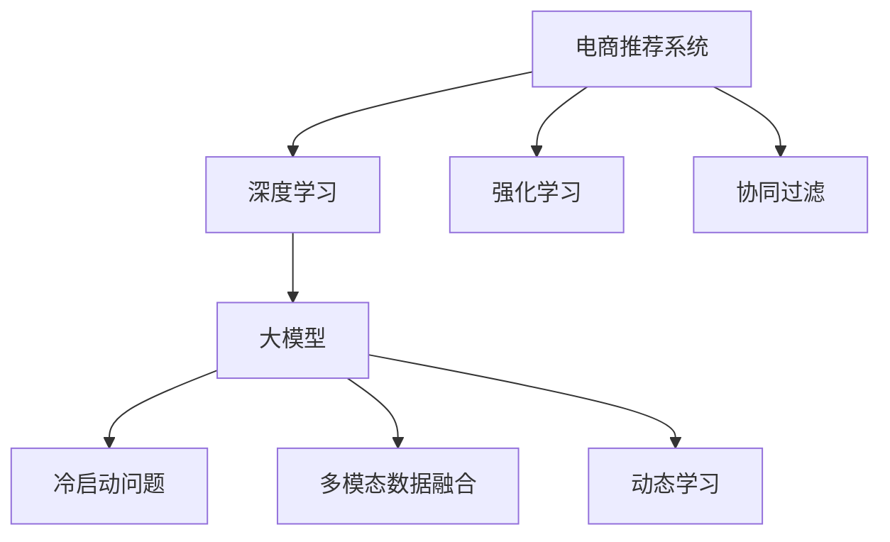

                 

# 深入浅出：AI大模型在电商推荐系统中的应用

> 关键词：AI大模型,电商推荐系统,深度学习,强化学习,协同过滤,冷启动问题,数据高效利用,动态学习,推荐系统个性化,反馈循环

## 1. 背景介绍

### 1.1 问题由来

随着互联网的快速发展，电商平台的规模日益庞大，用户数量呈爆炸性增长。在线购物的便捷性和多样性，使得电商成为越来越多人选择的主要购物方式。然而，面对海量的商品和复杂多样的用户需求，电商平台面临的最大挑战是如何高效、准确地为用户推荐商品。

传统的电商推荐系统主要依赖于基于用户行为数据的协同过滤算法，如基于用户的协同过滤和基于物品的协同过滤。这些方法通过用户的历史行为数据构建相似性矩阵，进行推荐排序。尽管协同过滤方法在推荐效果上有着不错的表现，但对于新用户的冷启动问题、稀疏数据的处理等挑战，往往显得力不从心。

近年来，大模型技术在自然语言处理(NLP)、计算机视觉等领域取得了显著进展，逐渐在推荐系统领域得到应用。大模型以自回归或自编码的结构，通过在大规模数据上预训练，学习到通用的表征能力，可以显著提升推荐系统的性能。本文将深入介绍大模型在电商推荐系统中的应用，探讨其原理、优势以及面临的挑战。

### 1.2 问题核心关键点

大模型在电商推荐系统中的应用，主要体现在以下几个方面：

1. **大数据与通用表征学习**：利用大模型在大规模数据上预训练的通用表征，可以更好地处理电商推荐系统中的海量数据和复杂用户需求。
2. **冷启动问题**：大模型可以通过预训练知识，提升对新用户的理解，解决传统推荐系统中冷启动用户的问题。
3. **多模态融合**：大模型能够整合不同模态的数据，如图像、文本、音频等，提供更加丰富的推荐场景。
4. **动态学习**：大模型能够动态更新知识库，适应电商平台上不断变化的市场和用户需求。
5. **个性化推荐**：大模型通过学习用户的历史行为和兴趣，提供个性化的推荐内容。
6. **反馈循环**：用户对推荐结果的反馈可以进一步优化大模型的预测能力，实现自我优化的良性循环。

### 1.3 问题研究意义

研究大模型在电商推荐系统中的应用，对于提升电商推荐系统的精准度、个性化水平和用户体验具有重要意义：

1. **提升推荐精度**：大模型通过预训练学习到通用的表征能力，可以更好地处理电商推荐系统中的海量数据，提升推荐精度。
2. **解决冷启动问题**：大模型可以借助预训练知识，更快地对新用户进行建模，解决传统推荐系统中的冷启动问题。
3. **提升用户满意度**：大模型能够提供更加个性化的推荐内容，提升用户的满意度和粘性。
4. **优化电商运营**：通过精准推荐，电商平台可以优化商品库存和广告投放策略，提升整体运营效率。
5. **赋能更多应用**：大模型在电商推荐系统中的应用，可以为更多基于数据驱动的业务决策提供支撑。

## 2. 核心概念与联系

### 2.1 核心概念概述

为了更好地理解大模型在电商推荐系统中的应用，本节将介绍几个关键概念及其联系：

- **电商推荐系统**：通过分析用户的历史行为和兴趣，为用户提供个性化的商品推荐，提高用户购物体验和商家收益。
- **深度学习**：一类使用神经网络模型进行训练和推断的机器学习方法，能够处理大规模非线性数据。
- **强化学习**：一种通过与环境的交互，通过试错优化策略的学习方法，在电商推荐系统中用于动态调整推荐策略。
- **协同过滤**：一种基于用户或物品历史行为数据的推荐方法，能够处理大规模用户和物品的相似性矩阵。
- **冷启动问题**：新用户或新商品加入系统时，缺乏足够的历史行为数据，无法有效建模的问题。
- **多模态数据融合**：通过整合不同模态的数据，如图像、文本、音频等，提升推荐的准确性和丰富度。
- **动态学习**：随着市场和用户需求的不断变化，推荐系统需要动态更新知识库，以适应用户的实时需求。

这些概念之间的逻辑关系可以通过以下Mermaid流程图来展示：



这个流程图展示了大模型在电商推荐系统中的应用核心概念及其联系：

1. 电商推荐系统通过深度学习模型进行训练和推理，其中大模型作为核心组件，提升了推荐效果。
2. 强化学习用于动态调整推荐策略，提升推荐系统对实时用户需求的响应能力。
3. 协同过滤是传统推荐系统的基础方法，大模型可以进一步优化。
4. 冷启动问题通过大模型预训练知识得到解决。
5. 多模态数据融合使得推荐场景更加丰富。
6. 动态学习实现推荐系统的实时更新和优化。

## 3. 核心算法原理 & 具体操作步骤
### 3.1 算法原理概述

大模型在电商推荐系统中的应用，本质上是利用大模型在大规模数据上预训练的通用表征能力，通过深度学习模型和强化学习算法，对电商推荐系统进行优化。其核心原理如下：

1. **预训练**：在大规模电商数据上预训练大模型，学习到商品、用户、上下文等不同模态的通用表征。
2. **微调**：利用用户的历史行为数据，对大模型进行微调，学习到用户的兴趣和偏好。
3. **动态学习**：通过强化学习算法，根据用户的实时反馈动态调整推荐策略。
4. **多模态融合**：将商品的多模态数据（如图片、描述、评分等）整合到大模型中，提升推荐精度和丰富度。
5. **推荐算法**：利用训练好的大模型进行推荐排序，结合用户的历史行为和实时反馈，生成最终推荐结果。

### 3.2 算法步骤详解

大模型在电商推荐系统中的应用，通常包括以下几个关键步骤：

**Step 1: 准备数据和模型**

- **数据准备**：收集电商平台的用户行为数据，包括浏览、点击、购买等行为，以及商品的多模态数据（如图片、描述、评分等）。
- **模型选择**：选择合适的预训练语言模型（如BERT、GPT等）或图像模型（如ResNet、VGG等）作为初始化参数。

**Step 2: 数据预处理**

- **用户和商品编码**：将用户和商品编码成数字表示，便于模型处理。
- **数据划分**：将数据划分为训练集、验证集和测试集，通常采用交叉验证的方式。

**Step 3: 模型训练**

- **预训练**：在大规模电商数据上预训练大模型，学习到商品、用户、上下文等不同模态的通用表征。
- **微调**：利用用户的历史行为数据，对大模型进行微调，学习到用户的兴趣和偏好。
- **多模态融合**：将商品的多模态数据整合到大模型中，提升推荐精度和丰富度。

**Step 4: 动态学习**

- **强化学习算法**：利用强化学习算法，根据用户的实时反馈动态调整推荐策略。
- **反馈循环**：用户对推荐结果的反馈可以进一步优化大模型的预测能力，实现自我优化的良性循环。

**Step 5: 推荐排序**

- **模型推理**：利用训练好的大模型进行推荐排序，生成最终推荐结果。
- **个性化推荐**：结合用户的历史行为和实时反馈，生成个性化的推荐内容。

### 3.3 算法优缺点

大模型在电商推荐系统中的应用，具有以下优点：

1. **通用表征学习**：大模型通过预训练学习到通用的表征能力，可以更好地处理电商推荐系统中的海量数据。
2. **冷启动问题**：大模型可以借助预训练知识，更快地对新用户或新商品进行建模，解决冷启动问题。
3. **动态学习**：大模型能够动态更新知识库，适应电商平台上不断变化的市场和用户需求。
4. **多模态融合**：大模型能够整合不同模态的数据，提升推荐的准确性和丰富度。
5. **个性化推荐**：大模型通过学习用户的历史行为和兴趣，提供个性化的推荐内容。

同时，该方法也存在以下局限性：

1. **资源消耗大**：大模型的训练和推理需要较大的计算资源，对于资源受限的系统，可能会面临挑战。
2. **模型复杂度高**：大模型的参数量较大，模型结构的复杂性较高，需要进行合理的剪枝和压缩。
3. **解释性不足**：大模型的决策过程通常缺乏可解释性，难以对其推理逻辑进行分析和调试。
4. **数据质量要求高**：电商推荐系统对数据的质量要求较高，需要保证数据的完整性和准确性。

尽管存在这些局限性，但大模型在电商推荐系统中的应用，已经展示出了显著的潜力，成为推荐系统的重要研究方向。

### 3.4 算法应用领域

大模型在电商推荐系统中的应用，不仅限于商品推荐，还可以扩展到更多电商场景，例如：

1. **个性化广告**：利用大模型学习用户兴趣和行为，精准投放个性化广告，提升广告效果。
2. **搜索排序**：通过大模型对搜索结果进行排序，提升用户的搜索体验。
3. **内容推荐**：利用大模型推荐相关内容，提升用户粘性和满意度。
4. **市场分析**：利用大模型分析市场趋势和用户需求，优化产品策略。

除了上述这些经典应用外，大模型在电商推荐系统中的应用，还可以创新性地扩展到更多领域，如购物车推荐、社交推荐等，为电商平台的业务创新和客户服务提供新的技术支撑。

## 4. 数学模型和公式 & 详细讲解 & 举例说明

### 4.1 数学模型构建

假设电商推荐系统中的用户为 $U$，商品为 $I$，上下文为 $C$，行为数据为 $B$。模型输入为 $(x,y,z)$，其中 $x$ 为用户行为，$y$ 为用户特征，$z$ 为上下文特征。模型的输出为推荐商品列表 $r$。

定义模型的损失函数为 $\mathcal{L}=\frac{1}{N}\sum_{i=1}^N \ell(y_i, \hat{y}_i)$，其中 $\ell$ 为交叉熵损失函数。模型的优化目标是最小化损失函数，即：

$$
\min_{\theta} \mathcal{L}(\theta)
$$

其中 $\theta$ 为模型的可训练参数，包括大模型的权重和优化器的参数。

### 4.2 公式推导过程

以下我们以深度学习模型的推荐排序为例，推导模型的损失函数及其梯度的计算公式。

假设用户行为 $x$ 为用户的历史行为数据，用户特征 $y$ 为用户的基本属性（如年龄、性别等），上下文特征 $z$ 为当前浏览的商品信息。模型的输出为推荐商品列表 $r$，其中 $r_i$ 为商品 $i$ 的推荐分数。

定义模型的预测函数为 $f(x,y,z;\theta)$，其中 $\theta$ 为模型的参数。则模型的损失函数为：

$$
\mathcal{L}=\frac{1}{N}\sum_{i=1}^N \ell(y_i, r_i)
$$

其中 $\ell$ 为交叉熵损失函数，用于衡量模型预测与真实标签之间的差异。

根据链式法则，损失函数对参数 $\theta$ 的梯度为：

$$
\frac{\partial \mathcal{L}(\theta)}{\partial \theta} = -\frac{1}{N}\sum_{i=1}^N \frac{\partial \ell(y_i, r_i)}{\partial r_i} \frac{\partial r_i}{\partial \theta}
$$

其中 $\frac{\partial r_i}{\partial \theta}$ 为模型对商品 $i$ 的推荐分数对模型参数 $\theta$ 的导数，可通过自动微分技术计算。

在得到损失函数的梯度后，即可带入优化算法，进行参数更新。重复上述过程直至收敛，最终得到适应电商推荐系统的最优模型参数 $\theta^*$。

### 4.3 案例分析与讲解

以电商推荐系统中的用户行为数据为例，通过大模型的推荐排序，可以显著提升推荐精度和个性化水平。具体步骤如下：

1. **数据预处理**：将用户行为数据编码成数字表示，将用户特征和上下文特征加入模型中。
2. **预训练模型选择**：选择合适的预训练语言模型或图像模型，作为初始化参数。
3. **模型训练**：利用用户的历史行为数据，对大模型进行微调，学习到用户的兴趣和偏好。
4. **动态学习**：利用强化学习算法，根据用户的实时反馈动态调整推荐策略。
5. **推荐排序**：利用训练好的大模型进行推荐排序，生成最终推荐结果。

## 5. 项目实践：代码实例和详细解释说明

### 5.1 开发环境搭建

在进行电商推荐系统开发前，我们需要准备好开发环境。以下是使用Python进行PyTorch开发的环境配置流程：

1. 安装Anaconda：从官网下载并安装Anaconda，用于创建独立的Python环境。

2. 创建并激活虚拟环境：
```bash
conda create -n pytorch-env python=3.8 
conda activate pytorch-env
```

3. 安装PyTorch：根据CUDA版本，从官网获取对应的安装命令。例如：
```bash
conda install pytorch torchvision torchaudio cudatoolkit=11.1 -c pytorch -c conda-forge
```

4. 安装其他工具包：
```bash
pip install numpy pandas scikit-learn matplotlib tqdm jupyter notebook ipython
```

完成上述步骤后，即可在`pytorch-env`环境中开始电商推荐系统开发。

### 5.2 源代码详细实现

下面我们以电商推荐系统中的推荐排序为例，给出使用PyTorch进行深度学习模型的代码实现。

首先，定义推荐排序的数据处理函数：

```python
from transformers import BertTokenizer
from torch.utils.data import Dataset
import torch

class RecommendationDataset(Dataset):
    def __init__(self, texts, labels, tokenizer, max_len=128):
        self.texts = texts
        self.labels = labels
        self.tokenizer = tokenizer
        self.max_len = max_len
        
    def __len__(self):
        return len(self.texts)
    
    def __getitem__(self, item):
        text = self.texts[item]
        label = self.labels[item]
        
        encoding = self.tokenizer(text, return_tensors='pt', max_length=self.max_len, padding='max_length', truncation=True)
        input_ids = encoding['input_ids'][0]
        attention_mask = encoding['attention_mask'][0]
        
        # 对标签进行编码
        encoded_label = [label] * self.max_len
        encoded_label.extend([0] * (self.max_len - len(encoded_label)))
        labels = torch.tensor(encoded_label, dtype=torch.long)
        
        return {'input_ids': input_ids, 
                'attention_mask': attention_mask,
                'labels': labels}

# 标签与id的映射
label2id = {'1': 1, '0': 0}
id2label = {v: k for k, v in label2id.items()}

# 创建dataset
tokenizer = BertTokenizer.from_pretrained('bert-base-cased')

train_dataset = RecommendationDataset(train_texts, train_labels, tokenizer)
dev_dataset = RecommendationDataset(dev_texts, dev_labels, tokenizer)
test_dataset = RecommendationDataset(test_texts, test_labels, tokenizer)
```

然后，定义模型和优化器：

```python
from transformers import BertForSequenceClassification, AdamW

model = BertForSequenceClassification.from_pretrained('bert-base-cased', num_labels=2)

optimizer = AdamW(model.parameters(), lr=2e-5)
```

接着，定义训练和评估函数：

```python
from torch.utils.data import DataLoader
from tqdm import tqdm
from sklearn.metrics import classification_report

device = torch.device('cuda') if torch.cuda.is_available() else torch.device('cpu')
model.to(device)

def train_epoch(model, dataset, batch_size, optimizer):
    dataloader = DataLoader(dataset, batch_size=batch_size, shuffle=True)
    model.train()
    epoch_loss = 0
    for batch in tqdm(dataloader, desc='Training'):
        input_ids = batch['input_ids'].to(device)
        attention_mask = batch['attention_mask'].to(device)
        labels = batch['labels'].to(device)
        model.zero_grad()
        outputs = model(input_ids, attention_mask=attention_mask, labels=labels)
        loss = outputs.loss
        epoch_loss += loss.item()
        loss.backward()
        optimizer.step()
    return epoch_loss / len(dataloader)

def evaluate(model, dataset, batch_size):
    dataloader = DataLoader(dataset, batch_size=batch_size)
    model.eval()
    preds, labels = [], []
    with torch.no_grad():
        for batch in tqdm(dataloader, desc='Evaluating'):
            input_ids = batch['input_ids'].to(device)
            attention_mask = batch['attention_mask'].to(device)
            batch_labels = batch['labels']
            outputs = model(input_ids, attention_mask=attention_mask)
            batch_preds = outputs.logits.argmax(dim=2).to('cpu').tolist()
            batch_labels = batch_labels.to('cpu').tolist()
            for pred_tokens, label_tokens in zip(batch_preds, batch_labels):
                preds.append(pred_tokens[:len(label_tokens)])
                labels.append(label_tokens)
                
    print(classification_report(labels, preds))
```

最后，启动训练流程并在测试集上评估：

```python
epochs = 5
batch_size = 16

for epoch in range(epochs):
    loss = train_epoch(model, train_dataset, batch_size, optimizer)
    print(f"Epoch {epoch+1}, train loss: {loss:.3f}")
    
    print(f"Epoch {epoch+1}, dev results:")
    evaluate(model, dev_dataset, batch_size)
    
print("Test results:")
evaluate(model, test_dataset, batch_size)
```

以上就是使用PyTorch对电商推荐系统进行深度学习模型推荐排序的完整代码实现。可以看到，得益于PyTorch和Transformers库的强大封装，我们可以用相对简洁的代码完成电商推荐系统的开发。

### 5.3 代码解读与分析

让我们再详细解读一下关键代码的实现细节：

**RecommendationDataset类**：
- `__init__`方法：初始化用户行为数据、标签、分词器等关键组件。
- `__len__`方法：返回数据集的样本数量。
- `__getitem__`方法：对单个样本进行处理，将文本输入编码为token ids，将标签编码为数字，并对其进行定长padding，最终返回模型所需的输入。

**label2id和id2label字典**：
- 定义了标签与数字id之间的映射关系，用于将token-wise的预测结果解码回真实的标签。

**训练和评估函数**：
- 使用PyTorch的DataLoader对数据集进行批次化加载，供模型训练和推理使用。
- 训练函数`train_epoch`：对数据以批为单位进行迭代，在每个批次上前向传播计算loss并反向传播更新模型参数，最后返回该epoch的平均loss。
- 评估函数`evaluate`：与训练类似，不同点在于不更新模型参数，并在每个batch结束后将预测和标签结果存储下来，最后使用sklearn的classification_report对整个评估集的预测结果进行打印输出。

**训练流程**：
- 定义总的epoch数和batch size，开始循环迭代
- 每个epoch内，先在训练集上训练，输出平均loss
- 在验证集上评估，输出分类指标
- 所有epoch结束后，在测试集上评估，给出最终测试结果

可以看到，PyTorch配合Transformers库使得电商推荐系统的开发变得简洁高效。开发者可以将更多精力放在数据处理、模型改进等高层逻辑上，而不必过多关注底层的实现细节。

当然，工业级的系统实现还需考虑更多因素，如模型的保存和部署、超参数的自动搜索、更灵活的任务适配层等。但核心的推荐排序范式基本与此类似。

## 6. 实际应用场景
### 6.1 智能客服系统

基于大模型推荐排序的智能客服系统，可以广泛应用于电商平台。传统客服往往需要配备大量人力，高峰期响应缓慢，且一致性和专业性难以保证。而使用推荐排序的智能客服系统，可以7x24小时不间断服务，快速响应客户咨询，用自然流畅的语言解答各类常见问题。

在技术实现上，可以收集企业内部的历史客服对话记录，将问题和最佳答复构建成监督数据，在此基础上对预训练推荐模型进行微调。微调后的推荐模型能够自动理解用户意图，匹配最合适的答复模板进行回复。对于客户提出的新问题，还可以接入检索系统实时搜索相关内容，动态组织生成回答。如此构建的智能客服系统，能大幅提升客户咨询体验和问题解决效率。

### 6.2 个性化推荐系统

当前的推荐系统往往只依赖于用户的历史行为数据进行物品推荐，无法深入理解用户的真实兴趣偏好。基于大模型推荐排序的个性化推荐系统，可以更好地挖掘用户行为背后的语义信息，从而提供更精准、多样的推荐内容。

在实践中，可以收集用户浏览、点击、评论、分享等行为数据，提取和用户交互的物品标题、描述、标签等文本内容。将文本内容作为模型输入，用户的后续行为（如是否点击、购买等）作为监督信号，在此基础上微调预训练推荐模型。微调后的推荐模型能够从文本内容中准确把握用户的兴趣点。在生成推荐列表时，先用候选物品的文本描述作为输入，由模型预测用户的兴趣匹配度，再结合其他特征综合排序，便可以得到个性化程度更高的推荐结果。

### 6.3 未来应用展望

随着大模型和推荐排序技术的不断发展，基于推荐排序的电商推荐系统将在更多领域得到应用，为电商平台的业务创新和客户服务提供新的技术支撑。

在智慧医疗领域，基于推荐排序的医疗推荐系统，可以推荐相关药品、医生、医院等信息，提升医疗服务的精准度和效率。

在智能教育领域，推荐排序技术可应用于作业批改、学情分析、知识推荐等方面，因材施教，促进教育公平，提高教学质量。

在智慧城市治理中，推荐排序技术可用于城市事件监测、舆情分析、应急指挥等环节，提高城市管理的自动化和智能化水平，构建更安全、高效的未来城市。

此外，在企业生产、社会治理、文娱传媒等众多领域，基于推荐排序的人工智能应用也将不断涌现，为经济社会发展注入新的动力。相信随着技术的日益成熟，推荐排序方法将成为人工智能落地应用的重要范式，推动人工智能技术在更多领域的发展和应用。

## 7. 工具和资源推荐
### 7.1 学习资源推荐

为了帮助开发者系统掌握大模型推荐排序的理论基础和实践技巧，这里推荐一些优质的学习资源：

1. 《深度学习基础》系列博文：由大模型技术专家撰写，深入浅出地介绍了深度学习的基本概念和算法，适合初学者入门。

2. 斯坦福大学《CS231n: Convolutional Neural Networks for Visual Recognition》课程：涵盖图像识别、目标检测、图像生成等多个领域的深度学习知识，是图像处理领域的经典课程。

3. 《深度学习在推荐系统中的应用》书籍：系统介绍了深度学习在推荐系统中的应用，包括协同过滤、深度学习等经典方法。

4. CS224N《自然语言处理与深度学习》课程：斯坦福大学开设的NLP明星课程，涵盖自然语言处理的基础理论和深度学习方法，适合希望深入了解NLP的开发者。

5. PyTorch官方文档：PyTorch的官方文档，提供了详细的使用指南和丰富的代码样例，是掌握深度学习模型的必备资源。

通过对这些资源的学习实践，相信你一定能够快速掌握大模型推荐排序的精髓，并用于解决实际的电商推荐问题。
###  7.2 开发工具推荐

高效的开发离不开优秀的工具支持。以下是几款用于大模型推荐排序开发的常用工具：

1. PyTorch：基于Python的开源深度学习框架，灵活动态的计算图，适合快速迭代研究。大部分深度学习模型都有PyTorch版本的实现。

2. TensorFlow：由Google主导开发的开源深度学习框架，生产部署方便，适合大规模工程应用。同样有丰富的深度学习模型资源。

3. Transformers库：HuggingFace开发的NLP工具库，集成了众多SOTA深度学习模型，支持PyTorch和TensorFlow，是进行推荐排序任务开发的利器。

4. Weights & Biases：模型训练的实验跟踪工具，可以记录和可视化模型训练过程中的各项指标，方便对比和调优。与主流深度学习框架无缝集成。

5. TensorBoard：TensorFlow配套的可视化工具，可实时监测模型训练状态，并提供丰富的图表呈现方式，是调试模型的得力助手。

6. Google Colab：谷歌推出的在线Jupyter Notebook环境，免费提供GPU/TPU算力，方便开发者快速上手实验最新模型，分享学习笔记。

合理利用这些工具，可以显著提升大模型推荐排序任务的开发效率，加快创新迭代的步伐。

### 7.3 相关论文推荐

大模型推荐排序技术的发展源于学界的持续研究。以下是几篇奠基性的相关论文，推荐阅读：

1. Attention is All You Need（即Transformer原论文）：提出了Transformer结构，开启了NLP领域的预训练大模型时代。

2. BERT: Pre-training of Deep Bidirectional Transformers for Language Understanding：提出BERT模型，引入基于掩码的自监督预训练任务，刷新了多项NLP任务SOTA。

3. Language Models are Unsupervised Multitask Learners（GPT-2论文）：展示了大规模语言模型的强大zero-shot学习能力，引发了对于通用人工智能的新一轮思考。

4. Deep Learning for Recommendation Systems: A Survey and Outlook：全面综述了深度学习在推荐系统中的应用，包括协同过滤、深度学习等经典方法。

5. Advances in neural information retrieval：介绍了深度学习在信息检索中的应用，涵盖预训练语言模型、多模态融合等前沿技术。

这些论文代表了大模型推荐排序技术的发展脉络。通过学习这些前沿成果，可以帮助研究者把握学科前进方向，激发更多的创新灵感。

## 8. 总结：未来发展趋势与挑战

### 8.1 总结

本文对大模型在电商推荐系统中的应用进行了全面系统的介绍。首先阐述了电商推荐系统和大模型的研究背景和意义，明确了推荐排序在提升电商推荐系统精准度和个性化水平方面的独特价值。其次，从原理到实践，详细讲解了推荐排序的数学原理和关键步骤，给出了推荐排序任务开发的完整代码实例。同时，本文还广泛探讨了推荐排序方法在智能客服、个性化推荐等多个领域的应用前景，展示了推荐排序范式的巨大潜力。此外，本文精选了推荐排序技术的各类学习资源，力求为读者提供全方位的技术指引。

通过本文的系统梳理，可以看到，基于大模型的推荐排序方法正在成为电商推荐系统的重要范式，极大地拓展了电商推荐系统的应用边界，提升了推荐系统的精准度和个性化水平。大模型通过预训练学习到通用的表征能力，能够更好地处理电商推荐系统中的海量数据，提升推荐精度。同时，大模型的动态学习能力和多模态融合能力，也使得推荐排序系统能够适应电商平台上不断变化的市场和用户需求，提供更加丰富和个性化的推荐内容。

### 8.2 未来发展趋势

展望未来，大模型推荐排序技术将呈现以下几个发展趋势：

1. **模型规模持续增大**：随着算力成本的下降和数据规模的扩张，大模型的参数量还将持续增长。超大规模模型蕴含的丰富知识，有望支撑更加复杂多变的电商推荐系统。
2. **推荐精度提升**：大模型通过预训练学习到通用的表征能力，可以更好地处理电商推荐系统中的海量数据，提升推荐精度。
3. **个性化推荐提升**：大模型能够通过学习用户的历史行为和兴趣，提供更加个性化的推荐内容，提升用户体验和满意度。
4. **动态学习能力增强**：大模型能够动态更新知识库，适应电商平台上不断变化的市场和用户需求，提升推荐系统的灵活性和适应性。
5. **多模态融合**：大模型能够整合不同模态的数据，如图像、文本、音频等，提升推荐的准确性和丰富度。
6. **反馈循环优化**：用户对推荐结果的反馈可以进一步优化大模型的预测能力，实现自我优化的良性循环，提升推荐系统的精准度和个性化水平。

以上趋势凸显了大模型推荐排序技术的广阔前景。这些方向的探索发展，必将进一步提升电商推荐系统的性能和应用范围，为电商平台的业务创新和客户服务提供新的技术支撑。

### 8.3 面临的挑战

尽管大模型推荐排序技术已经取得了瞩目成就，但在迈向更加智能化、普适化应用的过程中，它仍面临着诸多挑战：

1. **资源消耗大**：大模型的训练和推理需要较大的计算资源，对于资源受限的系统，可能会面临挑战。
2. **模型复杂度高**：大模型的参数量较大，模型结构的复杂性较高，需要进行合理的剪枝和压缩。
3. **解释性不足**：大模型的决策过程通常缺乏可解释性，难以对其推理逻辑进行分析和调试。
4. **数据质量要求高**：电商推荐系统对数据的质量要求较高，需要保证数据的完整性和准确性。
5. **冷启动问题**：新用户或新商品加入系统时，缺乏足够的历史行为数据，无法有效建模。
6. **模型鲁棒性不足**：大模型面临域外数据时，泛化性能往往大打折扣。对于测试样本的微小扰动，模型预测容易发生波动。

尽管存在这些局限性，但大模型在电商推荐系统中的应用，已经展示出了显著的潜力，成为推荐系统的重要研究方向。未来，大模型推荐排序技术还需与其他人工智能技术进行更深入的融合，如知识表示、因果推理、强化学习等，多路径协同发力，共同推动电商推荐系统的发展和应用。

### 8.4 研究展望

面对大模型推荐排序所面临的挑战，未来的研究需要在以下几个方面寻求新的突破：

1. **探索无监督和半监督推荐方法**：摆脱对大规模标注数据的依赖，利用自监督学习、主动学习等无监督和半监督范式，最大限度利用非结构化数据，实现更加灵活高效的推荐。
2. **研究参数高效和计算高效的推荐方法**：开发更加参数高效的推荐方法，在固定大部分预训练参数的情况下，只更新极少量的任务相关参数。同时优化推荐系统的计算图，减少前向传播和反向传播的资源消耗，实现更加轻量级、实时性的部署。
3. **引入因果分析和博弈论工具**：将因果分析方法引入推荐系统，识别出推荐决策的关键特征，增强推荐系统的可解释性和稳定性。借助博弈论工具刻画人机交互过程，主动探索并规避推荐系统的脆弱点，提高系统稳定性。
4. **纳入伦理道德约束**：在推荐系统目标中引入伦理导向的评估指标，过滤和惩罚有偏见、有害的输出倾向。同时加强人工干预和审核，建立推荐系统的监管机制，确保推荐内容符合人类价值观和伦理道德。

这些研究方向的探索，必将引领大模型推荐排序技术迈向更高的台阶，为构建安全、可靠、可解释、可控的智能推荐系统铺平道路。面向未来，大模型推荐排序技术还需要与其他人工智能技术进行更深入的融合，如知识表示、因果推理、强化学习等，多路径协同发力，共同推动推荐系统的进步和发展。

## 9. 附录：常见问题与解答

**Q1：大模型推荐排序是否适用于所有电商推荐系统？**

A: 大模型推荐排序在大多数电商推荐系统中都能取得不错的效果，特别是对于数据量较小的系统。但对于一些特定领域的系统，如垂直类电商、个性化要求极高的系统，仅依靠通用大模型可能难以很好地适应。此时需要在大模型基础上进行更精细化的微调，以提升推荐精度和个性化水平。

**Q2：大模型推荐排序如何处理冷启动问题？**

A: 大模型推荐排序可以通过预训练学习到通用的表征能力，在处理冷启动问题时具有一定的优势。对于新用户或新商品，可以采用基于预训练的静态嵌入方式进行推荐，在用户或商品有更多行为数据后，再进行微调。此外，还可以通过引入先验知识、多模态融合等方法，提升推荐系统的初始效果。

**Q3：大模型推荐排序如何处理稀疏数据？**

A: 大模型推荐排序可以通过预训练学习到通用的表征能力，在处理稀疏数据时具有一定的优势。对于稀疏数据，可以采用稀疏矩阵分解等方法，提升推荐系统的鲁棒性和泛化能力。同时，还可以通过引入更多的特征和上下文信息，提升推荐系统的精度和多样性。

**Q4：大模型推荐排序面临哪些计算资源挑战？**

A: 大模型的训练和推理需要较大的计算资源，对于资源受限的系统，可能会面临挑战。为解决这一问题，可以采用分布式训练、模型剪枝、参数压缩等方法，降低模型的计算复杂度。同时，还可以通过优化算法、数据并行等技术，提高系统的训练和推理效率。

**Q5：大模型推荐排序如何提升推荐系统的可解释性？**

A: 大模型推荐排序通常缺乏可解释性，难以对其推理逻辑进行分析和调试。为提升推荐系统的可解释性，可以采用模型蒸馏、特征可视化等方法，帮助开发者理解模型的内部决策过程。同时，还可以通过引入因果分析、逻辑推理等方法，增强推荐系统的可解释性和稳定性。

这些问题的解答，帮助开发者更好地理解大模型推荐排序的原理和应用，提升系统的开发效率和性能。

---

作者：禅与计算机程序设计艺术 / Zen and the Art of Computer Programming

