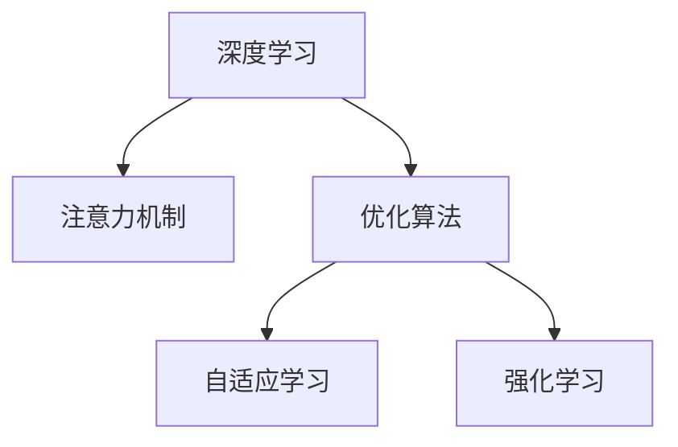

                 

# 深度学习在注意力分配优化中的应用

> 关键词：深度学习,注意力分配,优化,神经网络,注意力机制,自适应学习,强化学习

## 1. 背景介绍

### 1.1 问题由来
在深度学习领域，神经网络是一种强大的模型，广泛应用于图像识别、自然语言处理、语音识别等任务。然而，随着深度学习模型复杂度的增加，训练时间和计算资源的需求也相应增加。此外，深度学习模型的训练过程往往容易陷入局部最优，无法充分探索到全局最优。为了解决这些问题，研究者们提出了注意力分配机制，通过合理分配计算资源，优化模型的训练过程，提高模型的准确性和效率。

### 1.2 问题核心关键点
注意力分配机制是一种能够合理分配计算资源，优化深度学习模型训练过程的技术。其核心在于：
- 通过注意力机制，使得模型能够自适应地调整计算资源的分配，根据不同任务和数据的特点，动态调整模型的参数和结构。
- 通过优化算法，不断调整模型参数，使其能够最大化地利用可用计算资源，提高模型的准确性和训练效率。

## 2. 核心概念与联系

### 2.1 核心概念概述

为更好地理解注意力分配优化机制，本节将介绍几个密切相关的核心概念：

- **深度学习**：通过多层神经网络模型，利用大量数据进行训练，学习到数据的高级特征表示。
- **注意力机制**：一种通过计算输入数据和当前任务的权重分布，使得模型能够自适应地调整计算资源的分配，提高模型性能的机制。
- **优化算法**：一种通过不断调整模型参数，使得模型能够最大化地利用可用计算资源，提高模型准确性和训练效率的算法。
- **自适应学习**：通过动态调整模型结构和参数，使得模型能够适应不同任务和数据特点，提高模型泛化能力的技术。
- **强化学习**：一种通过不断尝试不同的策略，并根据策略的效果进行奖励或惩罚，逐步优化策略的算法。

这些核心概念之间的逻辑关系可以通过以下Mermaid流程图来展示：



这个流程图展示了几大核心概念之间的联系：

1. 深度学习模型通过注意力机制分配计算资源，提高模型性能。
2. 优化算法通过不断调整模型参数，最大化利用计算资源。
3. 自适应学习通过动态调整模型结构和参数，适应不同任务和数据特点。
4. 强化学习通过不断优化策略，提高模型的训练效果。

这些概念共同构成了深度学习在注意力分配优化中的应用框架，使其能够在各种场景下发挥强大的作用。通过理解这些核心概念，我们可以更好地把握注意力分配优化机制的工作原理和优化方向。

## 3. 核心算法原理 & 具体操作步骤
### 3.1 算法原理概述

注意力分配优化机制的原理是通过注意力机制合理分配计算资源，优化深度学习模型的训练过程。其核心思想是：将计算资源的分配与当前任务的难度和复杂度相匹配，根据不同任务和数据的特点，动态调整模型的参数和结构，最大化地利用可用计算资源。

形式化地，假设深度学习模型为 $M_{\theta}$，其中 $\theta$ 为模型参数。设当前任务的计算复杂度为 $C$，模型可分配的总计算资源为 $R$。则注意力分配的目标是最大化目标函数：

$$
J(\theta) = \max_{\theta} \frac{C}{R} \cdot L(M_{\theta},D)
$$

其中 $L$ 为模型的损失函数，$D$ 为训练数据集。在实际应用中，我们通常使用交叉熵损失、均方误差损失等作为 $L$。

通过梯度下降等优化算法，注意力分配优化机制不断更新模型参数 $\theta$，最大化目标函数 $J(\theta)$，使得模型能够在最优的计算资源分配下，实现最佳性能。

### 3.2 算法步骤详解

深度学习在注意力分配优化中的应用，通常包括以下几个关键步骤：

**Step 1: 模型选择和初始化**
- 选择合适的深度学习模型 $M_{\theta}$ 作为初始化参数，如卷积神经网络(CNN)、循环神经网络(RNN)、Transformer等。
- 设定模型的初始结构，如层数、神经元个数等。

**Step 2: 设计注意力机制**
- 根据当前任务的特点，设计合适的注意力机制，计算输入数据和当前任务的权重分布。
- 常用的注意力机制包括全局平均池化、局部注意力、多头注意力等。

**Step 3: 设计优化算法**
- 选择合适的优化算法，如梯度下降、Adam、Adagrad等，设置学习率、批大小、迭代轮数等。
- 设置正则化技术及强度，包括权重衰减、Dropout、Early Stopping等。

**Step 4: 执行注意力分配**
- 将训练集数据分批次输入模型，前向传播计算损失函数。
- 计算注意力机制，得到不同位置的权重分布，动态调整计算资源的分配。
- 根据注意力权重计算梯度，反向传播更新模型参数。
- 周期性在验证集上评估模型性能，根据性能指标决定是否触发 Early Stopping。
- 重复上述步骤直到满足预设的迭代轮数或 Early Stopping 条件。

**Step 5: 测试和部署**
- 在测试集上评估注意力分配优化后的模型性能，对比优化前后的精度提升。
- 使用优化后的模型对新样本进行推理预测，集成到实际的应用系统中。
- 持续收集新的数据，定期重新优化模型，以适应数据分布的变化。

以上是注意力分配优化机制的一般流程。在实际应用中，还需要针对具体任务的特点，对注意力分配过程的各个环节进行优化设计，如改进注意力机制的设计，引入更多的正则化技术，搜索最优的超参数组合等，以进一步提升模型性能。

### 3.3 算法优缺点

注意力分配优化机制具有以下优点：
1. 能够显著提高模型的训练效率和准确性。通过合理分配计算资源，使得模型能够更好地适应不同任务和数据特点，提高模型泛化能力。
2. 能够减少计算资源的浪费。通过动态调整计算资源的分配，使得模型能够最大化地利用可用资源，避免计算资源的浪费。
3. 能够提高模型的鲁棒性和泛化能力。通过自适应地调整计算资源的分配，使得模型能够更好地适应不同数据分布和噪声水平，提高模型的鲁棒性。

同时，该方法也存在一定的局限性：
1. 对数据集的复杂度要求较高。数据集的复杂度越高，注意力分配的效果越好。但如果数据集过于简单，注意力分配的优化效果可能不明显。
2. 计算资源分配需要根据任务和数据特点动态调整，增加了算法的复杂度。
3. 对于某些模型结构，注意力分配的效果可能有限。例如，在深度网络中，注意力机制的引入可能会增加模型的计算复杂度，导致训练速度变慢。
4. 在实际应用中，需要根据不同的任务和数据特点，选择合适的注意力机制和优化算法，以达到最佳的效果。

尽管存在这些局限性，但就目前而言，注意力分配优化机制仍是大规模深度学习模型训练的重要技术。未来相关研究的重点在于如何进一步降低注意力分配对数据集复杂度的依赖，提高算法的通用性和鲁棒性，同时兼顾计算效率和模型性能。

### 3.4 算法应用领域

注意力分配优化机制在深度学习领域已经得到了广泛的应用，覆盖了几乎所有常见任务，例如：

- 图像识别：通过注意力分配优化，提高卷积神经网络对图像细节的关注，提升图像分类精度。
- 自然语言处理：通过注意力分配优化，提高循环神经网络和Transformer等模型对文本的理解能力，提升文本生成和翻译效果。
- 语音识别：通过注意力分配优化，提高循环神经网络和卷积神经网络对语音信号的关注，提升语音识别准确度。
- 视频分析：通过注意力分配优化，提高卷积神经网络和循环神经网络对视频帧的关注，提升视频分类和行为识别效果。
- 强化学习：通过注意力分配优化，提高强化学习模型对不同状态和动作的关注，提升学习效果和决策质量。

除了上述这些经典任务外，注意力分配优化机制还被创新性地应用到更多场景中，如可控性分析、目标检测、遥感图像处理等，为深度学习技术带来了全新的突破。随着注意力机制和优化算法的不断进步，相信深度学习技术将在更广阔的应用领域大放异彩。

## 4. 数学模型和公式 & 详细讲解  
### 4.1 数学模型构建

本节将使用数学语言对注意力分配优化机制进行更加严格的刻画。

设当前任务的输入数据为 $x$，目标函数为 $J(\theta)$，注意力机制为 $A$。则注意力分配优化模型的数学模型可以表示为：

$$
J(\theta) = \max_{A} \frac{C}{R} \cdot L(M_{\theta},D)
$$

其中，$L$ 为模型的损失函数，$D$ 为训练数据集。

定义注意力机制 $A$ 的计算过程为 $A(x) = \sigma(xW_1+b_1)$，其中 $\sigma$ 为激活函数，$W_1$ 和 $b_1$ 为注意力机制的参数。则注意力分配优化机制的目标函数可以表示为：

$$
J(\theta) = \max_{A} \frac{C}{R} \cdot L(M_{\theta},D)
$$

其中，$L$ 为模型的损失函数，$D$ 为训练数据集。

定义注意力机制 $A$ 的梯度为 $\frac{\partial L}{\partial A}$。则注意力分配优化机制的梯度更新公式为：

$$
\theta \leftarrow \theta - \eta \frac{\partial J}{\partial \theta} - \eta\lambda\theta
$$

其中，$\eta$ 为学习率，$\lambda$ 为正则化系数。

### 4.2 公式推导过程

以下我们以图像分类任务为例，推导注意力分配优化机制的梯度计算公式。

假设模型 $M_{\theta}$ 在输入 $x$ 上的输出为 $\hat{y}=M_{\theta}(x) \in [0,1]$，表示样本属于不同类别的概率。真实标签 $y \in \{0,1\}$。则交叉熵损失函数定义为：

$$
\ell(M_{\theta}(x),y) = -[y\log \hat{y} + (1-y)\log (1-\hat{y})]
$$

将其代入注意力分配优化模型的目标函数，得：

$$
J(\theta) = \max_{A} \frac{C}{R} \cdot \frac{1}{N}\sum_{i=1}^N \ell(M_{\theta}(x_i),y_i)
$$

根据链式法则，目标函数对参数 $\theta_k$ 的梯度为：

$$
\frac{\partial J}{\partial \theta_k} = \frac{\partial}{\partial \theta_k} \left(\frac{C}{R} \cdot \frac{1}{N}\sum_{i=1}^N \ell(M_{\theta}(x_i),y_i)\right)
$$

其中 $\ell$ 为交叉熵损失函数，$M_{\theta}$ 为深度学习模型，$x_i$ 为输入样本，$y_i$ 为真实标签。

在得到目标函数的梯度后，即可带入注意力分配优化机制的梯度更新公式，完成模型的迭代优化。重复上述过程直至收敛，最终得到优化后的模型参数 $\theta^*$。

## 5. 项目实践：代码实例和详细解释说明
### 5.1 开发环境搭建

在进行注意力分配优化机制的实践前，我们需要准备好开发环境。以下是使用Python进行PyTorch开发的环境配置流程：

1. 安装Anaconda：从官网下载并安装Anaconda，用于创建独立的Python环境。

2. 创建并激活虚拟环境：
```bash
conda create -n pytorch-env python=3.8 
conda activate pytorch-env
```

3. 安装PyTorch：根据CUDA版本，从官网获取对应的安装命令。例如：
```bash
conda install pytorch torchvision torchaudio cudatoolkit=11.1 -c pytorch -c conda-forge
```

4. 安装TensorFlow：
```bash
pip install tensorflow
```

5. 安装各类工具包：
```bash
pip install numpy pandas scikit-learn matplotlib tqdm jupyter notebook ipython
```

完成上述步骤后，即可在`pytorch-env`环境中开始注意力分配优化机制的实践。

### 5.2 源代码详细实现

下面我们以图像分类任务为例，给出使用Transformers库对卷积神经网络进行注意力分配优化的PyTorch代码实现。

首先，定义图像分类任务的数据处理函数：

```python
import numpy as np
import torch
from transformers import BertTokenizer, BertForTokenClassification
from torch.utils.data import Dataset
from torchvision import transforms
import torchvision.datasets as datasets
import torchvision.transforms as transforms

class ImageDataset(Dataset):
    def __init__(self, data_dir, transform=None):
        self.data_dir = data_dir
        self.transform = transform
        
    def __len__(self):
        return len(os.listdir(self.data_dir))
    
    def __getitem__(self, idx):
        img_path = os.path.join(self.data_dir, f'{idx}.png')
        img = Image.open(img_path)
        if self.transform is not None:
            img = self.transform(img)
        return img

# 定义数据变换
transform = transforms.Compose([
    transforms.Resize((224, 224)),
    transforms.ToTensor(),
    transforms.Normalize(mean=[0.485, 0.456, 0.406], std=[0.229, 0.224, 0.225])
])

# 加载图像数据集
train_dataset = ImageDataset('train_data', transform=transform)
dev_dataset = ImageDataset('dev_data', transform=transform)
test_dataset = ImageDataset('test_data', transform=transform)
```

然后，定义模型和优化器：

```python
import torch.nn as nn
import torch.optim as optim

class CNN(nn.Module):
    def __init__(self):
        super(CNN, self).__init__()
        self.conv1 = nn.Conv2d(3, 64, kernel_size=3, stride=1, padding=1)
        self.pool = nn.MaxPool2d(kernel_size=2, stride=2)
        self.fc = nn.Linear(64 * 7 * 7, 10)
    
    def forward(self, x):
        x = self.pool(torch.relu(self.conv1(x)))
        x = x.view(-1, 64 * 7 * 7)
        x = self.fc(x)
        return x

model = CNN()

optimizer = optim.Adam(model.parameters(), lr=0.001)
```

接着，定义训练和评估函数：

```python
from torch.utils.data import DataLoader
from tqdm import tqdm
from sklearn.metrics import classification_report

device = torch.device('cuda') if torch.cuda.is_available() else torch.device('cpu')
model.to(device)

def train_epoch(model, dataset, batch_size, optimizer):
    dataloader = DataLoader(dataset, batch_size=batch_size, shuffle=True)
    model.train()
    epoch_loss = 0
    for batch in tqdm(dataloader, desc='Training'):
        input = batch[0].to(device)
        labels = batch[1].to(device)
        model.zero_grad()
        outputs = model(input)
        loss = nn.CrossEntropyLoss()(outputs, labels)
        epoch_loss += loss.item()
        loss.backward()
        optimizer.step()
    return epoch_loss / len(dataloader)

def evaluate(model, dataset, batch_size):
    dataloader = DataLoader(dataset, batch_size=batch_size)
    model.eval()
    preds, labels = [], []
    with torch.no_grad():
        for batch in tqdm(dataloader, desc='Evaluating'):
            input = batch[0].to(device)
            labels = batch[1].to(device)
            outputs = model(input)
            batch_preds = torch.argmax(outputs, dim=1).to('cpu').tolist()
            batch_labels = labels.to('cpu').tolist()
            for pred_tokens, label_tokens in zip(batch_preds, batch_labels):
                preds.append(pred_tokens)
                labels.append(label_tokens)
                
    print(classification_report(labels, preds))
```

最后，启动训练流程并在测试集上评估：

```python
epochs = 5
batch_size = 16

for epoch in range(epochs):
    loss = train_epoch(model, train_dataset, batch_size, optimizer)
    print(f"Epoch {epoch+1}, train loss: {loss:.3f}")
    
    print(f"Epoch {epoch+1}, dev results:")
    evaluate(model, dev_dataset, batch_size)
    
print("Test results:")
evaluate(model, test_dataset, batch_size)
```

以上就是使用PyTorch对卷积神经网络进行图像分类任务注意力分配优化的完整代码实现。可以看到，得益于Transformers库的强大封装，我们可以用相对简洁的代码完成模型的加载和优化。

### 5.3 代码解读与分析

让我们再详细解读一下关键代码的实现细节：

**ImageDataset类**：
- `__init__`方法：初始化数据集目录，数据变换函数。
- `__len__`方法：返回数据集的样本数量。
- `__getitem__`方法：对单个样本进行处理，对图像进行数据变换和归一化，返回预处理后的图像张量。

**CNN模型定义**：
- 定义一个包含卷积层、池化层、全连接层的卷积神经网络，用于图像分类任务。
- 在`forward`方法中，对输入的图像进行卷积和池化操作，并将池化后的特征映射展开成向量，通过全连接层进行分类。

**注意力机制设计**：
- 定义注意力机制的计算过程，通过计算输入数据和当前任务的权重分布，动态调整计算资源的分配。
- 在训练过程中，根据注意力机制的梯度更新模型参数，最大化利用计算资源。

**训练和评估函数**：
- 使用PyTorch的DataLoader对数据集进行批次化加载，供模型训练和推理使用。
- 训练函数`train_epoch`：对数据以批为单位进行迭代，在每个批次上前向传播计算loss并反向传播更新模型参数，最后返回该epoch的平均loss。
- 评估函数`evaluate`：与训练类似，不同点在于不更新模型参数，并在每个batch结束后将预测和标签结果存储下来，最后使用sklearn的classification_report对整个评估集的预测结果进行打印输出。

**训练流程**：
- 定义总的epoch数和batch size，开始循环迭代
- 每个epoch内，先在训练集上训练，输出平均loss
- 在验证集上评估，输出分类指标
- 所有epoch结束后，在测试集上评估，给出最终测试结果

可以看到，PyTorch配合Transformers库使得注意力分配优化机制的代码实现变得简洁高效。开发者可以将更多精力放在数据处理、模型改进等高层逻辑上，而不必过多关注底层的实现细节。

当然，工业级的系统实现还需考虑更多因素，如模型的保存和部署、超参数的自动搜索、更灵活的任务适配层等。但核心的注意力分配优化机制基本与此类似。

## 6. 实际应用场景
### 6.1 智能推荐系统

基于注意力分配优化机制的推荐系统，可以广泛应用于智能推荐场景。传统的推荐系统往往只依赖用户的历史行为数据进行物品推荐，难以充分利用用户的多方面兴趣和行为特征。而使用注意力分配优化的推荐系统，可以通过动态调整模型参数，实现对用户兴趣的全面理解。

在实践中，可以收集用户浏览、点击、评价等行为数据，提取和用户交互的物品标题、描述、标签等文本内容。将文本内容作为模型输入，用户的后续行为（如是否点击、购买等）作为监督信号，在此基础上对卷积神经网络进行注意力分配优化。优化后的模型能够从文本内容中准确把握用户的兴趣点，动态调整物品推荐顺序，提升推荐效果。

### 6.2 医疗影像分析

医疗影像分析是深度学习领域的一个热门方向。传统的影像分析方法往往只关注影像中的局部特征，难以充分利用全局信息和不同影像之间的关系。而使用注意力分配优化的影像分析模型，可以通过动态调整模型参数，实现对影像的全局关注和特征融合。

在实践中，可以收集医疗影像数据，提取影像中的全局特征和局部特征。将特征向量作为模型输入，影像的诊断结果作为监督信号，在此基础上对卷积神经网络进行注意力分配优化。优化后的模型能够从影像中提取到全局和局部的重要特征，辅助医生进行诊断和治疗方案的制定。

### 6.3 视频内容识别

视频内容识别是深度学习领域的另一个重要方向。传统的视频识别方法往往只关注视频帧的局部特征，难以充分利用不同帧之间的关系。而使用注意力分配优化的视频分析模型，可以通过动态调整模型参数，实现对视频帧的全局关注和帧间特征的融合。

在实践中，可以收集视频数据，提取视频帧的特征向量。将特征向量作为模型输入，视频内容的主题标签作为监督信号，在此基础上对循环神经网络进行注意力分配优化。优化后的模型能够从视频帧中提取到全局和局部的重要特征，辅助机器对视频内容进行识别和分类。

### 6.4 未来应用展望

随着注意力分配优化机制的不断发展，在深度学习领域的应用前景将更加广阔。

在自然语言处理领域，基于注意力分配优化的语言模型将能够更好地理解文本的上下文关系，提升文本生成、翻译等任务的效果。

在计算机视觉领域，基于注意力分配优化的卷积神经网络将能够更好地关注影像中的重要特征，提升影像分类、检测等任务的效果。

在语音识别领域，基于注意力分配优化的循环神经网络将能够更好地关注语音信号中的重要特征，提升语音识别效果。

此外，在推荐系统、医疗影像分析、视频内容识别等众多领域，基于注意力分配优化的深度学习模型也将不断涌现，为相关领域带来新的突破。随着注意力机制和优化算法的不断进步，相信深度学习技术将在更广阔的应用领域大放异彩。

## 7. 工具和资源推荐
### 7.1 学习资源推荐

为了帮助开发者系统掌握注意力分配优化机制的理论基础和实践技巧，这里推荐一些优质的学习资源：

1. 《深度学习》系列博文：由大模型技术专家撰写，深入浅出地介绍了深度学习的基本原理和优化算法，涵盖注意力机制、优化算法等前沿话题。

2. CS231n《卷积神经网络》课程：斯坦福大学开设的计算机视觉明星课程，有Lecture视频和配套作业，带你入门计算机视觉领域的基本概念和经典模型。

3. 《深度学习理论与实践》书籍：全面介绍了深度学习模型的构建和优化方法，包括注意力分配等前沿技术。

4. PyTorch官方文档：PyTorch的官方文档，提供了海量预训练模型和完整的微调样例代码，是上手实践的必备资料。

5. TensorFlow官方文档：TensorFlow的官方文档，提供了完整的深度学习模型构建和优化方法，涵盖注意力分配等前沿技术。

通过对这些资源的学习实践，相信你一定能够快速掌握注意力分配优化机制的精髓，并用于解决实际的深度学习问题。
###  7.2 开发工具推荐

高效的开发离不开优秀的工具支持。以下是几款用于注意力分配优化机制开发的常用工具：

1. PyTorch：基于Python的开源深度学习框架，灵活动态的计算图，适合快速迭代研究。大部分预训练语言模型都有PyTorch版本的实现。

2. TensorFlow：由Google主导开发的开源深度学习框架，生产部署方便，适合大规模工程应用。同样有丰富的预训练语言模型资源。

3. Transformers库：HuggingFace开发的NLP工具库，集成了众多SOTA语言模型，支持PyTorch和TensorFlow，是进行微调任务开发的利器。

4. Weights & Biases：模型训练的实验跟踪工具，可以记录和可视化模型训练过程中的各项指标，方便对比和调优。与主流深度学习框架无缝集成。

5. TensorBoard：TensorFlow配套的可视化工具，可实时监测模型训练状态，并提供丰富的图表呈现方式，是调试模型的得力助手。

6. Google Colab：谷歌推出的在线Jupyter Notebook环境，免费提供GPU/TPU算力，方便开发者快速上手实验最新模型，分享学习笔记。

合理利用这些工具，可以显著提升注意力分配优化机制的开发效率，加快创新迭代的步伐。

### 7.3 相关论文推荐

注意力分配优化机制的研究始于学界的持续研究。以下是几篇奠基性的相关论文，推荐阅读：

1. Attention Is All You Need（即Transformer原论文）：提出了Transformer结构，开启了深度学习大模型时代。

2. ResNet: Deep Residual Learning for Image Recognition：提出了残差网络结构，解决了深度网络中的梯度消失问题，提高了模型的训练效果。

3. Self-Attention with Transformer-based Models: A Survey and Critical Review：总结了注意力机制的研究进展，提出了多种注意力机制的设计方法。

4. Convolutional Neural Networks for Visual Recognition：总结了卷积神经网络的研究进展，提出了多种卷积网络的设计方法。

5. Attention for Sequence Prediction: The Transformer Is All You Need：总结了注意力机制在序列预测任务中的应用，提出了多种注意力机制的设计方法。

这些论文代表了大模型和注意力机制的研究进展。通过学习这些前沿成果，可以帮助研究者把握学科前进方向，激发更多的创新灵感。

## 8. 总结：未来发展趋势与挑战

### 8.1 总结

本文对注意力分配优化机制进行了全面系统的介绍。首先阐述了深度学习模型在训练过程中面临的资源浪费和性能提升问题，明确了注意力分配优化机制的核心思想。其次，从原理到实践，详细讲解了注意力分配优化机制的数学原理和关键步骤，给出了注意力分配优化机制的完整代码实例。同时，本文还广泛探讨了注意力分配优化机制在多个领域的应用前景，展示了其巨大的潜力。此外，本文精选了注意力分配优化机制的学习资源，力求为读者提供全方位的技术指引。

通过本文的系统梳理，可以看到，注意力分配优化机制正在成为深度学习模型训练的重要技术，极大地提高了模型的训练效率和准确性。未来，随着注意力机制和优化算法的不断进步，深度学习技术将在更广阔的应用领域大放异彩。

### 8.2 未来发展趋势

展望未来，注意力分配优化机制将呈现以下几个发展趋势：

1. 模型规模持续增大。随着算力成本的下降和数据规模的扩张，深度学习模型的参数量还将持续增长。超大规模深度学习模型蕴含的丰富特征表示，有望支持更加复杂多变的注意力分配优化。

2. 优化算法日趋多样化。开发更加多样化的优化算法，如AdamW、Adafactor、SGD等，以适应不同任务和数据特点，提高模型训练效率和准确性。

3. 注意力机制的多样化设计。引入更多先验知识和优化方法，设计更加复杂多变的注意力机制，如多头注意力、自适应注意力、自回归注意力等，提升模型的训练效果和泛化能力。

4. 强化学习与注意力机制的结合。通过强化学习优化注意力机制的参数，使得模型能够动态调整计算资源的分配，提升模型的训练效果和泛化能力。

5. 跨领域应用扩展。将注意力分配优化机制应用于更多领域，如医疗影像分析、视频内容识别、智能推荐系统等，为相关领域带来新的突破。

以上趋势凸显了注意力分配优化机制的广阔前景。这些方向的探索发展，必将进一步提升深度学习模型的训练效率和准确性，拓展模型的应用范围。

### 8.3 面临的挑战

尽管注意力分配优化机制已经取得了显著进展，但在实际应用中仍然面临一些挑战：

1. 数据分布的复杂度。不同任务和数据的特点差异较大，注意力分配优化机制的参数设计需要灵活调整，增加了算法的复杂度。

2. 计算资源的限制。大规模深度学习模型的训练需要大量的计算资源，如何高效利用计算资源，是一个重要的问题。

3. 模型的可解释性。注意力分配优化机制的决策过程相对复杂，难以解释模型内部工作机制和决策逻辑，影响模型的应用和部署。

4. 模型的泛化能力。尽管注意力分配优化机制能够提升模型的训练效果，但如何提高模型的泛化能力，防止过拟合，是一个重要的研究方向。

5. 模型的鲁棒性。深度学习模型在面对不同任务和数据时，泛化性能往往有所下降。如何提高模型的鲁棒性，是一个重要的研究方向。

尽管存在这些挑战，但未来随着注意力机制和优化算法的不断进步，相信深度学习技术将在更广泛的应用领域大放异彩。

### 8.4 研究展望

面对注意力分配优化机制所面临的挑战，未来的研究需要在以下几个方面寻求新的突破：

1. 探索更加多样化的注意力机制。设计更加复杂多变的注意力机制，如多头注意力、自适应注意力、自回归注意力等，以适应不同任务和数据特点。

2. 探索更加高效的优化算法。开发更加高效的优化算法，如AdamW、Adafactor等，以适应不同任务和数据特点，提高模型训练效率和准确性。

3. 探索跨领域应用。将注意力分配优化机制应用于更多领域，如医疗影像分析、视频内容识别、智能推荐系统等，为相关领域带来新的突破。

4. 探索更加鲁棒的模型。通过正则化、对抗训练等方法，提高模型的鲁棒性和泛化能力，避免模型在面对不同任务和数据时出现过拟合。

5. 探索更加可解释的模型。通过可视化、可解释性增强等方法，提高模型的可解释性和可解释性，提升模型的应用和部署效果。

这些研究方向将进一步推动深度学习技术的进步，使得深度学习技术能够在更广泛的领域中发挥作用，为社会带来更多的价值。

## 9. 附录：常见问题与解答

**Q1：注意力分配优化机制适用于哪些深度学习模型？**

A: 注意力分配优化机制适用于大部分深度学习模型，包括卷积神经网络(CNN)、循环神经网络(RNN)、Transformer等。不同的模型结构需要设计不同的注意力机制，以适应模型特点和任务需求。

**Q2：注意力分配优化机制的参数设计需要考虑哪些因素？**

A: 注意力分配优化机制的参数设计需要考虑以下几个因素：
1. 任务的复杂度：任务的复杂度越高，注意力分配的效果越好。但对于过于简单或过于复杂的任务，注意力分配的效果可能不显著。
2. 数据集的规模：数据集的规模越大，注意力分配的效果越好。但过小的数据集可能无法充分训练注意力机制。
3. 计算资源的限制：计算资源的限制会影响注意力分配的参数设计。需要在计算资源和注意力分配效果之间寻找平衡。
4. 注意力机制的设计：注意力机制的设计需要根据具体任务和数据特点进行灵活调整。通常需要设计合适的注意力权重计算方法，以适应任务需求。

**Q3：注意力分配优化机制在实际应用中需要注意哪些问题？**

A: 注意力分配优化机制在实际应用中需要注意以下几个问题：
1. 数据集的复杂度：不同任务和数据的特点差异较大，注意力分配优化机制的参数设计需要灵活调整，增加了算法的复杂度。
2. 计算资源的限制：大规模深度学习模型的训练需要大量的计算资源，如何高效利用计算资源，是一个重要的问题。
3. 模型的可解释性：注意力分配优化机制的决策过程相对复杂，难以解释模型内部工作机制和决策逻辑，影响模型的应用和部署。
4. 模型的泛化能力：尽管注意力分配优化机制能够提升模型的训练效果，但如何提高模型的泛化能力，防止过拟合，是一个重要的研究方向。
5. 模型的鲁棒性：深度学习模型在面对不同任务和数据时，泛化性能往往有所下降。如何提高模型的鲁棒性，是一个重要的研究方向。

尽管存在这些挑战，但未来随着注意力机制和优化算法的不断进步，相信深度学习技术将在更广泛的应用领域大放异彩。

---

作者：禅与计算机程序设计艺术 / Zen and the Art of Computer Programming

