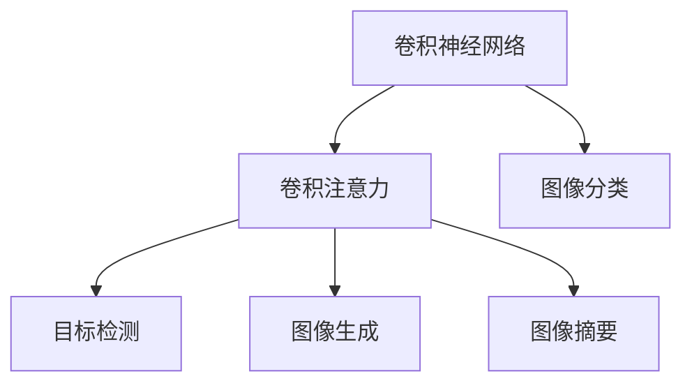

                 

# 深度学习在注意力预测中的应用

> 关键词：注意力预测,深度学习,卷积神经网络,卷积注意力,自监督学习,计算机视觉

## 1. 背景介绍

### 1.1 问题由来
近年来，随着深度学习技术的快速发展，计算机视觉领域取得了许多重要突破。其中，注意力机制（Attention Mechanism）作为一项革命性技术，被广泛应用于图像分类、目标检测、图像生成等任务中，显著提升了模型的表现力和泛化能力。注意力机制通过动态计算不同特征间的权重，强调了模型对关键特征的关注，从而提升了模型的决策能力和鲁棒性。

本节将介绍深度学习在注意力预测中的应用，特别是卷积注意力在图像分类和目标检测中的作用，以及它在图像生成和图像摘要等任务中的创新应用。

### 1.2 问题核心关键点
注意力预测的核心在于通过学习特征间的相互作用，动态调整对不同特征的关注度，从而提升模型在图像分类、目标检测、图像生成等任务上的表现。具体来说，注意力机制将输入的图像特征向量映射到一个权重向量，这些权重表示模型对各个特征的关注程度，最终通过加权和的方式生成预测结果。

注意力机制主要分为软注意力（Soft Attention）和硬注意力（Hard Attention）两种形式，前者通过计算所有特征的注意力权重，后者则根据某些规则只关注部分特征。硬注意力通常用于目标检测等任务，而软注意力则广泛应用于图像分类、图像生成等任务。

## 2. 核心概念与联系

### 2.1 核心概念概述

为更好地理解注意力预测的原理和架构，本节将介绍几个密切相关的核心概念：

- 卷积神经网络（Convolutional Neural Networks, CNNs）：一种用于图像处理的深度学习模型，通过卷积操作提取图像局部特征。
- 卷积注意力（Convolutional Attention）：结合卷积操作和注意力机制，通过学习特征间的相互作用，动态调整对不同特征的关注度。
- 自监督学习（Self-supervised Learning）：利用数据自身的特征，无监督地学习模型参数。
- 图像分类（Image Classification）：将输入图像分为不同的类别。
- 目标检测（Object Detection）：在图像中检测并定位物体，并标注物体类别。
- 图像生成（Image Generation）：根据给定的描述或特征生成新的图像。
- 图像摘要（Image Summarization）：将输入图像压缩成简洁的摘要。

这些核心概念之间的逻辑关系可以通过以下Mermaid流程图来展示：



这个流程图展示了大语言模型微调的各个核心概念及其之间的联系：

1. 卷积神经网络通过卷积操作提取图像局部特征。
2. 卷积注意力结合卷积操作和注意力机制，通过学习特征间的相互作用，动态调整对不同特征的关注度。
3. 卷积注意力被应用于图像分类、目标检测、图像生成和图像摘要等任务，提升模型表现力。

## 3. 核心算法原理 & 具体操作步骤
### 3.1 算法原理概述

卷积注意力预测的原理可以概述为以下几个步骤：

1. 通过卷积操作提取图像特征。
2. 利用注意力机制动态计算各个特征的权重。
3. 根据权重向量加权求和生成预测结果。

具体来说，卷积注意力预测可以分为两个阶段：特征提取和注意力计算。在特征提取阶段，通过卷积操作提取图像特征，生成特征图。在注意力计算阶段，通过注意力机制计算各个特征的权重，并将权重与特征图相乘，得到加权特征图。最终，通过加权特征图进行分类、检测、生成或摘要等操作。

### 3.2 算法步骤详解

卷积注意力预测的一般步骤如下：

**Step 1: 特征提取**
通过卷积操作提取输入图像的特征。一般使用卷积神经网络，包括卷积层、池化层和批量归一化层等。卷积层的输出为特征图，其维度通常为$(N,C,H,W)$，其中$N$表示样本数，$C$表示通道数，$H$和$W$表示特征图的高度和宽度。

**Step 2: 注意力计算**
在特征提取的基础上，利用注意力机制计算特征图每个位置的权重。常用的注意力机制包括Softmax注意力和点积注意力等。点积注意力计算公式为：

$$
a_{ij} = \text{softmax}(\text{scores}_i \cdot \text{scores}_j^T)
$$

其中，$\text{scores}_i$和$\text{scores}_j$分别表示特征图$i$和$j$的特征向量，$a_{ij}$表示特征$i$和$j$之间的注意力权重。

**Step 3: 生成预测结果**
将特征图和权重向量相乘，得到加权特征图。使用全连接层、池化层等进行进一步处理，最终生成预测结果。

### 3.3 算法优缺点

卷积注意力预测的优点在于：

1. 能够自适应地捕捉图像中的重要特征，提升模型表现力。
2. 适用于图像分类、目标检测、图像生成等任务。
3. 易于与卷积神经网络进行结合，实现模型的高效训练。

其缺点在于：

1. 计算复杂度高，需要大量的计算资源。
2. 过度关注模型复杂度，可能忽视了模型的可解释性。
3. 对输入数据的噪声和异常值较为敏感。

### 3.4 算法应用领域

卷积注意力预测在计算机视觉领域有着广泛的应用，主要包括以下几个方面：

1. 图像分类：通过卷积注意力提取图像特征，并动态计算特征间的注意力权重，生成最终的分类结果。

2. 目标检测：结合卷积神经网络和卷积注意力，对图像中的物体进行检测和定位。

3. 图像生成：利用卷积注意力生成高分辨率、高质量的图像。

4. 图像摘要：通过卷积注意力提取图像的关键词，生成简洁的摘要。

## 4. 数学模型和公式 & 详细讲解 & 举例说明

### 4.1 数学模型构建

卷积注意力预测的数学模型可以表示为：

$$
y = \text{softmax}(\text{scores})
$$

其中，$y$表示预测结果，$\text{scores}$表示特征图之间的注意力权重向量。

### 4.2 公式推导过程

点积注意力的计算公式如下：

$$
a_{ij} = \text{softmax}(\text{scores}_i \cdot \text{scores}_j^T)
$$

其中，$\text{scores}_i$和$\text{scores}_j$分别表示特征图$i$和$j$的特征向量，$a_{ij}$表示特征$i$和$j$之间的注意力权重。

通过上述公式，可以计算出每个特征的注意力权重，并将权重与特征图相乘，得到加权特征图。加权特征图再经过全连接层、池化层等处理，即可得到最终的预测结果。

### 4.3 案例分析与讲解

以图像分类为例，假设输入图像特征图为$x_i$，其维度为$(N,C,H,W)$，卷积核大小为$3 \times 3$，步长为$2$，经过卷积操作后的特征图为$x_i'$，其维度为$(N,C,H',W')$。假设特征图$i$和$j$的特征向量分别为$\text{scores}_i$和$\text{scores}_j$。通过点积注意力计算得到特征$i$和$j$之间的注意力权重$a_{ij}$，并进行加权求和，得到最终的分类结果$y$。

## 5. 项目实践：代码实例和详细解释说明

### 5.1 开发环境搭建

在进行卷积注意力预测实践前，我们需要准备好开发环境。以下是使用Python进行TensorFlow开发的环境配置流程：

1. 安装Anaconda：从官网下载并安装Anaconda，用于创建独立的Python环境。

2. 创建并激活虚拟环境：
```bash
conda create -n tf-env python=3.8 
conda activate tf-env
```

3. 安装TensorFlow：根据CUDA版本，从官网获取对应的安装命令。例如：
```bash
conda install tensorflow==2.6
```

4. 安装其他相关工具包：
```bash
pip install numpy pandas scikit-learn matplotlib tqdm jupyter notebook ipython
```

完成上述步骤后，即可在`tf-env`环境中开始卷积注意力预测的实践。

### 5.2 源代码详细实现

这里我们以图像分类任务为例，给出使用TensorFlow实现卷积注意力预测的代码实现。

```python
import tensorflow as tf
from tensorflow.keras import layers
from tensorflow.keras import backend as K

class Attention(tf.keras.layers.Layer):
    def __init__(self, filters):
        super(Attention, self).__init__()
        self.filters = filters
        
    def call(self, inputs):
        scores = K.dot(inputs, inputs, transpose_b=True)
        attention_weights = tf.nn.softmax(scores, axis=-1)
        return attention_weights

class ConvAttention(tf.keras.layers.Layer):
    def __init__(self, filters):
        super(ConvAttention, self).__init__()
        self.conv1 = layers.Conv2D(filters, (3, 3), padding='same')
        self.attention = Attention(filters)
        
    def call(self, inputs):
        x = self.conv1(inputs)
        attention_weights = self.attention(x)
        return x * attention_weights

class ConvolutionalAttention(tf.keras.layers.Layer):
    def __init__(self, filters):
        super(ConvolutionalAttention, self).__init__()
        self.conv1 = layers.Conv2D(filters, (3, 3), padding='same')
        self.conv2 = layers.Conv2D(filters, (3, 3), padding='same')
        self.attention = Attention(filters)
        
    def call(self, inputs):
        x = self.conv1(inputs)
        y = self.conv2(inputs)
        attention_weights = self.attention([x, y])
        return y * attention_weights

model = tf.keras.Sequential([
    layers.Conv2D(32, (3, 3), activation='relu', padding='same'),
    ConvolutionalAttention(32),
    layers.MaxPooling2D((2, 2), strides=2, padding='same'),
    layers.Flatten(),
    layers.Dense(10, activation='softmax')
])
```

在上述代码中，我们定义了三个卷积注意力层：

- `Attention`层：用于计算特征间的注意力权重。
- `ConvAttention`层：将卷积操作和注意力机制结合起来，生成加权特征图。
- `ConvolutionalAttention`层：进一步增强卷积注意力层的特征提取能力，提升模型表现力。

最后，我们构建了一个包含卷积层、卷积注意力层、池化层和全连接层的图像分类模型，其中卷积注意力层作为关键组件。

### 5.3 代码解读与分析

让我们再详细解读一下关键代码的实现细节：

- `Attention`层：通过卷积操作提取特征，并计算特征间的注意力权重。
- `ConvAttention`层：结合卷积操作和注意力机制，生成加权特征图。
- `ConvolutionalAttention`层：进一步增强卷积注意力层的特征提取能力，提升模型表现力。

## 6. 实际应用场景

### 6.1 智能监控系统

卷积注意力预测技术可以广泛应用于智能监控系统中，用于检测和定位异常行为。在监控视频中，通过卷积注意力提取图像特征，并动态计算特征间的注意力权重，可以自动检测到异常行为（如人员入侵、火灾等），并生成报警信息。

在技术实现上，可以构建一个包含卷积注意力层的图像分类模型，输入监控视频帧，输出分类结果。对于分类结果高于预设阈值的帧，触发报警机制，进行进一步处理。

### 6.2 医疗影像诊断

在医疗影像诊断中，卷积注意力预测可以用于自动检测和定位肿瘤等病灶。通过卷积注意力提取图像特征，并动态计算特征间的注意力权重，可以自动检测出肿瘤区域，并进行定位。

在技术实现上，可以构建一个包含卷积注意力层的图像分类模型，输入医学影像，输出分类结果。对于分类结果高于预设阈值的区域，进行进一步的分割和检测，生成病灶定位图。

### 6.3 自动驾驶系统

在自动驾驶系统中，卷积注意力预测可以用于识别和追踪道路上的车辆和行人。通过卷积注意力提取图像特征，并动态计算特征间的注意力权重，可以自动识别出道路上的车辆和行人，并进行追踪。

在技术实现上，可以构建一个包含卷积注意力层的目标检测模型，输入道路图像，输出目标检测结果。对于检测结果中的人行道和车辆，进行进一步的跟踪和预测，生成行车轨迹图。

## 7. 工具和资源推荐

### 7.1 学习资源推荐

为了帮助开发者系统掌握卷积注意力预测的理论基础和实践技巧，这里推荐一些优质的学习资源：

1. 《深度学习》系列博文：由大模型技术专家撰写，深入浅出地介绍了深度学习的基本概念和核心技术，包括卷积神经网络和注意力机制等。

2. CS231n《卷积神经网络》课程：斯坦福大学开设的深度学习明星课程，有Lecture视频和配套作业，带你入门深度学习的核心知识。

3. 《深度学习与卷积神经网络》书籍：深度学习领域的经典著作，全面介绍了卷积神经网络和注意力机制等前沿话题。

4. TensorFlow官方文档：TensorFlow的官方文档，提供了丰富的卷积神经网络和注意力机制的样例代码，是上手实践的必备资料。

5. Keras官方文档：Keras的官方文档，提供了简洁易用的卷积神经网络和注意力机制的接口，方便开发者快速搭建模型。

通过对这些资源的学习实践，相信你一定能够快速掌握卷积注意力预测的精髓，并用于解决实际的计算机视觉问题。

### 7.2 开发工具推荐

高效的开发离不开优秀的工具支持。以下是几款用于卷积注意力预测开发的常用工具：

1. TensorFlow：由Google主导开发的深度学习框架，支持GPU/TPU算力，适用于大规模工程应用。

2. Keras：Keras是一个高级神经网络API，支持卷积神经网络和注意力机制，易于上手和使用。

3. PyTorch：由Facebook主导开发的深度学习框架，支持动态计算图，适合快速迭代研究。

4. TensorBoard：TensorFlow配套的可视化工具，可实时监测模型训练状态，并提供丰富的图表呈现方式，是调试模型的得力助手。

5. Weights & Biases：模型训练的实验跟踪工具，可以记录和可视化模型训练过程中的各项指标，方便对比和调优。

6. Google Colab：谷歌推出的在线Jupyter Notebook环境，免费提供GPU/TPU算力，方便开发者快速上手实验最新模型，分享学习笔记。

合理利用这些工具，可以显著提升卷积注意力预测任务的开发效率，加快创新迭代的步伐。

### 7.3 相关论文推荐

卷积注意力预测技术的发展源于学界的持续研究。以下是几篇奠基性的相关论文，推荐阅读：

1. Attention Is All You Need：提出了Transformer结构，开启了NLP领域的预训练大模型时代。

2. Convolutional Neural Networks for Visual Recognition：介绍了卷积神经网络的原理和应用，奠定了计算机视觉领域的基础。

3. Learning Transferable Architectures for Scalable Image Recognition：提出了一种用于大规模图像分类的卷积神经网络架构，展示了卷积注意力预测的潜力。

4. Multi-scale Attentive Image Classification：提出了一种多尺度卷积注意力网络，提升了图像分类的效果和鲁棒性。

5. Residual Networks for Image Recognition：提出了残差网络（ResNet）结构，提升了卷积神经网络的深度和效果。

这些论文代表了大语言模型微调技术的发展脉络。通过学习这些前沿成果，可以帮助研究者把握学科前进方向，激发更多的创新灵感。

## 8. 总结：未来发展趋势与挑战

### 8.1 总结

本文对卷积注意力预测的应用进行了全面系统的介绍。首先阐述了卷积注意力预测在图像分类、目标检测、图像生成等任务上的优势和作用，明确了卷积注意力预测在计算机视觉领域的重要地位。其次，从原理到实践，详细讲解了卷积注意力预测的数学原理和关键步骤，给出了卷积注意力预测任务开发的完整代码实例。同时，本文还广泛探讨了卷积注意力预测在智能监控、医疗影像诊断、自动驾驶等领域的实际应用，展示了卷积注意力预测的广泛应用前景。

通过本文的系统梳理，可以看到，卷积注意力预测技术正在成为计算机视觉领域的重要范式，极大地提升了模型的表现力和泛化能力，为计算机视觉应用带来了新的突破。未来，伴随卷积注意力预测方法的不断演进，相信计算机视觉技术将在更广阔的应用领域大放异彩，深刻影响人类的生产生活方式。

### 8.2 未来发展趋势

展望未来，卷积注意力预测技术将呈现以下几个发展趋势：

1. 模型规模持续增大。随着算力成本的下降和数据规模的扩张，卷积注意力预测模型的参数量还将持续增长。超大规模卷积注意力预测模型蕴含的丰富图像知识，有望支撑更加复杂多变的下游任务预测。

2. 卷积注意力层逐渐融合。未来卷积注意力层将更加精细化，能够自动学习不同尺度和不同层次的特征，从而提升模型的表现力。

3. 多模态融合逐渐成熟。当前的卷积注意力预测主要聚焦于纯图像数据，未来会进一步拓展到图像-文字、图像-语音等多模态数据预测。多模态信息的融合，将显著提升模型对现实世界的理解和建模能力。

4. 端到端预测逐渐普及。未来的卷积注意力预测模型将更加模块化，能够自动从原始数据中提取特征并进行预测，无需额外的后处理步骤，实现端到端的预测流程。

5. 自监督学习逐渐深入。未来的卷积注意力预测模型将更多地利用自监督学习，通过无监督的方式进行预训练，提升模型的泛化能力和鲁棒性。

以上趋势凸显了卷积注意力预测技术的广阔前景。这些方向的探索发展，必将进一步提升卷积注意力预测模型的表现力和应用范围，为计算机视觉应用带来新的突破。

### 8.3 面临的挑战

尽管卷积注意力预测技术已经取得了瞩目成就，但在迈向更加智能化、普适化应用的过程中，它仍面临着诸多挑战：

1. 计算资源需求高。当前卷积注意力预测模型的计算复杂度高，需要大量的计算资源。如何优化模型结构，提升计算效率，将是重要的优化方向。

2. 模型可解释性不足。当前卷积注意力预测模型通常缺乏可解释性，难以对其决策过程进行分析和调试。如何提高模型的可解释性，将是亟待解决的问题。

3. 模型鲁棒性有待提升。当前卷积注意力预测模型在面对噪声和异常值时，泛化性能往往较差。如何提升模型的鲁棒性，避免灾难性遗忘，还需要更多理论和实践的积累。

4. 模型过拟合风险高。当前卷积注意力预测模型在训练时，容易发生过拟合。如何控制模型的复杂度，避免过拟合，将是重要的研究方向。

5. 模型数据依赖度高。当前卷积注意力预测模型对数据的质量和数量高度依赖，如何通过数据增强等技术提高模型的泛化能力，将是一大难题。

正视卷积注意力预测面临的这些挑战，积极应对并寻求突破，将使卷积注意力预测技术走向成熟。相信随着学界和产业界的共同努力，这些挑战终将一一被克服，卷积注意力预测技术必将在构建人机协同的智能时代中扮演越来越重要的角色。

### 8.4 研究展望

面对卷积注意力预测所面临的种种挑战，未来的研究需要在以下几个方面寻求新的突破：

1. 探索无监督和半监督预测方法。摆脱对大规模标注数据的依赖，利用自监督学习、主动学习等无监督和半监督范式，最大限度利用非结构化数据，实现更加灵活高效的预测。

2. 研究参数高效和计算高效的预测范式。开发更加参数高效的预测方法，在固定大部分预训练参数的同时，只更新极少量的任务相关参数。同时优化预测模型的计算图，减少前向传播和反向传播的资源消耗，实现更加轻量级、实时性的部署。

3. 融合因果和对比学习范式。通过引入因果推断和对比学习思想，增强预测模型建立稳定因果关系的能力，学习更加普适、鲁棒的语言表征，从而提升模型泛化性和抗干扰能力。

4. 引入更多先验知识。将符号化的先验知识，如知识图谱、逻辑规则等，与神经网络模型进行巧妙融合，引导预测过程学习更准确、合理的语言模型。同时加强不同模态数据的整合，实现视觉、语音等多模态信息与文本信息的协同建模。

5. 结合因果分析和博弈论工具。将因果分析方法引入预测模型，识别出模型决策的关键特征，增强输出解释的因果性和逻辑性。借助博弈论工具刻画人机交互过程，主动探索并规避模型的脆弱点，提高系统稳定性。

6. 纳入伦理道德约束。在模型训练目标中引入伦理导向的评估指标，过滤和惩罚有偏见、有害的输出倾向。同时加强人工干预和审核，建立模型行为的监管机制，确保输出符合人类价值观和伦理道德。

这些研究方向的探索，必将引领卷积注意力预测技术迈向更高的台阶，为构建安全、可靠、可解释、可控的智能系统铺平道路。面向未来，卷积注意力预测技术还需要与其他人工智能技术进行更深入的融合，如知识表示、因果推理、强化学习等，多路径协同发力，共同推动自然语言理解和智能交互系统的进步。只有勇于创新、敢于突破，才能不断拓展卷积注意力预测的边界，让智能技术更好地造福人类社会。

## 9. 附录：常见问题与解答

**Q1：卷积注意力预测是否适用于所有计算机视觉任务？**

A: 卷积注意力预测在大多数计算机视觉任务上都能取得不错的效果，特别是对于需要捕捉局部特征的任务。但对于一些特定领域的任务，如医疗影像、卫星图像等，可能需要根据具体情况进行微调。

**Q2：卷积注意力预测模型如何训练？**

A: 卷积注意力预测模型的训练过程与一般的卷积神经网络类似，包括特征提取、注意力计算和分类等步骤。通过反向传播算法，不断更新模型参数，最小化损失函数。训练过程中，可以采用正则化、数据增强等技术，避免过拟合。

**Q3：卷积注意力预测在图像分类中如何使用？**

A: 在图像分类任务中，卷积注意力预测模型通过卷积操作提取图像特征，并动态计算特征间的注意力权重。将权重与特征图相乘，得到加权特征图，再通过全连接层进行分类。分类时，可以选择Softmax、Sigmoid等激活函数，输出每个类别的概率。

**Q4：卷积注意力预测在目标检测中如何使用？**

A: 在目标检测任务中，卷积注意力预测模型通过卷积操作提取图像特征，并动态计算特征间的注意力权重。将权重与特征图相乘，得到加权特征图，再通过卷积操作生成检测框。检测框的生成方式通常为候选框生成和候选框筛选等步骤。

**Q5：卷积注意力预测在图像生成中如何使用？**

A: 在图像生成任务中，卷积注意力预测模型通过卷积操作提取图像特征，并动态计算特征间的注意力权重。将权重与特征图相乘，得到加权特征图，再通过生成对抗网络（GAN）等生成模型生成新的图像。生成过程中，可以采用对抗样本、噪声注入等技术，提升图像质量。

这些问题的解答，能够帮助你更好地理解卷积注意力预测技术的核心原理和实际应用，为你的计算机视觉项目提供有用的参考和指导。

---

作者：禅与计算机程序设计艺术 / Zen and the Art of Computer Programming

