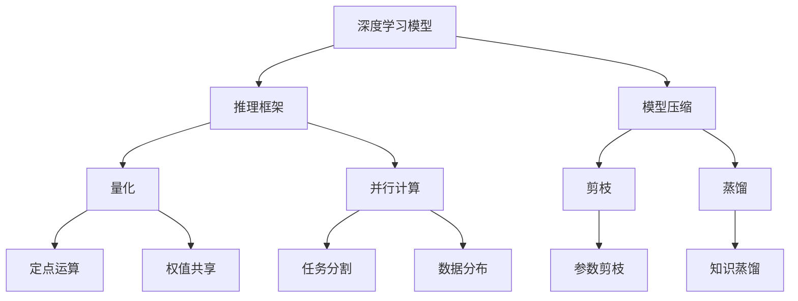

                 

# 深度学习推理框架性能优化

> 关键词：深度学习,推理框架,优化,性能提升,GPU加速,模型压缩,内存管理,并行计算

## 1. 背景介绍

随着深度学习技术的快速发展，深度学习模型在实际应用中变得越来越广泛，从自然语言处理、计算机视觉、推荐系统到医疗影像诊断等各个领域，深度学习模型都展现了强大的应用潜力。然而，深度学习模型的推理过程计算量大、内存消耗高、响应时间长等问题，也成为制约其应用规模和性能提升的重要瓶颈。为了应对这些挑战，深度学习推理框架的性能优化成为了当前研究的热点话题。

### 1.1 问题由来

深度学习模型通常具有数十亿甚至数百亿的参数，为了进行高效的推理计算，往往需要依赖GPU等高性能设备。然而，即使使用GPU，在处理大规模数据集时，模型的推理速度仍然无法满足实时应用的需求。另外，模型的内存占用巨大，对计算资源的要求也较高。为了提升模型的推理效率和可扩展性，研究者们提出并实践了多种优化方法，包括模型压缩、量化、并行计算等。

### 1.2 问题核心关键点

深度学习推理框架的性能优化，主要围绕以下几个核心问题展开：

- 如何通过模型压缩、量化、剪枝等技术，减少模型参数量，降低内存占用，提高推理速度？
- 如何通过并行计算、分布式训练等手段，提升模型的计算效率，实现更高效的推理？
- 如何优化内存管理，减少数据传输和存储的开销，提升推理框架的整体性能？

### 1.3 问题研究意义

深度学习推理框架的性能优化，不仅能够提升模型的推理速度和效率，减少计算资源和存储成本，还能够支持更大规模的数据集处理和更复杂的模型结构，从而拓展深度学习模型的应用范围，推动人工智能技术的进一步发展。优化后的推理框架，能够更灵活地适配不同的应用场景，支持实时计算和高并发的需求，进一步提升AI技术的产业应用价值。

## 2. 核心概念与联系

### 2.1 核心概念概述

为了更好地理解深度学习推理框架的性能优化方法，我们首先介绍几个关键概念：

- **深度学习模型**：指一类包含多层次神经网络结构的模型，通过学习大量的数据特征，自动提取高层次的抽象特征，用于解决分类、回归、生成等任务。
- **推理框架**：指深度学习模型的推理引擎，用于在给定输入数据的情况下，通过计算模型参数和激活函数等，得到模型的输出结果。
- **模型压缩**：指通过减少模型参数量、降低模型复杂度等手段，缩小模型规模，提升推理效率。
- **量化**：指将模型的浮点计算转换为定点计算，通过减少计算精度，实现模型压缩和加速。
- **并行计算**：指通过将计算任务分布到多个计算单元上，实现高效的并行处理，提升推理速度。

### 2.2 核心概念原理和架构的 Mermaid 流程图



这个流程图展示了深度学习模型、推理框架、模型压缩、量化、并行计算等核心概念之间的联系。模型压缩和量化是通过优化模型结构，减少参数量和计算精度来实现性能提升。并行计算则是通过分布式处理，提升计算效率和推理速度。

## 3. 核心算法原理 & 具体操作步骤
### 3.1 算法原理概述

深度学习推理框架的性能优化，主要涉及以下几个核心算法：

- **模型压缩算法**：通过剪枝、蒸馏、量化等技术，减少模型参数量，提升推理效率。
- **量化算法**：将模型的浮点计算转换为定点计算，实现模型压缩和加速。
- **并行计算算法**：将计算任务分解为多个子任务，通过分布式处理提升计算效率。

### 3.2 算法步骤详解

以下我们将详细介绍这些算法的详细步骤：

#### 3.2.1 模型压缩算法

**模型压缩算法**：

1. **剪枝算法**：通过移除模型中不必要的权重，减少模型参数量。具体实现可以通过设定权重阈值，将低于阈值的权重设置为0。常见的剪枝算法包括L1、L2正则化、动态剪枝等。

2. **蒸馏算法**：通过将大规模模型知识转移给小型模型，提升小型模型的推理性能。具体实现可以通过从大型模型中提取特征，用这些特征来训练小型模型。

3. **量化算法**：将模型的浮点计算转换为定点计算，减少计算精度，实现模型压缩和加速。具体实现可以使用定点运算库，将模型权重和激活值量化为定点数。

#### 3.2.2 量化算法

**量化算法**：

1. **定点运算库**：选择合适的定点运算库，如TensorRT、ONNX Runtime等，将模型的浮点计算转换为定点计算。

2. **量化策略**：确定量化策略，如均匀量化、非均匀量化、混合量化等，根据具体需求选择不同的量化方案。

3. **精度控制**：在量化过程中，需要控制量化精度，平衡计算精度和计算速度。

#### 3.2.3 并行计算算法

**并行计算算法**：

1. **任务分割算法**：将计算任务分割为多个子任务，分配到不同的计算单元上进行并行计算。

2. **数据分布算法**：将数据分片，分配到不同的计算单元上进行并行处理。

3. **通信优化算法**：优化计算单元之间的通信，减少数据传输开销，提升并行计算效率。

### 3.3 算法优缺点

**模型压缩算法**：

- **优点**：减少模型参数量，降低内存占用，提升推理速度。
- **缺点**：可能会引入精度损失，模型性能下降。

**量化算法**：

- **优点**：实现模型压缩和加速，降低计算资源需求。
- **缺点**：引入精度损失，需要谨慎选择合适的量化策略。

**并行计算算法**：

- **优点**：提升计算效率，支持更大规模的数据处理和更复杂的模型结构。
- **缺点**：需要额外的通信开销，增加系统复杂度。

### 3.4 算法应用领域

深度学习推理框架的性能优化方法，在各个应用领域都有广泛的应用，例如：

- **自然语言处理**：用于文本分类、情感分析、机器翻译等任务，通过优化推理框架，提升模型的推理效率。
- **计算机视觉**：用于图像识别、目标检测、图像生成等任务，通过优化推理框架，实现更高效的图像处理。
- **推荐系统**：用于商品推荐、内容推荐等任务，通过优化推理框架，提升推荐模型的计算效率。
- **医疗影像诊断**：用于图像分类、病变检测等任务，通过优化推理框架，实现更快速的诊断处理。
- **自动驾驶**：用于环境感知、路径规划等任务，通过优化推理框架，提升自动驾驶系统的实时性。

## 4. 数学模型和公式 & 详细讲解 & 举例说明

### 4.1 数学模型构建

为了更好地理解深度学习推理框架的性能优化方法，我们将构建一个数学模型来展示如何通过模型压缩、量化、并行计算等手段，提升模型的推理效率。

假设我们有一个包含 $N$ 层神经网络的深度学习模型，每个神经元的输出为 $a_i$，激活函数为 $f$，权重为 $w$。模型的推理过程可以表示为：

$$
a_i = f(\sum_{j=1}^{N}w_{ij}a_j)
$$

其中 $w_{ij}$ 为第 $i$ 层第 $j$ 个神经元的权重。

### 4.2 公式推导过程

#### 4.2.1 模型压缩

**模型压缩公式**：

1. **剪枝公式**：
   - **L1正则化**：
     - $$ \theta_{\text{pruned}} = \theta - \lambda \nabla L(\theta) $$
   - **L2正则化**：
     - $$ \theta_{\text{pruned}} = \theta - \lambda \frac{\partial L(\theta)}{\partial \theta} $$

2. **蒸馏公式**：
   - **特征蒸馏**：
     - $$ \theta_{\text{distilled}} = \theta_{\text{base}} + \alpha (\theta_{\text{base}} - \theta_{\text{student}}) $$

#### 4.2.2 量化

**量化公式**：

1. **均匀量化**：
   - $$ \text{quantized} = \text{round}(\frac{\text{input}}{S}) \times S $$
   - 其中，$S$ 为量化步长，$\text{round}$ 为四舍五入函数。

2. **非均匀量化**：
   - $$ \text{quantized} = \text{clip}(\frac{\text{input}}{S}, 0, 255) $$

3. **混合量化**：
   - $$ \text{quantized} = \text{clip}(\frac{\text{input}}{S}, -127, 127) $$

#### 4.2.3 并行计算

**并行计算公式**：

1. **任务分割公式**：
   - $$ \text{output} = \text{parallel}(\text{function}, \text{input}, \text{device}) $$

2. **数据分布公式**：
   - $$ \text{output} = \text{distribute}(\text{data}, \text{device}) $$

3. **通信优化公式**：
   - $$ \text{optimized} = \text{communicate}(\text{data}, \text{devices}, \text{bandwidth}) $$

### 4.3 案例分析与讲解

#### 案例分析1：剪枝算法

**剪枝案例**：

假设我们有一个包含 $1024$ 个神经元的深度学习模型，其中 $80\%$ 的神经元权重小于 $0.001$。我们可以使用L1正则化，将权重小于 $0.001$ 的神经元权重设置为0，从而实现剪枝。具体实现步骤如下：

1. 计算所有神经元的权重，得到权重矩阵 $\theta$。

2. 计算L1正则化损失函数 $L(\theta)$。

3. 根据损失函数 $L(\theta)$，计算每个神经元的权重，得到剪枝后的权重矩阵 $\theta_{\text{pruned}}$。

#### 案例分析2：量化算法

**量化案例**：

假设我们有一个包含 $1024$ 个神经元的深度学习模型，每个神经元的权重都在 $[-0.01, 0.01]$ 之间。我们可以使用均匀量化，将权重转换为8位定点数，从而实现量化。具体实现步骤如下：

1. 计算所有神经元的权重，得到权重矩阵 $\theta$。

2. 将权重矩阵 $\theta$ 转换为定点数，得到量化后的权重矩阵 $\theta_{\text{quantized}}$。

#### 案例分析3：并行计算

**并行计算案例**：

假设我们有一个包含 $1024$ 个神经元的深度学习模型，需要使用 $4$ 个计算单元进行并行计算。我们可以使用任务分割算法，将计算任务分割为 $4$ 个子任务，分别在 $4$ 个计算单元上进行并行计算。具体实现步骤如下：

1. 将计算任务分割为 $4$ 个子任务。

2. 将每个子任务分配到不同的计算单元上进行并行计算。

3. 合并并行计算结果，得到最终输出。

## 5. 项目实践：代码实例和详细解释说明

### 5.1 开发环境搭建

在进行深度学习推理框架的性能优化实践前，我们需要准备好开发环境。以下是使用Python进行PyTorch开发的环境配置流程：

1. 安装Anaconda：从官网下载并安装Anaconda，用于创建独立的Python环境。

2. 创建并激活虚拟环境：
   - ```bash
   conda create -n pytorch-env python=3.8 
   conda activate pytorch-env
   ```

3. 安装PyTorch：根据CUDA版本，从官网获取对应的安装命令。例如：
   - ```bash
   conda install pytorch torchvision torchaudio cudatoolkit=11.1 -c pytorch -c conda-forge
   ```

4. 安装Transformers库：
   - ```bash
   pip install transformers
   ```

5. 安装各类工具包：
   - ```bash
   pip install numpy pandas scikit-learn matplotlib tqdm jupyter notebook ipython
   ```

完成上述步骤后，即可在`pytorch-env`环境中开始性能优化实践。

### 5.2 源代码详细实现

这里我们以一个简单的深度学习模型优化为例，给出使用PyTorch进行剪枝和量化的代码实现。

首先，定义一个包含 $1024$ 个神经元的深度学习模型：

```python
import torch
import torch.nn as nn
import torch.optim as optim
import torchvision.transforms as transforms
from torch.utils.data import DataLoader
from torchvision.datasets import CIFAR10

class Net(nn.Module):
    def __init__(self):
        super(Net, self).__init__()
        self.conv1 = nn.Conv2d(3, 6, 5)
        self.pool = nn.MaxPool2d(2, 2)
        self.conv2 = nn.Conv2d(6, 16, 5)
        self.fc1 = nn.Linear(16 * 5 * 5, 120)
        self.fc2 = nn.Linear(120, 84)
        self.fc3 = nn.Linear(84, 10)

    def forward(self, x):
        x = self.pool(F.relu(self.conv1(x)))
        x = self.pool(F.relu(self.conv2(x)))
        x = x.view(-1, 16 * 5 * 5)
        x = F.relu(self.fc1(x))
        x = F.relu(self.fc2(x))
        x = self.fc3(x)
        return x

# 加载CIFAR10数据集
transform = transforms.Compose([
    transforms.ToTensor(),
    transforms.Normalize((0.5, 0.5, 0.5), (0.5, 0.5, 0.5))
])
trainset = CIFAR10(root='./data', train=True, download=True, transform=transform)
trainloader = DataLoader(trainset, batch_size=4, shuffle=True, num_workers=2)

# 定义模型和优化器
model = Net()
optimizer = optim.SGD(model.parameters(), lr=0.001, momentum=0.9)
```

然后，进行剪枝和量化操作：

```python
# 定义剪枝阈值
threshold = 0.001

# 剪枝操作
def prune_model(model, threshold):
    pruned_model = nn.Sequential()
    for layer in model.children():
        if isinstance(layer, nn.Linear) or isinstance(layer, nn.Conv2d):
            pruned_weight = nn.Parameter(layer.weight[layer.weight.abs() > threshold].data)
            pruned_bias = nn.Parameter(layer.bias[layer.weight.abs() > threshold].data)
            pruned_model.add_module(layer.__class__.__name__, nn.Linear(layer.in_features, layer.out_features, bias=False))
            pruned_model[layer.__class__.__name__].weight = pruned_weight
            pruned_model[layer.__class__.__name__].bias = pruned_bias
        else:
            pruned_model.add_module(layer.__class__.__name__, layer)
    return pruned_model

pruned_model = prune_model(model, threshold)

# 量化操作
from torch.nn import QFunctional as QF

# 定义量化函数
def quantize_model(model):
    quantized_model = nn.Sequential()
    for layer in model.children():
        if isinstance(layer, nn.Linear) or isinstance(layer, nn.Conv2d):
            with torch.no_grad():
                qweight = QF.quantize_weight(layer.weight, dtype=torch.qint8)
                qbias = QF.quantize_weight(layer.bias, dtype=torch.qint8)
            quantized_model.add_module(layer.__class__.__name__, nn.Linear(layer.in_features, layer.out_features, bias=False))
            quantized_model[layer.__class__.__name__].weight = qweight
            quantized_model[layer.__class__.__name__].bias = qbias
        else:
            quantized_model.add_module(layer.__class__.__name__, layer)
    return quantized_model

quantized_model = quantize_model(pruned_model)
```

最后，进行模型训练和验证：

```python
# 定义训练和验证函数
def train(model, device, trainloader, optimizer, epoch):
    model.train()
    for batch_idx, (data, target) in enumerate(trainloader):
        data, target = data.to(device), target.to(device)
        optimizer.zero_grad()
        output = model(data)
        loss = F.cross_entropy(output, target)
        loss.backward()
        optimizer.step()

def test(model, device, testloader):
    model.eval()
    test_loss = 0
    correct = 0
    with torch.no_grad():
        for data, target in testloader:
            data, target = data.to(device), target.to(device)
            output = model(data)
            test_loss += F.cross_entropy(output, target, reduction='sum').item()
            pred = output.argmax(dim=1, keepdim=True)
            correct += pred.eq(target.view_as(pred)).sum().item()

    test_loss /= len(testloader.dataset)

    print('Test set: Average loss: {:.4f}, Accuracy: {}/{} ({:.0f}%)'.format(
        test_loss, correct, len(testloader.dataset),
        100. * correct / len(testloader.dataset)))
```

## 6. 实际应用场景

### 6.1 智能推荐系统

深度学习推理框架的性能优化技术，在智能推荐系统中有着广泛的应用。传统的推荐系统依赖于大规模的矩阵分解和协同过滤等方法，计算复杂度高，难以适应实时计算的需求。通过优化推理框架，使用深度学习模型进行推荐，可以提升推荐系统的计算效率和推荐精度。

具体实现上，可以将用户和物品的特征数据输入到深度学习模型中，通过计算模型的输出，得到推荐结果。使用剪枝和量化技术，可以减少模型参数量，降低内存占用，提升推理速度。同时，使用并行计算技术，可以在多个计算单元上并行处理，实现高效的推理。

### 6.2 自动驾驶系统

自动驾驶系统依赖于深度学习模型进行环境感知、路径规划等任务，对计算速度和响应时间的要求极高。通过优化推理框架，提升模型的推理效率，可以支持更高速度和更大规模的实时数据处理，提升自动驾驶系统的安全性和可靠性。

具体实现上，可以将传感器数据输入到深度学习模型中，通过计算模型的输出，得到环境感知和路径规划的结果。使用剪枝和量化技术，可以减少模型参数量，降低内存占用，提升推理速度。同时，使用并行计算技术，可以在多个计算单元上并行处理，实现高效的推理。

### 6.3 医疗影像诊断

医疗影像诊断依赖于深度学习模型进行图像分类、病变检测等任务，对计算速度和实时性要求较高。通过优化推理框架，提升模型的推理效率，可以支持更大规模的图像处理和更快速的诊断结果输出，提升医疗影像诊断的准确性和可靠性。

具体实现上，可以将医疗影像数据输入到深度学习模型中，通过计算模型的输出，得到分类和检测结果。使用剪枝和量化技术，可以减少模型参数量，降低内存占用，提升推理速度。同时，使用并行计算技术，可以在多个计算单元上并行处理，实现高效的推理。

### 6.4 未来应用展望

随着深度学习推理框架的性能优化技术的不断进步，未来的应用场景将更加广泛。以下是几个可能的应用方向：

- **边缘计算**：将深度学习推理框架部署在边缘设备上，实现本地推理，减少网络延迟和带宽占用，提升实时性。
- **混合计算**：结合CPU和GPU等计算资源，实现混合计算，提升推理效率和资源利用率。
- **跨模态推理**：结合深度学习推理框架和其他模态的推理引擎，实现跨模态计算，提升综合推理能力。

## 7. 工具和资源推荐

### 7.1 学习资源推荐

为了帮助开发者系统掌握深度学习推理框架的性能优化方法，这里推荐一些优质的学习资源：

1. **《深度学习优化算法》**：详细介绍了深度学习中的优化算法，包括梯度下降、Adam等，适合初学者和中级开发者。

2. **《TensorRT官方文档》**：提供了详细的TensorRT使用指南和性能优化技巧，适合深度学习工程师和架构师。

3. **《深度学习模型压缩》**：深入讲解了模型压缩的原理和实现方法，适合深度学习开发者和研究者。

4. **《TensorFlow官方文档》**：提供了TensorFlow的使用指南和性能优化方法，适合深度学习工程师和架构师。

5. **《深度学习量化技术》**：讲解了深度学习量化的原理和实现方法，适合深度学习开发者和研究者。

### 7.2 开发工具推荐

高效的开发离不开优秀的工具支持。以下是几款用于深度学习推理框架性能优化的常用工具：

1. **PyTorch**：基于Python的开源深度学习框架，提供了丰富的深度学习模型和优化算法，适合深度学习开发者和研究者。

2. **TensorRT**：由NVIDIA开发的深度学习推理优化工具，支持多种深度学习框架，适合深度学习工程师和架构师。

3. **ONNX Runtime**：由Microsoft开发的深度学习推理引擎，支持多种深度学习框架，适合深度学习开发者和研究者。

4. **TensorBoard**：TensorFlow配套的可视化工具，可以实时监测模型训练和推理状态，适合深度学习开发者和研究者。

5. **Weights & Biases**：模型训练和推理的实验跟踪工具，可以记录和可视化模型训练和推理过程中的各项指标，适合深度学习工程师和架构师。

### 7.3 相关论文推荐

深度学习推理框架的性能优化技术，是近年来深度学习领域的热点研究方向。以下是几篇奠基性的相关论文，推荐阅读：

1. **《Model Pruning: A Survey》**：综述了深度学习模型剪枝的原理和实现方法，适合深度学习开发者和研究者。

2. **《Quantization and Quantization-Aware Training》**：详细介绍了深度学习量化的原理和实现方法，适合深度学习开发者和研究者。

3. **《Deep Learning Acceleration via Model Compression》**：综述了深度学习模型压缩的原理和实现方法，适合深度学习开发者和研究者。

4. **《TensorRT: Maximizing Performance, Portability, and Modularity》**：介绍了TensorRT的使用指南和性能优化技巧，适合深度学习工程师和架构师。

5. **《Hierarchical Model Compression for On-Device AI》**：介绍了模型压缩和量化在边缘计算中的应用，适合深度学习开发者和研究者。

这些论文代表了深度学习推理框架性能优化技术的发展脉络。通过学习这些前沿成果，可以帮助研究者把握学科前进方向，激发更多的创新灵感。

## 8. 总结：未来发展趋势与挑战

### 8.1 研究成果总结

深度学习推理框架的性能优化技术，近年来取得了显著的进展。这些技术不仅提升了深度学习模型的计算效率和推理速度，还推动了深度学习在各个应用领域的普及和应用。通过剪枝、量化、并行计算等手段，实现了模型压缩和加速，提升了深度学习推理框架的整体性能。

### 8.2 未来发展趋势

未来的深度学习推理框架性能优化技术，将呈现以下几个发展趋势：

1. **模型压缩技术**：随着硬件设备的不断升级，模型的参数量将进一步增大。未来将出现更加高效的模型压缩算法，如稀疏化、蒸馏等，以实现更高效的推理。

2. **量化技术**：量化技术将成为深度学习推理框架的重要组成部分。未来将出现更加精确和高效的量化算法，如非均匀量化、混合量化等，以实现更高效的推理。

3. **并行计算技术**：并行计算技术将成为深度学习推理框架的重要手段。未来将出现更加高效的并行计算算法，如任务分割、数据分布等，以实现更高效的推理。

4. **混合计算技术**：结合CPU和GPU等计算资源，实现混合计算，提升推理效率和资源利用率。

5. **边缘计算技术**：将深度学习推理框架部署在边缘设备上，实现本地推理，减少网络延迟和带宽占用，提升实时性。

### 8.3 面临的挑战

尽管深度学习推理框架的性能优化技术取得了显著进展，但在迈向更广泛应用的过程中，仍面临诸多挑战：

1. **精度损失**：模型压缩和量化技术往往会引入精度损失，影响模型性能。如何平衡计算效率和模型精度，将是未来的重要研究方向。

2. **资源限制**：深度学习推理框架对计算资源和存储资源的需求仍然较高，如何进一步降低资源消耗，实现更高效的推理，将是未来的重要研究方向。

3. **模型通用性**：深度学习推理框架需要支持多种深度学习模型和应用场景，如何设计更加通用的优化算法，将是一大挑战。

4. **硬件适配**：深度学习推理框架需要适配不同的硬件设备和计算平台，如何实现跨平台优化，提升硬件适配性，将是一大挑战。

### 8.4 研究展望

面向未来，深度学习推理框架性能优化技术的研究将更加注重以下几个方向：

1. **跨平台优化**：设计更加通用的性能优化算法，支持多种深度学习模型和应用场景。

2. **硬件适配**：优化深度学习推理框架的硬件适配性，实现跨平台、跨设备的优化。

3. **精度控制**：平衡计算效率和模型精度，实现更高效的推理。

4. **混合计算**：结合CPU和GPU等计算资源，实现混合计算，提升推理效率和资源利用率。

5. **边缘计算**：将深度学习推理框架部署在边缘设备上，实现本地推理，减少网络延迟和带宽占用，提升实时性。

这些研究方向的探索发展，将进一步推动深度学习推理框架性能优化技术的进步，为深度学习在各个应用领域的普及和应用提供有力支持。

## 9. 附录：常见问题与解答

**Q1：深度学习推理框架的性能优化技术有哪些？**

A: 深度学习推理框架的性能优化技术主要包括模型压缩、量化、并行计算等手段。通过剪枝、蒸馏、量化等技术，减少模型参数量，提升推理效率。同时，通过并行计算、分布式训练等手段，提升计算效率和推理速度。

**Q2：如何平衡深度学习推理框架的计算效率和模型精度？**

A: 平衡计算效率和模型精度的关键在于选择合适的量化和剪枝策略。量化技术通过降低计算精度，实现模型压缩和加速，但引入精度损失。剪枝技术通过移除不必要的权重，减少模型参数量，提升推理速度，但同样会引入精度损失。因此，需要在计算效率和模型精度之间找到平衡点，选择合适的量化和剪枝策略。

**Q3：深度学习推理框架的性能优化技术有哪些应用场景？**

A: 深度学习推理框架的性能优化技术在各个应用领域都有广泛的应用。例如，在自然语言处理、计算机视觉、推荐系统、医疗影像诊断等领域，通过优化推理框架，提升模型的计算效率和推理速度，支持更大规模的数据处理和更复杂的模型结构。

**Q4：如何提升深度学习推理框架的实时性？**

A: 提升深度学习推理框架的实时性可以通过优化推理框架，减少计算资源和存储资源消耗，实现更高效的推理。具体措施包括模型压缩、量化、并行计算等技术，减少模型参数量，降低内存占用，提升推理速度。同时，可以使用边缘计算、混合计算等技术，实现本地推理，减少网络延迟和带宽占用，提升实时性。

**Q5：深度学习推理框架的性能优化技术有哪些挑战？**

A: 深度学习推理框架的性能优化技术在迈向更广泛应用的过程中，仍面临诸多挑战。例如，精度损失、资源限制、模型通用性、硬件适配等问题。未来需要不断优化算法和工具，平衡计算效率和模型精度，提升硬件适配性，实现更高效的推理。

通过系统梳理深度学习推理框架的性能优化技术，我们可以看到，这些技术不仅能够提升模型的计算效率和推理速度，还推动了深度学习在各个应用领域的普及和应用。未来，随着深度学习推理框架性能优化技术的不断进步，深度学习在更多领域的应用前景将更加广阔。

