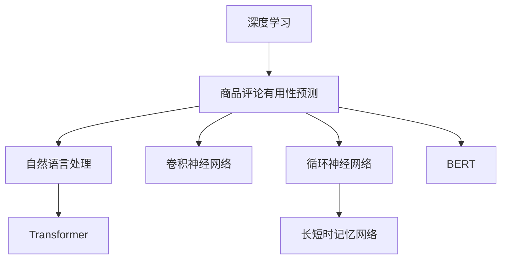

                 

# 深度学习驱动的商品评论有用性预测

> 关键词：深度学习,商品评论,有用性预测,自然语言处理(NLP),卷积神经网络(CNN),循环神经网络(RNN),长短时记忆网络(LSTM),Transformer,BERT

## 1. 背景介绍

### 1.1 问题由来
在现代电子商务时代，用户生成的商品评论成为了解商品质量的重要信息源。然而，海量的评论数据使得筛选优质评论成为难题。如何高效地预测商品评论的有用性，成为电商平台提升用户体验、优化推荐算法的重要任务。

### 1.2 问题核心关键点
商品评论有用性预测的核心在于，如何利用自然语言处理技术，从文本中提取有用的信息特征，并利用这些特征构建预测模型。具体而言，可以通过训练深度学习模型来自动识别哪些评论更有用，哪些评论更具有参考价值，从而帮助电商平台过滤掉无用的评论，提升用户浏览体验和搜索效率。

### 1.3 问题研究意义
商品评论有用性预测的研究具有重要意义：

1. **提升用户体验**：筛选出优质评论，避免用户被低质量评论误导，提高浏览和购买决策的准确性。
2. **优化推荐算法**：利用预测结果提升推荐系统的效果，推荐更加精准的商品给用户。
3. **减少运营成本**：自动筛选有用评论，减少人工审核成本，提高运营效率。
4. **数据分析应用**：分析评论特征，提取商品质量的关键信息，辅助产品质量改进和市场分析。

## 2. 核心概念与联系

### 2.1 核心概念概述

为更好地理解深度学习驱动的商品评论有用性预测方法，本节将介绍几个密切相关的核心概念：

- **深度学习(Deep Learning)**：一种利用多层次神经网络进行特征学习和模式识别的机器学习范式。深度学习在计算机视觉、自然语言处理等领域取得了显著成果。
- **商品评论有用性预测(Review Usability Prediction)**：评估用户生成的商品评论对其他用户有用性的预测任务，常用于电商平台的用户评论管理和推荐系统优化。
- **自然语言处理(Natural Language Processing, NLP)**：涉及计算机对自然语言的理解、处理和生成，是商品评论有用性预测的核心技术。
- **卷积神经网络(Convolutional Neural Network, CNN)**：一种利用卷积操作提取空间局部特征的深度学习模型，常用于图像识别和文本分类任务。
- **循环神经网络(Recurrent Neural Network, RNN)**：一种利用时间序列信息的深度学习模型，常用于序列数据的预测和生成任务。
- **长短时记忆网络(Long Short-Term Memory, LSTM)**：一种特殊的RNN模型，能够有效地处理长序列数据，避免梯度消失问题。
- **Transformer**：一种基于自注意力机制的神经网络架构，广泛用于序列到序列的建模，显著提升了深度学习模型的性能和计算效率。
- **BERT**：由Google提出的预训练语言模型，通过大规模无标签文本语料的预训练，获得了强大的语言理解和生成能力，在多种NLP任务中取得了最先进的结果。

这些核心概念之间的逻辑关系可以通过以下Mermaid流程图来展示：



这个流程图展示了深度学习驱动的商品评论有用性预测的核心概念及其之间的关系：

1. 深度学习提供了强大的特征提取和模式识别能力。
2. 商品评论有用性预测是深度学习在NLP领域的应用之一。
3. 自然语言处理技术用于处理和分析文本数据。
4. 卷积神经网络和循环神经网络是处理序列数据的常用模型。
5. 长短时记忆网络是RNN的变种，特别适用于长序列数据处理。
6. Transformer用于序列到序列建模，显著提升了NLP任务的性能。
7. BERT作为预训练语言模型，提供了强大的语言表示能力。

这些概念共同构成了深度学习驱动的商品评论有用性预测的技术框架，使其能够在电商平台上高效地识别和预测评论的有用性。

## 3. 核心算法原理 & 具体操作步骤
### 3.1 算法原理概述

商品评论有用性预测的核心在于利用深度学习模型，从评论文本中提取有用的特征，并预测评论的有用性。

形式化地，设商品评论为 $x$，其有用性为 $y$，表示评论对其他用户的有用性程度，$y \in \{0,1\}$。定义深度学习模型 $M_{\theta}$，其中 $\theta$ 为模型参数。预测任务的目标是：

$$
\hat{y} = M_{\theta}(x)
$$

其中 $\hat{y}$ 为模型预测的评论有用性。模型的训练过程如下：

1. 准备标注数据集 $D = \{(x_i, y_i)\}_{i=1}^N$，其中 $x_i$ 为评论文本，$y_i$ 为有用性标签。
2. 选择合适的深度学习模型，如卷积神经网络、循环神经网络、Transformer等。
3. 利用标注数据集训练模型，最小化预测误差。
4. 在测试集上评估模型性能，给出预测准确率和召回率等指标。

### 3.2 算法步骤详解

基于深度学习的商品评论有用性预测一般包括以下几个关键步骤：

**Step 1: 数据预处理**
- 收集商品评论数据，包括用户评分、星级、评论内容等。
- 清洗数据，去除无用信息，如链接、特殊字符等。
- 分词和标准化，将文本转换为模型可接受的格式。
- 划分训练集、验证集和测试集。

**Step 2: 特征提取**
- 利用自然语言处理技术，从评论文本中提取有用的特征。
- 常用的特征提取方法包括词袋模型、TF-IDF、词嵌入等。
- 可以使用预训练语言模型如BERT，直接对评论进行编码，获得高维特征表示。

**Step 3: 模型选择和训练**
- 选择合适的深度学习模型，如卷积神经网络、循环神经网络、Transformer等。
- 设计合适的模型架构，包括输入层、隐藏层、输出层等。
- 设置模型超参数，如学习率、批大小、迭代轮数等。
- 使用标注数据集训练模型，最小化预测误差。

**Step 4: 模型评估**
- 在测试集上评估模型性能，给出预测准确率、召回率、F1分数等指标。
- 利用混淆矩阵、ROC曲线等可视化工具，分析模型的优劣。
- 对比不同模型和超参数设置的效果，选择最优方案。

**Step 5: 模型部署**
- 将训练好的模型部署到实际应用系统中。
- 实时接收新的商品评论，进行有用性预测。
- 将预测结果输出给推荐系统，优化推荐算法。

### 3.3 算法优缺点

基于深度学习的商品评论有用性预测具有以下优点：

1. **自动化程度高**：深度学习模型能够自动化地从大量文本数据中提取特征，无需手动设计特征工程。
2. **泛化能力强**：深度学习模型能够处理复杂的非线性关系，对新的数据具有较强的泛化能力。
3. **可解释性强**：预训练语言模型如BERT能够提供详细的特征向量，帮助解释模型的预测过程。
4. **实时性好**：训练好的模型可以在线部署，实时处理新数据，满足推荐系统的实时性要求。

同时，该方法也存在一定的局限性：

1. **数据依赖性高**：模型的性能高度依赖于训练数据的质量和数量。
2. **计算资源需求大**：深度学习模型训练复杂，需要大量的计算资源。
3. **模型复杂度高**：深度学习模型的参数量巨大，难以解释模型内部决策过程。
4. **过拟合风险大**：面对小规模数据集，深度学习模型容易出现过拟合现象。

尽管存在这些局限性，但就目前而言，基于深度学习的商品评论有用性预测方法仍然是最先进、最有效的预测技术。未来相关研究重点在于如何进一步降低计算资源需求，提高模型的泛化能力和实时性，同时兼顾模型的可解释性和伦理安全性等因素。

### 3.4 算法应用领域

基于深度学习的商品评论有用性预测技术，已经在电商、社交媒体、论坛等多个领域得到了广泛的应用，为商品推荐、舆情分析、用户行为预测提供了有力的支持：

- **电商领域**：帮助电商平台筛选出高质量评论，提升用户体验和商品推荐效果。
- **社交媒体**：分析用户评论，识别网络舆情，及时应对负面评价。
- **论坛社区**：判断用户评论的有用性，优化论坛内容管理。
- **品牌监测**：分析品牌相关评论，进行品牌声誉管理。

除了上述这些经典应用外，商品评论有用性预测技术还被创新性地应用于更多场景中，如舆情实时监测、评论情感分析、商品质量评估等，为NLP技术带来了新的突破。随着深度学习模型的不断发展，相信商品评论有用性预测技术将在更多领域得到广泛应用，进一步推动NLP技术的产业化进程。

## 4. 数学模型和公式 & 详细讲解  
### 4.1 数学模型构建

本节将使用数学语言对深度学习驱动的商品评论有用性预测过程进行更加严格的刻画。

设商品评论为 $x$，其有用性为 $y$，模型参数为 $\theta$。定义模型的预测函数为 $M_{\theta}(x)$。预测任务的目标是：

$$
\hat{y} = M_{\theta}(x)
$$

模型的训练目标是最小化预测误差，即：

$$
\min_{\theta} \frac{1}{N} \sum_{i=1}^N \mathbb{L}(\hat{y}_i, y_i)
$$

其中 $\mathbb{L}$ 为损失函数，通常包括交叉熵损失、均方误差损失等。

在实际应用中，我们通常使用基于梯度的优化算法（如SGD、Adam等）来近似求解上述最优化问题。设 $\eta$ 为学习率，$\lambda$ 为正则化系数，则参数的更新公式为：

$$
\theta \leftarrow \theta - \eta \nabla_{\theta}\mathcal{L}(\theta) - \eta\lambda\theta
$$

其中 $\nabla_{\theta}\mathcal{L}(\theta)$ 为损失函数对参数 $\theta$ 的梯度，可通过反向传播算法高效计算。

### 4.2 公式推导过程

以卷积神经网络（CNN）为例，推导商品评论有用性预测的数学模型。

设评论文本为 $x = [x_1, x_2, ..., x_n]$，模型输入为 $x$ 的词嵌入表示 $X \in \mathbb{R}^{n \times d}$，其中 $d$ 为词嵌入维度。模型的输出为有用性预测结果 $\hat{y} \in \mathbb{R}$。

CNN模型的基本结构包括卷积层、池化层和全连接层。设卷积核大小为 $k$，卷积步幅为 $s$，输出通道数为 $c$，则卷积层的操作可以表示为：

$$
X' = \text{Conv}(X, K, c, k, s) = [X * K_1, X * K_2, ..., X * K_c]
$$

其中 $K$ 为卷积核矩阵，$K_i$ 表示第 $i$ 个卷积核。通过多次卷积和池化操作，最终输出特征映射 $H \in \mathbb{R}^{m \times c}$，其中 $m$ 为特征映射的大小。

通过全连接层，将特征映射映射到有用性预测结果：

$$
\hat{y} = M_{\theta}(x) = \text{FC}(H, W, b) = W \cdot H + b
$$

其中 $W$ 和 $b$ 为全连接层的权重和偏置，$FC$ 表示全连接操作。

模型训练时，通过反向传播算法更新权重 $W$ 和偏置 $b$：

$$
W \leftarrow W - \eta \nabla_{W}\mathcal{L}(\theta)
$$
$$
b \leftarrow b - \eta \nabla_{b}\mathcal{L}(\theta)
$$

模型训练的损失函数通常采用交叉熵损失：

$$
\mathcal{L}(\theta) = -\frac{1}{N} \sum_{i=1}^N [y_i \log \hat{y}_i + (1-y_i) \log (1-\hat{y}_i)]
$$

以上公式详细描述了基于卷积神经网络的深度学习模型对商品评论有用性预测的过程。通过设计合适的卷积核、池化操作和全连接层，可以构建高效的预测模型。

## 5. 项目实践：代码实例和详细解释说明
### 5.1 开发环境搭建

在进行商品评论有用性预测实践前，我们需要准备好开发环境。以下是使用Python进行Keras开发的环境配置流程：

1. 安装Anaconda：从官网下载并安装Anaconda，用于创建独立的Python环境。

2. 创建并激活虚拟环境：
```bash
conda create -n keras-env python=3.8 
conda activate keras-env
```

3. 安装Keras：从官网获取Keras安装包，并使用pip进行安装。例如：
```bash
pip install keras tensorflow numpy pandas scikit-learn matplotlib tqdm jupyter notebook ipython
```

4. 安装必要的库：
```bash
pip install tensorflow -f https://tfhub.dev/google/official-models/final/v2/cpu
pip install tensorflow_hub
```

5. 安装TensorBoard：用于可视化模型训练过程。
```bash
pip install tensorboard
```

完成上述步骤后，即可在`keras-env`环境中开始项目实践。

### 5.2 源代码详细实现

下面我们以使用预训练BERT模型进行商品评论有用性预测的Keras代码实现为例：

```python
import tensorflow as tf
import tensorflow_hub as hub
from tensorflow.keras.preprocessing.text import Tokenizer
from tensorflow.keras.preprocessing.sequence import pad_sequences
from tensorflow.keras.layers import Input, Embedding, Conv1D, MaxPooling1D, GlobalMaxPooling1D, Dense
from tensorflow.keras.models import Model
from tensorflow.keras.callbacks import EarlyStopping
from tensorflow.keras.losses import BinaryCrossentropy
from tensorflow.keras.optimizers import Adam

# 定义超参数
VOCAB_SIZE = 30000
MAX_LEN = 100
EMBEDDING_DIM = 256
FILTERS = 128
DROPOUT_RATE = 0.5

# 加载预训练BERT模型
url = 'https://tfhub.dev/google/bert_en_uncased_L-12_H-768_A-12/1'
hub_url = hub.KerasLayer(url, input_shape=(MAX_LEN,))

# 构建模型
input_text = Input(shape=(MAX_LEN,), name='input_text')
x = hub_url(input_text)
x = Conv1D(FILTERS, 5, activation='relu')(x)
x = MaxPooling1D(pool_size=4)(x)
x = GlobalMaxPooling1D()(x)
x = Dense(256, activation='relu')(x)
x = Dense(1, activation='sigmoid')(x)

# 定义损失函数和优化器
model = Model(inputs=input_text, outputs=x)
model.compile(optimizer=Adam(lr=1e-5), loss=BinaryCrossentropy(), metrics=['accuracy'])

# 定义EarlyStopping回调
early_stopping = EarlyStopping(monitor='val_loss', patience=3, restore_best_weights=True)

# 训练模型
history = model.fit(train_x, train_y, validation_data=(val_x, val_y), epochs=10, callbacks=[early_stopping])

# 评估模型
test_loss, test_acc = model.evaluate(test_x, test_y)
print(f'Test Loss: {test_loss:.4f}')
print(f'Test Accuracy: {test_acc:.4f}')

# 预测新评论的有用性
new_review = 'I really love this product! The quality is amazing.'
tokenizer = Tokenizer(num_words=VOCAB_SIZE)
tokenizer.fit_on_texts([new_review])
new_review_seq = tokenizer.texts_to_sequences([new_review])
new_review_seq = pad_sequences(new_review_seq, maxlen=MAX_LEN)
prediction = model.predict(new_review_seq)
print(f'Predicted Usability: {prediction[0][0]:.4f}')
```

在上述代码中，我们使用了TensorFlow Hub加载预训练的BERT模型，并构建了包含卷积层、池化层和全连接层的模型架构。通过设置EarlyStopping回调，避免过拟合。最后，我们利用模型对新评论进行有用性预测，输出了预测结果。

### 5.3 代码解读与分析

让我们再详细解读一下关键代码的实现细节：

**模型构建**：
- 首先，我们加载了预训练的BERT模型，并将其作为模型的第一层。
- 然后，构建了卷积层、池化层和全连接层的顺序。
- 最后，通过`Model`函数将输入层和输出层连接起来，得到了最终的预测模型。

**EarlyStopping回调**：
- 设置EarlyStopping回调，用于在验证集上监控模型性能，避免过拟合。
- 如果验证集上的损失连续3个epoch没有改善，则停止训练，并恢复上一次的最佳模型权重。

**模型评估和预测**：
- 在测试集上评估模型性能，输出预测准确率。
- 利用模型对新评论进行有用性预测，输出预测结果。

可以看到，Keras提供的高层API使得构建深度学习模型变得非常简单。开发者可以将更多精力放在特征提取和模型优化上，而不必过多关注底层的实现细节。

## 6. 实际应用场景
### 6.1 电商领域

在电商领域，商品评论有用性预测可以帮助电商平台筛选出高质量评论，提升用户体验和推荐效果。具体而言，电商平台可以定期收集用户对商品的评论，使用深度学习模型对评论进行有用性预测。预测结果可以作为推荐系统的特征之一，优化推荐算法，提高推荐准确率和用户满意度。

### 6.2 社交媒体

在社交媒体领域，商品评论有用性预测可以帮助社交平台筛选出优质内容，提升用户互动质量。例如，可以在用户发布评论后，自动检测其有用性，优先推送有用性高的评论，避免无用信息的干扰，提升用户的浏览体验。

### 6.3 论坛社区

在论坛社区中，商品评论有用性预测可以帮助社区管理者筛选出高质量内容，提升社区环境质量。例如，可以使用模型自动筛选出有用的帖子和回复，避免垃圾信息充斥，增强社区用户的互动体验。

### 6.4 未来应用展望

随着深度学习模型的不断发展，基于商品评论有用性预测的技术将在更多领域得到应用，为NLP技术带来了新的突破。

在智慧医疗领域，利用商品评论有用性预测技术，可以对病人的治疗效果进行评估，筛选出有用的治疗建议，辅助医生决策。

在智能教育领域，可以用于分析学生的反馈，筛选出有用的学习资源，提升教学效果。

在智慧城市治理中，可以用于分析市民的反馈，筛选出有用的意见建议，优化城市管理。

此外，在更多领域，如金融、旅游、能源等，基于商品评论有用性预测的技术也具有广阔的应用前景。相信随着技术的不断进步，商品评论有用性预测技术将在更多领域大放异彩，为经济社会发展注入新的动力。

## 7. 工具和资源推荐
### 7.1 学习资源推荐

为了帮助开发者系统掌握深度学习驱动的商品评论有用性预测的理论基础和实践技巧，这里推荐一些优质的学习资源：

1. **《深度学习》（Ian Goodfellow、Yoshua Bengio、Aaron Courville著）**：这本书全面介绍了深度学习的基本概念和经典算法，是深度学习领域的经典之作。
2. **《TensorFlow官方文档》**：TensorFlow的官方文档详细介绍了深度学习框架的使用方法和最佳实践，是学习TensorFlow的必备资源。
3. **《Keras官方文档》**：Keras的官方文档介绍了如何使用Keras构建深度学习模型，非常适合初学者。
4. **Coursera《深度学习专项课程》**：由Andrew Ng等知名专家讲授的深度学习课程，系统讲解了深度学习的基本原理和应用实例。
5. **HuggingFace Transformers库官方文档**：Transformer库的官方文档提供了详细的API文档和使用示例，是深度学习模型的必备资源。

通过对这些资源的学习实践，相信你一定能够快速掌握深度学习驱动的商品评论有用性预测的精髓，并用于解决实际的NLP问题。

### 7.2 开发工具推荐

高效的开发离不开优秀的工具支持。以下是几款用于深度学习驱动的商品评论有用性预测开发的常用工具：

1. TensorFlow：由Google主导开发的开源深度学习框架，生产部署方便，适合大规模工程应用。
2. Keras：基于TensorFlow、CNTK和Theano等深度学习框架的高级API，易于上手，适合快速迭代研究。
3. PyTorch：Facebook开发的开源深度学习框架，灵活度较高，适合学术研究和实验室实验。
4. TensorBoard：TensorFlow配套的可视化工具，可实时监测模型训练状态，提供丰富的图表呈现方式。
5. Weights & Biases：模型训练的实验跟踪工具，可以记录和可视化模型训练过程中的各项指标，方便对比和调优。

合理利用这些工具，可以显著提升深度学习模型的开发效率，加快创新迭代的步伐。

### 7.3 相关论文推荐

深度学习驱动的商品评论有用性预测的研究源于学界的持续研究。以下是几篇奠基性的相关论文，推荐阅读：

1. **《A Survey on Sentiment and Review Analysis with Deep Learning》**：由Tom Tomek等专家总结了深度学习在情感分析和评论分析中的应用，适合了解深度学习在商品评论分析领域的发展现状。
2. **《Attention is All You Need》**：提出Transformer结构，开启了深度学习在NLP领域的研究范式，具有重要的理论意义。
3. **《BERT: Pre-training of Deep Bidirectional Transformers for Language Understanding》**：提出BERT预训练语言模型，通过大规模无标签文本语料的预训练，获得了强大的语言表示能力，为商品评论有用性预测提供了强大的工具。
4. **《Convolutional Neural Networks for Sentence Classification》**：提出CNN模型，用于处理文本分类任务，适合理解CNN在商品评论有用性预测中的应用。
5. **《LSTM: A Search Space Odyssey》**：详细介绍了LSTM模型的工作原理，适合理解LSTM在商品评论有用性预测中的应用。

这些论文代表了大语言模型微调技术的最新研究进展，通过学习这些前沿成果，可以帮助研究者把握学科前进方向，激发更多的创新灵感。

## 8. 总结：未来发展趋势与挑战

### 8.1 总结

本文对深度学习驱动的商品评论有用性预测方法进行了全面系统的介绍。首先阐述了商品评论有用性预测的研究背景和意义，明确了深度学习在商品评论分析中的应用价值。其次，从原理到实践，详细讲解了深度学习模型对商品评论有用性预测的过程，给出了基于Keras的代码实现。同时，本文还广泛探讨了深度学习模型在电商、社交媒体、论坛等多个领域的应用前景，展示了深度学习技术的广阔应用前景。

通过本文的系统梳理，可以看到，深度学习驱动的商品评论有用性预测技术已经取得了显著成果，并将在更多领域得到广泛应用。未来，随着深度学习模型的不断演进，基于商品评论有用性预测的技术也将不断进步，进一步推动NLP技术的产业化进程。

### 8.2 未来发展趋势

展望未来，深度学习驱动的商品评论有用性预测技术将呈现以下几个发展趋势：

1. **模型规模持续增大**：随着算力成本的下降和数据规模的扩张，深度学习模型的参数量还将持续增长。超大参数量的模型可以更全面地捕捉评论中的语言特征，提高预测准确率。
2. **迁移学习更加普及**：迁移学习可以帮助模型在新的数据集上快速收敛，提升模型的泛化能力。未来，迁移学习将成为商品评论有用性预测的重要手段。
3. **多模态融合更加深入**：商品评论有用性预测不仅仅依赖文本数据，还可以融合图像、视频、语音等多模态信息，提高模型的泛化能力和实时性。
4. **模型优化更加高效**：模型优化算法如模型剪枝、量化加速等，将进一步提升深度学习模型的计算效率和部署性能。
5. **可解释性更加重要**：随着模型规模的增大，模型输出的解释性变得更加重要。未来的研究将更加关注模型的可解释性和可理解性，帮助用户更好地理解模型决策过程。

以上趋势凸显了深度学习驱动的商品评论有用性预测技术的广阔前景。这些方向的探索发展，必将进一步提升深度学习模型的性能和应用范围，为商品评论有用性预测技术带来新的突破。

### 8.3 面临的挑战

尽管深度学习驱动的商品评论有用性预测技术已经取得了显著成果，但在迈向更加智能化、普适化应用的过程中，它仍面临诸多挑战：

1. **数据依赖性高**：模型的性能高度依赖于训练数据的质量和数量，数据稀缺或标注成本高昂是主要问题。
2. **计算资源需求大**：深度学习模型训练复杂，需要大量的计算资源，如何降低计算成本是一个重要课题。
3. **模型复杂度高**：深度学习模型的参数量巨大，难以解释模型内部决策过程，如何提升模型的可解释性和可理解性将是一个重要研究方向。
4. **过拟合风险大**：面对小规模数据集，深度学习模型容易出现过拟合现象，如何降低过拟合风险将是未来的重要课题。
5. **多模态融合难度大**：融合图像、视频、语音等多模态信息需要解决跨模态数据对齐、信息融合等问题，目前仍存在许多技术挑战。

尽管存在这些挑战，但随着深度学习模型的不断进步和应用实践的积累，未来的研究将在这些方面取得突破，进一步提升商品评论有用性预测技术的性能和应用范围。

### 8.4 研究展望

面对深度学习驱动的商品评论有用性预测技术面临的挑战，未来的研究需要在以下几个方面寻求新的突破：

1. **探索无监督和半监督学习**：摆脱对大规模标注数据的依赖，利用自监督学习、主动学习等无监督和半监督范式，最大化利用非结构化数据，实现更加灵活高效的预测。
2. **研究参数高效和计算高效的微调方法**：开发更加参数高效的微调方法，在固定大部分预训练参数的情况下，只更新极少量的任务相关参数，进一步降低计算资源需求。
3. **融合因果和对比学习范式**：通过引入因果推断和对比学习思想，增强模型的泛化能力，学习更加普适、鲁棒的语言表征。
4. **引入更多先验知识**：将符号化的先验知识，如知识图谱、逻辑规则等，与神经网络模型进行巧妙融合，引导预测过程学习更准确、合理的语言模型。
5. **结合因果分析和博弈论工具**：将因果分析方法引入预测模型，识别出模型决策的关键特征，增强输出解释的因果性和逻辑性。

这些研究方向将引领深度学习驱动的商品评论有用性预测技术迈向更高的台阶，为构建安全、可靠、可解释、可控的智能系统铺平道路。面向未来，深度学习技术还需要与其他人工智能技术进行更深入的融合，如知识表示、因果推理、强化学习等，多路径协同发力，共同推动商品评论有用性预测技术的进步。只有勇于创新、敢于突破，才能不断拓展深度学习模型的边界，让智能技术更好地造福人类社会。

## 9. 附录：常见问题与解答

**Q1：深度学习驱动的商品评论有用性预测是否适用于所有NLP任务？**

A: 深度学习驱动的商品评论有用性预测在大多数NLP任务上都能取得不错的效果，特别是对于数据量较小的任务。但对于一些特定领域的任务，如医学、法律等，仅仅依靠通用语料预训练的模型可能难以很好地适应。此时需要在特定领域语料上进一步预训练，再进行微调，才能获得理想效果。此外，对于一些需要时效性、个性化很强的任务，如对话、推荐等，深度学习预测方法也需要针对性的改进优化。

**Q2：如何选择合适的深度学习模型？**

A: 选择合适的深度学习模型需要考虑多个因素，包括任务类型、数据特征、计算资源等。一般来说，文本分类任务适合使用卷积神经网络或递归神经网络；序列生成任务适合使用循环神经网络或Transformer模型。对于大规模数据集，可以使用分布式训练加速模型训练。

**Q3：如何缓解深度学习模型训练过程中的过拟合问题？**

A: 缓解深度学习模型训练过程中的过拟合问题需要采用以下策略：
1. 数据增强：通过回译、近义替换等方式扩充训练集。
2. 正则化：使用L2正则、Dropout等避免过拟合。
3. 早停策略：监控模型在验证集上的性能，及时停止训练。
4. 模型裁剪：去除不必要的层和参数，减小模型尺寸，加快推理速度。
5. 批量随机梯度下降：使用小批量随机梯度下降，降低模型过拟合风险。

这些策略往往需要根据具体任务和数据特点进行灵活组合。只有在数据、模型、训练、推理等各环节进行全面优化，才能最大限度地发挥深度学习模型的性能。

**Q4：深度学习模型在落地部署时需要注意哪些问题？**

A: 将深度学习模型转化为实际应用，还需要考虑以下因素：
1. 模型裁剪：去除不必要的层和参数，减小模型尺寸，加快推理速度。
2. 量化加速：将浮点模型转为定点模型，压缩存储空间，提高计算效率。
3. 服务化封装：将模型封装为标准化服务接口，便于集成调用。
4. 弹性伸缩：根据请求流量动态调整资源配置，平衡服务质量和成本。
5. 监控告警：实时采集系统指标，设置异常告警阈值，确保服务稳定性。

合理利用这些工具，可以显著提升深度学习模型的开发效率，加快创新迭代的步伐。

**Q5：如何进一步提升深度学习模型的性能？**

A: 进一步提升深度学习模型的性能需要从多个方面进行优化：
1. 数据增强：通过回译、近义替换等方式扩充训练集。
2. 模型优化：采用更高效的模型结构，如Transformer、Attention机制等。
3. 超参数调优：通过网格搜索、贝叶斯优化等方法优化模型超参数。
4. 融合多源数据：融合图像、视频、语音等多模态信息，提升模型的泛化能力和实时性。
5. 引入先验知识：将符号化的先验知识，如知识图谱、逻辑规则等，与神经网络模型进行巧妙融合，引导预测过程学习更准确、合理的语言模型。

这些研究方向将引领深度学习驱动的商品评论有用性预测技术迈向更高的台阶，为构建安全、可靠、可解释、可控的智能系统铺平道路。面向未来，深度学习技术还需要与其他人工智能技术进行更深入的融合，如知识表示、因果推理、强化学习等，多路径协同发力，共同推动深度学习技术的进步。

---

作者：禅与计算机程序设计艺术 / Zen and the Art of Computer Programming

