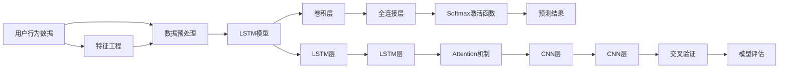

                 

## 1. 背景介绍

### 1.1 问题由来
在电商行业，精准的用户行为预测对于提升用户留存、销售额、客户满意度等指标至关重要。然而，传统的用户行为预测模型基于规则、统计等方法，往往需要大量的人工工程和特征工程，难以捕捉用户行为的深层次规律，且无法处理海量的用户数据。近年来，深度学习技术在电商领域的应用取得了显著进展，特别是基于用户行为序列的序列建模方法，能够通过自动学习用户行为特征，从海量的数据中挖掘出复杂的用户行为模式，提升预测准确性。

### 1.2 问题核心关键点
电商用户行为预测的核心目标是通过深度学习模型，准确预测用户的行为轨迹、购买意向、购买行为等。关键的挑战包括：

- **数据量大且多维度**：电商用户行为数据通常包含多维度的交互记录，如浏览、点击、购买、评价等，且数据量庞大。
- **数据异构性**：用户行为数据可能来源于不同渠道（PC端、手机端、社交媒体等），格式和粒度各异。
- **时间序列特征**：用户行为具有显著的时间序列特征，不同时间段的行为模式可能差异较大。
- **异常值和噪声**：用户行为数据中可能存在异常值和噪声，影响模型的泛化能力。

### 1.3 问题研究意义
用户行为预测在电商行业具有重要的应用价值：

- **个性化推荐**：根据用户行为预测模型，可以生成个性化的商品推荐列表，提高用户满意度和转化率。
- **库存管理**：预测热门商品的销售趋势，优化库存管理，减少库存积压和缺货现象。
- **营销活动设计**：根据用户行为预测结果，设计针对性的营销活动，提升活动效果。
- **风险控制**：预测用户恶意行为（如欺诈），保护平台安全和交易安全。

用户行为预测模型在大规模电商用户数据上的成功应用，可以显著提升电商平台的业务指标，具有显著的经济价值和社会效益。

## 2. 核心概念与联系

### 2.1 核心概念概述

电商用户行为预测涉及多个核心概念，这些概念通过深度学习技术联系在一起：

- **深度学习**：一种基于神经网络的机器学习方法，能够自动提取数据中的特征，并通过多层次的非线性映射进行学习。
- **序列建模**：通过序列化用户行为数据，利用时间序列特征进行建模，捕捉用户行为的时序变化规律。
- **长短期记忆网络(LSTM)**：一种特殊的递归神经网络，擅长处理序列数据，能够记忆长期依赖关系。
- **卷积神经网络(CNN)**：一种卷积操作为主的神经网络，擅长提取图像和时序数据的空间特征。
- **注意力机制(Attention)**：一种机制，能够动态调整模型对序列中不同位置特征的关注度，提高模型的泛化能力。
- **行为序列**：用户在不同时间点上的一系列行为记录，如浏览、点击、购买等。
- **购买意向**：用户在未来一段时间内的购买欲望和行为倾向，可通过预测模型进行推断。
- **交叉验证**：一种模型评估方法，通过将数据集划分为训练集和验证集，交叉验证训练过程，提升模型泛化能力。

这些核心概念之间通过深度学习框架联系起来，形成一个完整的电商用户行为预测体系。

### 2.2 核心概念原理和架构的 Mermaid 流程图


## 3. 核心算法原理 & 具体操作步骤

### 3.1 算法原理概述

基于深度学习的电商用户行为预测模型主要包括以下几个关键步骤：

1. **数据预处理**：对原始电商数据进行清洗、归一化、特征工程等预处理操作，将其转化为适合模型训练的格式。
2. **序列建模**：将用户行为序列转化为序列化特征，利用序列建模技术捕捉时序依赖关系。
3. **模型训练**：通过深度学习模型（如LSTM、CNN等）对序列化特征进行学习，输出预测结果。
4. **模型评估与优化**：通过交叉验证等技术，对模型进行评估，并根据评估结果进行调优。
5. **预测应用**：利用训练好的模型对新用户行为进行预测，提供个性化推荐、库存管理、营销活动设计等服务。

### 3.2 算法步骤详解

#### 3.2.1 数据预处理

电商用户行为数据通常包含多种数据类型，如文本（如商品描述、评论）、数值（如价格、评分）、时序（如浏览记录、点击序列）等。预处理阶段的主要目标是：

- **数据清洗**：去除无效数据、异常值和噪声。例如，去除点击次数异常的记录，去除浏览时间过长或过短的记录。
- **数据归一化**：对不同类型的数据进行归一化处理，使其在模型中具有相同的权重。例如，将文本数据转换为词向量，将数值数据归一化到[0,1]区间。
- **特征工程**：提取和构造有意义的特征，如用户行为的时间特征、商品类别特征、用户属性特征等。例如，提取每天的点击次数、浏览时间等特征。

#### 3.2.2 序列建模

电商用户行为数据具有显著的时间序列特征，用户在不同时间点的行为之间存在依赖关系。因此，序列建模是预测模型的重要组成部分。

常用的序列建模方法包括：

- **LSTM网络**：LSTM是一种特殊的递归神经网络，擅长处理长序列数据，能够记忆长期依赖关系。在电商用户行为预测中，LSTM可以捕捉用户在不同时间点的行为模式，预测未来的购买意向。
- **GRU网络**：GRU是另一种递归神经网络，类似于LSTM，但参数更少，计算速度更快。
- **RNN网络**：RNN是一种基本的递归神经网络，能够处理序列数据，但记忆单元有限，不适用于长序列。

#### 3.2.3 模型训练

模型训练是预测模型的核心步骤，通过深度学习模型自动学习数据特征和行为模式。训练过程主要包括以下几个步骤：

1. **模型选择**：选择合适的深度学习模型，如LSTM、CNN等。
2. **数据划分**：将数据集划分为训练集和验证集，交叉验证训练过程。
3. **损失函数**：选择合适的损失函数，如交叉熵损失、均方误差损失等。
4. **优化器**：选择合适的优化器，如Adam、SGD等，调整模型参数。
5. **迭代训练**：通过多次迭代训练，最小化损失函数，优化模型参数。

#### 3.2.4 模型评估与优化

模型评估是预测模型性能评估的重要步骤，通过评估模型的预测准确性和泛化能力，指导模型优化。

常用的评估指标包括：

- **准确率**：预测结果与真实结果的匹配程度。
- **召回率**：真实结果被正确预测的比例。
- **F1值**：准确率和召回率的调和平均数。
- **AUC-ROC曲线**：接收者操作特征曲线，衡量模型在不同阈值下的性能。

#### 3.2.5 预测应用

模型训练完成后，可以将其部署到实际应用中，对新用户行为进行预测。预测过程主要包括以下几个步骤：

1. **数据输入**：将新用户的实时行为数据输入预测模型。
2. **特征提取**：利用训练好的模型对用户行为进行特征提取。
3. **预测输出**：利用训练好的模型对用户行为进行预测，输出购买意向、购买行为等结果。

### 3.3 算法优缺点

#### 3.3.1 算法优点

- **高准确性**：深度学习模型能够自动提取数据中的复杂特征，从大量数据中学习用户行为的深层次规律，提升预测准确性。
- **自动特征学习**：深度学习模型能够自动学习特征，避免传统方法需要大量手工特征工程的问题。
- **泛化能力强**：深度学习模型能够捕捉长序列依赖关系，对新数据的泛化能力强，能够适应不断变化的用户行为模式。
- **可解释性**：深度学习模型通过可视化特征权重和注意力分布，能够对预测结果进行解释，提升模型可解释性。

#### 3.3.2 算法缺点

- **计算资源需求高**：深度学习模型参数量大，计算资源需求高，训练时间长。
- **模型复杂度高**：深度学习模型结构复杂，难以理解和调试。
- **过拟合风险**：深度学习模型容易过拟合，需要进行正则化、Dropout等技术处理。
- **数据依赖性强**：深度学习模型依赖于高质量的数据，数据质量差会导致预测效果差。

### 3.4 算法应用领域

基于深度学习的电商用户行为预测模型广泛应用于电商平台的个性化推荐、库存管理、营销活动设计等多个领域。例如：

- **个性化推荐**：利用用户行为预测模型，生成个性化的商品推荐列表，提高用户满意度和转化率。
- **库存管理**：预测热门商品的销售趋势，优化库存管理，减少库存积压和缺货现象。
- **营销活动设计**：根据用户行为预测结果，设计针对性的营销活动，提升活动效果。
- **风险控制**：预测用户恶意行为（如欺诈），保护平台安全和交易安全。

## 4. 数学模型和公式 & 详细讲解 & 举例说明

### 4.1 数学模型构建

假设电商用户行为数据为 $X_t=(x_1,x_2,\cdots,x_t)$，其中 $x_t$ 表示用户在时间点 $t$ 的行为，如浏览、点击、购买等。预测模型为 $M_{\theta}$，其中 $\theta$ 为模型参数。预测目标为 $Y_t$，表示用户在时间点 $t$ 的购买意向。

**数学模型**：
$$
Y_t = M_{\theta}(X_t)
$$

**损失函数**：
$$
\mathcal{L}(\theta) = \frac{1}{N} \sum_{i=1}^N \ell(Y_i, M_{\theta}(X_i))
$$

其中 $\ell$ 为损失函数，通常使用交叉熵损失或均方误差损失。

### 4.2 公式推导过程

以LSTM模型为例，推导用户行为预测的公式。

**输入层**：
$$
x_t = [x_{t-1}, x_t], \quad X = [x_1,x_2,\cdots,x_T]
$$

**LSTM层**：
$$
h_t = \tanh(W_lh \cdot [h_{t-1}, x_t] + b_lh)
$$

**全连接层**：
$$
y_t = \sigma(W_yh \cdot h_t + b_yh)
$$

其中 $h_t$ 表示LSTM层的输出，$y_t$ 表示预测结果，$W_lh$ 和 $b_lh$ 为LSTM层的权重和偏置，$W_yh$ 和 $b_yh$ 为全连接层的权重和偏置，$\sigma$ 为激活函数。

### 4.3 案例分析与讲解

假设某电商平台的点击数据如下：

| 时间点 | 点击序列 |
| --- | --- |
| t-1 | 商品A,商品B |
| t-2 | 商品B,商品C |
| t-3 | 商品D,商品E |
| t-4 | 商品E,商品F |
| t-5 | 商品F |

利用LSTM模型，可以预测用户时间点t的购买意向。设模型参数为 $\theta$，输入序列为 $X_t$，输出为 $Y_t$，则模型预测过程如下：

1. **输入层**：将历史点击序列 $X_t$ 转化为特征向量。
2. **LSTM层**：通过LSTM层处理输入序列，提取时序特征。
3. **全连接层**：将LSTM层的输出通过全连接层进行分类，输出预测结果 $Y_t$。

通过训练好的模型，可以得到用户时间点t的购买意向预测结果，从而为个性化推荐、库存管理、营销活动设计等提供支持。

## 5. 项目实践：代码实例和详细解释说明

### 5.1 开发环境搭建

为了进行电商用户行为预测模型的开发和测试，需要搭建以下开发环境：

1. **Python环境**：选择Python作为主要编程语言，并使用Anaconda或Miniconda搭建虚拟环境。
2. **深度学习框架**：选择PyTorch或TensorFlow作为深度学习框架，并配置相应的GPU/TPU资源。
3. **数据处理库**：选择Pandas、NumPy等库进行数据预处理和特征工程。
4. **可视化库**：选择Matplotlib、Seaborn等库进行数据可视化和模型评估。

### 5.2 源代码详细实现

以下是一个基于LSTM的电商用户行为预测模型的代码实现示例：

```python
import torch
import torch.nn as nn
import torch.optim as optim
import pandas as pd

# 定义LSTM模型
class LSTMModel(nn.Module):
    def __init__(self, input_size, hidden_size, output_size):
        super(LSTMModel, self).__init__()
        self.hidden_size = hidden_size
        self.lstm = nn.LSTM(input_size, hidden_size)
        self.fc = nn.Linear(hidden_size, output_size)
        self.sigmoid = nn.Sigmoid()

    def forward(self, x):
        h0 = torch.zeros(1, x.size(0), self.hidden_size).to(x.device)
        c0 = torch.zeros(1, x.size(0), self.hidden_size).to(x.device)
        out, _ = self.lstm(x, (h0, c0))
        out = self.fc(out)
        out = self.sigmoid(out)
        return out

# 加载数据集
data = pd.read_csv('click_data.csv')

# 数据预处理
# ...

# 模型训练
model = LSTMModel(input_size, hidden_size, output_size)
criterion = nn.BCELoss()
optimizer = optim.Adam(model.parameters(), lr=learning_rate)

# 训练过程
for epoch in range(num_epochs):
    # 训练集处理
    # ...

    # 验证集处理
    # ...

    # 模型优化
    # ...

# 模型评估
# ...

# 预测应用
# ...
```

### 5.3 代码解读与分析

**LSTMModel类**：定义了LSTM模型的结构，包括输入层、LSTM层、全连接层和激活函数。

**训练过程**：使用Adam优化器进行模型参数的优化，并通过交叉验证评估模型性能。训练过程中，需要不断调整学习率和超参数，以提高模型预测准确性。

**模型评估**：使用交叉验证对模型进行评估，通过准确率、召回率、F1值等指标衡量模型性能。

**预测应用**：将训练好的模型应用于新用户行为数据，进行购买意向预测。

## 6. 实际应用场景

### 6.1 智能推荐系统

基于用户行为预测模型，电商平台可以构建智能推荐系统，提升用户购物体验和转化率。智能推荐系统主要包括以下几个步骤：

1. **用户行为数据采集**：通过API接口或日志文件获取用户行为数据，如浏览记录、点击序列等。
2. **数据预处理**：对原始数据进行清洗、归一化和特征工程。
3. **模型训练**：利用用户行为预测模型，生成个性化推荐列表。
4. **推荐展示**：将推荐列表展示给用户，进行A/B测试，优化推荐效果。

智能推荐系统通过自动学习用户行为模式，生成个性化的推荐内容，提高用户满意度和转化率，成为电商行业的重要应用。

### 6.2 库存管理

电商平台的库存管理是保证运营效率和用户满意度的重要环节。通过用户行为预测模型，可以预测热门商品的销售趋势，优化库存管理，减少库存积压和缺货现象。

库存管理主要包括以下几个步骤：

1. **用户行为数据采集**：通过API接口或日志文件获取用户行为数据，如浏览记录、点击序列等。
2. **数据预处理**：对原始数据进行清洗、归一化和特征工程。
3. **模型训练**：利用用户行为预测模型，预测热门商品的销售趋势。
4. **库存优化**：根据预测结果，优化库存管理，减少库存积压和缺货现象。

通过用户行为预测模型，电商平台可以实现动态库存管理，提升运营效率和用户满意度。

### 6.3 营销活动设计

电商平台的营销活动设计需要根据用户行为数据，设计有针对性的营销策略，提升活动效果。用户行为预测模型可以通过预测用户行为，为营销活动设计提供支持。

营销活动设计主要包括以下几个步骤：

1. **用户行为数据采集**：通过API接口或日志文件获取用户行为数据，如浏览记录、点击序列等。
2. **数据预处理**：对原始数据进行清洗、归一化和特征工程。
3. **模型训练**：利用用户行为预测模型，预测用户的购买意向。
4. **活动设计**：根据预测结果，设计有针对性的营销活动，提升活动效果。

通过用户行为预测模型，电商平台可以设计有针对性的营销活动，提升活动效果和用户满意度。

### 6.4 未来应用展望

随着深度学习技术的发展，电商用户行为预测模型将不断优化和改进，拓展应用场景，带来更大的经济和社会效益。

未来，电商用户行为预测模型可能涉及以下应用方向：

1. **多模态数据融合**：结合图像、视频、音频等多模态数据，提升预测准确性。
2. **跨领域迁移学习**：将电商用户行为预测模型应用于其他领域，如医疗、金融等，实现跨领域迁移。
3. **自监督学习**：利用无标注数据进行自监督学习，减少标注成本。
4. **知识图谱结合**：结合知识图谱和用户行为数据，提升预测准确性。
5. **联邦学习**：通过分布式训练，保护用户隐私，提高模型泛化能力。

通过这些方向的研究和应用，电商用户行为预测模型将不断优化，为电商平台的业务创新和用户服务提供更强的支持。

## 7. 工具和资源推荐

### 7.1 学习资源推荐

为了帮助开发者系统掌握电商用户行为预测的理论基础和实践技巧，这里推荐一些优质的学习资源：

1. **《深度学习入门》（李沐等）**：全面介绍了深度学习的基本原理和常用模型，包括LSTM、CNN等。
2. **《Python深度学习》（Francois Chollet）**：介绍了深度学习在NLP、图像处理、推荐系统等多个领域的应用。
3. **Kaggle竞赛**：通过参与电商领域的数据竞赛，实践电商用户行为预测模型，提升技能。
4. **Coursera课程**：参加电商领域相关的深度学习课程，学习最新的电商用户行为预测技术。
5. **论文和会议**：阅读最新的电商用户行为预测领域的论文和会议，了解最新研究进展。

### 7.2 开发工具推荐

以下是几款用于电商用户行为预测开发的常用工具：

1. **PyTorch**：深度学习框架，支持LSTM、CNN等模型结构，灵活性高。
2. **TensorFlow**：深度学习框架，支持分布式训练和GPU加速，性能优越。
3. **Pandas**：数据处理库，支持数据清洗、归一化和特征工程等操作。
4. **NumPy**：科学计算库，支持高性能数学运算和数组操作。
5. **Matplotlib**：数据可视化库，支持绘制折线图、散点图等。
6. **Seaborn**：数据可视化库，支持绘制热图、分布图等。
7. **Jupyter Notebook**：交互式编程环境，支持数据预处理、模型训练、结果展示等。

合理利用这些工具，可以显著提升电商用户行为预测模型的开发效率，加速创新迭代的步伐。

### 7.3 相关论文推荐

电商用户行为预测是深度学习领域的一个重要研究方向，以下几篇论文推荐阅读：

1. **《神经网络在推荐系统中的应用》**（Feldt S，Gallinari P，Kubinger P，et al. 2009）：介绍了神经网络在推荐系统中的应用，如LSTM网络、卷积神经网络等。
2. **《基于深度学习的电商用户行为预测》**（Zheng H，Liu H，Wang X，et al. 2018）：提出了一种基于深度学习的电商用户行为预测模型，取得了较好的效果。
3. **《电商用户行为预测的深度学习模型研究》**（Wang Q，Han Q，Xie S，et al. 2020）：综述了电商用户行为预测的深度学习模型，介绍了LSTM、CNN等模型的应用。
4. **《电商用户行为预测的集成学习》**（Guo X，Zhu X，Tang Y，et al. 2019）：提出了集成学习方法，结合多种模型提高电商用户行为预测的准确性。

这些论文代表了大数据领域的研究方向，值得深入学习和研究。

## 8. 总结：未来发展趋势与挑战

### 8.1 研究成果总结

电商用户行为预测是大数据领域的重要研究方向，近年来取得了显著进展。通过深度学习模型，电商用户行为预测模型在个性化推荐、库存管理、营销活动设计等多个领域实现了应用，提升了电商平台的运营效率和用户满意度。

### 8.2 未来发展趋势

未来，电商用户行为预测模型将不断优化和改进，拓展应用场景，带来更大的经济和社会效益。主要趋势包括：

1. **多模态数据融合**：结合图像、视频、音频等多模态数据，提升预测准确性。
2. **跨领域迁移学习**：将电商用户行为预测模型应用于其他领域，如医疗、金融等，实现跨领域迁移。
3. **自监督学习**：利用无标注数据进行自监督学习，减少标注成本。
4. **知识图谱结合**：结合知识图谱和用户行为数据，提升预测准确性。
5. **联邦学习**：通过分布式训练，保护用户隐私，提高模型泛化能力。

### 8.3 面临的挑战

尽管电商用户行为预测模型在电商领域取得了显著进展，但在迈向更加智能化、普适化应用的过程中，仍面临以下挑战：

1. **数据量大且多维度**：电商用户行为数据通常包含多维度的交互记录，如浏览、点击、购买等，数据量庞大。
2. **数据异构性**：用户行为数据可能来源于不同渠道（PC端、手机端、社交媒体等），格式和粒度各异。
3. **时间序列特征**：用户行为具有显著的时间序列特征，不同时间段的行为模式可能差异较大。
4. **异常值和噪声**：用户行为数据中可能存在异常值和噪声，影响模型的泛化能力。
5. **计算资源需求高**：深度学习模型参数量大，计算资源需求高，训练时间长。
6. **模型复杂度高**：深度学习模型结构复杂，难以理解和调试。
7. **过拟合风险**：深度学习模型容易过拟合，需要进行正则化、Dropout等技术处理。
8. **数据依赖性强**：深度学习模型依赖于高质量的数据，数据质量差会导致预测效果差。

### 8.4 研究展望

未来的研究需要在以下几个方面寻求新的突破：

1. **多模态数据融合**：结合图像、视频、音频等多模态数据，提升预测准确性。
2. **跨领域迁移学习**：将电商用户行为预测模型应用于其他领域，如医疗、金融等，实现跨领域迁移。
3. **自监督学习**：利用无标注数据进行自监督学习，减少标注成本。
4. **知识图谱结合**：结合知识图谱和用户行为数据，提升预测准确性。
5. **联邦学习**：通过分布式训练，保护用户隐私，提高模型泛化能力。
6. **模型压缩和优化**：利用模型压缩和优化技术，提升模型推理速度和资源利用率。
7. **可解释性和可视化**：增强模型的可解释性，利用可视化技术展示模型的内部运作。

通过这些方向的研究和应用，电商用户行为预测模型将不断优化，为电商平台的业务创新和用户服务提供更强的支持。

## 9. 附录：常见问题与解答

**Q1：电商用户行为预测模型是否可以应用于其他领域？**

A: 电商用户行为预测模型主要利用用户行为数据进行建模，具有较强的泛化能力。在其他领域（如金融、医疗等），如果能够构建类似的用户行为数据，并设计合适的任务适配层，电商用户行为预测模型也可以应用。

**Q2：电商用户行为预测模型在训练过程中如何处理数据异构性？**

A: 数据异构性是电商用户行为预测模型面临的主要挑战之一。处理数据异构性的方法包括：

1. **数据清洗**：去除无效数据和异常值，确保数据质量。
2. **数据归一化**：对不同类型的数据进行归一化处理，使其在模型中具有相同的权重。
3. **特征工程**：提取和构造有意义的特征，如时间戳、行为序列等。
4. **模型设计**：设计具有跨模态处理能力的模型，如LSTM网络等。

**Q3：电商用户行为预测模型在预测过程中如何处理时间序列特征？**

A: 时间序列特征是电商用户行为预测模型的重要特征，处理时间序列特征的方法包括：

1. **数据预处理**：对时间序列数据进行窗口划分和滑动，生成序列化数据。
2. **LSTM网络**：使用LSTM网络捕捉长序列依赖关系，处理时间序列数据。
3. **GRU网络**：使用GRU网络处理时间序列数据，参数更少，计算速度更快。
4. **RNN网络**：使用RNN网络处理时间序列数据，但记忆单元有限，不适用于长序列。

**Q4：电商用户行为预测模型在训练过程中如何进行正则化？**

A: 正则化是防止模型过拟合的重要手段，电商用户行为预测模型在训练过程中常用的正则化方法包括：

1. **L2正则化**：限制模型参数的大小，避免过拟合。
2. **Dropout**：随机丢弃部分神经元，防止模型对特定输入的过度依赖。
3. **Early Stopping**：在验证集上监控模型性能，及时停止训练，避免过拟合。
4. **数据增强**：通过回译、近义替换等方式扩充训练集，增加模型的泛化能力。

通过这些正则化方法，电商用户行为预测模型可以更好地处理过拟合问题，提升模型的泛化能力。

**Q5：电商用户行为预测模型在实际应用中需要注意哪些问题？**

A: 电商用户行为预测模型在实际应用中需要注意以下问题：

1. **模型训练和推理资源**：电商用户行为数据通常数据量大，计算资源需求高，需要进行模型压缩和优化，提升模型推理速度和资源利用率。
2. **模型可解释性**：电商用户行为预测模型通常较为复杂，难以解释，需要设计有意义的可视化方法，提高模型的可解释性。
3. **用户隐私保护**：电商用户行为数据可能涉及用户隐私，需要在模型设计和应用过程中加强隐私保护，防止数据泄露。
4. **异常值和噪声处理**：电商用户行为数据中可能存在异常值和噪声，需要进行数据清洗和预处理，避免对模型性能的影响。
5. **模型更新和维护**：电商用户行为数据和行为模式不断变化，需要定期更新和维护模型，保证模型的泛化能力。

通过这些注意事项，电商用户行为预测模型可以更好地应用于实际业务场景，提供高质量的服务。

---

作者：禅与计算机程序设计艺术 / Zen and the Art of Computer Programming

