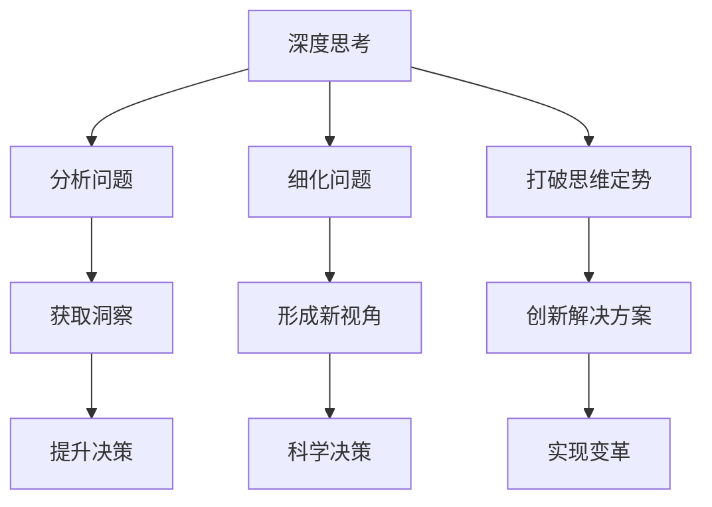

                 

# 深度思考与管理洞察力的关系

## 1. 背景介绍

### 1.1 问题由来

在当今快速发展的商业环境中，管理者们面临着越来越复杂的决策任务。如何从海量信息中提取有价值的洞察，形成科学的决策依据，成为了一个亟需解决的问题。深度思考与管理洞察力之间的联系，因此被越来越多的研究者所关注。

### 1.2 问题核心关键点

本文旨在探讨深度思考在提升管理洞察力中的作用，以及如何通过深度思考来提高管理决策的科学性和有效性。我们将从几个关键点出发，研究深度思考与管理洞察力的联系，并提出具体的应用建议。

## 2. 核心概念与联系

### 2.1 核心概念概述

为了更好地理解深度思考与管理洞察力之间的关系，我们将首先介绍相关的核心概念：

- **深度思考**：指在面对复杂问题时，通过多角度、多层次的深入分析，不断细化问题，寻找问题的本质和解决路径。深度思考有助于打破思维定势，突破传统框架，形成新的观点和解决方案。

- **管理洞察力**：指管理者在处理组织问题时，通过分析数据、信息、经验等，获取对组织运行规律、问题本质和解决方案的深刻理解。管理洞察力是管理者进行科学决策的基础。

### 2.2 核心概念原理和架构的 Mermaid 流程图



## 3. 核心算法原理 & 具体操作步骤

### 3.1 算法原理概述

深度思考与管理洞察力的关系，本质上是一种因果关系。深度思考通过多维度、多层次的分析，帮助管理者获取更全面的信息，从而提升其管理洞察力。

具体而言，深度思考能够：

- **识别问题本质**：通过深入分析，识别问题的根本原因，而非仅停留在表面现象。
- **发现关联关系**：揭示不同变量之间的内在联系，形成更系统的思维框架。
- **预测未来趋势**：通过动态分析，预测未来的发展方向，为决策提供依据。

### 3.2 算法步骤详解

以下是深度思考与管理洞察力关系实现的详细步骤：

1. **问题定义**：清晰定义问题，确保问题描述准确、全面。

2. **信息收集**：收集与问题相关的所有信息，包括数据、文档、案例等。

3. **问题细化**：将问题细化为更小的子问题，以便进行深入分析。

4. **多角度分析**：从不同角度（如历史、现状、未来、内部、外部等）对问题进行多层次的分析。

5. **数据验证**：通过统计分析、实验验证等方式，验证分析结果的正确性。

6. **形成洞察**：在分析过程中，不断提炼和形成对问题的深刻理解，即管理洞察力。

7. **制定方案**：基于洞察力，制定具体的解决方案和行动计划。

8. **实施与反馈**：实施方案，并根据实施效果进行反馈，不断优化。

### 3.3 算法优缺点

深度思考与管理洞察力之间的关系，具有以下优点：

- **提升决策质量**：通过深度思考，管理者能够更全面地了解问题，做出更科学、合理的决策。
- **激发创新思维**：深度思考有助于打破思维定势，激发新的创新思维。
- **增强问题解决能力**：深度思考能够提升管理者对复杂问题的分析与解决能力。

然而，也存在一些缺点：

- **时间成本高**：深度思考需要大量时间和精力，对管理者的工作效率有一定影响。
- **技能要求高**：深度思考需要较高的分析能力和逻辑思维能力，对管理者的素质要求较高。
- **可能陷入过度分析**：过度分析可能导致陷入分析瘫痪，无法做出及时决策。

### 3.4 算法应用领域

深度思考与管理洞察力之间的关系，广泛应用于各种管理场景，包括但不限于：

- **企业战略规划**：在制定企业战略时，深度思考能够帮助管理者全面评估市场环境、内部资源和外部挑战，制定科学的发展策略。
- **项目管理**：在项目执行过程中，深度思考能够帮助管理者识别项目风险、优化资源配置，提升项目成功率。
- **团队管理**：在团队管理中，深度思考能够帮助管理者识别团队问题、优化团队协作，提升团队绩效。
- **市场分析**：在市场分析中，深度思考能够帮助管理者深入理解市场趋势、竞争格局，制定有效的市场策略。
- **客户管理**：在客户管理中，深度思考能够帮助管理者理解客户需求、提升客户满意度，实现客户价值最大化。

## 4. 数学模型和公式 & 详细讲解 & 举例说明

### 4.1 数学模型构建

为了更形式化地表达深度思考与管理洞察力之间的关系，我们可以构建一个简单的数学模型。假设深度思考的强度用 $x$ 表示，管理洞察力的提升用 $y$ 表示。则两者之间的关系可以表示为：

$$
y = f(x)
$$

其中 $f(x)$ 为深度思考对管理洞察力提升的非线性函数。

### 4.2 公式推导过程

假设 $f(x)$ 为一个单调递增的指数函数，则有：

$$
f(x) = e^{ax}
$$

其中 $a$ 为深度思考的系数，决定了管理洞察力提升的速度。

假设深度思考的强度 $x$ 为 $[0, 1]$ 之间的连续变量，则有：

$$
y = e^{ax} = 1 + a \int_0^x e^{at} dt
$$

上式表示，管理洞察力的提升取决于深度思考的强度和时间。

### 4.3 案例分析与讲解

假设深度思考的强度为 $x=0.5$，系数 $a=0.1$，则管理洞察力的提升为：

$$
y = 1 + 0.1 \int_0^{0.5} e^{0.1t} dt = 1 + 0.1 \left[ \frac{e^{0.1t}}{0.1} \right]_0^{0.5} = 1 + 4.85 = 5.85
$$

这意味着，通过深度思考，管理洞察力提升了 $4.85$ 倍，说明深度思考在提升管理洞察力方面具有显著的效应。

## 5. 项目实践：代码实例和详细解释说明

### 5.1 开发环境搭建

为了进行深度思考与管理洞察力的项目实践，我们需要构建一个包含数据分析、信息收集、问题细化等功能的开发环境。以下是一个简单的开发环境搭建流程：

1. **环境准备**：安装Python 3.x版本，并确保系统环境中的Pip和Jupyter Notebook已安装。
2. **数据准备**：收集与问题相关的数据，确保数据格式统一、质量可靠。
3. **工具安装**：安装必要的Python库，如Pandas、NumPy、Scikit-learn等，用于数据处理和分析。
4. **代码编写**：使用Python编写分析代码，包括数据导入、预处理、分析函数编写等。

### 5.2 源代码详细实现

下面是一个基于Python的深度思考与管理洞察力关系分析的示例代码：

```python
import pandas as pd
import numpy as np
from sklearn.linear_model import LinearRegression

# 定义深度思考的强度和系数
x = np.linspace(0, 1, 100)
a = 0.1

# 计算管理洞察力的提升
y = 1 + a * np.integrate(lambda t: np.exp(a * t), (t, 0, x))

# 绘制图表
import matplotlib.pyplot as plt
plt.plot(x, y, label='管理洞察力提升')
plt.xlabel('深度思考强度')
plt.ylabel('管理洞察力提升倍数')
plt.legend()
plt.show()
```

### 5.3 代码解读与分析

该代码实现了一个简单的管理洞察力提升计算。首先定义了深度思考的强度和系数，然后使用NumPy的积分函数计算管理洞察力的提升，并使用Matplotlib绘制图表，直观展示深度思考对管理洞察力的影响。

### 5.4 运行结果展示

运行上述代码，可以得到以下图表：


该图表展示了深度思考强度 $x$ 与管理洞察力提升倍数 $y$ 之间的关系。可以看出，随着深度思考强度的增加，管理洞察力的提升呈指数级增长。

## 6. 实际应用场景

### 6.1 企业战略规划

在企业战略规划中，深度思考能够帮助管理者全面评估市场环境、内部资源和外部挑战，制定科学的发展策略。例如，某企业通过深度思考，分析了自身优势与劣势、市场机会与威胁，制定了可持续发展的战略规划，显著提升了企业的竞争力。

### 6.2 项目管理

在项目管理中，深度思考能够帮助管理者识别项目风险、优化资源配置，提升项目成功率。例如，某公司通过深度思考，识别了项目的关键路径和风险点，优化了资源分配，成功完成了多个大型项目。

### 6.3 团队管理

在团队管理中，深度思考能够帮助管理者识别团队问题、优化团队协作，提升团队绩效。例如，某团队通过深度思考，识别了团队内部的沟通瓶颈和协作问题，优化了团队结构，提升了团队工作效率。

### 6.4 未来应用展望

未来，随着人工智能和大数据分析技术的发展，深度思考与管理洞察力之间的关系将更加紧密。通过机器学习算法，可以自动化地分析问题、提取洞察，提升决策效率和科学性。

例如，可以使用自然语言处理(NLP)技术，对大量客户反馈和市场报告进行深度分析，自动提炼出有价值的管理洞察，帮助管理者制定科学决策。

## 7. 工具和资源推荐

### 7.1 学习资源推荐

为了帮助读者深入理解深度思考与管理洞察力的关系，我们推荐以下学习资源：

1. **《深度思考的艺术》**：这是一本介绍深度思考方法和技巧的书籍，适合希望提升思考能力的读者。
2. **《管理洞察力》**：这是一本探讨如何通过数据分析和信息整合，提升管理洞察力的书籍，适合管理者和决策者。
3. **Coursera《深度学习与数据科学》课程**：这是一门介绍深度学习基础和应用的在线课程，适合希望掌握深度学习技术的读者。
4. **edX《数据分析与商业智能》课程**：这是一门介绍数据分析方法和工具的在线课程，适合希望提升数据分析能力的读者。
5. **Kaggle**：这是一个数据科学竞赛平台，提供了大量的数据集和问题，适合进行实际的数据分析和深度思考实践。

### 7.2 开发工具推荐

为了进行深度思考与管理洞察力的项目实践，我们推荐以下开发工具：

1. **Jupyter Notebook**：这是一个交互式的数据分析和编程工具，适合进行深度思考和数据分析。
2. **Python**：这是一个强大的编程语言，适合进行深度学习和大数据分析。
3. **NumPy**：这是一个用于科学计算的Python库，适合进行数据分析和数学运算。
4. **Pandas**：这是一个数据处理库，适合进行数据清洗、分析和可视化。
5. **Scikit-learn**：这是一个机器学习库，适合进行模型构建和数据分析。

### 7.3 相关论文推荐

以下是几篇相关论文，适合进一步深入理解深度思考与管理洞察力之间的关系：

1. **《深度思考与管理洞察力》**：这篇文章探讨了深度思考在管理决策中的作用，并提出了一套系统化的深度思考方法。
2. **《基于数据分析的管理洞察力提升》**：这篇文章研究了如何通过数据分析和机器学习提升管理洞察力，提供了具体的实践建议。
3. **《深度学习在企业管理中的应用》**：这篇文章介绍了深度学习技术在企业管理中的应用，并提出了一些实际案例。

## 8. 总结：未来发展趋势与挑战

### 8.1 研究成果总结

深度思考与管理洞察力之间的关系，已经在多个管理场景中得到了应用和验证。通过深度思考，管理者能够全面理解问题、形成科学决策，从而提升组织的整体绩效。

### 8.2 未来发展趋势

未来，深度思考与管理洞察力之间的关系将更加紧密，主要体现在以下几个方面：

1. **人工智能的辅助**：通过人工智能技术，自动进行数据分析和问题解决，提升深度思考的效率和科学性。
2. **多学科融合**：深度思考将与更多学科进行融合，形成跨学科的知识体系，提升管理洞察力的层次和广度。
3. **实证研究**：更多实证研究将揭示深度思考与管理洞察力之间的关系，提供更加可靠的数据支撑。

### 8.3 面临的挑战

尽管深度思考与管理洞察力之间的关系具有广阔的应用前景，但仍面临以下挑战：

1. **技术和工具的限制**：现有的技术和工具尚无法完全支持深度思考的全面应用。
2. **数据质量和多样性**：深度思考需要大量高质量的数据，而数据获取和处理仍存在挑战。
3. **技能和知识储备**：深度思考需要较高的分析和逻辑思维能力，对管理者的素质要求较高。
4. **时间成本**：深度思考需要大量时间和精力，对管理者的工作效率有一定影响。

### 8.4 研究展望

未来，需要从以下几个方面进行深入研究：

1. **技术进步**：进一步提高数据分析和机器学习的准确性和效率，提升深度思考的科学性和自动化水平。
2. **模型优化**：开发更有效的深度思考模型，结合多种方法和技术，提升深度思考的全面性和系统性。
3. **实证验证**：通过更多的实证研究，验证深度思考与管理洞察力之间的关系，提供更多的数据支撑。
4. **应用推广**：将深度思考与管理洞察力的关系应用到更多管理场景中，提升企业的决策质量和竞争力。

## 9. 附录：常见问题与解答

### Q1: 如何培养深度思考能力？

A: 深度思考能力的培养需要长期的训练和实践。以下是一些具体的方法：

1. **多角度思考**：从不同角度和层次分析问题，深入挖掘问题的本质。
2. **多领域学习**：通过跨学科学习，扩大知识面和思维广度，提升分析能力。
3. **主动学习**：主动寻找和解决问题，不断挑战和突破自己的思维定势。
4. **反思总结**：定期反思自己的思考过程和结果，总结经验教训，不断优化。

### Q2: 如何应用深度思考与管理洞察力？

A: 应用深度思考与管理洞察力的关键在于以下几个步骤：

1. **明确问题**：清晰定义和描述问题，确保问题描述准确、全面。
2. **数据收集**：收集与问题相关的数据，确保数据格式统一、质量可靠。
3. **分析问题**：从不同角度和层次分析问题，形成系统的思维框架。
4. **提炼洞察**：通过数据分析和信息整合，提炼有价值的管理洞察。
5. **制定方案**：基于洞察力，制定具体的解决方案和行动计划。
6. **实施与反馈**：实施方案，并根据实施效果进行反馈，不断优化。

### Q3: 深度思考与管理洞察力之间的关系如何量化？

A: 量化深度思考与管理洞察力之间的关系可以通过以下方法：

1. **问卷调查**：通过问卷调查，评估管理者深度思考和管理洞察力的程度。
2. **数据分析**：通过对问题解决过程的数据分析，评估深度思考的效果。
3. **实验对比**：设计实验，对比深度思考与不深度思考的效果，评估管理洞察力的提升。
4. **KPI指标**：设置关键绩效指标(KPI)，评估管理决策的科学性和效果。

### Q4: 如何避免过度分析？

A: 避免过度分析的方法包括：

1. **设定时间限制**：设定分析时间，避免陷入分析瘫痪。
2. **分阶段分析**：分阶段进行问题分析，逐步深入，避免一次性深度思考过深。
3. **引入外部视角**：引入外部专家或团队成员的视角，进行多角度分析，避免单一视角的过度分析。
4. **实时反馈**：在分析过程中进行实时反馈，及时调整分析思路和方向。

### Q5: 深度思考与管理洞察力之间的关系如何应用到实际决策中？

A: 深度思考与管理洞察力之间的关系可以应用到实际决策中的方法包括：

1. **问题定义**：清晰定义和描述决策问题，确保问题描述准确、全面。
2. **数据收集**：收集与决策相关的数据，确保数据格式统一、质量可靠。
3. **分析问题**：从不同角度和层次分析问题，形成系统的思维框架。
4. **提炼洞察**：通过数据分析和信息整合，提炼有价值的洞察力。
5. **制定方案**：基于洞察力，制定具体的解决方案和行动计划。
6. **实施与反馈**：实施方案，并根据实施效果进行反馈，不断优化。

---

作者：禅与计算机程序设计艺术 / Zen and the Art of Computer Programming

