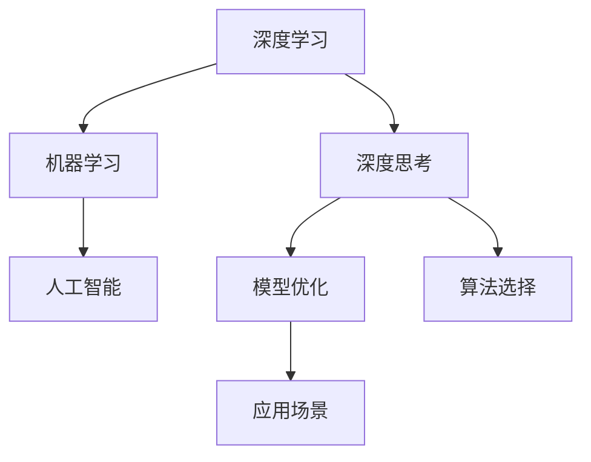

                 

# 深度思考的意义:透过现象看本质

> 关键词：深度学习,机器学习,人工智能,深度思考,模型优化,算法选择,应用场景

## 1. 背景介绍

### 1.1 问题由来
在信息技术飞速发展的今天，深度学习、机器学习等人工智能(AI)技术已经成为推动各行各业数字化转型的重要力量。然而，随着技术的不断进步，人们对于AI的期待也愈发增高，不仅希望机器能够"思考"、"决策"，还希望其具备深度理解、自我学习和自适应能力。因此，如何使AI具备真正意义上的"深度思考"能力，成为了当前AI研究的热点问题。

### 1.2 问题核心关键点
深度思考是指AI系统通过深度学习和自我优化，逐渐从表面现象深入到事物的本质，理解并解决复杂问题的一种能力。其核心关键点包括：
- 复杂度：深度思考要求AI系统能够处理高复杂度的问题，不仅仅是对数据进行简单线性分析，而是能够建立多层次、多维度的关联网络。
- 抽象能力：深度思考要求AI系统具备高度的抽象能力，能够从具体现象中提炼出抽象规律，从而进行泛化推理和创新。
- 自我优化：深度思考要求AI系统具备自我学习和自适应能力，能够在不断反馈和迭代中优化自身模型，提升性能。
- 安全性与公正性：深度思考的AI系统需要确保决策过程透明、公正，避免偏见和歧视。

## 2. 核心概念与联系

### 2.1 核心概念概述

为了更好地理解深度思考在AI系统中的实现，我们首先需要介绍一些关键概念：

- 深度学习(Deep Learning)：基于神经网络结构进行复杂模式识别和预测的学习方法。深度学习通过多层非线性变换，能够学习到数据的高级特征表示。

- 机器学习(Machine Learning)：让机器从数据中学习规律并作出决策的技术。机器学习包括监督学习、无监督学习、强化学习等多种范式。

- 人工智能(Artificial Intelligence)：使机器具备智能行为的技术。深度学习是实现人工智能的核心技术之一。

- 深度思考(Deep Thinking)：通过深度学习和自我优化，使AI系统具备深入理解事物本质的能力。深度思考不仅是理解问题的过程，更是创新和解决复杂问题的能力。

- 模型优化(Model Optimization)：通过算法选择和参数调优，使AI模型达到最佳性能的过程。模型优化是深度思考的基础。

- 算法选择(Algorithm Selection)：根据具体问题选择合适的算法，是模型优化的重要一环。

- 应用场景(Application Scenarios)：深度思考的AI系统在各行业中的应用场景，如医疗、金融、教育、智能交通等。

这些核心概念之间的逻辑关系可以通过以下Mermaid流程图来展示：



这个流程图展示了一系列核心概念及其之间的关系：

1. 深度学习是机器学习的基础，通过多层神经网络结构学习数据的高级特征表示。
2. 机器学习是人工智能的核心技术，包括多种学习范式。
3. 深度思考要求AI系统具备深入理解事物本质的能力，通过深度学习和自我优化实现。
4. 模型优化通过选择合适的算法和调优参数，使AI模型达到最佳性能。
5. 算法选择根据具体问题选择合适的算法，是模型优化的重要一环。
6. 应用场景是深度思考AI系统的落地应用，涵盖医疗、金融、教育等多个行业。

这些概念共同构成了深度思考在AI系统中的实现框架，使其能够在复杂问题上发挥出巨大潜力。通过理解这些核心概念，我们可以更好地把握深度思考的实现机制。

## 3. 核心算法原理 & 具体操作步骤
### 3.1 算法原理概述

深度思考要求AI系统具备深度学习和自我优化的能力，其核心在于构建深度神经网络模型，并通过有监督或无监督学习方式训练模型。以下我们将详细讲解深度思考的算法原理和具体操作步骤。

### 3.2 算法步骤详解

深度思考的AI系统构建一般包括以下几个关键步骤：

**Step 1: 数据准备与预处理**
- 收集高质量的标注数据，确保数据的多样性和代表性。
- 进行数据清洗和标准化处理，去除噪声和异常值。
- 对数据进行分割，划分为训练集、验证集和测试集。

**Step 2: 模型选择与设计**
- 根据具体问题选择合适的深度学习模型架构，如卷积神经网络(CNN)、循环神经网络(RNN)、变压器(Transformer)等。
- 确定模型的输入和输出结构，设计合适的损失函数和优化器。
- 选择适当的正则化技术，如L2正则、Dropout等，避免过拟合。

**Step 3: 模型训练与优化**
- 将数据输入模型，进行前向传播计算损失函数。
- 通过反向传播算法计算参数梯度，使用优化器更新模型参数。
- 在验证集上评估模型性能，根据性能指标调整学习率和正则化参数。
- 重复上述步骤直至模型收敛。

**Step 4: 模型评估与验证**
- 在测试集上评估模型性能，对比训练前后效果。
- 进行模型复杂度、泛化能力等指标的验证，确保模型性能稳定。
- 利用交叉验证、集成学习等技术提高模型鲁棒性。

**Step 5: 模型部署与应用**
- 将模型集成到实际应用系统中，进行在线推理预测。
- 在生产环境中监控模型性能，根据反馈进行持续优化。
- 将模型优化成果进行发布，供更多用户使用。

### 3.3 算法优缺点

深度思考的AI系统具有以下优点：
1. 能够处理复杂问题：深度学习模型能够学习到数据的高级特征表示，从而能够处理高复杂度的任务。
2. 具备抽象能力：通过多层次的特征提取和关联网络，深度学习模型具备高度的抽象能力，能够进行泛化推理和创新。
3. 具备自我优化能力：深度学习模型通过迭代优化，能够不断提升自身性能，实现深度思考。

但同时，深度思考的AI系统也存在一些缺点：
1. 数据需求高：深度学习模型需要大量标注数据进行训练，而标注数据获取成本较高，对数据质量要求也较高。
2. 模型解释性差：深度学习模型的决策过程缺乏可解释性，难以理解和调试。
3. 过拟合风险大：深度学习模型在处理高复杂度问题时，容易发生过拟合现象，导致模型泛化能力下降。
4. 训练计算量大：深度学习模型通常需要高性能计算资源进行训练，对硬件资源要求较高。

尽管存在这些局限性，但深度思考的AI系统仍在大数据处理和复杂问题解决上展现出巨大的潜力，是实现人工智能的关键技术之一。

### 3.4 算法应用领域

深度思考的AI系统已经在多个领域得到应用，例如：

- 医疗诊断：通过深度学习模型分析医学影像、病历等数据，辅助医生进行诊断。
- 金融风控：利用深度学习模型对金融数据进行分析和预测，控制风险。
- 智能客服：通过深度学习模型处理客户查询，提供智能客服服务。
- 自动驾驶：通过深度学习模型进行环境感知和决策，实现自动驾驶。
- 语音识别：通过深度学习模型实现高精度的语音识别和翻译。
- 自然语言处理：通过深度学习模型处理自然语言，实现机器翻译、情感分析等任务。

除了这些典型应用外，深度思考的AI系统还在更多的场景中发挥着重要作用，如人脸识别、推荐系统、图像生成等，推动着各行业的数字化转型。

## 4. 数学模型和公式 & 详细讲解  
### 4.1 数学模型构建

为了更加精确地描述深度思考的AI系统，我们将其建模为一个基于深度学习模型的系统，并给出其数学表达式。

记深度学习模型为 $M_{\theta}(x)$，其中 $x$ 为输入数据，$\theta$ 为模型参数。假设模型为多层神经网络，包含 $L$ 个隐藏层。模型的前向传播过程可以表示为：

$$
\begin{aligned}
z_0 &= W_0 x + b_0 \\
h_i &= \sigma(W_i z_{i-1} + b_i), \quad i = 1, \ldots, L \\
z_L &= W_L h_{L-1} + b_L \\
y &= \sigma(z_L)
\end{aligned}
$$

其中 $W_i, b_i$ 为第 $i$ 层的权重和偏置，$\sigma$ 为激活函数。模型的损失函数为 $L(y, \hat{y})$，通常采用交叉熵损失函数：

$$
L(y, \hat{y}) = -\sum_{i=1}^N y_i \log \hat{y}_i
$$

模型的优化目标是最小化损失函数，即：

$$
\theta^* = \mathop{\arg\min}_{\theta} L(M_{\theta}(x), y)
$$

其中 $x$ 为训练集，$y$ 为标注数据。模型的参数更新公式为：

$$
\theta \leftarrow \theta - \eta \nabla_{\theta} L(M_{\theta}(x), y)
$$

其中 $\eta$ 为学习率，$\nabla_{\theta} L$ 为损失函数对模型参数的梯度。

### 4.2 公式推导过程

以下我们以二分类任务为例，推导交叉熵损失函数及其梯度的计算公式。

假设模型 $M_{\theta}$ 在输入 $x$ 上的输出为 $\hat{y}=M_{\theta}(x) \in [0,1]$，表示样本属于正类的概率。真实标签 $y \in \{0,1\}$。则二分类交叉熵损失函数定义为：

$$
L(M_{\theta}(x), y) = -[y\log \hat{y} + (1-y)\log (1-\hat{y})]
$$

将其代入损失函数，得：

$$
\begin{aligned}
\mathcal{L}(\theta) &= \frac{1}{N} \sum_{i=1}^N L(M_{\theta}(x_i), y_i) \\
&= \frac{1}{N} \sum_{i=1}^N [-y_i\log M_{\theta}(x_i) - (1-y_i)\log(1-M_{\theta}(x_i))]
\end{aligned}
$$

根据链式法则，损失函数对参数 $\theta_k$ 的梯度为：

$$
\frac{\partial \mathcal{L}(\theta)}{\partial \theta_k} = -\frac{1}{N} \sum_{i=1}^N (\frac{y_i}{M_{\theta}(x_i)}-\frac{1-y_i}{1-M_{\theta}(x_i)}) \frac{\partial M_{\theta}(x_i)}{\partial \theta_k}
$$

其中 $\frac{\partial M_{\theta}(x_i)}{\partial \theta_k}$ 可进一步递归展开，利用自动微分技术完成计算。

## 5. 项目实践：代码实例和详细解释说明
### 5.1 开发环境搭建

在进行深度思考的AI系统开发前，我们需要准备好开发环境。以下是使用Python进行TensorFlow开发的环境配置流程：

1. 安装Anaconda：从官网下载并安装Anaconda，用于创建独立的Python环境。

2. 创建并激活虚拟环境：
```bash
conda create -n tf-env python=3.8 
conda activate tf-env
```

3. 安装TensorFlow：根据CUDA版本，从官网获取对应的安装命令。例如：
```bash
conda install tensorflow-gpu -c pytorch -c conda-forge
```

4. 安装各类工具包：
```bash
pip install numpy pandas scikit-learn matplotlib tqdm jupyter notebook ipython
```

完成上述步骤后，即可在`tf-env`环境中开始深度思考的AI系统开发。

### 5.2 源代码详细实现

这里我们以医疗诊断中的病历分类为例，给出使用TensorFlow构建深度学习模型的PyTorch代码实现。

首先，定义模型架构：

```python
import tensorflow as tf
from tensorflow.keras import layers, models

# 定义模型架构
def create_model(input_dim):
    inputs = tf.keras.Input(shape=(input_dim,))
    x = layers.Dense(256, activation='relu')(inputs)
    x = layers.Dense(128, activation='relu')(x)
    x = layers.Dense(64, activation='relu')(x)
    outputs = layers.Dense(1, activation='sigmoid')(x)
    model = tf.keras.Model(inputs=inputs, outputs=outputs)
    return model
```

然后，准备数据集并进行预处理：

```python
import pandas as pd
import numpy as np

# 加载病历数据
data = pd.read_csv('data.csv')

# 将文本转换为数字表示
tokenizer = tf.keras.preprocessing.text.Tokenizer()
tokenizer.fit_on_texts(data['text'])
sequences = tokenizer.texts_to_sequences(data['text'])
input_dim = len(tokenizer.word_index) + 1
data['seq'] = sequences

# 将标签转换为二进制表示
labels = pd.get_dummies(data['label']).values
input_dim += len(labels[0])

# 将数据集划分为训练集和测试集
train_data = data[data['split'] == 'train']
test_data = data[data['split'] == 'test']
train_seq = train_data['seq'].values
test_seq = test_data['seq'].values

# 构建模型
model = create_model(input_dim)
```

接着，编译模型并进行训练：

```python
# 编译模型
model.compile(optimizer=tf.keras.optimizers.Adam(learning_rate=0.001),
              loss='binary_crossentropy',
              metrics=['accuracy'])

# 训练模型
model.fit(train_seq, train_labels, epochs=10, validation_data=(test_seq, test_labels))
```

最后，评估模型并进行预测：

```python
# 评估模型
test_loss, test_acc = model.evaluate(test_seq, test_labels)
print('Test loss:', test_loss)
print('Test accuracy:', test_acc)

# 进行预测
new_text = '输入一段新的病历文本'
new_seq = tokenizer.texts_to_sequences(new_text)
new_seq = np.array(new_seq)
predictions = model.predict(new_seq)
print('预测结果：', predictions)
```

以上就是使用TensorFlow对深度思考的AI系统进行病历分类的完整代码实现。可以看到，TensorFlow提供了丰富的深度学习库和组件，可以方便地构建和训练深度学习模型。

### 5.3 代码解读与分析

让我们再详细解读一下关键代码的实现细节：

**create_model函数**：
- 定义了一个简单的深度学习模型，包含三层全连接层，输出层为sigmoid函数。
- 使用keras.Model封装模型，使其成为可训练的模型对象。

**数据预处理**：
- 使用Tokenizer将文本转换为数字序列，并计算词汇表大小。
- 将标签转换为二进制表示，并计算标签数量。
- 将数据集划分为训练集和测试集，分别构建训练集和测试集的特征和标签。

**模型训练与评估**：
- 使用Adam优化器和交叉熵损失函数编译模型，指定评估指标为准确率。
- 调用模型的fit方法进行模型训练，指定训练集和验证集。
- 在测试集上评估模型，输出测试损失和准确率。
- 使用模型进行预测，并输出预测结果。

通过上述代码实现，可以清晰地看到深度思考的AI系统构建和训练的全过程。TensorFlow的深度学习库使得构建和训练深度学习模型变得简单高效，可以快速迭代实现功能需求。

## 6. 实际应用场景
### 6.1 智能客服系统

基于深度思考的AI系统，可以广泛应用于智能客服系统的构建。智能客服系统利用深度学习模型处理客户查询，提供智能化的客服服务。智能客服系统能够快速响应客户咨询，提高服务效率，提升客户体验。

在技术实现上，智能客服系统可以通过深度学习模型进行客户意图识别和自然语言理解，从而实现智能问答和自动回复。深度学习模型通过学习历史客户咨询数据，能够理解客户的查询意图，并从知识库中抽取相关信息进行回答。此外，智能客服系统还可以进行情感分析，根据客户的情感倾向提供相应的服务建议，进一步提升客户满意度。

### 6.2 金融风控

深度思考的AI系统在金融风控领域也有广泛的应用。金融机构可以利用深度学习模型对客户行为数据进行分析，预测客户信用风险。深度学习模型通过学习大量的历史数据，能够识别出客户行为中的异常模式，预测客户的违约风险，从而帮助金融机构进行风险控制和决策支持。

在技术实现上，金融风控系统可以通过深度学习模型进行客户行为数据分析和风险评估。深度学习模型通过学习客户的历史行为数据，能够识别出客户的违约风险信号，并预测客户的违约概率。金融风控系统还可以结合其他数据源，如社交媒体、新闻、财务报告等，进行综合评估，进一步提高风险控制的准确性。

### 6.3 自动驾驶

自动驾驶系统利用深度学习模型进行环境感知和决策，实现自主驾驶。深度学习模型通过学习大量的驾驶数据，能够识别出道路环境中的各种物体和障碍，预测其他车辆的行动轨迹，从而实现安全的自动驾驶。

在技术实现上，自动驾驶系统可以通过深度学习模型进行环境感知和决策。深度学习模型通过学习道路环境中的各种传感器数据，能够识别出道路环境中的各种物体和障碍，并预测其他车辆的行动轨迹。自动驾驶系统还可以结合其他技术，如激光雷达、雷达、摄像头等，进行多传感器数据融合，进一步提高感知和决策的准确性。

### 6.4 未来应用展望

随着深度学习技术的不断发展，深度思考的AI系统将在更多领域得到应用，为各行各业带来变革性影响。

在智慧医疗领域，深度思考的AI系统可以辅助医生进行诊断和治疗，提高医疗服务的智能化水平。深度学习模型通过学习医学影像、病历等数据，能够识别出疾病的早期迹象，辅助医生进行早期诊断和治疗。

在智能教育领域，深度思考的AI系统可以辅助教师进行教学，提高教育服务的个性化水平。深度学习模型通过学习学生的学习行为数据，能够识别出学生的学习兴趣和难点，为教师提供个性化的教学建议，从而提高教学效果。

在智慧城市治理中，深度思考的AI系统可以辅助城市管理者进行城市管理，提高城市管理的智能化水平。深度学习模型通过学习城市环境数据，能够识别出城市中的各种问题，并进行实时监测和预警，从而提高城市管理的效率和效果。

此外，在企业生产、社会治理、文娱传媒等众多领域，深度思考的AI系统也将不断涌现，为各行业带来新的技术突破和创新应用。相信随着技术的不断发展，深度思考的AI系统将在更多领域得到应用，为各行各业带来更多的变革和机遇。

## 7. 工具和资源推荐
### 7.1 学习资源推荐

为了帮助开发者系统掌握深度思考的AI系统，这里推荐一些优质的学习资源：

1. 《深度学习》书籍：Ian Goodfellow等人所著，全面介绍了深度学习的基本概念和算法原理，是深度学习领域的经典教材。
2. 《机器学习》课程：斯坦福大学Andrew Ng教授开设的机器学习课程，讲解了机器学习的基本理论和算法，适合初学者入门。
3. 《TensorFlow实战》书籍：Google TensorFlow团队所著，详细介绍了TensorFlow的使用方法和应用场景，适合TensorFlow初学者。
4. Kaggle平台：数据科学和机器学习竞赛平台，可以参与各种竞赛，锻炼自己的深度学习能力。
5. Arxiv预印本网站：学术论文预印本网站，可以及时获取深度学习领域的前沿研究进展。

通过对这些资源的学习实践，相信你一定能够快速掌握深度思考的AI系统的实现原理，并用于解决实际的深度学习问题。
###  7.2 开发工具推荐

高效的开发离不开优秀的工具支持。以下是几款用于深度思考的AI系统开发的常用工具：

1. TensorFlow：由Google主导开发的深度学习框架，功能丰富，适合大规模工程应用。
2. PyTorch：由Facebook主导开发的深度学习框架，灵活高效，适合快速迭代研究。
3. Keras：基于TensorFlow和Theano的高级神经网络API，易于使用，适合初学者入门。
4. Weights & Biases：模型训练的实验跟踪工具，可以记录和可视化模型训练过程中的各项指标，方便对比和调优。
5. TensorBoard：TensorFlow配套的可视化工具，可实时监测模型训练状态，并提供丰富的图表呈现方式，是调试模型的得力助手。
6. Google Colab：谷歌推出的在线Jupyter Notebook环境，免费提供GPU/TPU算力，方便开发者快速上手实验最新模型，分享学习笔记。

合理利用这些工具，可以显著提升深度思考的AI系统开发效率，加快创新迭代的步伐。

### 7.3 相关论文推荐

深度思考的AI系统的发展源于学界的持续研究。以下是几篇奠基性的相关论文，推荐阅读：

1. Deep Residual Learning for Image Recognition（ResNet论文）：提出深度残差网络，解决了深度神经网络中的梯度消失和过拟合问题，使得深度学习模型能够处理更深的网络结构。
2. ImageNet Classification with Deep Convolutional Neural Networks：提出卷积神经网络（CNN），并在大规模图像识别任务ImageNet上取得优异的成绩，开启了深度学习在图像领域的应用。
3. Deep Q-Networks for Humanoid Robotics：提出深度强化学习（Deep RL）方法，通过深度学习模型实现机器人控制任务，进一步推动了深度学习在机器人领域的应用。
4. AlphaGo Zero：提出AlphaGo Zero，利用深度学习模型实现围棋自我对弈，展示了深度学习在复杂决策问题中的应用潜力。
5. Generative Adversarial Networks（GAN论文）：提出生成对抗网络（GAN），能够生成高质量的图像、音频和视频数据，展示了深度学习在生成模型中的应用前景。

这些论文代表了大深度学习的发展脉络。通过学习这些前沿成果，可以帮助研究者把握深度学习的未来方向，激发更多的创新灵感。

## 8. 总结：未来发展趋势与挑战

### 8.1 总结

本文对深度思考的AI系统进行了全面系统的介绍。首先阐述了深度思考在AI系统中的实现机制，明确了深度思考在深度学习和自我优化中的重要作用。其次，从原理到实践，详细讲解了深度思考的算法原理和关键步骤，给出了深度思考的AI系统开发的完整代码实例。同时，本文还广泛探讨了深度思考的AI系统在各行业领域的应用前景，展示了深度思考的巨大潜力。此外，本文精选了深度思考的AI系统的各类学习资源，力求为读者提供全方位的技术指引。

通过本文的系统梳理，可以看到，深度思考的AI系统在处理复杂问题、提高智能水平、推动各行业数字化转型等方面，展现出巨大的应用前景。深度思考的AI系统不仅能处理高复杂度的数据，还能通过自我学习和优化，不断提高自身性能，实现真正的智能化。

### 8.2 未来发展趋势

展望未来，深度思考的AI系统将呈现以下几个发展趋势：

1. 模型规模持续增大。随着算力成本的下降和数据规模的扩张，深度学习模型将朝着更大规模发展。超大模型蕴含的丰富知识，能够更好地处理复杂问题。
2. 深度学习与迁移学习的融合。深度学习模型将结合迁移学习思想，通过预训练-微调的方式，提高模型在特定任务上的性能。
3. 多模态深度学习的发展。深度学习模型将拓展到多模态数据处理，如视觉、语音、文本等，提高模型的综合能力。
4. 强化学习与深度学习的结合。深度学习模型将结合强化学习思想，进行自我优化和决策，进一步提高模型的智能水平。
5. 自适应学习的发展。深度学习模型将具备自适应学习能力，根据任务需求动态调整模型结构和参数。
6. 数据驱动的深度学习。深度学习模型将更多地依赖数据驱动，通过数据反馈不断优化自身性能。

这些趋势展示了深度思考的AI系统在未来将具备更强大的能力，能够处理更加复杂和多样的任务，推动人工智能技术的进一步发展。

### 8.3 面临的挑战

尽管深度思考的AI系统已经取得了瞩目成就，但在迈向更加智能化、普适化应用的过程中，仍面临诸多挑战：

1. 数据获取成本高。深度学习模型需要大量标注数据进行训练，而标注数据获取成本较高。如何在保证数据质量的同时，降低数据获取成本，是一个重要问题。
2. 模型泛化能力有限。深度学习模型容易发生过拟合现象，泛化能力有限。如何提高模型的泛化能力，使其在实际应用中表现更好，是一个重要问题。
3. 计算资源消耗大。深度学习模型需要高性能计算资源进行训练和推理，对硬件资源要求较高。如何优化模型结构和算法，减少计算资源消耗，是一个重要问题。
4. 模型解释性差。深度学习模型的决策过程缺乏可解释性，难以理解和调试。如何提高模型的可解释性，使其更容易被用户接受，是一个重要问题。
5. 数据隐私和安全问题。深度学习模型需要大量数据进行训练，如何保护数据隐私和安全，避免数据泄露和滥用，是一个重要问题。

尽管存在这些挑战，但深度思考的AI系统仍然具有巨大的应用前景，需要研究者持续探索和突破。

### 8.4 研究展望

面对深度思考的AI系统所面临的挑战，未来的研究需要在以下几个方面寻求新的突破：

1. 无监督学习和自监督学习的发展。通过无监督学习和自监督学习，降低对标注数据的依赖，提高模型的泛化能力。
2. 多任务学习的探索。通过多任务学习，提高模型的多任务处理能力，使其能够处理多个相关任务。
3. 深度强化学习的结合。通过深度强化学习，实现自我优化和决策，进一步提高模型的智能水平。
4. 知识图谱与深度学习的融合。通过知识图谱与深度学习的结合，增强模型的知识推理和整合能力，提高模型的泛化能力。
5. 自适应学习机制的探索。通过自适应学习机制，使模型能够根据任务需求动态调整模型结构和参数，提高模型的智能水平。

这些研究方向的探索，必将引领深度思考的AI系统迈向更高的台阶，为构建安全、可靠、可解释、可控的智能系统铺平道路。面向未来，深度思考的AI系统还需要与其他人工智能技术进行更深入的融合，如知识表示、因果推理、强化学习等，多路径协同发力，共同推动自然语言理解和智能交互系统的进步。只有勇于创新、敢于突破，才能不断拓展深度思考的AI系统的边界，让智能技术更好地造福人类社会。

## 9. 附录：常见问题与解答

**Q1：深度思考的AI系统是否适用于所有任务？**

A: 深度思考的AI系统在处理复杂问题、提高智能水平、推动各行业数字化转型等方面，展现出巨大的应用前景。然而，对于一些简单问题，使用传统的规则引擎或专家系统可能更加高效。

**Q2：深度思考的AI系统如何进行自我优化？**

A: 深度思考的AI系统通过自我学习和优化，不断提升自身性能。具体来说，深度学习模型通过反向传播算法计算梯度，并根据梯度更新模型参数。此外，还可以通过正则化技术、学习率调优等方法，防止过拟合，提高模型泛化能力。

**Q3：深度思考的AI系统如何处理噪声数据？**

A: 深度思考的AI系统可以通过数据清洗和噪声过滤等方法，去除噪声数据。同时，在模型训练过程中，可以通过Dropout等技术，减少模型对噪声数据的依赖，提高模型的鲁棒性。

**Q4：深度思考的AI系统如何保证模型泛化能力？**

A: 深度思考的AI系统可以通过数据增强、多模型集成、交叉验证等技术，提高模型的泛化能力。此外，还可以引入对抗样本等技术，增强模型的鲁棒性，防止模型过拟合。

**Q5：深度思考的AI系统如何保证模型解释性？**

A: 深度思考的AI系统可以通过简化模型结构、引入可解释性技术（如LIME、SHAP等），提高模型的可解释性。此外，还可以使用对抗样本生成等技术，探索模型决策过程，提高模型的可解释性。

这些问题的解答，可以帮助开发者更好地理解和实现深度思考的AI系统，推动其在各行业领域的广泛应用。

---

作者：禅与计算机程序设计艺术 / Zen and the Art of Computer Programming

