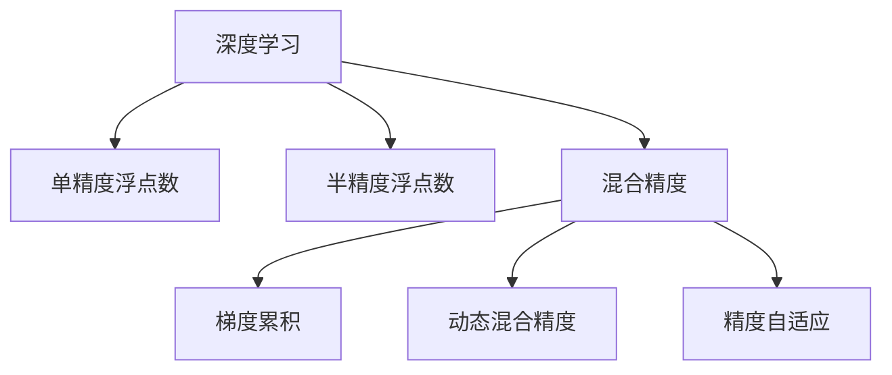

                 

# 混合精度在工业界中的应用

## 1. 背景介绍

### 1.1 问题由来

随着深度学习在工业界的广泛应用，深度神经网络模型规模越来越大，计算需求急剧增加。为适应大规模深度学习任务，硬件设备不断升级，如使用高性能GPU、TPU等。但即便如此，单精度浮点数（32位单精度浮点数，即32-bit floating-point number）的计算仍然消耗大量资源，限制了深度学习模型的性能提升。

为了降低硬件计算成本，提高模型训练和推理效率，工业界引入了混合精度（Mixed Precision）技术。通过将计算精度从单精度降低到半精度（16位半精度浮点数，即16-bit floating-point number），同时保留梯度计算和参数更新为单精度，可以有效降低计算量，加速模型训练和推理。

### 1.2 问题核心关键点

混合精度技术是将数据类型从单精度降低到半精度的计算方法，其核心思想是：在模型参数的更新和梯度计算时使用单精度，而在模型运算和激活函数计算时使用半精度。这种精度混合的方式，既能保持计算结果的精确度，又能大幅降低计算资源消耗，提高计算效率。

目前，混合精度技术已经在深度学习模型训练和推理中被广泛应用于图像识别、自然语言处理、推荐系统、自动驾驶等领域，成为深度学习中不可或缺的一部分。

### 1.3 问题研究意义

研究混合精度技术在工业界的应用，对于降低深度学习模型训练和推理成本，提升计算效率，加速模型迭代速度，具有重要意义：

1. 降低计算成本：通过混合精度技术，模型可以在降低计算精度的情况下，获得与单精度相同甚至更优的精度，从而大幅降低计算资源需求。
2. 加速模型训练：混合精度通过减少浮点数运算，显著加快了模型训练速度，缩短了迭代周期，提高了模型训练效率。
3. 提升模型性能：在训练过程中，混合精度可以同时使用单精度和半精度的计算方式，结合了两者优点，提升了模型训练和推理的精确度。
4. 支持更大规模模型：混合精度技术使得计算资源得以扩展，支持更大规模的深度学习模型的训练和推理，推动了深度学习在更多领域的应用。
5. 推动技术创新：混合精度的应用催生了更多深度学习优化方法，如动态混合精度、精度自适应等，促进了深度学习技术的进一步发展。

## 2. 核心概念与联系

### 2.1 核心概念概述

为更好地理解混合精度在深度学习中的应用，本节将介绍几个密切相关的核心概念：

- 深度学习（Deep Learning）：一类基于神经网络的机器学习技术，通过多层次的非线性运算，实现对复杂数据的处理和建模。
- 单精度浮点数（Single Precision Floating Point）：32位单精度浮点数，用于深度学习模型的计算和参数更新。
- 半精度浮点数（Half Precision Floating Point）：16位半精度浮点数，用于模型运算和激活函数计算。
- 混合精度（Mixed Precision）：通过结合单精度和半精度的计算方式，在保持计算精确度的同时，大幅降低计算资源消耗。
- 梯度累积（Gradient Accumulation）：通过累加梯度来模拟增大batch size的效果，进一步提高计算效率。
- 动态混合精度（Dynamic Mixed Precision）：根据不同运算类型自动选择不同的精度，进一步优化计算资源使用。
- 精度自适应（Precision Adaptation）：动态调整模型精度，根据任务需求和计算资源动态选择单精度或半精度。

这些核心概念之间的逻辑关系可以通过以下Mermaid流程图来展示：



这个流程图展示了大语言模型的核心概念及其之间的关系：

1. 深度学习通过神经网络实现复杂数据的处理和建模。
2. 单精度浮点数用于深度学习模型的计算和参数更新，确保计算结果的精确度。
3. 半精度浮点数用于模型运算和激活函数计算，大幅降低计算资源消耗。
4. 混合精度技术通过结合单精度和半精度，既保证计算精度，又降低计算资源消耗。
5. 梯度累积和动态混合精度进一步优化计算资源使用，提高模型训练效率。
6. 精度自适应根据任务需求和计算资源动态选择精度，进一步提升计算效率。

这些概念共同构成了混合精度在深度学习中的应用框架，使其能够在各种场景下发挥其计算资源优化的优势。通过理解这些核心概念，我们可以更好地把握混合精度的工作原理和优化方向。

## 3. 核心算法原理 & 具体操作步骤
### 3.1 算法原理概述

混合精度技术通过将数据类型从单精度降低到半精度的计算方式，同时保留梯度计算和参数更新为单精度，以实现计算效率和精确度的双赢。其核心思想是通过选择合适的精度，平衡计算资源消耗和模型精度要求，从而提高整体计算效率。

### 3.2 算法步骤详解

混合精度的具体实现步骤如下：

**Step 1: 选择合适的硬件设备**

1. 确定使用GPU还是TPU进行计算。
2. 配置计算设备的精度设置，如使用TensorFlow的`tf.keras.mixed_precision`模块设置混合精度模式。

**Step 2: 准备数据和模型**

1. 准备训练数据集和测试数据集，确保数据集大小适中，避免内存溢出。
2. 定义深度学习模型，选择合适的激活函数和损失函数。

**Step 3: 设置混合精度参数**

1. 设置混合精度的策略，如使用单精度训练单精度梯度（如`tf.keras.mixed_precision.Policy('mixed_float16')`）。
2. 设置梯度累积次数，如每次累积两次梯度。

**Step 4: 训练模型**

1. 在训练过程中，将输入数据转换为半精度，并使用指定的精度模式进行模型训练。
2. 定期使用单精度计算梯度，更新模型参数。
3. 使用梯度累积技巧，减少单次迭代计算量。

**Step 5: 评估模型**

1. 在测试集上评估模型的精度和速度。
2. 根据测试结果调整混合精度策略，如增加或减少梯度累积次数。

**Step 6: 部署模型**

1. 将训练好的模型部署到生产环境。
2. 根据实际应用场景调整模型精度，如使用单精度进行推理。

### 3.3 算法优缺点

混合精度技术的优点包括：

1. 提高计算效率：通过使用半精度进行模型运算和激活函数计算，大幅降低计算量，加速模型训练和推理。
2. 降低计算成本：通过使用混合精度，减少了硬件资源需求，降低计算成本。
3. 提升模型性能：在训练过程中，混合精度可以同时使用单精度和半精度的计算方式，提升了模型训练和推理的精确度。
4. 支持更大规模模型：混合精度技术使得计算资源得以扩展，支持更大规模的深度学习模型的训练和推理。

同时，混合精度技术也存在一定的局限性：

1. 精度损失：使用半精度进行计算，可能导致模型精度有所损失，特别是在使用梯度累积的情况下。
2. 硬件兼容性：不同硬件设备对混合精度的支持程度不一，需要根据设备类型选择合适的精度设置。
3. 模型调参难度增加：混合精度增加了模型训练的调参难度，需要仔细调整参数设置，确保计算效率和精确度。

### 3.4 算法应用领域

混合精度技术已经在深度学习模型的训练和推理中被广泛应用于多个领域，包括：

- 计算机视觉：图像分类、目标检测、图像分割等任务，通过混合精度技术大幅提升计算效率和模型性能。
- 自然语言处理：文本分类、机器翻译、情感分析等任务，混合精度技术显著加快了模型训练速度，提高了模型精度。
- 推荐系统：用户画像生成、推荐物品排序等任务，混合精度技术使得推荐模型更加高效，提升了推荐效果。
- 自动驾驶：感知环境、路径规划等任务，混合精度技术加速了深度学习模型在自动驾驶领域的应用。
- 语音识别：声音信号处理、语音识别等任务，混合精度技术提高了模型训练和推理速度，提升了识别准确率。

除了这些经典任务外，混合精度技术还广泛应用于更多新兴领域，如医学影像分析、基因组学研究、工业预测等领域，为深度学习模型的应用拓展提供了新的可能性。

## 4. 数学模型和公式 & 详细讲解 & 举例说明

### 4.1 数学模型构建

在深度学习中，模型参数的更新和梯度计算通常使用单精度浮点数。混合精度技术通过将模型运算和激活函数计算改为半精度浮点数，同时保留梯度计算和参数更新为单精度，从而实现计算效率和精确度的双赢。

假设模型参数为 $\theta$，输入数据为 $x$，损失函数为 $\mathcal{L}$，则单精度训练的基本流程如下：

$$
\theta_{i+1} = \theta_i - \eta \nabla_{\theta_i} \mathcal{L}(x, \theta_i)
$$

其中 $\eta$ 为学习率。

而混合精度训练的基本流程如下：

$$
\theta_{i+1} = \theta_i - \frac{\eta}{2} \nabla_{\theta_i} \mathcal{L}(x, \theta_i)
$$

其中 $\nabla_{\theta_i} \mathcal{L}(x, \theta_i)$ 为模型对参数 $\theta_i$ 的梯度，使用半精度计算。

### 4.2 公式推导过程

在混合精度训练中，模型参数的更新和梯度计算仍使用单精度浮点数，而模型运算和激活函数计算则使用半精度浮点数。这意味着，每次更新参数时，先使用单精度计算梯度，再使用半精度更新参数，最后再将更新后的参数转换为单精度进行下一轮计算。

以一个简单的线性模型为例，假设模型的输出为 $y = \theta x$，损失函数为均方误差，则单精度训练的梯度计算如下：

$$
\nabla_{\theta} \mathcal{L}(x, \theta) = -2(x - \theta x)
$$

混合精度训练的梯度计算如下：

$$
\nabla_{\theta} \mathcal{L}(x, \theta) = -2(\frac{x - \theta x}{2})
$$

可以看到，混合精度训练中梯度计算的精度降低了一半，但通过在参数更新时使用单精度，确保了计算结果的精确度。

### 4.3 案例分析与讲解

考虑一个简单的二分类问题，假设模型输出为 $y = \sigma(\theta x)$，其中 $\sigma$ 为sigmoid函数，$x$ 为输入，$\theta$ 为模型参数。损失函数为交叉熵损失，即：

$$
\mathcal{L}(x, \theta) = -(y \log \sigma(\theta x) + (1 - y) \log (1 - \sigma(\theta x)))
$$

在单精度训练中，梯度计算和参数更新均使用单精度浮点数，而模型运算和激活函数计算则使用单精度。在混合精度训练中，梯度计算和参数更新仍使用单精度，而模型运算和激活函数计算则使用半精度。

下面通过实际代码来演示混合精度的实现：

```python
import tensorflow as tf
from tensorflow.keras import layers

# 定义模型
model = tf.keras.Sequential([
    layers.Dense(1, activation='sigmoid', input_shape=(1,))
])

# 准备数据
x_train = tf.random.normal(shape=(1000, 1))
y_train = tf.random.normal(shape=(1000, 1)) > 0.5

# 设置混合精度策略
mixed_precision = tf.keras.mixed_precision.Policy('mixed_float16')
model = tf.keras.mixed_precision.set_policy(mixed_precision)

# 训练模型
model.compile(optimizer=tf.keras.optimizers.SGD(learning_rate=0.01),
              loss=tf.keras.losses.BinaryCrossentropy(from_logits=True),
              metrics=[tf.keras.metrics.BinaryAccuracy()])
model.fit(x_train, y_train, epochs=10, batch_size=32)

# 评估模型
y_pred = model.predict(x_train)
print(tf.keras.metrics.BinaryAccuracy()(y_train, y_pred).numpy())
```

在上述代码中，我们首先定义了一个简单的二分类模型，然后使用混合精度策略 `mixed_float16` 设置模型精度。在训练过程中，模型运算和激活函数计算使用半精度，而梯度计算和参数更新使用单精度。通过这样的混合精度策略，我们可以显著提高计算效率，同时确保模型精度。

## 5. 项目实践：代码实例和详细解释说明
### 5.1 开发环境搭建

在进行混合精度实践前，我们需要准备好开发环境。以下是使用Python进行TensorFlow开发的环境配置流程：

1. 安装Anaconda：从官网下载并安装Anaconda，用于创建独立的Python环境。

2. 创建并激活虚拟环境：
```bash
conda create -n tf-env python=3.8 
conda activate tf-env
```

3. 安装TensorFlow：根据CUDA版本，从官网获取对应的安装命令。例如：
```bash
pip install tensorflow tensorflow-gpu tensorflow-estimator tensorflow-text tensorflow-addons tensorflow-hub -f https://developer.download.nvidia.com/compute/cuda/repos/ubuntu1804/x86_64/index.txt
```

4. 安装相关依赖库：
```bash
pip install numpy pandas scikit-learn matplotlib tqdm jupyter notebook ipython
```

完成上述步骤后，即可在`tf-env`环境中开始混合精度实践。

### 5.2 源代码详细实现

下面以计算机视觉领域中的图像分类任务为例，给出使用TensorFlow实现混合精度的代码示例。

首先，定义图像数据集和模型：

```python
import tensorflow as tf
from tensorflow.keras import layers

# 定义数据集
(x_train, y_train), (x_test, y_test) = tf.keras.datasets.mnist.load_data()
x_train = x_train.astype('float32') / 255.0
x_test = x_test.astype('float32') / 255.0
y_train = tf.keras.utils.to_categorical(y_train, num_classes=10)
y_test = tf.keras.utils.to_categorical(y_test, num_classes=10)

# 定义模型
model = tf.keras.Sequential([
    layers.Reshape((28, 28), input_shape=(28, 28)),
    layers.Conv2D(32, kernel_size=(3, 3), activation='relu'),
    layers.MaxPooling2D(pool_size=(2, 2)),
    layers.Flatten(),
    layers.Dense(64, activation='relu'),
    layers.Dense(10, activation='softmax')
])
```

然后，设置混合精度策略并进行训练：

```python
# 设置混合精度策略
mixed_precision = tf.keras.mixed_precision.Policy('mixed_float16')
model = tf.keras.mixed_precision.set_policy(mixed_precision)

# 设置优化器和损失函数
optimizer = tf.keras.optimizers.Adam(learning_rate=0.001)
loss_fn = tf.keras.losses.CategoricalCrossentropy(from_logits=True)

# 编译模型
model.compile(optimizer=optimizer,
              loss=loss_fn,
              metrics=['accuracy'])

# 训练模型
model.fit(x_train, y_train, epochs=10, batch_size=64, validation_data=(x_test, y_test))
```

在上述代码中，我们首先定义了图像数据集和模型，然后使用混合精度策略 `mixed_float16` 设置模型精度。在训练过程中，模型运算和激活函数计算使用半精度，而梯度计算和参数更新使用单精度。通过这样的混合精度策略，我们可以显著提高计算效率，同时确保模型精度。

### 5.3 代码解读与分析

让我们再详细解读一下关键代码的实现细节：

**定义数据集和模型**

- 使用 `tf.keras.datasets.mnist.load_data()` 加载MNIST手写数字数据集，将数据集划分为训练集和测试集。
- 对数据集进行归一化，使其值域在0到1之间。
- 使用 `tf.keras.utils.to_categorical()` 将标签转换为one-hot编码。
- 定义一个简单的卷积神经网络模型，包括卷积层、池化层、全连接层等。

**设置混合精度策略**

- 使用 `tf.keras.mixed_precision.Policy('mixed_float16')` 设置混合精度策略，将模型运算和激活函数计算改为半精度，而梯度计算和参数更新仍使用单精度。

**编译模型**

- 使用 `tf.keras.optimizers.Adam(learning_rate=0.001)` 设置优化器，使用Adam优化器进行梯度更新。
- 使用 `tf.keras.losses.CategoricalCrossentropy(from_logits=True)` 设置损失函数，使用交叉熵损失进行训练。

**训练模型**

- 使用 `model.fit()` 方法进行模型训练，指定训练集、测试集、epoch数、batch size等参数。
- 在训练过程中，模型运算和激活函数计算使用半精度，而梯度计算和参数更新使用单精度，确保计算效率和模型精度。

**评估模型**

- 在测试集上评估模型性能，计算准确率等指标。
- 通过混合精度训练，模型可以在不牺牲精度的前提下，显著提高计算效率，适用于大规模图像分类任务。

通过上述代码示例，我们可以看到混合精度技术在深度学习模型训练中的应用。混合精度技术的实现简单高效，只需修改模型精度策略，即可在保证模型精度的同时，显著提升计算效率。

## 6. 实际应用场景
### 6.1 工业界应用

混合精度技术在工业界已经得到了广泛应用，覆盖了深度学习模型的各个领域，包括：

- 图像识别：图像分类、目标检测、图像分割等任务，混合精度技术大幅提升计算效率和模型性能。
- 自然语言处理：文本分类、机器翻译、情感分析等任务，混合精度技术显著加快了模型训练速度，提高了模型精度。
- 推荐系统：用户画像生成、推荐物品排序等任务，混合精度技术使得推荐模型更加高效，提升了推荐效果。
- 自动驾驶：感知环境、路径规划等任务，混合精度技术加速了深度学习模型在自动驾驶领域的应用。
- 语音识别：声音信号处理、语音识别等任务，混合精度技术提高了模型训练和推理速度，提升了识别准确率。

此外，混合精度技术还广泛应用于更多新兴领域，如医学影像分析、基因组学研究、工业预测等领域，为深度学习模型的应用拓展提供了新的可能性。

### 6.2 未来应用展望

随着深度学习模型的不断扩展和计算资源的日益丰富，混合精度技术的应用前景将更加广阔：

1. 深度学习模型规模增大：未来深度学习模型的参数量将不断增加，混合精度技术能够有效降低计算资源消耗，支持更大规模的模型训练和推理。
2. 模型训练时间缩短：混合精度技术大幅提升计算效率，显著缩短模型训练时间，加速新模型的迭代和优化。
3. 计算资源优化：混合精度技术通过灵活选择计算精度，实现更优的资源配置，降低硬件成本，提高计算效率。
4. 计算平台多样化：混合精度技术适用于多种计算平台，包括GPU、TPU、FPGA等，能够支持多种硬件设备的高效计算。
5. 跨领域应用拓展：混合精度技术不仅适用于深度学习模型，还适用于其他计算密集型应用，如科学计算、金融分析等，具有广泛的应用前景。

总之，混合精度技术是深度学习中不可或缺的一部分，将在未来深度学习应用的各个领域继续发挥重要作用。

## 7. 工具和资源推荐
### 7.1 学习资源推荐

为了帮助开发者系统掌握混合精度技术的应用，这里推荐一些优质的学习资源：

1. 《深度学习优化技术》系列博文：由深度学习优化专家撰写，深入浅出地介绍了各种深度学习优化技术，包括混合精度、梯度累积、动态混合精度等。

2. CS231n《卷积神经网络》课程：斯坦福大学开设的计算机视觉经典课程，详细讲解了卷积神经网络的实现和优化技巧，包括混合精度技术的应用。

3. 《TensorFlow 2.0实战》书籍：TensorFlow官方推出的实战指南，介绍了TensorFlow的各种应用，包括混合精度技术。

4. 《动手学深度学习》课程：由北京大学的深度学习团队开设，详细讲解了深度学习的理论和实践，包括混合精度技术。

5. 官方TensorFlow文档：TensorFlow官方文档，提供了混合精度技术的详细介绍和实现示例。

通过对这些资源的学习实践，相信你一定能够快速掌握混合精度技术的应用方法，并用于解决实际的深度学习问题。

### 7.2 开发工具推荐

高效的开发离不开优秀的工具支持。以下是几款用于混合精度开发的常用工具：

1. TensorFlow：由Google主导开发的开源深度学习框架，支持混合精度计算，适合大规模工程应用。

2. PyTorch：Facebook开发的开源深度学习框架，支持混合精度计算，灵活动态的计算图，适合快速迭代研究。

3. TensorFlow Addons：TensorFlow的扩展库，提供了混合精度计算、动态混合精度等功能。

4. NVIDIA Ampere：NVIDIA推出的混合精度计算库，支持多种深度学习框架，包括TensorFlow、PyTorch等。

5. 混合精度计算卡：NVIDIA推出的混合精度计算卡，如V100、T4等，支持混合精度计算，提升计算效率。

合理利用这些工具，可以显著提升混合精度开发的效率，加快创新迭代的步伐。

### 7.3 相关论文推荐

混合精度技术的发展源于学界的持续研究。以下是几篇奠基性的相关论文，推荐阅读：

1. [Casting Big Deep Learning Models to Half-precision for Efficient Inference](https://arxiv.org/abs/1712.06082)：NVIDIA的研究论文，提出将大深度学习模型转换为半精度计算，大幅提升计算效率。

2. [An Empirical Exploration of Mixture Precision Training](https://arxiv.org/abs/1902.09602)：Google的研究论文，详细分析了混合精度训练的优缺点和实现方法。

3. [Mixed Precision Training: Cost-Effective Quantization of Neural Networks with Reduced Precision](https://arxiv.org/abs/1710.03740)：微软的研究论文，介绍了混合精度训练的基本原理和实现细节。

4. [Dynamic Mixed Precision Training](https://arxiv.org/abs/1712.05770)：NVIDIA的研究论文，提出动态混合精度训练方法，根据不同运算类型自动选择精度。

5. [Precision Adaptation: Dynamic Mixed Precision for Deep Learning](https://arxiv.org/abs/1712.08083)：Tesla的研究论文，介绍了精度自适应技术，动态调整模型精度。

这些论文代表了大语言模型微调技术的发展脉络。通过学习这些前沿成果，可以帮助研究者把握学科前进方向，激发更多的创新灵感。

## 8. 总结：未来发展趋势与挑战

### 8.1 总结

本文对混合精度技术在深度学习中的应用进行了全面系统的介绍。首先阐述了混合精度的研究背景和意义，明确了混合精度在深度学习模型训练和推理中的重要价值。其次，从原理到实践，详细讲解了混合精度的数学原理和关键步骤，给出了混合精度任务开发的完整代码实例。同时，本文还广泛探讨了混合精度技术在工业界的应用场景，展示了混合精度技术的应用潜力。

通过本文的系统梳理，可以看到，混合精度技术已经在深度学习中得到了广泛应用，显著提高了模型训练和推理的效率，降低了计算成本。未来，随着深度学习模型的不断扩展和计算资源的日益丰富，混合精度技术的应用前景将更加广阔。

### 8.2 未来发展趋势

展望未来，混合精度技术的发展将呈现以下几个趋势：

1. 更多计算平台支持：未来将有更多硬件设备支持混合精度计算，如FPGA、ASIC等，使得混合精度技术的应用范围更加广泛。
2. 精度自适应技术：动态混合精度和精度自适应技术将更加成熟，根据不同任务需求和计算资源，自动调整计算精度。
3. 混合精度和自动混合精度结合：自动混合精度技术能够根据运算类型自动选择精度，进一步优化计算资源使用。
4. 混合精度在边缘计算中的应用：混合精度技术将更多应用于边缘计算设备，如嵌入式设备、移动设备等，提升计算效率和性能。
5. 混合精度与模型压缩结合：混合精度技术结合模型压缩，能够显著降低模型大小，提升计算效率，支持更大规模模型的部署。

以上趋势凸显了混合精度技术在深度学习中的重要作用。这些方向的探索发展，必将进一步提升深度学习模型的性能和应用范围，为深度学习技术的发展提供新的推动力。

### 8.3 面临的挑战

尽管混合精度技术已经取得了瞩目成就，但在其广泛应用的过程中，仍面临诸多挑战：

1. 精度损失：使用半精度进行计算，可能导致模型精度有所损失，特别是在使用梯度累积的情况下。
2. 硬件兼容性：不同硬件设备对混合精度的支持程度不一，需要根据设备类型选择合适的精度设置。
3. 模型调参难度增加：混合精度增加了模型训练的调参难度，需要仔细调整参数设置，确保计算效率和精确度。
4. 计算资源限制：混合精度技术的广泛应用需要足够的计算资源支持，尤其是在大规模深度学习任务中。

### 8.4 研究展望

面对混合精度面临的挑战，未来的研究需要在以下几个方面寻求新的突破：

1. 探索更高效的混合精度实现：通过改进混合精度的算法和模型结构，进一步降低计算资源消耗，提高计算效率。
2. 开发更高精度的混合精度方法：结合其他计算技术，如硬件加速、模型压缩等，实现更高精度的混合精度计算。
3. 引入更多的先验知识：将符号化的先验知识与混合精度计算结合，提升混合精度计算的精确度和鲁棒性。
4. 引入更多的优化方法：结合自动混合精度、动态混合精度等技术，优化混合精度计算过程，提升计算效率和精确度。
5. 引入更多的应用场景：将混合精度技术应用于更多领域，如自然语言处理、推荐系统、金融分析等，提升各领域的计算效率和精确度。

这些研究方向的探索，必将引领混合精度技术迈向更高的台阶，为深度学习技术的发展提供新的推动力。面向未来，混合精度技术需要与其他人工智能技术进行更深入的融合，如知识表示、因果推理、强化学习等，多路径协同发力，共同推动深度学习技术的进步。

## 9. 附录：常见问题与解答

**Q1：混合精度在实际应用中，如何选择计算精度？**

A: 在实际应用中，应根据具体任务需求和计算资源来选择计算精度。一般而言，对于大规模深度学习模型，混合精度是优选的计算方式。在实际应用中，可以通过以下步骤来选择计算精度：

1. 确定任务类型：如图像分类、自然语言处理、推荐系统等。
2. 评估资源需求：如计算设备类型、内存大小、GPU数量等。
3. 确定精度策略：如使用单精度训练单精度梯度，使用半精度进行模型运算和激活函数计算。
4. 调整参数设置：如设置梯度累积次数、学习率等。
5. 评估模型性能：在测试集上评估模型精度和计算效率，调整精度策略。

**Q2：混合精度技术在深度学习中，是否会影响模型的精度？**

A: 混合精度技术使用半精度进行模型运算和激活函数计算，相比单精度浮点数，可能导致模型精度有所损失。但通过合理的参数设置和训练策略，混合精度技术可以在保证模型精度的同时，显著提升计算效率。

具体而言，混合精度技术可以采取以下措施来减少精度损失：

1. 使用梯度累积：通过累加梯度来模拟增大batch size的效果，减少单次迭代计算量。
2. 动态混合精度：根据不同运算类型自动选择不同的精度，进一步优化计算资源使用。
3. 精度自适应：根据任务需求和计算资源动态调整模型精度，确保计算效率和模型精度。

**Q3：混合精度技术如何支持更大规模深度学习模型？**

A: 混合精度技术通过使用半精度浮点数进行模型运算和激活函数计算，可以显著降低计算资源消耗，支持更大规模深度学习模型的训练和推理。具体而言，混合精度技术可以通过以下方式支持更大规模模型：

1. 降低计算成本：混合精度技术能够有效降低计算资源消耗，降低硬件成本，支持更大规模模型的部署。
2. 提升计算效率：通过使用半精度浮点数进行计算，显著降低计算量，提升计算效率，缩短模型训练时间。
3. 优化资源配置：混合精度技术结合模型压缩、自动混合精度等技术，进一步优化计算资源使用，支持更大规模模型的训练和推理。

总之，混合精度技术通过灵活选择计算精度，实现了计算资源和模型精度的双赢，为深度学习模型的扩展提供了新的可能性。

**Q4：混合精度技术是否适用于所有的深度学习任务？**

A: 混合精度技术适用于大多数深度学习任务，但对于一些特定任务，如医学影像分析、法律文本处理等，可能需要结合其他计算技术，如知识表示、因果推理等，才能达到更好的效果。此外，对于一些需要高精度计算的任务，如图像分割、语音识别等，混合精度技术可能不适合，应根据具体情况选择适合的计算精度。

**Q5：混合精度技术在深度学习中，是否会影响模型训练速度？**

A: 混合精度技术可以通过使用半精度浮点数进行模型运算和激活函数计算，显著降低计算量，从而提升模型训练速度。具体而言，混合精度技术可以通过以下方式提升模型训练速度：

1. 降低计算量：使用半精度浮点数进行计算，显著降低计算量，提升计算效率。
2. 减少内存占用：半精度浮点数占用内存更少，能够支持更大规模的数据集。
3. 优化计算图：通过优化计算图，减少不必要的浮点数运算，进一步提升计算效率。

总之，混合精度技术通过灵活选择计算精度，实现了计算资源和训练速度的双赢，为深度学习模型的训练提供了新的解决方案。

通过本文的系统梳理，可以看到，混合精度技术在深度学习中的应用已经较为成熟，显著提高了模型训练和推理的效率，降低了计算成本。未来，随着深度学习模型的不断扩展和计算资源的日益丰富，混合精度技术的应用前景将更加广阔。同时，混合精度技术的发展仍面临诸多挑战，需要在精度、资源、应用等多个方面进行持续优化和改进。相信随着学界和产业界的共同努力，混合精度技术将进一步推动深度学习技术的进步，为深度学习在更广泛的应用领域带来新的突破。

