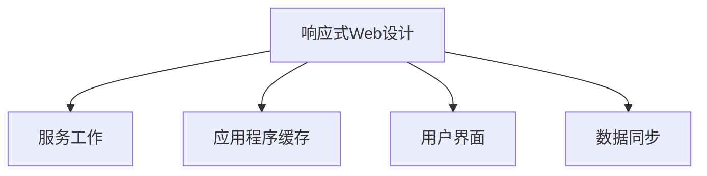

                 

# 渐进式Web应用（PWA）：提供类原生应用体验

> 关键词：渐进式Web应用, PWA, 响应式Web设计, 服务工作, 应用程序缓存, 用户界面, 数据同步

## 1. 背景介绍

### 1.1 问题由来
随着移动智能设备的普及，传统基于网页的应用已难以满足用户对高效、流畅、稳定体验的需求。尽管原生应用可以提供接近于本地应用的性能，但其开发、维护、分发成本高，仅适用于少数应用场景。与此同时，Web技术如HTML5的崛起，推动了响应式Web设计的普及，为实现Web应用和原生应用间的桥梁提供了可能。渐进式Web应用（Progressive Web App, PWA）正是在这种背景下诞生的。

PWA是一种Web应用程序，通过实现Web应用的最新特性，同时兼容旧版Web浏览器，能够提供接近于原生应用的性能和用户体验。PWA采用类似本地应用的机制，例如离线缓存、背景同步、推送通知等，而无需进行应用商店的复杂审核和分发流程。PWA旨在让Web应用具备强大、即时、无缝的用户体验，减少对第三方应用的依赖，降低开发成本，同时降低用户的切换成本。

### 1.2 问题核心关键点
PWA的核心关键点在于如何通过Web技术实现接近于原生应用的用户体验，并利用Web技术的优势，降低开发、维护和分发的成本。关键点包括：

1. **响应式Web设计**：使得Web应用能够自适应不同设备和屏幕尺寸。
2. **服务工作（Service Workers）**：实现离线缓存和后台同步，提升Web应用的响应速度和可靠性。
3. **应用程序缓存（Application Cache）**：通过缓存Web应用的核心资源，减少用户访问时的加载时间。
4. **用户界面（User Interface）**：采用Web技术实现高效、直观、互动的用户界面。
5. **数据同步**：实现Web应用与服务器数据同步，保持数据的实时性。

## 2. 核心概念与联系

### 2.1 核心概念概述

为更好地理解PWA，本节将介绍几个密切相关的核心概念：

- **响应式Web设计（Responsive Web Design）**：指设计出来的Web应用，能够根据用户设备的不同（如PC、平板、手机），自动调整布局、字体大小、图片尺寸等，以适应不同屏幕尺寸。
- **服务工作（Service Workers）**：一种运行在浏览器后台的JavaScript程序，可以拦截网络请求、缓存数据、推送通知等。
- **应用程序缓存（Application Cache）**：在Service Workers的帮助下，Web应用能够缓存静态资源，即使离线也能正常工作。
- **用户界面（User Interface）**：Web应用的界面设计，通过HTML、CSS、JavaScript等技术实现。
- **数据同步（Data Synchronization）**：通过API实现Web应用与服务器数据同步，保证数据的实时更新。

这些核心概念之间的逻辑关系可以通过以下Mermaid流程图来展示：



这个流程图展示了几大核心概念及其之间的关系：

1. **响应式Web设计**：是PWA的基础，使得Web应用适应不同设备和屏幕尺寸。
2. **服务工作**：通过后台缓存和推送通知，提升Web应用性能和用户体验。
3. **应用程序缓存**：在服务工作的帮助下，Web应用能够离线工作。
4. **用户界面**：采用Web技术实现高效、直观的用户界面。
5. **数据同步**：通过API实现数据的实时更新，保证数据的一致性。

## 3. 核心算法原理 & 具体操作步骤

### 3.1 算法原理概述

PWA的实现主要依赖于Web技术栈的最新特性，结合一些标准的Web API和框架。其核心算法原理包括以下几个方面：

1. **响应式布局**：通过媒体查询和弹性布局技术，实现网页自适应不同设备。
2. **服务工作的缓存机制**：Service Workers拦截网络请求，缓存静态资源，并在后续请求时从缓存中读取，减少网络加载时间。
3. **应用程序缓存的更新策略**：Service Workers根据更新策略，动态更新应用程序缓存中的资源。
4. **用户界面的优化**：通过渐进式更新和懒加载技术，提升Web应用的用户界面体验。
5. **数据同步机制**：通过Web Socket、Server-Sent Events等API实现数据实时同步。

### 3.2 算法步骤详解

PWA的实现通常包括以下几个关键步骤：

**Step 1: 准备响应式Web设计**

- 使用HTML5的语义化标签，如<header>, <footer>, <nav>等，构建良好的网页结构。
- 应用CSS3的弹性布局和媒体查询，实现网页自适应不同设备。
- 引入现代Web字体，如Google Fonts，提升字体显示质量。

**Step 2: 实现Service Workers**

- 编写Service Worker脚本，拦截网络请求，缓存静态资源。
- 根据更新策略，动态更新应用程序缓存中的资源。
- 实现推送通知功能，通过推送服务（如Firebase）发送通知。

**Step 3: 采用应用程序缓存**

- 在Service Workers的帮助下，缓存Web应用的核心资源，如HTML、CSS、JS、图片等。
- 设置缓存的更新策略，确保资源最新。
- 实现浏览器与服务器的交互，确保缓存的有效性。

**Step 4: 优化用户界面**

- 采用渐进式更新技术，逐步加载网页内容，减少首次加载时间。
- 应用懒加载技术，对非关键性资源进行延迟加载。
- 通过Web Animations API实现动态效果，提升用户界面体验。

**Step 5: 实现数据同步**

- 使用Web Socket实现双向通信，实时推送数据更新。
- 应用Server-Sent Events，接收服务器推送的数据更新。
- 实现数据存储机制，如IndexedDB，保存本地数据。

### 3.3 算法优缺点

PWA相较于原生应用有以下优点：

1. **开发成本低**：基于Web技术，不需要进行应用商店的复杂审核和分发流程。
2. **性能高**：通过缓存和预加载技术，Web应用可以在离线状态下正常工作。
3. **用户体验好**：响应式设计和动态加载技术，提升用户界面和操作体验。
4. **兼容性广**：兼容旧版Web浏览器，同时支持最新Web技术。

但PWA也存在一些缺点：

1. **开发复杂性高**：涉及Web开发、Service Workers、缓存管理等多个方面，开发难度较大。
2. **兼容性问题**：旧版Web浏览器可能不支持最新的Web技术，影响用户体验。
3. **安全风险**：Service Workers和应用程序缓存可能被恶意利用，带来安全风险。

### 3.4 算法应用领域

PWA的应用领域十分广泛，已广泛应用于多个行业：

- **社交媒体**：如Facebook、Instagram等，通过PWA实现高效的用户界面和实时数据同步。
- **电子商务**：如Shopify、eBay等，提供快速的加载时间和良好的用户体验。
- **新闻媒体**：如The New York Times、BBC等，通过PWA提供优质的新闻阅读体验。
- **旅游服务**：如Booking.com、Airbnb等，通过PWA实现高效的预订和管理。
- **在线教育**：如Coursera、Khan Academy等，通过PWA提供互动的学习体验。

## 4. 数学模型和公式 & 详细讲解 & 举例说明

### 4.1 数学模型构建

PWA的实现涉及多个Web API和标准，如Service Workers、Web Workers、Web Animations等。本节将通过数学模型来描述PWA的核心原理。

- **响应式布局**：通过CSS3的弹性布局和媒体查询，实现网页自适应不同设备。
- **服务工作的缓存机制**：Service Workers拦截网络请求，缓存静态资源。
- **应用程序缓存的更新策略**：Service Workers根据更新策略，动态更新应用程序缓存中的资源。
- **用户界面的优化**：通过渐进式更新和懒加载技术，提升Web应用的用户界面体验。
- **数据同步机制**：通过Web Socket、Server-Sent Events等API实现数据实时同步。

### 4.2 公式推导过程

以下我们以Web Socket为例，推导数据同步的数学模型。

假设客户端和服务器通过Web Socket进行双向通信，设 $n$ 为数据包数量，$v$ 为数据包大小。则每次数据传输的带宽开销为：

$$
C = n \times v \times \frac{1}{R}
$$

其中 $R$ 为传输速率，单位为字节/秒。

在PWA中，可以通过以下步骤最小化带宽开销：

1. **减少数据包数量**：通过服务器推送机制，在数据更新时仅推送增量数据，避免重复传输。
2. **增加传输速率**：使用Web Socket，提升数据传输速率，减少延迟。

### 4.3 案例分析与讲解

考虑一个新闻应用的PWA实现：

1. **响应式布局**：通过CSS3的弹性布局和媒体查询，实现网页自适应不同设备。
2. **服务工作的缓存机制**：Service Workers拦截网络请求，缓存静态资源。
3. **应用程序缓存的更新策略**：Service Workers根据更新策略，动态更新应用程序缓存中的资源。
4. **用户界面的优化**：通过渐进式更新和懒加载技术，提升Web应用的用户界面体验。
5. **数据同步机制**：通过Web Socket实现双向通信，实时推送数据更新。

## 5. 项目实践：代码实例和详细解释说明

### 5.1 开发环境搭建

在进行PWA开发前，我们需要准备好开发环境。以下是使用WebStorm进行PWA开发的环境配置流程：

1. 安装WebStorm：从官网下载并安装WebStorm，用于编写和管理Web代码。
2. 配置npm：在项目目录下执行 `npm init` 初始化项目，并安装依赖库如React、Redux等。
3. 配置Webpack：在项目目录下执行 `npm install webpack webpack-cli` 安装Webpack，并配置开发环境。
4. 配置Service Workers：在项目目录下创建 `service-worker.js` 文件，实现Service Workers的缓存机制。
5. 配置Web Animations：在项目目录下创建 `styles.css` 文件，定义Web Animations效果。

完成上述步骤后，即可在WebStorm中开始PWA的开发。

### 5.2 源代码详细实现

下面我们以一个简单的PWA应用为例，展示其核心代码实现。

**index.html**

```html
<!DOCTYPE html>
<html lang="en">
<head>
    <meta charset="UTF-8">
    <meta name="viewport" content="width=device-width, initial-scale=1.0">
    <title>PWA Example</title>
    <link rel="icon" href="favicon.ico">
    <link rel="manifest" href="manifest.json">
    <link rel="stylesheet" href="styles.css">
</head>
<body>
    <header>
        <h1>PWA Example</h1>
    </header>
    <main>
        <p>Welcome to our PWA!</p>
    </main>
    <footer>
        <p>&copy; 2023 PWA Example</p>
    </footer>
    <script src="bundle.js"></script>
</body>
</html>
```

**manifest.json**

```json
{
    "name": "PWA Example",
    "short_name": "PWA",
    "start_url": "/",
    "background_color": "#ffffff",
    "theme_color": "#000000",
    "display": "standalone",
    "scope": "/",
    "icons": [
        {
            "src": "icon-192x192.png",
            "type": "image/png",
            "sizes": "192x192"
        },
        {
            "src": "icon-512x512.png",
            "type": "image/png",
            "sizes": "512x512"
        }
    ]
}
```

**styles.css**

```css
body {
    font-family: Arial, sans-serif;
    margin: 0;
    padding: 0;
}

header {
    background-color: #007bff;
    color: #fff;
    padding: 10px;
    text-align: center;
}

main {
    padding: 20px;
}

footer {
    background-color: #007bff;
    color: #fff;
    padding: 10px;
    text-align: center;
}

@keyframes pulse {
    0% {
        opacity: 1;
    }
    50% {
        opacity: 0.5;
    }
    100% {
        opacity: 1;
    }
}

p {
    animation: pulse 1s infinite;
}
```

**service-worker.js**

```javascript
const CACHE_NAME = 'pwa-cache-v1';
const urlsToCache = [
    '/',
    './index.html',
    './styles.css',
    './bundle.js',
    './icon-192x192.png',
    './icon-512x512.png',
];

self.addEventListener('install', (event) => {
    event.waitUntil(
        caches.open(CACHE_NAME)
            .then((cache) => {
                return cache.addAll(urlsToCache);
            })
    );
});

self.addEventListener('fetch', (event) => {
    event.respondWith(
        caches.match(event.request)
            .then((response) => {
                return response || fetch(event.request);
            })
    );
});

self.addEventListener('activate', (event) => {
    const cacheWhitelist = [CACHE_NAME];
    event.waitUntil(
        caches.keys()
            .then((keyList) => {
                return Promise.all(
                    keyList.map((key) => {
                        if (!cacheWhitelist.includes(key)) {
                            return caches.delete(key);
                        }
                    })
                );
            })
    );
});
```

**index.js**

```javascript
import React, { useState } from 'react';
import ReactDOM from 'react-dom';
import { Provider } from 'react-redux';
import { createStore } from 'redux';
import rootReducer from './reducers';
import App from './App';

const store = createStore(rootReducer);

ReactDOM.render(
    <Provider store={store}>
        <App />
    </Provider>,
    document.getElementById('root')
);
```

**App.js**

```javascript
import React, { useEffect } from 'react';
import { useSelector, useDispatch } from 'react-redux';

const App = () => {
    const [counter, setCounter] = useState(0);
    const dispatch = useDispatch();

    useEffect(() => {
        setInterval(() => {
            dispatch({ type: 'INCREMENT' });
        }, 1000);
    }, []);

    const increment = () => {
        setCounter((prev) => prev + 1);
    };

    const decrement = () => {
        setCounter((prev) => prev - 1);
    };

    return (
        <div>
            <h1>Counter: {counter}</h1>
            <button onClick={increment}>Increment</button>
            <button onClick={decrement}>Decrement</button>
        </div>
    );
};

export default App;
```

### 5.3 代码解读与分析

让我们再详细解读一下关键代码的实现细节：

**index.html**

- 定义了网页的基本结构，包括标题、头部、主体、页脚等部分。
- 引入了 favicon 和 manifest.json 文件，以及样式表和脚本文件。

**manifest.json**

- 定义了PWA的元数据，包括应用名称、图标、背景颜色、主题颜色、显示模式等。
- 定义了应用程序的启动路径和范围。

**styles.css**

- 定义了基本的CSS样式，包括字体、颜色、动画等效果。
- 使用了CSS3的弹性布局和动画效果。

**service-worker.js**

- 实现了Service Workers的基本功能，包括安装、缓存和激活。
- 定义了需要缓存的静态资源，以及缓存更新策略。

**index.js**

- 使用Redux管理应用状态。
- 通过Provider将Store传递给React组件。

**App.js**

- 定义了应用的核心逻辑，包括状态管理、事件处理等。
- 使用useSelector和useDispatch进行状态订阅和事件分发。

**index.html**

- 将应用渲染到页面中。

### 5.4 运行结果展示

运行上述代码后，即可在浏览器中查看PWA应用的运行效果。通过点击“Increment”和“Decrement”按钮，可以观察到计数器的动态更新，以及Service Workers缓存的运行效果。

## 6. 实际应用场景

### 6.1 智能设备应用

PWA特别适合在智能设备上运行，能够提供接近于原生应用的性能和用户体验。用户可以在手机和平板上安装PWA应用，并随时随地访问，无需下载和安装复杂的应用程序。

例如，银行可以开发PWA应用，提供手机银行、账户管理、转账等功能。用户通过PWA应用可以方便地进行在线交易和账户查询，而无需下载和安装传统手机银行应用。

### 6.2 新闻和媒体应用

PWA广泛应用于新闻和媒体领域，通过PWA应用，用户可以随时随地获取最新的新闻和信息。例如，BBC、纽约时报等媒体，通过PWA应用提供新闻阅读、视频播报等丰富的内容服务。

### 6.3 电子商务应用

PWA也广泛用于电子商务领域，通过PWA应用，用户可以在线购物、查看商品详情、进行在线支付等。例如，Amazon、Shopify等电商平台，通过PWA应用提供高效的购物体验和便捷的订单管理。

### 6.4 在线教育应用

PWA在在线教育领域也有广泛应用，通过PWA应用，学生可以随时随地进行在线学习、观看视频、参加讨论等。例如，Coursera、Khan Academy等在线教育平台，通过PWA应用提供优质的教育资源和学习体验。

## 7. 工具和资源推荐

### 7.1 学习资源推荐

为了帮助开发者系统掌握PWA的理论基础和实践技巧，这里推荐一些优质的学习资源：

1. **《渐进式Web应用指南》（Progressive Web Apps: Building Web Applications for Engagement and Performance）**：本书由Google Web Master和Web Developer团队编写，系统介绍了PWA的核心概念和实现技巧，是PWA学习的必读书籍。
2. **《Web性能最佳实践》（Web Performance Rocks）**：本书由Google Web Master和Web Developer团队编写，详细介绍了Web性能优化的方法和技巧，是PWA开发的重要参考资料。
3. **《Web应用程序安全指南》（Web Application Security）**：本书由OWASP编写，介绍了Web应用程序的安全漏洞和防护措施，是PWA开发中必不可少的安全知识。
4. **《JavaScript高级程序设计》（JavaScript: The Definitive Guide）**：本书由David Flanagan编写，详细介绍了JavaScript语言的高级特性和编程技巧，是PWA开发的重要参考书籍。

### 7.2 开发工具推荐

PWA开发涉及多个Web技术栈，以下是几款常用的开发工具：

1. **WebStorm**：一款功能强大的IDE，支持Web开发、JavaScript、TypeScript等，是PWA开发的首选工具。
2. **Webpack**：一款现代化的模块打包工具，支持模块化开发、懒加载、代码分割等功能，是PWA开发的核心工具。
3. **Service Worker Generator**：一款在线Service Worker生成工具，方便开发者快速实现缓存机制和推送通知等功能。
4. **Postman**：一款HTTP请求测试工具，方便开发者测试Web Socket和Server-Sent Events等功能。

### 7.3 相关论文推荐

PWA的发展离不开学界的持续研究，以下是几篇奠基性的相关论文，推荐阅读：

1. **《Web应用与原生应用的比较》（Comparing Web Applications with Native Applications）**：该论文对比了Web应用与原生应用的性能和用户体验，探讨了PWA的优势和局限。
2. **《Web应用的双向通信》（Two-Way Communication in Web Applications）**：该论文探讨了Web应用的实时数据同步机制，如Web Socket、Server-Sent Events等。
3. **《Web应用的离线缓存》（Offline Caching in Web Applications）**：该论文介绍了Web应用的缓存机制和服务工作器的实现方法。

## 8. 总结：未来发展趋势与挑战

### 8.1 总结

本文对渐进式Web应用（PWA）进行了全面系统的介绍。首先阐述了PWA的背景和意义，明确了PWA在实现Web应用和原生应用间的桥梁作用。其次，从原理到实践，详细讲解了PWA的数学模型和核心算法，给出了PWA开发的完整代码实例。同时，本文还广泛探讨了PWA在多个行业领域的应用前景，展示了PWA的广泛应用价值。最后，本文精选了PWA的相关学习资源和工具，力求为读者提供全方位的技术指引。

通过本文的系统梳理，可以看到，PWA作为一种新兴的Web技术，正在成为Web应用的重要方向，极大地拓展了Web应用的用户体验和功能。PWA使得Web应用具备了接近于原生应用的性能和用户体验，同时降低了开发、维护和分发的成本，成为Web开发的重要趋势。未来，伴随Web技术栈的不断成熟，PWA必将在更广阔的领域得到应用，带来全新的Web应用体验。

### 8.2 未来发展趋势

展望未来，PWA的发展趋势将呈现以下几个方面：

1. **性能提升**：随着Web技术栈的不断成熟，PWA的性能将进一步提升，实现更快的加载时间和更流畅的用户体验。
2. **功能丰富**：PWA将支持更多Web API和标准，如Web Bluetooth、Web Payment等，拓展PWA的应用场景。
3. **用户界面优化**：通过Web Animations、Web Components等技术，提升PWA的用户界面和互动体验。
4. **跨平台支持**：PWA将支持更多设备和平台，实现跨平台的应用场景。
5. **安全性增强**：通过HTTPS、Content Security Policy等安全机制，提升PWA的安全性。

### 8.3 面临的挑战

尽管PWA已经取得了不小的成功，但在发展过程中也面临诸多挑战：

1. **兼容性问题**：旧版Web浏览器可能不支持最新的Web技术，影响用户体验。
2. **安全风险**：Service Workers和应用程序缓存可能被恶意利用，带来安全风险。
3. **开发复杂性**：涉及Web开发、Service Workers、缓存管理等多个方面，开发难度较大。
4. **用户教育**：用户对PWA的认知度和接受度有待提高，需要更多的宣传和教育。

### 8.4 研究展望

未来的研究需要在以下几个方面寻求新的突破：

1. **兼容性和性能优化**：开发兼容不同设备和平台的PWA应用，同时优化性能，提升用户体验。
2. **安全性和隐私保护**：研究如何保障PWA应用的安全性和用户隐私，避免安全漏洞和数据泄露。
3. **跨平台和跨设备支持**：研究如何实现跨平台和跨设备的PWA应用，拓展PWA的适用范围。
4. **用户界面和互动体验**：通过Web Animations、Web Components等技术，提升PWA的用户界面和互动体验。
5. **生态系统和工具链**：研究如何构建完善的PWA生态系统和工具链，提升PWA的开发效率和用户体验。

总之，PWA作为一种新兴的Web技术，具有广阔的应用前景和发展潜力。只有在技术、工具、生态等各个方面持续创新，才能推动PWA技术的进一步发展，带来更丰富、更高效、更安全的Web应用体验。

## 9. 附录：常见问题与解答

**Q1：PWA的性能如何？**

A: PWA通过离线缓存、Service Workers等机制，可以显著提升Web应用的性能。PWA应用在离线状态下仍能正常工作，减少了网络加载时间，提升了用户体验。

**Q2：PWA如何实现用户界面？**

A: PWA通过HTML、CSS、JavaScript等Web技术实现用户界面。采用响应式设计和渐进式更新技术，提升用户界面的互动性和加载速度。

**Q3：PWA的安全性如何保障？**

A: PWA的安全性主要依赖于HTTPS、Content Security Policy等机制。开发者应遵循最佳实践，如使用HTTPS、限制API访问等，保障PWA应用的安全性。

**Q4：如何构建PWA的生态系统和工具链？**

A: PWA的生态系统和工具链需要不断完善。开发者可以使用一些在线工具如Service Worker Generator，加速Service Workers的开发。同时，开发者可以关注一些PWA相关的开源项目和社区，获取更多资源和支持。

**Q5：PWA的应用场景有哪些？**

A: PWA的应用场景十分广泛，包括智能设备应用、新闻和媒体应用、电子商务应用、在线教育应用等。开发者可以根据具体需求，选择合适的场景进行开发。

---

作者：禅与计算机程序设计艺术 / Zen and the Art of Computer Programming

