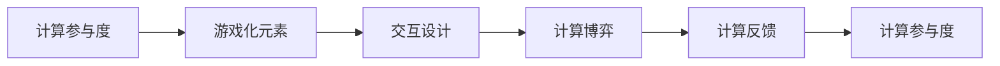

                 

# 游戏化体验：让参与人类计算充满乐趣

## 1. 背景介绍

在当前数字化时代，数据计算与处理已成为各类行业的重要基础设施，而传统计算范式往往需要人类作为计算的参与者，其参与度直接影响到计算的效率和准确性。为此，本文将探讨如何通过游戏化方式，提升人类在计算中的参与感和积极性，从而让参与人类计算更加有趣、高效。

### 1.1 问题由来

随着AI和大数据技术的不断发展，海量数据需要被高效地分析和处理。虽然自动化的机器学习算法可以处理大部分计算任务，但某些复杂或非结构化数据的计算仍需人类参与。然而，人类在参与计算过程中容易感到枯燥乏味，导致效率低下，甚至出现错误。为了提升计算参与度，研究者们提出了将游戏化元素引入计算过程的策略，通过趣味性和挑战性激发人类参与计算的热情。

### 1.2 问题核心关键点

游戏化计算的主要目标包括：
1. **增强参与感**：通过设计有趣的任务和挑战，让计算任务更具吸引力，减少人类对计算的抵触情绪。
2. **提升效率**：将游戏机制如目标导向、奖励机制、即时反馈等融入计算过程中，提升人类计算的积极性和效率。
3. **增加安全性**：利用游戏化机制检测和修正计算中的错误，提高计算的准确性和可靠性。

本文将从核心概念、算法原理、具体操作步骤等多个维度，探讨游戏化计算的实现方法和应用场景。

## 2. 核心概念与联系

### 2.1 核心概念概述

为更好地理解游戏化计算方法，本节将介绍几个密切相关的核心概念：

- **计算参与度**：指人类在计算过程中积极参与的程度，直接影响计算任务的效率和准确性。
- **游戏化元素**：包括目标导向、奖励机制、即时反馈、竞争和合作等，用于提升人类参与计算的动机。
- **交互设计**：通过界面和交互方式的设计，优化人类与计算机的互动体验，提升计算参与度。
- **计算博弈**：将计算任务转化为博弈形式，通过竞争和合作激发计算参与的积极性和创造性。
- **计算反馈**：即即时反馈机制，用于告知人类计算任务的状态和结果，帮助其调整策略和动作。

这些概念通过游戏化机制相互作用，最终提升人类计算的参与度，减少计算错误，提升计算效率。

### 2.2 核心概念原理和架构的 Mermaid 流程图



该流程图展示了游戏化计算中各概念之间的联系：通过设计有趣的游戏化元素和交互设计，将计算任务转化为具有竞争和合作的计算博弈。在此过程中，利用即时反馈机制不断调整计算参与策略，最终提升计算参与度和效率。

## 3. 核心算法原理 & 具体操作步骤

### 3.1 算法原理概述

游戏化计算的核心算法原理在于将计算任务转化为一个游戏过程，通过游戏化的目标、奖励、反馈等机制，提升人类参与计算的积极性和效率。以下是该范式的核心算法：

1. **目标导向**：为计算任务设定明确的目标，如寻找特定数据、完成数据分类等，以驱动人类进行计算。
2. **奖励机制**：通过即时奖励（如分数、虚拟货币等），激励人类积极参与计算。
3. **即时反馈**：实时告知人类计算任务的状态和结果，帮助其快速调整策略。
4. **竞争与合作**：利用竞争和合作机制，激发人类的竞争意识和团队协作精神。
5. **多维度奖励**：除物质奖励外，还可以通过成就感和荣誉感等心理奖励，提升计算参与度。

### 3.2 算法步骤详解

基于上述算法原理，以下是实现游戏化计算的具体操作步骤：

**Step 1: 任务设计**
- 设计具有挑战性和趣味性的计算任务，如数据分类、模式识别、目标检测等。
- 确保任务目标明确且可实现，避免过于简单或复杂，影响人类参与度。

**Step 2: 游戏化元素配置**
- 设定合理的奖励机制，如积分、虚拟货币等，用于激励人类积极参与计算。
- 引入即时反馈机制，及时告知人类计算结果和任务进度，帮助其调整策略。

**Step 3: 交互设计**
- 优化界面和交互方式，提升人类与计算机的互动体验。
- 设计直观易用的操作界面，减少人类计算的认知负担。

**Step 4: 执行计算过程**
- 利用计算机自动化执行大部分计算任务，仅保留需要人类参与的关键步骤。
- 在关键步骤上，通过游戏化元素和即时反馈机制，提升人类参与的积极性。

**Step 5: 分析反馈和优化**
- 收集人类参与过程中的反馈信息，评估计算参与度和效果。
- 根据反馈信息不断优化任务设计、奖励机制和交互设计，提升整体计算体验。

### 3.3 算法优缺点

游戏化计算方法具有以下优点：
1. **提升参与度**：通过游戏化元素和即时反馈机制，显著提升人类参与计算的积极性。
2. **提高效率**：合理的游戏化设计可以加速计算过程，减少人类计算的时间成本。
3. **增强学习效果**：游戏化机制可以帮助人类快速学习和掌握计算技能。

但该方法也存在一定的局限性：
1. **复杂性较高**：设计和实现具有吸引力的游戏化元素和交互界面较为复杂，需要较多时间和资源。
2. **用户体验差异**：不同用户对游戏化元素的接受程度不同，可能需要针对不同用户群体进行个性化设计。
3. **潜在抵触情绪**：某些用户可能对游戏化元素有抵触情绪，反而影响计算参与度。

尽管如此，通过合理设计和实施，游戏化计算方法可以显著提升计算任务的效率和参与度，具有广泛的应用前景。

### 3.4 算法应用领域

游戏化计算方法在多个领域具有广泛应用，具体如下：

**1. 医疗数据处理**
- **应用场景**：医疗领域的海量数据需要进行分类和处理，如电子病历、医疗影像等。
- **实现方式**：通过设计有趣的游戏任务，如寻找特定疾病、识别异常影像等，激励医生积极参与计算。

**2. 金融数据分析**
- **应用场景**：金融机构需要处理和分析大量的金融数据，进行风险评估、市场分析等。
- **实现方式**：通过设计具有挑战性的游戏任务，如预测股票走势、识别欺诈行为等，激励分析师进行计算。

**3. 工业智能制造**
- **应用场景**：智能制造过程中需要处理大量的生产数据，进行设备监控、故障预测等。
- **实现方式**：通过设计互动性强的计算任务，如识别设备异常、优化生产流程等，提升操作人员的工作积极性。

**4. 智慧城市管理**
- **应用场景**：智慧城市管理需要处理大量的城市数据，进行交通规划、能源管理等。
- **实现方式**：通过设计富有创意的计算任务，如优化交通流量、提高能源利用率等，提升市民和城市管理者的参与度。

## 4. 数学模型和公式 & 详细讲解 & 举例说明

### 4.1 数学模型构建

为更系统地理解和应用游戏化计算方法，本节将构建数学模型，并给出相应的公式推导。

记计算任务的目标函数为 $f(x)$，其中 $x$ 表示计算过程中的状态变量。计算参与者通过操作 $x$，使 $f(x)$ 趋近于最小值。

定义奖励函数 $R(x)$，用于衡量参与者对计算任务的操作效果，通常为 $R(x) = -f(x)$。

定义即时反馈函数 $F(x, t)$，用于实时告知参与者计算任务的状态，通常为 $F(x, t) = f(x)$。

游戏化元素通过调整奖励函数和即时反馈函数，影响参与者的行为决策。

### 4.2 公式推导过程

以一个简单的数据分类任务为例，推导游戏化计算的数学模型。

假设计算任务的目标是分类数据，参与者的目标是最大化分类正确率。任务中的状态变量为分类结果 $x$，奖励函数为 $R(x) = \frac{1}{N} \sum_{i=1}^N \delta(x_i, y_i)$，其中 $y_i$ 表示真实标签，$\delta$ 为误分类损失函数（如交叉熵损失）。

定义即时反馈函数为 $F(x, t) = \frac{1}{N} \sum_{i=1}^N f(x_i, y_i)$，其中 $f(x_i, y_i)$ 为分类误差函数。

通过调整奖励函数和即时反馈函数，激励参与者积极进行数据分类，同时通过即时反馈不断调整分类策略，提高分类准确性。

### 4.3 案例分析与讲解

考虑一个简单的图像识别任务，利用游戏化计算方法进行优化。

假设任务为识别图片中的物体，参与者的目标是最大化识别准确率。任务中的状态变量为识别结果 $x$，奖励函数为 $R(x) = \frac{1}{N} \sum_{i=1}^N \delta(x_i, y_i)$。

定义即时反馈函数为 $F(x, t) = \frac{1}{N} \sum_{i=1}^N f(x_i, y_i)$，其中 $f(x_i, y_i)$ 为识别误差函数。

为了提升参与者的积极性，可以引入以下游戏化元素：
- **积分奖励**：每正确识别一个物体，参与者获得一定积分。
- **即时反馈**：实时告知参与者识别结果，并提供错误提示。
- **竞争排名**：将参与者分为不同等级，依据积分排名进行奖励。
- **任务难度调整**：根据参与者的表现，动态调整任务难度。

通过这些游戏化元素，参与者可以在娱乐中完成复杂的图像识别任务，同时不断提升自己的识别准确率。

## 5. 项目实践：代码实例和详细解释说明

### 5.1 开发环境搭建

在进行游戏化计算项目实践前，需要先搭建好开发环境。以下是使用Python和Pygame库进行游戏化计算开发的详细步骤：

1. 安装Anaconda：从官网下载并安装Anaconda，用于创建独立的Python环境。
2. 创建并激活虚拟环境：
```bash
conda create -n gaming-env python=3.8 
conda activate gaming-env
```
3. 安装Pygame：使用pip命令安装Pygame库，用于游戏图形界面开发。
```bash
pip install pygame
```
4. 安装各类工具包：
```bash
pip install numpy pandas scikit-learn matplotlib tqdm jupyter notebook ipython
```
完成上述步骤后，即可在`gaming-env`环境中开始游戏化计算项目的开发。

### 5.2 源代码详细实现

接下来，以一个简单的数据分类任务为例，给出使用Pygame库实现游戏化计算的代码实现。

```python
import pygame
import numpy as np

class DataClassifier:
    def __init__(self, data, labels):
        self.data = data
        self.labels = labels
        self.dimensions = data.shape[1]
        self.classifier = None
        self.score = 0
        self.update_dataset()

    def update_dataset(self, batch_size=64):
        self.classifier = np.random.randn(self.dimensions, 3)
        self.learning_rate = 0.01
        self.epoch = 0
        self.history = []

    def train(self, iterations=100):
        for _ in range(iterations):
            batch = np.random.choice(len(self.data), batch_size)
            inputs, targets = self.data[batch], self.labels[batch]
            predictions = self.predict(inputs)
            loss = np.mean((predictions - targets) ** 2)
            self.classifier -= self.learning_rate * np.dot(inputs.T, (predictions - targets))
            self.score += 1

    def predict(self, inputs):
        return np.dot(inputs, self.classifier)

    def display(self):
        pygame.init()
        screen = pygame.display.set_mode((800, 600))
        font = pygame.font.Font(None, 36)
        clock = pygame.time.Clock()
        running = True
        while running:
            for event in pygame.event.get():
                if event.type == pygame.QUIT:
                    running = False
            screen.fill((0, 0, 0))
            screen.blit(font.render(f"Score: {self.score}", True, (255, 255, 255)), (50, 50))
            pygame.display.flip()
            clock.tick(60)
        pygame.quit()

if __name__ == "__main__":
    # 数据集示例
    data = np.random.randn(100, 3)
    labels = np.random.randint(0, 2, 100)

    classifier = DataClassifier(data, labels)
    classifier.train(iterations=100)
    classifier.display()
```

### 5.3 代码解读与分析

上述代码实现了一个简单的数据分类任务，并使用了游戏化的界面设计，供用户通过鼠标操作进行数据分类。

**DataClassifier类**：
- `__init__`方法：初始化数据集、标签等参数。
- `update_dataset`方法：设定随机初始权重和超参数。
- `train`方法：在每个epoch内进行数据分类训练，更新权重。
- `predict`方法：通过预测模型计算分类结果。
- `display`方法：创建游戏界面，实时显示分数和状态。

**训练流程**：
- 使用随机初始化的权重进行数据分类训练。
- 通过游戏化界面实时展示分数和状态。
- 在训练完成后，展示最终分类结果。

通过这种方式，用户可以在游戏化的界面下进行数据分类训练，从而提升参与度，并在娱乐中完成数据处理任务。

## 6. 实际应用场景

### 6.1 医疗数据处理

在医疗领域，游戏化计算方法可以用于提高医生的数据处理效率和准确性。例如，在电子病历分类任务中，医生可以通过参与游戏化的分类任务，提升对病历的分类速度和准确性。

**应用场景**：医院需要处理大量的电子病历数据，进行分类、标注和分析。
**实现方式**：设计有趣的游戏任务，如快速识别疾病、分类症状等，激励医生积极参与。

### 6.2 金融数据分析

金融行业需要处理大量的金融数据，进行市场分析、风险评估等。通过游戏化计算方法，可以提升分析师的工作效率和准确性。

**应用场景**：金融机构需要处理大量的金融数据，进行股票走势预测、欺诈检测等。
**实现方式**：通过设计挑战性的游戏任务，如预测股票走势、识别异常交易等，激励分析师进行数据处理。

### 6.3 工业智能制造

在智能制造过程中，需要处理大量的生产数据，进行设备监控、故障预测等。游戏化计算方法可以提高操作人员的工作积极性和效率。

**应用场景**：智能制造工厂需要处理大量的生产数据，进行设备监控、故障预测等。
**实现方式**：通过设计互动性强的计算任务，如识别设备异常、优化生产流程等，提升操作人员的工作积极性。

### 6.4 智慧城市管理

智慧城市管理需要处理大量的城市数据，进行交通规划、能源管理等。通过游戏化计算方法，可以提高市民和城市管理者的参与度。

**应用场景**：智慧城市管理需要处理大量的城市数据，进行交通规划、能源管理等。
**实现方式**：通过设计富有创意的计算任务，如优化交通流量、提高能源利用率等，提升市民和城市管理者的参与度。

## 7. 工具和资源推荐

### 7.1 学习资源推荐

为了帮助开发者系统掌握游戏化计算的理论基础和实践技巧，以下是一些推荐的学习资源：

1. **《游戏设计基础》**：由游戏设计专家撰写，涵盖游戏设计的核心概念和设计原则，是游戏化计算学习的必备资源。
2. **《计算心理学》**：介绍心理学的基本理论和实验方法，帮助理解人类在计算任务中的行为模式。
3. **《机器学习游戏》**：结合机器学习和游戏设计，提供丰富的案例和实践指导，帮助理解游戏化计算的实现方法。
4. **《参与式设计》**：探讨如何通过用户参与设计，提升产品的用户体验，是游戏化计算设计的理论基础。
5. **HuggingFace官方文档**：提供丰富的预训练模型和游戏化计算案例，是游戏化计算实践的良好参考。

通过这些资源的学习，可以系统掌握游戏化计算的理论和实践技能，更好地应用于实际项目中。

### 7.2 开发工具推荐

游戏化计算开发通常涉及图形界面设计和用户交互优化，以下是一些常用的开发工具：

1. **Pygame**：Python的图形界面开发库，提供丰富的图形和音效支持，适用于游戏化计算项目。
2. **Unity**：跨平台的游戏引擎，支持3D图形和实时动画，适合开发复杂的游戏化计算应用。
3. **Unreal Engine**：功能强大的游戏引擎，支持高清图形和物理模拟，适合开发高交互性的游戏化计算系统。
4. **Blender**：免费的3D图形编辑器，支持多种文件格式和插件，适合游戏界面和模型设计。
5. **Photoshop**：专业的图像处理软件，适用于游戏界面设计和UI元素设计。

合理利用这些工具，可以显著提升游戏化计算项目的开发效率和体验质量。

### 7.3 相关论文推荐

游戏化计算方法的发展源于学术界的持续研究。以下是几篇奠基性的相关论文，推荐阅读：

1. **《计算游戏化》**：探讨如何将游戏化元素融入计算任务，提升人类计算的积极性和效率。
2. **《游戏化学习》**：研究通过游戏化学习方式，提升人类对复杂计算任务的掌握。
3. **《计算博弈》**：将计算任务转化为博弈形式，研究如何通过竞争和合作激发人类计算参与度。
4. **《计算反馈》**：探讨即时反馈机制在计算任务中的应用，提升人类计算的及时性和准确性。
5. **《计算心理模型》**：研究人类在计算任务中的心理和行为特征，帮助设计更加高效的游戏化计算系统。

这些论文代表了大规模计算任务的理论研究进展，为游戏化计算的实践提供了理论指导。

## 8. 总结：未来发展趋势与挑战

### 8.1 研究成果总结

本文对游戏化计算方法进行了全面系统的介绍。首先阐述了游戏化计算的背景和目标，明确了游戏化计算在提升人类计算参与度和效率方面的独特价值。其次，从核心概念、算法原理、具体操作步骤等多个维度，详细讲解了游戏化计算的实现方法和应用场景。通过案例分析和代码实例，展示了游戏化计算在实际项目中的应用效果。

通过本文的系统梳理，可以看到，游戏化计算方法通过引入游戏化元素和即时反馈机制，显著提升了人类在计算任务中的积极性和效率，具有广泛的应用前景。游戏化计算的发展方向包括：

- **提升参与度**：通过设计更具吸引力的游戏化元素和即时反馈机制，进一步提升人类计算的参与度。
- **优化用户体验**：通过优化界面设计和交互方式，提升人类与计算机的互动体验，减少认知负担。
- **增强学习效果**：通过合理的游戏化设计，帮助人类快速学习和掌握计算技能。

### 8.2 未来发展趋势

展望未来，游戏化计算技术将呈现以下几个发展趋势：

1. **个性化设计**：针对不同用户群体设计个性化的游戏化元素，提升用户参与度和满意度。
2. **多渠道融合**：将游戏化计算方法与其他技术（如AR、VR）结合，拓展游戏化计算的应用场景。
3. **自动化优化**：通过机器学习优化游戏化元素的设计和选择，提升整体计算体验。
4. **跨领域应用**：将游戏化计算方法应用于更多领域，如教育、娱乐、健康等，拓展游戏化计算的应用范围。
5. **社交互动**：通过多人协作和竞争机制，增强游戏化计算的社会互动性，提升整体体验。

### 8.3 面临的挑战

尽管游戏化计算方法已经取得了一定的成效，但在迈向更加智能化、普适化应用的过程中，仍面临诸多挑战：

1. **用户体验差异**：不同用户对游戏化元素的接受程度不同，需要针对不同用户群体进行个性化设计。
2. **数据隐私问题**：在游戏化计算过程中，需要处理大量的用户数据，如何保护用户隐私成为一个重要问题。
3. **公平性问题**：游戏化机制可能导致数据和资源的不公平分配，需要设计合理的奖励和反馈机制，确保公平性。
4. **算法复杂性**：设计复杂的游戏化元素和交互界面，增加了开发和实现的复杂性。
5. **安全性和可靠性**：游戏化计算过程中，如何确保计算的准确性和可靠性，避免由于游戏化机制导致的错误。

尽管如此，通过合理设计和实施，游戏化计算方法可以显著提升人类计算的参与度和效率，具有广泛的应用前景。

### 8.4 研究展望

面对游戏化计算面临的挑战，未来的研究需要在以下几个方面寻求新的突破：

1. **跨学科融合**：将计算、心理学、设计等多个学科的理论和方法进行融合，提升游戏化计算设计的科学性和合理性。
2. **多目标优化**：设计多目标优化游戏化元素，提升用户体验的同时，确保计算的准确性和可靠性。
3. **大数据分析**：利用大数据分析方法，优化游戏化元素的参数选择和设计。
4. **安全性和可靠性研究**：研究如何在游戏化计算过程中确保计算的准确性和可靠性，减少潜在错误。
5. **社交互动研究**：研究如何通过社交互动提升游戏化计算的参与度和创造性。

通过这些研究方向的探索，游戏化计算方法必将在提升人类计算参与度和效率方面发挥更大的作用，推动计算技术的广泛应用和发展。

## 9. 附录：常见问题与解答

**Q1: 游戏化计算在实际应用中有哪些挑战？**

A: 游戏化计算在实际应用中面临以下挑战：
1. **用户体验差异**：不同用户对游戏化元素的接受程度不同，需要针对不同用户群体进行个性化设计。
2. **数据隐私问题**：在游戏化计算过程中，需要处理大量的用户数据，如何保护用户隐私成为一个重要问题。
3. **公平性问题**：游戏化机制可能导致数据和资源的不公平分配，需要设计合理的奖励和反馈机制，确保公平性。
4. **算法复杂性**：设计复杂的游戏化元素和交互界面，增加了开发和实现的复杂性。
5. **安全性和可靠性**：游戏化计算过程中，如何确保计算的准确性和可靠性，避免由于游戏化机制导致的错误。

**Q2: 如何提升游戏化计算的用户参与度？**

A: 提升游戏化计算的用户参与度需要综合考虑多个因素：
1. **设计吸引人的游戏元素**：通过设计具有挑战性和趣味性的游戏任务，吸引用户积极参与。
2. **提供即时反馈**：实时告知用户计算任务的状态和结果，帮助其调整策略和动作。
3. **引入竞争和合作机制**：利用竞争和合作机制，激发用户的竞争意识和团队协作精神。
4. **设计奖励机制**：通过积分、虚拟货币等奖励机制，激励用户积极参与计算。
5. **优化用户体验**：通过界面设计和交互方式，提升用户与计算机的互动体验，减少认知负担。

**Q3: 游戏化计算适用于哪些类型的任务？**

A: 游戏化计算适用于以下类型的任务：
1. **数据分类和标注**：如文本分类、图像识别等。
2. **模式识别**：如行为分析、信号检测等。
3. **复杂计算**：如优化问题、组合问题等。
4. **模拟和仿真**：如虚拟现实、动态系统模拟等。

**Q4: 游戏化计算的开发流程是怎样的？**

A: 游戏化计算的开发流程包括以下几个步骤：
1. **需求分析**：明确计算任务的目标和需求。
2. **游戏化设计**：设计有趣的游戏化元素和即时反馈机制。
3. **开发实现**：利用游戏引擎和图形库，实现游戏化计算界面。
4. **测试和优化**：测试游戏化计算系统的性能和用户体验，进行优化调整。
5. **部署和应用**：将游戏化计算系统部署到实际环境中，进行测试和应用。

通过以上步骤，可以实现高效、互动性强的游戏化计算系统，提升人类计算的参与度和效率。

---

作者：禅与计算机程序设计艺术 / Zen and the Art of Computer Programming

