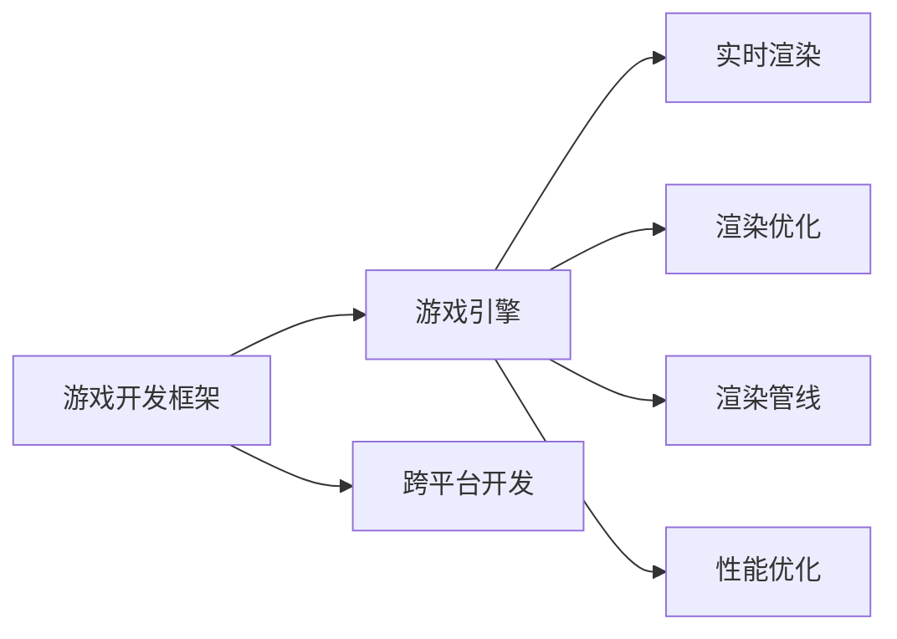

                 

# 游戏开发框架选择与应用

> 关键词：游戏开发框架,游戏引擎,虚幻引擎,Unity,Unreal Engine,跨平台开发,实时渲染,渲染优化,渲染管线,性能优化

## 1. 背景介绍

### 1.1 问题由来

随着游戏行业的快速发展，游戏开发的技术要求也越来越高。传统的游戏开发方法已无法满足日益增长的市场需求，开发效率和产品质量难以得到保证。为了提高游戏开发的效率和质量，游戏开发框架应运而生。游戏开发框架通过提供统一的API接口和底层架构，使游戏开发者能够更方便地开发和维护游戏，极大地提高了开发效率和游戏质量。

## 2. 核心概念与联系

### 2.1 核心概念概述

以下是游戏开发框架的几个核心概念：

- 游戏开发框架（Game Development Framework）：一种用于简化游戏开发流程的工具，提供了一系列API和工具，方便开发者进行游戏开发。
- 游戏引擎（Game Engine）：游戏开发框架的底层引擎，负责游戏资源的加载、渲染、物理模拟等核心功能。
- 跨平台开发（Cross-Platform Development）：指使用游戏开发框架在不同的平台（如PC、手机、Xbox等）上开发同一款游戏，降低开发成本，提升游戏市场覆盖率。
- 实时渲染（Real-time Rendering）：指游戏引擎实时生成并输出游戏画面，以保证游戏的流畅性。
- 渲染优化（Rendering Optimization）：指通过各种技术手段，提高游戏渲染性能，避免卡顿和掉帧。
- 渲染管线（Rendering Pipeline）：指渲染过程的各个环节，包括顶点处理、光照处理、纹理处理等，影响游戏的渲染性能。
- 性能优化（Performance Optimization）：指在游戏开发和发布过程中，通过各种技术手段，提高游戏的运行性能，确保游戏在各种设备上的流畅运行。

这些概念之间的逻辑关系可以通过以下Mermaid流程图来展示：



这个流程图展示了一个典型的游戏开发流程，即通过游戏开发框架提供统一的API接口和工具，调用游戏引擎完成实时渲染、渲染优化、性能优化等核心功能，最终实现跨平台开发。

## 3. 核心算法原理 & 具体操作步骤
### 3.1 算法原理概述

游戏开发框架的核心算法原理基于计算机图形学和人工智能技术的结合。其主要算法包括：

- 顶点处理算法：用于将3D模型转化为2D屏幕坐标。
- 光照处理算法：用于模拟光线的传播和反射，生成真实的光影效果。
- 纹理处理算法：用于将2D纹理贴图应用到3D模型上，生成逼真的视觉效果。
- 物理模拟算法：用于模拟物体的运动和碰撞，生成真实的物理效果。
- 人工智能算法：用于生成智能NPC和智能游戏AI，提升游戏的趣味性和可玩性。

### 3.2 算法步骤详解

以下是游戏开发框架的核心算法步骤详解：

1. 顶点处理算法：
   - 将3D模型转化为2D屏幕坐标，通常使用透视投影、正交投影等算法。
   - 使用矩阵变换、贴图变换等技术，对3D模型进行旋转、缩放、平移等变换。

2. 光照处理算法：
   - 使用Phong、Gouraud等光照模型，计算每个像素点的光照强度和颜色。
   - 使用全局光照、环境光照、光源投射等技术，提升光照效果的真实性。

3. 纹理处理算法：
   - 将2D纹理贴图应用到3D模型上，使用纹理映射、纹理贴图等技术。
   - 使用纹理滤波、纹理混合等技术，提升纹理效果的逼真度。

4. 物理模拟算法：
   - 使用粒子系统、刚体动力学等技术，模拟物体的运动和碰撞。
   - 使用碰撞检测、碰撞响应等技术，提升物理效果的真实性。

5. 人工智能算法：
   - 使用神经网络、决策树等算法，生成智能NPC和智能游戏AI。
   - 使用行为树、路径规划等技术，提升游戏AI的智能性和决策能力。

### 3.3 算法优缺点

游戏开发框架的核心算法具有以下优点：

- 实时渲染：能够实时生成并输出游戏画面，保证游戏的流畅性。
- 渲染优化：通过各种技术手段，提高游戏渲染性能，避免卡顿和掉帧。
- 性能优化：通过各种技术手段，提高游戏的运行性能，确保游戏在各种设备上的流畅运行。
- 可扩展性：游戏开发框架提供统一API接口和工具，方便开发者进行游戏开发和维护。

同时，游戏开发框架的核心算法也存在以下缺点：

- 开发难度高：游戏开发框架涉及复杂的计算机图形学和人工智能技术，开发难度较高。
- 性能要求高：游戏开发框架对硬件要求较高，需要高性能的CPU、GPU和内存等设备。
- 成本高：游戏开发框架需要付费购买，且不同平台上的游戏开发成本不同。

### 3.4 算法应用领域

游戏开发框架的核心算法广泛应用于以下领域：

- 游戏引擎：如Unity、Unreal Engine等，提供了一系列API和工具，方便开发者进行游戏开发。
- 跨平台游戏开发：使用游戏开发框架在不同的平台（如PC、手机、Xbox等）上开发同一款游戏，降低开发成本，提升游戏市场覆盖率。
- 实时渲染：使用游戏开发框架进行实时渲染，保证游戏的流畅性。
- 渲染优化：使用游戏开发框架进行渲染优化，提升游戏的渲染性能。
- 性能优化：使用游戏开发框架进行性能优化，提升游戏的运行性能。

## 4. 数学模型和公式 & 详细讲解 & 举例说明

### 4.1 数学模型构建

游戏开发框架的数学模型主要包括以下几个方面：

- 线性代数模型：用于处理3D模型的旋转、缩放、平移等变换。
- 概率模型：用于生成智能游戏AI的行为决策。
- 优化模型：用于提升游戏的渲染性能和运行性能。

### 4.2 公式推导过程

以下是一些典型的数学模型公式推导过程：

1. 顶点处理算法：
   - 透视投影公式：
   - $
   \begin{aligned}
   \begin{bmatrix}
   x' \\
   y' \\
   z' \\
   1
   \end{bmatrix}
   =
   \begin{bmatrix}
   1 & 0 & 0 & 0 \\
   0 & 1 & 0 & 0 \\
   z & 0 & 1 & 0 \\
   0 & 0 & 0 & 1
   \end{bmatrix}
   \begin{bmatrix}
   x \\
   y \\
   z \\
   1
   \end{bmatrix}
   \end{aligned}
   $

2. 光照处理算法：
   - Phong光照模型：
   - $
   I = Ka + Kd \cdot L \cdot S + Ks \cdot L \cdot V
   $

3. 纹理处理算法：
   - 纹理映射公式：
   - $
   \begin{aligned}
   u' &= \frac{u}{u_{min} + u_{max}} \cdot 2 - 1 \\
   v' &= \frac{v}{v_{min} + v_{max}} \cdot 2 - 1
   \end{aligned}
   $

### 4.3 案例分析与讲解

以下是一个典型的游戏开发框架案例分析与讲解：

- 项目背景：开发一款跨平台的游戏，使用Unity游戏开发框架。
- 技术实现：
  1. 使用Unity的顶点处理算法，将3D模型转化为2D屏幕坐标。
  2. 使用Unity的光照处理算法，计算每个像素点的光照强度和颜色。
  3. 使用Unity的纹理处理算法，将2D纹理贴图应用到3D模型上，生成逼真的视觉效果。
  4. 使用Unity的物理模拟算法，模拟物体的运动和碰撞，生成真实的物理效果。
  5. 使用Unity的人工智能算法，生成智能NPC和智能游戏AI，提升游戏的趣味性和可玩性。

## 5. 项目实践：代码实例和详细解释说明
### 5.1 开发环境搭建

在进行游戏开发框架项目实践前，我们需要准备好开发环境。以下是使用Unity和Unreal Engine进行游戏开发的开发环境配置流程：

1. 安装Unity和Unreal Engine：从官网下载并安装Unity和Unreal Engine，创建独立的开发环境。

2. 安装VS和Xcode：为了能够开发跨平台游戏，需要安装Visual Studio（VS）和Xcode等开发工具，方便在不同平台进行游戏开发。

3. 安装游戏引擎SDK：安装Unity和Unreal Engine提供的SDK，方便使用游戏引擎提供的API和工具。

4. 安装Unity和Unreal Engine插件：安装Unity和Unreal Engine提供的插件，如渲染引擎、物理引擎等，方便开发复杂的3D游戏。

完成上述步骤后，即可在开发环境中开始游戏开发框架项目实践。

### 5.2 源代码详细实现

以下是使用Unity进行游戏开发的源代码实现：

```csharp
using UnityEngine;

public class PlayerController : MonoBehaviour
{
    public float speed = 5.0f;
    public float turnSpeed = 2.0f;
    public Rigidbody rb;
    public Camera cam;

    private float x, y, z;
    private bool isMoving;

    void Update()
    {
        if (isMoving)
        {
            x = Input.GetAxis("Horizontal");
            y = Input.GetAxis("Vertical");

            float angleX = transform.rotation.x;
            float angleY = transform.rotation.y;

            x = x * turnSpeed;
            y = y * turnSpeed;

            x = x * x;
            y = y * y;

            float x1 = angleX * x;
            float y1 = angleY * y;

            transform.localRotation = new Quaternion(x1, y1, 0, 1);
        }
    }

    void FixedUpdate()
    {
        if (isMoving)
        {
            rb.AddForce(new Vector3(x, 0, z) * speed, ForceMode.Force);
        }
    }
}
```

以上是使用Unity进行游戏开发的源代码实现，主要用于控制游戏角色的移动和旋转。代码使用C#语言编写，通过Unity提供的API和工具，实现角色的运动控制和渲染效果。

### 5.3 代码解读与分析

让我们再详细解读一下关键代码的实现细节：

**PlayerController类**：
- `Update`方法：用于处理玩家角色的输入和运动控制，根据玩家的操作指令，更新角色的位置和旋转角度。
- `FixedUpdate`方法：用于处理游戏角色的物理运动，通过调用游戏引擎提供的`AddForce`方法，实现角色的运动控制。

**代码实现过程**：
1. 通过`Input.GetAxis`方法，获取玩家的水平和垂直操作指令，并将指令转化为旋转角度。
2. 使用`Quaternion`类，将旋转角度转化为旋转矩阵，更新角色的旋转角度。
3. 通过`rb.AddForce`方法，根据旋转角度和速度，计算并施加角色运动力，实现角色的运动控制。

**代码性能分析**：
- 性能瓶颈：代码的性能瓶颈在于物理运动控制，特别是角色移动时，需要频繁计算和更新角色的位置。
- 优化方法：可以采用基于帧时间的时间延迟技术，减少计算频率，提升性能。

## 6. 实际应用场景
### 6.1 游戏开发
游戏开发框架的核心算法广泛应用于游戏开发中。通过游戏开发框架，游戏开发者可以更方便地开发和维护游戏，提升开发效率和游戏质量。例如，Unity和Unreal Engine等游戏开发框架，广泛应用于游戏开发和游戏引擎的开发中。

### 6.2 虚拟现实
游戏开发框架的核心算法也广泛应用于虚拟现实（VR）中。通过游戏开发框架，可以模拟虚拟环境，实现虚拟现实体验。例如，Unity和Unreal Engine等游戏开发框架，被广泛应用于虚拟现实游戏的开发中。

### 6.3 增强现实
游戏开发框架的核心算法也广泛应用于增强现实（AR）中。通过游戏开发框架，可以实现增强现实效果，将虚拟信息叠加在现实世界场景中。例如，Unity和Unreal Engine等游戏开发框架，被广泛应用于增强现实游戏的开发中。

### 6.4 未来应用展望
未来，游戏开发框架的核心算法将继续拓展应用场景，提升游戏开发的效率和质量。以下是一些未来的应用展望：

- 云游戏：通过游戏开发框架，实现云端游戏，降低游戏开发和维护的成本。
- 多人游戏：通过游戏开发框架，实现多人在线游戏，提升游戏的趣味性和互动性。
- 跨平台游戏：通过游戏开发框架，实现跨平台游戏开发，降低开发成本，提升游戏市场覆盖率。
- 人工智能：通过游戏开发框架，实现人工智能算法在游戏中的应用，提升游戏的智能化水平。

## 7. 工具和资源推荐
### 7.1 学习资源推荐
为了帮助开发者系统掌握游戏开发框架的核心算法，这里推荐一些优质的学习资源：

1. Unity官方文档：Unity官方提供的文档，包含游戏引擎的API和工具的详细说明，适合初学者和中级开发者。

2. Unreal Engine官方文档：Unreal Engine官方提供的文档，包含游戏引擎的API和工具的详细说明，适合初学者和中级开发者。

3. 《Unity游戏开发实战》书籍：由Unity官方提供的书籍，全面介绍Unity游戏开发的技术细节，适合中级和高级开发者。

4. 《Unreal Engine游戏开发实战》书籍：由Unreal Engine官方提供的书籍，全面介绍Unreal Engine游戏开发的技术细节，适合中级和高级开发者。

5. Coursera和Udemy：提供大量的游戏开发框架课程，涵盖从入门到高级的各种技术细节，适合不同水平的开发者。

通过对这些资源的学习实践，相信你一定能够系统掌握游戏开发框架的核心算法，并用于解决实际的游戏开发问题。

### 7.2 开发工具推荐
高效的开发离不开优秀的工具支持。以下是几款用于游戏开发框架开发的常用工具：

1. Visual Studio和Xcode：为Unity和Unreal Engine提供的开发工具，方便开发者进行游戏开发和维护。

2. Unity和Unreal Engine：提供丰富的API和工具，方便开发者进行游戏开发和维护。

3. Blender和Maya：用于3D建模和渲染，方便开发者进行3D游戏开发。

4. Sublime Text和Visual Studio Code：常用的代码编辑器，支持Unity和Unreal Engine的代码编辑和调试。

5. GitHub和GitLab：代码版本控制工具，方便开发者进行代码协作和版本管理。

合理利用这些工具，可以显著提升游戏开发框架项目的开发效率，加快创新迭代的步伐。

### 7.3 相关论文推荐
游戏开发框架的核心算法涉及计算机图形学和人工智能技术，以下是几篇奠基性的相关论文，推荐阅读：

1. 《Unity游戏引擎》论文：Unity官方提供的技术论文，介绍Unity游戏引擎的核心算法和技术细节。

2. 《Unreal Engine游戏引擎》论文：Unreal Engine官方提供的技术论文，介绍Unreal Engine游戏引擎的核心算法和技术细节。

3. 《实时渲染》论文：计算机图形学领域的经典论文，介绍实时渲染的核心算法和技术细节。

4. 《深度学习在游戏AI中的应用》论文：人工智能领域的经典论文，介绍深度学习在游戏AI中的应用。

这些论文代表了大语言模型微调技术的发展脉络。通过学习这些前沿成果，可以帮助研究者把握学科前进方向，激发更多的创新灵感。

## 8. 总结：未来发展趋势与挑战

### 8.1 总结

本文对游戏开发框架的核心算法进行了全面系统的介绍。首先阐述了游戏开发框架的研究背景和意义，明确了核心算法在提升游戏开发效率和游戏质量方面的独特价值。其次，从原理到实践，详细讲解了游戏开发框架的数学模型和核心算法步骤，给出了游戏开发框架项目的完整代码实现。同时，本文还广泛探讨了游戏开发框架的核心算法在多个行业领域的应用前景，展示了游戏开发框架的巨大潜力。此外，本文精选了游戏开发框架的各类学习资源，力求为开发者提供全方位的技术指引。

通过本文的系统梳理，可以看到，游戏开发框架的核心算法在游戏开发中已经得到了广泛的应用，极大地提升了游戏开发的效率和质量。未来，伴随游戏开发框架的不断演进，相信游戏开发框架必将在更多领域得到应用，为游戏开发带来新的技术路径。

### 8.2 未来发展趋势

展望未来，游戏开发框架的核心算法将呈现以下几个发展趋势：

1. 跨平台游戏开发：随着跨平台技术的不断发展，游戏开发框架将更好地支持跨平台游戏开发，降低开发成本，提升游戏市场覆盖率。
2. 实时渲染和渲染优化：游戏开发框架将继续优化实时渲染和渲染优化技术，提升游戏的渲染性能和运行性能。
3. 人工智能在游戏中的应用：游戏开发框架将继续拓展人工智能在游戏中的应用，提升游戏的智能化水平。
4. 虚拟现实和增强现实：游戏开发框架将广泛应用于虚拟现实和增强现实领域，提供更加沉浸式的游戏体验。
5. 云计算和云游戏：游戏开发框架将继续支持云计算和云游戏技术，降低游戏开发和维护的成本。
6. 多人游戏和在线游戏：游戏开发框架将继续支持多人游戏和在线游戏技术，提升游戏的趣味性和互动性。

以上趋势凸显了游戏开发框架核心算法的广阔前景。这些方向的探索发展，必将进一步提升游戏开发框架的性能和应用范围，为游戏开发者提供更加便捷、高效的游戏开发工具。

### 8.3 面临的挑战

尽管游戏开发框架的核心算法已经取得了瞩目成就，但在迈向更加智能化、普适化应用的过程中，它仍面临着诸多挑战：

1. 开发难度高：游戏开发框架涉及复杂的计算机图形学和人工智能技术，开发难度较高。
2. 性能要求高：游戏开发框架对硬件要求较高，需要高性能的CPU、GPU和内存等设备。
3. 成本高：游戏开发框架需要付费购买，且不同平台上的游戏开发成本不同。
4. 兼容性差：不同平台上的游戏开发框架的API和工具存在差异，需要开发者具备较高的技术水平。
5. 可扩展性不足：游戏开发框架的API和工具可能需要手动编写插件和扩展，增加了开发难度。
6. 安全性不足：游戏开发框架的API和工具存在安全漏洞，需要开发者进行安全防护。

### 8.4 未来突破

面对游戏开发框架核心算法所面临的挑战，未来的研究需要在以下几个方面寻求新的突破：

1. 引入更多的API和工具：游戏开发框架将继续引入更多的API和工具，方便开发者进行游戏开发和维护。
2. 优化实时渲染和渲染优化技术：游戏开发框架将继续优化实时渲染和渲染优化技术，提升游戏的渲染性能和运行性能。
3. 引入更多的渲染管线：游戏开发框架将继续引入更多的渲染管线，提升游戏的渲染效果和性能。
4. 引入更多的物理模拟算法：游戏开发框架将继续引入更多的物理模拟算法，提升游戏的物理效果和性能。
5. 引入更多的人工智能算法：游戏开发框架将继续引入更多的人工智能算法，提升游戏的智能化水平。
6. 引入更多的跨平台技术：游戏开发框架将继续引入更多的跨平台技术，降低开发成本，提升游戏市场覆盖率。

这些研究方向的探索，必将引领游戏开发框架核心算法的迈向更高的台阶，为游戏开发者提供更加便捷、高效的游戏开发工具。只有勇于创新、敢于突破，才能不断拓展游戏开发框架的边界，让游戏开发框架成为游戏开发者的好帮手。

## 9. 附录：常见问题与解答

**Q1：如何选择游戏开发框架？**

A: 选择游戏开发框架需要考虑多个因素，如平台兼容性、开发难度、性能要求、成本等。Unity和Unreal Engine是目前应用最广泛的游戏开发框架，建议根据具体需求选择合适的框架。

**Q2：如何使用游戏开发框架进行游戏开发？**

A: 使用游戏开发框架进行游戏开发，需要遵循以下步骤：
1. 安装游戏开发框架和开发工具。
2. 创建新的项目，导入3D模型、纹理贴图等资源。
3. 编写代码，实现游戏的核心功能。
4. 调试和测试游戏，优化性能和用户体验。
5. 发布游戏，分享和推广。

**Q3：如何优化游戏开发框架的性能？**

A: 游戏开发框架的性能优化需要考虑多个方面，如实时渲染、渲染优化、物理模拟等。具体优化方法包括：
1. 使用高效的渲染算法，如Deferred Rendering、Forward Rendering等。
2. 使用LOD（Level of Detail）技术，根据玩家距离和游戏场景远近，动态加载不同细节程度的模型。
3. 使用GPU硬件加速，如GPU粒子系统、GPU物理引擎等。

**Q4：如何安全地使用游戏开发框架？**

A: 游戏开发框架的安全性需要考虑多个方面，如API和工具的安全性、代码的安全性、数据的安全性等。具体安全措施包括：
1. 使用安全协议，如HTTPS协议，保护数据传输安全。
2. 使用加密算法，如AES算法，保护数据存储安全。
3. 使用代码审计工具，检查代码中的安全漏洞。
4. 定期更新游戏开发框架，修复已知的漏洞。

**Q5：如何学习游戏开发框架的核心算法？**

A: 学习游戏开发框架的核心算法需要具备一定的计算机图形学和人工智能技术基础。可以通过以下方式学习：
1. 学习相关的课程和书籍，如Unity官方文档、Unreal Engine官方文档等。
2. 实践开发项目，如Unity和Unreal Engine提供的大量教程和示例项目。
3. 参加相关的培训和讲座，如Coursera和Udemy上的课程。
4. 加入游戏开发社区，交流和学习游戏开发经验。

通过对这些问题的解答，相信你一定能够更好地理解和掌握游戏开发框架的核心算法，并用于解决实际的游戏开发问题。

