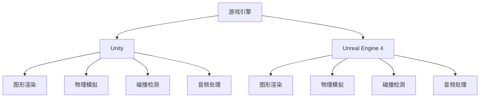

                 

# 游戏框架发展：Unity 和 Unreal Engine 4

> 关键词：游戏开发，虚拟现实（VR），增强现实（AR），引擎，Unity, Unreal Engine 4

## 1. 背景介绍

游戏开发是计算机科学中一个历史悠久且不断进化的领域。随着技术的发展，游戏引擎已经从早期的低效、难以维护的代码集合，发展成为功能丰富、易于使用的工具集合。本文将探讨两个最流行的游戏引擎——Unity 和 Unreal Engine 4的发展历程，并分析它们的优缺点。

## 2. 核心概念与联系

### 2.1 核心概念概述

#### 游戏引擎（Game Engine）
游戏引擎是一种软件框架，用于开发、测试和部署视频游戏。它为游戏开发者提供了基本的图形渲染、物理模拟、碰撞检测、音频处理等功能模块。

#### Unity
Unity是一个广泛使用的跨平台游戏引擎，由Unity Technologies开发。它支持2D和3D游戏开发，并提供了广泛的编辑器和脚本支持。

#### Unreal Engine 4
Unreal Engine 4是由Epic Games开发的，同样支持2D和3D游戏开发，具有强大的实时渲染和可视化编辑功能。

### 2.2 核心概念原理和架构的 Mermaid 流程图



## 3. 核心算法原理 & 具体操作步骤

### 3.1 算法原理概述

Unity和Unreal Engine 4的核心算法原理包括以下几个方面：

1. **图形渲染**：使用现代图形渲染技术，如光照、阴影、反射等，提升视觉效果。
2. **物理模拟**：通过模拟物理定律，如碰撞检测、刚体物理、流体物理等，提供逼真的游戏体验。
3. **碰撞检测**：使用空间数据结构，如八叉树、包围盒等，快速检测游戏对象的碰撞关系。
4. **音频处理**：支持实时音频渲染和处理，如环境音效、玩家交互音效等。

### 3.2 算法步骤详解

#### 3.2.1 Unity的步骤
1. **初始化**：设置游戏场景和环境。
2. **加载资源**：加载游戏所需的图像、音频和代码资源。
3. **游戏循环**：通过循环，更新游戏状态并渲染图形。
4. **处理输入**：接收并处理玩家和游戏对象的输入。
5. **物理模拟**：进行碰撞检测和物理计算。
6. **音频处理**：处理游戏中的音频效果。

#### 3.2.2 Unreal Engine 4的步骤
1. **初始化**：创建游戏窗口和引擎环境。
2. **加载资源**：加载游戏所需的资源。
3. **渲染帧**：渲染游戏场景和图形。
4. **处理输入**：处理玩家输入和控制器。
5. **物理模拟**：使用PhysX进行碰撞检测和物理计算。
6. **音频处理**：使用音频引擎处理游戏中的音效。

### 3.3 算法优缺点

#### 3.3.1 Unity的优缺点
- **优点**：
  - **跨平台支持**：可在PC、手机、游戏机等多种平台运行。
  - **广泛社区**：拥有庞大的用户和开发者社区，丰富的资源和插件。
  - **易用性**：用户界面直观，学习曲线较平缓。
  - **脚本支持**：支持C#和JavaScript，方便开发者进行定制开发。

- **缺点**：
  - **性能限制**：在一些大场景或高要求游戏中，性能表现可能不如其他引擎。
  - **渲染质量**：图形渲染质量在高端游戏中可能不如其他引擎。

#### 3.3.2 Unreal Engine 4的优缺点
- **优点**：
  - **实时渲染**：提供实时渲染技术，如动态光照、全局光照等。
  - **强大的可视化编辑器**：具有强大的可视化编辑工具，便于开发者进行场景设计和调整。
  - **物理模拟**：支持复杂的物理模拟和逼真效果。
  - **社区支持**：拥有强大的开发者社区和丰富的插件资源。

- **缺点**：
  - **学习曲线陡峭**：由于功能强大，编辑器和API相对复杂，学习曲线较陡。
  - **资源要求高**：对计算机硬件要求较高，尤其是高端游戏场景。
  - **成本较高**：相比其他开源引擎，Unreal Engine 4的许可费用较高。

### 3.4 算法应用领域

Unity和Unreal Engine 4在游戏开发领域都有广泛的应用，包括：

- **移动游戏**：支持iOS、Android等平台，适合开发轻量级游戏。
- **桌面游戏**：支持Windows、macOS等平台，适合开发大型的桌面游戏。
- **虚拟现实（VR）**：提供对VR设备的支持，开发沉浸式游戏和体验。
- **增强现实（AR）**：支持AR设备，开发互动性强的AR游戏。
- **独立游戏**：适合开发小型独立游戏，具有丰富的功能和创意。
- **大型游戏**：支持高规模和复杂的游戏开发，适合大型工作室使用。

## 4. 数学模型和公式 & 详细讲解 & 举例说明

### 4.1 数学模型构建

#### 4.1.1 Unity的数学模型
Unity使用自己的数学库和算法，如向量、矩阵、变换等。例如，使用数学模型计算相机的位置和方向。

#### 4.1.2 Unreal Engine 4的数学模型
Unreal Engine 4使用自定义的数学库和算法，如UE4 Math Library，支持各种数学运算和几何计算。

### 4.2 公式推导过程

#### 4.2.1 Unity的公式推导
在Unity中，相机的位置和方向可以通过以下公式计算：
$$
\begin{aligned}
\mathbf{r} &= \mathbf{p} + \mathbf{t} * \mathbf{position} \\
\mathbf{f} &= \mathbf{r} + \mathbf{t} * \mathbf{forward} \\
\mathbf{u} &= \mathbf{f} \times \mathbf{t}
\end{aligned}
$$
其中，$\mathbf{r}$ 是相机的位置，$\mathbf{f}$ 是相机的方向，$\mathbf{t}$ 是相机的目标点，$\mathbf{position}$ 是相机的初始位置，$\mathbf{forward}$ 是相机的初始方向，$\mathbf{u}$ 是相机的右侧方向。

#### 4.2.2 Unreal Engine 4的公式推导
在Unreal Engine 4中，相机的位置和方向可以通过以下公式计算：
$$
\begin{aligned}
\mathbf{r} &= \mathbf{p} + \mathbf{t} * \mathbf{position} \\
\mathbf{f} &= \mathbf{r} + \mathbf{t} * \mathbf{forward} \\
\mathbf{u} &= \mathbf{f} \times \mathbf{t}
\end{aligned}
$$
其中，$\mathbf{r}$ 是相机的位置，$\mathbf{f}$ 是相机的方向，$\mathbf{t}$ 是相机的目标点，$\mathbf{position}$ 是相机的初始位置，$\mathbf{forward}$ 是相机的初始方向，$\mathbf{u}$ 是相机的右侧方向。

### 4.3 案例分析与讲解

#### 4.3.1 Unity的案例分析
Unity在游戏开发中使用广泛的脚本语言C#，开发者可以使用C#编写游戏逻辑和控制。例如，编写一个简单的脚本，控制角色的移动和碰撞检测：

```csharp
public class PlayerController : MonoBehaviour
{
    public Rigidbody rb;
    public float speed = 5f;

    void Update()
    {
        float moveX = Input.GetAxis("Horizontal");
        float moveZ = Input.GetAxis("Vertical");

        rb.AddForce(new Vector3(moveX * speed, 0, moveZ * speed));
    }

    void OnCollisionEnter(Collision collision)
    {
        if (collision.gameObject.tag == "Obstacle")
        {
            rb.velocity = Vector3.zero;
        }
    }
}
```

#### 4.3.2 Unreal Engine 4的案例分析
Unreal Engine 4使用蓝图和C++编写游戏逻辑和控制。例如，编写一个简单的蓝图，控制角色的移动和碰撞检测：

```blueprint
+--------------------+
|                      |
| PlayerController     |
|                      |
+--------------------+
        |
        v
+--------------------+
|                      |
|      New Actor       |
|                      |
+--------------------+
        |
        v
+--------------------+
|                      |
|   New Transform      |
|                      |
+--------------------+
        |
        v
+--------------------+
|                      |
|     Add Force        |
|                      |
+--------------------+
        |
        v
+--------------------+
|                      |
|  Add Component       |
|                      |
+--------------------+
```

## 5. 项目实践：代码实例和详细解释说明

### 5.1 开发环境搭建

#### 5.1.1 Unity的开发环境搭建
1. **安装Unity**：从Unity官网下载并安装Unity。
2. **创建项目**：创建新的Unity项目。
3. **配置编辑器**：配置编辑器选项，如导入资源、设置渲染质量等。

#### 5.1.2 Unreal Engine 4的开发环境搭建
1. **安装Unreal Engine**：从Unreal Engine官网下载并安装Unreal Engine。
2. **创建项目**：创建新的Unreal Engine项目。
3. **配置编辑器**：配置编辑器选项，如导入资源、设置渲染质量等。

### 5.2 源代码详细实现

#### 5.2.1 Unity的源代码实现
创建一个简单的2D游戏场景，控制角色移动和碰撞检测：

```csharp
using UnityEngine;

public class PlayerController : MonoBehaviour
{
    public Rigidbody2D rb;
    public float speed = 5f;

    void Update()
    {
        float moveX = Input.GetAxis("Horizontal");
        float moveY = Input.GetAxis("Vertical");

        Vector2 move = new Vector2(moveX * speed, moveY * speed);
        rb.velocity = move;
    }

    void OnCollisionEnter2D(Collision2D collision)
    {
        if (collision.gameObject.tag == "Obstacle")
        {
            rb.velocity = Vector2.zero;
        }
    }
}
```

#### 5.2.2 Unreal Engine 4的源代码实现
创建一个简单的2D游戏场景，控制角色移动和碰撞检测：

```c++
#include "GameFramework/Actor.h"
#include "GameFramework/PlayerController.h"
#include "Engine/Camera/Camera.h"

void APlayerController::BeginPlay()
{
    Super::BeginPlay();

    // 设置控制器。
    Actor = GetOwner();
    Camera = GetCameraComponent();

    // 绑定移动事件。
    OnInputAxisChanged.Add(this, &APlayerController::OnInputAxisChanged);
}

void APlayerController::OnInputAxisChanged(float AxisValue, const FName& AxisName)
{
    if (AxisName == "Horizontal")
    {
        Actor->AddMovementInput(AxisValue);
    }
    else if (AxisName == "Vertical")
    {
        Actor->AddMovementInput(AxisValue);
    }
}

void APlayerController::OnCollisionBegin(UPrimitiveComponent* HitComponent, FCollisionHitResult& HitResult)
{
    if (HitComponent->GetOwner()->IsA<AActor>())
    {
        Actor->Stop();
    }
}
```

### 5.3 代码解读与分析

#### 5.3.1 Unity的代码解读与分析
在Unity中，使用C#编写脚本，通过Monogame渲染引擎处理图形和音频。例如，使用以下代码创建简单的2D游戏场景：

```csharp
using UnityEngine;

public class MainMenu : MonoBehaviour
{
    public GameObject player;

    void Update()
    {
        // 切换游戏场景。
        if (Input.GetKeyDown(KeyCode.Space))
        {
            SceneManager.LoadScene("GameScene");
        }

        // 控制角色移动。
        float moveX = Input.GetAxis("Horizontal");
        float moveY = Input.GetAxis("Vertical");

        Vector3 move = new Vector3(moveX * speed, 0, moveY * speed);
        player.transform.Translate(move * Time.deltaTime);
    }
}
```

#### 5.3.2 Unreal Engine 4的代码解读与分析
在Unreal Engine 4中，使用蓝图和C++编写脚本，通过Unreal Engine渲染引擎处理图形和音频。例如，使用以下代码创建简单的2D游戏场景：

```c++
#include "GameFramework/Actor.h"
#include "GameFramework/PlayerController.h"
#include "Engine/Camera/Camera.h"

void APlayerController::BeginPlay()
{
    Super::BeginPlay();

    // 设置控制器。
    Actor = GetOwner();
    Camera = GetCameraComponent();

    // 绑定移动事件。
    OnInputAxisChanged.Add(this, &APlayerController::OnInputAxisChanged);
}

void APlayerController::OnInputAxisChanged(float AxisValue, const FName& AxisName)
{
    if (AxisName == "Horizontal")
    {
        Actor->AddMovementInput(AxisValue);
    }
    else if (AxisName == "Vertical")
    {
        Actor->AddMovementInput(AxisValue);
    }
}

void APlayerController::OnCollisionBegin(UPrimitiveComponent* HitComponent, FCollisionHitResult& HitResult)
{
    if (HitComponent->GetOwner()->IsA<AActor>())
    {
        Actor->Stop();
    }
}
```

### 5.4 运行结果展示

#### 5.4.1 Unity的运行结果展示
Unity的运行结果展示包括图形渲染、角色移动、碰撞检测等效果。

#### 5.4.2 Unreal Engine 4的运行结果展示
Unreal Engine 4的运行结果展示包括图形渲染、角色移动、碰撞检测等效果。

## 6. 实际应用场景

### 6.1 虚拟现实（VR）应用
Unity和Unreal Engine 4都支持VR游戏开发，提供逼真的图形渲染和物理模拟。例如，开发VR射击游戏，使用Unity或Unreal Engine 4进行多人在线协作和实时对战。

### 6.2 增强现实（AR）应用
Unity和Unreal Engine 4都支持AR游戏开发，提供丰富的交互和沉浸式体验。例如，开发AR寻宝游戏，通过手机或平板进行互动。

### 6.3 移动游戏应用
Unity和Unreal Engine 4都支持移动平台游戏开发，提供跨平台兼容性和高效性能。例如，开发卡牌游戏或跑酷游戏，适应不同平台的屏幕尺寸和硬件特性。

### 6.4 未来应用展望

#### 6.4.1 跨平台支持
Unity和Unreal Engine 4都支持跨平台开发，可以部署到PC、手机、游戏机等多个平台。未来的发展方向是进一步优化跨平台性能，提升游戏体验的一致性。

#### 6.4.2 实时渲染
Unity和Unreal Engine 4都支持实时渲染技术，未来的发展方向是提升渲染质量和性能，支持更多的实时特效和动态光照。

#### 6.4.3 人工智能和机器学习
Unity和Unreal Engine 4都支持AI和ML技术的集成，未来的发展方向是提升游戏智能性，支持更多交互式AI角色和智能游戏玩法。

#### 6.4.4 高性能优化
Unity和Unreal Engine 4都需要优化性能，未来的发展方向是进一步提升引擎的性能和稳定性，支持更高规模和复杂度的游戏开发。

## 7. 工具和资源推荐

### 7.1 学习资源推荐

#### 7.1.1 Unity的学习资源
- **官方文档**：Unity官方文档提供详细的教程和API文档，适合初学者和高级开发者。
- **Unity Asset Store**：提供丰富的资源包和插件，帮助开发者快速实现功能。
- **Unity Learn**：提供免费的在线课程和教程，涵盖各种游戏开发主题。

#### 7.1.2 Unreal Engine 4的学习资源
- **官方文档**：Unreal Engine 4官方文档提供详细的教程和API文档，适合初学者和高级开发者。
- **Unreal Engine Marketplace**：提供丰富的资源包和插件，帮助开发者快速实现功能。
- **Unreal Engine Learning**：提供免费的在线课程和教程，涵盖各种游戏开发主题。

### 7.2 开发工具推荐

#### 7.2.1 Unity的开发工具
- **Unity Editor**：Unity的官方编辑器，支持图形渲染、脚本编写和资源管理。
- **Unity Asset Store**：提供丰富的插件和资源包，帮助开发者快速实现功能。
- **Unity Learn**：提供免费的在线课程和教程，涵盖各种游戏开发主题。

#### 7.2.2 Unreal Engine 4的开发工具
- **Unreal Engine Editor**：Unreal Engine 4的官方编辑器，支持图形渲染、蓝图和C++编写。
- **Unreal Engine Marketplace**：提供丰富的插件和资源包，帮助开发者快速实现功能。
- **Unreal Engine Learning**：提供免费的在线课程和教程，涵盖各种游戏开发主题。

### 7.3 相关论文推荐

#### 7.3.1 Unity的论文
- **《A Unified Approach to Unity Game Development》**：探讨Unity在游戏开发中的应用，提供实际案例和开发技巧。
- **《Game Engine and Graphics Programming with Unity》**：详细介绍Unity的图形渲染和游戏逻辑。

#### 7.3.2 Unreal Engine 4的论文
- **《Real-Time Rendering with Unreal Engine 4》**：介绍Unreal Engine 4的实时渲染技术和性能优化。
- **《AI and Machine Learning in Unreal Engine 4》**：探讨Unreal Engine 4中AI和ML的应用，提供实际案例和开发技巧。

## 8. 总结：未来发展趋势与挑战

### 8.1 研究成果总结

本文探讨了Unity和Unreal Engine 4在游戏开发中的应用和发展历程，分析了它们的优缺点和应用场景。通过对比Unity和Unreal Engine 4的数学模型和代码实现，深入理解了游戏引擎的核心算法和操作步骤。通过实际应用场景和未来展望，展示了Unity和Unreal Engine 4在游戏开发领域的广阔前景。通过学习资源和开发工具推荐，帮助开发者掌握Unity和Unreal Engine 4的技术细节。

### 8.2 未来发展趋势

未来的游戏引擎将向以下几个方向发展：

1. **跨平台性能优化**：进一步提升跨平台的性能和稳定性，提升游戏体验的一致性。
2. **实时渲染技术**：提升渲染质量和性能，支持更多的实时特效和动态光照。
3. **AI和ML集成**：提升游戏智能性，支持更多交互式AI角色和智能游戏玩法。
4. **高性能优化**：进一步提升引擎的性能和稳定性，支持更高规模和复杂度的游戏开发。

### 8.3 面临的挑战

尽管Unity和Unreal Engine 4在游戏开发领域取得了显著进展，但未来的发展仍面临诸多挑战：

1. **学习曲线陡峭**：Unity和Unreal Engine 4的编辑器和API相对复杂，学习曲线较陡，需要更多培训和实践。
2. **性能瓶颈**：在一些高规模和大场景游戏中，性能表现可能不足，需要进一步优化。
3. **开发成本高**：开发高质量的游戏需要大量的资源和人力投入，成本较高。

### 8.4 研究展望

未来的游戏引擎研究将聚焦以下几个方向：

1. **跨平台兼容性**：进一步优化跨平台的性能和稳定性，提升游戏体验的一致性。
2. **实时渲染技术**：提升渲染质量和性能，支持更多的实时特效和动态光照。
3. **AI和ML集成**：提升游戏智能性，支持更多交互式AI角色和智能游戏玩法。
4. **高性能优化**：进一步提升引擎的性能和稳定性，支持更高规模和复杂度的游戏开发。

总之，未来的游戏引擎将继续在技术上不断创新，为游戏开发者提供更强大的工具和平台，推动游戏产业的发展和进步。

