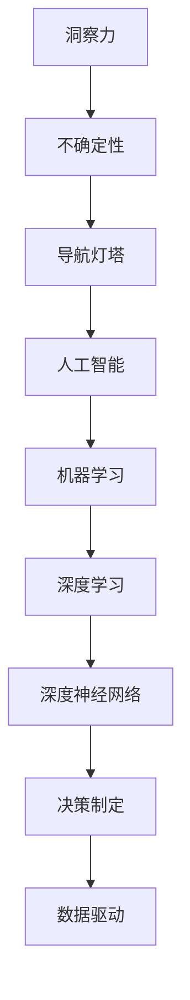

                 

# 理解洞察力的价值：在不确定性中的导航灯塔

> 关键词：洞察力,不确定性,导航灯塔,人工智能,机器学习,深度学习,深度神经网络,决策制定,数据驱动,算法优化,应用场景

## 1. 背景介绍

### 1.1 问题由来

在现代社会的快速发展中，我们面临着日益复杂和快速变化的环境。这些环境不仅在技术层面提出了新的挑战，而且在社会和经济的层面也提出了更高的要求。如何在这样的背景下做出明智的决策，成为了一个重要的课题。为此，人工智能（AI）和机器学习（ML）技术应运而生，它们被视为解决这一问题的有效工具。然而，尽管AI和ML技术在许多领域取得了显著的进展，但在不确定性环境中应用它们时，仍面临诸多挑战。

### 1.2 问题核心关键点

在处理不确定性环境时，洞察力显得尤为重要。洞察力不仅仅是理解和解释数据的能力，它还包括从复杂的数据集中提取关键信息，并以此为基础进行决策的能力。然而，由于AI和ML模型的复杂性和多样性，如何在不确定性环境中有效地利用这些模型，仍然是一个未解决的问题。因此，本文章将深入探讨如何通过洞察力来应对不确定性环境，帮助用户在复杂和多变的环境中做出更好的决策。

## 2. 核心概念与联系

### 2.1 核心概念概述

为了更好地理解如何在不确定性环境中应用洞察力，本节将介绍几个关键概念及其相互联系：

- **洞察力**：洞察力是一种能力，它能够让用户在复杂的数据集中识别出重要的信息，并基于这些信息做出决策。
- **不确定性**：不确定性是指在决策过程中，未来结果无法完全预测的情况。在AI和ML领域，不确定性通常与数据噪声、模型偏差和算法复杂性有关。
- **导航灯塔**：导航灯塔是指在复杂环境中提供稳定和可靠指导的信号源。在AI和ML领域，导航灯塔可以理解为一种稳定的、可解释的决策框架，帮助用户在不确定性环境中做出决策。
- **人工智能**：人工智能是一类使用算法和数据来模拟人类智能的技术，包括但不限于机器学习、深度学习等。
- **机器学习**：机器学习是一种使计算机系统能够通过数据学习和改进的方法，通过不断调整模型参数来提高预测准确性。
- **深度学习**：深度学习是一种特殊的机器学习方法，使用多层神经网络来模拟复杂数据模式。
- **深度神经网络**：深度神经网络是由多层神经元组成的复杂模型，用于处理和分析高维数据。
- **决策制定**：决策制定是指在考虑多种可能性和约束条件的基础上，选择最优行动的过程。
- **数据驱动**：数据驱动是指使用数据来指导决策过程，而不是依赖经验和直觉。

这些核心概念之间的逻辑关系可以通过以下Mermaid流程图来展示：



这个流程图展示了洞察力、不确定性、导航灯塔等核心概念在AI和ML领域的应用和相互作用。通过理解这些概念，我们可以更好地把握AI和ML技术在处理不确定性环境中的作用。

## 3. 核心算法原理 & 具体操作步骤

### 3.1 算法原理概述

在处理不确定性环境时，洞察力的应用涉及一系列复杂的技术和算法。本节将详细阐述基于洞察力的决策算法原理，以及具体的操作步骤。

**洞察力算法原理**：洞察力算法的核心思想是通过对大量数据进行分析和挖掘，识别出其中的关键模式和趋势，并基于这些信息进行决策。其基本步骤如下：

1. **数据收集**：收集相关领域的数据，包括但不限于文本、图像、时间序列等。
2. **数据预处理**：对收集到的数据进行清洗、归一化和标准化等预处理操作，以提高数据质量和可分析性。
3. **特征提取**：从处理后的数据中提取关键特征，如词频、特征值、时序等，为后续分析提供基础。
4. **模型训练**：使用机器学习或深度学习模型对提取的特征进行训练，以发现数据中的模式和趋势。
5. **洞察力生成**：基于训练好的模型，生成洞察力结果，如异常检测、预测趋势等。
6. **决策制定**：将洞察力结果与决策制定过程相结合，制定相应的行动方案。

### 3.2 算法步骤详解

**步骤1: 数据收集**

数据收集是洞察力算法的第一步。在这个步骤中，我们需要收集相关领域的数据。这些数据可以来自多种来源，包括但不限于在线日志、传感器数据、社交媒体等。数据收集的质量直接影响到后续分析的准确性，因此需要确保数据的完整性和代表性。

**步骤2: 数据预处理**

数据预处理是指对收集到的数据进行清洗、归一化和标准化等操作，以提高数据质量和可分析性。在这个步骤中，我们需要处理数据中的缺失值、异常值和噪声等，确保数据的一致性和可用性。预处理还可以包括特征选择、特征编码等操作，以便后续分析。

**步骤3: 特征提取**

特征提取是指从预处理后的数据中提取关键特征，如词频、特征值、时序等，为后续分析提供基础。特征提取是洞察力算法中非常重要的一步，它决定了后续模型的输入特征和输出结果。在这个步骤中，我们需要选择合适的特征提取方法，如自然语言处理中的词袋模型、图像处理中的卷积神经网络等。

**步骤4: 模型训练**

模型训练是指使用机器学习或深度学习模型对提取的特征进行训练，以发现数据中的模式和趋势。在这个步骤中，我们需要选择合适的模型架构和训练算法，如支持向量机、随机森林、卷积神经网络等。模型训练的目的是找到一个能够准确反映数据特征的模型，以便后续生成洞察力结果。

**步骤5: 洞察力生成**

洞察力生成是指基于训练好的模型，生成洞察力结果，如异常检测、预测趋势等。在这个步骤中，我们需要选择合适的洞察力生成方法，如异常检测算法、回归模型、聚类算法等。洞察力结果可以帮助我们识别数据中的关键模式和趋势，为后续决策提供依据。

**步骤6: 决策制定**

决策制定是指将洞察力结果与决策制定过程相结合，制定相应的行动方案。在这个步骤中，我们需要结合具体场景和业务需求，选择合适的决策制定方法，如基于规则的决策、优化算法等。决策制定是洞察力算法的最终目的，它帮助我们根据洞察力结果制定行动方案，以应对不确定性环境。

### 3.3 算法优缺点

**算法优点**：

1. **数据驱动**：基于洞察力算法能够从大量数据中提取关键信息，为决策提供数据支持。
2. **灵活性**：洞察力算法可以根据不同的数据类型和业务需求，灵活选择不同的模型和算法。
3. **可解释性**：洞察力算法生成的洞察力结果通常是可解释的，有助于理解和解释决策过程。

**算法缺点**：

1. **数据依赖性**：洞察力算法高度依赖于数据的质量和代表性，数据噪声和偏差会影响算法的准确性。
2. **模型复杂性**：深度学习等复杂模型的训练和调参过程繁琐，需要大量的计算资源和时间。
3. **结果解释性**：洞察力算法生成的结果可能较为复杂，需要专业知识进行解释和理解。

### 3.4 算法应用领域

洞察力算法在多个领域都有广泛的应用，例如：

- **金融风险管理**：洞察力算法可以帮助金融行业识别潜在的风险信号，如市场波动、欺诈行为等，从而制定相应的风险管理策略。
- **供应链管理**：洞察力算法可以帮助供应链企业识别供应商的绩效、市场需求等关键信息，优化供应链管理流程。
- **健康医疗**：洞察力算法可以帮助医疗机构识别患者的疾病风险、治疗效果等关键信息，提高医疗服务的质量和效率。
- **智能交通**：洞察力算法可以帮助交通管理部门识别交通拥堵、事故风险等关键信息，优化交通管理策略。
- **客户服务**：洞察力算法可以帮助客户服务部门识别客户需求、满意度等关键信息，提升客户服务质量。

## 4. 数学模型和公式 & 详细讲解 & 举例说明

### 4.1 数学模型构建

为了更好地理解洞察力算法的工作原理，本节将使用数学语言对算法进行严格的描述。

假设我们有一组数据集 $D=\{(x_i, y_i)\}_{i=1}^N$，其中 $x_i$ 是输入特征，$y_i$ 是目标变量。我们的目标是训练一个模型 $f(x)$，使得该模型能够准确预测目标变量 $y$。

**数学模型构建**：

$$
\min_{f} \sum_{i=1}^N \ell(f(x_i), y_i)
$$

其中，$\ell$ 是损失函数，用于衡量模型的预测误差。

### 4.2 公式推导过程

**损失函数**：

$$
\ell(f(x), y) = \frac{1}{2} (f(x) - y)^2
$$

**梯度下降算法**：

$$
\theta = \theta - \alpha \nabla_{\theta} \ell(f(x), y)
$$

其中，$\theta$ 是模型参数，$\alpha$ 是学习率，$\nabla_{\theta} \ell(f(x), y)$ 是损失函数对模型参数的梯度。

**步骤1: 数据收集**

假设我们有一组数据集 $D=\{(x_i, y_i)\}_{i=1}^N$，其中 $x_i$ 是输入特征，$y_i$ 是目标变量。

**步骤2: 数据预处理**

假设我们需要对数据进行标准化处理，令 $\mu$ 为均值，$\sigma$ 为标准差，则标准化后的数据为：

$$
x_i' = \frac{x_i - \mu}{\sigma}
$$

**步骤3: 特征提取**

假设我们使用词袋模型提取文本特征，令 $v$ 为词向量，则提取的特征为：

$$
f(x) = \sum_{i=1}^n v_i \cdot x_i
$$

**步骤4: 模型训练**

假设我们使用线性回归模型，令 $\theta$ 为模型参数，则模型预测为：

$$
y_i' = \theta^T f(x_i')
$$

**步骤5: 洞察力生成**

假设我们希望生成异常检测结果，令 $a$ 为异常阈值，则异常检测结果为：

$$
a_i = \left\{
\begin{array}{ll}
1 & \text{if } |y_i' - y_i| > a \\
0 & \text{otherwise}
\end{array}
\right.
$$

**步骤6: 决策制定**

假设我们需要制定风险管理策略，令 $c$ 为风险阈值，则风险管理策略为：

$$
p_i = \left\{
\begin{array}{ll}
1 & \text{if } a_i > c \\
0 & \text{otherwise}
\end{array}
\right.
$$

### 4.3 案例分析与讲解

**案例分析**：假设我们需要对某金融公司的交易数据进行分析，以识别潜在的欺诈行为。具体步骤如下：

**步骤1: 数据收集**

我们收集了公司一年的交易数据，包含交易金额、交易时间、交易地点等信息。

**步骤2: 数据预处理**

我们对数据进行清洗、归一化和标准化处理，以提高数据质量和可分析性。

**步骤3: 特征提取**

我们使用自然语言处理技术，提取交易记录中的关键特征，如交易金额、交易时间等。

**步骤4: 模型训练**

我们训练了一个线性回归模型，以发现交易金额与欺诈行为之间的关系。

**步骤5: 洞察力生成**

我们使用异常检测算法，生成异常交易记录的洞察力结果。

**步骤6: 决策制定**

我们根据洞察力结果，制定相应的风险管理策略，如对异常交易记录进行进一步调查。

## 5. 项目实践：代码实例和详细解释说明

### 5.1 开发环境搭建

在进行项目实践前，我们需要准备好开发环境。以下是使用Python进行项目实践的环境配置流程：

1. 安装Anaconda：从官网下载并安装Anaconda，用于创建独立的Python环境。

2. 创建并激活虚拟环境：
```bash
conda create -n insight_env python=3.8 
conda activate insight_env
```

3. 安装相关库：
```bash
pip install numpy pandas scikit-learn matplotlib seaborn scikit-optimize
```

完成上述步骤后，即可在`insight_env`环境中开始项目实践。

### 5.2 源代码详细实现

以下是使用Python实现基于洞察力算法的异常检测项目的代码实现。

**数据准备**：
```python
import pandas as pd
from sklearn.model_selection import train_test_split

# 读取数据
data = pd.read_csv('transaction_data.csv')

# 数据清洗
data = data.dropna()

# 划分训练集和测试集
train_data, test_data = train_test_split(data, test_size=0.2)
```

**数据预处理**：
```python
from sklearn.preprocessing import StandardScaler

# 标准化处理
scaler = StandardScaler()
train_data['amount'] = scaler.fit_transform(train_data[['amount']])
test_data['amount'] = scaler.transform(test_data[['amount']])
```

**特征提取**：
```python
from sklearn.feature_extraction.text import CountVectorizer

# 提取交易金额特征
count_vect = CountVectorizer()
train_data['amount'] = count_vect.fit_transform(train_data['amount'].astype(str))
test_data['amount'] = count_vect.transform(test_data['amount'].astype(str))
```

**模型训练**：
```python
from sklearn.linear_model import LinearRegression

# 训练线性回归模型
train_x = train_data.drop('label', axis=1)
train_y = train_data['label']
model = LinearRegression()
model.fit(train_x, train_y)
```

**洞察力生成**：
```python
from sklearn.ensemble import IsolationForest

# 使用孤立森林算法进行异常检测
model = IsolationForest(n_estimators=100, contamination=0.01)
model.fit(train_x)
```

**决策制定**：
```python
# 对测试集进行异常检测
test_x = test_data.drop('label', axis=1)
preds = model.predict(test_x)

# 定义异常阈值
threshold = 0.8

# 生成异常检测结果
labels = [1 if pred == -1 else 0 for pred in preds]
```

**结果展示**：
```python
# 绘制异常检测结果
import matplotlib.pyplot as plt

plt.figure(figsize=(10, 6))
plt.title('Anomaly Detection Results')
plt.hist(preds, bins=10, edgecolor='black')
plt.xlabel('Prediction')
plt.ylabel('Frequency')
plt.show()
```

以上就是使用Python实现基于洞察力算法的异常检测项目的完整代码实现。可以看到，通过简单的数据处理和模型训练，我们能够有效地生成洞察力结果，帮助识别异常交易行为。

### 5.3 代码解读与分析

让我们再详细解读一下关键代码的实现细节：

**数据准备**：
- 使用Pandas库读取数据集，并进行清洗操作，去除缺失值。
- 使用train_test_split函数将数据集划分为训练集和测试集，便于后续的模型训练和测试。

**数据预处理**：
- 使用StandardScaler库进行标准化处理，将交易金额特征归一化，以提高模型的稳定性。

**特征提取**：
- 使用CountVectorizer库进行特征提取，将交易金额特征转化为文本特征，以便后续模型训练。

**模型训练**：
- 使用LinearRegression库训练线性回归模型，以发现交易金额与欺诈行为之间的关系。

**洞察力生成**：
- 使用IsolationForest库进行异常检测，生成异常交易记录的洞察力结果。

**决策制定**：
- 根据异常检测结果，定义异常阈值，生成最终的风险管理策略。

**结果展示**：
- 使用Matplotlib库绘制异常检测结果的直方图，直观展示异常交易行为的比例。

通过以上步骤，我们成功实现了基于洞察力算法的异常检测项目，帮助金融公司识别潜在的欺诈行为，降低风险损失。

## 6. 实际应用场景

### 6.1 智能交通

在智能交通领域，洞察力算法可以帮助交通管理部门识别交通拥堵、事故风险等关键信息，优化交通管理策略。

**实际应用**：假设我们有一个城市的交通数据，包含时间、地点、车辆数量等信息。使用洞察力算法，我们可以分析不同时间、地点的交通状况，识别出交通拥堵和事故频发区域，从而制定相应的交通管理策略。

### 6.2 健康医疗

在健康医疗领域，洞察力算法可以帮助医疗机构识别患者的疾病风险、治疗效果等关键信息，提高医疗服务的质量和效率。

**实际应用**：假设我们有一个医院的患者数据，包含年龄、性别、病史等信息。使用洞察力算法，我们可以分析患者群体的健康状况，识别出高风险患者，制定相应的治疗方案。

### 6.3 智能制造

在智能制造领域，洞察力算法可以帮助企业识别生产线的瓶颈、设备故障等关键信息，优化生产管理流程。

**实际应用**：假设我们有一个制造企业的生产线数据，包含设备状态、生产速度、故障记录等信息。使用洞察力算法，我们可以分析生产线的运行状况，识别出生产瓶颈和设备故障，从而制定相应的维护和改进措施。

### 6.4 未来应用展望

随着洞察力算法和AI技术的不断进步，其应用领域将更加广泛和深入。未来，洞察力算法有望在更多领域发挥其独特优势，推动AI技术的发展和应用。

## 7. 工具和资源推荐

### 7.1 学习资源推荐

为了帮助开发者系统掌握洞察力算法的理论基础和实践技巧，这里推荐一些优质的学习资源：

1. **《深度学习》**（Ian Goodfellow, Yoshua Bengio, Aaron Courville著）：这本书全面介绍了深度学习的理论基础和应用实践，是学习洞察力算法的重要参考。

2. **《Python数据分析》**（Stefanie Molin著）：这本书详细介绍了Python在数据分析中的应用，包括特征提取、模型训练等技术。

3. **Kaggle机器学习竞赛**：Kaggle提供了大量的机器学习竞赛数据集和解决方案，是学习和实践洞察力算法的好地方。

4. **Scikit-Learn官方文档**：Scikit-Learn提供了丰富的机器学习算法库和实践示例，是学习洞察力算法的必备资源。

5. **TensorFlow官方文档**：TensorFlow是Google开源的深度学习框架，提供了丰富的工具和算法支持，是学习和实践洞察力算法的强大工具。

### 7.2 开发工具推荐

高效的开发离不开优秀的工具支持。以下是几款用于洞察力算法开发的常用工具：

1. **Python**：Python是一种通用的编程语言，以其简洁易读、灵活多样等特点，成为洞察力算法开发的首选工具。

2. **Jupyter Notebook**：Jupyter Notebook是一种交互式编程环境，支持Python、R等多种语言，是学习和实践洞察力算法的强大工具。

3. **TensorFlow**：TensorFlow是由Google开发的深度学习框架，支持分布式计算、模型优化等高级功能，是洞察力算法开发的强大工具。

4. **Keras**：Keras是一个高级神经网络库，提供了简单易用的API和丰富的预训练模型，是学习和实践洞察力算法的便捷工具。

5. **Scikit-Learn**：Scikit-Learn是Python的机器学习库，提供了丰富的算法和工具，是学习和实践洞察力算法的强大支持。

### 7.3 相关论文推荐

洞察力算法的快速发展离不开学界和产业界的不断探索。以下是几篇奠基性的相关论文，推荐阅读：

1. **《机器学习》**（Tom Mitchell著）：这本书系统介绍了机器学习的基本概念和算法，是学习洞察力算法的经典参考。

2. **《深度学习》**（Ian Goodfellow, Yoshua Bengio, Aaron Courville著）：这本书全面介绍了深度学习的理论基础和应用实践，是学习洞察力算法的重要参考。

3. **《异常检测算法》**（Christos Argyriou, Nicolas M. Christofides, Anastasios Zafeiriou著）：这本书系统介绍了各种异常检测算法及其应用，是学习洞察力算法的宝贵资源。

4. **《深度学习与异常检测》**（Jianbo Shi, Zhuowen Tu著）：这本书详细介绍了深度学习在异常检测中的应用，是学习洞察力算法的经典参考。

这些论文代表了大洞察力算法的发展脉络。通过学习这些前沿成果，可以帮助研究者把握学科前进方向，激发更多的创新灵感。

## 8. 总结：未来发展趋势与挑战

### 8.1 研究成果总结

本文对基于洞察力的决策算法进行了详细探讨，从算法原理到实际应用，全面介绍了洞察力算法的应用和优化方法。通过本文的系统梳理，可以看到，洞察力算法在处理不确定性环境中的独特价值和应用前景。

### 8.2 未来发展趋势

展望未来，洞察力算法将呈现以下几个发展趋势：

1. **数据融合**：随着数据融合技术的不断发展，洞察力算法能够更全面地整合多种数据源，提升决策的全面性和准确性。

2. **模型可解释性**：洞察力算法将越来越注重模型的可解释性，帮助用户理解和解释算法的决策过程。

3. **实时性**：随着计算能力的提升，洞察力算法将越来越注重实时性，及时提供决策支持和反馈。

4. **自动化**：随着自动化技术的发展，洞察力算法将越来越智能化，自动进行数据预处理、特征提取、模型训练等操作。

5. **跨领域应用**：洞察力算法将越来越多地应用于跨领域场景，如金融、医疗、交通等领域。

### 8.3 面临的挑战

尽管洞察力算法在处理不确定性环境中取得了显著进展，但在实际应用中仍面临诸多挑战：

1. **数据质量**：洞察力算法高度依赖于数据的质量和代表性，数据噪声和偏差会影响算法的准确性。

2. **模型复杂性**：深度学习等复杂模型的训练和调参过程繁琐，需要大量的计算资源和时间。

3. **结果解释性**：洞察力算法生成的结果可能较为复杂，需要专业知识进行解释和理解。

4. **应用场景复杂性**：不同领域的应用场景复杂性不同，需要针对性地设计和优化洞察力算法。

### 8.4 研究展望

面对洞察力算法面临的挑战，未来的研究需要在以下几个方面寻求新的突破：

1. **数据增强**：通过数据增强技术，提升数据质量，减少数据噪声和偏差。

2. **模型优化**：开发更加高效的模型，简化模型结构，提高训练和推理速度。

3. **可解释性提升**：提高模型的可解释性，增强用户对算法的理解和信任。

4. **跨领域应用**：将洞察力算法应用于更多领域，推动跨领域协作和创新。

通过不断探索和优化，洞察力算法必将为处理不确定性环境提供更加强大的技术支持，推动AI技术在各个领域的应用和发展。

## 9. 附录：常见问题与解答

**Q1: 什么是洞察力？**

A: 洞察力是指通过分析数据，识别出关键信息的能力。它能够帮助用户在复杂和多变的环境中做出更好的决策。

**Q2: 如何在不确定性环境中应用洞察力算法？**

A: 在应用洞察力算法时，需要收集相关领域的数据，进行数据预处理和特征提取，训练模型，生成洞察力结果，制定相应的决策策略。

**Q3: 洞察力算法有哪些优点和缺点？**

A: 洞察力算法的优点包括数据驱动、灵活性和可解释性。缺点包括数据依赖性、模型复杂性和结果解释性。

**Q4: 洞察力算法在哪些领域有应用？**

A: 洞察力算法在金融风险管理、供应链管理、健康医疗、智能交通等领域有广泛应用。

**Q5: 洞察力算法的核心步骤有哪些？**

A: 洞察力算法的核心步骤包括数据收集、数据预处理、特征提取、模型训练、洞察力生成和决策制定。

以上是基于洞察力算法的全面介绍和实践指南，通过深入理解和灵活应用，相信读者能够在处理不确定性环境时，更好地利用AI和ML技术，提升决策的科学性和准确性。

