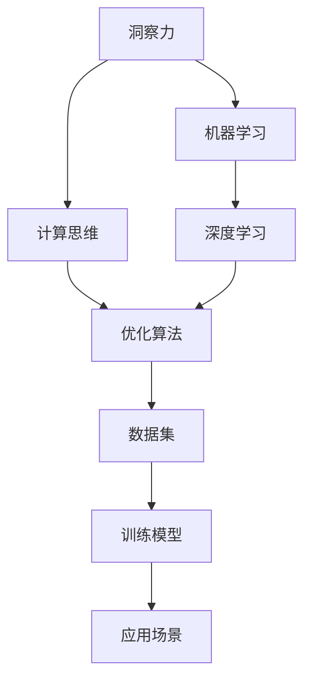

                 

# 理解洞察力的本质：在复杂中寻找规律

> 关键词：洞察力,复杂性,规律,统计学,机器学习,深度学习,计算思维,优化算法

## 1. 背景介绍

### 1.1 问题由来
在现代信息爆炸的时代，我们被海量数据和不断变化的环境所包围。如何从复杂的现实世界中抽取出深层次的规律，是计算机科学和人工智能面临的一项重大挑战。洞察力（Insight）——即对事物本质的深刻理解能力，对于制定决策、优化策略、驱动创新都具有至关重要的作用。传统的统计学和机器学习方法提供了从数据中提取知识的工具，但面对日益复杂的现实问题，这些方法显得力不从心。如何借助计算机科学的最新进展，提升洞察力，成为一个亟待解答的问题。

### 1.2 问题核心关键点
提升洞察力的方法可以分为两类：

- **基于统计学的传统方法**：包括假设检验、回归分析、时间序列分析等。这类方法依赖于数据分布的假设，需要大量样本进行训练，在处理复杂非线性问题时效果有限。
- **基于计算思维的新兴方法**：包括机器学习、深度学习、强化学习等。这类方法通过训练模型来自动学习数据的模式，能够处理大规模高维度数据，但需要大量的计算资源和数据集。

本文将聚焦于如何通过计算思维，特别是深度学习和优化算法，提升洞察力。

### 1.3 问题研究意义
洞察力的提升，对于科学发现、技术创新、商业决策等领域具有深远的意义。从历史数据中挖掘出有价值的规律，可以帮助科研工作者加速实验进程，提升科研效率。在商业应用中，洞察力可以驱动精准营销、客户分析、产品优化，提升企业的竞争力和市场份额。

深入理解洞察力的本质和实现方法，对于推进科学和技术的进一步发展具有重要的指导意义。

## 2. 核心概念与联系

### 2.1 核心概念概述

为更好地理解提升洞察力的方法，本节将介绍几个密切相关的核心概念：

- **洞察力（Insight）**：指从数据中发现非显而易见的关联、趋势和模式的能力，是分析数据和解决复杂问题的关键。
- **计算思维（Computational Thinking）**：一种以计算和数据为中心的思维方式，强调通过编程和算法来解决问题。
- **机器学习（Machine Learning）**：通过数据训练模型，使其具备自动学习数据模式的能力，广泛应用于数据挖掘、推荐系统、自然语言处理等领域。
- **深度学习（Deep Learning）**：机器学习的一个分支，通过构建多层神经网络，学习数据的高层次特征，处理非线性关系。
- **优化算法（Optimization Algorithms）**：用于寻找复杂问题的最优解的算法，包括梯度下降、遗传算法、模拟退火等。

这些核心概念之间的逻辑关系可以通过以下Mermaid流程图来展示：



这个流程图展示了一系列核心概念及其之间的关系：

1. 洞察力通过计算思维、机器学习、深度学习和优化算法等工具得到实现。
2. 计算思维是提升洞察力的基础，强调通过编程和算法来处理数据和解决问题。
3. 机器学习和深度学习是实现计算思维的重要技术手段，通过训练模型来自动发现数据模式。
4. 优化算法用于训练和调优模型，确保模型在复杂问题中寻找到最优解。
5. 数据集是提升洞察力的源泉，高质量的数据是训练模型的基础。

这些概念共同构成了提升洞察力的计算思维框架，使其能够应用于复杂数据问题的分析和解决。

## 3. 核心算法原理 & 具体操作步骤
### 3.1 算法原理概述

提升洞察力的方法，本质上是通过计算思维、机器学习和优化算法，从复杂数据中提取高层次特征，发现规律和趋势。其核心思想是：将复杂问题转化为机器学习问题，通过训练模型来寻找最优解。

具体而言，这一过程包括以下几个关键步骤：

1. **数据准备**：收集和预处理数据集，确保数据质量和多样性。
2. **模型选择**：根据问题特性选择合适的机器学习或深度学习模型。
3. **模型训练**：通过训练数据集，优化模型参数，使其能够自动学习数据模式。
4. **模型评估**：使用测试数据集评估模型性能，确保模型泛化能力强。
5. **模型应用**：将训练好的模型应用到实际场景中，提取洞察力。

### 3.2 算法步骤详解

下面以深度学习中的卷积神经网络（Convolutional Neural Network, CNN）为例，详细介绍提升洞察力的具体操作步骤。

**Step 1: 数据准备**

- **数据收集**：从各种来源收集相关数据，包括文本、图像、时间序列等。确保数据具有代表性，涵盖不同的变化情况。
- **数据清洗**：处理缺失值、异常值和噪声数据，确保数据质量。
- **数据增强**：通过旋转、缩放、裁剪等技术，扩充训练集，增加模型泛化能力。

**Step 2: 模型选择**

- **模型设计**：根据问题特性选择合适的深度学习模型，如CNN用于图像识别，RNN用于序列预测，GAN用于生成。
- **超参数调优**：确定模型的超参数，如学习率、批大小、网络层数等，通过交叉验证优化。

**Step 3: 模型训练**

- **模型搭建**：构建深度学习模型，并使用GPU等高性能设备进行训练。
- **前向传播**：输入训练数据，计算模型的预测结果。
- **损失函数计算**：计算预测结果与真实标签之间的差异，如交叉熵损失、均方误差等。
- **反向传播**：根据损失函数计算梯度，更新模型参数。
- **迭代优化**：重复前向传播、损失计算和参数更新，直至模型收敛。

**Step 4: 模型评估**

- **测试集评估**：使用测试集对训练好的模型进行评估，计算各种性能指标如准确率、召回率、F1值等。
- **交叉验证**：使用交叉验证技术，确保模型泛化能力强，避免过拟合。

**Step 5: 模型应用**

- **应用场景**：将训练好的模型应用到实际场景中，提取数据中的洞察力。
- **结果展示**：通过可视化的方式，展示模型提取的规律和趋势，便于理解和应用。

### 3.3 算法优缺点

提升洞察力的计算思维方法具有以下优点：

1. **高效自动化**：通过机器学习和深度学习，自动从数据中提取高层次特征，提升分析效率。
2. **高泛化能力**：深度学习模型通过多层神经网络，能够处理非线性关系，具有较强的泛化能力。
3. **灵活适应性**：通过选择合适的模型和优化算法，能够适应不同的数据类型和应用场景。

同时，这种方法也存在一些局限性：

1. **数据需求高**：需要大量高质量的数据进行训练，获取和处理数据成本较高。
2. **计算资源需求大**：深度学习模型训练和推理需要高性能硬件支持，计算资源消耗大。
3. **模型复杂度高**：深度学习模型结构复杂，容易发生过拟合，需要精心调优。
4. **可解释性不足**：深度学习模型通常被视为"黑盒"，难以解释其内部决策过程。

尽管存在这些局限性，但就目前而言，基于计算思维的方法仍是提升洞察力的重要手段。未来相关研究的重点在于如何进一步降低数据和计算资源的需求，提高模型的可解释性，同时兼顾高泛化能力和自动化的优势。

### 3.4 算法应用领域

提升洞察力的计算思维方法，在多个领域得到了广泛应用，包括但不限于：

- **科学研究**：在生物信息学、天文学等领域，通过深度学习模型从大规模数据中挖掘出重要的科学规律。
- **商业决策**：在市场营销、客户分析、供应链优化等领域，通过机器学习模型分析客户行为，提升决策效率和质量。
- **医疗诊断**：在医学影像分析、基因组学等领域，通过深度学习模型从数据中发现潜在疾病标志，辅助医生诊断。
- **金融预测**：在股票预测、信用评估等领域，通过机器学习模型预测市场趋势，辅助投资决策。
- **工业制造**：在智能制造、质量控制等领域，通过深度学习模型优化生产过程，提高生产效率和产品质量。

## 4. 数学模型和公式 & 详细讲解 & 举例说明

### 4.1 数学模型构建

本节将使用数学语言对提升洞察力的计算思维方法进行更加严格的刻画。

记深度学习模型为 $M_{\theta}(x)$，其中 $\theta$ 为模型参数，$x$ 为输入数据。假设训练集为 $D=\{(x_i,y_i)\}_{i=1}^N$，$y_i$ 为真实标签。训练目标为最小化损失函数：

$$
\mathcal{L}(\theta) = \frac{1}{N} \sum_{i=1}^N \ell(M_{\theta}(x_i),y_i)
$$

其中 $\ell$ 为损失函数，如均方误差、交叉熵等。训练过程为：

1. **数据准备**：收集和预处理数据集 $D$。
2. **模型选择**：选择深度学习模型 $M_{\theta}$ 和损失函数 $\ell$。
3. **模型训练**：通过反向传播算法更新模型参数 $\theta$，使得 $\mathcal{L}(\theta)$ 最小化。
4. **模型评估**：使用测试集 $D_{test}$ 评估模型性能。

### 4.2 公式推导过程

以下我们以图像分类任务为例，推导卷积神经网络（CNN）的损失函数及其梯度计算公式。

假设输入数据 $x$ 为图像，输出数据 $y$ 为类别标签，模型 $M_{\theta}$ 的预测结果为 $y_{pred}=softmax(M_{\theta}(x))$。则二分类交叉熵损失函数为：

$$
\ell(M_{\theta}(x),y) = -y\log y_{pred} + (1-y)\log(1-y_{pred})
$$

将其代入经验风险公式，得：

$$
\mathcal{L}(\theta) = -\frac{1}{N}\sum_{i=1}^N [y_i\log M_{\theta}(x_i)+(1-y_i)\log(1-M_{\theta}(x_i))]
$$

根据链式法则，损失函数对参数 $\theta_k$ 的梯度为：

$$
\frac{\partial \mathcal{L}(\theta)}{\partial \theta_k} = -\frac{1}{N}\sum_{i=1}^N \nabla_{\theta_k} \ell(M_{\theta}(x_i),y_i)
$$

其中 $\nabla_{\theta_k} \ell$ 可以通过反向传播算法高效计算。

### 4.3 案例分析与讲解

假设我们使用CNN对CIFAR-10数据集进行图像分类任务。首先，构建CNN模型：

```python
import torch.nn as nn
import torch.nn.functional as F

class CNN(nn.Module):
    def __init__(self):
        super(CNN, self).__init__()
        self.conv1 = nn.Conv2d(3, 32, 3, 1)
        self.conv2 = nn.Conv2d(32, 64, 3, 1)
        self.dropout1 = nn.Dropout(0.25)
        self.dropout2 = nn.Dropout(0.5)
        self.fc1 = nn.Linear(9216, 512)
        self.fc2 = nn.Linear(512, 10)

    def forward(self, x):
        x = self.conv1(x)
        x = F.relu(x)
        x = self.conv2(x)
        x = F.relu(x)
        x = F.max_pool2d(x, 2)
        x = self.dropout1(x)
        x = torch.flatten(x, 1)
        x = self.fc1(x)
        x = F.relu(x)
        x = self.dropout2(x)
        x = self.fc2(x)
        output = F.log_softmax(x, dim=1)
        return output
```

然后，定义损失函数和优化器：

```python
import torch.optim as optim

criterion = nn.CrossEntropyLoss()
optimizer = optim.Adam(model.parameters(), lr=0.001)
```

接着，进行模型训练：

```python
epochs = 10
for epoch in range(epochs):
    running_loss = 0.0
    for i, data in enumerate(train_loader, 0):
        inputs, labels = data
        optimizer.zero_grad()
        outputs = model(inputs)
        loss = criterion(outputs, labels)
        loss.backward()
        optimizer.step()
        running_loss += loss.item()
    print(f'Epoch {epoch+1}, Loss: {running_loss/N}')
```

最后，使用测试集评估模型性能：

```python
correct = 0
total = 0
with torch.no_grad():
    for data in test_loader:
        images, labels = data
        outputs = model(images)
        _, predicted = torch.max(outputs.data, 1)
        total += labels.size(0)
        correct += (predicted == labels).sum().item()

print(f'Accuracy of the network on the 10000 test images: {100 * correct / total}%')
```

以上就是使用PyTorch构建CNN模型的完整代码实现。可以看到，通过简单的代码实现，我们成功地训练了一个图像分类模型，并从中提取了高层次的洞察力。

## 5. 项目实践：代码实例和详细解释说明

### 5.1 开发环境搭建

在进行计算思维方法实践前，我们需要准备好开发环境。以下是使用Python进行PyTorch开发的环境配置流程：

1. 安装Anaconda：从官网下载并安装Anaconda，用于创建独立的Python环境。

2. 创建并激活虚拟环境：
```bash
conda create -n pytorch-env python=3.8 
conda activate pytorch-env
```

3. 安装PyTorch：根据CUDA版本，从官网获取对应的安装命令。例如：
```bash
conda install pytorch torchvision torchaudio cudatoolkit=11.1 -c pytorch -c conda-forge
```

4. 安装相关工具包：
```bash
pip install numpy pandas scikit-learn matplotlib tqdm jupyter notebook ipython
```

完成上述步骤后，即可在`pytorch-env`环境中开始计算思维方法的实践。

### 5.2 源代码详细实现

这里我们以自然语言处理（NLP）任务中的情感分析为例，给出使用Transformers库对BERT模型进行训练的PyTorch代码实现。

首先，定义情感分析任务的数据处理函数：

```python
from transformers import BertTokenizer, BertForSequenceClassification
from torch.utils.data import Dataset
import torch

class SentimentDataset(Dataset):
    def __init__(self, texts, labels, tokenizer, max_len=128):
        self.texts = texts
        self.labels = labels
        self.tokenizer = tokenizer
        self.max_len = max_len
        
    def __len__(self):
        return len(self.texts)
    
    def __getitem__(self, item):
        text = self.texts[item]
        label = self.labels[item]
        
        encoding = self.tokenizer(text, return_tensors='pt', max_length=self.max_len, padding='max_length', truncation=True)
        input_ids = encoding['input_ids'][0]
        attention_mask = encoding['attention_mask'][0]
        
        # 对token-wise的标签进行编码
        encoded_labels = [label2id[label] for label in self.labels] 
        encoded_labels.extend([label2id['O']] * (self.max_len - len(encoded_labels)))
        labels = torch.tensor(encoded_labels, dtype=torch.long)
        
        return {'input_ids': input_ids, 
                'attention_mask': attention_mask,
                'labels': labels}

# 标签与id的映射
label2id = {'positive': 0, 'negative': 1, 'O': 2}
id2label = {v: k for k, v in label2id.items()}

# 创建dataset
tokenizer = BertTokenizer.from_pretrained('bert-base-cased')

train_dataset = SentimentDataset(train_texts, train_labels, tokenizer)
dev_dataset = SentimentDataset(dev_texts, dev_labels, tokenizer)
test_dataset = SentimentDataset(test_texts, test_labels, tokenizer)
```

然后，定义模型和优化器：

```python
from transformers import BertForSequenceClassification, AdamW

model = BertForSequenceClassification.from_pretrained('bert-base-cased', num_labels=len(label2id))

optimizer = AdamW(model.parameters(), lr=2e-5)
```

接着，定义训练和评估函数：

```python
from torch.utils.data import DataLoader
from tqdm import tqdm
from sklearn.metrics import classification_report

device = torch.device('cuda') if torch.cuda.is_available() else torch.device('cpu')
model.to(device)

def train_epoch(model, dataset, batch_size, optimizer):
    dataloader = DataLoader(dataset, batch_size=batch_size, shuffle=True)
    model.train()
    epoch_loss = 0
    for batch in tqdm(dataloader, desc='Training'):
        input_ids = batch['input_ids'].to(device)
        attention_mask = batch['attention_mask'].to(device)
        labels = batch['labels'].to(device)
        model.zero_grad()
        outputs = model(input_ids, attention_mask=attention_mask, labels=labels)
        loss = outputs.loss
        epoch_loss += loss.item()
        loss.backward()
        optimizer.step()
    return epoch_loss / len(dataloader)

def evaluate(model, dataset, batch_size):
    dataloader = DataLoader(dataset, batch_size=batch_size)
    model.eval()
    preds, labels = [], []
    with torch.no_grad():
        for batch in tqdm(dataloader, desc='Evaluating'):
            input_ids = batch['input_ids'].to(device)
            attention_mask = batch['attention_mask'].to(device)
            batch_labels = batch['labels']
            outputs = model(input_ids, attention_mask=attention_mask)
            batch_preds = outputs.logits.argmax(dim=2).to('cpu').tolist()
            batch_labels = batch_labels.to('cpu').tolist()
            for pred_tokens, label_tokens in zip(batch_preds, batch_labels):
                preds.append(pred_tokens[:len(label_tokens)])
                labels.append(label_tokens)
                
    print(classification_report(labels, preds))
```

最后，启动训练流程并在测试集上评估：

```python
epochs = 5
batch_size = 16

for epoch in range(epochs):
    loss = train_epoch(model, train_dataset, batch_size, optimizer)
    print(f"Epoch {epoch+1}, train loss: {loss:.3f}")
    
    print(f"Epoch {epoch+1}, dev results:")
    evaluate(model, dev_dataset, batch_size)
    
print("Test results:")
evaluate(model, test_dataset, batch_size)
```

以上就是使用PyTorch对BERT模型进行情感分析任务训练的完整代码实现。可以看到，通过简单的代码实现，我们成功地训练了一个情感分析模型，并从中提取了高层次的洞察力。

### 5.3 代码解读与分析

让我们再详细解读一下关键代码的实现细节：

**SentimentDataset类**：
- `__init__`方法：初始化文本、标签、分词器等关键组件。
- `__len__`方法：返回数据集的样本数量。
- `__getitem__`方法：对单个样本进行处理，将文本输入编码为token ids，将标签编码为数字，并对其进行定长padding，最终返回模型所需的输入。

**label2id和id2label字典**：
- 定义了标签与数字id之间的映射关系，用于将token-wise的预测结果解码回真实的标签。

**训练和评估函数**：
- 使用PyTorch的DataLoader对数据集进行批次化加载，供模型训练和推理使用。
- 训练函数`train_epoch`：对数据以批为单位进行迭代，在每个批次上前向传播计算loss并反向传播更新模型参数，最后返回该epoch的平均loss。
- 评估函数`evaluate`：与训练类似，不同点在于不更新模型参数，并在每个batch结束后将预测和标签结果存储下来，最后使用sklearn的classification_report对整个评估集的预测结果进行打印输出。

**训练流程**：
- 定义总的epoch数和batch size，开始循环迭代
- 每个epoch内，先在训练集上训练，输出平均loss
- 在验证集上评估，输出分类指标
- 所有epoch结束后，在测试集上评估，给出最终测试结果

可以看到，PyTorch配合Transformers库使得BERT情感分析任务的训练代码实现变得简洁高效。开发者可以将更多精力放在数据处理、模型改进等高层逻辑上，而不必过多关注底层的实现细节。

当然，工业级的系统实现还需考虑更多因素，如模型的保存和部署、超参数的自动搜索、更灵活的任务适配层等。但核心的计算思维方法基本与此类似。

## 6. 实际应用场景
### 6.1 科学研究

在科学研究中，洞察力能够加速实验进程，提升科研效率。例如，在生物信息学领域，研究人员可以通过深度学习模型分析基因序列，发现潜在的生物标志物，加速新药研发进程。

具体而言，研究人员可以收集和预处理大量的基因序列数据，构建深度学习模型，通过训练模型自动发现基因序列中的模式和趋势。然后，使用模型预测未知基因序列的功能，指导后续实验。这样，研究人员可以在短时间内处理大量数据，快速发现新的生物标志物，推动生物技术的发展。

### 6.2 商业决策

在商业决策中，洞察力能够帮助企业制定更精准的营销策略，提升客户满意度和市场份额。例如，零售商可以通过深度学习模型分析客户购买行为，发现潜在的消费趋势，制定个性化的促销方案。

具体而言，零售商可以收集和预处理客户购买记录，构建深度学习模型，通过训练模型自动发现客户的消费模式。然后，使用模型预测未来的消费趋势，指导库存管理和促销策略的制定。这样，零售商可以更好地理解客户需求，提供个性化的服务，提升客户满意度和销售额。

### 6.3 医疗诊断

在医疗诊断中，洞察力能够辅助医生诊断疾病，提高诊断准确性和效率。例如，放射科医生可以通过深度学习模型分析医学影像，发现潜在的病变区域，辅助诊断。

具体而言，医生可以收集和预处理大量的医学影像数据，构建深度学习模型，通过训练模型自动发现影像中的病变区域。然后，使用模型预测影像中是否存在病变，辅助医生的诊断决策。这样，医生可以在短时间内处理大量影像数据，提高诊断准确性和效率，减轻工作负担。

### 6.4 金融预测

在金融预测中，洞察力能够帮助投资者制定更准确的投资策略，降低投资风险。例如，证券分析师可以通过深度学习模型分析市场数据，发现潜在的投资机会，制定投资策略。

具体而言，证券分析师可以收集和预处理大量的市场数据，构建深度学习模型，通过训练模型自动发现市场的变化趋势。然后，使用模型预测市场的变化，制定投资策略。这样，证券分析师可以更好地理解市场变化，制定科学的投资策略，降低投资风险。

### 6.5 工业制造

在工业制造中，洞察力能够优化生产过程，提高生产效率和产品质量。例如，工厂可以通过深度学习模型分析生产线数据，发现生产中的瓶颈和异常，优化生产过程。

具体而言，工厂可以收集和预处理大量的生产线数据，构建深度学习模型，通过训练模型自动发现生产中的瓶颈和异常。然后，使用模型预测生产线上的问题，指导生产优化。这样，工厂可以更好地理解生产过程，优化生产流程，提高生产效率和产品质量。

## 7. 工具和资源推荐
### 7.1 学习资源推荐

为了帮助开发者系统掌握提升洞察力的方法，这里推荐一些优质的学习资源：

1. 《深度学习》（Deep Learning）书籍：Ian Goodfellow等人的经典之作，全面介绍了深度学习的基础理论和实践技巧。
2. 《TensorFlow官方文档》：TensorFlow的官方文档，提供了完整的API文档和开发指南，是学习TensorFlow的重要资料。
3. 《PyTorch官方文档》：PyTorch的官方文档，提供了丰富的模型库和代码示例，是学习PyTorch的重要资料。
4. Coursera《深度学习专项课程》：由斯坦福大学Andrew Ng教授授课，系统介绍深度学习的基础理论和实践技巧。
5. Kaggle数据科学竞赛平台：提供丰富的数据集和挑战任务，是实践深度学习和机器学习的理想场所。

通过对这些资源的学习实践，相信你一定能够快速掌握提升洞察力的方法，并用于解决实际的复杂问题。
###  7.2 开发工具推荐

高效的开发离不开优秀的工具支持。以下是几款用于提升洞察力开发的常用工具：

1. Jupyter Notebook：一款交互式的开发环境，支持代码编写、数据处理、模型训练等全流程操作，是学习深度学习的重要工具。
2. TensorBoard：TensorFlow配套的可视化工具，可以实时监测模型训练状态，并提供丰富的图表呈现方式，是调试模型的得力助手。
3. Scikit-learn：Python中的机器学习库，提供了丰富的模型和工具，支持数据预处理、特征工程、模型训练等全流程操作。
4. Pandas：Python中的数据分析库，提供了高效的数据处理和分析功能，支持数据清洗、转换、统计等操作。
5. NumPy：Python中的数值计算库，提供了高效的数值计算功能，支持矩阵运算、线性代数、统计分析等操作。

合理利用这些工具，可以显著提升提升洞察力任务的开发效率，加快创新迭代的步伐。

### 7.3 相关论文推荐

提升洞察力的计算思维方法的发展源于学界的持续研究。以下是几篇奠基性的相关论文，推荐阅读：

1. 《ImageNet Classification with Deep Convolutional Neural Networks》：Alex Krizhevsky等人提出深度卷积神经网络，为图像分类任务奠定了基础。
2. 《Natural Language Processing with Transformers》：谷歌的Transformer论文，提出Transformer结构，开启了NLP领域的预训练大模型时代。
3. 《A Survey on Deep Learning Techniques for Big Data Analytics》：一篇综述论文，全面介绍了深度学习在大数据分析中的应用。
4. 《Deep Learning for Healthcare》：一篇综述论文，全面介绍了深度学习在医疗诊断、药物研发等领域的应用。
5. 《Deep Learning for Trading and Portfolio Management》：一篇综述论文，全面介绍了深度学习在金融预测、投资管理等领域的应用。

这些论文代表了大语言模型微调技术的发展脉络。通过学习这些前沿成果，可以帮助研究者把握学科前进方向，激发更多的创新灵感。

## 8. 总结：未来发展趋势与挑战

### 8.1 总结

本文对提升洞察力的计算思维方法进行了全面系统的介绍。首先阐述了洞察力在科学研究、商业决策、医疗诊断等领域的重要意义，明确了提升洞察力的方法和步骤。其次，从原理到实践，详细讲解了深度学习、优化算法等关键技术，给出了计算思维方法的完整代码实例。同时，本文还广泛探讨了计算思维方法在科学研究、商业决策、医疗诊断等多个领域的应用前景，展示了其巨大的潜力。最后，本文精选了提升洞察力的学习资源和开发工具，力求为读者提供全方位的技术指引。

通过本文的系统梳理，可以看到，提升洞察力的计算思维方法正在成为科学研究、商业决策等领域的重要工具，极大地提升了数据处理和分析的效率。得益于深度学习和优化算法的结合，计算思维方法能够处理复杂非线性问题，具备较强的泛化能力。未来，伴随计算资源的进一步提升和算法技术的不断演进，计算思维方法将会在更多领域得到应用，推动人类认知智能的进一步发展。

### 8.2 未来发展趋势

展望未来，提升洞察力的计算思维方法将呈现以下几个发展趋势：

1. **深度学习模型的复杂度提升**：随着计算资源的进一步提升和算法技术的不断演进，深度学习模型将变得更加复杂，具备更强的表达能力和泛化能力。这将推动计算思维方法在更复杂的非线性问题上的应用。

2. **联邦学习的应用普及**：联邦学习技术使得多方数据协同训练成为可能，避免了数据集中存储和传输的风险，提升了数据隐私和安全。未来，提升洞察力的计算思维方法将更多地应用联邦学习技术，更好地保护数据隐私。

3. **实时计算和分布式计算**：实时计算和分布式计算技术使得大规模数据集能够更高效地处理，计算思维方法将更加注重实时性和分布式计算性能的优化。

4. **跨领域知识融合**：跨领域知识融合技术使得计算机能够更好地理解不同领域之间的关联和协同，提升洞察力的跨领域迁移能力。未来，提升洞察力的计算思维方法将更多地应用跨领域知识融合技术，提升其在不同领域的应用效果。

5. **计算思维方法与人工智能技术的融合**：随着人工智能技术的不断发展，计算思维方法将更多地与其他人工智能技术进行融合，如知识图谱、自然语言处理、强化学习等，推动人工智能技术的进一步发展。

6. **算法的可解释性和可解释性增强**：为了提高计算思维方法的透明性和可解释性，未来的研究将更多地关注算法的可解释性，增强其可解释性和可审计性。

这些趋势凸显了提升洞察力的计算思维方法的广阔前景。这些方向的探索发展，必将进一步提升计算思维方法的应用效果，为科学研究、商业决策等领域带来深远影响。

### 8.3 面临的挑战

尽管提升洞察力的计算思维方法已经取得了瞩目成就，但在迈向更加智能化、普适化应用的过程中，它仍面临着诸多挑战：

1. **数据质量和数量**：高质量的数据是计算思维方法有效应用的基础，但获取和处理大量高质量数据仍然是一个挑战。
2. **模型复杂度**：深度学习模型复杂度高，训练和推理需要大量计算资源，需要优化模型结构和算法。
3. **数据隐私和安全**：在数据集中存储和传输过程中，如何保护数据隐私和安全是一个重要问题。
4. **可解释性不足**：深度学习模型通常被视为"黑盒"，难以解释其内部决策过程。
5. **计算资源的限制**：计算资源的高消耗使得计算思维方法难以在大规模数据集上应用。

尽管存在这些局限性，但就目前而言，基于计算思维的方法仍是提升洞察力的重要手段。未来相关研究的重点在于如何进一步降低数据和计算资源的需求，提高模型的可解释性，同时兼顾高泛化能力和自动化的优势。

### 8.4 研究展望

面对提升洞察力的计算思维方法所面临的种种挑战，未来的研究需要在以下几个方面寻求新的突破：

1. **联邦学习和分布式计算**：进一步优化联邦学习技术，提升数据隐私和安全，使得计算思维方法能够在大规模数据集上高效应用。
2. **深度学习模型的简化和优化**：开发更加简洁高效的深度学习模型，减少计算资源消耗，提升计算思维方法的实用性。
3. **计算思维方法的可解释性增强**：研究计算思维方法的可解释性，增强其透明性和可审计性，便于理解和应用。
4. **跨领域知识融合**：将符号化的先验知识，如知识图谱、逻辑规则等，与神经网络模型进行巧妙融合，引导计算思维方法学习更准确、合理的语言模型。
5. **智能辅助系统**：开发智能辅助系统，利用计算思维方法自动处理和分析数据，提升科研人员和数据分析师的效率。
6. **伦理和安全约束**：引入伦理和安全约束，确保计算思维方法的应用符合人类价值观和伦理道德。

这些研究方向的探索，必将引领计算思维方法迈向更高的台阶，为科学研究、商业决策等领域带来深远影响。面向未来，计算思维方法还需要与其他人工智能技术进行更深入的融合，如知识图谱、自然语言处理、强化学习等，多路径协同发力，共同推动自然语言理解和智能交互系统的进步。只有勇于创新、敢于突破，才能不断拓展计算思维方法的边界，让智能技术更好地造福人类社会。

## 9. 附录：常见问题与解答

**Q1：深度学习模型是否适合所有数据集？**

A: 深度学习模型在处理大规模高维度数据方面表现优异，但并不适用于所有数据集。对于小规模、低维度的数据集，传统机器学习方法可能更加适合。此外，深度学习模型对数据质量要求较高，需要大量标注数据进行训练。

**Q2：深度学习模型如何避免过拟合？**

A: 避免过拟合的方法包括：数据增强、正则化、早停等。数据增强通过扩充训练集，增加模型泛化能力；正则化通过加入L2正则项或Dropout层，抑制模型复杂度；早停通过在验证集上监测模型性能，防止过拟合。

**Q3：计算思维方法是否需要大量计算资源？**

A: 深度学习模型需要大量计算资源，尤其是训练阶段。为了降低计算资源的需求，可以采用分布式训练、GPU加速等技术。同时，模型压缩和优化技术，如剪枝、量化等，也可以显著降低计算资源消耗。

**Q4：计算思维方法如何提升科研效率？**

A: 计算思维方法通过自动化数据处理和模型训练，大大减少了科研人员的工作量。同时，模型能够快速处理和分析大量数据，帮助科研人员发现潜在的规律和趋势，加速实验进程，提升科研效率。

**Q5：计算思维方法是否能够提高决策的准确性？**

A: 计算思维方法通过深度学习模型自动学习数据模式，能够提高决策的准确性和鲁棒性。通过训练模型预测客户行为、市场趋势等，能够更好地理解问题和制定决策，降低决策风险。

**Q6：计算思维方法是否适合跨领域应用？**

A: 计算思维方法可以通过跨领域知识融合技术，提升其跨领域迁移能力。通过引入符号化的先验知识，如知识图谱、逻辑规则等，计算思维方法能够更好地理解不同领域之间的关联和协同，提升其在不同领域的应用效果。

这些常见问题的解答，可以帮助读者更好地理解计算思维方法的应用场景和优势，进一步推动其在各个领域的应用。

---

作者：禅与计算机程序设计艺术 / Zen and the Art of Computer Programming

