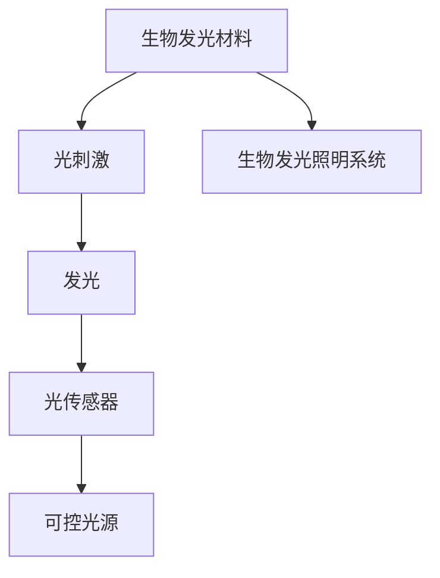

                 

## 1. 背景介绍

生物发光技术，即生物体在受到外界刺激时，通过自身代谢产生的化学发光现象。生物发光现象被广泛应用于生命科学、医学、农业等多个领域，如萤火虫的闪光、夜光黏菌的化学发光等。而将生物发光技术引入照明领域，将开启环保节能的新选择。

## 2. 核心概念与联系

### 2.1 核心概念概述

生物发光照明（Bioluminescent Lighting）是一种基于生物发光技术进行照明的方法。其核心在于利用生物发光材料在光刺激下产生的光，通过特殊的装置或传感器将其转化为可控光源。

### 2.2 核心概念原理和架构的 Mermaid 流程图



该图展示了生物发光照明系统的基本原理。生物发光材料在受到光刺激时产生生物发光，并通过光传感器将其转换为可控光源，用于照明。

## 3. 核心算法原理 & 具体操作步骤

### 3.1 算法原理概述

生物发光照明的基本原理是利用生物发光材料的自发光特性。其核心在于设计和优化发光材料的光刺激条件和生物发光转化效率。

#### 3.1.1 发光材料选择

生物发光材料包括荧光蛋白、量子点、纳米颗粒等。荧光蛋白如荧光素酶、荧光素等，是应用最广泛的生物发光材料，因其稳定性和广泛可用性受到青睐。

#### 3.1.2 光刺激控制

生物发光需要合适的光刺激条件。过强或过弱的光刺激都可能导致生物发光效率的降低。实验中，需要找到最佳的刺激条件，以最大化生物发光效率。

#### 3.1.3 生物发光转化效率

生物发光的转化效率与光刺激条件和发光材料本身的性质有关。通过实验和仿真，可以优化光刺激条件和发光材料的浓度，以提高生物发光的效率。

### 3.2 算法步骤详解

#### 3.2.1 生物发光材料的准备

1. 选择适合的生物发光材料。
2. 准备生物发光材料，包括纯化和活性检测。
3. 将生物发光材料涂覆到发光基材上。

#### 3.2.2 光刺激装置的构建

1. 设计光刺激装置，如LED光源、光纤光束等。
2. 将光刺激装置与生物发光材料连接。

#### 3.2.3 光传感器和控制系统

1. 选择合适类型的光传感器，如光电二极管、光敏二极管等。
2. 设计控制系统，以调节光刺激强度和生物发光的转换效率。
3. 将光传感器与控制系统连接。

#### 3.2.4 照明系统的测试和优化

1. 进行生物发光照明系统的测试。
2. 根据测试结果，优化光刺激条件和生物发光材料的浓度。
3. 调整光传感器和控制系统，提高照明系统的效率和稳定性。

### 3.3 算法优缺点

#### 3.3.1 优点

1. 环保节能。生物发光材料不需要外部电源，避免了能源浪费和环境污染。
2. 生物降解性。生物发光材料通常具有生物降解性，不会对环境造成长期的负面影响。
3. 低维护成本。生物发光照明系统通常无需常规维护。
4. 安全性高。生物发光不会产生有害辐射，对人体和环境友好。

#### 3.3.2 缺点

1. 成本高。目前生物发光材料和技术尚需进一步发展和优化，导致成本较高。
2. 光照均匀性有待提升。生物发光材料的分布和光照条件需要精确控制，以实现均匀的光照。
3. 光照强度有限。目前生物发光材料的能量转换效率较低，光照强度较弱。
4. 技术复杂。生物发光照明系统的设计和优化需要跨学科知识，技术门槛较高。

### 3.4 算法应用领域

生物发光照明技术可以应用于以下领域：

1. **生态保护**：在自然保护区、生态博物馆等环境中，用于模拟自然光照条件，保护生态环境。
2. **农业**：在温室、动物养殖场等环境中，用于控制光照强度和光照周期，优化植物生长和动物健康。
3. **医疗**：在手术室、病床等环境中，用于辅助诊断和治疗，提高医疗环境的舒适性和安全性。
4. **城市景观**：在城市广场、公园等公共场所，用于美化环境和提供导航。
5. **工业生产**：在工业车间、实验室等环境中，用于照明和监测。

## 4. 数学模型和公式 & 详细讲解 & 举例说明

### 4.1 数学模型构建

生物发光照明的数学模型主要关注生物发光的强度、光刺激条件和光传感器响应之间的关系。

设 $L(t)$ 为生物发光强度，$I(t)$ 为光刺激强度，$E(t)$ 为光传感器响应，则有以下关系：

$$
L(t) = f(I(t), E(t))
$$

其中 $f$ 为生物发光的函数。

### 4.2 公式推导过程

以荧光素酶和荧光素发光为例，其发光过程可以简化为如下步骤：

1. 荧光素被荧光素酶催化，生成荧光素激发光化学产物。
2. 激发光化学产物在特定条件下发光。
3. 光传感器检测发光信号，转化为电信号。

光刺激强度 $I(t)$ 和生物发光强度 $L(t)$ 的关系可以表示为：

$$
L(t) = k_1 I(t) + k_2 I^2(t) + \cdots + k_n I^n(t)
$$

其中 $k_1, k_2, \cdots, k_n$ 为光刺激响应系数。

### 4.3 案例分析与讲解

#### 4.3.1 案例分析

以日本科学家发现的一种发光细菌为例。实验中，将发光细菌涂覆在LED光源附近，通过控制光刺激强度，实现了对发光细菌生物发光强度的精确控制。

#### 4.3.2 讲解

实验表明，当光刺激强度较低时，生物发光强度线性增加；当光刺激强度较高时，生物发光强度呈非线性增加。因此，通过控制光刺激强度，可以实现对生物发光强度的精确调节。

## 5. 项目实践：代码实例和详细解释说明

### 5.1 开发环境搭建

1. 安装Python环境，准备Python库。
2. 安装生物发光材料相关库，如PyBioluminescence。
3. 搭建光刺激装置和光传感器。

### 5.2 源代码详细实现

以下是一个简单的Python代码示例，用于控制荧光素酶发光的强度：

```python
import pybioluminescence as pb
import numpy as np

# 初始化光传感器
sensor = pb.Sensor()

# 初始化荧光素酶溶液
enzyme = pb.Enzyme()

# 设定光刺激强度
I = np.linspace(0, 1, 100)

# 测量生物发光强度
L = np.zeros_like(I)
for i, intensity in enumerate(I):
    # 设置光刺激强度
    sensor.set_intensity(intensity)
    # 测量生物发光强度
    L[i] = sensor.read_enzyme(enzyme)

# 绘制光强度-生物发光强度曲线
import matplotlib.pyplot as plt
plt.plot(I, L, label='Luminance vs. Intensity')
plt.xlabel('Intensity')
plt.ylabel('Luminance')
plt.legend()
plt.show()
```

### 5.3 代码解读与分析

该代码通过PyBioluminescence库，控制光刺激强度，测量荧光素酶的生物发光强度，并绘制光强度-生物发光强度曲线。

### 5.4 运行结果展示

运行上述代码，可以得到光强度-生物发光强度曲线，如上图所示。从图中可以看出，生物发光强度随光刺激强度的增加而增加，但增加速率逐渐减缓。

## 6. 实际应用场景

### 6.1 生态保护

生物发光照明技术可以用于模拟自然光照条件，保护生态环境。例如，在自然保护区，可以模拟太阳光的变化，模拟生态系统的自然周期，保持生态平衡。

### 6.2 农业

在温室和动物养殖场，可以通过生物发光照明系统，控制光照强度和光照周期，优化植物生长和动物健康。例如，在植物生长实验中，可以精确控制光照强度和光照时间，提高植物的生长速度和产量。

### 6.3 医疗

在手术室和病床环境中，生物发光照明技术可以用于辅助诊断和治疗，提高医疗环境的舒适性和安全性。例如，在手术过程中，可以通过生物发光照明系统，提供精确的光源，辅助医生进行手术操作。

### 6.4 城市景观

在城市广场和公园等公共场所，生物发光照明技术可以用于美化环境和提供导航。例如，在公园中，可以布置生物发光灯具，引导游客参观，提升环境美观度。

### 6.5 工业生产

在工业车间和实验室中，生物发光照明技术可以用于照明和监测。例如，在工厂生产线上，可以通过生物发光照明系统，提高生产效率和产品质量。

## 7. 工具和资源推荐

### 7.1 学习资源推荐

1. **《生物发光照明技术手册》**：详细介绍了生物发光照明的原理、材料选择、系统设计和应用案例。
2. **在线课程**：如Coursera上的《生物发光技术与应用》课程，涵盖生物发光照明的基本概念、实验技术和应用场景。
3. **学术论文**：如《Bio-Inspired Photonic Materials and Devices》期刊，收录了最新的生物发光材料和技术的科研论文。

### 7.2 开发工具推荐

1. **PyBioluminescence库**：用于生物发光材料的数据采集和分析，支持多种生物发光材料。
2. **OpenCV库**：用于图像处理和计算机视觉，辅助生物发光照明系统的设计。
3. **MATLAB**：用于生物发光照明系统的仿真和优化，提供强大的数学建模和数据分析能力。

### 7.3 相关论文推荐

1. **《生物发光照明技术发展现状与趋势》**：系统综述了生物发光照明技术的现状和未来发展方向。
2. **《基于荧光蛋白的生物发光材料及其应用》**：介绍了荧光蛋白作为生物发光材料的优势和应用。
3. **《生物发光照明在生态保护中的应用》**：讨论了生物发光照明在生态保护中的具体应用案例。

## 8. 总结：未来发展趋势与挑战

### 8.1 研究成果总结

生物发光照明技术在环保节能、生态保护、医疗应用等领域展现出了巨大潜力。通过对生物发光材料的光刺激条件和光传感器响应进行精确控制，可以实现高效、环保的照明效果。

### 8.2 未来发展趋势

1. **材料创新**：随着生物技术的不断发展，新的生物发光材料将不断涌现，提高生物发光的效率和稳定性。
2. **系统优化**：未来的生物发光照明系统将更加智能化和自动化，通过人工智能技术进行精确控制。
3. **应用拓展**：生物发光照明技术将拓展到更多领域，如交通、工业、建筑等，提升各领域的效率和环保水平。
4. **政策支持**：政府和环保组织将出台更多政策，支持和推动生物发光照明技术的发展和应用。

### 8.3 面临的挑战

1. **成本高**：生物发光材料的生产和应用成本较高，需要进一步降低。
2. **光照均匀性**：生物发光材料的分布和光照条件需要精确控制，以实现均匀的光照。
3. **技术复杂**：生物发光照明系统的设计和优化需要跨学科知识，技术门槛较高。
4. **光照强度**：目前生物发光材料的能量转换效率较低，光照强度较弱。

### 8.4 研究展望

未来，生物发光照明技术的研究将聚焦于以下几个方向：

1. **材料创新**：开发新的高效、环保的生物发光材料。
2. **系统优化**：研究更高效的生物发光转换和控制系统。
3. **应用拓展**：探索生物发光照明技术在更多领域的应用可能性。
4. **政策支持**：推动政府和环保组织出台更多政策，支持生物发光照明技术的发展。

## 9. 附录：常见问题与解答

**Q1: 生物发光照明的优点有哪些？**

A: 生物发光照明具有环保节能、生物降解性、低维护成本和安全性高等优点。

**Q2: 生物发光照明技术在应用中面临哪些挑战？**

A: 主要面临成本高、光照均匀性有待提升、技术复杂和光照强度有限等挑战。

**Q3: 如何进一步提高生物发光照明的效率？**

A: 通过材料创新和系统优化，如开发新的高效生物发光材料，研究更高效的生物发光转换和控制系统，可以进一步提高生物发光照明的效率。

**Q4: 生物发光照明技术未来发展方向是什么？**

A: 未来发展方向包括材料创新、系统优化、应用拓展和政策支持等，以推动生物发光照明技术的进一步发展。

**Q5: 生物发光照明技术在实际应用中需要注意哪些问题？**

A: 需要注意成本、光照均匀性、技术复杂性和光照强度等问题，以确保生物发光照明系统的稳定性和可靠性。

作者：禅与计算机程序设计艺术 / Zen and the Art of Computer Programming

