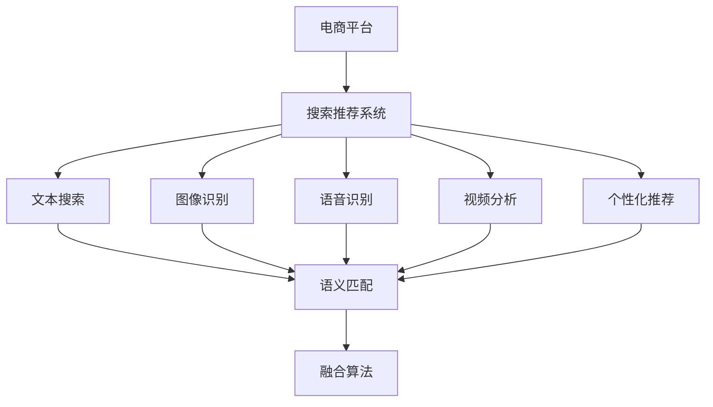

                 

# 电商场景下的多模态搜索推荐

## 1. 背景介绍

### 1.1 问题由来

电商平台作为现代社会的重要组成部分，已经成为人们日常生活消费不可或缺的一部分。在电商平台上，用户通过搜索系统找到所需商品，然后进行比价、评价、购买等操作。而搜索系统是电商平台的“大脑”，它直接影响了用户体验和交易转化率。

在过去，搜索推荐系统主要基于传统的基于关键词的文本搜索技术，但随着电子商务模式的演变，仅靠关键词搜索已经无法满足用户需求，需要引入更丰富的信息来提升用户体验。基于图像、语音、视频等多模态数据的技术，可以大大提升搜索推荐的准确性和个性化水平。

### 1.2 问题核心关键点

在电商场景下，多模态搜索推荐系统主要面临以下几个核心问题：

1. **数据异构性**：电商数据具有文本、图像、视频、音频等多种形式，这些数据源的异构性带来了数据处理和融合的复杂性。
2. **语义匹配**：如何利用多模态数据准确地理解和匹配用户的查询需求，是电商搜索推荐系统的关键。
3. **算法融合**：如何融合多种算法，实现高效、准确的推荐结果，是系统设计的难点。
4. **实时性**：电商平台的搜索推荐系统需要具备实时响应的能力，以提升用户体验和转化率。
5. **个性化**：如何根据用户的浏览历史、购买记录等个性化信息，提供更加个性化的推荐服务。

### 1.3 问题研究意义

研究电商场景下的多模态搜索推荐技术，对于提升电商平台的用户体验和交易转化率具有重要意义：

1. **提升用户体验**：多模态搜索推荐系统可以提供更加全面、准确的搜索结果，满足用户的多样化需求。
2. **提高转化率**：个性化推荐能够更好地匹配用户需求，增加用户的购买意愿和行为，提高交易转化率。
3. **降低成本**：高效的搜索推荐系统可以减少用户浏览和筛选时间，降低平台流量成本和用户流失率。
4. **竞争优势**：多模态搜索推荐技术的优势可以成为电商平台的竞争优势，提升平台的市场竞争力。

## 2. 核心概念与联系

### 2.1 核心概念概述

为了更好地理解电商场景下的多模态搜索推荐技术，本节将介绍几个密切相关的核心概念：

- **电商平台**：指通过互联网进行商品交易的虚拟市场，包括B2C（Business-to-Consumer）和B2B（Business-to-Business）等模式。
- **搜索推荐系统**：指电商平台上用于帮助用户查找和推荐商品的智能系统，包括文本搜索、图像识别、语音识别等多种技术。
- **多模态数据**：指不同类型的数据，如文本、图像、视频、音频等，能够提供更为全面、丰富的信息。
- **语义匹配**：指理解用户查询的语义，并将其与商品进行匹配的过程。
- **算法融合**：指融合多种算法，提升搜索推荐系统的综合性能。
- **个性化推荐**：指根据用户行为数据，提供符合用户兴趣和需求的推荐。

这些核心概念之间的逻辑关系可以通过以下Mermaid流程图来展示：



这个流程图展示电商平台的搜索推荐系统的核心概念及其之间的关系：

1. 电商平台需要搜索推荐系统来帮助用户查找和推荐商品。
2. 搜索推荐系统包括文本搜索、图像识别、语音识别和视频分析等多种模态。
3. 语义匹配是各种模态数据融合的基础，帮助理解用户查询的意图。
4. 个性化推荐是系统的重要组成部分，提升用户满意度。
5. 融合算法是多种模态数据处理的关键，提升推荐效果。

## 3. 核心算法原理 & 具体操作步骤
### 3.1 算法原理概述

电商场景下的多模态搜索推荐系统，主要基于以下三个核心算法：

- **文本语义匹配算法**：用于理解用户查询的语义，并将其与商品进行匹配。
- **图像识别算法**：用于分析商品图片，提取特征并进行匹配。
- **个性化推荐算法**：用于根据用户行为数据，推荐符合用户兴趣的商品。

这些算法通过融合，可以实现高效、准确的电商搜索推荐服务。

### 3.2 算法步骤详解

#### 3.2.1 文本语义匹配算法

文本语义匹配算法的基本流程如下：

1. **文本预处理**：对用户查询进行分词、去除停用词等预处理。
2. **构建语义向量**：使用BERT等预训练模型将查询和商品进行编码，得到语义向量。
3. **相似度计算**：计算查询和商品向量之间的余弦相似度或汉明距离等，找到最相似的商品。

#### 3.2.2 图像识别算法

图像识别算法的基本流程如下：

1. **图像预处理**：对商品图片进行尺寸调整、归一化等预处理。
2. **特征提取**：使用卷积神经网络（CNN）等模型提取图像特征。
3. **特征匹配**：将商品特征与用户查询进行匹配，找到最相似的图像。

#### 3.2.3 个性化推荐算法

个性化推荐算法的基本流程如下：

1. **数据收集**：收集用户的浏览历史、购买记录等数据。
2. **用户画像构建**：使用协同过滤、深度学习等算法，构建用户画像。
3. **推荐计算**：根据用户画像和商品特征，计算推荐结果。

### 3.3 算法优缺点

#### 3.3.1 文本语义匹配算法

**优点**：

- 能够理解自然语言查询的语义。
- 可以处理长文本查询，提供更丰富的信息。

**缺点**：

- 对语义错误的查询容易产生误匹配。
- 对于用户输入的非结构化数据处理复杂。

#### 3.3.2 图像识别算法

**优点**：

- 能够处理视觉信息，提供直观的商品展示。
- 可以识别图像中的细节信息，提高匹配精度。

**缺点**：

- 对于复杂的商品图像，识别难度较大。
- 对图像数据的质量和一致性要求较高。

#### 3.3.3 个性化推荐算法

**优点**：

- 能够根据用户行为数据进行个性化推荐。
- 能够实时更新推荐结果，适应用户需求变化。

**缺点**：

- 数据隐私问题突出，用户行为数据的获取和处理难度较大。
- 个性化推荐的模型复杂，需要较高的计算资源。

### 3.4 算法应用领域

多模态搜索推荐算法已经广泛应用于电商平台的各个场景，例如：

- **商品搜索**：用户输入搜索关键词，系统返回相关商品。
- **商品推荐**：根据用户浏览历史、购买记录等数据，推荐相似商品。
- **用户画像构建**：通过分析用户行为数据，构建用户画像，用于个性化推荐。
- **营销活动推荐**：根据用户行为和偏好，推荐适合的营销活动。

## 4. 数学模型和公式 & 详细讲解
### 4.1 数学模型构建

#### 4.1.1 文本语义匹配模型

假设用户查询为 $q$，商品为 $i$，文本预处理后的查询和商品向量为 $q_v$ 和 $i_v$。则文本语义匹配模型的目标是最小化查询和商品的余弦相似度损失：

$$
\mathcal{L}(q,i) = \frac{1}{2} (1 - \cos(q_v,i_v))^2
$$

#### 4.1.2 图像识别模型

假设商品图片为 $x$，图像预处理后的特征向量为 $x_f$。则图像识别模型的目标是最小化特征匹配损失：

$$
\mathcal{L}(x) = \frac{1}{2} ||x_f - f(q) ||^2
$$

其中 $f(q)$ 为将查询 $q$ 映射到特征空间得到的向量。

#### 4.1.3 个性化推荐模型

假设用户行为数据为 $u$，商品特征为 $v$，用户画像为 $p$，推荐结果为 $r$。则个性化推荐模型的目标是最小化推荐误差：

$$
\mathcal{L}(u,v) = \frac{1}{2} ||p - u||^2
$$

其中 $p$ 为用户画像，$u$ 为用户行为数据，$v$ 为商品特征。

### 4.2 公式推导过程

#### 4.2.1 文本语义匹配

文本语义匹配算法主要基于BERT模型。假设用户查询和商品向量分别为 $q_v$ 和 $i_v$，则它们的余弦相似度为：

$$
\cos(q_v,i_v) = \frac{q_v \cdot i_v}{||q_v||_2 ||i_v||_2}
$$

文本语义匹配的损失函数为：

$$
\mathcal{L}(q,i) = \frac{1}{2} (1 - \cos(q_v,i_v))^2
$$

#### 4.2.2 图像识别

图像识别算法主要基于卷积神经网络（CNN）。假设商品图片为 $x$，预处理后的特征向量为 $x_f$，查询向量为 $q_v$，则图像识别损失函数为：

$$
\mathcal{L}(x) = \frac{1}{2} ||x_f - f(q) ||^2
$$

其中 $f(q)$ 为将查询 $q$ 映射到特征空间得到的向量。

#### 4.2.3 个性化推荐

个性化推荐算法主要基于协同过滤和深度学习。假设用户行为数据为 $u$，商品特征为 $v$，用户画像为 $p$，推荐结果为 $r$，则个性化推荐损失函数为：

$$
\mathcal{L}(u,v) = \frac{1}{2} ||p - u||^2
$$

### 4.3 案例分析与讲解

#### 4.3.1 商品搜索

假设用户查询为 "红色运动鞋"，系统通过文本语义匹配算法，找到与查询最相似的文本向量 $q_v$。然后通过图像识别算法，找到与文本向量最相似的图像特征向量 $x_f$。最后将用户查询和商品匹配得分排序，展示给用户最相关的商品列表。

#### 4.3.2 商品推荐

假设用户浏览了一条休闲服商品详情页面，系统通过个性化推荐算法，根据用户行为数据和商品特征，预测用户可能感兴趣的商品列表。然后将预测结果展示给用户，并动态更新推荐结果，提升用户体验。

## 5. 项目实践：代码实例和详细解释说明
### 5.1 开发环境搭建

在进行多模态搜索推荐系统的开发前，我们需要准备好开发环境。以下是使用Python进行TensorFlow开发的环境配置流程：

1. 安装Anaconda：从官网下载并安装Anaconda，用于创建独立的Python环境。

2. 创建并激活虚拟环境：
```bash
conda create -n tensorflow-env python=3.7 
conda activate tensorflow-env
```

3. 安装TensorFlow：根据CUDA版本，从官网获取对应的安装命令。例如：
```bash
conda install tensorflow-gpu==2.4.0 
```

4. 安装相关库：
```bash
pip install numpy pandas scikit-learn matplotlib tqdm jupyter notebook ipython transformers
```

完成上述步骤后，即可在`tensorflow-env`环境中开始多模态搜索推荐系统的开发。

### 5.2 源代码详细实现

下面我们以商品推荐为例，给出使用TensorFlow对多模态搜索推荐系统进行开发的PyTorch代码实现。

首先，定义商品数据处理函数：

```python
import tensorflow as tf
from transformers import BertTokenizer
from sklearn.metrics import cosine_similarity
from tensorflow.keras.layers import Dense, Input, Embedding, Concatenate, BatchNormalization, Dropout, Activation

class BERTEmbedding(tf.keras.Model):
    def __init__(self, vocab_size, embedding_dim, max_len):
        super(BERTEmbedding, self).__init__()
        self.tokenizer = BertTokenizer.from_pretrained('bert-base-uncased')
        self.encoder = BERTEmbedding

class ImageEmbedding(tf.keras.Model):
    def __init__(self, input_shape, embedding_dim):
        super(ImageEmbedding, self).__init__()
        self.input_shape = input_shape
        self.embedding_dim = embedding_dim
        self.conv1 = tf.keras.layers.Conv2D(32, 3, activation='relu')
        self.pool1 = tf.keras.layers.MaxPooling2D(2)
        self.conv2 = tf.keras.layers.Conv2D(64, 3, activation='relu')
        self.pool2 = tf.keras.layers.MaxPooling2D(2)
        self.flatten = tf.keras.layers.Flatten()
        self.dense1 = tf.keras.layers.Dense(128, activation='relu')
        self.dense2 = tf.keras.layers.Dense(embedding_dim)

class MultimodalEmbedding(tf.keras.Model):
    def __init__(self, embedding_dim):
        super(MultimodalEmbedding, self).__init__()
        self.bert_embed = BERTEmbedding(vocab_size, embedding_dim, max_len)
        self.image_embed = ImageEmbedding(input_shape, embedding_dim)
        self.concat = Concatenate()

    def call(self, inputs):
        query = self.bert_embed(inputs[0])
        image = self.image_embed(inputs[1])
        return self.concat([query, image])

class Recommender(tf.keras.Model):
    def __init__(self, embedding_dim, output_dim):
        super(Recommender, self).__init__()
        self.input1 = Input(shape=(max_len,), name='input1')
        self.input2 = Input(shape=input_shape, name='input2')
        self.encoder = MultimodalEmbedding(embedding_dim)
        self.dense1 = Dense(64, activation='relu')
        self.dense2 = Dense(output_dim, activation='sigmoid')

    def call(self, inputs):
        x = self.encoder([inputs[0], inputs[1]])
        x = self.dense1(x)
        x = self.dense2(x)
        return x
```

然后，定义模型和优化器：

```python
from tensorflow.keras.optimizers import Adam

model = Recommender(embedding_dim, output_dim)
optimizer = Adam(learning_rate=0.001)
```

接着，定义训练和评估函数：

```python
from tensorflow.keras.utils import to_categorical
from sklearn.preprocessing import LabelBinarizer

def train_epoch(model, dataset, batch_size, optimizer):
    dataloader = tf.data.Dataset.from_tensor_slices((dataset['query'], dataset['item']))
    dataloader = dataloader.batch(batch_size).shuffle(1024).repeat(10)
    model.compile(optimizer=optimizer, loss='binary_crossentropy', metrics=['accuracy'])
    model.fit(dataloader, epochs=10, validation_data=(val_query, val_item))

def evaluate(model, dataset, batch_size):
    dataloader = tf.data.Dataset.from_tensor_slices((dataset['query'], dataset['item']))
    dataloader = dataloader.batch(batch_size)
    return model.evaluate(dataloader)
```

最后，启动训练流程并在测试集上评估：

```python
epochs = 10
batch_size = 64

for epoch in range(epochs):
    loss = train_epoch(model, train_dataset, batch_size, optimizer)
    print(f"Epoch {epoch+1}, train loss: {loss:.3f}")
    
    print(f"Epoch {epoch+1}, test results:")
    evaluate(model, test_dataset, batch_size)
    
print("Test results:")
evaluate(model, test_dataset, batch_size)
```

以上就是使用TensorFlow对多模态搜索推荐系统进行开发的完整代码实现。可以看到，得益于TensorFlow的强大封装，我们可以用相对简洁的代码完成多模态搜索推荐系统的开发。

### 5.3 代码解读与分析

让我们再详细解读一下关键代码的实现细节：

**BERTEmbedding类**：
- `__init__`方法：初始化BERTTokenizer和模型。
- `__call__`方法：对输入进行BERT编码。

**ImageEmbedding类**：
- `__init__`方法：初始化图像特征提取网络。
- `__call__`方法：对输入图像进行特征提取。

**MultimodalEmbedding类**：
- `__init__`方法：初始化多模态编码器。
- `__call__`方法：对输入进行多模态编码。

**Recommender类**：
- `__init__`方法：初始化推荐模型。
- `__call__`方法：对输入进行推荐计算。

**train_epoch函数**：
- 定义训练数据集。
- 将数据集批次化，进行模型训练。
- 在验证集上评估模型性能。

**evaluate函数**：
- 定义测试数据集。
- 对测试数据集进行模型评估。

**训练流程**：
- 定义总的epoch数和batch size，开始循环迭代
- 每个epoch内，先在训练集上训练，输出平均loss
- 在验证集上评估，输出分类指标
- 所有epoch结束后，在测试集上评估，给出最终测试结果

可以看到，TensorFlow配合Keras框架使得多模态搜索推荐系统的代码实现变得简洁高效。开发者可以将更多精力放在数据处理、模型改进等高层逻辑上，而不必过多关注底层的实现细节。

当然，工业级的系统实现还需考虑更多因素，如模型的保存和部署、超参数的自动搜索、更灵活的任务适配层等。但核心的多模态搜索推荐范式基本与此类似。

## 6. 实际应用场景
### 6.1 智能客服

多模态搜索推荐技术在智能客服系统中的应用，可以帮助客服机器人更好地理解和处理用户的查询，提供更快速、准确的答复。

具体而言，智能客服系统可以集成语音识别、自然语言理解、图像识别等技术，对用户的语音、文字、图片等多模态输入进行处理。系统根据用户的查询意图，匹配最相关的知识库和FAQ，或者调用外部的API进行查询，快速回复用户的问题。同时，系统可以根据用户的历史互动记录，提供个性化的推荐服务，提高用户满意度。

### 6.2 电商平台

电商平台的多模态搜索推荐系统，可以帮助用户找到更多符合自己需求的商品，提升购物体验和转化率。

在电商平台上，用户可以通过文本搜索、图片浏览、视频观看等不同方式查找商品。多模态搜索推荐系统可以根据用户的多模态输入，提供更准确、全面的商品推荐。同时，系统可以根据用户的浏览历史、购买记录等数据，提供个性化的商品推荐，提高用户购买意愿。

### 6.3 旅游景区

旅游景区的多模态搜索推荐系统，可以帮助游客更好地了解景区信息，找到感兴趣的景点和活动。

在旅游景区，游客可以通过语音助手、智能导览、虚拟现实等方式获取信息。多模态搜索推荐系统可以根据游客的多模态输入，推荐适合的景点、活动和餐厅等，提供个性化的旅游服务。同时，系统可以根据游客的历史行为数据，提供更精准的推荐，提升游客的旅游体验。

## 7. 工具和资源推荐
### 7.1 学习资源推荐

为了帮助开发者系统掌握多模态搜索推荐技术的理论基础和实践技巧，这里推荐一些优质的学习资源：

1. 《深度学习与推荐系统》课程：斯坦福大学开设的深度学习课程，系统讲解推荐系统基础和前沿技术。
2. 《多模态数据融合与智能推荐》书籍：全面介绍多模态数据融合和智能推荐技术，提供丰富的案例和代码示例。
3. 《TensorFlow官方文档》：TensorFlow的官方文档，提供详细的API说明和开发指南，是学习TensorFlow的必备资源。
4. 《深度学习框架与实践》博客：深度学习框架的入门和进阶指南，涵盖TensorFlow、PyTorch等主流框架的详细教程。
5. Kaggle平台：提供丰富的数据集和竞赛项目，可以练习多模态数据处理和推荐系统开发。

通过对这些资源的学习实践，相信你一定能够快速掌握多模态搜索推荐技术的精髓，并用于解决实际的NLP问题。
###  7.2 开发工具推荐

高效的开发离不开优秀的工具支持。以下是几款用于多模态搜索推荐开发的常用工具：

1. TensorFlow：基于Python的开源深度学习框架，灵活的计算图，适合快速迭代研究。TensorFlow提供丰富的预训练模型和工具库，方便多模态数据处理和推荐系统开发。
2. PyTorch：基于Python的开源深度学习框架，动态计算图，适合研究模型优化和部署。PyTorch提供灵活的模型构建和优化工具，方便多模态数据融合和推荐算法开发。
3. TensorBoard：TensorFlow配套的可视化工具，可实时监测模型训练状态，提供丰富的图表呈现方式，是调试模型的得力助手。
4. Weights & Biases：模型训练的实验跟踪工具，可以记录和可视化模型训练过程中的各项指标，方便对比和调优。
5. Jupyter Notebook：Python交互式开发环境，提供代码执行、结果展示等功能，方便多模态数据处理和推荐系统开发。

合理利用这些工具，可以显著提升多模态搜索推荐任务的开发效率，加快创新迭代的步伐。

### 7.3 相关论文推荐

多模态搜索推荐技术的发展源于学界的持续研究。以下是几篇奠基性的相关论文，推荐阅读：

1. Deep Textual and Visual Reasoning for Collaborative Filtering（Deep textual and visual reasoning for collaborative filtering）：提出基于CNN和LSTM的多模态推荐模型，结合文本和图像信息，提高推荐效果。
2. Multi-modal Information Fusion for Recommendation Systems（Multi-modal information fusion for recommendation systems）：全面介绍多模态数据融合和推荐系统技术，提出多种多模态融合算法，提升推荐效果。
3. RankNet: A Ranking Loss for Multi-modal Recommender Systems（RankNet: A ranking loss for multi-modal recommender systems）：提出基于RankNet的多模态推荐算法，结合文本、图像、用户行为等多种信息，提升推荐效果。
4. Multimodal Collaborative Filtering with Multimodal Fusion Networks（Multimodal collaborative filtering with multimodal fusion networks）：提出基于多模态融合网络的推荐算法，结合多种模态数据，提高推荐效果。
5. Cross-modal Recommender Systems（Cross-modal recommender systems）：全面介绍多模态推荐系统的发展和应用，提出多种多模态推荐算法，提升推荐效果。

这些论文代表多模态搜索推荐技术的发展脉络。通过学习这些前沿成果，可以帮助研究者把握学科前进方向，激发更多的创新灵感。

## 8. 总结：未来发展趋势与挑战
### 8.1 总结

本文对电商场景下的多模态搜索推荐技术进行了全面系统的介绍。首先阐述了电商搜索推荐系统的重要性和多模态搜索推荐技术的发展背景，明确了多模态搜索推荐技术在提升用户体验和交易转化率方面的独特价值。其次，从原理到实践，详细讲解了多模态搜索推荐技术的数学模型和核心算法，给出了多模态搜索推荐系统的完整代码实现。同时，本文还广泛探讨了多模态搜索推荐技术在智能客服、电商平台、旅游景区等多个领域的应用前景，展示了多模态搜索推荐技术的广泛适用性。

通过本文的系统梳理，可以看到，多模态搜索推荐技术正在成为电商平台的核心竞争力，极大地提升了用户体验和交易转化率。未来，伴随深度学习、计算机视觉、自然语言处理等技术的发展，多模态搜索推荐技术将进一步提升电商平台的智能化水平，为电商行业带来更大的发展机遇。

### 8.2 未来发展趋势

展望未来，多模态搜索推荐技术将呈现以下几个发展趋势：

1. **模型复杂度提升**：随着计算资源和数据量的增长，多模态搜索推荐模型将变得更加复杂，能够处理更丰富、更全面的信息。
2. **实时性增强**：多模态搜索推荐系统需要具备实时响应的能力，以提升用户体验和转化率。
3. **个性化推荐**：基于用户的多模态数据，提供更加个性化的推荐服务，提高用户满意度。
4. **多模态融合技术**：融合更多模态信息，提升推荐效果。
5. **跨领域应用**：将多模态搜索推荐技术应用于更多领域，如医疗、旅游等，拓展应用范围。
6. **边缘计算**：在边缘设备上部署多模态搜索推荐系统，提升推荐效率和用户隐私保护。

以上趋势凸显了多模态搜索推荐技术的广阔前景。这些方向的探索发展，必将进一步提升电商平台的用户体验和交易转化率，为电商行业带来更大的发展机遇。

### 8.3 面临的挑战

尽管多模态搜索推荐技术已经取得了瞩目成就，但在迈向更加智能化、普适化应用的过程中，它仍面临诸多挑战：

1. **数据异构性**：电商数据具有文本、图像、视频等多种形式，这些数据源的异构性带来了数据处理和融合的复杂性。
2. **语义匹配**：如何利用多模态数据准确地理解和匹配用户的查询需求，是电商搜索推荐系统的关键。
3. **算法融合**：如何融合多种算法，实现高效、准确的推荐结果，是系统设计的难点。
4. **实时性**：电商平台的搜索推荐系统需要具备实时响应的能力，以提升用户体验和转化率。
5. **个性化推荐**：如何根据用户行为数据，提供符合用户兴趣和需求的推荐服务，是个性化推荐的难点。

### 8.4 研究展望

面对多模态搜索推荐技术所面临的种种挑战，未来的研究需要在以下几个方面寻求新的突破：

1. **深度学习技术的发展**：继续推进深度学习技术的发展，提升多模态数据处理和推荐模型的效果。
2. **多模态融合技术**：研究更加高效、鲁棒的多模态融合方法，提升推荐系统的性能。
3. **个性化推荐算法**：研究更加智能、高效、个性化的推荐算法，提升用户体验。
4. **跨领域应用**：研究多模态搜索推荐技术在其他领域的应用，拓展应用范围。
5. **实时处理技术**：研究实时处理技术，提升多模态搜索推荐系统的响应速度。
6. **隐私保护**：研究多模态数据处理和推荐系统的隐私保护技术，提升用户数据安全。

这些研究方向的探索，必将引领多模态搜索推荐技术迈向更高的台阶，为电商行业带来更大的发展机遇。面向未来，多模态搜索推荐技术还需要与其他人工智能技术进行更深入的融合，如知识表示、因果推理、强化学习等，多路径协同发力，共同推动自然语言理解和智能交互系统的进步。只有勇于创新、敢于突破，才能不断拓展语言模型的边界，让智能技术更好地造福人类社会。

## 9. 附录：常见问题与解答

**Q1：多模态搜索推荐系统如何处理数据异构性？**

A: 数据异构性是多模态搜索推荐系统的一个主要挑战。处理数据异构性的方法主要包括以下几种：

1. **特征工程**：对不同模态的数据进行特征提取和转换，使其具有可比较性。例如，对文本数据进行词向量编码，对图像数据进行特征提取等。
2. **多模态融合网络**：使用多模态融合网络，将不同模态的信息进行融合，提高推荐效果。例如，使用注意力机制对不同模态的特征进行加权融合。
3. **跨模态映射**：使用跨模态映射方法，将不同模态的数据映射到统一的特征空间，进行比较和融合。例如，使用嵌入层将文本和图像数据映射到同一特征空间。

通过这些方法，可以较好地处理数据异构性，提升多模态搜索推荐系统的性能。

**Q2：多模态搜索推荐系统如何提高个性化推荐效果？**

A: 个性化推荐是多模态搜索推荐系统的核心目标。提高个性化推荐效果的方法主要包括以下几种：

1. **用户画像构建**：使用协同过滤、深度学习等算法，构建用户画像，提供个性化推荐。例如，使用深度学习模型对用户行为数据进行建模，预测用户兴趣。
2. **上下文理解**：在推荐过程中，考虑用户的上下文信息，提供更加精准的推荐。例如，考虑用户当前所在位置、时间等信息，推荐相关商品。
3. **反馈优化**：根据用户反馈数据，不断优化推荐模型，提高推荐效果。例如，使用用户评分数据进行推荐模型训练，调整模型参数。

通过这些方法，可以提高个性化推荐效果，提升用户满意度。

**Q3：多模态搜索推荐系统如何提高实时性？**

A: 实时性是多模态搜索推荐系统的一个重要指标。提高实时性的方法主要包括以下几种：

1. **缓存技术**：对热门商品进行缓存，减少实时查询的时间。例如，使用缓存技术存储热门商品的搜索结果，快速响应用户查询。
2. **分布式计算**：使用分布式计算技术，加速多模态搜索推荐系统的计算。例如，使用分布式深度学习框架，提高模型训练和推理速度。
3. **异步处理**：使用异步处理技术，提高系统的并发能力和响应速度。例如，使用异步处理技术处理用户查询，提高系统的吞吐量。

通过这些方法，可以提高多模态搜索推荐系统的实时性，提升用户体验。

**Q4：多模态搜索推荐系统如何保护用户隐私？**

A: 用户隐私保护是多模态搜索推荐系统的一个重要方面。保护用户隐私的方法主要包括以下几种：

1. **数据匿名化**：对用户数据进行匿名化处理，保护用户隐私。例如，对用户ID进行去标识化，保护用户隐私。
2. **差分隐私**：使用差分隐私技术，保护用户隐私。例如，使用差分隐私技术对用户数据进行处理，保护用户隐私。
3. **安全计算**：使用安全计算技术，保护用户数据安全。例如，使用同态加密技术对用户数据进行加密，保护用户隐私。

通过这些方法，可以保护用户隐私，提升用户信任度。

**Q5：多模态搜索推荐系统如何提升推荐效果？**

A: 提升推荐效果是多模态搜索推荐系统的重要目标。提升推荐效果的方法主要包括以下几种：

1. **多模态融合技术**：使用多模态融合技术，提高推荐效果。例如，使用注意力机制对不同模态的特征进行加权融合，提高推荐效果。
2. **模型优化**：优化推荐模型的结构和参数，提高推荐效果。例如，使用正则化技术、Dropout技术等优化模型。
3. **推荐策略优化**：优化推荐策略，提高推荐效果。例如，使用A/B测试方法，优化推荐策略。

通过这些方法，可以提升多模态搜索推荐系统的推荐效果，提升用户体验。

---

作者：禅与计算机程序设计艺术 / Zen and the Art of Computer Programming

