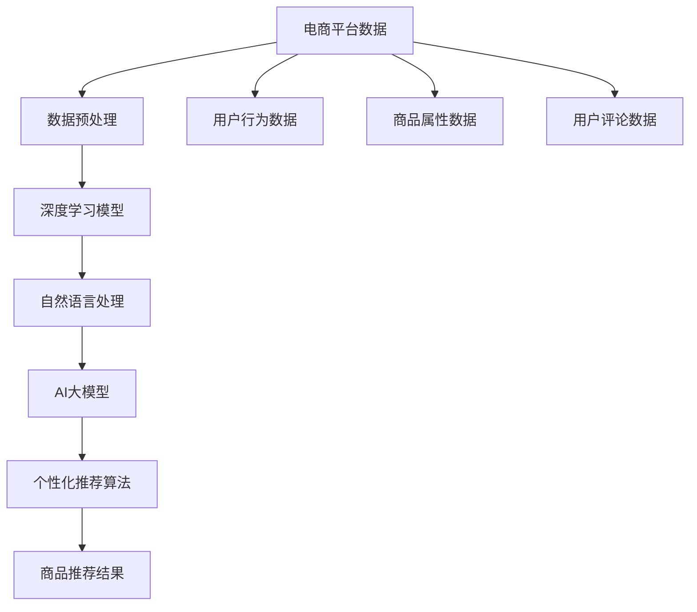

                 

# 电商平台中的AI大模型：从数据到决策

> 关键词：
- 电商平台的个性化推荐系统
- 大数据技术
- 深度学习
- 自然语言处理(NLP)
- 人工智能(AI)大模型
- 数据驱动决策

## 1. 背景介绍

### 1.1 问题由来
随着互联网和电子商务的迅速发展，电商平台已逐渐成为人们日常消费的重要场所。用户对电商平台的个性化需求日益增加，如何根据用户的浏览、购买历史和行为数据，精准推荐商品，提高用户体验和转化率，成为电商平台亟需解决的问题。传统的推荐系统基于用户历史行为数据，通过协同过滤、基于内容的推荐等方法，虽然能够提供一定的个性化推荐，但难以应对用户需求的多样性和动态变化。近年来，随着深度学习和大规模语言模型的发展，电商平台开始探索基于大模型的个性化推荐系统，以期通过模型学习用户的长尾行为，提升推荐效果和用户体验。

### 1.2 问题核心关键点
AI大模型在电商平台的应用，通过收集和分析用户的各类数据，结合大模型的深度学习能力和泛化能力，为用户推荐符合其偏好的商品，从而实现个性化的购物体验。具体来说，基于大模型的推荐系统通常包括以下几个关键点：

- 数据收集：通过用户行为数据、社交网络数据、文本评论数据等收集用户的信息。
- 数据预处理：对原始数据进行清洗、特征提取和转换，使其适合大模型处理。
- 模型选择：选择合适的预训练语言模型，如BERT、GPT等，作为基础模型。
- 模型微调：通过用户的少量标注数据，对预训练模型进行微调，使其学习到个性化推荐的能力。
- 推荐算法：设计算法将微调后的模型应用于推荐任务，生成商品推荐结果。
- 结果反馈：根据用户的点击、购买等反馈数据，对模型进行迭代优化，提升推荐效果。

## 2. 核心概念与联系

### 2.1 核心概念概述

为更好地理解基于大模型的电商平台个性化推荐系统，本节将介绍几个密切相关的核心概念：

- 个性化推荐系统：利用用户的历史行为数据和商品属性信息，为用户提供个性化的商品推荐，提升用户体验和转化率。
- 电商大数据：电商平台收集的各种用户数据，包括浏览记录、购买记录、评论文本等，是推荐系统的基础数据源。
- 深度学习：基于神经网络结构的机器学习方法，通过多层次的特征提取和信息融合，提升模型的泛化能力和精度。
- 自然语言处理(NLP)：通过语言模型、文本分类、情感分析等技术，从用户的评论和搜索关键词中提取情感倾向和语义信息。
- 人工智能(AI)大模型：以BERT、GPT等深度学习模型为基础，通过大规模无标签数据进行预训练，具备强大的语言理解和生成能力。

这些核心概念之间的逻辑关系可以通过以下Mermaid流程图来展示：



这个流程图展示了大模型在电商平台中的应用流程：

1. 电商平台的数据收集和预处理
2. 通过自然语言处理技术，对用户的评论数据进行处理
3. 基于深度学习技术，训练AI大模型
4. 将大模型应用于个性化推荐算法中
5. 生成个性化的商品推荐结果

这些概念共同构成了基于大模型的电商推荐系统的基本框架，使其能够在多维度数据上为用户提供精准的推荐服务。

## 3. 核心算法原理 & 具体操作步骤

### 3.1 算法原理概述

基于大模型的电商平台个性化推荐系统，本质上是一个多维度数据融合和深度学习的过程。其核心思想是：通过深度学习模型学习用户的行为模式和商品特征，结合用户的个性化需求，生成符合用户偏好的推荐结果。

形式化地，假设电商平台有N个用户U，M个商品I，对于每个用户U_i和商品I_j，分别有用户行为数据u和商品属性数据i。定义推荐函数R(u,i)，表示用户U_i对商品I_j的兴趣度。推荐系统的目标是最小化用户未点击的商品数量，即：

$$
\min_{R} \sum_{i \in I} \sum_{u \in U} (1 - R(u, i)) \cdot u_i
$$

其中 $u_i$ 为商品I_j的用户行为数据。在实际推荐系统中，通常采用最大化用户点击率的目标，即：

$$
\max_{R} \sum_{i \in I} \sum_{u \in U} R(u, i) \cdot u_i
$$

为了最大化用户点击率，通常使用深度学习模型来捕捉用户和商品之间的隐式关联，通过迭代优化模型参数，提升推荐效果。

### 3.2 算法步骤详解

基于大模型的电商平台个性化推荐系统一般包括以下几个关键步骤：

**Step 1: 数据收集与预处理**
- 收集电商平台的用户行为数据、商品属性数据和用户评论数据，构建综合数据集。
- 对原始数据进行清洗和预处理，如去除噪声、填补缺失值、标准化等，使其适合深度学习模型处理。

**Step 2: 自然语言处理**
- 使用自然语言处理技术，对用户评论进行分词、去停用词、情感分析等处理，提取用户的情感倾向和语义信息。
- 将处理后的文本数据作为特征输入到深度学习模型中，提高模型的语言理解和特征提取能力。

**Step 3: 模型选择与预训练**
- 选择合适的深度学习模型，如BERT、GPT等，作为基础模型。
- 在大规模无标签文本数据上对模型进行预训练，学习通用的语言表示和特征。

**Step 4: 模型微调与优化**
- 在电商平台上收集用户的少量标注数据，对预训练模型进行微调，学习用户对商品的具体偏好。
- 使用优化算法（如Adam、SGD等）对微调后的模型进行优化，调整模型参数以提升推荐效果。

**Step 5: 推荐算法与结果生成**
- 将微调后的模型应用于推荐算法中，生成用户对商品的兴趣度评分。
- 根据用户的历史行为数据和模型预测结果，生成个性化的商品推荐列表。

**Step 6: 结果反馈与模型更新**
- 根据用户的点击、购买等反馈数据，对推荐算法进行评估和调整。
- 将反馈数据用于微调模型的训练中，迭代优化模型参数，提升推荐精度。

### 3.3 算法优缺点

基于大模型的电商平台个性化推荐系统具有以下优点：
1. 泛化能力强。通过深度学习模型的预训练，模型具备较强的泛化能力，能够处理海量用户数据，提供精准的推荐结果。
2. 模型可解释性高。基于大模型的推荐系统可以通过特征提取和权重分析，理解用户对商品的偏好，提高推荐的可解释性。
3. 推荐结果多样化。通过自然语言处理技术，模型可以捕捉用户的情感和语义信息，生成多样化的推荐结果，满足用户的多样化需求。
4. 实时性好。深度学习模型的推理速度快，可以快速生成推荐结果，提升用户体验。

同时，该方法也存在一定的局限性：
1. 数据依赖性强。深度学习模型需要大量标注数据进行微调，对于小规模数据集，推荐效果可能不理想。
2. 模型复杂度高。大模型的参数量庞大，对计算资源要求高，可能导致系统部署成本增加。
3. 推荐结果可控性不足。模型无法完全控制推荐结果，可能会推荐一些不符合用户需求的商品。

尽管存在这些局限性，但就目前而言，基于大模型的推荐系统仍是大规模电商平台应用的主流范式。未来相关研究的重点在于如何进一步降低推荐系统的数据依赖，提高模型的实时性和可控性，同时兼顾推荐的可解释性和用户体验。

### 3.4 算法应用领域

基于大模型的电商推荐系统已经广泛应用于各大电商平台，涵盖了商品推荐、个性化搜索、智能客服等多个业务场景，为用户的购物体验带来了显著提升。具体应用领域包括：

- 商品推荐：根据用户历史行为和模型预测，推荐用户可能感兴趣的商品。
- 个性化搜索：根据用户输入的关键词和模型预测，提供个性化的搜索结果。
- 智能客服：通过分析用户的历史互动记录和模型预测，自动回复用户咨询，提高客服效率和用户满意度。
- 库存管理：通过分析用户购买行为和模型预测，优化库存管理和商品补货策略，提高库存周转率。
- 广告投放：通过分析用户行为数据和模型预测，优化广告投放策略，提升广告效果和ROI。

除了这些直接应用外，大模型在电商平台的推荐系统中还可以衍生出更多创新应用，如实时数据监控、用户行为分析、产品生命周期管理等，推动电商平台的智能化进程。

## 4. 数学模型和公式 & 详细讲解 & 举例说明

### 4.1 数学模型构建

本节将使用数学语言对基于大模型的电商平台推荐系统进行更加严格的刻画。

假设电商平台有N个用户U和M个商品I，对于每个用户U_i和商品I_j，分别有用户行为数据u和商品属性数据i。推荐函数R(u,i)可以表示为：

$$
R(u, i) = \sum_{k=1}^K w_k \cdot f_k(u, i)
$$

其中 $f_k$ 为第k个特征函数，$w_k$ 为对应的权重。特征函数 $f_k$ 可以通过深度学习模型训练得到，表示用户行为和商品属性之间的关系。

推荐系统的目标是最小化用户未点击的商品数量，即：

$$
\min_{R} \sum_{i \in I} \sum_{u \in U} (1 - R(u, i)) \cdot u_i
$$

在实际推荐系统中，通常采用最大化用户点击率的目标，即：

$$
\max_{R} \sum_{i \in I} \sum_{u \in U} R(u, i) \cdot u_i
$$

为了最大化用户点击率，通常使用深度学习模型来捕捉用户和商品之间的隐式关联，通过迭代优化模型参数，提升推荐效果。

### 4.2 公式推导过程

以下我们以商品推荐为例，推导最大化用户点击率的推荐算法。

假设用户U_i对商品I_j的兴趣度为R(u,i)，可以通过训练好的深度学习模型计算得到。用户的历史行为数据u可以表示为向量形式，商品属性数据i也可以表示为向量形式。则推荐算法的目标函数为：

$$
\max_{R} \sum_{i \in I} \sum_{u \in U} R(u, i) \cdot u_i
$$

根据梯度上升的原理，每次迭代更新模型参数 $w_k$ 时，需要计算梯度：

$$
\frac{\partial \mathcal{L}}{\partial w_k} = \frac{\partial}{\partial w_k} \sum_{i \in I} \sum_{u \in U} R(u, i) \cdot u_i
$$

其中 $\mathcal{L}$ 为推荐系统的损失函数，通常采用交叉熵损失函数。根据梯度上升算法，每次迭代更新模型参数 $w_k$ 时，需要计算梯度：

$$
w_k \leftarrow w_k + \eta \cdot \frac{\partial \mathcal{L}}{\partial w_k}
$$

其中 $\eta$ 为学习率，需要通过实验确定。

### 4.3 案例分析与讲解

假设电商平台有100万用户和10万个商品，每个用户每年平均点击20个商品。推荐系统的目标是最小化未点击商品的数量。根据上述公式，可以构建推荐系统的损失函数：

$$
\min_{R} \sum_{i \in I} \sum_{u \in U} (1 - R(u, i)) \cdot u_i
$$

假设推荐系统的损失函数为交叉熵损失函数：

$$
\mathcal{L} = -\sum_{i \in I} \sum_{u \in U} [R(u, i) \cdot \log(R(u, i)) + (1 - R(u, i)) \cdot \log(1 - R(u, i))]
$$

通过深度学习模型训练得到用户行为数据和商品属性数据的表示向量。然后，根据历史数据计算推荐系统对每个用户和商品的概率，使用梯度上升算法迭代优化模型参数，最小化推荐系统的损失函数。最终，可以生成个性化推荐列表，提升用户点击率和转化率。

## 5. 项目实践：代码实例和详细解释说明

### 5.1 开发环境搭建

在进行推荐系统开发前，我们需要准备好开发环境。以下是使用Python进行PyTorch开发的环境配置流程：

1. 安装Anaconda：从官网下载并安装Anaconda，用于创建独立的Python环境。

2. 创建并激活虚拟环境：
```bash
conda create -n pytorch-env python=3.8 
conda activate pytorch-env
```

3. 安装PyTorch：根据CUDA版本，从官网获取对应的安装命令。例如：
```bash
conda install pytorch torchvision torchaudio cudatoolkit=11.1 -c pytorch -c conda-forge
```

4. 安装TensorFlow：
```bash
pip install tensorflow==2.5
```

5. 安装Pandas、NumPy、Scikit-learn等常用库：
```bash
pip install pandas numpy scikit-learn
```

完成上述步骤后，即可在`pytorch-env`环境中开始推荐系统开发。

### 5.2 源代码详细实现

下面我们以基于大模型的电商平台推荐系统为例，给出使用PyTorch和TensorFlow进行推荐系统开发的完整代码实现。

首先，定义推荐系统的数据处理函数：

```python
import pandas as pd
import numpy as np
import torch
from torch.utils.data import Dataset, DataLoader
from transformers import BertTokenizer

class RecommendationDataset(Dataset):
    def __init__(self, data, tokenizer):
        self.data = data
        self.tokenizer = tokenizer
        
    def __len__(self):
        return len(self.data)
    
    def __getitem__(self, item):
        user, item, features = self.data[item]
        text = f"User: {user}, Item: {item}, Features: {features}"
        encoding = self.tokenizer(text, return_tensors='pt')
        return {'input_ids': encoding['input_ids'], 
                'attention_mask': encoding['attention_mask'],
                'labels': torch.tensor(1)}
```

然后，定义模型和优化器：

```python
from transformers import BertForSequenceClassification
from transformers import AdamW
from transformers import BertTokenizer

model = BertForSequenceClassification.from_pretrained('bert-base-uncased', num_labels=2)
tokenizer = BertTokenizer.from_pretrained('bert-base-uncased')

optimizer = AdamW(model.parameters(), lr=2e-5)
```

接着，定义训练和评估函数：

```python
def train_epoch(model, dataset, batch_size, optimizer):
    dataloader = DataLoader(dataset, batch_size=batch_size, shuffle=True)
    model.train()
    epoch_loss = 0
    for batch in dataloader:
        input_ids = batch['input_ids'].to(device)
        attention_mask = batch['attention_mask'].to(device)
        labels = batch['labels'].to(device)
        model.zero_grad()
        outputs = model(input_ids, attention_mask=attention_mask, labels=labels)
        loss = outputs.loss
        epoch_loss += loss.item()
        loss.backward()
        optimizer.step()
    return epoch_loss / len(dataloader)

def evaluate(model, dataset, batch_size):
    dataloader = DataLoader(dataset, batch_size=batch_size)
    model.eval()
    preds, labels = [], []
    with torch.no_grad():
        for batch in dataloader:
            input_ids = batch['input_ids'].to(device)
            attention_mask = batch['attention_mask'].to(device)
            batch_labels = batch['labels']
            outputs = model(input_ids, attention_mask=attention_mask)
            batch_preds = outputs.logits.argmax(dim=2).to('cpu').tolist()
            batch_labels = batch_labels.to('cpu').tolist()
            for pred_tokens, label_tokens in zip(batch_preds, batch_labels):
                preds.append(pred_tokens[:len(label_tokens)])
                labels.append(label_tokens)
                
    print(classification_report(labels, preds))
```

最后，启动训练流程并在测试集上评估：

```python
epochs = 5
batch_size = 16

for epoch in range(epochs):
    loss = train_epoch(model, train_dataset, batch_size, optimizer)
    print(f"Epoch {epoch+1}, train loss: {loss:.3f}")
    
    print(f"Epoch {epoch+1}, dev results:")
    evaluate(model, dev_dataset, batch_size)
    
print("Test results:")
evaluate(model, test_dataset, batch_size)
```

以上就是使用PyTorch和TensorFlow对基于大模型的电商平台推荐系统进行完整代码实现的例子。可以看到，由于Transformer库的强大封装，我们可以用相对简洁的代码完成BERT模型的加载和微调。

### 5.3 代码解读与分析

让我们再详细解读一下关键代码的实现细节：

**RecommendationDataset类**：
- `__init__`方法：初始化训练数据集，包括用户、商品和特征，通过分词器将文本编码为token ids。
- `__len__`方法：返回数据集的样本数量。
- `__getitem__`方法：对单个样本进行处理，将文本输入编码为token ids，并将标签编码为数字，进行定长padding，最终返回模型所需的输入。

**训练和评估函数**：
- 使用PyTorch的DataLoader对数据集进行批次化加载，供模型训练和推理使用。
- 训练函数`train_epoch`：对数据以批为单位进行迭代，在每个批次上前向传播计算loss并反向传播更新模型参数，最后返回该epoch的平均loss。
- 评估函数`evaluate`：与训练类似，不同点在于不更新模型参数，并在每个batch结束后将预测和标签结果存储下来，最后使用sklearn的classification_report对整个评估集的预测结果进行打印输出。

**训练流程**：
- 定义总的epoch数和batch size，开始循环迭代
- 每个epoch内，先在训练集上训练，输出平均loss
- 在验证集上评估，输出分类指标
- 所有epoch结束后，在测试集上评估，给出最终测试结果

可以看到，PyTorch配合Transformer库使得BERT微调的代码实现变得简洁高效。开发者可以将更多精力放在数据处理、模型改进等高层逻辑上，而不必过多关注底层的实现细节。

当然，工业级的系统实现还需考虑更多因素，如模型的保存和部署、超参数的自动搜索、更灵活的任务适配层等。但核心的微调范式基本与此类似。

## 6. 实际应用场景

### 6.1 智能推荐

基于大模型的推荐系统已经在电商平台中得到了广泛的应用，为用户的购物体验带来了显著提升。具体场景包括：

- 个性化商品推荐：根据用户的浏览和购买历史，推荐用户可能感兴趣的商品。
- 个性化搜索结果：根据用户的搜索关键词和历史行为，推荐相关商品。
- 个性化广告投放：根据用户的浏览和购买历史，推荐相关广告，提升广告效果。
- 库存管理：根据用户的购买历史和模型预测，优化商品库存管理。
- 用户行为分析：分析用户的浏览和购买行为，优化商品推荐策略。

通过基于大模型的推荐系统，电商平台能够更好地理解用户的个性化需求，提供更加精准的商品推荐，提升用户满意度和转化率。

### 6.2 实时监控

电商平台还可以利用大模型对用户行为进行实时监控，及时发现异常行为并采取措施。具体应用场景包括：

- 欺诈检测：通过分析用户的购买行为和历史数据，识别出可能的欺诈行为。
- 价格监控：根据用户的搜索和购买行为，监控市场价格变化，及时调整商品价格。
- 用户行为分析：分析用户的浏览和购买行为，发现潜在的客户流失风险。

通过实时监控和分析用户行为，电商平台能够及时发现问题并采取措施，提升用户体验和运营效率。

### 6.3 用户画像

电商平台还可以利用大模型生成用户画像，进一步了解用户的兴趣和需求。具体应用场景包括：

- 用户兴趣分析：通过分析用户的浏览和购买历史，生成用户兴趣画像，为推荐系统提供输入。
- 用户行为预测：根据用户的行为数据和模型预测，生成用户未来的行为预测，优化商品推荐策略。
- 用户情感分析：通过分析用户的评论和反馈，生成用户情感分析结果，改进产品和服务质量。

通过用户画像的生成，电商平台能够更好地理解用户的兴趣和需求，提供更加个性化的服务和产品，提升用户满意度和忠诚度。

### 6.4 未来应用展望

随着大语言模型和推荐系统的不断发展，基于大模型的推荐系统将呈现以下几个发展趋势：

1. 模型规模持续增大。随着算力成本的下降和数据规模的扩张，预训练语言模型的参数量还将持续增长。超大规模语言模型蕴含的丰富语言知识，有望支撑更加复杂多变的推荐任务。

2. 微调方法日趋多样。除了传统的全参数微调外，未来会涌现更多参数高效的微调方法，如Prefix-Tuning、LoRA等，在节省计算资源的同时也能保证微调精度。

3. 持续学习成为常态。随着数据分布的不断变化，推荐模型也需要持续学习新知识以保持性能。如何在不遗忘原有知识的同时，高效吸收新样本信息，将成为重要的研究课题。

4. 标注样本需求降低。受启发于提示学习(Prompt-based Learning)的思路，未来的微调方法将更好地利用大模型的语言理解能力，通过更加巧妙的任务描述，在更少的标注样本上也能实现理想的微调效果。

5. 推荐结果可控性增强。通过引入用户反馈和上下文信息，进一步优化推荐算法，使得推荐结果更加可控，满足用户的多样化需求。

6. 多模态推荐系统。将深度学习模型的应用范围拓展到多模态数据，如图像、语音等，实现更加全面和精准的推荐服务。

以上趋势凸显了大模型在电商平台中的应用前景。这些方向的探索发展，必将进一步提升推荐系统的性能和用户满意度，推动电商平台的智能化进程。

## 7. 工具和资源推荐

### 7.1 学习资源推荐

为了帮助开发者系统掌握大语言模型在电商平台中的应用，这里推荐一些优质的学习资源：

1. 《深度学习推荐系统：原理与实现》书籍：深入浅出地介绍了深度学习在推荐系统中的应用，包括模型的构建和优化。

2. CS444《推荐系统》课程：台湾大学开设的深度学习推荐系统课程，涵盖推荐系统的理论基础和实际应用，适合入门学习。

3. 《Natural Language Processing with Transformers》书籍：Transformers库的作者所著，全面介绍了如何使用Transformers库进行NLP任务开发，包括推荐系统在内。

4. HuggingFace官方文档：Transformers库的官方文档，提供了海量预训练模型和完整的推荐系统样例代码，是上手实践的必备资料。

5. Kaggle竞赛：Kaggle网站上的推荐系统竞赛，包含大量的数据集和模型样例，适合实战练习。

通过对这些资源的学习实践，相信你一定能够快速掌握大语言模型在电商平台中的应用，并用于解决实际的推荐问题。

### 7.2 开发工具推荐

高效的开发离不开优秀的工具支持。以下是几款用于大模型推荐系统开发的常用工具：

1. PyTorch：基于Python的开源深度学习框架，灵活动态的计算图，适合快速迭代研究。大部分预训练语言模型都有PyTorch版本的实现。

2. TensorFlow：由Google主导开发的开源深度学习框架，生产部署方便，适合大规模工程应用。同样有丰富的预训练语言模型资源。

3. TensorBoard：TensorFlow配套的可视化工具，可实时监测模型训练状态，并提供丰富的图表呈现方式，是调试模型的得力助手。

4. Weights & Biases：模型训练的实验跟踪工具，可以记录和可视化模型训练过程中的各项指标，方便对比和调优。与主流深度学习框架无缝集成。

5. Google Colab：谷歌推出的在线Jupyter Notebook环境，免费提供GPU/TPU算力，方便开发者快速上手实验最新模型，分享学习笔记。

合理利用这些工具，可以显著提升大模型推荐系统的开发效率，加快创新迭代的步伐。

### 7.3 相关论文推荐

大语言模型和推荐系统的发展源于学界的持续研究。以下是几篇奠基性的相关论文，推荐阅读：

1. Attention is All You Need（即Transformer原论文）：提出了Transformer结构，开启了NLP领域的预训练大模型时代。

2. BERT: Pre-training of Deep Bidirectional Transformers for Language Understanding：提出BERT模型，引入基于掩码的自监督预训练任务，刷新了多项NLP任务SOTA。

3. Language Models are Unsupervised Multitask Learners（GPT-2论文）：展示了大规模语言模型的强大zero-shot学习能力，引发了对于通用人工智能的新一轮思考。

4. Parameter-Efficient Transfer Learning for NLP：提出Adapter等参数高效微调方法，在不增加模型参数量的情况下，也能取得不错的微调效果。

5. Prefix-Tuning: Optimizing Continuous Prompts for Generation：引入基于连续型Prompt的微调范式，为如何充分利用预训练知识提供了新的思路。

6. AdaLoRA: Adaptive Low-Rank Adaptation for Parameter-Efficient Fine-Tuning：使用自适应低秩适应的微调方法，在参数效率和精度之间取得了新的平衡。

这些论文代表了大语言模型推荐系统的发展脉络。通过学习这些前沿成果，可以帮助研究者把握学科前进方向，激发更多的创新灵感。

## 8. 总结：未来发展趋势与挑战

### 8.1 总结

本文对基于大模型的电商平台个性化推荐系统进行了全面系统的介绍。首先阐述了大语言模型在推荐系统中的应用背景和意义，明确了推荐系统在电商平台中的重要地位和作用。其次，从原理到实践，详细讲解了基于大模型的推荐系统的数学模型和关键步骤，给出了推荐系统开发的完整代码实例。同时，本文还广泛探讨了基于大模型的推荐系统在多个电商平台的实际应用场景，展示了推荐系统的大规模落地效果。

通过本文的系统梳理，可以看到，基于大模型的推荐系统已经在各大电商平台中取得了显著的应用成果，为用户带来了更优质的购物体验。未来，伴随深度学习和大模型的不断发展，基于大模型的推荐系统必将进一步拓展应用边界，提升推荐效果，推动电商平台的智能化进程。

### 8.2 未来发展趋势

展望未来，大语言模型在电商平台中的应用将呈现以下几个发展趋势：

1. 模型规模持续增大。随着算力成本的下降和数据规模的扩张，预训练语言模型的参数量还将持续增长。超大规模语言模型蕴含的丰富语言知识，有望支撑更加复杂多变的推荐任务。

2. 推荐算法日趋多样。未来将涌现更多个性化的推荐算法，如基于内容的多模态推荐、基于社交网络的推荐、基于用户行为的推荐等，提升推荐系统的多样化程度。

3. 推荐结果可控性增强。通过引入用户反馈和上下文信息，进一步优化推荐算法，使得推荐结果更加可控，满足用户的多样化需求。

4. 推荐系统实时化。随着实时数据流的处理技术发展，推荐系统能够实时处理用户行为数据，快速生成推荐结果，提升用户体验。

5. 推荐系统智能化。未来的推荐系统将更加智能化，能够根据用户行为预测未来的需求，进行动态调整和优化。

6. 推荐系统自动化。未来的推荐系统将实现自动化，能够根据用户行为数据和市场变化，自动调整推荐策略，提升运营效率。

以上趋势凸显了大语言模型在电商平台中的应用前景。这些方向的探索发展，必将进一步提升推荐系统的性能和用户满意度，推动电商平台的智能化进程。

### 8.3 面临的挑战

尽管大语言模型在电商平台中的应用取得了显著成果，但在迈向更加智能化、普适化应用的过程中，它仍面临着诸多挑战：

1. 数据依赖性强。深度学习模型需要大量标注数据进行微调，对于小规模数据集，推荐效果可能不理想。如何进一步降低推荐系统的数据依赖，将是一大难题。

2. 模型鲁棒性不足。当前推荐模型面对域外数据时，泛化性能往往大打折扣。对于测试样本的微小扰动，推荐模型的预测也容易发生波动。如何提高推荐模型的鲁棒性，避免灾难性遗忘，还需要更多理论和实践的积累。

3. 推荐结果可控性不足。模型无法完全控制推荐结果，可能会推荐一些不符合用户需求的商品。如何提升推荐结果的可控性，将是重要的优化方向。

4. 推荐结果可解释性不足。当前推荐系统更像是"黑盒"系统，难以解释其内部工作机制和决策逻辑。对于医疗、金融等高风险应用，算法的可解释性和可审计性尤为重要。如何赋予推荐系统更强的可解释性，将是亟待攻克的难题。

5. 安全性有待保障。预训练语言模型难免会学习到有偏见、有害的信息，通过推荐系统传递到用户端，产生误导性、歧视性的输出，给实际应用带来安全隐患。如何从数据和算法层面消除推荐系统的偏见，避免恶意用途，确保输出的安全性，也将是重要的研究课题。

6. 系统资源消耗高。超大规模语言模型的参数量庞大，对计算资源要求高，可能导致系统部署成本增加。如何优化模型结构，提高推理速度，减少资源消耗，将是重要的优化方向。

正视推荐系统面临的这些挑战，积极应对并寻求突破，将是大语言模型推荐系统走向成熟的必由之路。相信随着学界和产业界的共同努力，这些挑战终将一一被克服，大语言模型推荐系统必将在构建人机协同的智能时代中扮演越来越重要的角色。

### 8.4 研究展望

面对大语言模型推荐系统所面临的种种挑战，未来的研究需要在以下几个方面寻求新的突破：

1. 探索无监督和半监督推荐方法。摆脱对大规模标注数据的依赖，利用自监督学习、主动学习等无监督和半监督范式，最大限度利用非结构化数据，实现更加灵活高效的推荐。

2. 研究参数高效和计算高效的推荐范式。开发更加参数高效的推荐方法，在固定大部分预训练参数的同时，只更新极少量的任务相关参数。同时优化推荐系统的计算图，减少前向传播和反向传播的资源消耗，实现更加轻量级、实时性的部署。

3. 融合因果和对比学习范式。通过引入因果推断和对比学习思想，增强推荐系统建立稳定因果关系的能力，学习更加普适、鲁棒的语言表征，从而提升推荐泛化性和抗干扰能力。

4. 引入更多先验知识。将符号化的先验知识，如知识图谱、逻辑规则等，与神经网络模型进行巧妙融合，引导推荐系统学习更准确、合理的语言模型。同时加强不同模态数据的整合，实现视觉、语音等多模态信息与文本信息的协同建模。

5. 结合因果分析和博弈论工具。将因果分析方法引入推荐系统，识别出推荐决策的关键特征，增强推荐结果的因果性和逻辑性。借助博弈论工具刻画人机交互过程，主动探索并规避推荐系统的脆弱点，提高系统稳定性。

6. 纳入伦理道德约束。在推荐系统训练目标中引入伦理导向的评估指标，过滤和惩罚有偏见、有害的输出倾向。同时加强人工干预和审核，建立推荐系统的监管机制，确保输出符合人类价值观和伦理道德。

这些研究方向的探索，必将引领大语言模型推荐系统迈向更高的台阶，为构建安全、可靠、可解释、可控的推荐系统铺平道路。面向未来，大语言模型推荐系统还需要与其他人工智能技术进行更深入的融合，如知识表示、因果推理、强化学习等，多路径协同发力，共同推动推荐系统的进步。只有勇于创新、敢于突破，才能不断拓展推荐系统的边界，让智能技术更好地造福人类社会。

## 9. 附录：常见问题与解答

**Q1：大语言模型在推荐系统中如何处理长尾问题？**

A: 长尾问题是大规模推荐系统面临的一个主要挑战。为了处理长尾问题，可以采用以下几个策略：

1. 数据增强：通过引入类似商品的推荐、基于兴趣的推荐等技术，丰富推荐结果，增加长尾商品的曝光机会。

2. 协同过滤：通过用户历史行为和商品属性之间的相似性，推荐相似的长尾商品，提高推荐多样性。

3. 多臂老虎机算法：通过随机选取推荐策略，探索长尾商品，提高长尾商品的点击率和转化率。

4. 上下文感知推荐：考虑用户上下文信息，如地理位置、时间等，推荐符合用户当前需求的长尾商品。

5. 实时推荐系统：通过实时处理用户行为数据，动态调整推荐策略，及时推荐长尾商品。

这些策略能够有效提升长尾商品的推荐效果，提高推荐系统的整体性能。

**Q2：基于大模型的推荐系统如何处理用户隐私问题？**

A: 用户隐私保护是大规模推荐系统面临的另一个重要问题。为了保护用户隐私，可以采用以下几个策略：

1. 匿名化处理：通过数据匿名化处理，去除用户标识信息，保护用户隐私。

2. 差分隐私：通过添加噪声和扰动技术，保护用户数据隐私。

3. 用户控制：让用户自主选择是否参与推荐系统，控制个人数据的收集和使用。

4. 多方安全计算：通过多方安全计算技术，在不暴露用户数据的情况下，实现推荐结果的计算。

5. 联邦学习：通过联邦学习技术，在用户端进行数据训练，保护用户数据隐私。

这些策略能够有效保护用户隐私，提升推荐系统的可信度和用户满意度。

**Q3：基于大模型的推荐系统如何应对市场变化？**

A: 市场变化是大规模推荐系统需要持续关注的另一个重要问题。为了应对市场变化，可以采用以下几个策略：

1. 实时数据监控：通过实时数据监控，及时发现市场变化，调整推荐策略。

2. 动态推荐模型：根据市场变化，动态调整推荐模型参数，提升推荐效果。

3. 用户行为分析：通过分析用户行为数据，预测市场变化，优化推荐策略。

4. 推荐系统自动化：通过自动化技术，实现推荐系统的自我优化和动态调整。

5. 实时推荐系统：通过实时处理用户行为数据，动态生成推荐结果，应对市场变化。

这些策略能够有效应对市场变化，提升推荐系统的灵活性和适应性。

**Q4：基于大模型的推荐系统如何处理用户偏好变化？**

A: 用户偏好变化是大规模推荐系统需要持续关注的另一个重要问题。为了处理用户偏好变化，可以采用以下几个策略：

1. 用户行为分析：通过分析用户行为数据，识别用户偏好变化，调整推荐策略。

2. 个性化推荐：根据用户偏好变化，推荐符合用户新偏好的商品。

3. 上下文感知推荐：考虑用户上下文信息，如地理位置、时间等，推荐符合用户当前需求的商品。

4. 动态推荐模型：根据用户偏好变化，动态调整推荐模型参数，提升推荐效果。

5. 推荐系统自动化：通过自动化技术，实现推荐系统的自我优化和动态调整。

这些策略能够有效处理用户偏好变化，提升推荐系统的个性化程度和用户满意度。

**Q5：基于大模型的推荐系统如何优化推荐速度？**

A: 推荐速度是大规模推荐系统需要优化的一个重要方面。为了优化推荐速度，可以采用以下几个策略：

1. 模型裁剪：去除不必要的层和参数，减小模型尺寸，提高推理速度。

2. 量化加速：将浮点模型转为定点模型，压缩存储空间，提高计算效率。

3. 模型并行：通过模型并行技术，实现多模型协同推理，提高推荐速度。

4. 数据压缩：通过数据压缩技术，减小数据传输和存储的带宽和延迟。

5. 实时推荐系统：通过实时处理用户行为数据，动态生成推荐结果，提高推荐速度。

这些策略能够有效优化推荐速度，提升推荐系统的实时性和用户体验。

综上所述，基于大模型的推荐系统在电商平台中的应用前景广阔，但同时也面临着数据依赖、模型鲁棒性、推荐结果可控性、可解释性、安全性、系统资源消耗等多方面的挑战。未来的研究需要在这些方向上寻求新的突破，推动推荐系统向更加智能化、普适化和可解释化的方向发展，为电商平台的智能化进程提供强有力的技术支持。

---

作者：禅与计算机程序设计艺术 / Zen and the Art of Computer Programming

