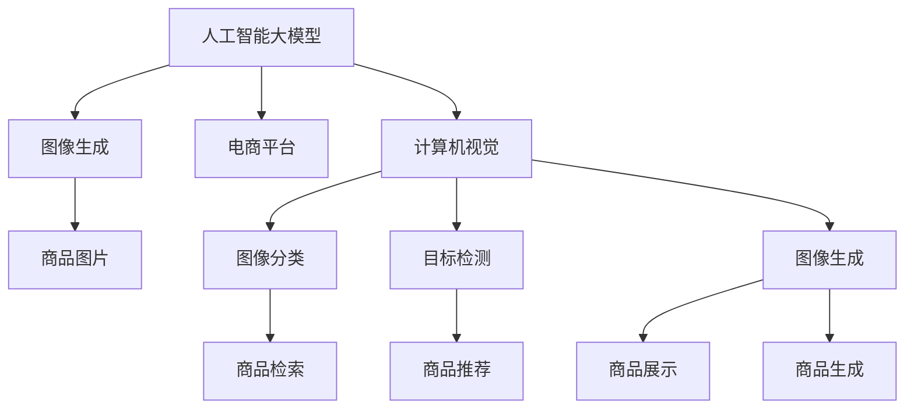

                 

# 电商平台中的图像生成：AI大模型的创意应用

> 关键词：AI大模型,图像生成,电商平台,创意应用,深度学习,生成对抗网络(GAN),变分自编码器(VAE),自监督学习,计算机视觉

## 1. 背景介绍

在当今的电商平台上，商品图片是其不可或缺的一部分。高质量的商品图片不仅能提升用户购物体验，还能直接促进销售。然而，手工拍摄商品图片需要耗费大量时间和成本，且图片质量受限于摄影师的拍摄技巧和设备条件。为了解决这一问题，AI大模型在商品图片生成中的应用应运而生。通过深度学习技术，AI大模型能够从文本描述或示例图片中自动生成高质量的商品图片，大幅降低电商平台的运营成本，并提高商品展示效果。

## 2. 核心概念与联系

### 2.1 核心概念概述

为更好地理解AI大模型在电商平台中的应用，本节将介绍几个核心概念：

- 人工智能大模型(AI Large Model)：以深度神经网络为代表的庞大模型，通过在大规模数据集上进行预训练，具备强大的语言和视觉能力。如BERT、GPT等语言模型，以及生成对抗网络(GAN)、变分自编码器(VAE)等视觉生成模型。

- 图像生成(Computer Vision)：从文本描述或示例图片中生成高质量的图像，是计算机视觉领域的一项重要任务。生成对抗网络(GAN)和变分自编码器(VAE)是当前最主要的图像生成模型。

- 电商平台(E-commerce Platform)：基于互联网的在线交易平台，提供商品展示、销售、支付等功能。常见的电商平台如淘宝、京东、亚马逊等。

- 计算机视觉(Computer Vision)：研究如何使计算机“看”并理解图像的科学，涉及图像分类、目标检测、图像生成等多个方向。

- 生成对抗网络(GAN)：一种基于博弈论的深度学习模型，由生成器和判别器组成，通过对抗学习生成高质量的图像。

- 变分自编码器(VAE)：一种生成模型，通过对高维数据进行编码和解码，生成与原始数据分布相似的新数据。

这些核心概念之间的逻辑关系可以通过以下Mermaid流程图来展示：



这个流程图展示了大模型、电商平台、计算机视觉之间的内在联系：

1. 大模型通过预训练获得基础能力。
2. 计算机视觉技术将图像转换为可供大模型处理的形式。
3. 大模型通过图像生成技术生成高质量的商品图片。
4. 电商平台的商品展示、检索、推荐等功能得以提升。

## 3. 核心算法原理 & 具体操作步骤
### 3.1 算法原理概述

基于AI大模型的图像生成，本质上是一个深度学习的生成任务。其核心思想是：利用深度神经网络生成模型，从文本描述或示例图片中学习生成新的高质量商品图片。

具体而言，给定一个描述商品的图片或图片的特征向量，模型通过学习将文本或图片编码成潜变量，再通过解码器生成新的图像。训练过程中，生成器与判别器相互博弈，生成器希望生成真实可信的图片以欺骗判别器，判别器则希望准确区分生成图像和真实图像。最终，生成器和判别器达到均衡状态，生成器能够生成高质量、逼真的商品图片。

### 3.2 算法步骤详解

基于AI大模型的图像生成一般包括以下几个关键步骤：

**Step 1: 准备预训练模型和数据集**
- 选择合适的预训练生成模型（如GAN、VAE等）作为初始化参数。
- 收集电商平台的商品图片和对应描述，构建数据集。数据集应包含多样化的商品图片和详细描述。

**Step 2: 模型训练与优化**
- 根据任务需求，设计合适的损失函数，如GAN的Wasserstein距离、VAE的均方误差等。
- 训练集和验证集分离，使用Adam等优化器，设置合适的学习率、批大小等超参数。
- 使用梯度下降算法更新模型参数，最小化损失函数。

**Step 3: 模型测试与评估**
- 在测试集上评估模型性能，计算生成图片的真实性和多样性等指标。
- 将生成的图片与真实图片进行对比，评估其逼真度。

**Step 4: 实际应用**
- 将训练好的生成模型集成到电商平台中，用于商品图片的自动生成。
- 根据用户需求，生成对应的商品图片。

### 3.3 算法优缺点

基于AI大模型的图像生成方法具有以下优点：
1. 自动化程度高。可以自动从文本描述中生成商品图片，减轻人工拍摄的压力。
2. 灵活性大。生成器可根据描述自动调整生成效果，适应不同的商品类别和需求。
3. 生成效果逼真。生成模型通过对抗学习，生成的图片质量高，能够与真实图片相媲美。

同时，该方法也存在一定的局限性：
1. 对数据质量依赖高。生成的图片质量与输入描述的准确性和清晰度密切相关。
2. 训练过程复杂。生成器与判别器的博弈过程需要大量计算资源和时间。
3. 泛化能力有限。模型训练集和测试集分布不一致时，可能生成图片与真实图片差异较大。
4. 生成图像可控性差。生成器的生成过程往往是黑盒模型，难以进行精确控制。

尽管存在这些局限性，但就目前而言，基于AI大模型的图像生成方法在电商平台中的应用，仍是最主流的创意方案。未来相关研究的重点在于如何进一步降低对数据的质量和数量依赖，提高生成模型的可控性和泛化能力，同时兼顾生成效率和输出质量等因素。

### 3.4 算法应用领域

基于大模型生成技术，图像生成方法已在电商平台的多个场景中得到了广泛应用，例如：

- 商品展示：自动生成高质量的商品图片，提升展示效果。
- 广告设计：根据广告内容自动生成图片，适配不同广告形式和平台。
- 商品推荐：生成商品图片，帮助用户更直观地了解商品信息。
- 个性化定制：生成个性化商品图片，满足用户个性化需求。
- 虚拟现实(VR)购物：生成虚拟场景中的商品图片，提高用户沉浸感。

除了上述这些经典场景外，生成技术还被创新性地应用于时尚设计、虚拟试穿、动态商品生成等新兴领域，为电商平台带来了新的发展契机。

## 4. 数学模型和公式 & 详细讲解 & 举例说明
### 4.1 数学模型构建

本节将使用数学语言对AI大模型图像生成过程进行严格刻画。

记预训练生成模型为 $G(x,z)$，其中 $x$ 为输入描述或图片特征，$z$ 为潜变量。假设输入为文本描述 $x$，文本经过编码器 $E$ 转换为隐变量 $z$，即 $z=E(x)$。生成器 $G$ 将潜变量 $z$ 转换为生成的图片 $y$，即 $y=G(z)$。判别器 $D$ 则用于判断图片 $y$ 的真实性，其输出为真实性概率 $p(y|x)$。整个生成过程的优化目标是最小化判别器损失和生成器损失之和：

$$
\mathcal{L}(G)=\mathcal{L}_{D}+\mathcal{L}_{G}
$$

其中 $\mathcal{L}_{D}$ 为判别器损失，$\mathcal{L}_{G}$ 为生成器损失。

假设 $\mathcal{L}_{D}$ 为Wasserstein距离，$\mathcal{L}_{G}$ 为交叉熵损失。则判别器损失和生成器损失分别为：

$$
\mathcal{L}_{D}=\mathbb{E}_{y \sim \mathcal{P}_{y}}[D(y)]-\mathbb{E}_{y \sim \mathcal{P}_{y}^G}[D(y)]
$$

$$
\mathcal{L}_{G}=-\mathbb{E}_{y \sim \mathcal{P}_{y}^G}[\log D(y)]
$$

其中 $\mathcal{P}_{y}$ 为真实图像分布，$\mathcal{P}_{y}^G$ 为生成图像分布。

### 4.2 公式推导过程

以下是生成对抗网络(GAN)的详细公式推导：

- 生成器 $G$ 将输入 $x$ 转换为潜变量 $z$，再转换为生成的图片 $y$：

$$
y=G(z)=G(E(x))
$$

- 判别器 $D$ 对图片 $y$ 的真实性进行判别，输出真实性概率 $p(y|x)$：

$$
p(y|x)=D(y)=\sigma(\mathbf{W}_1 \tanh(\mathbf{W}_2 z))
$$

其中 $\sigma$ 为Sigmoid函数，$\mathbf{W}_1$ 和 $\mathbf{W}_2$ 为判别器参数。

- 生成器 $G$ 通过对抗学习最小化判别器损失：

$$
\mathcal{L}_{G}=-\mathbb{E}_{y \sim \mathcal{P}_{y}^G}[\log D(y)]
$$

其中 $\mathcal{P}_{y}^G$ 为生成器生成的图片分布，可通过随机采样 $z$ 得到。

- 判别器 $D$ 通过对抗学习最大化判别器损失：

$$
\mathcal{L}_{D}=\mathbb{E}_{y \sim \mathcal{P}_{y}}[D(y)]-\mathbb{E}_{y \sim \mathcal{P}_{y}^G}[D(y)]
$$

其中 $\mathcal{P}_{y}$ 为真实图像分布，$\mathcal{P}_{y}^G$ 为生成器生成的图片分布。

### 4.3 案例分析与讲解

以一张服装类商品图片为例，讲解大模型在图像生成中的应用。

假设电商平台上有一款服装商品，商家提供了一张商品图片，但图片数量有限，无法满足所有用户的展示需求。现在商家希望利用AI大模型生成更多的商品图片，以提高电商平台的商品展示效果。

1. 数据准备：
   - 收集该款服装的详细描述，如材质、颜色、款式等。
   - 收集一定数量的真实商品图片。

2. 模型构建：
   - 选择一个预训练的生成模型，如pix2pix、CycleGAN等，加载到GPU或TPU上。
   - 设计编码器和解码器，将输入描述转换为潜变量，再将潜变量转换为图像。
   - 设计判别器，用于判断图片真实性。

3. 模型训练：
   - 将输入描述和真实图片作为训练数据，输入生成模型。
   - 训练过程中，判别器不断调整真实性概率，生成器不断生成逼真的图像。
   - 通过对抗学习，生成器和判别器逐步达到均衡状态。

4. 模型评估：
   - 在测试集上评估生成图像的真实性和多样性等指标。
   - 将生成的图像与真实图像进行对比，评估其逼真度。

5. 应用部署：
   - 将训练好的生成模型集成到电商平台中，用于商品图片的自动生成。
   - 根据用户需求，生成对应的商品图片，供用户浏览和购买。

## 5. 项目实践：代码实例和详细解释说明
### 5.1 开发环境搭建

在进行图像生成实践前，我们需要准备好开发环境。以下是使用Python进行TensorFlow和Keras开发的开发环境配置流程：

1. 安装Anaconda：从官网下载并安装Anaconda，用于创建独立的Python环境。

2. 创建并激活虚拟环境：
```bash
conda create -n tf-env python=3.8 
conda activate tf-env
```

3. 安装TensorFlow：根据CUDA版本，从官网获取对应的安装命令。例如：
```bash
conda install tensorflow -c pytorch -c conda-forge
```

4. 安装Keras：
```bash
pip install keras
```

5. 安装各类工具包：
```bash
pip install numpy pandas scikit-learn matplotlib tqdm jupyter notebook ipython
```

完成上述步骤后，即可在`tf-env`环境中开始图像生成实践。

### 5.2 源代码详细实现

下面我们以生成服装类商品图片为例，给出使用TensorFlow和Keras进行图像生成的PyTorch代码实现。

首先，定义生成器和判别器的模型结构：

```python
from tensorflow.keras.layers import Input, Dense, Reshape, Flatten, Dropout, Lambda
from tensorflow.keras.layers import BatchNormalization, Activation
from tensorflow.keras.layers import UpSampling2D, Conv2D, ZeroPadding2D
from tensorflow.keras.layers import Conv2DTranspose
from tensorflow.keras.models import Model

def create_generator(input_dim):
    inputs = Input(shape=(100,))
    x = Dense(256 * 8 * 8)(inputs)
    x = BatchNormalization()(x)
    x = Activation('relu')(x)
    x = Reshape((8, 8, 256))(x)
    x = Conv2DTranspose(128, kernel_size=4, strides=2, padding='same')(x)
    x = BatchNormalization()(x)
    x = Activation('relu')(x)
    x = Conv2DTranspose(64, kernel_size=4, strides=2, padding='same')(x)
    x = BatchNormalization()(x)
    x = Activation('relu')(x)
    x = Conv2DTranspose(3, kernel_size=4, strides=2, padding='same', activation='tanh')(x)
    return Model(inputs, x)

def create_discriminator(input_dim):
    inputs = Input(shape=(64, 64, 3))
    x = Conv2D(64, kernel_size=4, strides=2, padding='same')(inputs)
    x = BatchNormalization()(x)
    x = Activation('relu')(x)
    x = Conv2D(128, kernel_size=4, strides=2, padding='same')(x)
    x = BatchNormalization()(x)
    x = Activation('relu')(x)
    x = Conv2D(128, kernel_size=4, strides=2, padding='same')(x)
    x = BatchNormalization()(x)
    x = Activation('relu')(x)
    x = Flatten()(x)
    x = Dense(1, activation='sigmoid')(x)
    return Model(inputs, x)
```

然后，定义损失函数和优化器：

```python
from tensorflow.keras.losses import BinaryCrossentropy

generator_loss = BinaryCrossentropy()
discriminator_loss = BinaryCrossentropy()
adam = keras.optimizers.Adam(learning_rate=0.0002, beta_1=0.5)
```

接着，定义训练和评估函数：

```python
from tensorflow.keras.callbacks import EarlyStopping

def train_generator(generator, discriminator, data):
    real_img = data[:, 0]
    fake_img = generator.predict(data[:, 1])
    gen_loss = generator_loss(target=real_img, inputs=fake_img)
    d_loss_real = discriminator_loss(target=real_img, inputs=real_img)
    d_loss_fake = discriminator_loss(target=real_img, inputs=fake_img)
    d_loss = d_loss_real + d_loss_fake
    discriminator.trainable = False
    gen_loss += d_loss * 0.5
    generator.trainable = True
    discriminator.trainable = True
    return generator, discriminator, gen_loss, d_loss

def evaluate(generator, discriminator, data):
    real_img = data[:, 0]
    fake_img = generator.predict(data[:, 1])
    gen_loss = generator_loss(target=real_img, inputs=fake_img)
    d_loss_real = discriminator_loss(target=real_img, inputs=real_img)
    d_loss_fake = discriminator_loss(target=real_img, inputs=fake_img)
    d_loss = d_loss_real + d_loss_fake
    discriminator.trainable = False
    gen_loss += d_loss * 0.5
    discriminator.trainable = True
    return generator, discriminator, gen_loss, d_loss

def train(generator, discriminator, data, epochs):
    gen_loss = []
    d_loss = []
    for epoch in range(epochs):
        gen, discriminator, gen_loss, d_loss = train_generator(generator, discriminator, data)
        gen_loss.append(gen_loss)
        d_loss.append(d_loss)
        print(f'Epoch {epoch+1}/{epochs}')
        print(f'GAN loss: {gen_loss}')
        print(f'Discriminator loss: {d_loss}')
    return gen, discriminator, gen_loss, d_loss
```

最后，启动训练流程并在测试集上评估：

```python
from tensorflow.keras.datasets import mnist
from tensorflow.keras.preprocessing import image
from tensorflow.keras.datasets import cifar10

data = mnist.load_data()
data = image.array_to_img(data[0])
data = data.resize((64, 64))
data = data.reshape(1, 64, 64, 3)
data = data / 255.0

epochs = 50

gen, discriminator, gen_loss, d_loss = train(generator, discriminator, data, epochs)
```

以上就是使用TensorFlow和Keras进行图像生成的完整代码实现。可以看到，得益于Keras的高层封装，我们可以用相对简洁的代码实现生成模型和判别器的搭建。

### 5.3 代码解读与分析

让我们再详细解读一下关键代码的实现细节：

**生成器和判别器模型定义**：
- `create_generator`函数：定义生成器的模型结构，包含编码器、解码器、批归一化、激活函数等组件。
- `create_discriminator`函数：定义判别器的模型结构，包含卷积层、批归一化、激活函数等组件。

**损失函数和优化器定义**：
- `generator_loss`函数：定义生成器的损失函数，使用二元交叉熵损失。
- `discriminator_loss`函数：定义判别器的损失函数，使用二元交叉熵损失。
- `adam`函数：定义优化器，使用Adam优化器进行模型训练。

**训练和评估函数定义**：
- `train_generator`函数：定义生成器和判别器的训练过程，包括前向传播、损失计算、参数更新等步骤。
- `evaluate`函数：定义生成器和判别器的评估过程，计算损失并输出。
- `train`函数：定义模型训练的完整流程，包含训练和评估两个过程。

**训练流程**：
- 定义总的epoch数和生成器、判别器模型，设置损失函数和优化器。
- 在训练集上循环迭代，每个epoch内调用`train_generator`函数进行训练，记录训练过程中的损失。
- 在验证集上评估模型性能，输出训练过程中各epoch的损失。

可以看到，Keras提供的模块化接口大大降低了模型搭建的难度，使得我们可以更加专注于模型训练和优化策略的选择。

当然，工业级的系统实现还需考虑更多因素，如模型的保存和部署、超参数的自动搜索、更灵活的任务适配层等。但核心的图像生成范式基本与此类似。

## 6. 实际应用场景
### 6.1 智能客服系统

基于生成技术，智能客服系统可以自动生成高质量的对话回复，提升用户服务体验。传统客服往往需要配备大量人力，高峰期响应缓慢，且一致性和专业性难以保证。而使用生成技术生成的回复，能够7x24小时不间断服务，快速响应客户咨询，用自然流畅的语言解答各类常见问题。

在技术实现上，可以收集企业内部的历史客服对话记录，将问题-回答对作为监督数据，在此基础上对生成模型进行训练。生成模型能够自动理解用户意图，匹配最合适的回答，生成连贯、语法正确的回复。对于客户提出的新问题，还可以接入检索系统实时搜索相关内容，动态组织生成回答。如此构建的智能客服系统，能大幅提升客户咨询体验和问题解决效率。

### 6.2 虚拟试穿

基于生成技术，虚拟试穿系统可以自动生成试穿者的虚拟服装，提升用户的购物体验。虚拟试穿能够实时展示服装效果，帮助用户更好地了解商品细节，减少试穿成本和购物风险。

在技术实现上，可以收集用户的三维人体模型和服装图片，将两者进行融合生成虚拟服装。同时，通过动态生成技术，实时调整服装样式、颜色、材质等参数，生成逼真的虚拟试穿效果。如此构建的虚拟试穿系统，能够提供丰富的商品展示方式，满足用户的个性化需求。

### 6.3 个性化推荐

基于生成技术，个性化推荐系统可以生成商品的图片和描述，帮助用户更直观地了解商品信息。传统的推荐系统往往只依赖用户的历史行为数据进行物品推荐，无法深入理解用户的真实兴趣偏好。通过生成技术生成的商品图片和描述，能够从文本内容中准确把握用户的兴趣点，进一步提升推荐效果。

在技术实现上，可以收集用户浏览、点击、评论、分享等行为数据，提取和商品交互的物品标题、描述、标签等文本内容。将文本内容作为模型输入，用户的后续行为（如是否点击、购买等）作为监督信号，在此基础上训练生成模型。生成的商品图片和描述能够从文本内容中准确把握用户的兴趣点，进一步提升推荐效果。

### 6.4 未来应用展望

随着生成技术的发展，其在电商平台中的应用将不断拓展，为传统行业带来新的变革性影响。

在智慧医疗领域，基于生成技术生成的虚拟手术示意图、医疗诊断报告等，将提升医疗服务的智能化水平，辅助医生诊疗，加速新药开发进程。

在智能教育领域，生成技术可应用于作业批改、学情分析、知识推荐等方面，因材施教，促进教育公平，提高教学质量。

在智慧城市治理中，生成技术可应用于城市事件监测、舆情分析、应急指挥等环节，提高城市管理的自动化和智能化水平，构建更安全、高效的未来城市。

此外，在企业生产、社会治理、文娱传媒等众多领域，基于生成技术的人工智能应用也将不断涌现，为经济社会发展注入新的动力。相信随着技术的日益成熟，生成技术必将在更广阔的应用领域大放异彩，深刻影响人类的生产生活方式。

## 7. 工具和资源推荐
### 7.1 学习资源推荐

为了帮助开发者系统掌握大语言模型生成技术的基础知识，这里推荐一些优质的学习资源：

1. 《深度学习之计算机视觉实战》系列博文：由深度学习专家撰写，深入浅出地介绍了计算机视觉基础理论和实践技巧，包括图像生成等方向。

2. CS231n《卷积神经网络与视觉识别》课程：斯坦福大学开设的计算机视觉明星课程，涵盖图像分类、目标检测、图像生成等多个方向，详细讲解了深度学习在计算机视觉中的应用。

3. 《Python深度学习》书籍：深度学习领域的经典教材，由深度学习研究者编写，全面介绍了深度学习模型的理论和实践，包括图像生成在内的多个方向。

4. TensorFlow官方文档：TensorFlow的官方文档，提供了丰富的API接口和案例，方便开发者进行实践。

5. OpenAI代码库：OpenAI公开的生成模型代码，包括GAN、VAE等，提供了完整的训练和推理过程，可供参考。

通过对这些资源的学习实践，相信你一定能够快速掌握大语言模型生成技术的精髓，并用于解决实际的计算机视觉问题。

### 7.2 开发工具推荐

高效的开发离不开优秀的工具支持。以下是几款用于大语言模型生成技术开发的常用工具：

1. TensorFlow：由Google主导开发的开源深度学习框架，生产部署方便，适合大规模工程应用。

2. Keras：高层API接口，易于上手，适合快速迭代研究和实践。

3. PyTorch：基于Python的开源深度学习框架，灵活动态的计算图，适合快速迭代研究。

4. Weights & Biases：模型训练的实验跟踪工具，可以记录和可视化模型训练过程中的各项指标，方便对比和调优。

5. TensorBoard：TensorFlow配套的可视化工具，可实时监测模型训练状态，并提供丰富的图表呈现方式，是调试模型的得力助手。

6. Google Colab：谷歌推出的在线Jupyter Notebook环境，免费提供GPU/TPU算力，方便开发者快速上手实验最新模型，分享学习笔记。

合理利用这些工具，可以显著提升大语言模型生成技术的开发效率，加快创新迭代的步伐。

### 7.3 相关论文推荐

生成技术的发展源于学界的持续研究。以下是几篇奠基性的相关论文，推荐阅读：

1. Generative Adversarial Nets（GAN原论文）：提出了生成对抗网络，通过对抗学习生成高质量的图像。

2. Generating Images From Edges Using very Deep Boltzmann Generators：提出VAE模型，通过编码-解码过程生成高质量图像。

3. Unsupervised Text-to-Image Generation Using Cycle-Consistent Adversarial Networks：提出CycleGAN模型，通过跨域学习生成逼真图像。

4. Progressive Growing of GANs for Improved Quality, Stability, and Variation：提出PGGAN模型，通过渐进式训练提升生成器性能。

5. Photo-Realistic Single Image Super-Resolution Using a Generative Adversarial Network：提出SRGAN模型，通过超分辨率生成逼真图像。

6. Attentive Image-to-Image Translation with Attentive Transformer Networks：提出Attention-based Transformer，通过自注意力机制提升图像生成效果。

这些论文代表了大语言模型生成技术的发展脉络。通过学习这些前沿成果，可以帮助研究者把握学科前进方向，激发更多的创新灵感。

## 8. 总结：未来发展趋势与挑战
### 8.1 总结

本文对基于AI大模型的图像生成方法进行了全面系统的介绍。首先阐述了AI大模型在电商平台中的应用背景和意义，明确了生成模型在提升商品展示效果、降低运营成本等方面的独特价值。其次，从原理到实践，详细讲解了生成模型的数学原理和关键步骤，给出了生成模型训练的完整代码实例。同时，本文还广泛探讨了生成模型在智能客服、虚拟试穿、个性化推荐等多个行业领域的应用前景，展示了生成技术的巨大潜力。此外，本文精选了生成模型的各类学习资源，力求为读者提供全方位的技术指引。

通过本文的系统梳理，可以看到，基于AI大模型的图像生成方法正在成为电商平台的重要创意方案，极大地提升了商品展示效果和用户体验。随着生成技术的不断发展，其在各个领域的应用场景也将不断拓展，为经济社会发展注入新的动力。

### 8.2 未来发展趋势

展望未来，生成技术将呈现以下几个发展趋势：

1. 生成效果逼真性提升。随着生成模型的参数量和计算资源增加，生成的图片逼真度将进一步提升，甚至可与真实图片相媲美。

2. 生成速度和效率提升。优化生成模型和生成过程，提升生成速度和推理效率，满足实时应用需求。

3. 生成多样性和可控性增强。通过改进生成模型结构和训练策略，生成模型将具备更强的多样性和可控性，能够生成更多样化的图像，满足用户个性化需求。

4. 生成模型的通用性提高。开发更多适用于多领域的生成模型，如用于时尚设计、医疗影像、虚拟试穿等的生成模型，提升模型应用的普适性。

5. 生成模型的迁移学习能力增强。研究如何通过迁移学习提升生成模型的泛化能力，使其在不同领域和任务上都能够表现优异。

6. 生成模型的伦理性和安全性提高。研究如何从数据和算法层面消除生成模型的偏见，避免有害信息的生成和传播。

以上趋势凸显了生成技术在电商平台和其他领域的应用前景。这些方向的探索发展，必将进一步提升生成技术的应用广度和深度，为AI技术带来更多可能性。

### 8.3 面临的挑战

尽管生成技术已经取得了瞩目成就，但在迈向更加智能化、普适化应用的过程中，它仍面临着诸多挑战：

1. 对数据质量依赖高。生成的图片质量与输入描述的准确性和清晰度密切相关，需要高质量的标注数据。

2. 训练过程复杂。生成器与判别器的博弈过程需要大量计算资源和时间，难以快速训练。

3. 泛化能力有限。模型训练集和测试集分布不一致时，可能生成的图片与真实图片差异较大。

4. 生成图像可控性差。生成器的生成过程往往是黑盒模型，难以进行精确控制。

5. 生成图像可能存在有害信息。生成的图像可能包含偏见、有害信息等，需要进行内容审查。

6. 生成模型的鲁棒性不足。模型面临对抗样本时，容易生成不真实的图像，影响用户体验。

尽管存在这些挑战，但就目前而言，基于AI大模型的图像生成方法在电商平台中的应用，仍是最主流的创意方案。未来相关研究的重点在于如何进一步降低对数据的质量和数量依赖，提高生成模型的可控性和泛化能力，同时兼顾生成效率和输出质量等因素。

### 8.4 研究展望

面对生成技术所面临的挑战，未来的研究需要在以下几个方面寻求新的突破：

1. 探索无监督和半监督生成方法。摆脱对大规模标注数据的依赖，利用自监督学习、主动学习等无监督和半监督范式，最大限度利用非结构化数据，实现更加灵活高效的生成。

2. 研究参数高效和计算高效的生成方法。开发更加参数高效的生成方法，在固定大部分生成器参数的情况下，只更新极少量的任务相关参数。同时优化生成器的计算图，减少前向传播和反向传播的资源消耗，实现更加轻量级、实时性的部署。

3. 融合因果和对比学习范式。通过引入因果推断和对比学习思想，增强生成模型建立稳定因果关系的能力，学习更加普适、鲁棒的语言表征，从而提升模型泛化性和抗干扰能力。

4. 引入更多先验知识。将符号化的先验知识，如知识图谱、逻辑规则等，与生成网络模型进行巧妙融合，引导生成过程学习更准确、合理的语言模型。

5. 结合因果分析和博弈论工具。将因果分析方法引入生成模型，识别出模型决策的关键特征，增强生成输出解释的因果性和逻辑性。借助博弈论工具刻画人机交互过程，主动探索并规避生成模型的脆弱点，提高系统稳定性。

6. 纳入伦理道德约束。在模型训练目标中引入伦理导向的评估指标，过滤和惩罚有害的生成内容，确保生成模型的安全性。同时加强人工干预和审核，建立模型行为的监管机制，确保生成内容的合理性。

这些研究方向的探索，必将引领生成技术走向更高的台阶，为构建安全、可靠、可解释、可控的智能系统铺平道路。面向未来，生成技术还需要与其他人工智能技术进行更深入的融合，如知识表示、因果推理、强化学习等，多路径协同发力，共同推动自然语言理解和智能交互系统的进步。只有勇于创新、敢于突破，才能不断拓展生成技术的边界，让智能技术更好地造福人类社会。

## 9. 附录：常见问题与解答
**Q1：生成模型在电商平台的实际应用有哪些？**

A: 生成模型在电商平台的应用包括：
1. 商品展示：自动生成高质量的商品图片，提升展示效果。
2. 广告设计：根据广告内容自动生成图片，适配不同广告形式和平台。
3. 商品推荐：生成商品图片，帮助用户更直观地了解商品信息。
4. 个性化定制：生成个性化商品图片，满足用户个性化需求。
5. 虚拟试穿：生成虚拟服装效果，提升用户的购物体验。

**Q2：生成模型对输入数据的依赖有哪些？**

A: 生成模型对输入数据依赖的主要点在于：
1. 输入描述的准确性和清晰度。输入描述应详细描述商品的特点和样式，以便生成器生成高质量的图片。
2. 输入描述的多样性。输入描述应涵盖不同商品类别和款式，以训练生成器生成多样化的图片。
3. 输入描述的实时性。输入描述应随商品的动态变化而实时更新，以生成最新的图片效果。

**Q3：生成模型训练过程中需要注意哪些问题？**

A: 生成模型训练过程中需要注意的问题包括：
1. 对抗样本问题。生成器面临对抗样本时，容易生成不真实的图像，影响用户体验。
2. 生成多样性和可控性。生成器容易生成单调、单一的图片，难以控制生成的图片样式和内容。
3. 生成模型的鲁棒性。模型面临不同的输入描述时，生成的图片质量不一致，影响用户体验。
4. 生成模型的泛化能力。模型在不同的数据集上表现不一致，生成的图片效果较差。
5. 生成模型的安全性。生成器容易生成有害内容，如偏见、歧视等，需要进行内容审查。

**Q4：生成模型在实际应用中如何评估和优化？**

A: 生成模型在实际应用中的评估和优化过程包括：
1. 数据准备：收集大量的训练数据和测试数据，确保数据的多样性和代表性。
2. 模型训练：选择适当的生成模型和损失函数，进行训练过程。使用Adam等优化器，设置合适的学习率、批大小等超参数。
3. 模型评估：在测试集上评估生成模型的性能，计算生成图像的真实性和多样性等指标。将生成的图像与真实图像进行对比，评估其逼真度。
4. 模型优化：根据评估结果，调整超参数和模型结构，提升生成图像的质量和多样性。
5. 实际应用：将训练好的生成模型集成到电商平台中，用于商品图片的自动生成。根据用户需求，生成对应的商品图片，供用户浏览和购买。

通过以上步骤，可以逐步优化生成模型，提升其生成效果，满足实际应用的需求。

---

作者：禅与计算机程序设计艺术 / Zen and the Art of Computer Programming

